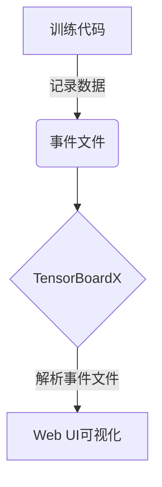

# 从零开始大模型开发与微调：可视化组件tensorboardX的简介与安装

## 1. 背景介绍

### 1.1. 大模型的兴起
近年来,大型神经网络模型在自然语言处理、计算机视觉等领域取得了令人瞩目的成就。模型规模的不断扩大成为推动人工智能发展的重要动力。随着算力和数据的持续增长,训练大规模模型成为可能。

### 1.2. 大模型训练的挑战
然而,训练大模型面临诸多挑战:

- 计算资源需求巨大
- 收敛速度缓慢
- 模型复杂,难以调试

### 1.3. 可视化工具的重要性
为了解决上述挑战,可视化工具在大模型开发中扮演着重要角色。它们为开发者提供了监控训练过程、分析模型行为的窗口,有助于加快调试和优化的速度。

## 2. 核心概念与联系

### 2.1. TensorFlow简介
TensorFlow是Google开源的端到端机器学习平台,支持从数据导入到模型训练、评估和部署的全流程。它具有高度灵活性和可扩展性,广泛应用于生产环境。

### 2.2. TensorBoard介绍
TensorBoard是TensorFlow自带的可视化工具套件,用于可视化TensorFlow程序运行时的量测数据。它支持多种可视化功能,如显示计算图、绘制量测数据的曲线图等。

### 2.3. TensorBoardX
TensorBoardX是一个开源的TensorBoard替代品,由PyTorch团队开发。它与TensorBoard的API兼容,但提供了更多功能和更好的用户体验。

## 3. 核心算法原理具体操作步骤

### 3.1. TensorBoardX工作原理
TensorBoardX通过记录训练过程中的标量、图像、计算图等数据,将这些数据写入事件文件(event file)。当启动TensorBoardX时,它会解析事件文件,并在Web UI中以可视化的形式呈现这些数据。



### 3.2. 安装TensorBoardX
TensorBoardX可以通过pip轻松安装:

```bash
pip install tensorboardX
```

### 3.3. 在代码中使用TensorBoardX
以下是在PyTorch代码中使用TensorBoardX的基本步骤:

1. 导入必要的模块
```python
from torch.utils.tensorboard import SummaryWriter
```

2. 创建SummaryWriter实例
```python
writer = SummaryWriter('runs/experiment_1')
```

3. 记录标量
```python
for epoch in range(100):
    ...
    writer.add_scalar('Train/Loss', loss, epoch)
```

4. 记录图像
```python
img = ...
writer.add_image('Image', img, epoch)
```

5. 记录计算图
```python
writer.add_graph(model, input_to_model)
```

6. 关闭SummaryWriter
```python
writer.close()
```

7. 启动TensorBoardX
```bash
tensorboard --logdir=runs
```

## 4. 数学模型和公式详细讲解举例说明

在深度学习中,我们通常使用损失函数(Loss Function)来评估模型的预测结果与真实标签之间的差异。一种常用的损失函数是均方误差(Mean Squared Error, MSE):

$$\text{MSE}(y, \hat{y}) = \frac{1}{n} \sum_{i=1}^{n} (y_i - \hat{y}_i)^2$$

其中:
- $y$是真实标签
- $\hat{y}$是模型预测值
- $n$是样本数量

均方误差反映了预测值与真实值之间的平方差的平均值。我们的目标是通过训练,使得模型的预测值尽可能接近真实值,从而最小化均方误差。

以线性回归为例,给定一组数据点$(x_i, y_i)$,我们希望找到一条最佳拟合直线$\hat{y} = wx + b$,使得均方误差最小:

$$\min_{w, b} \frac{1}{n} \sum_{i=1}^{n} (y_i - (wx_i + b))^2$$

通过梯度下降等优化算法,我们可以迭代地更新模型参数$w$和$b$,直到损失函数收敛。

## 5. 项目实践: 代码实例和详细解释说明

让我们通过一个简单的线性回归示例,了解如何在PyTorch中使用TensorBoardX。

### 5.1. 导入必要的模块

```python
import torch
import torch.nn as nn
from torch.utils.tensorboard import SummaryWriter
```

### 5.2. 生成模拟数据

```python
# 生成模拟数据
x = torch.randn(100, 1) * 10
y = x * 3 + torch.randn(100, 1) * 2
```

### 5.3. 定义线性回归模型

```python
# 定义线性回归模型
model = nn.Linear(1, 1)
```

### 5.4. 定义损失函数和优化器

```python
# 定义损失函数和优化器
criterion = nn.MSELoss()
optimizer = torch.optim.SGD(model.parameters(), lr=0.01)
```

### 5.5. 训练模型并记录数据

```python
# 创建SummaryWriter实例
writer = SummaryWriter('runs/linear_regression')

# 训练模型
for epoch in range(100):
    optimizer.zero_grad()
    outputs = model(x)
    loss = criterion(outputs, y)
    loss.backward()
    optimizer.step()

    # 记录损失值
    writer.add_scalar('Train/Loss', loss.item(), epoch)

# 记录模型计算图
writer.add_graph(model, x)
writer.close()
```

### 5.6. 启动TensorBoardX

在终端中运行以下命令,启动TensorBoardX:

```bash
tensorboard --logdir=runs
```

然后在浏览器中访问http://localhost:6006,即可查看可视化结果。

## 6. 实际应用场景

TensorBoardX在以下场景中发挥着重要作用:

- **模型调试**: 通过可视化损失值、准确率等指标,帮助开发者快速发现并解决模型训练过程中的问题。
- **模型比较**: 可以同时记录和可视化多个模型的训练过程,方便进行对比和选择最佳模型。
- **超参数调优**: 可视化不同超参数设置下的模型表现,辅助超参数搜索和调优。
- **团队协作**: TensorBoardX提供了Web UI,方便团队成员远程查看和分析模型训练情况。

## 7. 工具和资源推荐

- **TensorFlow官方文档**: https://www.tensorflow.org/tensorboard
- **PyTorch官方文档**: https://pytorch.org/docs/stable/tensorboard.html
- **TensorBoardX GitHub仓库**: https://github.com/lanpa/tensorboardX

## 8. 总结: 未来发展趋势与挑战

### 8.1. 发展趋势

- **可视化能力增强**: 未来的可视化工具将提供更丰富的可视化功能,如3D模型可视化、注意力可视化等,帮助开发者更深入地理解模型行为。
- **集成度提高**: 可视化工具将与开发环境、模型管理平台等更紧密集成,提供无缝的开发体验。
- **智能化分析**: 可视化工具将融入更多智能化分析功能,如自动异常检测、性能瓶颈分析等,进一步提高开发效率。

### 8.2. 挑战

- **大规模数据可视化**: 随着模型和数据集规模的不断增长,如何高效地可视化海量数据成为一大挑战。
- **多模态数据可视化**: 未来的模型将处理多种模态数据(如文本、图像、视频等),如何统一可视化不同模态数据也是一个挑战。
- **可解释性**: 提高模型可解释性是当前人工智能领域的重点,可视化工具在此方面也需要做出贡献。

## 9. 附录: 常见问题与解答

### 9.1. TensorBoardX与TensorBoard有何区别?

TensorBoardX是TensorBoard的一个替代品,由PyTorch团队开发。它与TensorBoard的API兼容,但提供了更好的用户体验和更多功能,如支持PyTorch的新特性、更丰富的可视化选项等。

### 9.2. 如何在Google Colab中使用TensorBoardX?

在Google Colab中使用TensorBoardX需要一些额外的步骤。首先,需要安装TensorBoardX:

```
!pip install tensorboardX
```

然后,在训练代码中记录数据时,需要将日志文件写入Google Colab的临时存储区:

```python
import os
from torch.utils.tensorboard import SummaryWriter

logdir = '/content/runs'
os.makedirs(logdir, exist_ok=True)
writer = SummaryWriter(logdir)
```

最后,在训练结束后,需要启动TensorBoard并将其输出重定向到notebook:

```
%load_ext tensorboard
%tensorboard --logdir /content/runs
```

### 9.3. 如何记录自定义数据?

除了标量、图像和计算图之外,TensorBoardX还支持记录自定义数据。例如,我们可以记录embeddings:

```python
import torch.nn as nn

# 定义embedding层
embedding = nn.Embedding(10, 5)

# 假设我们有一些输入数据
features = torch.randint(0, 10, (32,))

# 记录embeddings
writer.add_embedding(embedding(features))
```

这种功能为可视化提供了更大的灵活性,有助于满足不同场景的需求。

作者: 禅与计算机程序设计艺术 / Zen and the Art of Computer Programming