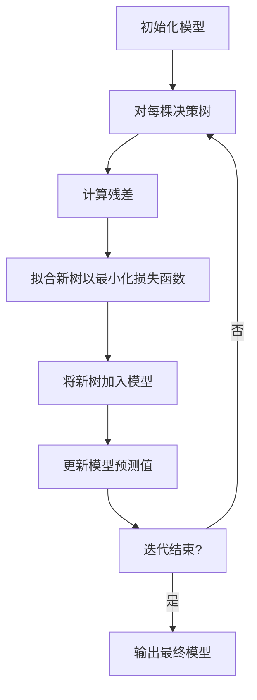

# 决策树与深度学习的融合:XGBoost算法揭秘

## 1.背景介绍

### 1.1 机器学习发展简史

机器学习作为人工智能的一个重要分支,已经存在了几十年的历史。早期的机器学习算法主要集中在经典的统计学习方法,如线性回归、逻辑回归、决策树等。这些传统机器学习算法在解决许多现实问题时表现出色,但也存在一些缺陷和局限性。

### 1.2 深度学习的兴起

21世纪初,随着计算能力的飞速提升和大数据时代的到来,深度学习逐渐兴起并取得了令人瞩目的成就。深度学习能够自动从海量数据中学习特征表示,极大地推动了计算机视觉、自然语言处理等领域的发展。然而,深度学习模型也面临着黑盒操作、可解释性差、对异常数据敏感等挑战。

### 1.3 集成学习的重要性

为了结合不同算法的优势,提升机器学习系统的泛化能力,集成学习(Ensemble Learning)应运而生。集成学习通过构建并结合多个学习器来完成学习任务,从而获得比单一学习器更有力的预测性能。

## 2.核心概念与联系

### 2.1 决策树

决策树是一种常用的监督学习算法,它通过递归地构建决策规则来对数据进行分类或回归。决策树具有可解释性强、可视化直观等优点,但也存在过拟合、对数据扰动敏感等缺陷。

### 2.2 梯度提升树(GBDT)

梯度提升树(Gradient Boosting Decision Tree)是一种强大的集成学习算法,它通过迭代地构建决策树,并将它们叠加形成强学习器。GBDT通过减小损失函数的负梯度来训练新的决策树,从而不断提高模型的预测能力。

### 2.3 XGBoost算法

XGBoost(Extreme Gradient Boosting)是GBDT算法的一种高效实现,它在算法和系统层面进行了多方面的优化,显著提升了计算速度和模型性能。XGBoost已广泛应用于各种机器学习任务,并在多个竞赛中表现出色。

### 2.4 深度学习与XGBoost的融合

尽管深度学习在特征提取方面具有独特的优势,但对于结构化数据或存在异常值的数据,传统机器学习算法如XGBoost仍有一席之地。通过将深度学习与XGBoost相结合,可以充分发挥两者的长处,构建更加强大的混合模型。

## 3.核心算法原理具体操作步骤

### 3.1 XGBoost算法流程

XGBoost算法的核心思想是通过构建多棵决策树,并将它们集成为一个强大的模型。算法流程如下:



1. 初始化一个简单的模型,通常是对数据取均值。
2. 对每棵决策树:
    - 计算当前模型在训练数据上的残差(实际值与预测值之差)。
    - 拟合一棵新的决策树,使其对残差的预测最小化损失函数。
    - 将这棵新树加入到模型中,并更新模型的预测值。
3. 重复上述步骤,直到满足终止条件(如最大迭代次数或损失函数收敛)。
4. 输出最终的集成模型。

### 3.2 决策树生长策略

XGBoost在生长决策树时采用了多种优化策略,包括:

1. **二阶近似**: 使用二阶泰勒展开式来近似损失函数,从而获得更精确的分裂增益计算。
2. **分裂查找**: 对特征排序后使用近似算法查找最佳分裂点,大幅减少计算量。
3. **并行处理**: 利用多线程并行生长决策树,加速训练过程。

### 3.3 正则化策略

为了防止过拟合,XGBoost在目标函数中引入了正则化项:

$$\mathrm{Obj} = \sum_{i=1}^n l(y_i, \hat{y}_i) + \sum_{k=1}^K \Omega(f_k)$$

其中:
- $l$是损失函数,用于衡量预测值与真实值的差异。
- $\Omega$是正则化项,用于控制模型的复杂度。
- $f_k$表示第$k$棵决策树。

常用的正则化策略包括:
- $L_2$正则化(Ridge): $\Omega(f) = \gamma T + \frac{1}{2}\lambda \|w\|^2$
- $L_1$正则化(Lasso): $\Omega(f) = \gamma T + \lambda \|w\|_1$

其中$T$是决策树的叶子节点数,$\gamma$和$\lambda$是超参数,控制正则化的强度。

通过正则化,XGBoost能够获得更简单且泛化性能更好的模型。

## 4.数学模型和公式详细讲解举例说明

### 4.1 目标函数

XGBoost的目标函数由两部分组成:训练损失和正则化项。

$$\mathrm{Obj} = \sum_{i=1}^n l(y_i, \hat{y}_i^{(t-1)} + f_t(x_i)) + \Omega(f_t)$$

其中:
- $l$是损失函数,例如对于回归任务可以使用平方损失$l(y, \hat{y}) = (y - \hat{y})^2$。
- $\hat{y}_i^{(t-1)}$是前$t-1$棵树的预测值之和。
- $f_t$是第$t$棵树,目标是使损失函数最小化。
- $\Omega$是正则化项,用于控制模型复杂度。

### 4.2 二阶近似

为了高效地优化目标函数,XGBoost使用了二阶泰勒展开式对损失函数进行近似:

$$l(y_i, \hat{y}_i^{(t-1)} + f_t(x_i)) \approx l(y_i, \hat{y}_i^{(t-1)}) + g_i f_t(x_i) + \frac{1}{2}h_i f_t^2(x_i)$$

其中:
- $g_i = \partial_{\hat{y}^{(t-1)}} l(y_i, \hat{y}^{(t-1)})$是损失函数关于$\hat{y}^{(t-1)}$的一阶导数。
- $h_i = \partial_{\hat{y}^{(t-1)}}^2 l(y_i, \hat{y}^{(t-1)})$是损失函数关于$\hat{y}^{(t-1)}$的二阶导数。

通过二阶近似,目标函数可以简化为:

$$\mathrm{Obj}^{(t)} \approx \sum_{i=1}^n [g_i f_t(x_i) + \frac{1}{2}h_i f_t^2(x_i)] + \Omega(f_t)$$

这种近似使得目标函数可以高效地优化,从而加快训练速度。

### 4.3 分裂增益计算

在生长决策树时,XGBoost需要计算每个特征的分裂增益,以确定最佳分裂点。对于某个特征$j$和分裂点$s$,分裂增益定义为:

$$\mathrm{Gain} = \frac{1}{2} \left[\frac{(\sum_{i\in I_L} g_i)^2}{\sum_{i\in I_L} h_i + \lambda} + \frac{(\sum_{i\in I_R} g_i)^2}{\sum_{i\in I_R} h_i + \lambda} - \frac{(\sum_{i\in I} g_i)^2}{\sum_{i\in I} h_i + \lambda}\right] - \gamma$$

其中:
- $I_L$和$I_R$分别表示左右子节点的样本集合。
- $\lambda$和$\gamma$是正则化参数,用于控制模型复杂度。

通过计算每个特征的分裂增益,XGBoost可以选择最优的分裂点,从而构建高质量的决策树。

### 4.4 XGBoost与GBDT的区别

XGBoost与传统的GBDT算法相比,在数学模型上有以下主要区别:

1. **正则化项**: XGBoost在目标函数中引入了正则化项,用于控制模型复杂度,防止过拟合。
2. **二阶近似**: XGBoost使用二阶泰勒展开式对损失函数进行近似,从而获得更精确的分裂增益计算。
3. **分裂查找算法**: XGBoost采用了更高效的分裂查找算法,大幅减少了计算量。

这些改进使得XGBoost在保持模型质量的同时,显著提高了计算效率和可扩展性。

## 5.项目实践:代码实例和详细解释说明

以下是使用Python中的XGBoost库进行二元分类任务的示例代码:

```python
import xgboost as xgb
from sklearn.datasets import make_blobs
from sklearn.model_selection import train_test_split

# 生成示例数据
X, y = make_blobs(n_samples=1000, centers=2, n_features=10, random_state=42)

# 划分训练集和测试集
X_train, X_test, y_train, y_test = train_test_split(X, y, test_size=0.2, random_state=42)

# 创建DMatrix对象
dtrain = xgb.DMatrix(X_train, label=y_train)
dtest = xgb.DMatrix(X_test, label=y_test)

# 设置参数
param = {
    'max_depth': 3,  # 树的最大深度
    'eta': 0.3,  # 学习率
    'objective': 'binary:logistic',  # 二元分类目标函数
    'eval_metric': 'logloss'  # 评估指标
}

# 训练模型
num_rounds = 100  # 迭代次数
watchlist = [(dtrain, 'train')]
model = xgb.train(param, dtrain, num_rounds, watchlist)

# 模型评估
preds = model.predict(dtest)
predictions = [round(value) for value in preds]
accuracy = sum(int(predictions[i] == y_test[i]) for i in range(len(y_test))) / float(len(y_test))
print("Accuracy: %.2f%%" % (accuracy * 100.0))
```

代码解释:

1. 使用`make_blobs`函数生成示例数据,包含10个特征和2个类别。
2. 将数据划分为训练集和测试集。
3. 创建`DMatrix`对象,用于存储训练数据和测试数据。
4. 设置XGBoost参数,包括树的最大深度、学习率、目标函数和评估指标。
5. 使用`xgb.train`函数训练模型,指定参数、训练数据和迭代次数。
6. 在测试集上评估模型,计算分类准确率。

在实际应用中,您可以根据具体任务调整参数,如正则化参数、树的数量等,以获得最佳性能。

## 6.实际应用场景

XGBoost由于其出色的性能和高效的实现,已被广泛应用于各种领域,包括但不限于:

### 6.1 金融领域

- 信用评分: 利用XGBoost对客户的信用风险进行评估和预测。
- 欺诈检测: 使用XGBoost识别和防范金融欺诈行为。
- 股票预测: 基于历史数据和市场指标,预测股票价格走势。

### 6.2 零售业

- 销售预测: 根据历史销售数据和其他影响因素,预测未来的销售额。
- 客户细分: 利用XGBoost对客户进行细分,实现个性化营销。
- 购物篮分析: 分析客户的购买模式,为商品推荐和库存管理提供支持。

### 6.3 医疗健康

- 疾病诊断: 基于患者症状和检查结果,预测疾病风险和类型。
- 药物开发: 利用XGBoost预测新药物的疗效和副作用。
- 医疗保险: 评估患者的医疗风险,为保险定价提供依据。

### 6.4 其他领域

- 网络安全: 检测和防御网络攻击和恶意软件。
- 能源领域: 预测能源需求和优化能源利用。
- 自然语言处理: 用于文本分类、情