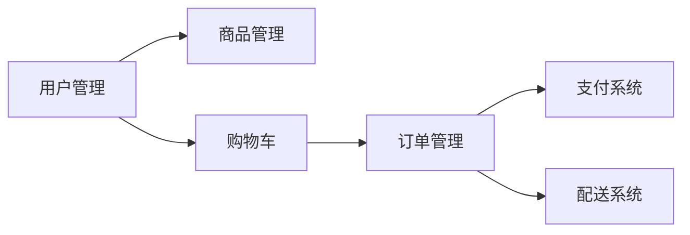

# 在线花店系统详细设计与具体代码实现

## 1.背景介绍
在当今互联网时代,电子商务已经深入各行各业。作为传统行业的花卉销售,也逐渐向线上渠道转移。开发一个功能完善、用户体验友好的在线花店系统,对于花卉商家拓展销售渠道、提升服务质量具有重要意义。本文将从需求分析、架构设计、关键技术、代码实现等方面,对在线花店系统进行深入探讨。

### 1.1 在线花店的市场现状
### 1.2 在线花店系统的价值与意义
### 1.3 在线花店系统实现的技术挑战

## 2.核心概念与联系
在线花店系统涉及到多个核心概念,包括:
- 商品管理:花卉商品的分类、属性、价格、库存等信息的管理
- 订单管理:用户下单、支付、配送、售后等订单处理流程
- 用户管理:用户注册、登录、个人信息管理等功能
- 购物车:用户在下单前暂存选择商品的容器
- 支付系统:对接第三方支付平台,处理支付流程
- 配送系统:根据用户地址,安排合适的配送方式和时间

这些概念之间的关系可以用下面的 Mermaid 图表示:



### 2.1 商品管理的数据模型设计
### 2.2 订单状态流转图
### 2.3 用户角色权限控制

## 3.核心算法原理具体操作步骤
在线花店系统中有几个核心算法,例如:
### 3.1 商品推荐算法
1. 根据用户历史浏览、购买记录,对用户偏好进行建模
2. 利用协同过滤等算法,找出相似用户喜欢的商品
3. 对用户偏好模型和协同过滤结果进行加权融合,生成推荐列表
4. 对推荐结果进行排序,选取 top N 推荐给用户

### 3.2 智能客服问答算法
1. 利用自然语言处理技术,对用户提问进行分词、词性标注、命名实体识别
2. 提取用户问题的关键词,利用问答对匹配算法与知识库问题进行匹配
3. 计算问题相似度,找出最佳匹配,返回对应答案
4. 答案不存在时,通过模板生成适当的引导语句,提示人工客服介入

### 3.3 库存预警算法
1. 定期采集商品的销量数据和库存数据
2. 利用时间序列分析模型如ARIMA,对未来一段时间的销量进行预测
3. 根据预测销量和当前库存,估算商品何时会售罄
4. 对预计售罄时间在预警阈值内的商品,生成预警提示,通知采购人员

## 4.数学模型和公式详细讲解举例说明
对于商品推荐,常用的模型有协同过滤和基于内容的推荐。以协同过滤中的用户-商品评分矩阵为例:
$$
R=
\begin{bmatrix}
r_{11} & r_{12} & \cdots & r_{1n}\
r_{21} & r_{22} & \cdots & r_{2n}\
\vdots & \vdots & \ddots & \vdots\
r_{m1} & r_{m2} & \cdots & r_{mn}\
\end{bmatrix}
$$
其中 $r_{ij}$ 表示用户 $i$ 对商品 $j$ 的评分。该矩阵通常非常稀疏,可以用SVD等方法进行降维,得到用户和商品的隐语义向量:
$$
R \approx U \Sigma V^T
$$
其中 $U$ 为用户隐语义矩阵,$V$ 为商品隐语义矩阵。

对于用户 $i$ 和商品 $j$,可以计算他们的隐语义向量 $u_i$ 和 $v_j$ 的内积,作为推荐度:
$$
\hat{r}_{ij} = u_i^T v_j
$$
推荐度较高的商品即可推荐给用户。

## 5.项目实践：代码实例和详细解释说明
下面以商品管理模块为例,给出部分核心代码实现。

### 5.1 商品实体类
```java
@Entity
@Table(name="product")
public class Product {
    @Id
    @GeneratedValue(strategy = GenerationType.IDENTITY)
    private Long id;
    private String name;
    private String description;
    private BigDecimal price;
    private Integer stock;
    //省略getter/setter
}
```
使用 JPA 注解将 Product 类映射到数据库表。

### 5.2 商品 DAO
```java
@Repository
public interface ProductDao extends JpaRepository<Product,Long> {
    //关键字搜索商品
    List<Product> findByNameContaining(String keyword);
}
```
继承 JpaRepository,可以获得常用的增删改查方法。同时可以根据方法名自动生成 SQL。

### 5.3 商品服务类
```java
@Service
public class ProductService {
    @Autowired
    private ProductDao productDao;

    @Transactional
    public Product createProduct(Product product){
        return productDao.save(product);
    }

    public List<Product> searchProducts(String keyword){
        if(StringUtils.isEmpty(keyword)){
            return productDao.findAll();
        }else{
            return productDao.findByNameContaining(keyword);
        }
    }
    //省略其他方法
}
```
将商品的业务逻辑封装在 Service 中,如创建商品、搜索商品等。

### 5.4 商品控制器
```java
@RestController
@RequestMapping("/products")
public class ProductController {
    @Autowired
    private ProductService productService;

    @PostMapping
    public Product createProduct(@RequestBody Product product){
        return productService.createProduct(product);
    }

    @GetMapping
    public List<Product> searchProducts(@RequestParam(required = false) String keyword){
        return productService.searchProducts(keyword);
    }
    //省略其他方法
}
```
提供商品管理的 Restful API,如创建、搜索商品。

## 6.实际应用场景
在线花店系统可应用于多种场景:
### 6.1 鲜花零售
用户可以浏览各种鲜花商品,根据场合、对象、预算等选择合适的花束。系统支持在线支付和配送。
### 6.2 花艺设计定制
针对婚庆、商务等对花艺要求较高的客户,提供个性化的花艺设计服务。用户可以与花艺师在线沟通,定制专属花艺。
### 6.3 节日促销
在情人节、母亲节等花卉消费旺季,举行促销活动。通过限时折扣、满额赠礼等方式,刺激用户消费。
### 6.4 会员管理
建立会员体系,记录用户的消费数据。针对高价值客户,提供专享优惠和贵宾服务,提高复购率和客单价。

## 7.工具和资源推荐
开发在线花店系统,可以使用以下工具和资源:
- 后端框架:Spring Boot、Spring Cloud等
- 前端框架:Vue、React等
- 数据库:MySQL、Redis等
- 支付平台:支付宝、微信支付等
- 地图服务:高德地图、百度地图等
- 短信平台:阿里云短信、腾讯云短信等
- 监控平台:Prometheus、Grafana等
- 开发工具:IDEA、VS Code等

## 8.总结：未来发展趋势与挑战
随着移动互联网的普及和人们生活水平的提高,在线花店有望迎来快速发展。未来的在线花店可能呈现以下趋势:
- 个性化定制:利用大数据分析用户偏好,提供智能推荐和个性化定制服务
- 新零售模式:线上下单,线下体验,实现线上线下一体化运营
- 供应链优化:与产地直接对接,减少中间环节,保证花卉品质和新鲜度
- 跨界合作:与餐饮、礼品等行业联合营销,提供一站式服务

同时,在线花店也面临一些挑战:
- 物流配送:鲜花对时效性和保鲜有较高要求,配送成本高
- 标准化难:花卉产品种类繁多,标准化生产难度大
- 同质化竞争:各大电商平台纷纷入局,竞争激烈

## 9.附录：常见问题与解答
### 9.1 如何保证花卉新鲜度?
与产地直接合作,减少中间环节;采用恒温冷链物流,全程控温;引入预售模式,按需采购。
### 9.2 在线花店如何提高客单价?
通过捆绑搭售、优惠券、会员积分等方式,引导用户增加购买;引入附加服务如贺卡、礼品等,提高订单金额。
### 9.3 在线花店如何拓展销售渠道?
入驻各大电商平台,提高曝光率;与社交平台合作,开展社交电商;利用直播、短视频等新媒体营销。

作者：禅与计算机程序设计艺术 / Zen and the Art of Computer Programming