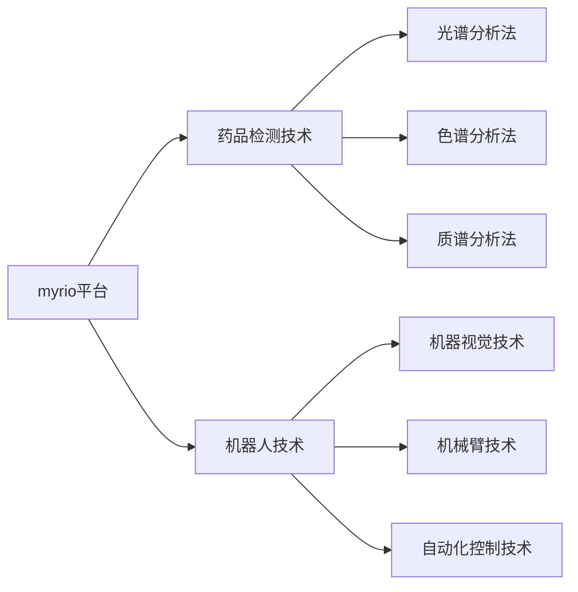

# 基于myrio的药品检测机器人

## 1.背景介绍

随着医疗行业的快速发展,药品质量检测已成为保障公众健康安全的重要环节。传统的人工抽检方式效率低下,难以满足日益增长的检测需求。因此,开发一款高效、智能的药品检测机器人势在必行。本文将探讨基于myrio平台的药品检测机器人的设计与实现。

### 1.1 药品质量检测的重要性

#### 1.1.1 保障公众健康安全
#### 1.1.2 维护医药市场秩序  
#### 1.1.3 促进医药产业健康发展

### 1.2 传统药品检测方式的局限性

#### 1.2.1 人工抽检效率低下
#### 1.2.2 检测结果主观性强
#### 1.2.3 检测成本高昂

### 1.3 智能药品检测机器人的优势

#### 1.3.1 高效快速的检测能力
#### 1.3.2 客观准确的检测结果
#### 1.3.3 低成本、高性价比

## 2.核心概念与联系

### 2.1 myrio平台简介

#### 2.1.1 myrio硬件架构
#### 2.1.2 LabVIEW编程环境
#### 2.1.3 myrio在机器人领域的应用

### 2.2 药品检测技术概述

#### 2.2.1 光谱分析法
#### 2.2.2 色谱分析法  
#### 2.2.3 质谱分析法

### 2.3 机器人技术在药品检测中的应用

#### 2.3.1 机器视觉技术
#### 2.3.2 机械臂技术
#### 2.3.3 自动化控制技术



## 3.核心算法原理具体操作步骤

### 3.1 药品外观检测算法

#### 3.1.1 图像采集与预处理
#### 3.1.2 特征提取与分析
#### 3.1.3 缺陷检测与分类

### 3.2 药品成分分析算法

#### 3.2.1 光谱数据采集与预处理  
#### 3.2.2 数据降维与特征提取
#### 3.2.3 成分识别与定量分析

### 3.3 机器人运动控制算法

#### 3.3.1 运动学建模与求解
#### 3.3.2 轨迹规划与插补  
#### 3.3.3 伺服控制与误差补偿

## 4.数学模型和公式详细讲解举例说明

### 4.1 药品外观检测模型

#### 4.1.1 图像噪声去除模型
设原始图像为 $f(x,y)$,噪声为 $n(x,y)$,则噪声图像模型为:

$$g(x,y)=f(x,y)+n(x,y)$$

常见的图像去噪方法有均值滤波、中值滤波、高斯滤波等。

#### 4.1.2 边缘检测模型
常用的边缘检测算子有Sobel、Prewitt、Laplacian等。以Sobel算子为例,其模板为:

$$G_x = \begin{bmatrix} 
-1 & 0 & +1 \
-2 & 0 & +2 \
-1 & 0 & +1 
\end{bmatrix} * A$$

$$G_y = \begin{bmatrix}
-1 & -2 & -1 \
0 & 0 & 0 \
+1 & +2 & +1
\end{bmatrix} * A$$

其中, $A$ 为图像矩阵, $G_x$ 和 $G_y$ 分别为 $x$ 和 $y$ 方向的梯度。

#### 4.1.3 形态学处理模型
形态学操作主要包括腐蚀和膨胀两种基本运算。腐蚀操作可去除图像中的噪声和细小目标,其数学模型为:

$$dst(x,y) = \min\limits_{(x',y') \in kernel}{src(x+x',y+y')}$$

膨胀操作可填充目标内的孔洞,连接断开的目标,其数学模型为:

$$dst(x,y) = \max\limits_{(x',y') \in kernel}{src(x+x',y+y')}$$

### 4.2 药品成分分析模型

#### 4.2.1 主成分分析模型
设光谱数据矩阵为 $X = [x_1, x_2, ..., x_n]^T$,其协方差矩阵为:

$$C = \frac{1}{n-1} (X-\bar{X})^T (X-\bar{X})$$

对协方差矩阵 $C$ 进行特征值分解:

$$C = U \Lambda U^T$$

其中, $\Lambda = diag(\lambda_1, \lambda_2, ..., \lambda_p)$ 为特征值矩阵, $U$ 为特征向量矩阵。取前 $k$ 个最大特征值对应的特征向量构成变换矩阵 $U_k$,则主成分为:

$$Z = X U_k$$

#### 4.2.2 偏最小二乘回归模型
设自变量矩阵为 $X = [x_1, x_2, ..., x_n]^T$,因变量矩阵为 $Y = [y_1, y_2, ..., y_n]^T$,偏最小二乘回归模型为:

$$X = TP^T + E$$
$$Y = UQ^T + F$$

其中, $T$ 和 $U$ 分别为 $X$ 和 $Y$ 的得分矩阵, $P$ 和 $Q$ 为载荷矩阵, $E$ 和 $F$ 为残差矩阵。

回归系数 $\beta$ 可由下式求得:

$$\beta = W(P^TW)^{-1}Q^T$$

其中, $W$ 为权重矩阵。

### 4.3 机器人运动控制模型

#### 4.3.1 机器人正运动学模型
设关节变量为 $\theta = [\theta_1, \theta_2, ..., \theta_n]^T$,末端执行器位姿为 $X = [x, y, z, \alpha, \beta, \gamma]^T$,则正运动学方程为:

$$X = f(\theta)$$

常用的求解方法有D-H参数法、几何法等。

#### 4.3.2 机器人逆运动学模型  
已知末端执行器位姿 $X$,求解关节变量 $\theta$,即:

$$\theta = f^{-1}(X)$$

常用的求解方法有解析法、数值迭代法等。

#### 4.3.3 机器人轨迹规划模型
设机器人起点位姿为 $X_0$,终点位姿为 $X_f$,时间为 $t_f$,则五次多项式轨迹规划方程为:

$$\begin{cases}
x(t) = a_0 + a_1t + a_2t^2 + a_3t^3 + a_4t^4 + a_5t^5 \
y(t) = b_0 + b_1t + b_2t^2 + b_3t^3 + b_4t^4 + b_5t^5 \
z(t) = c_0 + c_1t + c_2t^2 + c_3t^3 + c_4t^4 + c_5t^5
\end{cases}$$

边界条件为:

$$\begin{cases}
x(0) = x_0, & x(t_f) = x_f \
y(0) = y_0, & y(t_f) = y_f \  
z(0) = z_0, & z(t_f) = z_f \
\dot{x}(0) = 0, & \dot{x}(t_f) = 0 \
\dot{y}(0) = 0, & \dot{y}(t_f) = 0 \
\dot{z}(0) = 0, & \dot{z}(t_f) = 0
\end{cases}$$

## 5.项目实践：代码实例和详细解释说明

### 5.1 myrio平台配置与开发环境搭建

```python
# 导入必要的库
import nifpga
import time

# 配置myrio设备
with nifpga.Session("path/to/bitfile.lvbitx") as session:
    # 配置I/O通道
    dio = session.registers['DIO']
    ai = session.registers['AI']  
    ao = session.registers['AO']
    encoder = session.registers['Encoder']
    pwm = session.registers['PWM']
    
    # 主循环
    while True:
        # 读取传感器数据
        sensor_data = ai.read()
        
        # 执行控制算法
        control_output = control_algorithm(sensor_data)
        
        # 输出控制量
        ao.write(control_output)
        
        # 延时
        time.sleep(0.01)
```

以上代码实现了myrio平台的基本配置和I/O操作,其中:

- `nifpga.Session`用于加载FPGA逻辑
- `dio`、`ai`、`ao`、`encoder`、`pwm`分别对应数字I/O、模拟输入、模拟输出、编码器、PWM等I/O资源
- `control_algorithm`函数实现控制算法,根据传感器数据计算控制输出
- `time.sleep`用于控制循环周期

### 5.2 药品外观检测算法实现

```python
import cv2
import numpy as np

# 读取图像
img = cv2.imread('pill.jpg')

# 图像预处理
gray = cv2.cvtColor(img, cv2.COLOR_BGR2GRAY)
blurred = cv2.GaussianBlur(gray, (5,5), 0)
thresh = cv2.threshold(blurred, 60, 255, cv2.THRESH_BINARY)[1]

# 形态学处理
kernel = cv2.getStructuringElement(cv2.MORPH_ELLIPSE, (5,5)) 
closed = cv2.morphologyEx(thresh, cv2.MORPH_CLOSE, kernel)

# 轮廓提取
contours, _ = cv2.findContours(closed, cv2.RETR_EXTERNAL, cv2.CHAIN_APPROX_SIMPLE)

# 缺陷检测
for contour in contours:
    area = cv2.contourArea(contour)
    if area < 100:
        cv2.drawContours(img, [contour], -1, (0,0,255), 2)
        
cv2.imshow('Defect Detection', img)
cv2.waitKey(0)
```

以上代码实现了简单的药品外观缺陷检测,主要步骤包括:

- 读取图像并转换为灰度图
- 高斯滤波去噪,二值化提取前景
- 形态学闭运算填充孔洞
- 轮廓提取与面积筛选,绘制缺陷轮廓

### 5.3 机器人运动控制算法实现

```python
import numpy as np
from roboticstoolbox import DHRobot, RevoluteDH

# 定义机器人D-H参数
d1, d2, d3 = 0.1, 0.2, 0.1
a1, a2, a3 = 0.2, 0.3, 0.2
alpha1, alpha2, alpha3 = np.pi/2, 0, 0

# 创建机器人模型
robot = DHRobot([
    RevoluteDH(d=d1, a=a1, alpha=alpha1),
    RevoluteDH(d=d2, a=a2, alpha=alpha2),
    RevoluteDH(d=d3, a=a3, alpha=alpha3)
])

# 正运动学
q = [np.pi/4, np.pi/3, -np.pi/6]
T = robot.fkine(q)
print(f'正运动学:\n{T}')

# 逆运动学
T_target = np.array([
    [0, -1, 0, 0.4],
    [1, 0, 0, 0.2], 
    [0, 0, 1, 0.3],
    [0, 0, 0, 1]
])
q_target = robot.ikine_LM(T_target)
print(f'逆运动学:\n{q_target}')

# 轨迹规划
q0 = [0, 0, 0] 
qf = [np.pi/2, np.pi/3, -np.pi/4]
tf = 2.0
N = 100
t = np.linspace(0, tf, N)
traj = robot.jtraj(q0, qf, t)

# 轨迹跟踪仿真
robot.plot(traj.q)
```

以上代码基于`roboticstoolbox`库实现了机器人运动控制的基本算法,主要内容包括:

- 使用D-H参数创建机器人模型
- 正运动学求解机器人末端位姿
- 逆运动学求解关节角度
- 轨迹规划生成时间序列
- 轨迹跟踪仿真可视化

## 6.实际应用场景

### 6.1 制药企业药