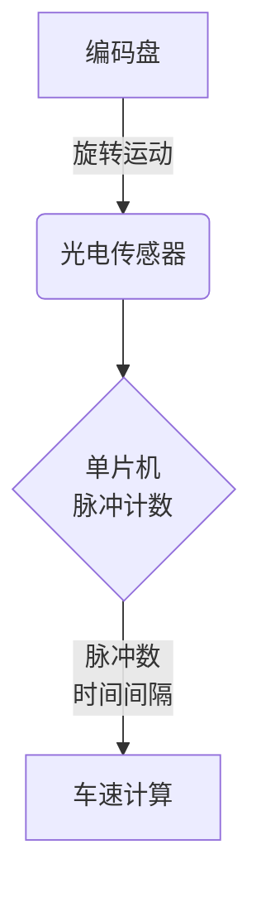
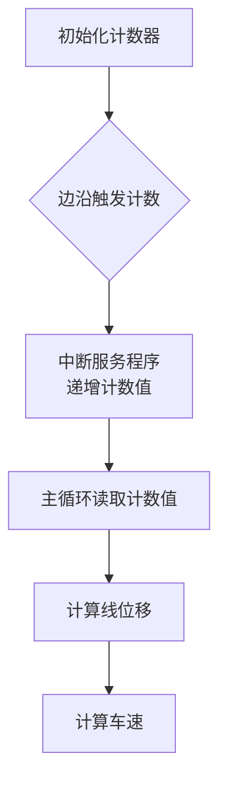
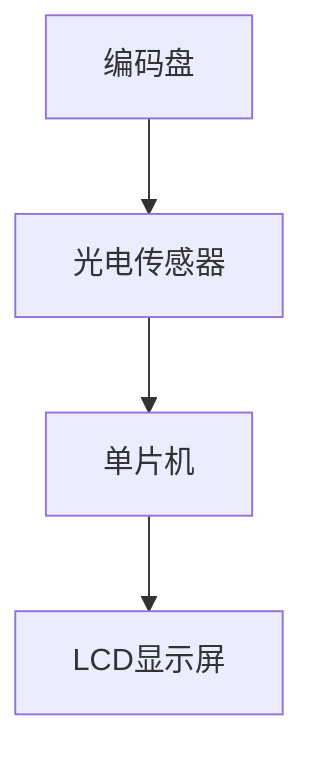

# 基于单片机车速检测的设计与实现

## 1.背景介绍

### 1.1 车速检测的重要性

车速是衡量车辆行驶状态的关键指标,准确检测车速对于确保交通安全、优化能源利用以及提高驾驶体验至关重要。传统的机械式车速检测存在精度低、响应滞后等缺陷,因此开发基于电子技术的车速检测系统备受关注。

### 1.2 单片机在嵌入式系统中的应用

单片机是一种高度集成的微型计算机,具有体积小、功耗低、价格便宜等优势,广泛应用于各种嵌入式系统。借助强大的计算能力和可编程性,单片机可实现复杂的数据处理和控制算法,非常适合车速检测等实时系统。

### 1.3 本文研究内容和意义

本文详细介绍了一种基于单片机的车速检测系统的设计与实现方案。该系统利用编码盘、光电传感器和单片机的脉冲计数功能,实现对车速的精确测量。不仅给出了系统的硬件电路和软件程序设计,还分析了相关数学模型、算法原理和应用场景,为读者提供了完整的技术方案。

## 2.核心概念与联系

### 2.1 编码盘原理

编码盘是一种将旋转运动转换为脉冲序列的装置,广泛应用于各种需要测量角位移或线位移的场合。它由一个带有规则分布孔洞的圆盘组成,当编码盘旋转时,光电传感器可检测到孔洞的通过,从而产生脉冲序列。

$$n=\frac{N}{2\pi r}s$$

其中,n为脉冲数,N为编码盘上的孔洞总数,r为编码盘半径,s为线位移。

### 2.2 光电传感器工作原理

光电传感器是利用光电效应原理工作的传感器,由发光二极管(LED)和光电二极管(PhotoDiode)组成。当光线射向光电二极管时,会在二极管两端产生微小的电流,从而实现对光信号的检测。

### 2.3 单片机的脉冲计数功能

大多数单片机都内置了计数器/定时器模块,可用于测量脉冲数或时间间隔。通过对编码盘产生的脉冲序列进行计数,并结合时间信息,即可计算出车速。



## 3.核心算法原理具体操作步骤

### 3.1 脉冲计数算法

1) 初始化计数器,清零计数值
2) 设置计数器工作模式为边沿触发计数
3) 在中断服务程序中响应脉冲计数事件,递增计数值
4) 在主循环中根据预设的计数周期,读取并清零计数值

### 3.2 车速计算算法

1) 获取单位时间内的脉冲计数值n
2) 根据编码盘规格,计算对应的线位移s
3) 已知车轮半径r,计算车辆行驶距离d=2πr
4) 车速v=d/t (t为单位时间)



## 4.数学模型和公式详细讲解举例说明

### 4.1 编码盘脉冲数与线位移的关系

$$n=\frac{N}{2\pi r}s$$

其中:
- n为脉冲数
- N为编码盘上的孔洞总数
- r为编码盘半径
- s为线位移

例如,假设编码盘有500个孔洞,半径为2cm,若计数500个脉冲,则:

$$s=\frac{2\pi \times 2 \times 500}{500}=20\pi \approx 62.83(cm)$$

### 4.2 车速计算公式

$$v=\frac{2\pi rn}{Nt}$$

其中:
- v为车速(cm/s)
- r为车轮半径(cm)
- n为单位时间内的脉冲计数值
- N为编码盘孔洞总数
- t为单位时间(s)

假设车轮半径10cm,编码盘500孔,在1秒内计数200个脉冲,则:

$$v=\frac{2\pi \times 10 \times 200}{500 \times 1}=251(cm/s)\approx2.51(m/s)$$

## 5.项目实践:代码实例和详细解释说明

### 5.1 硬件电路设计



1. 编码盘安装在车轮上,旋转时产生脉冲序列
2. 光电传感器检测脉冲,输出至单片机
3. 单片机计算车速,并在LCD显示屏上显示

### 5.2 软件程序设计

```c
// 定义编码盘参数
#define ENC_HOLES 500
#define ENC_RADIUS 2.0

// 定义计数器相关参数
uint16_t count = 0;
uint32_t lastCount = 0;
uint32_t prevTime = 0;

// 中断服务程序
void ENC_ISR() {
    count++;
}

void main() {
    // 初始化LCD,计数器等
    InitLCD();
    InitCounter();

    while(1) {
        // 每100ms读取一次计数值
        if(millis() - prevTime >= 100) {
            prevTime = millis();
            uint32_t currCount = count;
            count = 0;

            // 计算线位移和车速
            float dist = 2 * PI * ENC_RADIUS * (currCount - lastCount) / ENC_HOLES;
            float speed = dist * 10; // 车速单位cm/s
            lastCount = currCount;

            // 显示车速
            DisplaySpeed(speed);
        }
    }
}
```

1. 定义编码盘参数和计数器变量
2. 中断服务程序递增脉冲计数值
3. 主循环每100ms读取计数值
4. 根据公式计算线位移和车速
5. 在LCD显示屏上显示车速

## 6.实际应用场景

### 6.1 车载计费系统

出租车等计费系统需要精确获取车辆行驶里程,基于编码盘的车速检测可提供准确的里程数据,实现公平透明的计费。

### 6.2 车辆遥测监控

通过无线通信将车速等行车数据实时上传至监控中心,可对车辆状态进行远程监视,用于车队管理、行车安全预警等。

### 6.3 自适应巡航控制

获取实时车速是自适应巡航控制系统的基础,通过与设定速度对比,可自动调节发动机输出,实现智能化的车速控制。

## 7.工具和资源推荐

- 单片机开发工具: Keil MDK、IAR Embedded Workbench
- 硬件开发板: Arduino、STM32等
- 在线学习资源: 慕课、中国大学MOOC、edX
- 技术社区: 51单片机网、Arduino官方论坛
- 相关书籍: 《单片机原理与应用》、《The 8051 Microcontroller》

## 8.总结:未来发展趋势与挑战

### 8.1 发展趋势

- 无线通信技术的融合,实现车速等数据的远程传输
- 多传感器融合,提高检测精度和抗干扰能力
- 人工智能算法的应用,实现智能化车速控制和优化

### 8.2 挑战

- 抗干扰能力需要进一步提高,应对复杂的实际工况
- 功耗控制是移动设备的重点,需要节能优化
- 标准化和通用性有待加强,以实现不同系统间的兼容

## 9.附录:常见问题与解答

1. **为什么选择单片机而不是其他控制器?**

单片机集成度高、成本低、可编程性强,非常适合嵌入式实时控制系统。对于车速检测这类较为简单的应用,单片机可以完全满足需求。

2. **编码盘分辨率如何选择?**

编码盘分辨率越高(孔洞数目越多),测量精度就越高,但成本也越高。通常需要权衡精度和成本,选择合适的规格。

3. **如何提高抗干扰能力?**

可以采用硬件滤波电路、软件算法滤波、多传感器融合等方法,有效消除干扰,提高系统的抗干扰能力。

4. **车速检测的应用范围有哪些?**

除了上文提到的应用场景,车速检测在工业自动化、运动控制、交通监测等领域也有广泛应用。

作者: 禅与计算机程序设计艺术 / Zen and the Art of Computer Programming