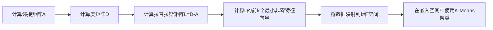
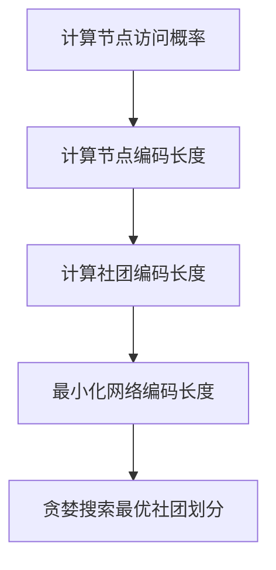

# 基于图的聚类算法:谱聚类与Infomap算法详解

## 1.背景介绍

### 1.1 聚类分析概述

聚类分析是数据挖掘和机器学习中一种重要的无监督学习技术,旨在将相似的对象归为同一个簇,而将不同的对象归为不同的簇。聚类分析广泛应用于图像分割、模式识别、信息检索、基因组学等诸多领域。

### 1.2 图数据聚类的重要性

随着网络科学和复杂网络研究的兴起,图数据分析受到了前所未有的关注。图不仅能够表示复杂的关系数据,而且能够揭示数据内在的拓扑结构特征。对于社交网络、蛋白质相互作用网络、互联网等复杂网络系统,发现其中的社团结构(community structure)对于理解网络的组织原理和功能具有重要意义。

### 1.3 基于图的聚类算法

基于图的聚类算法旨在将图中的节点划分为不同的簇,使得同一簇内的节点之间存在较多的边连接,而不同簇之间的边较少。常见的基于图的聚类算法包括谱聚类(Spectral Clustering)、Infomap算法等。

## 2.核心概念与联系

### 2.1 图的表示

图 $G=(V,E)$ 由一个节点集合 $V$ 和一个边集合 $E$ 组成。对于无向图,边表示节点之间的相互关联关系;对于有向图,边表示节点之间的指向关系。图可以用邻接矩阵 $A$ 或邻接表等数据结构表示。

### 2.2 切割度(Cut)

对于图 $G=(V,E)$ 的任意划分 $V=V_1 \cup V_2$,切割度(Cut)定义为跨越 $V_1$ 和 $V_2$ 的边的权重之和:

$$\text{Cut}(V_1,V_2) = \sum_{u\in V_1,v\in V_2} w(u,v)$$

其中 $w(u,v)$ 表示边 $(u,v)$ 的权重。切割度越小,表明划分的质量越好。

### 2.3 关联度(Association)

关联度(Association)是切割度的补集,定义为划分内部的边权重之和:

$$\text{Association}(V_1,V_2) = \sum_{u,v\in V_1} w(u,v) + \sum_{u,v\in V_2} w(u,v)$$

关联度越大,表明划分的质量越好。

### 2.4 模ул度(Modularity)

模量度是评估社团划分质量的一种重要指标,由Newman等人于2004年提出。对于一个具有 $k$ 个社团的划分,模量度定义为:

$$Q = \sum_{i=1}^k \left[ \frac{l_i}{L} - \left( \frac{d_i}{2L} \right)^2 \right]$$

其中 $l_i$ 表示第 $i$ 个社团内部边的权重之和, $d_i$ 表示第 $i$ 个社团的总度数(边权重之和), $L$ 表示图中所有边的权重之和。模量度的取值范围在 $[-1,1]$ 之间,值越大表明社团划分的质量越好。

## 3.核心算法原理具体操作步骤

### 3.1 谱聚类算法

谱聚类算法是一种常用的基于图的聚类算法,主要思想是利用图的拉普拉斯矩阵的特征向量对数据进行嵌入,然后在嵌入空间中使用传统的聚类算法(如K-Means)对数据进行聚类。具体步骤如下:

1. 计算图的邻接矩阵 $A$
2. 计算度矩阵 $D$,其中 $D_{ii} = \sum_j A_{ij}$
3. 计算拉普拉斯矩阵 $L = D - A$
4. 计算 $L$ 的前 $k$ 个最小非零特征值对应的特征向量 $u_1,u_2,...,u_k$
5. 将原始数据映射到由 $u_1,u_2,...,u_k$ 张成的 $k$ 维空间中,得到嵌入向量 $T = [u_1,u_2,...,u_k]^T$
6. 在嵌入空间中使用K-Means等算法对数据进行聚类

谱聚类算法的优点是能够很好地处理非凸形状的数据簇,并且对噪声具有较强的鲁棒性。但是,该算法的计算复杂度较高,需要计算特征向量,并且需要预先指定聚类数目。



### 3.2 Infomap算法

Infomap算法是一种基于信息论原理的无监督社团发现算法,由Rosvall等人于2008年提出。该算法的核心思想是通过最小化一个基于随机游走的信息映射编码的期望长度来发现网络中的社团结构。具体步骤如下:

1. 在图中进行随机游走,计算每个节点被访问的概率 $P(i)$
2. 对于每个节点 $i$,计算其被随机游走访问的概率 $q_i = \frac{P(i)}{\sum_j P(j)}$
3. 使用哈夫曼编码对节点进行编码,得到编码长度 $L(i) = -\log_2 q_i$
4. 对于每个社团 $C$,计算其编码长度 $L(C) = q_C \cdot H(Q)$,其中 $q_C = \sum_{i\in C} q_i$, $H(Q)$ 为社团内节点概率分布的信息熵
5. 最小化整个网络的编码长度 $L(M) = \sum_C L(C) + q_C \cdot H(P)$,其中 $H(P)$ 为社团概率分布的信息熵
6. 使用贪婪搜索算法或其他优化算法寻找最优的社团划分

Infomap算法能够自动确定最优的社团数目,并且具有较好的时间复杂度。但是,该算法对于不同的初始划分可能会得到不同的结果,需要进行多次运行取平均值。



## 4.数学模型和公式详细讲解举例说明

### 4.1 谱聚类中的拉普拉斯矩阵

在谱聚类算法中,拉普拉斯矩阵 $L$ 扮演着关键的角色。对于无向图 $G=(V,E)$,其拉普拉斯矩阵定义为:

$$L = D - A$$

其中 $A$ 为图的邻接矩阵, $D$ 为度矩阵,即 $D_{ii} = \sum_j A_{ij}$。

拉普拉斯矩阵 $L$ 是一个实对称半正定矩阵,因此其特征值都是非负实数。令 $0 = \lambda_1 \leq \lambda_2 \leq ... \leq \lambda_n$ 为 $L$ 的特征值,则有:

1. $\lambda_1 = 0$,对应的特征向量为常数向量 $\vec{1}$
2. $\lambda_2$ 反映了图的代数连通性,值越大表明图越连通
3. $\lambda_n$ 为拉普拉斯矩阵的最大特征值,反映了图的切割程度

因此,在谱聚类算法中,我们使用 $L$ 的前 $k$ 个最小非零特征向量作为数据的嵌入向量,这些特征向量能够很好地捕捉图的拓扑结构特征。

### 4.2 Infomap算法中的信息映射编码

Infomap算法的核心思想是通过最小化一个基于随机游走的信息映射编码的期望长度来发现网络中的社团结构。具体来说,假设我们使用一个不可压缩的编码对随机游走序列进行编码,那么最短的编码长度就对应于最好的社团划分。

对于一个具有 $m$ 个节点的网络,我们使用长度为 $n$ 的随机游走序列 $X = x_1,x_2,...,x_n$ 对其进行编码。令 $P(X)$ 表示该序列的概率,根据信息论,对该序列进行最优编码的期望长度为:

$$L(X) = -\log_2 P(X)$$

进一步地,我们将网络划分为 $k$ 个社团 $C_1,C_2,...,C_k$,对每个社团内部的随机游走序列使用单独的编码,那么整个网络的编码长度为:

$$L(M) = \sum_{i=1}^k L(C_i) + L(Q)$$

其中 $L(C_i)$ 表示第 $i$ 个社团内部序列的编码长度, $L(Q)$ 表示社团序列的编码长度。通过最小化 $L(M)$,我们就能够得到最优的社团划分。

Infomap算法使用了一种基于词汇编码的方法来近似计算上述编码长度,具有较好的时间复杂度。

## 5.项目实践:代码实例和详细解释说明

以下是使用Python实现谱聚类算法的代码示例:

```python
import numpy as np
from sklearn.cluster import KMeans
from scipy.sparse import csgraph

def spectral_clustering(adj_matrix, n_clusters=2):
    """
    谱聚类算法

    参数:
    adj_matrix: 邻接矩阵
    n_clusters: 聚类数目

    返回:
    labels: 节点的簇标签
    """
    # 计算拉普拉斯矩阵
    deg_matrix = np.diag(np.sum(adj_matrix, axis=1))
    lap_matrix = deg_matrix - adj_matrix

    # 计算前n_clusters个最小非零特征值对应的特征向量
    eigenvalues, eigenvectors = np.linalg.eigh(lap_matrix)
    sorted_indices = np.argsort(eigenvalues)[1:n_clusters+1]
    embedding = eigenvectors[:, sorted_indices]

    # 在嵌入空间中使用K-Means聚类
    kmeans = KMeans(n_clusters=n_clusters)
    labels = kmeans.fit_predict(embedding)

    return labels
```

代码解释:

1. 首先计算图的拉普拉斯矩阵 $L = D - A$,其中 $D$ 为度矩阵, $A$ 为邻接矩阵。
2. 使用 `np.linalg.eigh` 函数计算拉普拉斯矩阵的特征值和特征向量,并选取前 `n_clusters` 个最小非零特征值对应的特征向量作为嵌入向量。
3. 在嵌入空间中使用 `sklearn.cluster.KMeans` 进行K-Means聚类,得到节点的簇标签。

以下是使用Python实现Infomap算法的代码示例(基于Infomap软件包):

```python
import infomap

# 创建Infomap实例
im = infomap.Infomap("--undirected")

# 添加节点和边
for i in range(10):
    im.addNode()
im.addLink(0, 1)
im.addLink(0, 2)
# ... 添加其他边

# 运行Infomap算法
im.run()

# 获取社团划分结果
node_clusters = im.getModuleNodes()
for node in node_clusters:
    print(f"Node {node.physicalNodeId} belongs to cluster {node.moduleId}")
```

代码解释:

1. 创建 `infomap.Infomap` 实例,指定图是无向图。
2. 使用 `addNode` 和 `addLink` 方法添加节点和边。
3. 调用 `run` 方法运行Infomap算法。
4. 使用 `getModuleNodes` 方法获取社团划分结果,每个节点对应一个 `(physicalNodeId, moduleId)` 元组,表示该节点的ID和所属社团ID。

## 6.实际应用场景

基于图的聚类算法在许多领域都有广泛的应用,包括但不限于:

1. **社交网络分析**: 在社交网络中发现社团结构,有助于理解人际关系网络的