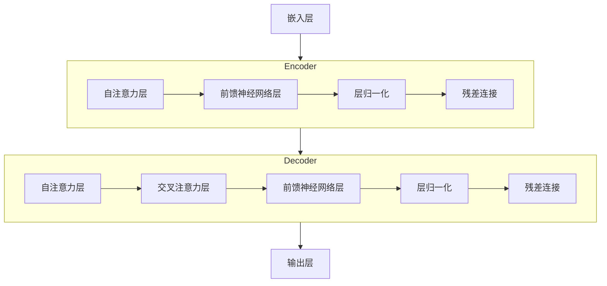

# 大规模语言模型从理论到实践 LLaMA的模型结构

## 1.背景介绍
### 1.1 大规模语言模型的发展历程
#### 1.1.1 早期的神经网络语言模型
#### 1.1.2 Transformer的出现与发展
#### 1.1.3 GPT系列模型的演进
### 1.2 LLaMA模型的诞生
#### 1.2.1 Meta AI实验室的研究进展
#### 1.2.2 LLaMA模型的特点与优势
#### 1.2.3 LLaMA模型的开源计划

## 2.核心概念与联系
### 2.1 Transformer架构
#### 2.1.1 自注意力机制
#### 2.1.2 多头注意力
#### 2.1.3 前馈神经网络
### 2.2 预训练与微调
#### 2.2.1 无监督预训练
#### 2.2.2 有监督微调
#### 2.2.3 预训练任务设计
### 2.3 LLaMA模型的关键创新
#### 2.3.1 高效的参数共享机制
#### 2.3.2 优化的训练方法
#### 2.3.3 模型压缩技术

## 3.核心算法原理具体操作步骤
### 3.1 LLaMA模型的整体架构
#### 3.1.1 编码器-解码器结构
#### 3.1.2 模型参数规模与层数
#### 3.1.3 嵌入层与词表设计
### 3.2 自注意力机制的实现
#### 3.2.1 计算查询、键、值矩阵
#### 3.2.2 计算注意力权重
#### 3.2.3 生成注意力输出
### 3.3 前馈神经网络的实现
#### 3.3.1 全连接层的设计
#### 3.3.2 激活函数的选择
#### 3.3.3 残差连接与层归一化
### 3.4 模型训练与优化
#### 3.4.1 损失函数的定义
#### 3.4.2 优化器的选择与配置
#### 3.4.3 学习率调度策略

## 4.数学模型和公式详细讲解举例说明
### 4.1 自注意力机制的数学表示
给定一个序列 $\mathbf{X}=(\mathbf{x}_1, \mathbf{x}_2, \dots, \mathbf{x}_n)$，自注意力机制可以表示为：

$$
\begin{aligned}
\mathbf{Q} &= \mathbf{X} \mathbf{W}^Q \\
\mathbf{K} &= \mathbf{X} \mathbf{W}^K \\
\mathbf{V} &= \mathbf{X} \mathbf{W}^V
\end{aligned}
$$

其中，$\mathbf{W}^Q, \mathbf{W}^K, \mathbf{W}^V$ 是可学习的权重矩阵。然后计算注意力权重：

$$
\mathbf{A} = \text{softmax}(\frac{\mathbf{Q}\mathbf{K}^T}{\sqrt{d_k}})
$$

最后生成注意力输出：

$$
\text{Attention}(\mathbf{Q}, \mathbf{K}, \mathbf{V}) = \mathbf{A}\mathbf{V}
$$

### 4.2 多头注意力的数学表示
多头注意力是将自注意力并行计算多次，然后拼接结果：

$$
\begin{aligned}
\text{MultiHead}(\mathbf{Q}, \mathbf{K}, \mathbf{V}) &= \text{Concat}(\text{head}_1, \dots, \text{head}_h)\mathbf{W}^O \\
\text{head}_i &= \text{Attention}(\mathbf{Q}\mathbf{W}_i^Q, \mathbf{K}\mathbf{W}_i^K, \mathbf{V}\mathbf{W}_i^V)
\end{aligned}
$$

其中，$\mathbf{W}_i^Q \in \mathbb{R}^{d_{\text{model}} \times d_k}, \mathbf{W}_i^K \in \mathbb{R}^{d_{\text{model}} \times d_k}, \mathbf{W}_i^V \in \mathbb{R}^{d_{\text{model}} \times d_v}, \mathbf{W}^O \in \mathbb{R}^{hd_v \times d_{\text{model}}}$。

### 4.3 前馈神经网络的数学表示
前馈神经网络可以表示为：

$$
\text{FFN}(\mathbf{x}) = \max(0, \mathbf{x}\mathbf{W}_1 + \mathbf{b}_1)\mathbf{W}_2 + \mathbf{b}_2
$$

其中，$\mathbf{W}_1 \in \mathbb{R}^{d_{\text{model}} \times d_{ff}}, \mathbf{b}_1 \in \mathbb{R}^{d_{ff}}, \mathbf{W}_2 \in \mathbb{R}^{d_{ff} \times d_{\text{model}}}, \mathbf{b}_2 \in \mathbb{R}^{d_{\text{model}}}$。

## 5.项目实践：代码实例和详细解释说明
下面是使用PyTorch实现LLaMA模型中自注意力机制的示例代码：

```python
import torch
import torch.nn as nn

class SelfAttention(nn.Module):
    def __init__(self, d_model, num_heads):
        super().__init__()
        self.d_model = d_model
        self.num_heads = num_heads
        self.head_dim = d_model // num_heads

        self.query = nn.Linear(d_model, d_model)
        self.key = nn.Linear(d_model, d_model)
        self.value = nn.Linear(d_model, d_model)

        self.out = nn.Linear(d_model, d_model)

    def forward(self, x):
        batch_size, seq_len, _ = x.size()

        q = self.query(x).view(batch_size, seq_len, self.num_heads, self.head_dim).transpose(1, 2)
        k = self.key(x).view(batch_size, seq_len, self.num_heads, self.head_dim).transpose(1, 2)
        v = self.value(x).view(batch_size, seq_len, self.num_heads, self.head_dim).transpose(1, 2)

        scores = torch.matmul(q, k.transpose(-2, -1)) / (self.head_dim ** 0.5)
        attn_weights = torch.softmax(scores, dim=-1)
        attn_output = torch.matmul(attn_weights, v)

        attn_output = attn_output.transpose(1, 2).contiguous().view(batch_size, seq_len, self.d_model)
        out = self.out(attn_output)

        return out
```

这段代码定义了一个`SelfAttention`类，实现了自注意力机制。主要步骤如下：
1. 初始化时指定模型维度`d_model`和注意力头数`num_heads`。
2. 定义线性变换矩阵`query`、`key`、`value`和最终的输出矩阵`out`。
3. 在前向传播中，首先将输入`x`通过线性变换得到`q`、`k`、`v`，并调整维度以适应多头注意力。
4. 计算注意力得分`scores`，然后通过softmax归一化得到注意力权重`attn_weights`。
5. 将注意力权重与值`v`相乘得到注意力输出`attn_output`。
6. 最后，将多头注意力的结果拼接并通过线性变换`out`得到最终输出。

这个自注意力模块可以作为LLaMA模型中Transformer编码器和解码器的核心组件，通过堆叠多个自注意力层和前馈神经网络层来构建完整的模型。

## 6.实际应用场景
### 6.1 自然语言处理任务
#### 6.1.1 语言建模与文本生成
#### 6.1.2 机器翻译
#### 6.1.3 文本摘要
#### 6.1.4 情感分析
### 6.2 知识图谱与问答系统
#### 6.2.1 实体关系抽取
#### 6.2.2 知识表示学习
#### 6.2.3 问答系统构建
### 6.3 推荐系统
#### 6.3.1 用户行为建模
#### 6.3.2 个性化推荐
#### 6.3.3 跨域推荐

## 7.工具和资源推荐
### 7.1 开源框架与库
- PyTorch: https://pytorch.org/
- Transformers: https://huggingface.co/transformers/
- Fairseq: https://github.com/pytorch/fairseq
### 7.2 预训练模型
- LLaMA: https://ai.facebook.com/blog/large-language-model-llama-meta-ai/
- BERT: https://github.com/google-research/bert
- GPT-3: https://openai.com/blog/gpt-3-apps/
### 7.3 数据集
- WikiText: https://blog.einstein.ai/the-wikitext-long-term-dependency-language-modeling-dataset/
- BookCorpus: https://yknzhu.wixsite.com/mbweb
- Common Crawl: https://commoncrawl.org/

## 8.总结：未来发展趋势与挑战
### 8.1 模型规模与效率的平衡
### 8.2 多模态语言模型的探索
### 8.3 低资源语言的建模
### 8.4 可解释性与可控性
### 8.5 数据隐私与安全

## 9.附录：常见问题与解答
### 9.1 如何选择合适的预训练模型？
### 9.2 微调时如何避免过拟合？
### 9.3 如何处理低频词和未登录词？
### 9.4 生成文本时如何控制长度和主题？
### 9.5 如何评估生成文本的质量？



LLaMA模型作为一种大规模语言模型，通过Transformer架构中的自注意力机制和前馈神经网络，实现了对自然语言的深层理解和生成。它的出现标志着语言模型在规模和性能上的重大突破，为自然语言处理领域带来了新的发展机遇。未来，随着计算资源的增长和算法的不断优化，我们有望看到更加强大和智能的语言模型，它们将在更广泛的应用场景中发挥重要作用，推动人机交互和知识挖掘的进一步发展。同时，我们也需要关注语言模型在数据隐私、安全性和可解释性方面的挑战，确保它们能够以负责任和可信赖的方式服务于人类社会。

作者：禅与计算机程序设计艺术 / Zen and the Art of Computer Programming