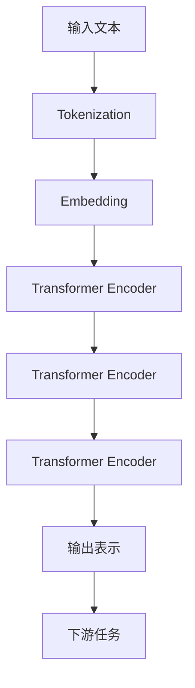

# 大语言模型原理与工程实践：主要的评测维度和基准概述

## 1. 背景介绍
### 1.1 大语言模型的发展历程
### 1.2 大语言模型的应用价值
### 1.3 大语言模型评测的重要性

## 2. 核心概念与联系
### 2.1 大语言模型的定义
### 2.2 预训练与微调
### 2.3 自然语言理解与生成
### 2.4 Zero-shot、One-shot和Few-shot学习

## 3. 核心算法原理具体操作步骤
### 3.1 Transformer模型架构
#### 3.1.1 Self-Attention机制
#### 3.1.2 前馈神经网络
#### 3.1.3 残差连接与Layer Normalization
### 3.2 预训练目标与损失函数
#### 3.2.1 语言模型目标
#### 3.2.2 去噪自编码目标
#### 3.2.3 对比学习目标
### 3.3 知识蒸馏与模型压缩
#### 3.3.1 教师-学生模型框架
#### 3.3.2 软标签蒸馏
#### 3.3.3 模型量化与剪枝

## 4. 数学模型和公式详细讲解举例说明
### 4.1 Transformer的数学表示
#### 4.1.1 Self-Attention计算公式
$Attention(Q,K,V) = softmax(\frac{QK^T}{\sqrt{d_k}})V$
#### 4.1.2 多头注意力机制
$MultiHead(Q,K,V) = Concat(head_1,...,head_h)W^O$
其中，$head_i=Attention(QW_i^Q,KW_i^K,VW_i^V)$
#### 4.1.3 位置编码
$PE_{(pos,2i)} = sin(pos/10000^{2i/d_{model}})$
$PE_{(pos,2i+1)} = cos(pos/10000^{2i/d_{model}})$
### 4.2 语言模型损失函数
$L(θ)=−\sum_{i}log P(w_i|w_{<i};θ)$
### 4.3 去噪自编码损失函数
$L(θ)=−\sum_{i}log P(x_i|C(x);θ)$
其中，$C(x)$表示对输入$x$进行随机遮挡后的结果。

## 5. 项目实践：代码实例和详细解释说明
### 5.1 使用Hugging Face Transformers库加载预训练模型
```python
from transformers import AutoTokenizer, AutoModel

tokenizer = AutoTokenizer.from_pretrained("bert-base-uncased")
model = AutoModel.from_pretrained("bert-base-uncased")
```
### 5.2 使用PyTorch实现Transformer编码器层
```python
import torch
import torch.nn as nn

class TransformerEncoderLayer(nn.Module):
    def __init__(self, d_model, nhead, dim_feedforward, dropout):
        super().__init__()
        self.self_attn = nn.MultiheadAttention(d_model, nhead, dropout=dropout)
        self.linear1 = nn.Linear(d_model, dim_feedforward)
        self.dropout = nn.Dropout(dropout)
        self.linear2 = nn.Linear(dim_feedforward, d_model)
        self.norm1 = nn.LayerNorm(d_model)
        self.norm2 = nn.LayerNorm(d_model)
        self.dropout1 = nn.Dropout(dropout)
        self.dropout2 = nn.Dropout(dropout)

    def forward(self, src, src_mask=None):
        src2 = self.self_attn(src, src, src, attn_mask=src_mask)[0]
        src = src + self.dropout1(src2)
        src = self.norm1(src)
        src2 = self.linear2(self.dropout(torch.relu(self.linear1(src))))
        src = src + self.dropout2(src2)
        src = self.norm2(src)
        return src
```
### 5.3 使用Hugging Face Datasets库加载和预处理数据集
```python
from datasets import load_dataset

dataset = load_dataset("glue", "cola")
tokenized_dataset = dataset.map(lambda e: tokenizer(e['sentence'], truncation=True, padding='max_length'), batched=True)
```

## 6. 实际应用场景
### 6.1 文本分类
#### 6.1.1 情感分析
#### 6.1.2 主题分类
#### 6.1.3 意图识别
### 6.2 问答系统
#### 6.2.1 阅读理解
#### 6.2.2 开放域问答
### 6.3 文本生成
#### 6.3.1 摘要生成
#### 6.3.2 对话生成
#### 6.3.3 故事生成
### 6.4 机器翻译
#### 6.4.1 单语种翻译
#### 6.4.2 多语种翻译

## 7. 工具和资源推荐
### 7.1 开源工具包
#### 7.1.1 Hugging Face Transformers
#### 7.1.2 Fairseq
#### 7.1.3 OpenNMT
### 7.2 预训练模型
#### 7.2.1 BERT
#### 7.2.2 GPT系列
#### 7.2.3 T5
#### 7.2.4 XLNet
### 7.3 评测基准
#### 7.3.1 GLUE
#### 7.3.2 SuperGLUE
#### 7.3.3 SQuAD
#### 7.3.4 RACE

## 8. 总结：未来发展趋势与挑战
### 8.1 模型效率与可解释性
### 8.2 低资源语言与多模态学习
### 8.3 知识融合与推理能力
### 8.4 公平性、隐私与安全

## 9. 附录：常见问题与解答
### 9.1 如何选择合适的预训练模型？
### 9.2 微调时需要注意哪些问题？
### 9.3 如何处理长文本输入？
### 9.4 大语言模型存在哪些局限性？



大语言模型（Large Language Models, LLMs）是自然语言处理领域的重要里程碑。它们通过在大规模文本语料库上进行预训练，学习到丰富的语言知识和通用表示，可以应用于各种下游任务，如文本分类、问答、生成等。评估大语言模型的性能需要考虑多个维度，包括模型的泛化能力、鲁棒性、计算效率等。本文将系统地介绍大语言模型的原理、评测方法和工程实践，为研究者和工程师提供全面的指导。

大语言模型的核心是基于Transformer架构的深度神经网络。Transformer利用自注意力机制来捕捉文本中的长距离依赖关系，并通过堆叠多个编码器层来提取层次化的特征表示。在预训练阶段，模型通过掩码语言建模或自回归语言建模等任务来学习通用的语言表示。这些预训练模型可以进一步微调或适应特定的下游任务，显著提升任务性能。

为了评估大语言模型的性能，研究者提出了多个标准化的评测基准，如GLUE、SuperGLUE等。这些基准涵盖了自然语言理解的各个方面，包括句法分析、语义相似度、自然语言推理等。模型在这些基准上的表现可以反映其在通用自然语言处理任务上的能力。此外，还需要考虑模型在特定领域数据上的适应性和泛化性。

在工程实践中，Hugging Face Transformers等开源工具包为大语言模型的应用提供了便利。这些工具包封装了主流的预训练模型，并提供了易用的API接口。工程师可以根据任务需求选择合适的预训练模型，并使用提供的脚本和示例快速上手。在部署大语言模型时，需要权衡模型性能和计算资源的平衡，可以通过知识蒸馏、模型量化等技术来优化模型效率。

大语言模型虽然取得了显著的进展，但仍面临着诸多挑战。模型的可解释性和可控性有待提高，需要开发更透明和可信的模型。此外，如何在低资源语言和多模态场景中有效利用大语言模型也是未来的重要研究方向。随着知识图谱等外部知识的引入，大语言模型有望具备更强大的推理和决策能力。

总之，大语言模型为自然语言处理带来了革命性的变化。通过了解其原理、评测方法和工程实践，研究者和工程师可以更好地利用大语言模型的强大能力，推动自然语言处理技术的发展和应用。未来，大语言模型将继续在效率、多样性和智能化方面取得突破，为人机交互和知识服务带来更多可能性。

作者：禅与计算机程序设计艺术 / Zen and the Art of Computer Programming