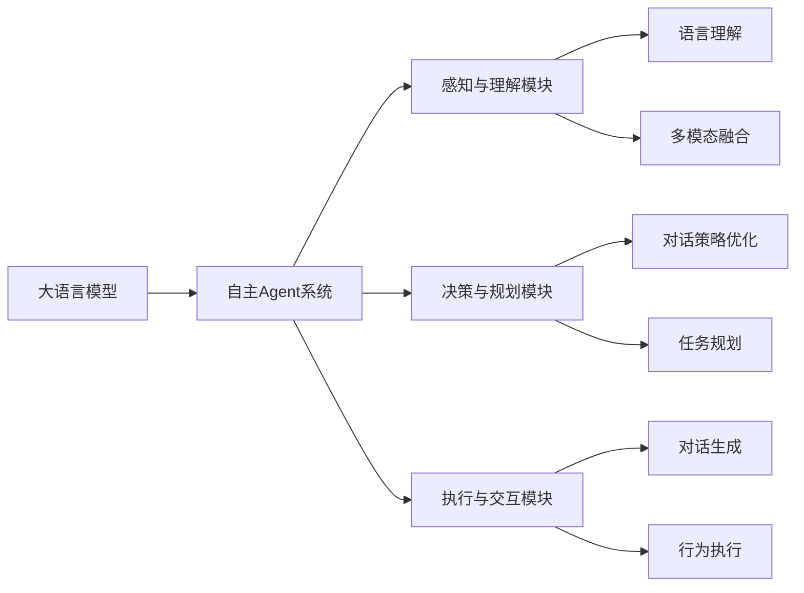

# 大语言模型应用指南：自主Agent系统的基本组成

## 1. 背景介绍
### 1.1 人工智能的发展历程
### 1.2 大语言模型的兴起
### 1.3 自主Agent系统的概念与意义

## 2. 核心概念与联系
### 2.1 大语言模型的定义与特点
#### 2.1.1 基于Transformer架构的语言模型
#### 2.1.2 海量预训练数据与参数规模
#### 2.1.3 强大的语言理解与生成能力
### 2.2 自主Agent系统的核心要素
#### 2.2.1 感知与理解模块
#### 2.2.2 决策与规划模块
#### 2.2.3 执行与交互模块
### 2.3 大语言模型在自主Agent中的作用
#### 2.3.1 赋予Agent语言交互能力
#### 2.3.2 增强Agent的知识与推理能力
#### 2.3.3 提升Agent的适应与学习能力

## 3. 核心算法原理具体操作步骤
### 3.1 基于Prompt的语言模型微调
#### 3.1.1 设计合适的Prompt模板
#### 3.1.2 选择与任务相关的训练数据
#### 3.1.3 使用梯度下降法进行参数微调
### 3.2 基于强化学习的对话策略优化
#### 3.2.1 定义对话状态与动作空间
#### 3.2.2 设计奖励函数引导策略学习
#### 3.2.3 采用PPO等算法进行策略优化
### 3.3 基于知识图谱的语义理解增强
#### 3.3.1 构建领域知识图谱
#### 3.3.2 利用知识嵌入表示实体与关系
#### 3.3.3 将知识信息融入语言模型中

## 4. 数学模型和公式详细讲解举例说明
### 4.1 Transformer的自注意力机制
$Attention(Q,K,V) = softmax(\frac{QK^T}{\sqrt{d_k}})V$
其中$Q$,$K$,$V$分别表示查询、键、值向量，$d_k$为向量维度。

### 4.2 BERT的Masked Language Model
$L_{MLM}(\theta) = -\sum_{i=1}^{n}log P(w_i|w_{i},\theta)$
其中$w_i$表示被掩码的单词，$w_{i}$为上下文单词，$\theta$为模型参数。

### 4.3 强化学习中的策略梯度定理
$\nabla_{\theta}J(\pi_{\theta}) = E_{\tau\sim\pi_{\theta}}[\sum_{t=0}^{T}\nabla_{\theta}log\pi_{\theta}(a_t|s_t)A^{\pi}(s_t,a_t)]$
其中$\pi_{\theta}$为随机性策略，$\tau$为轨迹，$A^{\pi}$为优势函数。

## 5. 项目实践：代码实例和详细解释说明
### 5.1 使用PyTorch实现BERT模型微调

```python
# 加载预训练的BERT模型
model = BertForSequenceClassification.from_pretrained('bert-base-uncased')

# 准备微调数据集
train_dataset = MyDataset(...)
train_dataloader = DataLoader(train_dataset, batch_size=32, shuffle=True)

# 定义优化器和损失函数
optimizer = AdamW(model.parameters(), lr=2e-5)
criterion = nn.CrossEntropyLoss()

# 开始训练
for epoch in range(3):
    for batch in train_dataloader:
        input_ids, attention_mask, labels = batch
        outputs = model(input_ids, attention_mask=attention_mask, labels=labels)
        loss = outputs.loss
        loss.backward()
        optimizer.step()
        optimizer.zero_grad()
```

以上代码展示了如何使用PyTorch对BERT模型进行微调，主要步骤包括加载预训练模型、准备数据集、定义优化器和损失函数、循环训练等。通过微调，可以使BERT模型适应特定的下游任务。

### 5.2 使用TensorFlow实现基于强化学习的对话系统

```python
# 定义对话环境
class DialogueEnv(gym.Env):
    def __init__(self):
        ...
    def reset(self):
        ...
    def step(self, action):
        ...

# 定义策略网络
class PolicyNetwork(tf.keras.Model):
    def __init__(self):
        ...
    def call(self, state):
        ...

# 创建环境和策略网络
env = DialogueEnv()
policy_net = PolicyNetwork()

# 使用PPO算法训练策略
for iteration in range(1000):
    states, actions, rewards = collect_dialogue(env, policy_net)
    with tf.GradientTape() as tape:
        logits = policy_net(states)
        dist = tfp.distributions.Categorical(logits=logits)
        log_probs = dist.log_prob(actions)
        loss = -tf.reduce_mean(log_probs * rewards)
    grads = tape.gradient(loss, policy_net.trainable_variables)
    optimizer.apply_gradients(zip(grads, policy_net.trainable_variables))
```

以上代码展示了如何使用TensorFlow实现一个基于强化学习的对话系统。首先定义对话环境和策略网络，然后使用PPO算法对策略进行训练优化。其中的关键是如何设计合适的对话状态表示以及奖励函数。通过不断的探索和改进，可以得到一个较好的对话策略模型。

## 6. 实际应用场景
### 6.1 智能客服系统
利用大语言模型构建的自主Agent可以应用于智能客服场景，通过理解用户问题并给出恰当回复，提供全天候的客户服务，减轻人工坐席的压力。

### 6.2 个性化推荐助手
通过分析用户的喜好和行为数据，自主Agent可以为用户提供个性化的商品、内容、服务等推荐，增强用户粘性和满意度。

### 6.3 智能教育辅导
自主Agent可以扮演智能教育助手的角色，根据学生的学习情况，提供针对性的学习资料、练习题和反馈，实现个性化的辅导和答疑。

## 7. 工具和资源推荐
### 7.1 开源大语言模型
- BERT: https://github.com/google-research/bert
- GPT-3: https://github.com/openai/gpt-3
- T5: https://github.com/google-research/text-to-text-transfer-transformer

### 7.2 对话系统开发框架
- Rasa: https://rasa.com/
- DeepPavlov: https://deeppavlov.ai/
- ParlAI: https://parl.ai/

### 7.3 知识图谱构建工具
- Neo4j: https://neo4j.com/
- OpenKE: https://github.com/thunlp/OpenKE
- AmpliGraph: https://github.com/Accenture/AmpliGraph

## 8. 总结：未来发展趋势与挑战
### 8.1 大语言模型的持续优化
随着计算能力的提升和训练数据的丰富，大语言模型的性能还将不断提高，能够处理更加复杂多样的任务，成为AI系统的核心组件。

### 8.2 多模态信息的融合
未来的自主Agent需要能够理解和处理文本、语音、图像、视频等多种模态的信息，形成更加全面和准确的认知能力，拓展应用范围。

### 8.3 人机协作与共生
自主Agent并非要取代人类，而是要与人类形成良性互动和协作，发挥各自的优势，实现人机共生，创造更大的价值。

### 8.4 安全与伦理问题
大语言模型强大的生成能力可能带来一些安全和伦理风险，如虚假信息、隐私泄露等，需要在技术和管理上采取必要的防范措施。

## 9. 附录：常见问题与解答
### 9.1 大语言模型需要多少训练数据和计算资源？
训练高质量的大语言模型通常需要TB级别的文本数据以及数百个GPU的计算资源，对计算基础设施提出了很高的要求。

### 9.2 如何评估大语言模型的性能表现？
可以通过一些标准的语言任务如分类、阅读理解、问答等来评估模型的性能，也可以通过人工评判生成文本的流畅度、连贯性和相关性等来评估模型的生成质量。

### 9.3 自主Agent系统的可解释性如何？
由于大语言模型内部结构的复杂性，自主Agent的决策过程往往是黑盒的，缺乏可解释性。提高可解释性是一个重要的研究方向，可以考虑引入知识图谱、因果推理等技术手段。

### 9.4 自主Agent的数据隐私如何保护？
在构建自主Agent系统时，需要采取必要的数据脱敏、加密等措施来保护用户隐私，同时要遵循相关的法律法规和伦理准则，避免数据滥用和泄露。

### 9.5 自主Agent的持续学习能力如何实现？
可以通过持续的在线学习、迁移学习、终身学习等方式，让自主Agent不断从新数据中学习，适应环境的变化，提高系统的鲁棒性和智能性。



以上是利用大语言模型构建自主Agent系统的一些关键组成部分和技术路线。通过大语言模型强大的语言理解和生成能力，结合多模态信息融合、强化学习优化、知识图谱等技术，可以打造出智能化程度较高的自主Agent，在智能客服、个性化推荐、智能教育等领域发挥重要作用。未来，随着大语言模型的不断发展和多模态技术的进步，自主Agent系统有望成为人工智能的一个重要方向，推动人机协作与共生，创造更多的价值。同时，我们也要重视其中的安全隐患与伦理问题，采取必要的防范措施。

作者：禅与计算机程序设计艺术 / Zen and the Art of Computer Programming