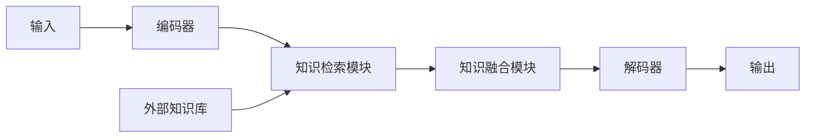
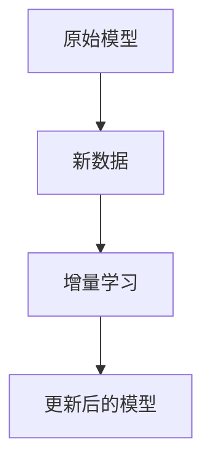

# 大语言模型应用指南：长期记忆

## 1. 背景介绍
### 1.1 大语言模型的发展历程
### 1.2 长期记忆的重要性
### 1.3 当前大语言模型面临的挑战

## 2. 核心概念与联系
### 2.1 大语言模型的定义与特点
### 2.2 长期记忆的定义与分类
#### 2.2.1 显式记忆
#### 2.2.2 隐式记忆
### 2.3 大语言模型与长期记忆的关系

## 3. 核心算法原理具体操作步骤
### 3.1 基于注意力机制的长期记忆算法
#### 3.1.1 注意力机制原理
#### 3.1.2 算法步骤
#### 3.1.3 优缺点分析
### 3.2 基于外部存储的长期记忆算法
#### 3.2.1 外部存储原理
#### 3.2.2 算法步骤
#### 3.2.3 优缺点分析
### 3.3 基于增量学习的长期记忆算法
#### 3.3.1 增量学习原理
#### 3.3.2 算法步骤
#### 3.3.3 优缺点分析

## 4. 数学模型和公式详细讲解举例说明
### 4.1 注意力机制的数学模型
### 4.2 外部存储的数学模型
### 4.3 增量学习的数学模型
### 4.4 案例分析

## 5. 项目实践：代码实例和详细解释说明
### 5.1 基于注意力机制的长期记忆模型实现
#### 5.1.1 数据准备
#### 5.1.2 模型构建
#### 5.1.3 训练与评估
#### 5.1.4 结果分析
### 5.2 基于外部存储的长期记忆模型实现
#### 5.2.1 数据准备
#### 5.2.2 模型构建
#### 5.2.3 训练与评估
#### 5.2.4 结果分析
### 5.3 基于增量学习的长期记忆模型实现
#### 5.3.1 数据准备
#### 5.3.2 模型构建
#### 5.3.3 训练与评估
#### 5.3.4 结果分析

## 6. 实际应用场景
### 6.1 个性化推荐系统
### 6.2 智能客服系统
### 6.3 知识图谱构建
### 6.4 机器翻译系统

## 7. 工具和资源推荐
### 7.1 开源工具包
### 7.2 预训练模型
### 7.3 数据集
### 7.4 学习资源

## 8. 总结：未来发展趋势与挑战
### 8.1 长期记忆增强的重要意义
### 8.2 未来研究方向
#### 8.2.1 多模态长期记忆
#### 8.2.2 知识蒸馏与压缩
#### 8.2.3 持续学习能力
### 8.3 技术瓶颈与挑战

## 9. 附录：常见问题与解答
### 9.1 如何平衡模型的泛化能力和记忆容量？
### 9.2 长期记忆增强是否会带来计算效率问题？
### 9.3 如何解决灾难性遗忘问题？
### 9.4 未来是否有可能实现通用人工智能？

大语言模型（Large Language Model，LLM）是自然语言处理领域的重要里程碑，它们在机器翻译、对话系统、文本摘要等任务上取得了显著的进展。然而，当前的大语言模型仍然面临着长期记忆能力不足的问题，难以在长文本或多轮对话中保持连贯性和一致性。因此，如何增强大语言模型的长期记忆能力，成为了自然语言处理领域的重要研究方向。

长期记忆是人类智能的重要组成部分，它使我们能够存储和检索过去的经验和知识，并将其应用于当前的任务中。对于大语言模型而言，长期记忆的增强不仅可以提高模型在长文本理解和生成任务上的表现，还可以使模型具备持续学习和知识积累的能力，从而更好地适应不断变化的环境和任务需求。

目前，研究者们提出了多种增强大语言模型长期记忆的方法，包括基于注意力机制、外部存储和增量学习等。这些方法从不同角度入手，试图解决大语言模型在长期记忆方面的局限性。

基于注意力机制的方法通过引入额外的注意力模块，使模型能够更好地捕捉长距离依赖关系，从而增强模型对长文本的理解和生成能力。下图展示了一个基于注意力机制的长期记忆模型的架构：


基于外部存储的方法则通过引入外部知识库或记忆模块，使模型能够存储和检索相关的背景知识，从而提高模型在知识密集型任务上的表现。一个典型的基于外部存储的长期记忆模型如下图所示：



基于增量学习的方法则通过引入动态更新机制，使模型能够不断学习新的知识，同时保留已学习的知识，从而实现持续学习和知识积累。下图展示了一个基于增量学习的长期记忆模型的更新过程：



为了更好地理解这些方法的原理和实现，我们需要深入探讨其背后的数学模型和算法细节。以注意力机制为例，其核心思想是通过计算查询向量（query）与键值对（key-value）之间的相似度，来确定不同位置的重要性，从而实现对长距离依赖的捕捉。假设我们有一个查询向量 $q$，以及一组键值对 $(k_i, v_i)$，注意力权重的计算公式如下：

$$
\alpha_i = \frac{\exp(q \cdot k_i)}{\sum_j \exp(q \cdot k_j)}
$$

其中，$\alpha_i$ 表示第 $i$ 个位置的注意力权重，$\cdot$ 表示向量点积操作。通过这种方式，我们可以计算出不同位置的重要性，并将其应用于后续的编码和解码过程中。

下面，我们通过一个简单的代码实例来演示如何基于注意力机制实现一个长期记忆模型：

```python
import torch
import torch.nn as nn

class AttentionLSTM(nn.Module):
    def __init__(self, input_size, hidden_size, output_size):
        super(AttentionLSTM, self).__init__()
        self.hidden_size = hidden_size
        self.lstm = nn.LSTM(input_size, hidden_size)
        self.attention = nn.Linear(2 * hidden_size, 1)
        self.fc = nn.Linear(hidden_size, output_size)

    def forward(self, input, hidden):
        output, hidden = self.lstm(input, hidden)
        attention_weights = torch.softmax(self.attention(torch.cat((output, hidden[0]), dim=2)), dim=1)
        context_vector = torch.sum(attention_weights * output, dim=1)
        output = self.fc(context_vector)
        return output, hidden
```

在这个实例中，我们定义了一个基于注意力机制的 LSTM 模型，其中 `AttentionLSTM` 类继承自 `nn.Module`。在前向传播过程中，我们首先通过 LSTM 层获取隐藏状态序列，然后计算注意力权重，并将其与隐藏状态序列相乘得到上下文向量。最后，我们将上下文向量传递给全连接层，得到最终的输出。

长期记忆增强技术在实际应用中有着广泛的前景。例如，在个性化推荐系统中，通过增强模型对用户长期兴趣和偏好的记忆，可以提供更加精准和个性化的推荐结果。在智能客服系统中，通过增强模型对历史对话的记忆，可以使系统能够更好地理解用户意图，并提供更加连贯和一致的回复。此外，在知识图谱构建和机器翻译等任务中，长期记忆的增强也可以显著提升模型的性能和效果。

为了进一步推动长期记忆增强技术的发展，我们需要借助各种开源工具包、预训练模型和高质量数据集。例如，Hugging Face 提供了一系列用于自然语言处理的开源工具包，如 Transformers 和 Datasets，可以帮助研究者快速构建和训练长期记忆模型。此外，一些大规模预训练语言模型，如 GPT-3 和 BERT，也可以作为长期记忆模型的基础，通过微调或增量学习的方式进一步提升性能。

展望未来，长期记忆增强技术还有许多发展的空间和挑战。一方面，我们需要探索如何将长期记忆扩展到多模态领域，使模型能够同时处理文本、图像、音频等不同类型的数据。另一方面，我们还需要研究如何通过知识蒸馏和模型压缩等技术，在保持性能的同时降低模型的计算开销。此外，如何赋予模型持续学习和适应环境变化的能力，也是一个值得关注的研究方向。

总之，大语言模型的长期记忆增强是自然语言处理领域的重要研究课题，它不仅可以显著提升模型在各种任务上的性能，还为实现通用人工智能迈出了关键的一步。随着研究的不断深入和技术的不断进步，我们有理由相信，具备强大长期记忆能力的大语言模型将在未来得到广泛的应用，并为人类社会的发展做出重要贡献。

作者：禅与计算机程序设计艺术 / Zen and the Art of Computer Programming