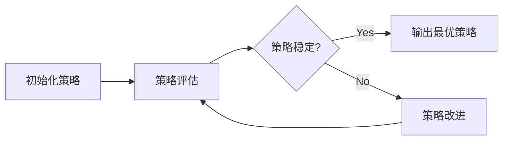

# 强化学习与AI代理工作流：策略迭代与最优解

## 1. 背景介绍
### 1.1 强化学习的兴起
### 1.2 AI代理的应用现状
### 1.3 策略迭代与最优解的重要性

## 2. 核心概念与联系
### 2.1 强化学习
#### 2.1.1 马尔可夫决策过程（MDP）
#### 2.1.2 状态、动作、奖励与环境
#### 2.1.3 价值函数与策略
### 2.2 AI代理
#### 2.2.1 定义与特点
#### 2.2.2 与传统算法的区别
### 2.3 策略迭代
#### 2.3.1 策略评估
#### 2.3.2 策略改进
### 2.4 最优解
#### 2.4.1 最优策略与最优价值函数
#### 2.4.2 收敛性与唯一性

## 3. 核心算法原理具体操作步骤
### 3.1 策略迭代算法
#### 3.1.1 初始化策略
#### 3.1.2 策略评估
#### 3.1.3 策略改进
#### 3.1.4 收敛判断
### 3.2 价值迭代算法
#### 3.2.1 初始化价值函数
#### 3.2.2 价值更新
#### 3.2.3 收敛判断
### 3.3 蒙特卡洛方法
#### 3.3.1 采样轨迹
#### 3.3.2 价值估计
#### 3.3.3 策略改进
### 3.4 时序差分学习
#### 3.4.1 Sarsa算法
#### 3.4.2 Q-learning算法
#### 3.4.3 DQN算法

## 4. 数学模型和公式详细讲解举例说明
### 4.1 马尔可夫决策过程数学模型
#### 4.1.1 状态转移概率矩阵
$$P(s'|s,a) = \begin{bmatrix}
p_{11} & p_{12} & \cdots & p_{1n} \\
p_{21} & p_{22} & \cdots & p_{2n} \\
\vdots & \vdots & \ddots & \vdots \\
p_{m1} & p_{m2} & \cdots & p_{mn}
\end{bmatrix}$$
#### 4.1.2 奖励函数
$R(s,a) = \mathbb{E}[R_t|S_{t-1}=s, A_{t-1}=a]$
#### 4.1.3 折扣因子
$\gamma \in [0,1]$
### 4.2 价值函数
#### 4.2.1 状态价值函数
$V^\pi(s) = \mathbb{E}_\pi[\sum_{k=0}^{\infty}\gamma^k R_{t+k+1}|S_t=s]$
#### 4.2.2 动作价值函数
$Q^\pi(s,a) = \mathbb{E}_\pi[\sum_{k=0}^{\infty}\gamma^k R_{t+k+1}|S_t=s, A_t=a]$
### 4.3 贝尔曼方程
#### 4.3.1 状态价值贝尔曼方程
$V^\pi(s) = \sum_a \pi(a|s) \sum_{s',r} p(s',r|s,a)[r+\gamma V^\pi(s')]$
#### 4.3.2 动作价值贝尔曼方程
$Q^\pi(s,a) = \sum_{s',r} p(s',r|s,a)[r+\gamma \sum_{a'} \pi(a'|s') Q^\pi(s',a')]$

## 5. 项目实践：代码实例和详细解释说明
### 5.1 OpenAI Gym环境介绍
### 5.2 策略迭代算法实现
```python
def policy_iteration(env, gamma=1.0, theta=1e-8):
    V = np.zeros(env.nS)
    policy = np.ones([env.nS, env.nA]) / env.nA
    while True:
        # 策略评估
        while True:
            delta = 0
            for s in range(env.nS):
                v = V[s]
                V[s] = sum([policy[s][a] * (env.P[s][a][0][2] + gamma * V[env.P[s][a][0][1]]) for a in range(env.nA)])
                delta = max(delta, abs(v - V[s]))
            if delta < theta:
                break
        # 策略改进
        policy_stable = True
        for s in range(env.nS):
            old_action = np.argmax(policy[s])
            best_action = np.argmax([sum([env.P[s][a][0][2] + gamma * V[env.P[s][a][0][1]]]) for a in range(env.nA)])
            if old_action != best_action:
                policy_stable = False
            policy[s] = np.eye(env.nA)[best_action]
        if policy_stable:
            return policy, V
```
### 5.3 DQN算法实现
```python
class DQN(nn.Module):
    def __init__(self, state_size, action_size):
        super(DQN, self).__init__()
        self.fc1 = nn.Linear(state_size, 64)
        self.fc2 = nn.Linear(64, 64)
        self.fc3 = nn.Linear(64, action_size)

    def forward(self, x):
        x = F.relu(self.fc1(x))
        x = F.relu(self.fc2(x))
        return self.fc3(x)

def train(model, target_model, memory, optimizer, gamma, batch_size):
    if len(memory) < batch_size:
        return
    transitions = memory.sample(batch_size)
    batch = Transition(*zip(*transitions))
    state_batch = torch.cat(batch.state)
    action_batch = torch.cat(batch.action)
    reward_batch = torch.cat(batch.reward)
    next_state_batch = torch.cat(batch.next_state)
    done_batch = torch.cat(batch.done)

    Q = model(state_batch).gather(1, action_batch)
    target_Q = target_model(next_state_batch).max(1)[0].detach()
    expected_Q = reward_batch + (1 - done_batch) * gamma * target_Q

    loss = F.mse_loss(Q, expected_Q.unsqueeze(1))
    optimizer.zero_grad()
    loss.backward()
    optimizer.step()
```

## 6. 实际应用场景
### 6.1 自动驾驶
### 6.2 智能推荐系统
### 6.3 机器人控制
### 6.4 游戏AI

## 7. 工具和资源推荐
### 7.1 OpenAI Gym
### 7.2 TensorFlow与Keras
### 7.3 PyTorch
### 7.4 RLlib

## 8. 总结：未来发展趋势与挑战
### 8.1 深度强化学习的崛起
### 8.2 多智能体强化学习
### 8.3 强化学习与计划、推理的结合
### 8.4 样本效率与泛化能力
### 8.5 安全性与可解释性

## 9. 附录：常见问题与解答
### 9.1 如何选择合适的状态表示和奖励函数设计？
### 9.2 如何平衡探索与利用？
### 9.3 如何处理高维状态空间和连续动作空间？
### 9.4 如何加速训练和改善收敛性？
### 9.5 如何应对非平稳环境和部分可观测环境？



强化学习作为一种通用的学习范式，近年来在人工智能领域得到了广泛的应用和研究。它通过智能体与环境的交互，不断尝试和优化策略，最终获得最优的决策能力。在这个过程中，策略迭代扮演着至关重要的角色，它交替地进行策略评估和策略改进，逐步逼近最优策略。

策略评估阶段利用当前策略计算每个状态的价值函数，刻画了在该策略下状态的长期累积奖励。贝尔曼方程建立了状态价值与动作价值之间的递归关系，为价值函数的迭代计算提供了理论基础。通过不断迭代直至收敛，我们可以得到当前策略下的准确价值估计。

策略改进阶段则基于评估得到的价值函数，贪婪地更新策略，选择能够获得最大价值的动作。新的策略必然优于或等于旧策略，这保证了策略迭代的单调性和收敛性。重复交替地执行策略评估和改进，最终将收敛到最优策略。

除了经典的策略迭代和价值迭代算法，我们还介绍了蒙特卡洛方法和时序差分学习等重要的强化学习算法。蒙特卡洛方法通过采样完整的交互轨迹来估计价值函数，适用于回合制任务。而时序差分学习则结合了动态规划和蒙特卡洛方法的优点，利用Bootstrap思想实现了在线、增量地学习价值函数，代表性算法包括Sarsa、Q-learning和DQN等。

强化学习在诸多领域展现出了巨大的应用潜力，如自动驾驶、智能推荐、机器人控制和游戏AI等。随着深度学习的发展，深度强化学习进一步拓展了传统强化学习的能力边界，使得我们能够直接从高维原始数据中学习策略，处理更加复杂的现实世界问题。多智能体强化学习考虑了多个智能体之间的交互与协作，为理解和优化复杂系统提供了新的视角。此外，如何将强化学习与计划、推理等其他智能技术相结合，构建更加灵活、高效的智能系统，也是值得关注的研究方向。

尽管强化学习取得了长足的进步，但在实际应用中仍然面临诸多挑战。样本效率和泛化能力是其中两个关键问题。如何从有限的交互样本中快速、高效地学习，并将学到的知识迁移到新的任务和环境中，仍需要进一步的研究。此外，强化学习系统的安全性和可解释性也备受关注。我们需要发展出可靠、可信的强化学习算法，确保其在现实世界中的安全应用，同时提供清晰、可理解的决策依据，增强人机交互和协作。

展望未来，强化学习与AI代理工作流的结合将为人工智能的发展开辟新的道路。通过策略迭代优化决策，融合深度学习、计划推理等技术，我们有望构建出更加智能、高效、安全的自主系统，应对现实世界中的复杂挑战。让我们携手探索强化学习的无限可能，共同开创人工智能的美好未来！

作者：禅与计算机程序设计艺术 / Zen and the Art of Computer Programming