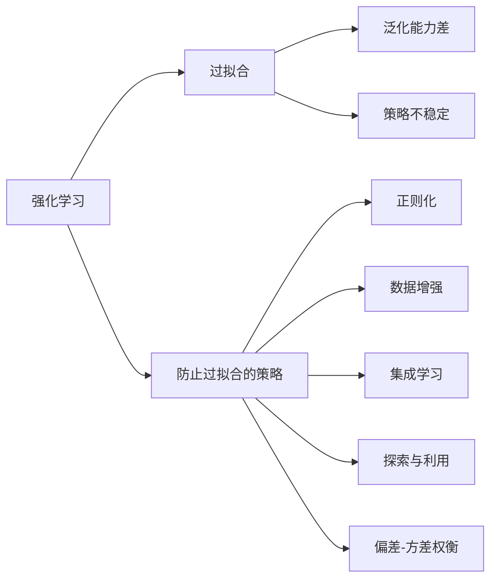

# 强化学习：防止过拟合的策略

## 1.背景介绍

强化学习(Reinforcement Learning,RL)是机器学习的一个重要分支,它通过智能体(Agent)与环境(Environment)的交互,从而学习到最优策略。然而,在实际应用中,RL模型经常会出现过拟合的问题,导致模型泛化能力差,无法很好地适应新的环境。本文将深入探讨RL中防止过拟合的各种策略。

### 1.1 强化学习基本概念
#### 1.1.1 Agent与Environment
#### 1.1.2 State、Action与Reward
#### 1.1.3 策略(Policy)与价值函数(Value Function)

### 1.2 过拟合问题
#### 1.2.1 过拟合的定义与危害
#### 1.2.2 RL中过拟合的特点
#### 1.2.3 导致过拟合的原因

## 2.核心概念与联系

### 2.1 泛化(Generalization)
#### 2.1.1 泛化的定义
#### 2.1.2 泛化与过拟合的关系
#### 2.1.3 提高泛化能力的意义

### 2.2 探索与利用(Exploration vs. Exploitation)
#### 2.2.1 探索与利用的概念
#### 2.2.2 探索与利用的平衡
#### 2.2.3 探索策略与过拟合

### 2.3 偏差-方差权衡(Bias-Variance Tradeoff)
#### 2.3.1 偏差与方差的定义
#### 2.3.2 偏差-方差权衡与过拟合
#### 2.3.3 降低方差的方法

## 3.核心算法原理具体操作步骤

### 3.1 正则化(Regularization)
#### 3.1.1 L1和L2正则化
#### 3.1.2 Dropout正则化
#### 3.1.3 正则化在RL中的应用

### 3.2 数据增强(Data Augmentation)
#### 3.2.1 数据增强的概念
#### 3.2.2 RL中的数据增强方法
#### 3.2.3 数据增强的优缺点

### 3.3 集成学习(Ensemble Learning)
#### 3.3.1 集成学习的原理
#### 3.3.2 RL中的集成学习方法
#### 3.3.3 集成学习的优势

## 4.数学模型和公式详细讲解举例说明

### 4.1 正则化项的数学表示
L1正则化:
$$J(\theta) = J(\theta) + \lambda \sum_{i=1}^{n} |\theta_i|$$

L2正则化:
$$J(\theta) = J(\theta) + \lambda \sum_{i=1}^{n} \theta_i^2$$

其中,$J(\theta)$为损失函数,$\lambda$为正则化系数。

### 4.2 Dropout的数学表示
对于第$l$层网络,Dropout的数学表示为:

$r^{(l)} \sim \text{Bernoulli}(p)$

$\tilde{a}^{(l)} = r^{(l)} * a^{(l)}$

$z^{(l+1)} = w^{(l+1)}\tilde{a}^{(l)} + b^{(l+1)}$

其中,$p$为保留概率,$*$为Hadamard积。

### 4.3 集成学习中Bagging的数学表示
假设有$T$个基学习器$h_1,h_2,...,h_T$和训练数据集$D$,Bagging的学习过程:

for $t=1,2,...,T$:
1. 从$D$中采样得到包含$m$个样本的数据集$D_t$
2. 基于$D_t$训练学习器$h_t$

最终集成学习器的输出:
$$H(x) = \text{argmax}_{y \in Y} \sum_{t=1}^T \mathbb{I}(h_t(x)=y)$$

其中,$\mathbb{I}(\cdot)$为指示函数。

## 5.项目实践：代码实例和详细解释说明

### 5.1 DQN中加入L2正则化

```python
import torch
import torch.nn as nn

class DQN(nn.Module):
    def __init__(self, state_dim, action_dim, lambda_reg):
        super(DQN, self).__init__()
        self.fc1 = nn.Linear(state_dim, 64)
        self.fc2 = nn.Linear(64, 64)
        self.fc3 = nn.Linear(64, action_dim)
        self.lambda_reg = lambda_reg

    def forward(self, x):
        x = torch.relu(self.fc1(x))
        x = torch.relu(self.fc2(x))
        x = self.fc3(x)
        return x

    def l2_regularization(self):
        l2_reg = torch.tensor(0.)
        for param in self.parameters():
            l2_reg += torch.norm(param)
        return self.lambda_reg * l2_reg
```

在DQN的`forward`函数中计算Q值的同时,`l2_regularization`函数计算L2正则化项,最终的损失函数为:

```python
loss = F.mse_loss(q_value, target_q_value) + model.l2_regularization()
```

### 5.2 数据增强在Atari游戏中的应用

```python
import numpy as np
import cv2

class AtariWrapper:
    def __init__(self, env):
        self.env = env

    def random_crop(self, frame):
        height, width = frame.shape[0], frame.shape[1]
        y = np.random.randint(0, height - 84)
        x = np.random.randint(0, width - 84)
        return frame[y:y+84, x:x+84]

    def step(self, action):
        state, reward, done, info = self.env.step(action)
        state = self.random_crop(state)
        return state, reward, done, info

    def reset(self):
        state = self.env.reset()
        state = self.random_crop(state)
        return state
```

通过`random_crop`函数对Atari游戏的观察状态进行随机裁剪,增加数据的多样性,提高模型的泛化能力。

### 5.3 DQN与集成学习结合

```python
class EnsembleDQN:
    def __init__(self, state_dim, action_dim, num_ensemble):
        self.models = [DQN(state_dim, action_dim) for _ in range(num_ensemble)]

    def act(self, state):
        q_values = [model(state) for model in self.models]
        avg_q_value = torch.mean(torch.stack(q_values), dim=0)
        action = torch.argmax(avg_q_value).item()
        return action

    def update(self, states, actions, rewards, next_states, dones):
        for model in self.models:
            model.update(states, actions, rewards, next_states, dones)
```

通过训练多个DQN,并将它们的Q值取平均,可以降低单个模型的方差,提高决策的稳定性。在更新时,每个模型独立地进行训练。

## 6.实际应用场景

### 6.1 自动驾驶
在自动驾驶中,RL算法需要具备很强的泛化能力,才能应对复杂多变的交通场景。可以通过数据增强、集成学习等方法,提高模型的鲁棒性。

### 6.2 推荐系统
推荐系统中,用户的偏好可能随时间变化,RL算法需要不断探索新的推荐策略。合理平衡探索与利用,避免过度拟合用户的历史偏好,是构建高效推荐系统的关键。

### 6.3 智能电网
在智能电网的调度优化问题中,RL算法需要根据电力负荷、天气条件等因素,制定合理的调度策略。引入正则化项,可以降低策略对噪声数据的敏感度,提高调度的稳定性。

## 7.工具和资源推荐

### 7.1 RL库
- OpenAI Baselines: 包含多种RL算法的高质量实现
- Stable Baselines: 基于PyTorch和TensorFlow的RL库
- RLlib: 基于Ray的分布式RL库

### 7.2 RL环境
- OpenAI Gym: 包含多个标准RL测试环境
- DeepMind Control Suite: DeepMind开源的物理模拟环境
- MuJoCo: 高度逼真的物理模拟器

### 7.3 论文与教程
- Overcoming Overfitting in Deep Reinforcement Learning
- Generalization in Reinforcement Learning
- Reinforcement Learning: An Introduction (2nd Edition)

## 8.总结：未来发展趋势与挑战

### 8.1 基于模型的RL
通过学习环境的转移动力学模型,可以生成更多的虚拟数据,从而缓解真实环境中数据不足导致的过拟合问题。

### 8.2 元学习
利用元学习,可以学习一个适应不同任务的初始化策略,提高RL算法在新环境中的泛化能力。

### 8.3 迁移学习
将已有的知识迁移到新任务中,可以显著减少新任务的学习成本,加速策略的收敛。

### 8.4 安全与鲁棒性
在实际应用中,RL系统需要对抗各种干扰和对抗攻击。如何在保证性能的同时,提高系统的安全性和鲁棒性,是一个亟待解决的挑战。

## 9.附录：常见问题与解答

### 9.1 RL中的过拟合有哪些具体表现?
- 在训练环境中表现良好,但在测试环境中性能急剧下降
- 对初始状态或超参数高度敏感,稍微扰动就会导致策略失效
- 学到的策略缺乏可解释性,难以泛化到新的任务中

### 9.2 RL中的数据增强与监督学习有何不同?
- RL中的数据增强需要考虑状态之间的时序依赖关系
- 增强后的数据要保证与原始MDP一致,不能改变环境动力学
- 针对稀疏奖励问题,数据增强要避免引入虚假奖励信号

### 9.3 集成学习是否会增加计算开销?
集成学习确实会增加计算开销,但通过并行计算、模型剪枝等技术,可以在保证性能的同时降低计算成本。此外,集成学习带来的泛化能力提升,可以节省在新环境中重新训练模型的开销。

### 9.4 如何权衡探索与利用?
探索与利用的权衡需要根据具体任务来确定。一般而言,在早期阶段应该鼓励更多的探索,随着学习的进行再逐渐偏向利用。常见的探索策略包括$\epsilon$-greedy、Upper Confidence Bound (UCB)、Thompson采样等。

### 9.5 RL中还有哪些防止过拟合的策略?
- 早停法(Early Stopping):当验证集性能开始下降时停止训练
- 梯度裁剪(Gradient Clipping):限制梯度的最大范数,防止梯度爆炸
- 目标网络(Target Network):缓解策略评估与改进之间的相关性
- 双Q学习(Double Q-learning):降低Q值估计的过高偏差



作者：禅与计算机程序设计艺术 / Zen and the Art of Computer Programming