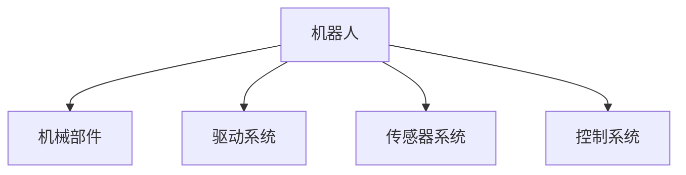

# 机器人学 (Robotics)

## 1. 背景介绍

### 1.1 机器人的定义和发展历史

机器人是一种能够执行各种任务的自动化机器,通过编程控制实现自动化操作。机器人的概念可以追溯到古希腊时期,但真正的机器人发展始于20世纪。

### 1.2 机器人的分类

根据应用领域,机器人可分为:

- 工业机器人
- 服务机器人
- 特种机器人

### 1.3 机器人技术的重要性

机器人技术在制造业、医疗、航空航天、勘探等领域发挥着重要作用,提高了生产效率和工作环境安全性。

## 2. 核心概念与联系

### 2.1 机器人的构成

机器人通常由以下部分组成:

- 机械部件(机构)
- 驱动系统
- 传感器系统
- 控制系统



### 2.2 机器人运动学与动力学

机器人运动学描述机器人的运动,动力学研究运动时的力和力矩。它们是机器人设计和控制的理论基础。

### 2.3 机器人感知与决策

机器人需要通过传感器获取环境信息,并根据感知信息做出决策,实现自主操作。

## 3. 核心算法原理具体操作步骤

### 3.1 正向运动学

正向运动学用于计算机器人末端执行器的位置和姿态。

步骤:

1. 建立机器人连杆坐标系
2. 利用D-H参数建立变换矩阵
3. 通过连乘变换矩阵求解末端位姿

### 3.2 逆向运动学

逆向运动学用于求解机器人各关节角度,使末端到达期望位姿。

步骤:

1. 分解位姿方程,消去冗余自由度
2. 使用数值解法或解析解法求解关节角度

### 3.3 轨迹规划

轨迹规划用于生成平滑、无碰撞的机器人运动路径。

步骤:

1. 建立环境模型
2. 离散化路径搜索空间
3. 应用算法(如A*,RRT等)搜索无碰撞路径
4. 平滑插值生成平滑轨迹

## 4. 数学模型和公式详细讲解举例说明

### 4.1 D-H参数模型

D-H参数模型用于描述相邻连杆之间的位置关系,包括4个参数:

- $\theta_i$: 绕Z轴旋转角度
- $d_i$: 沿Z轴的位移
- $a_i$: 沿X轴的位移
- $\alpha_i$: 绕X轴旋转角度

相邻连杆变换矩阵:

$$
^{i-1}T_i = \begin{bmatrix}
\cos\theta_i & -\sin\theta_i\cos\alpha_i & \sin\theta_i\sin\alpha_i & a_i\cos\theta_i\\
\sin\theta_i & \cos\theta_i\cos\alpha_i & -\cos\theta_i\sin\alpha_i & a_i\sin\theta_i\\
0 & \sin\alpha_i & \cos\alpha_i & d_i\\
0 & 0 & 0 & 1
\end{bmatrix}
$$

### 4.2 雅可比矩阵

雅可比矩阵描述了关节速度与末端执行器速度之间的映射关系:

$$
\vec{v} = J(\vec{q})\dot{\vec{q}}
$$

其中:
- $\vec{v}$是末端执行器的线速度和角速度
- $\dot{\vec{q}}$是关节角速度
- $J(\vec{q})$是雅可比矩阵,依赖于关节角度$\vec{q}$

## 5. 项目实践: 代码实例和详细解释说明

以下是一个Python示例,演示如何计算6自由度机器人的正向运动学:

```python
import numpy as np

# DH参数
dh_params = np.array([[0, np.pi/2, 0.089159, 0],
                      [0, 0, 0, -0.28],
                      [0, -np.pi/2, 0.13585, 0.37],
                      [0, np.pi/2, 0.095, 0],
                      [0, -np.pi/2, 0.082, 0],
                      [0, 0, 0.0535, 0]])

# 关节角度(单位:弧度)
joint_angles = np.array([0, np.pi/4, 0, -np.pi/2, 0, 0])

def dh_matrix(dh_params):
    theta, alpha, a, d = dh_params
    return np.array([[np.cos(theta), -np.sin(theta)*np.cos(alpha), np.sin(theta)*np.sin(alpha), a*np.cos(theta)],
                     [np.sin(theta), np.cos(theta)*np.cos(alpha), -np.cos(theta)*np.sin(alpha), a*np.sin(theta)],
                     [0, np.sin(alpha), np.cos(alpha), d],
                     [0, 0, 0, 1]])

def fwd_kinematics(dh_params, joint_angles):
    T = np.eye(4)
    for i in range(len(dh_params)):
        T = T @ dh_matrix(dh_params[i,:]).T @ np.array([[np.cos(joint_angles[i]), -np.sin(joint_angles[i]), 0, 0],
                                                        [np.sin(joint_angles[i]), np.cos(joint_angles[i]), 0, 0],
                                                        [0, 0, 1, 0],
                                                        [0, 0, 0, 1]])
    return T

T = fwd_kinematics(dh_params, joint_angles)
print(T)
```

代码解释:

1. 定义DH参数和关节角度
2. `dh_matrix`函数根据DH参数计算单个连杆的变换矩阵
3. `fwd_kinematics`函数通过连乘各连杆变换矩阵,计算末端执行器的位姿矩阵
4. 输出末端执行器的位姿矩阵

## 6. 实际应用场景

机器人技术在诸多领域有着广泛应用:

### 6.1 工业自动化

工业机器人可用于焊接、装配、上下料等重复性工作,提高生产效率。

### 6.2 服务机器人

服务机器人如家庭服务机器人、医疗手术机器人等,能够辅助或代替人工完成特定任务。

### 6.3 航空航天

机器人可用于航天器组装、航天员辅助等航空航天领域。

### 6.4 勘探与救援

机器人可用于危险环境勘探、救援等特殊任务。

## 7. 工具和资源推荐

### 7.1 机器人模拟软件

- ROS/Gazebo: 开源机器人模拟环境
- V-REP: 跨平台机器人仿真软件
- MuJoCo: 高性能物理引擎

### 7.2 开源库

- ROS: 机器人操作系统
- MoveIt!: 运动规划库
- OpenRAVE: 开源机器人模拟环境

### 7.3 在线课程

- 来自斯坦福大学的机器人学课程
- 麻省理工学院的edX机器人课程
- Coursera机器人在线课程

## 8. 总结: 未来发展趋势与挑战

机器人技术正在快速发展,未来趋势包括:

- 人工智能在机器人领域的广泛应用
- 协作机器人在工业和服务领域的普及
- 软体机器人等新型机器人的兴起
- 机器人在更多领域的应用拓展

但同时也面临一些挑战:

- 安全性和可靠性的提高
- 人机交互和社会接受度
- 伦理和法律法规的制定

## 9. 附录: 常见问题与解答

**Q: 什么是机器人学?**

A: 机器人学是一门跨学科的工程学科,研究机器人的设计、控制、感知和智能化等方面。

**Q: 工业机器人和服务机器人有何区别?**

A: 工业机器人主要用于自动化生产,服务机器人则用于辅助或代替人工完成各种服务性任务。

**Q: 如何选择合适的机器人?**

A: 选择机器人时需要考虑应用场景、负载能力、精度要求、成本等多方面因素。

**Q: 机器人的安全性如何保证?**

A: 可通过安全监控系统、紧急停止装置、防护装置等多种手段来确保机器人的安全运行。

作者: 禅与计算机程序设计艺术 / Zen and the Art of Computer Programming