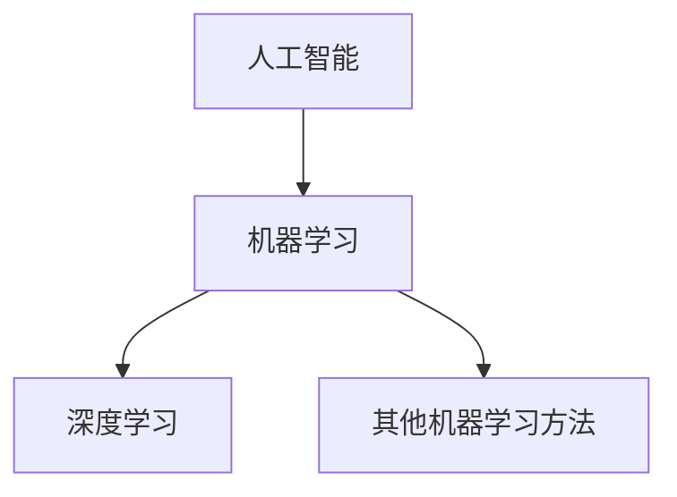

# 机器学习在金融领域的应用

## 1.背景介绍
### 1.1 金融行业面临的挑战
#### 1.1.1 海量数据处理
#### 1.1.2 实时风险监控
#### 1.1.3 个性化服务需求
### 1.2 机器学习的兴起
#### 1.2.1 大数据时代的到来
#### 1.2.2 计算能力的提升
#### 1.2.3 算法的不断创新

## 2.核心概念与联系
### 2.1 机器学习的定义与分类
#### 2.1.1 有监督学习
#### 2.1.2 无监督学习
#### 2.1.3 强化学习
### 2.2 机器学习与人工智能、深度学习的关系
#### 2.2.1 人工智能的发展历程
#### 2.2.2 机器学习是实现人工智能的关键途径
#### 2.2.3 深度学习是机器学习的重要分支



### 2.3 机器学习在金融领域的应用价值
#### 2.3.1 提升风险管理能力
#### 2.3.2 优化客户体验
#### 2.3.3 创新金融产品与服务

## 3.核心算法原理具体操作步骤
### 3.1 逻辑回归(Logistic Regression)
#### 3.1.1 二分类问题
#### 3.1.2 Sigmoid函数
#### 3.1.3 参数估计与优化
### 3.2 决策树(Decision Tree)
#### 3.2.1 信息熵与信息增益
#### 3.2.2 ID3、C4.5算法
#### 3.2.3 CART分类与回归树
### 3.3 支持向量机(SVM)
#### 3.3.1 最大间隔分类器
#### 3.3.2 核函数
#### 3.3.3 软间隔与正则化
### 3.4 集成学习(Ensemble Learning)
#### 3.4.1 Bagging与随机森林
#### 3.4.2 Boosting与AdaBoost、GBDT
#### 3.4.3 Stacking融合策略

## 4.数学模型和公式详细讲解举例说明
### 4.1 逻辑回归
二分类问题的逻辑回归模型：
$$P(Y=1|x) = \frac{1}{1+e^{-(\beta_0+\beta_1x_1+...+\beta_px_p)}}$$
其中，$Y$为二分类目标变量，$x=(x_1,x_2,...,x_p)$为输入变量，$\beta=(\beta_0,\beta_1,...,\beta_p)$为待估参数。
通过极大似然估计，求解参数$\beta$：
$$\hat{\beta}=\mathop{\arg\max}_{\beta} \sum_{i=1}^{N}[y_i\log p_i + (1-y_i)\log(1-p_i)]$$
其中，$p_i=P(y_i=1|x_i)$。

### 4.2 决策树
以ID3算法为例，其核心是在每个节点选择最优划分属性。
信息熵(Information Entropy)定义为：
$$H(D)=-\sum_{k=1}^K p_k\log_2{p_k}$$
其中，$p_k$为数据集$D$中第$k$类样本所占比例。
条件熵(Conditional Entropy)定义为：
$$H(D|A) = \sum_{v=1}^V \frac{|D^v|}{|D|}H(D^v)$$
其中，$A$为属性，$V$为$A$的可能取值数，$D^v$为$A$取值为$v$的样本子集。
信息增益(Information Gain)定义为：
$$g(D,A)=H(D)-H(D|A)$$
ID3算法选择信息增益最大的属性作为划分属性。

### 4.3 支持向量机
线性SVM的目标函数：
$$\min_{\omega,b} \frac{1}{2}||\omega||^2 \quad s.t. \quad y_i(\omega^Tx_i+b) \geq 1, i=1,2,...,N$$
引入拉格朗日乘子$\alpha$，得到对偶问题：
$$\max_{\alpha} \sum_{i=1}^N \alpha_i - \frac{1}{2}\sum_{i,j=1}^N \alpha_i \alpha_j y_i y_j (x_i \cdot x_j)$$
$$s.t. \sum_{i=1}^N \alpha_i y_i = 0, 0 \leq \alpha_i \leq C, i=1,2,...,N$$
求解出$\alpha$后，得到分类决策函数：
$$f(x) = \text{sign}(\sum_{i=1}^N \alpha_i y_i (x \cdot x_i) + b)$$

### 4.4 集成学习
以AdaBoost算法为例，其核心是多轮训练弱分类器，并赋予权重，最终线性组合。
初始化训练数据权重分布：
$$D_1 = (w_{11}, w_{12}, ..., w_{1N}), \quad w_{1i}=\frac{1}{N}$$
对$m=1,2,...,M$：
1. 使用分布$D_m$训练弱分类器$G_m(x)$
2. 计算$G_m(x)$在训练集上的分类误差率：
$$e_m = \sum_{i=1}^N w_{mi}I(G_m(x_i) \neq y_i)$$
3. 计算$G_m(x)$的系数：
$$\alpha_m = \frac{1}{2} \log \frac{1-e_m}{e_m}$$
4. 更新训练数据权重分布：
$$D_{m+1} = (w_{m+1,1}, w_{m+1,2}, ..., w_{m+1,N})$$
$$w_{m+1,i} = \frac{w_{mi}}{Z_m} \exp(-\alpha_m y_i G_m(x_i))$$
其中，$Z_m$是归一化因子。
最终的强分类器为：
$$G(x) = \text{sign}(\sum_{m=1}^M \alpha_m G_m(x))$$

## 5.项目实践：代码实例和详细解释说明
以Python和scikit-learn为例，演示机器学习在信用评分中的应用。
### 5.1 数据预处理
```python
import pandas as pd
from sklearn.model_selection import train_test_split
from sklearn.preprocessing import StandardScaler

# 读取数据
data = pd.read_csv('credit_data.csv')
# 划分特征和目标
X = data.iloc[:, :-1]
y = data.iloc[:, -1]
# 划分训练集和测试集
X_train, X_test, y_train, y_test = train_test_split(X, y, test_size=0.2, random_state=42)
# 标准化
scaler = StandardScaler()
X_train = scaler.fit_transform(X_train)
X_test = scaler.transform(X_test)
```
数据预处理步骤包括：读取数据、划分特征和目标、划分训练集和测试集、特征标准化等。

### 5.2 模型训练与评估
```python
from sklearn.linear_model import LogisticRegression
from sklearn.metrics import accuracy_score

# 训练逻辑回归模型
lr = LogisticRegression()
lr.fit(X_train, y_train)
# 模型预测
y_pred = lr.predict(X_test)
# 计算准确率
accuracy = accuracy_score(y_test, y_pred)
print("Accuracy: ", accuracy)
```
使用逻辑回归模型进行训练，并在测试集上进行预测，计算准确率。

### 5.3 模型应用
```python
# 单个样本预测
sample = [[2000, 1, 30, 0, 0, 2, 1, 1, 0, 0]]
sample = scaler.transform(sample)
pred = lr.predict(sample)
print("Prediction:", pred)

# 特征重要性
importances = lr.coef_[0]
feat_importances = pd.Series(importances, index=X.columns)
feat_importances.plot(kind='barh')
```
对单个新样本进行预测，并可视化模型的特征重要性，了解各个特征对信用评分的影响。

## 6.实际应用场景
### 6.1 信用评分
- 个人信用评估
- 中小企业信用评级
- 供应链金融风险管理
### 6.2 反欺诈
- 信用卡欺诈检测
- 保险欺诈识别
- 电商虚假交易监控
### 6.3 量化投资
- 股票趋势预测
- 资产组合优化
- 衍生品定价
### 6.4 客户分析
- 客户画像与细分
- 精准营销
- 客户流失预警

## 7.工具和资源推荐
### 7.1 机器学习库
- scikit-learn
- TensorFlow
- PyTorch
- Keras
### 7.2 数据处理与可视化
- Pandas
- Numpy
- Matplotlib
- Seaborn
### 7.3 在线学习资源
- Coursera机器学习课程
- 谷歌机器学习速成课程
- 卡内基梅隆大学机器学习系列课程
### 7.4 书籍推荐
- 《机器学习》周志华
- 《统计学习方法》李航
- 《机器学习实战》Peter Harrington
- 《Hands-On Machine Learning with Scikit-Learn and TensorFlow》Aurélien Géron

## 8.总结：未来发展趋势与挑战
### 8.1 发展趋势
- 深度学习与强化学习的崛起
- 图神经网络在金融关系挖掘中的应用
- 联邦学习助力数据隐私保护
- AI+区块链推动智能金融生态建设
### 8.2 面临的挑战
- 可解释性与可信性
- 公平性与去偏见
- 模型的鲁棒性与稳定性
- 人才缺口与技术应用落地

## 9.附录：常见问题与解答
### 9.1 机器学习和统计学的区别？
机器学习侧重于使用计算机系统从数据中自动分析获得规律，并利用规律对未知数据进行预测。统计学更侧重于数据的收集、分析和解释，以及对未知参数的估计和假设检验。但机器学习与统计学又是高度关联的，很多机器学习算法本质上是统计模型。
### 9.2 如何选择模型评估指标？
不同的任务和应用场景，需要选择合适的模型评估指标。对于二分类问题，可使用准确率、精确率、召回率、F1分数、ROC曲线和AUC值等。对于多分类问题，可使用混淆矩阵、micro-averaging、macro-averaging等。对于回归问题，可使用均方误差、平均绝对误差、R平方等。
### 9.3 如何处理数据不平衡问题？
数据不平衡会导致模型倾向于预测多数类，忽视少数类。常见的处理方法有过采样（如SMOTE）、欠采样、设置类别权重、改变评估指标（如F1分数）等。还可使用一些专门针对不平衡数据的算法，如Focal Loss、Balanced Random Forest等。
### 9.4 机器学习在金融领域应用的数据安全与隐私保护问题？
金融数据往往涉及个人隐私和商业机密，需要严格保护。可采取数据脱敏、同态加密、安全多方计算、联邦学习等技术手段，在保护数据安全和隐私的前提下开展机器学习应用。相关的法律法规和行业标准也在不断健全，如《数据安全法》、《个人信息保护法》等。

作者：禅与计算机程序设计艺术 / Zen and the Art of Computer Programming