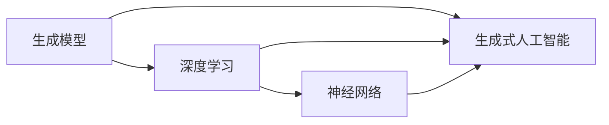

## 1.背景介绍

生成式人工智能（Generative AI）是一种强大的人工智能技术，它能够创建以前从未存在过的内容，如图像、音乐、语言或其他类型的数据。这种技术的出现，使得我们可以从全新的角度理解和创造数据。

## 2.核心概念与联系

生成式人工智能的核心概念包括生成模型、深度学习和神经网络。生成模型是一种统计模型的范式，它通过对数据的概率分布进行建模，来生成新的数据实例。深度学习是一种机器学习方法，它尝试模拟人脑的工作方式，通过训练大量数据来自动学习数据的内在规律和表示层次。神经网络是深度学习的主要工具，它模拟了人脑的神经元网络来进行信息处理。



## 3.核心算法原理具体操作步骤

生成式人工智能的核心算法包括生成对抗网络（GANs）和变分自编码器（VAEs）。GANs通过同时训练两个神经网络（一个生成器和一个判别器）来生成新的数据实例，而VAEs通过编码和解码数据来生成新的数据实例。

以下是GANs的基本操作步骤：

1. 初始化生成器和判别器。
2. 对于每一轮训练：
   1. 使用生成器生成一批假数据。
   2. 从真实数据中采样一批数据。
   3. 使用判别器对真实数据和假数据进行分类。
   4. 使用判别器的分类结果来更新生成器和判别器的参数。

以下是VAEs的基本操作步骤：

1. 初始化编码器和解码器。
2. 对于每一轮训练：
   1. 使用编码器对真实数据进行编码，得到一批隐向量。
   2. 使用解码器对隐向量进行解码，生成一批假数据。
   3. 计算真实数据和假数据之间的重构误差和隐向量的KL散度。
   4. 使用重构误差和KL散度来更新编码器和解码器的参数。

## 4.数学模型和公式详细讲解举例说明

生成对抗网络的数学模型可以用一个最小最大二人博弈问题来描述。给定一个生成器$G$和一个判别器$D$，我们希望找到一个纳什均衡，使得生成器生成的数据能够最大程度地欺骗判别器，而判别器能够最大程度地区分真实数据和生成数据。这可以用以下的公式来描述：

$$
\min_G \max_D V(D, G) = \mathbb{E}_{x \sim p_{\text{data}}(x)}[\log D(x)] + \mathbb{E}_{z \sim p_{z}(z)}[\log(1 - D(G(z)))]
$$

其中，$x$是真实数据，$z$是生成器的输入噪声，$p_{\text{data}}(x)$是真实数据的分布，$p_{z}(z)$是噪声的分布，$D(x)$是判别器对真实数据的预测，$D(G(z))$是判别器对生成数据的预测，$\mathbb{E}$是期望运算。

变分自编码器的数学模型可以用一个最小化重构误差和KL散度的优化问题来描述。给定一个编码器$E$和一个解码器$D$，我们希望找到一个编码和解码的过程，使得生成的数据能够尽可能地接近真实数据，同时编码的隐向量能够尽可能地接近一个先验分布。这可以用以下的公式来描述：

$$
\min_{E, D} L(E, D) = \mathbb{E}_{x \sim p_{\text{data}}(x)}[\|x - D(E(x))\|^2] + D_{KL}(E(x) || p_{z}(z))
$$

其中，$x$是真实数据，$z$是编码器的隐向量，$p_{\text{data}}(x)$是真实数据的分布，$p_{z}(z)$是隐向量的先验分布，$D(E(x))$是解码器对隐向量的预测，$\|x - D(E(x))\|^2$是重构误差，$D_{KL}(E(x) || p_{z}(z))$是隐向量和先验分布之间的KL散度，$\mathbb{E}$是期望运算。

## 5.项目实践：代码实例和详细解释说明

以下是一个使用PyTorch实现的简单的生成对抗网络的示例代码：

```python
import torch
from torch import nn

# 定义生成器
class Generator(nn.Module):
    def __init__(self):
        super(Generator, self).__init__()
        self.main = nn.Sequential(
            nn.Linear(100, 256),
            nn.ReLU(),
            nn.Linear(256, 512),
            nn.ReLU(),
            nn.Linear(512, 1024),
            nn.ReLU(),
            nn.Linear(1024, 784),
            nn.Tanh()
        )

    def forward(self, input):
        return self.main(input)

# 定义判别器
class Discriminator(nn.Module):
    def __init__(self):
        super(Discriminator, self).__init__()
        self.main = nn.Sequential(
            nn.Linear(784, 1024),
            nn.LeakyReLU(0.2),
            nn.Dropout(0.3),
            nn.Linear(1024, 512),
            nn.LeakyReLU(0.2),
            nn.Dropout(0.3),
            nn.Linear(512, 256),
            nn.LeakyReLU(0.2),
            nn.Dropout(0.3),
            nn.Linear(256, 1),
            nn.Sigmoid()
        )

    def forward(self, input):
        return self.main(input)
```

在这个代码中，我们首先定义了一个生成器和一个判别器。生成器接收一个100维的噪声向量作为输入，然后通过一系列的全连接层和非线性激活函数，最后生成一个784维的向量作为输出。判别器接收一个784维的向量作为输入，然后通过一系列的全连接层和非线性激活函数，最后生成一个1维的向量作为输出，表示输入向量来自真实数据的概率。

## 6.实际应用场景

生成式人工智能在许多领域都有广泛的应用，包括但不限于：

1. 图像生成：生成式人工智能可以用于生成高质量的图像，例如人脸、物体、风景等。
2. 音乐创作：生成式人工智能可以用于生成新的音乐，或者在现有的音乐基础上进行改编和创作。
3. 语言模型：生成式人工智能可以用于生成自然语言文本，例如文章、诗歌、故事等。
4. 数据增强：生成式人工智能可以用于生成新的训练数据，以提高机器学习模型的性能和泛化能力。

## 7.工具和资源推荐

以下是一些学习和使用生成式人工智能的推荐工具和资源：

1. PyTorch：一个强大的深度学习框架，提供了丰富的神经网络模块和优化算法。
2. TensorFlow：一个由Google开发的深度学习框架，提供了丰富的神经网络模块和优化算法。
3. Keras：一个基于Python的深度学习框架，提供了高级的神经网络API，易于使用和快速原型设计。
4. GANs in Action：一本关于生成对抗网络的书籍，详细介绍了生成对抗网络的原理和应用。
5. Deep Learning Book：一本由Ian Goodfellow等人编写的深度学习教材，详细介绍了深度学习的基础知识和最新进展。

## 8.总结：未来发展趋势与挑战

生成式人工智能是一个非常活跃的研究领域，它的未来发展趋势包括但不限于：

1. 更高质量的生成：随着算法和硬件技术的发展，我们期望生成式人工智能能够生成更高质量和更真实的数据。
2. 更大规模的生成：随着计算资源的增加，我们期望生成式人工智能能够生成更大规模的数据，例如高分辨率的图像和长篇的文本。
3. 更多样化的生成：我们期望生成式人工智能能够生成更多样化的数据，以满足不同的需求和应用。

生成式人工智能也面临着一些挑战，包括但不限于：

1. 训练稳定性：生成对抗网络的训练经常会遇到模式崩溃和梯度消失的问题，需要更好的训练技巧和算法来解决。
2. 评估难度：生成数据的质量和多样性往往难以量化，需要更好的评估指标和方法来评估生成模型的性能。
3. 数据依赖：生成式人工智能的性能往往依赖于训练数据的质量和数量，需要更好的数据收集和预处理方法来提高生成模型的性能。

## 9.附录：常见问题与解答

Q: 生成式人工智能和判别式人工智能有什么区别？

A: 生成式人工智能和判别式人工智能是机器学习的两种基本范式。生成式人工智能试图模拟数据的生成过程，从而生成新的数据实例；而判别式人工智能试图学习数据的条件概率分布，从而进行分类或回归等任务。

Q: 生成对抗网络和变分自编码器有什么区别？

A: 生成对抗网络和变分自编码器都是生成式人工智能的重要算法。生成对抗网络通过一个二人博弈的框架，让生成器和判别器互相竞争，以生成高质量的数据；而变分自编码器通过一个编码和解码的过程，以生成接近真实数据的数据。

Q: 生成式人工智能有哪些应用？

A: 生成式人工智能在许多领域都有广泛的应用，包括图像生成、音乐创作、语言模型和数据增强等。

作者：禅与计算机程序设计艺术 / Zen and the Art of Computer Programming