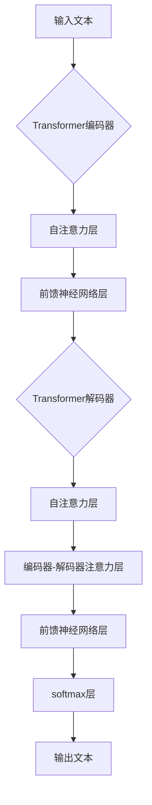

# 生生不息的循环：使用强大的GPT-4 API

## 1. 背景介绍

### 1.1 人工智能的发展历程
#### 1.1.1 早期的人工智能
#### 1.1.2 机器学习的崛起
#### 1.1.3 深度学习的突破

### 1.2 自然语言处理的演进
#### 1.2.1 基于规则的方法
#### 1.2.2 统计语言模型
#### 1.2.3 神经网络语言模型

### 1.3 GPT系列模型的诞生
#### 1.3.1 GPT-1：开启语言模型新纪元
#### 1.3.2 GPT-2：更大更强的语言模型
#### 1.3.3 GPT-3：里程碑式的飞跃

## 2. 核心概念与联系

### 2.1 Transformer架构
#### 2.1.1 自注意力机制
#### 2.1.2 多头注意力
#### 2.1.3 位置编码

### 2.2 预训练与微调
#### 2.2.1 无监督预训练
#### 2.2.2 有监督微调
#### 2.2.3 零样本学习

### 2.3 GPT-4的创新之处
#### 2.3.1 模型规模的扩大
#### 2.3.2 训练数据的丰富
#### 2.3.3 多模态能力的提升

## 3. 核心算法原理具体操作步骤

### 3.1 Transformer的编码器-解码器结构
#### 3.1.1 编码器的组成
#### 3.1.2 解码器的组成
#### 3.1.3 编码器-解码器的连接

### 3.2 自注意力的计算过程
#### 3.2.1 计算Query、Key和Value
#### 3.2.2 计算注意力权重
#### 3.2.3 加权求和

### 3.3 位置编码的计算方法
#### 3.3.1 正弦和余弦函数
#### 3.3.2 位置编码的维度
#### 3.3.3 与词嵌入相加

## 4. 数学模型和公式详细讲解举例说明

### 4.1 Transformer的数学表示
#### 4.1.1 自注意力的数学公式
$$Attention(Q,K,V) = softmax(\frac{QK^T}{\sqrt{d_k}})V$$
其中，$Q$、$K$、$V$分别表示Query、Key和Value矩阵，$d_k$为Key的维度。

#### 4.1.2 多头注意力的数学公式
$$MultiHead(Q,K,V) = Concat(head_1,...,head_h)W^O$$
$$head_i = Attention(QW_i^Q, KW_i^K, VW_i^V)$$
其中，$W_i^Q$、$W_i^K$、$W_i^V$和$W^O$为可学习的权重矩阵。

#### 4.1.3 位置编码的数学公式
$$PE_{(pos,2i)} = sin(pos/10000^{2i/d_{model}})$$
$$PE_{(pos,2i+1)} = cos(pos/10000^{2i/d_{model}})$$
其中，$pos$为位置，$i$为维度，$d_{model}$为词嵌入的维度。

### 4.2 损失函数与优化算法
#### 4.2.1 交叉熵损失函数
#### 4.2.2 AdamW优化算法
#### 4.2.3 学习率调度策略

## 5. 项目实践：代码实例和详细解释说明

### 5.1 使用GPT-4 API进行文本生成
#### 5.1.1 安装和导入必要的库
```python
!pip install openai
import openai
```

#### 5.1.2 设置API密钥
```python
openai.api_key = "your_api_key"
```

#### 5.1.3 调用GPT-4 API生成文本
```python
prompt = "Once upon a time"
response = openai.Completion.create(
    engine="davinci",
    prompt=prompt,
    max_tokens=100,
    n=1,
    stop=None,
    temperature=0.7,
)
generated_text = response.choices[0].text.strip()
print(generated_text)
```

### 5.2 使用GPT-4 API进行对话
#### 5.2.1 定义对话函数
```python
def chat_with_gpt4(messages):
    response = openai.ChatCompletion.create(
        model="gpt-4",
        messages=messages,
        max_tokens=150,
        n=1,
        stop=None,
        temperature=0.7,
    )
    reply = response.choices[0].message.content.strip()
    return reply
```

#### 5.2.2 进行多轮对话
```python
messages = [
    {"role": "system", "content": "You are a helpful assistant."},
    {"role": "user", "content": "Hello! How are you today?"}
]

while True:
    reply = chat_with_gpt4(messages)
    print(f"Assistant: {reply}")

    user_input = input("User: ")
    messages.append({"role": "assistant", "content": reply})
    messages.append({"role": "user", "content": user_input})
```

## 6. 实际应用场景

### 6.1 智能客服
#### 6.1.1 理解用户意图
#### 6.1.2 提供个性化回复
#### 6.1.3 多轮对话能力

### 6.2 内容创作
#### 6.2.1 文章写作辅助
#### 6.2.2 脚本创作灵感
#### 6.2.3 广告文案生成

### 6.3 代码辅助
#### 6.3.1 代码补全与生成
#### 6.3.2 代码解释与优化
#### 6.3.3 代码调试与错误修复

## 7. 工具和资源推荐

### 7.1 OpenAI官方文档
#### 7.1.1 API参考
#### 7.1.2 最佳实践指南
#### 7.1.3 示例代码库

### 7.2 第三方库和框架
#### 7.2.1 Hugging Face Transformers
#### 7.2.2 🤗 Accelerate
#### 7.2.3 OpenAI Gym

### 7.3 相关论文和博客
#### 7.3.1 Attention Is All You Need
#### 7.3.2 Language Models are Few-Shot Learners
#### 7.3.3 The Illustrated GPT-2

## 8. 总结：未来发展趋势与挑战

### 8.1 模型规模的持续扩大
#### 8.1.1 计算资源的需求
#### 8.1.2 训练效率的提升
#### 8.1.3 模型压缩与加速

### 8.2 多模态学习的深入探索
#### 8.2.1 视觉-语言模型
#### 8.2.2 语音-语言模型
#### 8.2.3 多模态融合与对齐

### 8.3 可解释性与可控性
#### 8.3.1 模型决策过程的透明度
#### 8.3.2 减少偏见与歧视
#### 8.3.3 防止恶意使用

## 9. 附录：常见问题与解答

### 9.1 如何获取GPT-4 API的访问权限？
目前GPT-4 API仍处于有限访问阶段，需要通过申请获得访问权限。您可以在OpenAI官网上填写申请表，等待审核通过后即可使用。

### 9.2 使用GPT-4 API需要付费吗？
是的，使用GPT-4 API是需要付费的。OpenAI提供了不同的定价方案，根据您的使用量和需求选择合适的方案。具体定价信息可以在OpenAI官网上查看。

### 9.3 GPT-4 API的并发限制是多少？
GPT-4 API的并发限制取决于您的订阅计划。免费试用版有较低的并发限制，而付费版可以获得更高的并发限制。具体限制信息可以在OpenAI官网上查看或联系客服咨询。



以上是使用强大的GPT-4 API进行自然语言处理任务的详细介绍。GPT-4作为当前最先进的语言模型之一，其强大的性能和广泛的应用前景令人印象深刻。通过深入了解其背后的核心概念、算法原理以及实际应用场景，我们可以更好地利用这一强大的工具来解决各种自然语言处理问题，推动人工智能技术的发展。

展望未来，GPT-4及其后续模型的发展仍面临着诸多挑战，如模型规模的持续扩大、多模态学习的深入探索以及可解释性与可控性的提升等。但我们有理由相信，通过研究者和工程师的不断努力，这些挑战终将被一一克服，自然语言处理技术也必将迎来更加辉煌的明天。

作者：禅与计算机程序设计艺术 / Zen and the Art of Computer Programming