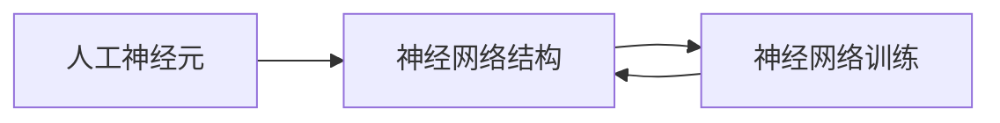

# 神经网络原理与代码实战案例讲解

## 1.背景介绍
### 1.1 人工智能与神经网络的发展历程
#### 1.1.1 人工智能的起源与发展
#### 1.1.2 神经网络的兴起
#### 1.1.3 深度学习的崛起

### 1.2 神经网络的应用领域
#### 1.2.1 计算机视觉
#### 1.2.2 自然语言处理
#### 1.2.3 语音识别
#### 1.2.4 其他应用

### 1.3 学习神经网络的重要性
#### 1.3.1 掌握人工智能的核心技术
#### 1.3.2 解决复杂问题的有力工具
#### 1.3.3 推动科技进步与社会发展

## 2.核心概念与联系
### 2.1 人工神经元模型
#### 2.1.1 感知器(Perceptron)
#### 2.1.2 Sigmoid神经元
#### 2.1.3 ReLU神经元

### 2.2 神经网络结构
#### 2.2.1 前馈神经网络(FNN)
#### 2.2.2 卷积神经网络(CNN)
#### 2.2.3 循环神经网络(RNN)

### 2.3 神经网络训练
#### 2.3.1 损失函数
#### 2.3.2 梯度下降法
#### 2.3.3 反向传播算法

### 2.4 核心概念之间的联系


## 3.核心算法原理具体操作步骤
### 3.1 前馈神经网络(FNN)
#### 3.1.1 网络结构设计
#### 3.1.2 前向传播
#### 3.1.3 反向传播
#### 3.1.4 参数更新

### 3.2 卷积神经网络(CNN)
#### 3.2.1 卷积层
#### 3.2.2 池化层
#### 3.2.3 全连接层
#### 3.2.4 CNN训练过程

### 3.3 循环神经网络(RNN)
#### 3.3.1 RNN基本结构
#### 3.3.2 LSTM网络
#### 3.3.3 GRU网络
#### 3.3.4 RNN训练过程

## 4.数学模型和公式详细讲解举例说明
### 4.1 感知器模型
单个感知器可以表示为：

$$
y = f(\sum_{i=1}^{n} w_i x_i + b)
$$

其中，$x_i$为输入，$w_i$为权重，$b$为偏置，$f$为激活函数。

### 4.2 Sigmoid函数
Sigmoid函数定义为：

$$
\sigma(x) = \frac{1}{1+e^{-x}}
$$

其导数为：

$$
\sigma'(x) = \sigma(x)(1-\sigma(x))
$$

### 4.3 交叉熵损失函数
二分类问题的交叉熵损失为：

$$
L = -\frac{1}{N}\sum_{i=1}^N y_i \log(\hat{y}_i) + (1-y_i) \log(1-\hat{y}_i)
$$

其中，$y_i$为真实标签，$\hat{y}_i$为预测值。

### 4.4 梯度下降法
参数$\theta$的更新公式为：

$$
\theta := \theta - \alpha \frac{\partial L}{\partial \theta}
$$

其中，$\alpha$为学习率，$L$为损失函数。

## 5.项目实践：代码实例和详细解释说明
### 5.1 用Numpy实现简单的前馈神经网络

```python
import numpy as np

def sigmoid(x):
    return 1 / (1 + np.exp(-x))

class SimpleNet:
    def __init__(self, input_size, hidden_size, output_size):
        self.W1 = np.random.randn(input_size, hidden_size)
        self.b1 = np.zeros(hidden_size)
        self.W2 = np.random.randn(hidden_size, output_size)
        self.b2 = np.zeros(output_size)

    def forward(self, x):
        self.z1 = np.dot(x, self.W1) + self.b1
        self.a1 = sigmoid(self.z1)
        self.z2 = np.dot(self.a1, self.W2) + self.b2
        y = sigmoid(self.z2)
        return y

    def backward(self, x, y, y_pred):
        delta3 = (y_pred - y) * y_pred * (1 - y_pred)
        dW2 = np.dot(self.a1.T, delta3)
        db2 = np.sum(delta3, axis=0)

        delta2 = np.dot(delta3, self.W2.T) * self.a1 * (1 - self.a1)
        dW1 = np.dot(x.T, delta2)
        db1 = np.sum(delta2, axis=0)

        return dW1, db1, dW2, db2

    def update(self, dW1, db1, dW2, db2, lr):
        self.W1 -= lr * dW1
        self.b1 -= lr * db1
        self.W2 -= lr * dW2
        self.b2 -= lr * db2
```

这个简单的前馈神经网络包含一个隐藏层，使用Sigmoid激活函数。`forward`方法实现前向传播，`backward`方法实现反向传播计算梯度，`update`方法根据梯度更新参数。

### 5.2 用Pytorch实现卷积神经网络

```python
import torch
import torch.nn as nn
import torch.optim as optim

class CNN(nn.Module):
    def __init__(self):
        super(CNN, self).__init__()
        self.conv1 = nn.Conv2d(1, 16, kernel_size=3, stride=1, padding=1)
        self.relu1 = nn.ReLU()
        self.pool1 = nn.MaxPool2d(kernel_size=2)

        self.conv2 = nn.Conv2d(16, 32, kernel_size=3, stride=1, padding=1)
        self.relu2 = nn.ReLU()
        self.pool2 = nn.MaxPool2d(kernel_size=2)

        self.fc = nn.Linear(32 * 7 * 7, 10)

    def forward(self, x):
        x = self.conv1(x)
        x = self.relu1(x)
        x = self.pool1(x)

        x = self.conv2(x)
        x = self.relu2(x)
        x = self.pool2(x)

        x = x.view(-1, 32 * 7 * 7)
        x = self.fc(x)
        return x

model = CNN()
criterion = nn.CrossEntropyLoss()
optimizer = optim.Adam(model.parameters(), lr=0.001)
```

这个CNN包含两个卷积层和一个全连接层，使用ReLU激活函数和Max Pooling。定义好模型结构后，选择损失函数和优化器，即可进行训练。Pytorch能够大大简化神经网络的实现。

## 6.实际应用场景
### 6.1 图像分类
利用卷积神经网络对图像进行分类，如识别手写数字、物体检测等。

### 6.2 自然语言处理
使用循环神经网络处理文本数据，如情感分析、机器翻译、文本生成等。

### 6.3 推荐系统
通过神经网络学习用户和物品的隐向量，预测用户的喜好。

### 6.4 异常检测
训练自编码器等无监督模型，通过重构误差检测数据中的异常点。

## 7.工具和资源推荐
### 7.1 深度学习框架
- Tensorflow: 由Google开发，功能完备，社区活跃。
- Pytorch: 由Facebook开发，接口简洁，便于快速实现原型。
- Keras: 基于Tensorflow的高层API，上手简单。

### 7.2 数据集
- MNIST: 手写数字数据集，包含60000张训练图像和10000张测试图像。
- ImageNet: 大规模图像数据集，常用于测试图像分类算法性能。
- 20 Newsgroups: 新闻文本数据集，包含20个主题，适合文本分类任务。

### 7.3 在线课程
- 吴恩达《Deep Learning》: Coursera上的深度学习系列课程。
- 李宏毅《机器学习》：台湾大学李宏毅教授的机器学习课程。
- CS231n: 斯坦福大学的卷积神经网络课程。

## 8.总结：未来发展趋势与挑战
### 8.1 神经网络的发展趋势
#### 8.1.1 模型结构不断创新
#### 8.1.2 网络规模日益增大
#### 8.1.3 多模态学习受到关注

### 8.2 面临的挑战
#### 8.2.1 模型可解释性
#### 8.2.2 数据隐私与安全
#### 8.2.3 模型的公平性

### 8.3 展望
神经网络技术必将在更多领域得到应用，同时也需要研究者不断探索，攻克难题，推动人工智能事业的发展。

## 9.附录：常见问题与解答
### 9.1 如何选择神经网络的超参数？
通过交叉验证、网格搜索等方法选取最优超参数组合。此外，还可参考前人的经验，从较好的默认值开始调试。

### 9.2 神经网络容易过拟合怎么办？
可采取以下措施减轻过拟合：增大数据量、使用正则化技术、引入Dropout层、进行早停等。

### 9.3 训练神经网络时Loss不下降是什么原因？
可能原因包括：学习率过大或过小、Batch Size不合适、模型结构设计不当、数据预处理有误等。需要根据具体情况进行分析和调整。

作者：禅与计算机程序设计艺术 / Zen and the Art of Computer Programming