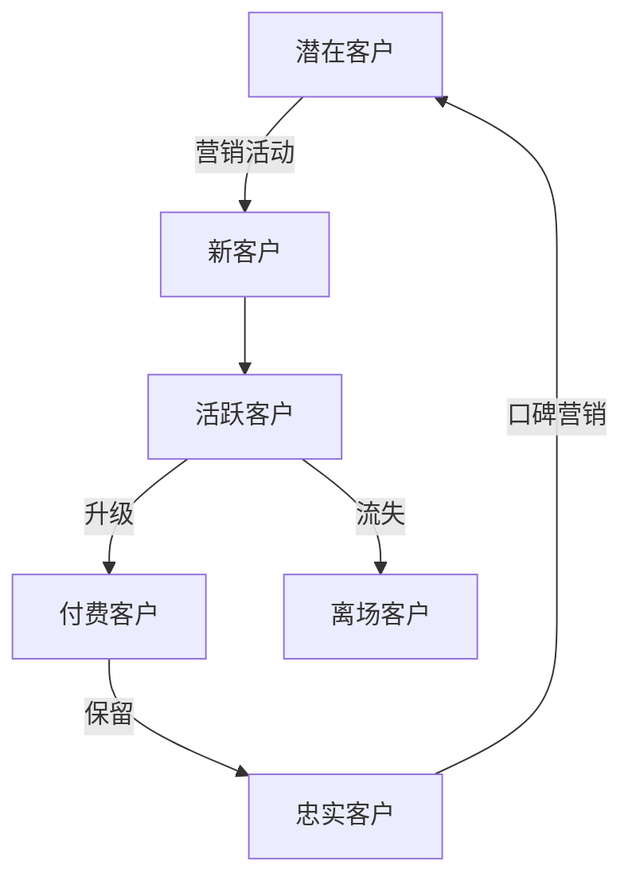

# 移动端游戏客户偏好分析

## 1.背景介绍

### 1.1 移动游戏市场概况

随着智能手机和平板电脑的普及,移动游戏已经成为游戏行业的重要组成部分。根据NewZoo的数据,2022年全球移动游戏收入达到929亿美元,占整个游戏市场收入的近50%。移动游戏的优势在于便携性强、操作简单、价格低廉,可以满足用户在任何时间和地点的娱乐需求。

### 1.2 客户偏好分析的重要性

在这个竞争激烈的移动游戏市场中,了解玩家的偏好是制胜的关键。游戏开发商需要深入分析用户的喜好,才能开发出符合市场需求的产品。客户偏好分析可以帮助企业:

- 确定目标受众
- 优化游戏内容和特性
- 制定有效的营销策略
- 提高用户留存率和付费转化率

### 1.3 分析方法综述

常见的客户偏好分析方法包括:

- 用户调研(问卷、访谈、焦点小组等)
- 游戏内数据分析(玩家行为数据)
- 社交媒体监测(论坛、社交网站等)
- A/B测试

## 2.核心概念与联系

### 2.1 客户价值

客户价值是指一个客户对企业的价值贡献,包括直接收益(如付费金额)和间接收益(如口碑营销)。通过分析客户的价值,企业可以制定差异化的营销策略,重点关注高价值客户群体。

### 2.2 客户生命周期

客户生命周期描述了客户与企业互动的不同阶段,包括吸引、转化、留存和发展等。不同阶段的客户偏好存在差异,需要采取不同的策略。



### 2.3 客户细分

客户细分是将客户群体划分为若干个具有相似特征的子群体。常见的细分变量包括:

- 人口统计学变量(年龄、性别、地理位置等)
- 行为变量(使用频率、支付意愿等)
- 心理变量(动机、态度、生活方式等)

## 3.核心算法原理具体操作步骤

### 3.1 聚类分析

聚类分析是一种无监督学习算法,用于将数据集划分为若干个具有内部相似性的簇。常见的聚类算法包括K-Means、层次聚类和DBSCAN等。

聚类分析在客户偏好分析中的应用:

1. 数据预处理(缺失值处理、标准化等)
2. 选择聚类算法和参数(如K-Means中的K值)
3. 运行聚类算法,获得客户簇
4. 分析每个簇的特征,描绘客户画像
5. 针对不同簇制定营销策略

### 3.2 关联规则挖掘

关联规则挖掘旨在发现数据集中的频繁项集和相关性规则。常用的算法有Apriori和FP-Growth。

应用于游戏内购买行为分析的步骤:

1. 将用户购买记录转化为交易数据集
2. 设置最小支持度和置信度阈值
3. 使用算法发现频繁项集
4. 生成关联规则,例如"购买A也可能购买B"
5. 根据规则进行捆绑销售、个性化推荐等

### 3.3 协同过滤

协同过滤是一种基于用户对项目的历史评价,发现具有相似兴趣的用户群体,并进行个性化推荐的算法。常见的有基于用户的协同过滤和基于项目的协同过滤。

基于用户的协同过滤步骤:

1. 计算用户之间的相似度(如余弦相似度)
2. 获取目标用户的最近邻
3. 基于最近邻的评分,预测目标用户对项目的评分
4. 推荐评分较高的项目给目标用户

## 4.数学模型和公式详细讲解举例说明

### 4.1 K-Means聚类

K-Means是一种常用的聚类算法,其目标是将n个数据点划分为K个簇,使得簇内数据点间的平方误差最小。

算法步骤:

1. 随机选取K个初始质心
2. 计算每个数据点到各质心的距离,将其分配到最近的簇
3. 重新计算每个簇的质心
4. 重复步骤2-3,直至质心不再发生变化

目标函数:

$$J = \sum_{i=1}^{K}\sum_{x \in C_i}\left \| x - \mu_i \right \|^2$$

其中$C_i$是第i个簇,$\mu_i$是第i个簇的质心。

例如,有如下5个二维数据点:

$$
\begin{aligned}
&(2, 3), (5, 8), (1, 5), (8, 1), (7, 4)\
&\text{设}\ K=2
\end{aligned}
$$

初始化两个质心为$(2, 3)$和$(8, 1)$,则第一次迭代后的簇为:

$$
\begin{aligned}
&C_1 = \{(2, 3), (1, 5)\} \
&C_2 = \{(5, 8), (8, 1), (7, 4)\}
\end{aligned}
$$

新的质心分别为$(1.5, 4)$和$(6.67, 4.33)$。重复上述步骤直至质心不再变化。

### 4.2 关联规则评价指标

关联规则的两个重要评价指标是支持度和置信度。

支持度(Support)定义为:

$$\text{Support}(X\rightarrow Y) = \frac{\text{freq}(X,Y)}{N}$$

其中$\text{freq}(X,Y)$是包含项集$X\cup Y$的交易数量,$N$是总交易数量。

置信度(Confidence)定义为:

$$\text{Confidence}(X\rightarrow Y) = \frac{\text{freq}(X,Y)}{\text{freq}(X)}$$

例如,在一个包含1000条交易记录的数据集中:

- $\text{freq}(\text{游戏A},\text{游戏B}) = 200$
- $\text{freq}(\text{游戏A}) = 400$

则关联规则"购买游戏A→购买游戏B"的支持度为$200/1000=0.2$,置信度为$200/400=0.5$。

通常需要设置一个最小支持度和置信度阈值,过滤掉不重要的规则。

### 4.3 协同过滤相似度计算

在基于用户的协同过滤算法中,需要计算用户之间的相似度。常用的相似度计算方法是余弦相似度:

$$\text{sim}(u,v) = \cos(\vec{u},\vec{v}) = \frac{\vec{u}\cdot\vec{v}}{\|\vec{u}\|\|\vec{v}\|}=\frac{\sum_{i\in I}u_iv_i}{\sqrt{\sum_{i\in I}u_i^2}\sqrt{\sum_{i\in I}v_i^2}}$$

其中$\vec{u}$和$\vec{v}$分别是用户u和v对商品集合I的评分向量。

例如,有两个用户u和v对5种商品的评分如下:

$$
\begin{aligned}
\vec{u} &= (5, 3, 0, 4, ?)\
\vec{v} &= (4, ?, 0, 5, 1)
\end{aligned}
$$

则两个向量的余弦相似度为:

$$\text{sim}(u,v) = \frac{5\times 4 + 0\times 0 + 4\times 5}{\sqrt{5^2+3^2+0^2+4^2}\sqrt{4^2+0^2+0^2+5^2+1^2}} \approx 0.82$$

## 5.项目实践:代码实例和详细解释说明

以下是使用Python实现K-Means聚类的代码示例:

```python
import numpy as np
from sklearn.cluster import KMeans

# 生成样本数据
X = np.array([[1, 2], [1, 4], [1, 0],
              [10, 2], [9, 3], [10, 5]])

# 构建并训练模型
kmeans = KMeans(n_clusters=2, random_state=0).fit(X)

# 输出聚类结果
print('Cluster labels:')
print(kmeans.labels_)

# 输出聚类中心
print('Cluster centers:')
print(kmeans.cluster_centers_)
```

代码解释:

1. 导入相关库,包括NumPy用于数值计算,scikit-learn用于机器学习算法。
2. 生成样本数据X,每行是一个二维数据点。
3. 构建KMeans模型,设置聚类数为2,随机状态为0(方便重现结果)。
4. 在样本数据X上训练模型,得到聚类结果。
5. 输出每个数据点的簇标签。
6. 输出每个簇的质心坐标。

运行结果:

```
Cluster labels:
[1 1 1 0 0 0]
Cluster centers:
[[9.66666667 3.33333333]
 [1.         2.        ]]
```

可以看到,样本数据被划分为两个簇,第一个簇包含前三个数据点,质心在(1,2)附近;第二个簇包含后三个数据点,质心在(9.67,3.33)附近。

## 6.实际应用场景

客户偏好分析在移动游戏行业有广泛的应用,包括但不限于:

### 6.1 游戏设计优化

通过分析用户对不同游戏元素(如玩法、关卡、角色等)的偏好,开发商可以优化游戏设计,提高用户体验。例如,如果发现大多数用户更喜欢动作游戏而不是解谜游戏,开发商可以相应地调整游戏类型的投入比例。

### 6.2 个性化推荐系统

利用协同过滤等推荐算法,为用户推荐可能感兴趣的新游戏,提高游戏下载率和留存率。例如,如果一个用户喜欢上了一款二次元风格的RPG手游,系统可以推荐其他同类型的热门游戏。

### 6.3 用户细分与精准营销

根据用户的人口统计学特征、行为模式等,将用户划分为不同的细分市场,然后制定有针对性的营销策略。例如,针对付费用户群体,可以推出会员制优惠活动;针对流失用户,可以发放回馈礼包等。

### 6.4 游戏内购买优化

通过关联规则挖掘,发现用户的购买模式,从而进行捆绑销售、个性化推荐等,提高游戏内购买收入。例如,如果发现购买A道具的用户很可能也会购买B道具,就可以将两者捆绑在一起促销。

### 6.5 游戏运营决策

基于对用户偏好的深入了解,游戏公司可以制定更明智的运营决策,如确定新游戏的题材、调整现有游戏的更新策略等,从而提高游戏的市场表现。

## 7.工具和资源推荐

以下是一些常用的客户偏好分析工具和资源:

### 7.1 Python库

- Scikit-learn: 机器学习库,提供聚类、关联规则挖掘等算法
- Pandas: 数据处理库,适合数据清洗和预处理
- Matplotlib/Seaborn: 数据可视化库

### 7.2 云服务

- Google Cloud AI Platform: 提供机器学习工具和API
- AWS SageMaker: 亚马逊的机器学习平台

### 7.3 商业分析软件

- RapidMiner: 数据挖掘平台,支持多种算法
- SPSS Modeler: 统计分析和数据挖掘软件

### 7.4 在线课程

- 数据分析与挖掘 (Data Analysis and Mining,Coursera)
- 商业分析专业化 (Business Analytics,Coursera)
- 机器学习工程师硕士学位(Machine Learning Engineering for Production,Coursera)

### 7.5 书籍

- 《数据挖掘:概念与技术》(Data Mining: Concepts and Techniques)
- 《推荐系统实践》(Recommender Systems Handbook)
- 《游戏分析:掌握游戏数据分析的艺术》(Game Analytics: Maximizing the Value of Player Data)

## 8.总结:未来发