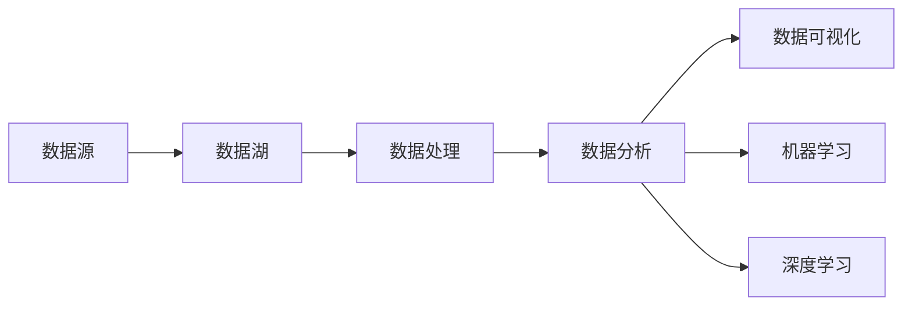

# 第十九章：数据湖与数据科学

## 1.背景介绍
在当今大数据时代,企业面临着海量异构数据的挑战。传统的数据仓库难以有效处理非结构化和半结构化数据。数据湖(Data Lake)应运而生,成为大数据存储和分析的新范式。数据湖提供了一个统一的数据存储平台,支持多种数据类型和处理方式,为数据科学(Data Science)提供了丰富的数据资源。

### 1.1 大数据时代的数据管理挑战
#### 1.1.1 数据量爆炸式增长
#### 1.1.2 数据类型多样化
#### 1.1.3 数据处理实时性需求

### 1.2 传统数据仓库的局限性
#### 1.2.1 难以处理非结构化数据
#### 1.2.2 数据加载和处理效率低
#### 1.2.3 缺乏灵活性和可扩展性

### 1.3 数据湖的兴起
#### 1.3.1 统一的数据存储平台
#### 1.3.2 支持多种数据类型
#### 1.3.3 灵活的数据处理方式

## 2.核心概念与联系
### 2.1 数据湖的定义
数据湖是一个存储原始格式数据的大型集中式存储库。它允许存储结构化、半结构化和非结构化数据,并支持对这些数据进行处理和分析。

### 2.2 数据湖与数据仓库的区别
#### 2.2.1 数据存储方式
- 数据仓库:结构化,预先定义模式
- 数据湖:原始格式,支持多种类型

#### 2.2.2 数据处理方式
- 数据仓库:ETL,数据清洗和转换
- 数据湖:ELT,延迟转换

#### 2.2.3 数据应用场景
- 数据仓库:BI报表,预定义查询
- 数据湖:数据探索,即席查询,机器学习

### 2.3 数据科学与数据湖的关系
数据科学是从数据中提取洞察和知识的跨学科领域。数据湖为数据科学提供了丰富的数据资源,支持数据科学家进行数据探索、分析和建模。



## 3.核心算法原理具体操作步骤
### 3.1 数据摄取
#### 3.1.1 批量摄取
- Sqoop:关系型数据库到HDFS
- Flume:日志文件到HDFS

#### 3.1.2 实时摄取
- Kafka:消息队列到HDFS/HBase
- Spark Streaming:实时数据处理

### 3.2 数据存储
#### 3.2.1 HDFS:分布式文件系统
#### 3.2.2 对象存储:S3,Azure Blob
#### 3.2.3 NoSQL数据库:HBase,Cassandra

### 3.3 数据处理
#### 3.3.1 批处理:Hadoop MapReduce,Spark
#### 3.3.2 流处理:Spark Streaming,Flink
#### 3.3.3 交互式查询:Presto,Impala

### 3.4 数据治理
#### 3.4.1 元数据管理:Apache Atlas
#### 3.4.2 数据安全:Ranger,Sentry
#### 3.4.3 数据生命周期管理

## 4.数学模型和公式详细讲解举例说明
### 4.1 推荐系统
#### 4.1.1 协同过滤
基于用户或物品的相似性进行推荐。
用户相似性:
$$sim(u,v) = \frac{\sum_{i \in I_{uv}}r_{ui}r_{vi}}{\sqrt{\sum_{i \in I_u}r_{ui}^2}\sqrt{\sum_{i \in I_v}r_{vi}^2}}$$

物品相似性:
$$sim(i,j) = \frac{\sum_{u \in U_{ij}}r_{ui}r_{uj}}{\sqrt{\sum_{u \in U_i}r_{ui}^2}\sqrt{\sum_{u \in U_j}r_{uj}^2}}$$

#### 4.1.2 矩阵分解
将用户-物品评分矩阵分解为低秩矩阵乘积。
$$R \approx PQ^T$$
其中$P$表示用户隐因子矩阵,$Q$表示物品隐因子矩阵。

### 4.2 异常检测
#### 4.2.1 基于统计的方法
假设数据服从某种概率分布,异常值为低概率事件。
高斯分布下的异常值:
$$p(x) = \frac{1}{\sqrt{2\pi}\sigma}\exp(-\frac{(x-\mu)^2}{2\sigma^2})$$

#### 4.2.2 基于距离的方法
异常值与其他数据点的距离较远。
$k$-最近邻距离:
$$D_k(x) = \frac{1}{k}\sum_{i=1}^k \text{dist}(x,x_i)$$
其中$x_i$为$x$的第$i$个最近邻。

## 5.项目实践：代码实例和详细解释说明
### 5.1 使用Spark进行数据处理
```python
from pyspark.sql import SparkSession

spark = SparkSession.builder \
    .appName("DataLakeExample") \
    .getOrCreate()

# 读取数据
df = spark.read.json("data/input/")

# 数据转换
df_filtered = df.filter(df.age > 18)
df_agg = df_filtered.groupBy("gender").agg({"age": "avg"})

# 数据写入
df_agg.write.mode("overwrite").parquet("data/output/")

spark.stop()
```

### 5.2 使用Presto进行交互式查询
```sql
-- 创建Hive表
CREATE TABLE users (
  id INT,
  name VARCHAR,
  age INT
)
WITH (
  format = 'PARQUET',
  external_location = 's3://datalake/users/'
);

-- 查询数据
SELECT AVG(age) AS avg_age
FROM users
WHERE age > 18
GROUP BY gender;
```

## 6.实际应用场景
### 6.1 客户360度视图
整合客户的结构化和非结构化数据,构建全面的客户画像,支持精准营销和个性化服务。

### 6.2 IoT数据分析
收集和存储海量传感器数据,进行实时处理和分析,优化设备性能,预测故障。

### 6.3 欺诈检测
整合交易、行为等多源异构数据,构建异常检测模型,实时识别欺诈行为。

## 7.工具和资源推荐
### 7.1 开源工具
- Apache Hadoop:分布式存储和计算框架
- Apache Spark:大规模数据处理引擎
- Presto:交互式SQL查询引擎
- Apache Atlas:元数据管理和数据治理

### 7.2 云平台
- Amazon AWS:S3,EMR,Athena
- Microsoft Azure:Data Lake Storage,HDInsight,Data Lake Analytics
- Google Cloud:Cloud Storage,Dataproc,BigQuery

### 7.3 学习资源
- Coursera:Big Data Specialization
- edX:Data Science and Engineering with Spark
- 图书:Hadoop: The Definitive Guide,Spark: The Definitive Guide

## 8.总结：未来发展趋势与挑战
### 8.1 数据湖的发展趋势
#### 8.1.1 云原生数据湖
#### 8.1.2 数据湖与数据仓库融合
#### 8.1.3 智能数据湖

### 8.2 数据科学的发展趋势
#### 8.2.1 AutoML和智能数据科学平台
#### 8.2.2 深度学习与知识图谱
#### 8.2.3 可解释的AI

### 8.3 挑战与展望
#### 8.3.1 数据治理和安全
#### 8.3.2 数据质量和一致性
#### 8.3.3 人才缺口和技能要求

## 9.附录：常见问题与解答
### 9.1 如何选择数据湖的存储方案?
需要考虑数据量、访问模式、成本等因素。HDFS适合TB到PB级数据,对延迟要求不高的场景。对象存储如S3适合弹性扩展和长期存档。

### 9.2 数据湖如何保证数据安全?
通过细粒度访问控制、数据加密、审计日志等方式保障。Ranger提供集中式安全管理,Sentry支持Hadoop生态系统的授权。

### 9.3 如何避免数据湖变成数据沼泽?
制定数据治理策略,元数据管理,数据生命周期管理。定义明确的数据摄取、组织和清理流程。

### 9.4 数据科学家需要哪些技能?
编程能力(如Python,R,SQL),统计和机器学习知识,数据可视化,领域知识,沟通能力。

### 9.5 数据湖适合哪些数据科学应用场景?
数据探索和分析、即席查询、机器学习、数据挖掘等,尤其适合非结构化数据和数据量很大的场景。

作者：禅与计算机程序设计艺术 / Zen and the Art of Computer Programming