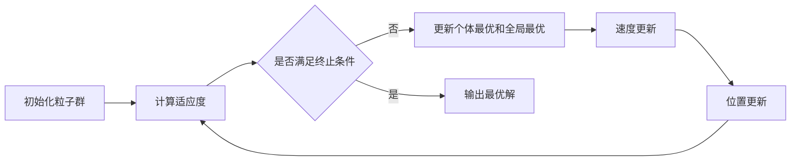

# 粒子群算法(Particle Swarm Optimization) - 原理与代码实例讲解

## 1.背景介绍

粒子群优化算法(Particle Swarm Optimization, PSO)是一种基于群体智能的启发式优化算法,由 Kennedy 和 Eberhart 于1995年提出。PSO算法源于对鸟群觅食行为的研究,通过模拟鸟群的觅食行为来优化复杂的非线性问题。

PSO是一种进化计算技术,其基本思想是通过群体中个体之间的协作和信息共享来寻找最优解。在PSO算法中,每个候选解被看作是一只鸟,称为"粒子",所有粒子组成一个"群体"。每个粒子在搜索空间中运动,通过自身的经验和群体的经验调整运动方向和速度,最终找到全局最优解。

PSO算法简单高效,易于实现,在许多领域得到了广泛应用,如函数优化、模式识别、机器学习、图像处理等。本文将详细介绍PSO算法的基本原理、数学模型、代码实现以及实际应用,帮助读者深入理解和掌握这一重要的优化算法。

### 1.1 PSO算法的起源与发展
#### 1.1.1 起源
#### 1.1.2 发展历程
#### 1.1.3 重要里程碑

### 1.2 PSO算法的特点与优势
#### 1.2.1 简单高效
#### 1.2.2 易于实现
#### 1.2.3 适用性广

### 1.3 PSO算法的应用领域
#### 1.3.1 函数优化
#### 1.3.2 模式识别
#### 1.3.3 机器学习
#### 1.3.4 图像处理

## 2.核心概念与联系

### 2.1 粒子(Particle)
#### 2.1.1 定义
#### 2.1.2 属性
#### 2.1.3 运动方式

### 2.2 群体(Swarm)
#### 2.2.1 定义
#### 2.2.2 组成
#### 2.2.3 信息共享机制

### 2.3 适应度函数(Fitness Function)
#### 2.3.1 定义
#### 2.3.2 设计原则
#### 2.3.3 常用适应度函数

### 2.4 个体最优与全局最优
#### 2.4.1 个体最优(pbest)
#### 2.4.2 全局最优(gbest)
#### 2.4.3 两者关系

### 2.5 速度更新与位置更新
#### 2.5.1 速度更新公式
#### 2.5.2 位置更新公式
#### 2.5.3 参数选择



## 3.核心算法原理具体操作步骤

### 3.1 算法流程
#### 3.1.1 初始化
#### 3.1.2 迭代优化
#### 3.1.3 终止条件

### 3.2 初始化粒子群
#### 3.2.1 随机初始化位置
#### 3.2.2 随机初始化速度
#### 3.2.3 初始化个体最优和全局最优

### 3.3 适应度计算
#### 3.3.1 适应度函数选择
#### 3.3.2 计算个体适应度值
#### 3.3.3 更新个体最优和全局最优

### 3.4 速度更新
#### 3.4.1 惯性权重
#### 3.4.2 个体认知部分
#### 3.4.3 社会认知部分

### 3.5 位置更新
#### 3.5.1 位置更新公式
#### 3.5.2 边界处理
#### 3.5.3 位置合法性检查

### 3.6 终止条件判断
#### 3.6.1 最大迭代次数
#### 3.6.2 最优解精度
#### 3.6.3 适应度值收敛

## 4.数学模型和公式详细讲解举例说明

### 4.1 数学符号定义
#### 4.1.1 粒子位置向量 $X_i$
#### 4.1.2 粒子速度向量 $V_i$
#### 4.1.3 个体最优位置 $P_i$
#### 4.1.4 全局最优位置 $P_g$

### 4.2 速度更新公式推导
速度更新公式为:
$$V_i^{k+1} = \omega V_i^k + c_1 r_1 (P_i - X_i^k) + c_2 r_2 (P_g - X_i^k)$$
其中:
- $\omega$: 惯性权重,控制粒子保持原有速度的趋势
- $c_1, c_2$: 加速常数,控制粒子向个体最优和全局最优学习的程度
- $r_1, r_2$: [0,1]区间内的随机数

### 4.3 位置更新公式推导
位置更新公式为:
$$X_i^{k+1} = X_i^k + V_i^{k+1}$$

### 4.4 算法收敛性分析
#### 4.4.1 收敛条件
#### 4.4.2 收敛速度影响因素
#### 4.4.3 避免早熟收敛策略

## 5.项目实践：代码实例和详细解释说明

### 5.1 Python实现PSO算法
```python
import numpy as np

class PSO:
    def __init__(self, dim, pop_size, max_iter):
        self.dim = dim  # 搜索空间维度
        self.pop_size = pop_size  # 粒子群大小
        self.max_iter = max_iter  # 最大迭代次数
        self.X = np.zeros((pop_size, dim))  # 粒子位置矩阵
        self.V = np.zeros((pop_size, dim))  # 粒子速度矩阵
        self.pbest = np.zeros((pop_size, dim))  # 个体最优位置
        self.gbest = np.zeros((1, dim))  # 全局最优位置
        self.p_fit = np.zeros(pop_size)  # 个体最优适应度
        self.fit = 1e10  # 全局最优适应度

    def fitness(self, X):
        # 适应度函数,根据具体问题定义
        return np.sum(X**2, axis=1)

    def init_population(self):
        # 初始化粒子群
        self.X = np.random.uniform(low=-5, high=5, size=(self.pop_size, self.dim))
        self.V = np.random.uniform(low=-1, high=1, size=(self.pop_size, self.dim))
        self.pbest = self.X
        self.p_fit = self.fitness(self.X)
        self.fit = min(self.p_fit)
        self.gbest = self.X[np.argmin(self.p_fit), :]

    def iterator(self):
        # 迭代更新
        c1 = c2 = 2
        w = 0.8
        for _ in range(self.max_iter):
            r1 = np.random.random(size=(self.pop_size, self.dim))
            r2 = np.random.random(size=(self.pop_size, self.dim))
            # 速度更新
            self.V = w*self.V + c1*r1*(self.pbest - self.X) + c2*r2*(self.gbest - self.X)
            # 位置更新
            self.X = self.X + self.V
            # 评估适应度
            fit = self.fitness(self.X)
            # 更新个体最优
            index = fit < self.p_fit
            self.pbest[index, :] = self.X[index, :]
            self.p_fit[index] = fit[index]
            # 更新全局最优
            if min(self.p_fit) < self.fit:
                self.fit = min(self.p_fit)
                self.gbest = self.X[np.argmin(self.p_fit), :]

    def run(self):
        self.init_population()
        self.iterator()
        return self.gbest, self.fit

if __name__ == '__main__':
    pso = PSO(dim=10, pop_size=20, max_iter=100)
    best_x, best_y = pso.run()
    print(f'best_x: {best_x}, best_y: {best_y}')
```

### 5.2 代码详解
#### 5.2.1 PSO类的属性
- dim: 搜索空间维度
- pop_size: 粒子群大小
- max_iter: 最大迭代次数
- X: 粒子位置矩阵
- V: 粒子速度矩阵
- pbest: 个体最优位置
- gbest: 全局最优位置
- p_fit: 个体最优适应度
- fit: 全局最优适应度

#### 5.2.2 适应度函数
本例以求解函数 $f(x)=\sum_{i=1}^{n}x_i^2$ 的最小值为例,因此适应度函数定义为:
```python
def fitness(self, X):
    return np.sum(X**2, axis=1)
```

#### 5.2.3 初始化粒子群
使用`np.random.uniform()`在[-5,5]范围内随机初始化粒子位置,在[-1,1]范围内随机初始化粒子速度。个体最优初始化为粒子初始位置,计算初始适应度,更新全局最优。
```python
def init_population(self):
    self.X = np.random.uniform(low=-5, high=5, size=(self.pop_size, self.dim))
    self.V = np.random.uniform(low=-1, high=1, size=(self.pop_size, self.dim))
    self.pbest = self.X
    self.p_fit = self.fitness(self.X)
    self.fit = min(self.p_fit)
    self.gbest = self.X[np.argmin(self.p_fit), :]
```

#### 5.2.4 迭代更新
循环执行速度更新、位置更新、适应度评估、个体最优更新和全局最优更新,直到达到最大迭代次数。
```python
def iterator(self):
    c1 = c2 = 2
    w = 0.8
    for _ in range(self.max_iter):
        r1 = np.random.random(size=(self.pop_size, self.dim))
        r2 = np.random.random(size=(self.pop_size, self.dim))
        # 速度更新
        self.V = w*self.V + c1*r1*(self.pbest - self.X) + c2*r2*(self.gbest - self.X)
        # 位置更新
        self.X = self.X + self.V
        # 评估适应度
        fit = self.fitness(self.X)
        # 更新个体最优
        index = fit < self.p_fit
        self.pbest[index, :] = self.X[index, :]
        self.p_fit[index] = fit[index]
        # 更新全局最优
        if min(self.p_fit) < self.fit:
            self.fit = min(self.p_fit)
            self.gbest = self.X[np.argmin(self.p_fit), :]
```

#### 5.2.5 运行PSO算法
```python
def run(self):
    self.init_population()
    self.iterator()
    return self.gbest, self.fit
```

## 6.实际应用场景

### 6.1 函数优化
#### 6.1.1 无约束优化问题
#### 6.1.2 约束优化问题
#### 6.1.3 多模态函数优化

### 6.2 特征选择
#### 6.2.1 二进制PSO
#### 6.2.2 改进PSO算法
#### 6.2.3 实验结果分析

### 6.3 神经网络训练
#### 6.3.1 BP神经网络参数优化
#### 6.3.2 CNN超参数优化
#### 6.3.3 RNN权重优化

### 6.4 图像处理
#### 6.4.1 图像分割
#### 6.4.2 图像配准
#### 6.4.3 图像去噪

### 6.5 其他应用
#### 6.5.1 旅行商问题(TSP)
#### 6.5.2 车间调度问题
#### 6.5.3 电力负荷预测

## 7.工具和资源推荐

### 7.1 开源库
- DEAP: Python进化计算库,包含GA、PSO等算法
- PySwarms: 专门用于PSO的Python库,支持单目标和多目标优化
- Optunity: 超参数优化库,支持PSO等优化算法

### 7.2 可视化工具
- Matplotlib: Python绘图库,可用于绘制迭代过程、适应度变化等
- PyQtGraph: 基于PyQt的高性能绘图库,支持实时绘图
- Plotly: 交互式绘图库,支持2D、3D数据可视化

### 7.3 相关书籍
- Particle Swarm Optimization - Maurice Clerc
- Swarm Intelligence - James Kennedy, Russell C. Eberhart
- Essentials of Metaheuristics - Sean Luke

### 7.