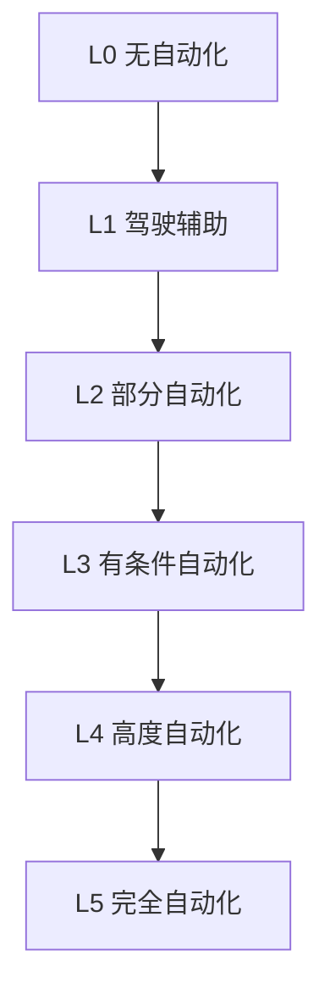
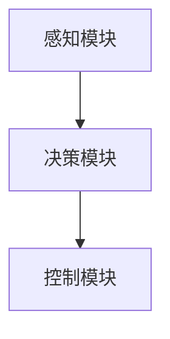
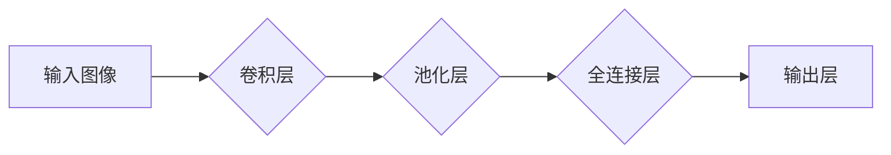

# 自动驾驶(Autonomous Driving)原理与代码实战案例讲解

## 1.背景介绍

### 1.1 自动驾驶的发展历程

自动驾驶技术的发展可以追溯到20世纪60年代,当时的研究主要集中在机器人领域。1977年,第一辆自动驾驶汽车诞生于日本机器人研究所。此后,随着计算机视觉、传感器和人工智能技术的快速发展,自动驾驶汽车的研究逐渐成为热点。

进入21世纪,谷歌、特斯拉、百度、苹果等科技巨头纷纷投入巨资研发自动驾驶技术。2009年,谷歌的无人驾驶汽车项目正式启动,标志着自动驾驶技术进入实际道路测试阶段。2014年,谷歌的无人驾驶汽车在公共道路上行驶里程突破100万英里。2016年,特斯拉推出了Autopilot自动辅助驾驶系统。

### 1.2 自动驾驶的重要意义

自动驾驶技术的发展将带来巨大的社会效益和经济价值:

1. **提高交通安全**。根据统计,90%的交通事故是由人为错误导致的。自动驾驶可以减少人为操作失误,从而大幅降低交通事故发生率。

2. **缓解交通拥堵**。自动驾驶汽车可以更高效地规划路线和控制车速,提高道路利用率,缓解交通拥堵。

3. **节省能源和减少排放**。自动驾驶系统可以优化车辆的能量利用,降低燃料消耗和尾气排放。

4. **提高出行效率**。自动驾驶技术可以为行动不便的人群提供更好的出行方式,提高整体出行效率。

5. **促进新商业模式**。自动驾驶将推动出行服务模式的变革,催生新的商业机会。

## 2.核心概念与联系

### 2.1 自动驾驶的等级划分

自动驾驶技术按照驾驶员参与程度可分为六个等级:



- **L0 无自动化**:完全依赖人工驾驶。
- **L1 驾驶辅助**:如自适应巡航、紧急制动等单一自动化功能。
- **L2 部分自动化**:如并线辅助、自动泊车等多个功能协同工作。
- **L3 有条件自动化**:在特定环境下可实现短时间无人干预驾驶。
- **L4 高度自动化**:无需人工干预,但有限制条件。
- **L5 完全自动化**:任何环境和条件下均可自主驾驶,无需人工干预。

### 2.2 自动驾驶系统架构

自动驾驶系统通常由三个主要模块组成:



1. **感知模块**:通过激光雷达、摄像头、毫米波雷达等传感器获取车辆周围环境信息。
2. **决策模块**:根据感知信息规划行驶路径、速度等,并做出相应决策。
3. **控制模块**:执行决策指令,控制车辆的转向、加速、制动等动作。

## 3.核心算法原理具体操作步骤

### 3.1 感知模块

感知模块的主要任务是对车辆周围环境进行检测和识别,包括障碍物检测、车道线检测、交通标志和信号灯检测等。常用的算法有:

1. **障碍物检测**

   - 基于激光雷达点云数据的障碍物聚类与分割
   - 基于深度学习的2D/3D目标检测

2. **车道线检测**

   - 基于霍夫变换的车道线检测
   - 基于深度学习的语义分割

3. **交通标志和信号灯检测**

   - 基于模板匹配和HOG特征的交通标志检测
   - 基于深度学习的目标检测和分类

### 3.2 决策模块

决策模块需要根据感知信息做出合理的行驶决策,包括路径规划、行为决策等。常用的算法有:

1. **路径规划**

   - 基于采样的路径规划算法(RRT、RRT*)
   - 基于优化的路径规划算法(A*、Hybrid A*等)

2. **行为决策**

   - 基于有限状态机的行为决策
   - 基于规则的行为决策
   - 基于强化学习的行为决策

### 3.3 控制模块

控制模块需要将决策模块的指令转化为实际的车辆控制指令,包括横向控制(转向)和纵向控制(加速/制动)。常用的算法有:

1. **横向控制**

   - 纯追踪控制(Pure Pursuit)
   - Stanley方法
   - 模型预测控制(MPC)

2. **纵向控制**

   - PID控制
   - 模型预测控制(MPC)
   - 自适应巡航控制(ACC)

## 4.数学模型和公式详细讲解举例说明

### 4.1 障碍物检测

#### 4.1.1 基于点云的障碍物聚类

对于激光雷达获取的点云数据,可以使用基于欧氏距离的聚类算法(如DBSCAN)对障碍物点进行聚类。算法思路:

1) 计算任意两点之间的欧氏距离$d(p,q)=\sqrt{(p_x-q_x)^2+(p_y-q_y)^2+(p_z-q_z)^2}$
2) 设定距离阈值$\epsilon$,如果$d(p,q)<\epsilon$,则认为$p$和$q$属于同一簇
3) 对所有点执行上述操作,得到聚类结果

#### 4.1.2 基于深度学习的2D目标检测

使用卷积神经网络(CNN)对2D图像中的目标进行检测和识别。以YOLO(You Only Look Once)算法为例,模型结构如下:



输出层对图像中的每个边界框进行分类和回归,得到目标类别及其边界框坐标。损失函数:

$$\mathcal{L}=\lambda_{coord}\sum_{i=0}^{S^2}\sum_{j=0}^B\mathbb{1}_{ij}^{obj}[(x_i-\hat{x}_i)^2+(y_i-\hat{y}_i)^2]+\lambda_{coord}\sum_{i=0}^{S^2}\sum_{j=0}^B\mathbb{1}_{ij}^{obj}[(\sqrt{w_i}-\sqrt{\hat{w}_i})^2+(\sqrt{h_i}-\sqrt{\hat{h}_i})^2]$$

其中$\lambda_{coord}$是坐标损失权重,$\mathbb{1}_{ij}^{obj}$表示第$i$个网格第$j$个边界框是否包含目标。

### 4.2 路径规划

#### 4.2.1 采样based算法:RRT*

RRT*(Rapidly-exploring Random Tree star)是一种基于采样的路径规划算法,适用于高维空间。算法步骤:

1) 在配置空间中随机采样一个点$x_{rand}$
2) 在现有树T中找到最近的节点$x_{nearest}$
3) 从$x_{nearest}$开始,朝$x_{rand}$方向延伸一个步长为$r$的新节点$x_{new}$
4) 如果$x_{new}$为可行节点,则将其加入树T
5) 对树T中$x_{new}$的邻居节点进行重连,保证到$x_{new}$的路径代价最小
6) 重复上述步骤,直到找到可行路径或达到最大迭代次数

#### 4.2.2 优化based算法:Hybrid A*

Hybrid A*算法结合了A*和其他采样based算法的优点,在离散空间和连续空间中交替搜索,提高了算法效率。算法步骤:

1) 将起点和终点加入开启列表
2) 从开启列表取出代价最小的节点$x_{curr}$,加入闭合列表
3) 对$x_{curr}$进行离散状态转移,得到一组新节点,加入开启列表
4) 对新节点进行连续插值,得到可行路径
5) 重复上述步骤,直到找到最优路径或达到最大迭代次数

## 5.项目实践:代码实例和详细解释说明

### 5.1 障碍物检测

以下是使用Python和PCL库实现基于点云的障碍物聚类的示例代码:

```python
import pcl

# 加载点云数据
cloud = pcl.load("lidar_data.pcd")

# 创建DBSCAN聚类对象
cluster = cloud.make_cluster()

# 设置聚类参数
cluster.set_min_points(10)   # 设置核心点最小点数
cluster.set_radius(0.5)      # 设置聚类半径

# 执行聚类
cluster.extract()

# 获取聚类结果
clusters = cluster.get_clusters()

# 遍历每个聚类
for i, points in enumerate(clusters):
    # 可视化当前聚类
    pcl.visualize_cluster(points)
```

上述代码首先加载点云数据,然后创建DBSCAN聚类对象,设置聚类参数(最小核心点数和聚类半径)。执行`cluster.extract()`后,可以通过`cluster.get_clusters()`获取所有聚类结果。最后可以遍历每个聚类,进行可视化或进一步处理。

### 5.2 车道线检测

以下是使用OpenCV库实现基于霍夫变换的车道线检测的示例代码:

```python
import cv2
import numpy as np

# 加载图像
img = cv2.imread("road.jpg")

# 转换为灰度图像
gray = cv2.cvtColor(img, cv2.COLOR_BGR2GRAY)

# 边缘检测
edges = cv2.Canny(gray, 100, 200)

# 霍夫变换检测直线
lines = cv2.HoughLinesP(edges, 1, np.pi/180, 30, maxLineGap=200)

# 遍历检测到的直线
for line in lines:
    x1, y1, x2, y2 = line[0]
    # 绘制车道线
    cv2.line(img, (x1, y1), (x2, y2), (0, 255, 0), 3)

# 显示结果图像
cv2.imshow("Lane Detection", img)
cv2.waitKey(0)
cv2.destroyAllWindows()
```

上述代码首先加载道路图像,并转换为灰度图像。然后使用Canny算子进行边缘检测,得到二值化的边缘图像。接下来使用OpenCV的`cv2.HoughLinesP()`函数进行霍夫变换,检测图像中的直线段。最后遍历检测到的直线段,在原始图像上绘制车道线。

## 6.实际应用场景

自动驾驶技术在以下场景有广泛的应用前景:

1. **智能网约车服务**:无人驾驶出租车可以提高运营效率,降低人力成本。

2. **物流运输**:无人驾驶卡车可以实现24小时不间断运输,提高效率。

3. **公共交通**:无人驾驶公交车和地铁可以减少人为操作失误,提高安全性。

4. **特殊环境作业**:在恶劣环境(如采矿、消防等)中使用无人驾驶车辆,保障人员安全。

5. **个人出行**:自动驾驶私家车可以为行动不便的人群提供便利。

## 7.工具和资源推荐

1. **开源自动驾驶模拟器**:Carla、AirSim等,用于算法测试和验证。

2. **点云处理库**:PCL(Point Cloud Library)、Open3D等。

3. **计算机视觉库**:OpenCV、Tensorflow Object Detection API等。

4. **路径规划库**:OMPL、SBPL等。

5. **控制算法库**:Autoware、Apollo等。

6. **在线课程**:Coursera、Udacity等提供自动驾驶相关课程。

7. **技术社区**:GitHub上的开源项目、技术论坛等。

## 8.总结:未来发展趋势与挑战

###