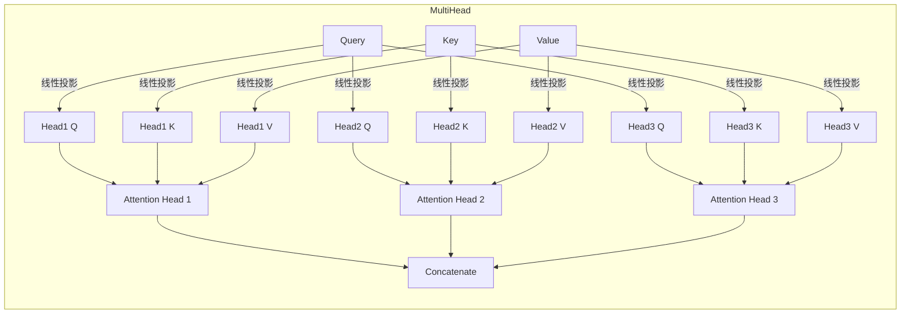

# 自注意力(Self-Attention)原理与代码实战案例讲解

## 1.背景介绍

### 1.1 注意力机制的兴起

在深度学习的发展历程中,注意力机制(Attention Mechanism)被认为是一个里程碑式的创新。传统的序列模型如RNN(循环神经网络)在处理长序列时存在梯度消失、计算复杂度高等问题。2014年,注意力机制应运而生,最早被应用于机器翻译任务,取得了令人瞩目的成绩。

### 1.2 自注意力机制的重要性

自注意力(Self-Attention)是注意力机制的一种重要形式,它允许模型关注输入序列的不同部分,捕捉序列内部的长程依赖关系。相比RNN,自注意力机制具有并行计算的优势,能更高效地建模序列数据。自注意力机制在许多领域取得了卓越表现,如自然语言处理、计算机视觉和语音识别等,成为了深度学习的核心组件之一。

## 2.核心概念与联系

### 2.1 自注意力机制的核心思想

自注意力机制的核心思想是允许输入的每个部分关注其他部分,以捕捉它们之间的关系。具体来说,对于一个长度为n的输入序列,自注意力机制会计算出n个向量(值),每个向量是输入序列中所有向量的加权和,权重由输入序列中每对向量的相似性决定。

### 2.2 Query、Key和Value

在自注意力机制中,输入序列被分成三个向量组:Query(查询)、Key(键)和Value(值)。Query向量用于计算注意力权重,Key向量用于计算相似性,Value向量则是我们真正感兴趣的值。通过计算Query与Key的相似性,可以得到注意力权重,再将权重与Value相乘并求和,即可获得最终的注意力表示。

$$
\text{Attention}(Q, K, V) = \text{softmax}(\frac{QK^T}{\sqrt{d_k}})V
$$

其中$Q$、$K$和$V$分别表示Query、Key和Value矩阵,$d_k$是缩放因子,用于防止内积过大导致的梯度不稳定问题。

### 2.3 多头注意力机制

单一的注意力函数有其局限性,多头注意力(Multi-Head Attention)则能够从不同的表示子空间捕捉不同的关系,从而提高模型的表现力。多头注意力将Query、Key和Value分别线性投影到不同的子空间,对每个子空间分别计算注意力,最后将所有头的注意力结果拼接起来。



通过多头注意力机制,模型能够关注输入序列的不同位置,从而更好地捕捉序列内部的长程依赖关系。

## 3.核心算法原理具体操作步骤

自注意力机制的计算过程可以分为以下几个步骤:

1. **投影变换**: 将输入序列$X$分别投影到Query、Key和Value空间,得到$Q$、$K$和$V$矩阵。

$$
\begin{aligned}
Q &= XW_Q \\
K &= XW_K \\
V &= XW_V
\end{aligned}
$$

其中$W_Q$、$W_K$和$W_V$是可学习的投影矩阵。

2. **计算注意力分数**: 计算Query与所有Key的点积,并除以缩放因子$\sqrt{d_k}$,得到注意力分数矩阵。

$$
\text{Attention Scores} = \frac{QK^T}{\sqrt{d_k}}
$$

3. **计算注意力权重**: 对注意力分数矩阵执行Softmax操作,得到注意力权重矩阵。

$$
\text{Attention Weights} = \text{softmax}(\text{Attention Scores})
$$

4. **计算注意力表示**: 将注意力权重与Value矩阵相乘,得到注意力表示矩阵。

$$
\text{Attention Output} = \text{Attention Weights} \cdot V
$$

5. **多头注意力**: 重复上述步骤多次,每次使用不同的投影矩阵,得到多个注意力表示矩阵。将这些矩阵在最后一个维度上拼接,形成最终的多头注意力表示。

6. **残差连接和层归一化**: 将多头注意力表示与输入序列$X$相加,并执行层归一化操作,得到自注意力层的输出。

上述步骤可以通过并行计算高效实现,从而克服了RNN的序列计算瓶颈。

## 4.数学模型和公式详细讲解举例说明

为了更好地理解自注意力机制,我们来看一个具体的例子。假设输入序列$X$为:

$$
X = \begin{bmatrix}
x_1 \\
x_2 \\
x_3 \\
x_4
\end{bmatrix} = \begin{bmatrix}
2 & 5 & 1 & 3\\
4 & 2 & 3 & 1\\
1 & 3 & 5 & 2\\
3 & 1 & 2 & 4
\end{bmatrix}
$$

我们将$X$投影到Query、Key和Value空间,得到:

$$
Q = \begin{bmatrix}
1 & 2 & 3 & 4\\
5 & 6 & 7 & 8\\
9 & 1 & 2 & 3\\
4 & 5 & 6 & 7
\end{bmatrix}, \quad
K = \begin{bmatrix}
1 & 5 & 9 & 4\\
2 & 6 & 1 & 5\\
3 & 7 & 2 & 6\\
4 & 8 & 3 & 7
\end{bmatrix}, \quad
V = \begin{bmatrix}
1 & 2 & 3 & 4\\
5 & 6 & 7 & 8\\
9 & 1 & 2 & 3\\
4 & 5 & 6 & 7
\end{bmatrix}
$$

接下来,我们计算注意力分数矩阵:

$$
\text{Attention Scores} = \frac{QK^T}{\sqrt{4}} = \begin{bmatrix}
0.63 & 0.63 & 0.63 & 0.63\\
1.26 & 1.26 & 1.26 & 1.26\\
0.63 & 0.63 & 0.63 & 0.63\\
1.26 & 1.26 & 1.26 & 1.26
\end{bmatrix}
$$

对注意力分数矩阵执行Softmax操作,得到注意力权重矩阵:

$$
\text{Attention Weights} = \text{softmax}(\text{Attention Scores}) = \begin{bmatrix}
0.25 & 0.25 & 0.25 & 0.25\\
0.25 & 0.25 & 0.25 & 0.25\\
0.25 & 0.25 & 0.25 & 0.25\\
0.25 & 0.25 & 0.25 & 0.25
\end{bmatrix}
$$

最后,我们将注意力权重与Value矩阵相乘,得到注意力表示矩阵:

$$
\text{Attention Output} = \text{Attention Weights} \cdot V = \begin{bmatrix}
4.25 & 3.5 & 4.25 & 5.5\\
4.25 & 3.5 & 4.25 & 5.5\\
4.25 & 3.5 & 4.25 & 5.5\\
4.25 & 3.5 & 4.25 & 5.5
\end{bmatrix}
$$

在这个简单的例子中,由于Query和Key之间的相似性都相等,所以注意力权重是均匀分布的。在实际应用中,注意力权重会根据Query和Key之间的相似性动态分配,从而捕捉输入序列内部的重要关系。

## 5.项目实践:代码实例和详细解释说明

为了更好地理解自注意力机制,我们来看一个基于PyTorch的代码实现示例。

```python
import torch
import torch.nn as nn

class ScaledDotProductAttention(nn.Module):
    def __init__(self, d_k):
        super().__init__()
        self.d_k = d_k

    def forward(self, Q, K, V):
        # 计算注意力分数
        scores = torch.matmul(Q, K.transpose(-2, -1)) / (self.d_k ** 0.5)

        # 计算注意力权重
        attn_weights = torch.softmax(scores, dim=-1)

        # 计算注意力表示
        attn_output = torch.matmul(attn_weights, V)

        return attn_output

class MultiHeadAttention(nn.Module):
    def __init__(self, d_model, num_heads):
        super().__init__()
        self.num_heads = num_heads
        self.head_dim = d_model // num_heads

        self.q_proj = nn.Linear(d_model, d_model)
        self.k_proj = nn.Linear(d_model, d_model)
        self.v_proj = nn.Linear(d_model, d_model)

        self.attention = ScaledDotProductAttention(self.head_dim)
        self.out_proj = nn.Linear(d_model, d_model)

    def forward(self, Q, K, V):
        batch_size = Q.size(0)

        # 线性投影
        q = self.q_proj(Q).view(batch_size, -1, self.num_heads, self.head_dim).transpose(1, 2)
        k = self.k_proj(K).view(batch_size, -1, self.num_heads, self.head_dim).transpose(1, 2)
        v = self.v_proj(V).view(batch_size, -1, self.num_heads, self.head_dim).transpose(1, 2)

        # 计算多头注意力
        attn_output = self.attention(q, k, v)
        attn_output = attn_output.transpose(1, 2).contiguous().view(batch_size, -1, self.num_heads * self.head_dim)

        # 线性变换
        attn_output = self.out_proj(attn_output)

        return attn_output
```

在这个示例中,我们首先定义了`ScaledDotProductAttention`类,用于实现基本的缩放点积注意力机制。`forward`方法接收Query、Key和Value矩阵,并返回注意力表示矩阵。

接下来,我们定义了`MultiHeadAttention`类,用于实现多头注意力机制。在`forward`方法中,我们首先将输入的Query、Key和Value矩阵分别投影到不同的头空间,然后对每个头空间计算缩放点积注意力,最后将所有头的注意力表示拼接并进行线性变换,得到最终的多头注意力表示。

以下是一个使用多头注意力机制的示例:

```python
# 输入张量
Q = torch.randn(2, 4, 512)  # [batch_size, sequence_length, d_model]
K = torch.randn(2, 6, 512)
V = torch.randn(2, 6, 512)

# 创建多头注意力层
mha = MultiHeadAttention(d_model=512, num_heads=8)

# 计算多头注意力
attn_output = mha(Q, K, V)
print(attn_output.shape)  # torch.Size([2, 4, 512])
```

在这个示例中,我们创建了一个输入张量`Q`、`K`和`V`,分别表示Query、Key和Value。然后,我们实例化一个`MultiHeadAttention`对象,并调用其`forward`方法计算多头注意力表示。输出张量的形状为`[batch_size, sequence_length, d_model]`。

通过这个代码示例,您可以更好地理解自注意力机制的实现细节,并将其应用于您自己的深度学习项目中。

## 6.实际应用场景

自注意力机制在许多领域发挥着重要作用,以下是一些典型的应用场景: