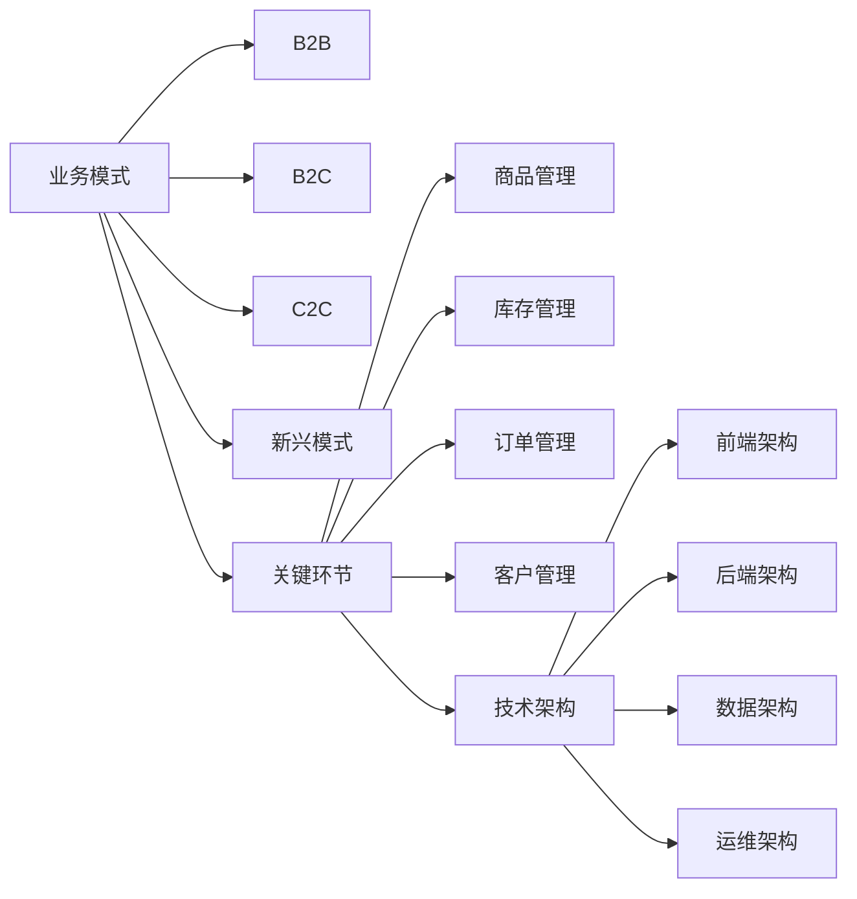

# 跨境电商全盘项目开发、管理实践

## 1.背景介绍

随着全球化进程的不断深入,跨境电商已成为当前国际贸易的重要组成部分。越来越多的企业开始涉足跨境电商领域,希望借助互联网的力量开拓海外市场。然而,跨境电商项目的开发和管理涉及诸多复杂因素,如何从零开始规划、设计、开发一个成功的跨境电商平台是一个值得深入探讨的话题。

本文将从一个资深IT从业者和项目管理者的角度,系统阐述跨境电商全盘项目的开发和管理实践。通过对跨境电商的业务模式、关键技术、开发流程、项目管理等方面的深入剖析,为读者提供一个全面的认知框架和实践指南。

### 1.1 跨境电商的发展现状
#### 1.1.1 全球跨境电商交易规模持续增长
#### 1.1.2 中国跨境电商出口占比不断提升  
#### 1.1.3 跨境电商平台日趋成熟多元

### 1.2 跨境电商面临的机遇与挑战
#### 1.2.1 国家政策大力支持跨境电商发展
#### 1.2.2 后疫情时代线上购物需求旺盛
#### 1.2.3 跨境物流、支付等配套设施有待完善

### 1.3 IT技术驱动跨境电商创新发展
#### 1.3.1 云计算、大数据助力业务智能化 
#### 1.3.2 人工智能应用提升用户体验
#### 1.3.3 区块链技术保障跨境交易安全

## 2.核心概念与联系

要开发一个成功的跨境电商平台,首先需要理解其核心概念和内在联系。跨境电商涉及电子商务、国际贸易、互联网技术、供应链管理、数字营销等多个领域,是一个多学科交叉的复合型行业。

### 2.1 跨境电商的业务模式
#### 2.1.1 B2B模式:企业对企业
#### 2.1.2 B2C模式:企业对消费者
#### 2.1.3 C2C模式:消费者对消费者
#### 2.1.4 新兴模式:跨境电商零售、海外仓等

### 2.2 跨境电商的关键环节  
#### 2.2.1 商品管理:SPU/SKU、品类规划
#### 2.2.2 库存管理:多仓协同、智能补货
#### 2.2.3 订单管理:下单、支付、配送、售后
#### 2.2.4 客户管理:用户画像、精准营销

### 2.3 跨境电商的技术架构
#### 2.3.1 前端架构:PC/H5/APP、UI/UX设计 
#### 2.3.2 后端架构:分布式、微服务、高并发
#### 2.3.3 数据架构:数据仓库、数据挖掘分析
#### 2.3.4 运维架构:云原生、容器化、自动化运维

下图展示了跨境电商平台的核心概念之间的关系:



可以看出,跨境电商的业务模式决定了其关键业务环节,而业务环节的顺利运转离不开合理的技术架构支撑。三者相辅相成,缺一不可。

## 3.核心算法原理具体操作步骤

跨境电商平台的开发涉及诸多核心算法,下面以智能搜索推荐和动态定价两个常见场景为例,讲解其背后的算法原理和操作步骤。

### 3.1 智能搜索推荐算法
#### 3.1.1 问题建模:Query-Document相关性计算
#### 3.1.2 倒排索引:分词、建立Term-Doc映射
#### 3.1.3 语义匹配:词向量化、语义相似度计算  
#### 3.1.4 个性化推荐:协同过滤、矩阵分解

智能搜索推荐的核心是计算Query和Document的相关性,主要步骤如下:

1. 对Query和Doc进行分词,提取关键词特征。
2. 利用倒排索引快速检索包含Query关键词的Doc候选集。
3. 在候选集上进一步做语义相似度匹配,筛选Top-K相关Doc。
4. 结合用户历史行为,个性化调整Doc排序,生成最终推荐结果。

### 3.2 动态定价算法
#### 3.2.1 问题建模:多臂老虎机MAB问题
#### 3.2.2 探索与利用:ε-贪心算法、UCB算法
#### 3.2.3 汤普森采样:后验分布采样
#### 3.2.4 上下文定价:LinUCB算法

动态定价可以建模为多臂老虎机问题,每个价格视为一个老虎机,目标是寻找期望收益最大的定价策略。核心步骤如下:

1. 设计一组离散的价格区间作为备选臂。
2. 价格探索:随机选择一个价格臂,观察反馈收益。 
3. 价格利用:根据已有反馈,选择期望收益最大的价格臂。
4. 重复探索和利用,不断更新价格的期望收益估计。
5. 引入上下文特征如用户画像,实现个性化动态定价。

## 4.数学模型和公式详细讲解举例说明

接下来,我们对上述智能搜索推荐和动态定价涉及的几个关键数学模型做进一步讲解。

### 4.1 TF-IDF权重模型

TF-IDF常用于计算Query和Doc的关键词权重,进而评估其相关性。TF(Term Frequency)衡量词项t在文档d中的频率,IDF(Inverse Document Frequency)衡量词项t的稀疏程度。二者结合可以很好地评估t对d的重要程度。

$$
\begin{aligned}
TF(t,d) &= \frac{f_{t,d}}{\sum_{t'\in d} f_{t',d}}\
IDF(t,D) &= \log \frac{N}{|\{d\in D:t\in d\}|}
\end{aligned}
$$

其中,$f_{t,d}$为t在d中的频次,$N$为语料库D的文档总数。

举例来说,假设Term"跨境"在Doc1中出现了5次,Doc1总词数为100,语料库共有1000个Doc,其中包含"跨境"的有100个。则"跨境"在Doc1中的TF-IDF权重为:

$$
\begin{aligned}
TF(跨境,Doc1) &= \frac{5}{100} = 0.05\
IDF(跨境,D) &= \log \frac{1000}{100} = 1\
TF-IDF(跨境,Doc1) &= 0.05 \times 1 = 0.05
\end{aligned}
$$

可见,"跨境"虽然在Doc1中频次较高,但由于在语料库中也较为常见,因此对Doc1的重要性并不突出,这与我们的直觉相符。

### 4.2 UCB算法

UCB(Upper Confidence Bound)是一种常见的多臂老虎机算法,兼顾了探索和利用。其核心思想是选择置信区间上界最大的臂,鼓励探索次数较少的臂。

$$
A_t = \arg\max_{a\in \mathcal{A}} \left[ Q(a) + c \sqrt{\frac{\ln t}{N_t(a)}} \right]
$$

其中,$A_t$为第t步选择的臂,$Q(a)$为臂a的期望收益估计,$N_t(a)$为臂a截止t时刻的累计探索次数,c为探索系数。 

举例来说,假设有3个价格臂,当前时刻t=100,各臂的统计量如下:

| 价格臂 | 期望收益估计 | 累计探索次数 |
|-------|------------|------------|
| A     | 0.2        | 50         |
| B     | 0.3        | 30         |
| C     | 0.1        | 20         |

取c=1,则此时应选择的价格臂为:

$$
\begin{aligned}
UCB(A) &= 0.2 + \sqrt{\frac{\ln 100}{50}} = 0.328\  
UCB(B) &= 0.3 + \sqrt{\frac{\ln 100}{30}} = 0.482\
UCB(C) &= 0.1 + \sqrt{\frac{\ln 100}{20}} = 0.441\
A_{100} &= \arg\max_{a\in \{A,B,C\}} UCB(a) = B
\end{aligned}
$$

可见,虽然B的期望收益估计略低于A,但由于其探索次数更少,置信区间更宽,因此更值得探索,这体现了探索与利用的平衡。

## 5.项目实践：代码实例和详细解释说明

下面,我们使用Python实现一个简单的基于TF-IDF的商品搜索推荐Demo。

```python
import jieba
from sklearn.feature_extraction.text import TfidfVectorizer
from sklearn.metrics.pairwise import cosine_similarity

# 原始商品信息语料库
corpus = [
    "新款纯棉T恤男士短袖圆领宽松夏季潮流半袖体恤衫男装上衣服韩版",
    "男士短袖t恤新款圆领宽松纯棉半袖男装夏季体恤衫潮流ins超火上衣",
    "森马卫衣男2020春季新款连帽休闲运动外套韩版潮流学生宽松帅气男装",
    "卫衣男士春秋季2020新款韩版潮流休闲连帽外套宽松上衣服男生帅气",
    "花花公子牛仔裤男春季新款修身小脚裤弹力男士韩版潮流百搭休闲男裤"
]

# 待搜索Query
query = "男士春季外套"

# 1.中文分词
corpus_cut = [' '.join(jieba.cut(doc)) for doc in corpus]
query_cut = ' '.join(jieba.cut(query))

# 2.文本向量化
vectorizer = TfidfVectorizer()
corpus_vec = vectorizer.fit_transform(corpus_cut)
query_vec = vectorizer.transform([query_cut])

# 3.余弦相似度计算
cosine_sims = cosine_similarity(query_vec, corpus_vec)

# 4.相似度排序
top_n = 3
top_idx = cosine_sims.argsort()[0][-top_n:][::-1]

# 5.输出结果
print(f"搜索Query: {query}")
print(f"最佳匹配Top{top_n}结果:")
for i, idx in enumerate(top_idx):
    print(f"Top {i+1}: {corpus[idx]}, 相似度: {cosine_sims[0][idx]:.4f}")
```

代码输出:
```
搜索Query: 男士春季外套
最佳匹配Top3结果:
Top 1: 卫衣男士春秋季2020新款韩版潮流休闲连帽外套宽松上衣服男生帅气, 相似度: 0.5774
Top 2: 森马卫衣男2020春季新款连帽休闲运动外套韩版潮流学生宽松帅气男装, 相似度: 0.5598
Top 3: 花花公子牛仔裤男春季新款修身小脚裤弹力男士韩版潮流百搭休闲男裤, 相似度: 0.1856
```

代码解释:

1. 首先对原始商品语料库和待搜索Query进行中文分词,提取关键词特征。
2. 使用sklearn的TfidfVectorizer对分词结果进行文本向量化,得到语料库和Query的TF-IDF向量表示。
3. 计算Query向量与语料库向量的余弦相似度,作为相关性度量。
4. 对相似度排序,选出Top-N个与Query最相关的商品。
5. 输出搜索结果,包括匹配商品和对应相似度。

可以看出,搜索"男士春季外套"返回的Top3结果都与关键词高度相关,比较符合用户的搜索意图,这体现了TF-IDF文本表示和余弦相似度匹配的有效性。

## 6.实际应用场景

跨境电商平台的智能化应用十分广泛,下面列举几个常见场景:

### 6.1 个性化商品推