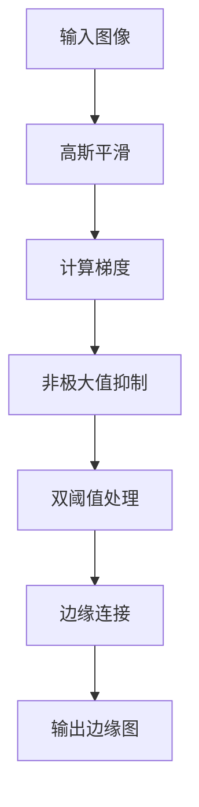

以下是《边缘检测原理与代码实例讲解》的技术博客正文内容：

# 边缘检测原理与代码实例讲解

## 1. 背景介绍

### 1.1 什么是边缘检测

边缘检测是图像处理和计算机视觉领域的一个基本操作,旨在识别数字图像中亮度发生阶跃变化的点。这些点通常被称为边缘点或边缘像素,它们构成了图像中物体的轮廓。

边缘检测在许多领域都有广泛的应用,例如:

- 图像分割
- 图案识别
- 目标检测和跟踪
- 三维重建
- 图像压缩

### 1.2 边缘检测的重要性

边缘检测是图像处理和计算机视觉的基础操作之一。准确检测边缘对于后续的图像分析和理解至关重要。边缘检测可以大大减少图像数据量,保留图像中最有用的结构性信息。因此,边缘检测是许多复杂视觉任务的关键预处理步骤。

## 2. 核心概念与联系

### 2.1 图像梯度

图像梯度描述了图像亮度值在特定方向上的变化率。梯度的大小表示亮度变化的剧烈程度,而梯度的方向表示亮度变化的方向。

梯度可以使用下面的公式进行计算:

$$
\nabla f = \begin{bmatrix}
\frac{\partial f}{\partial x} \\
\frac{\partial f}{\partial y}
\end{bmatrix}
$$

其中 $\frac{\partial f}{\partial x}$ 和 $\frac{\partial f}{\partial y}$ 分别表示图像 $f$ 在 $x$ 和 $y$ 方向上的偏导数。

梯度大小和梯度方向可以用下面的公式表示:

$$
\begin{aligned}
|G| &= \sqrt{(\frac{\partial f}{\partial x})^2 + (\frac{\partial f}{\partial y})^2} \\
\theta &= \tan^{-1}(\frac{\partial f/\partial y}{\partial f/\partial x})
\end{aligned}
$$

梯度是检测边缘的基础,因为边缘像素通常位于梯度值较大的位置。

### 2.2 边缘模型

边缘模型描述了图像中亮度值的变化情况。常见的边缘模型有阶跃边缘、斜率边缘、线性边缘和线边缘等。不同的边缘检测算法针对不同的边缘模型进行优化。

### 2.3 边缘检测算子

边缘检测算子是一种用于计算图像梯度的离散微分算子。常见的边缘检测算子有:

- Roberts 算子
- Prewitt 算子
- Sobel 算子
- Canny 算子

这些算子在检测边缘的性能和抗噪声能力上有所不同。

## 3. 核心算法原理具体操作步骤

### 3.1 Canny 边缘检测算法

Canny 边缘检测算法是最广泛使用的边缘检测算法之一。它由以下几个步骤组成:

1. **高斯平滑**

   使用高斯滤波器对图像进行平滑,以消除噪声。

2. **计算梯度**

   使用 Sobel 算子计算图像的梯度大小和梯度方向。

3. **非极大值抑制**

   沿梯度方向对梯度值进行抑制,仅保留局部最大值。

4. **双阈值处理**

   使用两个阈值(高阈值和低阈值)对梯度值进行阈值处理,生成候选边缘像素。

5. **边缘连接**

   通过连接高阈值边缘像素和与其相连的低阈值边缘像素,形成最终的边缘图。

Canny 算法的核心思想是最大程度地减少边缘像素的错检和漏检,同时尽可能地获得精确的单像素宽度的边缘。

### 3.2 算法流程图



## 4. 数学模型和公式详细讲解举例说明

### 4.1 高斯平滑

高斯平滑是一种常用的图像平滑方法,它使用高斯核对图像进行卷积运算。高斯核的公式如下:

$$
G(x, y) = \frac{1}{2\pi\sigma^2}e^{-\frac{x^2+y^2}{2\sigma^2}}
$$

其中 $\sigma$ 是高斯核的标准差,控制着平滑的程度。较大的 $\sigma$ 值会产生更强的平滑效果,但同时也会导致边缘模糊。

在离散情况下,高斯核可以近似为:

$$
G(x, y) \approx \frac{1}{159}\begin{bmatrix}
1 & 4 & 6 & 4 & 1\\
4 & 16 & 24 & 16 & 4\\
6 & 24 & 36 & 24 & 6\\
4 & 16 & 24 & 16 & 4\\
1 & 4 & 6 & 4 & 1
\end{bmatrix}
$$

高斯平滑可以有效消除图像中的高频噪声,同时保留边缘信息。

### 4.2 梯度计算

梯度计算是边缘检测的关键步骤。在离散情况下,通常使用 Sobel 算子来近似计算图像的梯度。

Sobel 算子包括两个核,分别用于计算水平和垂直方向的梯度:

$$
G_x = \begin{bmatrix}
-1 & 0 & 1\\
-2 & 0 & 2\\
-1 & 0 & 1
\end{bmatrix} \quad
G_y = \begin{bmatrix}
1 & 2 & 1\\
0 & 0 & 0\\
-1 & -2 & -1
\end{bmatrix}
$$

梯度大小和梯度方向可以通过以下公式计算:

$$
\begin{aligned}
|G| &= \sqrt{G_x^2 + G_y^2} \\
\theta &= \tan^{-1}(\frac{G_y}{G_x})
\end{aligned}
$$

其中 $G_x$ 和 $G_y$ 分别表示水平和垂直方向的梯度值。

### 4.3 非极大值抑制

非极大值抑制是一种边缘细化技术,它可以将边缘像素缩小到单像素宽度。

对于每个像素点,首先确定其梯度方向,然后沿梯度方向比较当前像素的梯度值与相邻像素的梯度值。如果当前像素的梯度值不是局部最大值,则将其置为 0。

这个过程可以使用以下代码实现:

```python
def non_max_suppression(grad_magnitude, grad_direction):
    M, N = grad_magnitude.shape
    suppressed = np.zeros((M, N), dtype=np.float32)

    for i in range(1, M-1):
        for j in range(1, N-1):
            direction = grad_direction[i, j]
            if (0 <= direction < np.pi/4) or (7*np.pi/4 <= direction <= 2*np.pi):
                prev = grad_magnitude[i, j-1]
                next = grad_magnitude[i, j+1]
            elif (np.pi/4 <= direction < 3*np.pi/4):
                prev = grad_magnitude[i-1, j-1]
                next = grad_magnitude[i+1, j+1]
            elif (3*np.pi/4 <= direction < 5*np.pi/4):
                prev = grad_magnitude[i-1, j]
                next = grad_magnitude[i+1, j]
            else:
                prev = grad_magnitude[i-1, j+1]
                next = grad_magnitude[i+1, j-1]

            if grad_magnitude[i, j] >= prev and grad_magnitude[i, j] >= next:
                suppressed[i, j] = grad_magnitude[i, j]

    return suppressed
```

### 4.4 双阈值处理

双阈值处理是 Canny 算法的一个关键步骤。它使用两个阈值 $T_h$ 和 $T_l$ 来对梯度值进行分类:

- 如果梯度值大于高阈值 $T_h$,则被认为是强边缘像素。
- 如果梯度值小于低阈值 $T_l$,则被认为是非边缘像素。
- 如果梯度值介于两个阈值之间,则被认为是候选边缘像素,需要进一步处理。

通常,高阈值 $T_h$ 用于获取较强的边缘,而低阈值 $T_l$ 用于捕获较弱的边缘。合理选择这两个阈值对于获得良好的边缘检测结果至关重要。

## 5. 项目实践: 代码实例和详细解释说明

以下是使用 Python 和 OpenCV 库实现 Canny 边缘检测算法的代码示例:

```python
import cv2
import numpy as np

def canny_edge_detection(image, low_threshold, high_threshold):
    # 1. 高斯平滑
    blurred = cv2.GaussianBlur(image, (5, 5), 0)

    # 2. 计算梯度
    grad_x = cv2.Sobel(blurred, cv2.CV_64F, 1, 0, ksize=3)
    grad_y = cv2.Sobel(blurred, cv2.CV_64F, 0, 1, ksize=3)
    grad_magnitude = np.sqrt(grad_x**2 + grad_y**2)
    grad_direction = np.arctan2(grad_y, grad_x)

    # 3. 非极大值抑制
    suppressed = non_max_suppression(grad_magnitude, grad_direction)

    # 4. 双阈值处理
    edges = np.zeros(image.shape, dtype=np.uint8)
    edges[suppressed >= high_threshold] = 255
    weak_edges = np.zeros(image.shape, dtype=np.uint8)
    weak_edges[suppressed < high_threshold] = 255

    # 5. 边缘连接
    for i in range(1, image.shape[0]-1):
        for j in range(1, image.shape[1]-1):
            if weak_edges[i, j] == 255:
                if np.any(edges[i-1:i+2, j-1:j+2] == 255):
                    edges[i, j] = 255

    return edges

def non_max_suppression(grad_magnitude, grad_direction):
    # 实现非极大值抑制的代码...
    # (与上面 4.3 节中的代码相同)

# 加载图像
image = cv2.imread('image.jpg', 0)

# 执行 Canny 边缘检测
low_threshold = 50
high_threshold = 150
edges = canny_edge_detection(image, low_threshold, high_threshold)

# 显示结果
cv2.imshow('Original Image', image)
cv2.imshow('Canny Edges', edges)
cv2.waitKey(0)
cv2.destroyAllWindows()
```

这段代码实现了 Canny 边缘检测算法的所有步骤。下面是对每个步骤的详细解释:

1. **高斯平滑**

   使用 OpenCV 的 `cv2.GaussianBlur` 函数对输入图像进行高斯平滑。

2. **计算梯度**

   使用 OpenCV 的 `cv2.Sobel` 函数计算图像的水平和垂直梯度。然后根据这两个梯度计算梯度大小和梯度方向。

3. **非极大值抑制**

   实现了上面 4.3 节中的非极大值抑制算法。

4. **双阈值处理**

   根据高阈值和低阈值对梯度值进行阈值处理,生成强边缘像素和候选边缘像素。

5. **边缘连接**

   遍历所有候选边缘像素,如果它们与强边缘像素相连,则将它们标记为边缘像素。

最后,代码显示了原始图像和 Canny 边缘检测的结果。

## 6. 实际应用场景

边缘检测在许多领域都有广泛的应用,包括:

### 6.1 图像分割

边缘检测是图像分割的关键预处理步骤。通过检测图像中的边缘,可以将图像分割成不同的区域或对象,为后续的图像理解和分析奠定基础。

### 6.2 目标检测和跟踪

在目标检测和跟踪任务中,边缘检测可以用于提取目标的轮廓和形状特征,从而实现对目标的定位和跟踪。

### 6.3 三维重建

在三维重建领域,边缘检测可以用于从二维图像中提取关键的几何信息,如物体的轮