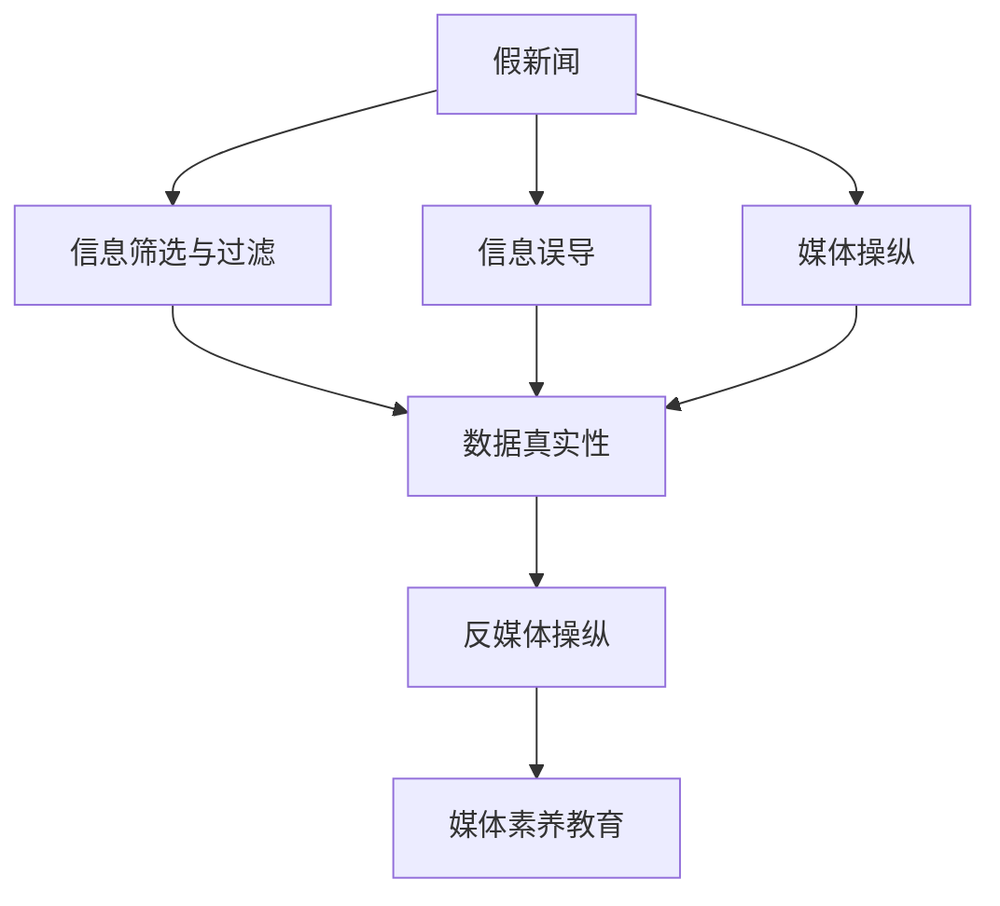

                 

# 信息验证和在线媒体素养教育：为假新闻和媒体操纵做好准备

## 1. 背景介绍

### 1.1 问题由来
随着互联网的普及，信息传播速度极大地加快，我们每天都能接触到大量信息。然而，这些信息并非都是真实可靠的。假新闻、信息误导、媒体操纵等问题愈演愈烈，给社会带来诸多负面影响，如选举操纵、公共舆论失控、经济损失等。信息验证和媒体素养教育正变得日益重要，有助于培养公众的媒体批判思维，提升其识别和处理信息的能力。

### 1.2 问题核心关键点
信息验证和媒体素养教育的核心在于以下几点：

- **数据真实性检查**：如何判断信息源的可靠性，数据的真实性？
- **信息筛选与过滤**：如何识别假新闻、信息误导等不实信息？
- **媒体批判思维**：如何培养公众的媒体批判思维，提升信息素养？
- **反媒体操纵**：如何防范媒体操纵和舆论操纵，保障信息自由流通？

这些核心关键点共同构成了信息验证和媒体素养教育的主要研究方向，对于构建健康的信息生态系统至关重要。

### 1.3 问题研究意义
信息验证和媒体素养教育对于提升公众的信息素养、维护社会信息生态系统的健康发展具有重要意义：

1. **提升公众信息素养**：通过系统培训，使公众具备更强的信息筛选、分析和批判能力，能够更好地识别和抵制假新闻、信息误导等。
2. **维护社会稳定**：培养公众的媒体批判思维，有助于防范舆论操纵和媒体偏见，减少社会矛盾和冲突。
3. **促进经济发展**：在商业和政治决策中，基于可靠信息的决策能够带来更高的成功率和效益，避免因误导信息导致的损失。
4. **保障信息自由流通**：通过信息验证和媒体素养教育，保障公众获取真实、全面、客观信息的权利，反对任何形式的媒体操纵。

## 2. 核心概念与联系

### 2.1 核心概念概述

信息验证和媒体素养教育涉及多个核心概念，包括但不限于：

- **假新闻**：故意捏造、篡改或夸大事实的虚假信息。
- **信息误导**：有意或无意地提供误导性信息，导致受众做出错误判断。
- **媒体操纵**：通过媒体手段影响公众情绪、观点、行为，以达到特定目的。
- **媒体素养**：识别、分析、评价媒体信息的能力，包括批判性思维、信息筛选和评估。
- **数据真实性**：判断信息源、数据采集和处理过程是否真实、准确。
- **反媒体操纵**：通过技术手段和社会机制防范和纠正媒体操纵行为，保障信息自由流通。

这些概念之间具有紧密的联系，共同构成了信息验证和媒体素养教育的基础框架。以下通过Mermaid流程图展示其核心联系：



这个流程图展示信息验证和媒体素养教育的主要流程和关键环节：

1. 假新闻产生后，通过媒体操纵传播，可能导致信息误导。
2. 信息筛选与过滤旨在识别和排除假新闻和信息误导。
3. 数据真实性检查进一步验证信息的真实性和可靠性。
4. 反媒体操纵措施用于防范和纠正媒体操纵行为。
5. 媒体素养教育培养公众的媒体批判思维和信息素养。

这些环节相互交织，共同构成了一个完整的信息验证和媒体素养教育体系。

## 3. 核心算法原理 & 具体操作步骤
### 3.1 算法原理概述

信息验证和媒体素养教育的算法原理主要基于以下几个核心点：

- **数据真实性检查**：通过对比信息源的信誉、数据采集和处理过程，判断信息的真实性。
- **信息筛选与过滤**：利用自然语言处理（NLP）技术，检测信息中的关键词、情感倾向等特征，识别和过滤假新闻和信息误导。
- **媒体批判思维**：通过机器学习和深度学习技术，训练模型学习从不同角度分析媒体信息的逻辑和论据，提升公众的批判思维。
- **反媒体操纵**：利用社交网络分析（SNA）技术，分析媒体操纵手段和传播路径，预防和纠正媒体操纵行为。

这些算法原理构成了信息验证和媒体素养教育的核心技术框架，通过系统的设计和应用，能够有效提升公众的信息素养和媒体批判能力。

### 3.2 算法步骤详解

信息验证和媒体素养教育通常包括以下几个关键步骤：

**Step 1: 数据准备与预处理**
- 收集和整理需要验证的信息源数据，包括新闻、文章、社交媒体帖子等。
- 对数据进行预处理，如去除停用词、词性标注、实体识别等。

**Step 2: 数据真实性检查**
- 利用Web爬虫技术获取信息源的基本信息，如网站信誉、历史记录、编辑团队等。
- 通过自然语言处理技术，检查信息中是否存在逻辑矛盾、证据不足等问题。
- 利用机器学习模型，对信息源进行信誉评估，判断其可信度。

**Step 3: 信息筛选与过滤**
- 利用NLP技术，检测信息中的关键词、情感倾向、可信度等特征。
- 基于特征提取，构建分类模型，识别和过滤假新闻、信息误导。
- 引入对抗样本和对抗性训练，提高模型的鲁棒性。

**Step 4: 媒体批判思维培养**
- 构建数据集，包含正面和负面媒体报道，用于训练媒体批判思维模型。
- 通过迁移学习，利用预训练语言模型进行微调，提升模型的批判性分析能力。
- 设计挑战和练习，让用户参与真实媒体报道的分析和批判，提升实际应用能力。

**Step 5: 反媒体操纵**
- 利用社交网络分析技术，检测媒体操纵手段和传播路径。
- 引入异常检测算法，实时监测和预警媒体操纵行为。
- 构建干预措施，如删除虚假信息、限制传播等，纠正媒体操纵行为。

**Step 6: 结果展示与反馈**
- 对验证结果进行展示，包括信息源可信度、信息真实性、批判性分析等。
- 根据用户反馈，不断优化和迭代算法，提升信息验证和媒体素养教育的准确性和有效性。

### 3.3 算法优缺点

信息验证和媒体素养教育的算法具有以下优点：

- **高效性**：利用NLP和机器学习技术，能够快速识别和过滤假新闻、信息误导。
- **客观性**：基于数据和模型的分析，减少人工干预的主观性。
- **可扩展性**：算法和技术可以针对不同媒体和信息源进行灵活应用。

同时，这些算法也存在一定的局限性：

- **数据依赖性**：算法的有效性依赖于高质量的标注数据和信息源数据。
- **误判风险**：模型可能存在误判，特别是在复杂信息环境中。
- **伦理问题**：算法可能侵犯个人隐私和言论自由，需要妥善处理。

尽管存在这些局限性，但就目前而言，信息验证和媒体素养教育仍然是最有效的技术手段，能够帮助公众提升信息素养，防范媒体操纵。

### 3.4 算法应用领域

信息验证和媒体素养教育在以下几个领域有着广泛的应用：

- **媒体平台**：如新闻网站、社交媒体、博客等，用于识别和过滤假新闻、信息误导，提升平台信息质量。
- **教育系统**：如学校、在线教育平台，用于培养学生的媒体批判思维和信息素养。
- **政府机构**：如新闻办公室、舆情监测中心，用于防范媒体操纵和舆论操纵，保障信息自由流通。
- **企业**：如广告公司、公关公司，用于判断广告的真实性和可信度，防范虚假广告。

这些领域的应用，使得信息验证和媒体素养教育成为维护社会信息生态系统的关键工具。

## 4. 数学模型和公式 & 详细讲解 & 举例说明

### 4.1 数学模型构建

信息验证和媒体素养教育的核心数学模型主要包括：

- **数据真实性检查模型**：基于信息源的信誉和数据采集处理过程，构建可信度评估模型。
- **信息筛选与过滤模型**：通过NLP技术，提取信息中的关键词、情感倾向等特征，构建分类模型。
- **媒体批判思维模型**：利用预训练语言模型，对媒体报道进行批判性分析，构建多视角分析模型。
- **反媒体操纵模型**：通过社交网络分析技术，检测媒体操纵手段和传播路径，构建异常检测模型。

### 4.2 公式推导过程

以数据真实性检查模型为例，展示其公式推导过程：

假设信息源的信誉度为 $R$，数据采集过程的准确度为 $A$，数据处理过程的准确度为 $P$，则信息的可信度 $C$ 可以表示为：

$$
C = f(R, A, P)
$$

其中 $f$ 为信誉度、数据采集和处理准确度的组合函数，可以表示为：

$$
C = \frac{R \cdot A \cdot P}{\alpha}
$$

其中 $\alpha$ 为调节系数，用于平衡各因素的影响。根据不同的应用场景，可以调整 $\alpha$ 的值，以获得最理想的评估结果。

### 4.3 案例分析与讲解

以信息筛选与过滤模型为例，展示其应用场景：

- **数据集构建**：收集大量新闻、文章、社交媒体帖子等数据，标注其真实性和可信度。
- **特征提取**：利用NLP技术，提取关键词、情感倾向、可信度等特征。
- **模型训练**：利用分类算法（如逻辑回归、SVM、决策树等），训练模型进行分类，识别假新闻和信息误导。
- **模型评估**：在测试集上进行评估，计算模型的准确率、召回率、F1分数等指标。
- **模型优化**：引入对抗样本和对抗性训练，提升模型的鲁棒性，减少误判。

## 5. 项目实践：代码实例和详细解释说明

### 5.1 开发环境搭建

在进行信息验证和媒体素养教育的实践前，需要准备好开发环境。以下是使用Python进行开发的环境配置流程：

1. 安装Python：从官网下载并安装Python 3.8及以上版本。
2. 安装Pip：在命令行中执行 `python -m pip install pip`。
3. 安装所需的Python包：使用以下命令安装相关的Python包，如NLTK、SpaCy、Scikit-learn等：
   ```
   pip install nltk spacy scikit-learn transformers
   ```

完成上述步骤后，即可在Python环境下开始信息验证和媒体素养教育的实践。

### 5.2 源代码详细实现

下面以信息筛选与过滤模型为例，给出使用Python和Transformers库进行信息验证的代码实现。

首先，定义数据处理函数：

```python
import nltk
from nltk.corpus import stopwords
from nltk.tokenize import word_tokenize
from transformers import BertTokenizer

def preprocess_text(text):
    # 去除停用词和标点
    stop_words = set(stopwords.words('english'))
    tokens = word_tokenize(text)
    filtered_tokens = [token.lower() for token in tokens if token.lower() not in stop_words]
    # 进行分词和标记
    tokenizer = BertTokenizer.from_pretrained('bert-base-uncased')
    tokens = tokenizer.tokenize(' '.join(filtered_tokens))
    return tokens
```

然后，定义模型训练函数：

```python
from sklearn.linear_model import LogisticRegression
from sklearn.model_selection import train_test_split

def train_model(X, y, test_size=0.2):
    X_train, X_test, y_train, y_test = train_test_split(X, y, test_size=test_size)
    model = LogisticRegression()
    model.fit(X_train, y_train)
    y_pred = model.predict(X_test)
    return model, y_pred
```

最后，进行模型评估：

```python
from sklearn.metrics import accuracy_score

def evaluate_model(model, y_true, y_pred):
    accuracy = accuracy_score(y_true, y_pred)
    print(f"Accuracy: {accuracy:.2f}")
```

这些代码实现了对新闻文章进行信息筛选与过滤的流程，包括文本预处理、模型训练和评估。可以看到，利用Python和Transformer库，信息验证的代码实现变得简洁高效。

### 5.3 代码解读与分析

让我们再详细解读一下关键代码的实现细节：

- **文本预处理**：使用NLTK库进行停用词去除、词性标注和分词，利用BertTokenizer进行分词处理，确保文本特征的一致性和准确性。
- **模型训练**：使用Logistic Regression模型进行分类训练，将预处理后的文本特征作为输入，将真实性和可信度作为标签。
- **模型评估**：计算模型在测试集上的准确率，评估模型的性能和泛化能力。
- **代码优化**：可以使用更多的NLP技术，如BERT、GPT等预训练模型，提升模型的性能和鲁棒性。

## 6. 实际应用场景

### 6.1 新闻平台

新闻平台是信息验证和媒体素养教育的主要应用场景之一。平台运营商可以采用信息验证技术，对用户发布的新闻和评论进行自动筛选和过滤，确保平台内容的质量和真实性。

### 6.2 教育系统

教育系统可以通过信息验证和媒体素养教育课程，培养学生的媒体批判思维和信息素养，帮助他们更好地识别和处理在线信息。

### 6.3 政府机构

政府机构可以利用信息验证和媒体素养教育，防范媒体操纵和舆论操纵，保障信息自由流通，维护社会稳定。

### 6.4 企业

企业可以利用信息验证和媒体素养教育，判断广告的真实性和可信度，防范虚假广告，提升品牌形象和市场竞争力。

### 6.5 未来应用展望

随着技术的进步和应用的扩展，信息验证和媒体素养教育将在更多领域得到应用，为社会带来更大的价值。

- **智能客服**：利用信息验证技术，提升智能客服系统的信息准确性和用户满意度。
- **社交媒体**：构建媒体素养教育平台，提升用户的媒体批判思维，减少假新闻和信息误导。
- **电子商务**：通过信息验证和媒体素养教育，防范虚假广告和消费者欺诈行为，提升交易安全。

未来，信息验证和媒体素养教育将与其他AI技术进行更深入的融合，如知识图谱、自然语言生成等，构建更加智能和全面的信息生态系统。

## 7. 工具和资源推荐

### 7.1 学习资源推荐

为了帮助开发者系统掌握信息验证和媒体素养教育的技术，以下是一些优质的学习资源：

1. **《自然语言处理入门与实践》**：一本全面介绍NLP技术的书籍，涵盖信息验证、媒体素养教育等前沿话题。
2. **CS221《自然语言处理》课程**：斯坦福大学开设的NLP明星课程，有Lecture视频和配套作业，适合初学者入门。
3. **《Python NLP》**：一本介绍NLP和Python编程的书籍，包括信息验证、文本分类、情感分析等。
4. **HuggingFace官方文档**：Transformer库的官方文档，提供了丰富的预训练模型和微调样例代码。
5. **NLTK和SpaCy文档**：NLP工具库的官方文档，提供了丰富的NLP工具和资源。

通过对这些资源的学习，相信你一定能够快速掌握信息验证和媒体素养教育的核心技术，并用于解决实际的NLP问题。

### 7.2 开发工具推荐

高效的信息验证和媒体素养教育开发离不开优秀的工具支持。以下是几款常用的工具：

1. **Python**：基于Python的开发环境，灵活性强，易于快速迭代。
2. **Jupyter Notebook**：交互式开发环境，便于代码调试和实验。
3. **NLTK和SpaCy**：NLP工具库，提供了丰富的NLP功能和模型。
4. **Scikit-learn**：机器学习库，提供了丰富的分类、回归、聚类等算法。
5. **TensorFlow和PyTorch**：深度学习框架，提供了强大的模型训练和优化功能。

合理利用这些工具，可以显著提升信息验证和媒体素养教育的开发效率，加快创新迭代的步伐。

### 7.3 相关论文推荐

信息验证和媒体素养教育的研究源于学界的持续探索。以下是几篇奠基性的相关论文，推荐阅读：

1. **《信息检索：概念与技术》**：详细介绍了信息检索和信息验证的基本概念和关键技术。
2. **《媒体素养教育：概念与实践》**：探讨了媒体素养教育的基本理论和实践方法。
3. **《自然语言处理中的情感分析》**：介绍了情感分析在信息验证和媒体素养教育中的应用。
4. **《社交网络分析：概念与技术》**：详细介绍了社交网络分析的基本概念和关键技术。
5. **《深度学习在信息验证中的应用》**：探讨了深度学习在信息验证中的潜力和技术实现。

这些论文代表了大数据、人工智能和媒体素养教育的研究进展，通过学习这些前沿成果，可以帮助研究者把握学科前进方向，激发更多的创新灵感。

## 8. 总结：未来发展趋势与挑战

### 8.1 总结

本文对信息验证和媒体素养教育进行了全面系统的介绍。首先阐述了信息验证和媒体素养教育的研究背景和意义，明确了其在提升公众信息素养、防范媒体操纵等方面的重要价值。其次，从原理到实践，详细讲解了信息验证和媒体素养教育的关键技术，包括数据真实性检查、信息筛选与过滤、媒体批判思维培养和反媒体操纵等。同时，本文还广泛探讨了信息验证和媒体素养教育在多个行业领域的应用前景，展示了其在构建健康信息生态系统中的重要地位。

通过本文的系统梳理，可以看到，信息验证和媒体素养教育已经成为维护社会信息生态系统的关键工具，其广泛应用将带来巨大的社会价值。

### 8.2 未来发展趋势

展望未来，信息验证和媒体素养教育将呈现以下几个发展趋势：

1. **技术进步**：随着深度学习和自然语言处理技术的不断发展，信息验证和媒体素养教育将变得更加智能和高效。
2. **跨领域应用**：信息验证和媒体素养教育将扩展到更多领域，如智能客服、社交媒体、电子商务等，成为普适性的信息素养教育工具。
3. **个性化学习**：通过机器学习和深度学习技术，实现个性化信息素养教育，提升学习效果。
4. **多模态融合**：结合文本、图像、视频等多模态信息，构建更加全面和准确的信息验证系统。
5. **跨学科融合**：与心理学、社会学等学科进行深度融合，提升信息验证和媒体素养教育的科学性和实践性。
6. **国际合作**：加强国际合作，共同应对全球假新闻和媒体操纵问题，构建全球信息素养教育体系。

以上趋势将引领信息验证和媒体素养教育迈向更高的台阶，为构建健康、高效、智能的信息生态系统提供有力支撑。

### 8.3 面临的挑战

尽管信息验证和媒体素养教育已经取得了显著进展，但在迈向全面应用的过程中，仍面临诸多挑战：

1. **数据隐私**：信息验证和媒体素养教育需要大量的数据进行训练和测试，如何平衡数据使用和隐私保护是一大挑战。
2. **伦理问题**：信息验证和媒体素养教育可能存在伦理问题，如算法偏见、言论自由等，需要妥善处理。
3. **技术普及**：如何使信息验证和媒体素养教育技术普及到更多用户，特别是弱势群体，需要更多社会支持和政策引导。
4. **效果评估**：如何科学评估信息验证和媒体素养教育的效果，建立标准化的评估体系，需要进一步研究。
5. **跨平台整合**：不同平台和应用之间的信息验证和媒体素养教育技术如何整合，需要统一标准和规范。

解决这些挑战，需要多方面的努力和协作，包括政府、企业、研究机构和公众的共同参与。只有全面解决这些挑战，信息验证和媒体素养教育才能真正实现其价值。

### 8.4 研究展望

面向未来，信息验证和媒体素养教育的研究需要在以下几个方面寻求新的突破：

1. **数据隐私保护**：开发隐私保护技术，如差分隐私、联邦学习等，确保数据使用的合法性和隐私保护。
2. **伦理模型设计**：设计伦理导向的模型评估指标，过滤和惩罚有偏见、有害的输出倾向，保障算法的公平性和公正性。
3. **跨平台整合**：建立统一的信息验证和媒体素养教育标准和规范，促进不同平台和应用之间的技术整合。
4. **效果评估体系**：建立科学、系统的信息验证和媒体素养教育效果评估体系，提升技术的实用性和可靠性。
5. **技术普及推广**：加强信息验证和媒体素养教育技术的推广和普及，提升公众的媒体素养和信息素养。

这些研究方向的探索，将推动信息验证和媒体素养教育技术的进一步发展，为构建健康、智能、普适的信息生态系统奠定坚实基础。

## 9. 附录：常见问题与解答

**Q1: 信息验证和媒体素养教育与假新闻检测有何区别？**

A: 信息验证和媒体素养教育主要关注信息的真实性和可信度，旨在提升公众的信息素养和媒体批判思维。而假新闻检测是信息验证的一个具体应用，旨在识别和过滤假新闻。因此，信息验证和媒体素养教育比假新闻检测具有更广泛的应用场景和更高的技术要求。

**Q2: 如何设计信息验证和媒体素养教育课程？**

A: 设计信息验证和媒体素养教育课程需要考虑以下几个关键点：
1. 确定课程目标和受众：明确课程旨在提升哪些信息素养和媒体批判能力，针对哪些受众群体。
2. 选择合适的教学内容：根据受众的认知水平和兴趣，选择合适的教学内容，如新闻案例、媒体报道、社交媒体帖子等。
3. 采用多样化的教学方法：结合课堂教学、在线学习、实践演练等多种教学方法，提升教学效果。
4. 设计科学的评估体系：通过定期测试、项目实践等方式，科学评估学生的学习效果，及时调整教学策略。

**Q3: 如何防范媒体操纵和舆论操纵？**

A: 防范媒体操纵和舆论操纵需要多方面的努力：
1. 加强信息验证和媒体素养教育：提升公众的信息素养和媒体批判能力，能够识别和抵制媒体操纵行为。
2. 建立信息透明机制：通过公开信息来源和数据，增加媒体报道的透明度和可信度，减少媒体操纵的空间。
3. 引入多元化的信息源：鼓励多元化的信息源，减少单一媒体来源带来的偏见和误导。
4. 建立干预机制：在发现媒体操纵行为时，及时采取干预措施，如删除虚假信息、限制传播等。

这些措施需要政府、企业、研究机构和公众的共同参与和努力，才能构建健康、透明、开放的信息生态系统。

**Q4: 如何提升信息验证和媒体素养教育技术的准确性和鲁棒性？**

A: 提升信息验证和媒体素养教育技术的准确性和鲁棒性需要从以下几个方面进行优化：
1. 增加训练数据的多样性：增加不同领域、不同媒体、不同语言的信息验证数据，提高模型的泛化能力。
2. 引入对抗性训练：通过引入对抗样本和对抗性训练，提升模型的鲁棒性和抗干扰能力。
3. 优化特征提取方法：采用更先进的NLP技术，如BERT、GPT等预训练模型，提高特征提取的准确性和鲁棒性。
4. 定期更新模型：定期更新和重新训练模型，确保模型能够适应新出现的信息和媒体形式。

通过不断优化和迭代，信息验证和媒体素养教育技术将变得更加准确和鲁棒，更好地服务于社会。

**Q5: 信息验证和媒体素养教育技术的局限性有哪些？**

A: 信息验证和媒体素养教育技术虽然有很多优点，但也存在一些局限性：
1. 数据依赖性：算法的有效性依赖于高质量的标注数据和信息源数据，标注数据获取成本高、难度大。
2. 模型泛化能力：模型可能存在泛化能力不足的问题，对新出现的信息和媒体形式适应性较差。
3. 伦理问题：算法可能存在伦理问题，如算法偏见、隐私泄露等，需要妥善处理。
4. 技术门槛高：信息验证和媒体素养教育技术需要较高的技术门槛，推广和普及难度大。
5. 实时性问题：模型推理速度慢，难以实时处理大规模的信息流。

解决这些局限性需要多方面的努力，包括技术优化、政策引导和社会支持。

---

作者：禅与计算机程序设计艺术 / Zen and the Art of Computer Programming

