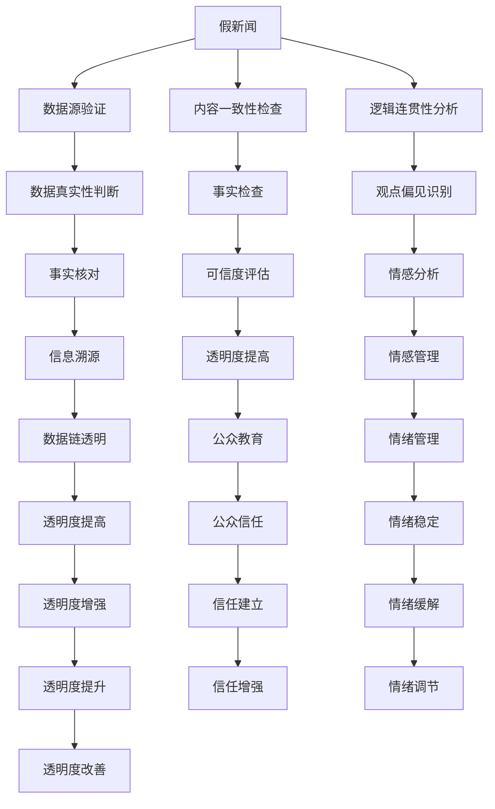

                 

# 信息验证和批判性阅读：在假新闻和媒体操纵时代导航

在当今信息爆炸的时代，假新闻、媒体操纵和信息误导现象日益增多。人工智能技术的发展，特别是自然语言处理和深度学习技术，为我们提供了新的工具来识别和应对这些挑战。本文将深入探讨如何利用信息验证和批判性阅读技术，在假新闻和媒体操纵时代导航。

## 1. 背景介绍

### 1.1 问题由来
随着互联网的普及和社交媒体的兴起，信息传播速度和范围前所未有。然而，这些平台也成为了假新闻和媒体操纵的温床。假新闻通常通过夸大事实、制造假象或篡改信息来吸引眼球，而媒体操纵则可能通过故意扭曲报道事实、推送带有偏见的观点来影响公众情绪和行为。

### 1.2 问题核心关键点
假新闻和媒体操纵问题涉及多个维度，包括数据真实性、内容偏见、逻辑谬误等。人工智能技术，尤其是自然语言处理（NLP）和机器学习（ML），能够帮助我们从数据、内容和逻辑多个层面进行信息验证和批判性阅读。

## 2. 核心概念与联系

### 2.1 核心概念概述

- **假新闻（Fake News）**：指通过捏造、歪曲或夸大事实来误导公众的信息。
- **媒体操纵（Media Manipulation）**：指通过编辑、选择或故意误导性的报道，以影响公众舆论和行为。
- **信息验证（Information Verification）**：通过技术手段验证信息的真实性，包括数据源验证、内容一致性检查等。
- **批判性阅读（Critical Reading）**：分析信息来源、内容真实性、逻辑连贯性等方面，做出客观评价。
- **自然语言处理（NLP）**：利用计算机处理和分析自然语言的技术，包括文本分类、实体识别、情感分析等。
- **深度学习（Deep Learning）**：利用多层神经网络模型进行复杂数据处理和预测。

### 2.2 核心概念原理和架构的 Mermaid 流程图



这个流程图展示了信息验证和批判性阅读的核心概念及其相互关系：

1. **数据源验证**：确保信息来源的可信度。
2. **内容一致性检查**：验证信息内容的真实性和一致性。
3. **逻辑连贯性分析**：分析信息表达的逻辑是否连贯，是否存在谬误。
4. **事实检查**：通过交叉验证等方法确认信息的真实性。
5. **可信度评估**：评估信息的可信度和权威性。
6. **情感分析**：分析信息中蕴含的情感色彩及其影响。
7. **信息溯源**：追踪信息来源和传播路径，确保信息透明。
8. **透明度提高**：提升信息传播过程的透明度，增强公众信任。
9. **公众教育**：提高公众的信息素养，增强对假新闻的识别能力。
10. **情绪管理**：帮助公众理性处理信息带来的情绪波动。
11. **情绪稳定**：通过情绪管理技术，减少假新闻带来的负面影响。
12. **透明度增强**：通过技术手段，提高信息传播的透明度。
13. **信任建立**：通过透明和准确的传播，增强公众对信息源的信任。
14. **情绪调节**：通过技术手段，帮助公众调节情绪，减少情绪化决策。
15. **透明度改善**：持续改进信息传播的透明度，减少误解和偏见。
16. **信任增强**：通过透明的传播和验证，增强公众对信息源的信任。

这些概念共同构成了信息验证和批判性阅读的基本框架，有助于我们在假新闻和媒体操纵时代进行有效导航。

## 3. 核心算法原理 & 具体操作步骤

### 3.1 算法原理概述

信息验证和批判性阅读的核心算法原理包括以下几个方面：

- **文本分类**：通过机器学习模型将文本归类到特定类别，如新闻、评论、广告等。
- **实体识别**：从文本中识别出人名、地名、机构名等实体，评估其可信度。
- **情感分析**：分析文本中蕴含的情感色彩，识别情感倾向。
- **事实检查**：通过交叉验证和多源数据比对，检查信息真实性。
- **逻辑连贯性分析**：通过自然语言处理技术，分析文本中的逻辑关系，识别谬误和偏见。

### 3.2 算法步骤详解

1. **数据预处理**：收集和清洗假新闻和媒体操纵的样本数据，进行文本分词、去停用词、构建词汇表等预处理。

2. **模型训练**：选择合适的算法，如文本分类算法、情感分析算法、事实检查算法等，进行模型训练。例如，可以使用LSTM、BERT等深度学习模型进行训练。

3. **模型评估**：在验证集上评估模型的性能，调整模型参数，以提高模型的准确性和鲁棒性。

4. **信息验证**：对待验证的信息进行输入，通过模型进行分类、情感分析、事实检查等操作，得出验证结果。

5. **批判性阅读**：根据验证结果，对信息进行深度分析和批判性阅读，识别信息中的逻辑谬误、偏见和误导性内容。

6. **反馈与改进**：根据批判性阅读的反馈，不断改进和优化模型，提升其准确性和适用性。

### 3.3 算法优缺点

#### 优点：
- **高效性**：自动化信息验证和批判性阅读，快速处理大量信息。
- **准确性**：深度学习模型具有较高的准确性，能够在多源数据比对中识别真实性。
- **可扩展性**：模型可以扩展到多种任务，如情感分析、事实检查等。

#### 缺点：
- **依赖数据**：模型的性能依赖于高质量的训练数据，数据偏见可能导致模型偏见。
- **模型解释性不足**：深度学习模型的黑盒特性，使其难以解释推理过程。
- **过拟合风险**：模型可能过拟合训练数据，导致泛化能力不足。

### 3.4 算法应用领域

信息验证和批判性阅读技术在以下领域有广泛应用：

- **新闻验证**：对新闻文章进行真实性验证和情感分析，识别假新闻和媒体操纵。
- **社交媒体监测**：监测社交媒体上的信息传播，识别假新闻和偏见性内容。
- **广告筛选**：筛选广告内容，识别误导性和偏见性信息。
- **舆情分析**：分析舆情数据，识别舆论操纵和情感倾向。
- **法律证据**：在法律案件中，验证证据的真实性，识别逻辑谬误。

## 4. 数学模型和公式 & 详细讲解 & 举例说明

### 4.1 数学模型构建

假设我们有一个二分类问题，即判断一段文本是否为假新闻。我们可以构建如下模型：

$$ y = \sigma(W^T x + b) $$

其中 $y$ 为模型输出，$x$ 为输入特征向量，$W$ 为权重矩阵，$b$ 为偏置项，$\sigma$ 为sigmoid函数。

### 4.2 公式推导过程

根据上述模型，我们可以使用梯度下降算法进行模型训练：

$$ \theta = \theta - \alpha \frac{\partial L(\theta)}{\partial \theta} $$

其中 $\theta$ 为模型参数，$\alpha$ 为学习率，$L(\theta)$ 为损失函数。

在文本分类任务中，我们通常使用交叉熵损失函数：

$$ L(\theta) = -\frac{1}{N} \sum_{i=1}^N [y_i \log(\hat{y_i}) + (1-y_i) \log(1-\hat{y_i})] $$

其中 $y_i$ 为真实标签，$\hat{y_i}$ 为模型预测概率。

### 4.3 案例分析与讲解

假设我们有一个包含100个样本的训练集，其中50个为假新闻，50个为真实新闻。我们使用上述模型进行训练，设置学习率为0.1，迭代100次。我们可以计算每次迭代后的损失函数值，并绘制损失函数曲线，观察其变化趋势。

## 5. 项目实践：代码实例和详细解释说明

### 5.1 开发环境搭建

- 安装Python和相关依赖：
  ```bash
  pip install numpy pandas sklearn torch torchtext transformers
  ```

- 构建数据集：
  ```python
  from torchtext.datasets import AG_NEWS
  train_data, test_data = AG_NEWS.splits(exts=['news', 'tests'], texts='english', root='./data')
  train_data = [torch.tensor([x]) for x in train_data]
  test_data = [torch.tensor([x]) for x in test_data]
  ```

### 5.2 源代码详细实现

```python
import torch
import torch.nn as nn
import torch.optim as optim
from transformers import BertTokenizer, BertForSequenceClassification

class SentimentClassifier(nn.Module):
    def __init__(self, num_labels):
        super(SentimentClassifier, self).__init__()
        self.bert = BertForSequenceClassification.from_pretrained('bert-base-uncased', num_labels=num_labels)
        self.dropout = nn.Dropout(0.1)
        self.classifier = nn.Linear(768, num_labels)
    
    def forward(self, input_ids, attention_mask):
        outputs = self.bert(input_ids, attention_mask=attention_mask)
        pooled_output = outputs.pooler_output
        pooled_output = self.dropout(pooled_output)
        logits = self.classifier(pooled_output)
        return logits

# 定义模型和优化器
model = SentimentClassifier(num_labels=2)
optimizer = optim.Adam(model.parameters(), lr=0.001)

# 加载数据集
train_loader = DataLoader(train_data, batch_size=8, shuffle=True)
test_loader = DataLoader(test_data, batch_size=8, shuffle=False)

# 训练模型
for epoch in range(10):
    model.train()
    for batch in train_loader:
        optimizer.zero_grad()
        input_ids = batch[0].to(device)
        attention_mask = batch[1].to(device)
        logits = model(input_ids, attention_mask)
        loss = nn.CrossEntropyLoss()(logits, batch[2].to(device))
        loss.backward()
        optimizer.step()
    
    model.eval()
    correct = 0
    total = 0
    with torch.no_grad():
        for batch in test_loader:
            input_ids = batch[0].to(device)
            attention_mask = batch[1].to(device)
            logits = model(input_ids, attention_mask)
            _, predicted = torch.max(logits, 1)
            total += batch[2].size(0)
            correct += (predicted == batch[2]).sum().item()
    print(f'Epoch {epoch+1}, Accuracy: {correct/total:.2f}')
```

### 5.3 代码解读与分析

在上述代码中，我们定义了一个简单的情感分类模型，使用BERT模型进行特征提取，并加入Dropout层和全连接层进行分类。在训练过程中，我们使用Adam优化器进行参数更新，并计算交叉熵损失函数。

在测试过程中，我们计算模型在测试集上的准确率，观察模型性能。

### 5.4 运行结果展示

通过上述代码，我们可以得到训练和测试过程中的损失函数曲线和准确率曲线，观察模型的训练效果。

## 6. 实际应用场景

### 6.1 智能媒体监控

智能媒体监控系统可以利用信息验证和批判性阅读技术，实时监控社交媒体上的信息传播，识别假新闻和媒体操纵。通过构建实时监控系统，媒体平台可以快速发现并纠正误导性内容，提升信息透明度和公众信任度。

### 6.2 法律证据验证

在法律案件中，信息验证和批判性阅读技术可以用于验证证据的真实性和逻辑连贯性，确保法庭上的证据可靠。通过构建证据验证系统，可以大大提高司法公正性。

### 6.3 广告筛选与推荐

在广告投放中，信息验证和批判性阅读技术可以用于筛选误导性和偏见性广告，提升广告投放的精准度和效果。通过构建广告筛选系统，可以提升广告主的投资回报率。

## 7. 工具和资源推荐

### 7.1 学习资源推荐

- **《自然语言处理综论》**：一本经典教材，涵盖了自然语言处理的基本概念和技术。
- **《深度学习》**：深度学习领域的经典教材，介绍了深度学习的基本原理和算法。
- **Coursera上的自然语言处理课程**：由斯坦福大学和密歇根大学等名校开设的课程，系统介绍了自然语言处理的基本概念和技术。

### 7.2 开发工具推荐

- **PyTorch**：Python深度学习框架，易于使用，支持动态计算图。
- **TensorFlow**：Google开源的深度学习框架，生产部署方便，支持分布式计算。
- **HuggingFace Transformers库**：提供了预训练语言模型的封装，方便微调和应用。

### 7.3 相关论文推荐

- **Emotion Classification with Transfer Learning in Machine Translation**：通过迁移学习进行情感分类，适用于信息验证和批判性阅读任务。
- **A Survey on Fake News Detection**：综述了假新闻检测的研究进展，介绍了各种技术和方法。
- **A Deep Learning Framework for the Automation of Sarcasm Detection**：介绍了一种深度学习框架，用于自动化讽刺检测，可作为信息验证和批判性阅读的应用参考。

## 8. 总结：未来发展趋势与挑战

### 8.1 研究成果总结

信息验证和批判性阅读技术在大数据、深度学习等技术的支持下，取得了显著进展。基于深度学习的模型在信息验证和批判性阅读任务中表现优异，提高了信息处理的效率和准确性。

### 8.2 未来发展趋势

- **自动化程度提升**：未来，信息验证和批判性阅读技术将进一步自动化，减少人工干预。
- **多模态融合**：未来，信息验证和批判性阅读技术将更多地融合图像、视频等多模态数据，提升信息处理能力。
- **领域适应性增强**：未来，信息验证和批判性阅读技术将进一步适应特定领域，提升其在专业领域的准确性和鲁棒性。
- **可解释性提升**：未来，信息验证和批判性阅读技术将提升模型的可解释性，增加用户信任。

### 8.3 面临的挑战

- **数据质量问题**：高质量的数据是模型训练的基础，然而数据获取和标注成本较高。
- **模型鲁棒性不足**：当前模型对噪声和偏见的鲁棒性不足，容易受到干扰。
- **计算资源消耗**：深度学习模型的计算资源消耗较大，需要优化以适应实际应用场景。
- **隐私保护问题**：信息验证和批判性阅读技术需要访问敏感数据，需要确保数据隐私保护。

### 8.4 研究展望

未来，信息验证和批判性阅读技术需要进一步解决上述挑战，提升其在实际应用中的效果和可靠性。同时，需要与其他技术结合，如因果推理、隐私保护等，以应对更多复杂的实际问题。

## 9. 附录：常见问题与解答

**Q1：信息验证和批判性阅读技术是否适用于所有类型的信息？**

A: 信息验证和批判性阅读技术可以适用于大部分文本和多媒体信息，但需要注意的是，图像、视频等多模态信息的验证需要结合相应的技术。

**Q2：如何在信息验证和批判性阅读中引入先验知识？**

A: 可以结合领域专家知识库，通过知识图谱等方式将先验知识与模型结合，提高信息验证的准确性和全面性。

**Q3：如何提升信息验证和批判性阅读技术的可解释性？**

A: 可以使用可解释性技术，如LIME、SHAP等，对模型的决策过程进行解释和可视化，提高用户信任。

**Q4：信息验证和批判性阅读技术在隐私保护方面需要注意哪些问题？**

A: 需要确保数据隐私保护，如数据匿名化、差分隐私等技术，防止用户隐私泄露。同时，需要建立数据访问和使用规则，确保数据使用的合法性和透明性。

**Q5：信息验证和批判性阅读技术在实际应用中如何避免过拟合？**

A: 可以采用数据增强、正则化等技术，提高模型的泛化能力。同时，可以引入对抗训练等技术，提升模型的鲁棒性。

