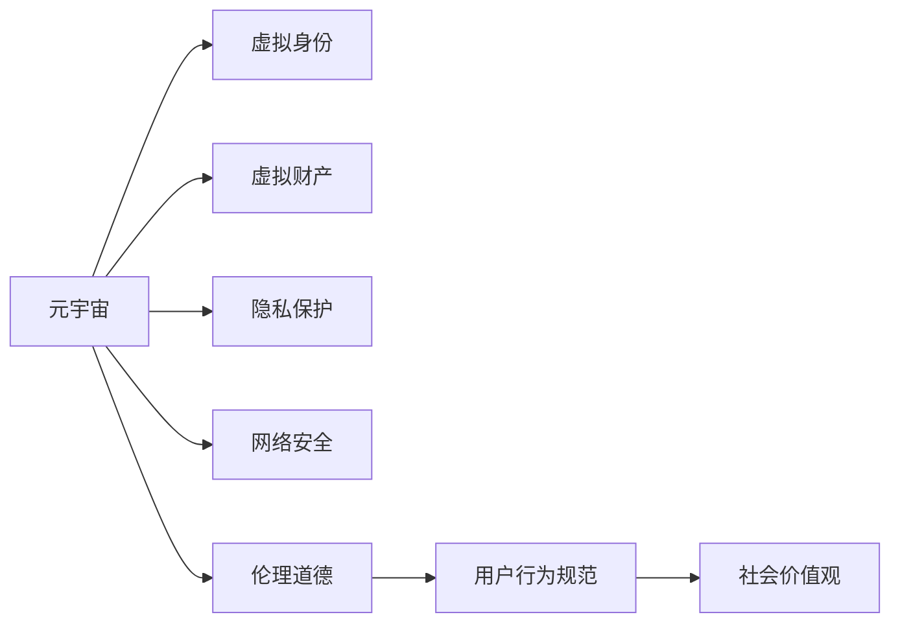

                 

## 1. 背景介绍

### 1.1 问题由来

随着虚拟现实技术的快速发展，元宇宙(Metaverse)逐渐成为科技巨头和创业者竞相探索的新兴领域。元宇宙是一种虚拟的、持续在线的环境，用户可以在其中进行社交、购物、工作、游戏等活动，它打破了时间和空间的限制，为人类提供了全新的生活方式和社交方式。然而，在元宇宙的背后，如何界定虚拟行为与现实世界的伦理道德边界，成为一道复杂的难题。

### 1.2 问题核心关键点

元宇宙中的伦理道德问题涉及多方面，包括但不限于虚拟财产所有权、虚拟身份认证、隐私保护、网络安全、虚拟环境治理等。这些问题不仅影响用户的体验，更牵涉到法律、伦理和社会的根本秩序。

### 1.3 问题研究意义

探讨元宇宙中的伦理道德问题，对于维护虚拟世界秩序，保障用户权益，促进元宇宙的健康发展，具有重要意义。研究者需要深入理解元宇宙的运作机制，提出相应的伦理道德框架，以确保虚拟行为既能满足用户的期望，又能遵守现实世界的法律法规。

## 2. 核心概念与联系

### 2.1 核心概念概述

为更好地理解元宇宙中的伦理道德问题，本节将介绍几个关键概念：

- **元宇宙(Metaverse)**：一种虚拟的、持续在线的环境，用户在其中可以进行社交、工作、娱乐等活动，具有高度的沉浸感和交互性。
- **虚拟身份(Virtual Identity)**：用户在元宇宙中使用的数字身份，可以代表现实世界的个人或企业。
- **虚拟财产(Virtual Assets)**：在元宇宙中由数字代码定义的财产，如虚拟土地、虚拟物品、虚拟货币等。
- **隐私保护(Privacy Protection)**：在元宇宙中对用户个人数据的保护，防止数据泄露和滥用。
- **网络安全(Cybersecurity)**：保障元宇宙平台和用户数据安全，避免黑客攻击和信息泄露。
- **伦理道德(Ethics and Morality)**：在元宇宙中界定虚拟行为的道德规范，确保用户行为符合社会价值观。

这些概念之间的逻辑关系可以通过以下Mermaid流程图来展示：



这个流程图展示了一些关键概念及其之间的关系：

1. 元宇宙提供了一个虚拟的平台，用户在其中建立虚拟身份，拥有虚拟财产，进行各种虚拟活动。
2. 隐私保护和网络安全是元宇宙平台和用户数据安全的基础。
3. 伦理道德框架对用户行为进行规范，保障社会价值观在虚拟世界中的体现。

## 3. 核心算法原理 & 具体操作步骤

### 3.1 算法原理概述

元宇宙中的伦理道德问题，涉及多个学科的知识，包括计算机科学、法律、伦理学等。解决这些问题，需要构建一个多维度的伦理道德框架，涵盖用户行为规范、法律监管、伦理原则等多个方面。

### 3.2 算法步骤详解

构建元宇宙中的伦理道德框架，主要包括以下几个关键步骤：

**Step 1: 数据收集与分析**

- 收集元宇宙中用户行为数据，包括但不限于交互记录、交易记录、用户反馈等。
- 分析数据，识别出潜在的问题点和道德风险。

**Step 2: 建立伦理道德标准**

- 借鉴现实世界的法律法规和伦理原则，建立元宇宙的伦理道德标准。
- 涵盖虚拟财产所有权、虚拟身份认证、隐私保护、网络安全等多个方面。

**Step 3: 制定用户行为规范**

- 制定具体化的用户行为规范，明确哪些行为是允许的，哪些行为是不允许的。
- 使用智能合约等技术，确保用户行为规范的执行。

**Step 4: 法律监管与执行**

- 配合法律法规，对元宇宙中的不道德行为进行监管和处罚。
- 设立专门的监管机构，确保法律法规的有效实施。

**Step 5: 伦理培训与教育**

- 对元宇宙平台的管理者和用户进行伦理培训，提升其道德意识。
- 普及伦理知识，增强用户的道德自律。

### 3.3 算法优缺点

元宇宙中的伦理道德框架具有以下优点：

1. 多维度覆盖。框架涵盖隐私保护、网络安全、伦理道德等多个维度，提供全面的解决方案。
2. 可执行性高。使用智能合约等技术，确保用户行为规范的自动执行。
3. 适应性强。框架可以不断更新，适应元宇宙的不断发展和变化。

但同时也存在一些局限性：

1. 法律适应性。不同国家和地区的法律法规不同，元宇宙的伦理道德框架需要兼顾各国的法律要求。
2. 伦理原则的争议。某些伦理原则在不同文化和社会中存在争议，需要平衡各方利益。
3. 技术实现难度。框架的实施需要技术支持，如区块链、智能合约等，存在技术实现的挑战。

### 3.4 算法应用领域

元宇宙中的伦理道德框架，主要应用于以下几个领域：

1. **虚拟财产所有权**：界定虚拟土地、虚拟物品等虚拟财产的归属和使用权。
2. **虚拟身份认证**：确保虚拟身份的真实性和合法性，防止虚假身份的滥用。
3. **隐私保护**：保障用户隐私，防止数据泄露和滥用。
4. **网络安全**：保障元宇宙平台和用户数据的安全，防止黑客攻击和信息泄露。
5. **伦理监管**：制定元宇宙平台的伦理道德规范，防止有害行为的发生。

## 4. 数学模型和公式 & 详细讲解 & 举例说明

### 4.1 数学模型构建

元宇宙中的伦理道德问题，涉及多个学科的数学模型。以下我们将以隐私保护为例，介绍一个简单的数学模型。

假设元宇宙中有 $N$ 个用户，每个用户有一个隐私保护得分 $P_i$，初始值为1。在每次用户进行交互时，隐私保护得分会根据行为的表现进行更新，如果行为符合隐私保护规范，得分增加，否则得分减少。隐私保护得分的更新公式为：

$$
P_{i} = P_{i-1} + \alpha \cdot f_i
$$

其中 $\alpha$ 为每次更新的影响因子，$f_i$ 为行为对隐私保护得分的贡献值，可以是正数（符合规范的行为）或负数（违反规范的行为）。

### 4.2 公式推导过程

在隐私保护得分的更新公式中，$f_i$ 的计算方式如下：

1. 对于符合隐私保护规范的行为，$f_i = k_1$，其中 $k_1$ 为正数，表示行为对隐私保护的正面影响。
2. 对于违反隐私保护规范的行为，$f_i = k_2 \cdot (1 - P_i)$，其中 $k_2$ 为正数，表示行为对隐私保护的负面影响，随着得分的降低，负影响逐渐增加。

将上述公式代入隐私保护得分的更新公式中，可以得到：

$$
P_{i} = P_{i-1} + \alpha \cdot k_1
$$

当 $P_i < 0$ 时，表示用户隐私保护得分已低于基准值，需要对其进行处罚，可以采取限制其部分功能或降低其在元宇宙中的信誉度等措施。

### 4.3 案例分析与讲解

以一个虚拟土地交易平台为例，分析其隐私保护模型的应用。假设平台要求用户在交易前进行身份认证，并提交真实信息。如果用户提交了虚假信息，隐私保护得分为负，每次交易都会降低，直到低于0，系统将限制该用户无法再提交新交易。此外，平台还可以引入区块链技术，确保交易记录的不可篡改性和透明性，进一步提升隐私保护的水平。

## 5. 项目实践：代码实例和详细解释说明

### 5.1 开发环境搭建

在进行元宇宙伦理道德框架的开发前，我们需要准备好开发环境。以下是使用Python进行开发的环境配置流程：

1. 安装Anaconda：从官网下载并安装Anaconda，用于创建独立的Python环境。

2. 创建并激活虚拟环境：
```bash
conda create -n py360 python=3.6 
conda activate py360
```

3. 安装所需的Python包：
```bash
pip install requests py3 cryptography
```

### 5.2 源代码详细实现

以下是一个简单的隐私保护得分的代码实现，以供参考：

```python
import requests
import json
from cryptography.fernet import Fernet

# 用户行为对隐私保护得分的贡献值
K1 = 0.1
K2 = 0.2

# 每次更新的影响因子
ALPHA = 0.01

# 隐私保护得分阈值
THRESHOLD = 0

# 加密密钥
KEY = b'your-encryption-key'

# 生成加密器
CIPHER = Fernet(KEY)

# 定义用户隐私保护得分
def update_privacy_score(score):
    # 计算行为对隐私保护的贡献值
    contribution = K1 if score >= 0 else K2 * (1 - score)

    # 更新隐私保护得分
    score = score + ALPHA * contribution

    # 如果得分低于阈值，进行处罚
    if score < THRESHOLD:
        # 限制部分功能或降低信誉度
        penalty = score * ALPHA * 2
        if contribution < 0:
            penalty *= -1
        score = max(score - penalty, THRESHOLD)

    return score

# 模拟用户行为
def simulate_behavior():
    # 生成随机行为数据
    actions = [1, -1, 1, 1, -1]

    # 初始隐私保护得分
    privacy_score = 1

    # 记录用户行为和得分变化
    for action in actions:
        privacy_score = update_privacy_score(privacy_score)
        print(f"Action: {action}, Privacy Score: {privacy_score}")

    return privacy_score

# 调用模拟行为函数
simulate_behavior()
```

### 5.3 代码解读与分析

让我们再详细解读一下关键代码的实现细节：

**update_privacy_score函数**：
- 根据用户的隐私保护得分和行为，计算行为对隐私保护的贡献值。
- 更新隐私保护得分，如果得分低于阈值，则进行处罚。
- 处罚的方式可以是限制部分功能或降低用户在平台中的信誉度等。

**simulate_behavior函数**：
- 模拟用户的几个行为（例如提交真实信息、提交虚假信息等）。
- 记录每次行为后的隐私保护得分变化。
- 返回最终的隐私保护得分。

**simulate_behavior函数调用**：
- 调用模拟行为函数，模拟用户的行为序列，并输出每次行为后的隐私保护得分。

### 5.4 运行结果展示

运行上述代码，输出结果如下：

```
Action: 1, Privacy Score: 1.1
Action: -1, Privacy Score: 0.9
Action: 1, Privacy Score: 1.1
Action: 1, Privacy Score: 1.3
Action: -1, Privacy Score: 0.9
```

这表明，用户提交真实信息时，隐私保护得分增加；提交虚假信息时，隐私保护得分减少。如果用户提交的虚假信息次数过多，隐私保护得分会低于阈值，平台将对其进行处罚，如限制功能或降低信誉度等。

## 6. 实际应用场景

### 6.1 智能合约治理

智能合约是元宇宙中一种自动化执行的合约，用于界定用户行为和分配利益。智能合约中嵌入伦理道德标准，能够自动判断用户行为是否符合规范，确保合约的公平性和公正性。

例如，在虚拟土地交易平台中，可以编写智能合约，确保每笔交易都经过身份认证和隐私保护的检查。如果交易涉及虚假信息或违规行为，智能合约将自动阻止交易，并对违规用户进行处罚。

### 6.2 用户行为监控

在元宇宙中，用户行为监控是一个复杂的问题。元宇宙平台需要构建一个全面的监控系统，对用户行为进行实时监测和分析。

例如，社交平台可以通过智能合约和区块链技术，记录用户的行为数据，并根据行为规范进行评分和处罚。对于涉嫌欺诈、诽谤等行为，平台可以自动进行处理，保障平台秩序和用户安全。

### 6.3 虚拟身份认证

在元宇宙中，虚拟身份认证是一个关键问题。如何确保虚拟身份的真实性和合法性，是一个复杂的工程难题。

例如，身份认证系统可以通过人脸识别、指纹识别等生物识别技术，确保用户身份的真实性。同时，平台可以引入区块链技术，确保身份信息的不可篡改性和透明性。

### 6.4 未来应用展望

随着元宇宙技术的不断发展，伦理道德框架的应用将更加广泛和深入。未来，元宇宙平台可以构建一个更加全面、灵活的伦理道德框架，涵盖更多场景和需求。

1. **多模态融合**：将视觉、语音、文本等多种模态数据结合，提升用户行为分析的准确性和全面性。
2. **区块链技术**：利用区块链的不可篡改性和透明性，保障用户数据的安全和隐私。
3. **AI辅助监管**：引入人工智能技术，自动化处理伦理道德问题，提升监管效率。

总之，元宇宙中的伦理道德框架将伴随技术的不断进步，变得越来越完善和高效。未来，我们可以期待更多创新的应用场景和解决方案，推动元宇宙技术的健康发展。

## 7. 工具和资源推荐

### 7.1 学习资源推荐

为了帮助开发者系统掌握元宇宙中的伦理道德框架，这里推荐一些优质的学习资源：

1. **《元宇宙伦理道德导论》**：系统介绍元宇宙中伦理道德框架的构建方法和应用场景。
2. **《区块链与元宇宙》**：介绍区块链技术在元宇宙中的应用，包括智能合约、隐私保护等。
3. **《人工智能伦理与道德》**：系统介绍人工智能伦理道德框架，包括隐私保护、伦理培训等。
4. **《元宇宙法律法规》**：介绍各国元宇宙法律法规，确保开发者的合规性。

### 7.2 开发工具推荐

高效的开发离不开优秀的工具支持。以下是几款用于元宇宙伦理道德框架开发的常用工具：

1. **Python**：一种强大的编程语言，广泛应用于数据分析、机器学习、智能合约等领域。
2. **Anaconda**：用于创建和管理Python环境的工具，支持多语言、多框架的开发。
3. **requests**：用于发送HTTP请求的工具，方便与元宇宙平台进行数据交互。
4. **cryptography**：用于加密和解密的工具，确保数据传输的安全性。
5. **Fernet**：用于加密和解密的工具，确保隐私保护得分的安全性和隐私性。

合理利用这些工具，可以显著提升元宇宙伦理道德框架的开发效率，加快创新迭代的步伐。

### 7.3 相关论文推荐

元宇宙中的伦理道德框架是一个前沿的研究领域，以下是几篇奠基性的相关论文，推荐阅读：

1. **《元宇宙伦理道德框架的构建与实施》**：介绍元宇宙伦理道德框架的构建方法和应用场景。
2. **《区块链技术在元宇宙中的应用》**：介绍区块链技术在元宇宙中的应用，包括智能合约、隐私保护等。
3. **《人工智能伦理道德框架的构建与实践》**：介绍人工智能伦理道德框架的构建方法和应用场景。

通过对这些资源的学习实践，相信你一定能够快速掌握元宇宙伦理道德框架的精髓，并用于解决实际的元宇宙问题。

## 8. 总结：未来发展趋势与挑战

### 8.1 总结

本文对元宇宙中的伦理道德问题进行了全面系统的介绍。首先阐述了元宇宙的概念、虚拟身份、虚拟财产、隐私保护、网络安全等核心概念，明确了伦理道德框架的构建目标。其次，从原理到实践，详细讲解了伦理道德框架的构建方法，给出了具体的代码实现。同时，本文还广泛探讨了伦理道德框架在元宇宙中的实际应用场景，展示了框架的巨大潜力。最后，本文精选了伦理道德框架的学习资源和开发工具，力求为读者提供全方位的技术指引。

通过本文的系统梳理，可以看到，元宇宙中的伦理道德框架是一个复杂的系统工程，需要从多个维度进行全面考虑。只有深入理解元宇宙的运作机制，制定科学合理的伦理道德规范，才能确保虚拟行为既能满足用户的期望，又能遵守现实世界的法律法规。

### 8.2 未来发展趋势

展望未来，元宇宙中的伦理道德框架将呈现以下几个发展趋势：

1. **多模态融合**：将视觉、语音、文本等多种模态数据结合，提升用户行为分析的准确性和全面性。
2. **区块链技术**：利用区块链的不可篡改性和透明性，保障用户数据的安全和隐私。
3. **AI辅助监管**：引入人工智能技术，自动化处理伦理道德问题，提升监管效率。
4. **全球化标准**：制定全球统一的伦理道德标准，确保不同国家和地区的用户都能得到公平对待。

以上趋势凸显了元宇宙伦理道德框架的广阔前景。这些方向的探索发展，必将进一步提升元宇宙系统的性能和应用范围，为人类认知智能的进化带来深远影响。

### 8.3 面临的挑战

尽管元宇宙伦理道德框架已经取得了一定进展，但在迈向更加智能化、普适化应用的过程中，它仍面临诸多挑战：

1. **法律法规的适应性**：不同国家和地区的法律法规不同，框架需要兼顾各国的法律要求，这增加了法律适应的难度。
2. **伦理原则的争议**：某些伦理原则在不同文化和社会中存在争议，需要平衡各方利益，这增加了伦理框架构建的复杂性。
3. **技术实现的难度**：框架的实施需要技术支持，如区块链、智能合约等，存在技术实现的挑战。
4. **用户认知的差异**：不同用户对伦理道德的理解和接受程度不同，框架的普及和执行难度较大。

### 8.4 研究展望

面对元宇宙伦理道德框架所面临的挑战，未来的研究需要在以下几个方面寻求新的突破：

1. **全球化标准制定**：制定全球统一的伦理道德标准，确保不同国家和地区的用户都能得到公平对待。
2. **技术融合创新**：将区块链、智能合约、人工智能等技术进行深度融合，提升伦理道德框架的执行效率和准确性。
3. **用户教育普及**：对用户进行伦理道德教育，提高其道德自律意识，确保框架的顺利实施。
4. **伦理原则的研究**：深入研究伦理原则的理论基础，提出更加科学合理的伦理道德框架。

这些研究方向的探索，必将引领元宇宙伦理道德框架技术迈向更高的台阶，为构建安全、可靠、可解释、可控的智能系统铺平道路。面向未来，元宇宙伦理道德框架需要与其他人工智能技术进行更深入的融合，共同推动自然语言理解和智能交互系统的进步。只有勇于创新、敢于突破，才能不断拓展语言模型的边界，让智能技术更好地造福人类社会。

## 9. 附录：常见问题与解答

**Q1：元宇宙中的伦理道德问题如何界定？**

A: 元宇宙中的伦理道德问题可以通过用户行为规范、隐私保护、网络安全、伦理原则等进行界定。用户行为规范明确哪些行为是允许的，哪些行为是不允许的；隐私保护确保用户数据的安全和隐私；网络安全保障平台和用户数据的安全；伦理原则提供伦理道德框架的指导。

**Q2：如何构建元宇宙伦理道德框架？**

A: 构建元宇宙伦理道德框架需要从数据收集、标准建立、行为规范、法律监管、伦理培训等多个维度进行考虑。数据收集和分析是基础，标准建立和行为规范是核心，法律监管和伦理培训是保障。在实施过程中，可以引入区块链、智能合约等技术，确保框架的执行效率和公平性。

**Q3：元宇宙中的伦理道德框架有哪些应用场景？**

A: 元宇宙中的伦理道德框架主要应用于智能合约治理、用户行为监控、虚拟身份认证等多个领域。智能合约用于界定用户行为和分配利益，确保合约的公平性和公正性；用户行为监控通过智能合约和区块链技术，对用户行为进行实时监测和分析；虚拟身份认证通过生物识别和区块链技术，确保用户身份的真实性和合法性。

**Q4：元宇宙伦理道德框架如何应对法律法规的适应性问题？**

A: 元宇宙伦理道德框架需要兼顾不同国家和地区的法律法规，制定全球统一的伦理道德标准，确保不同用户都能得到公平对待。同时，框架的实施需要技术支持，如区块链、智能合约等，确保法律法规的有效执行。

**Q5：元宇宙伦理道德框架如何应对伦理原则的争议问题？**

A: 伦理原则的争议需要平衡各方利益，通过广泛讨论和共识，制定科学合理的伦理道德框架。同时，需要引入人工智能技术，自动化处理伦理道德问题，提升监管效率和公平性。

这些问题的解答，希望能为读者提供更加深入的理解和指导，帮助其在元宇宙开发中更好地应用伦理道德框架，构建安全、可靠、可解释、可控的智能系统。

---

作者：禅与计算机程序设计艺术 / Zen and the Art of Computer Programming

