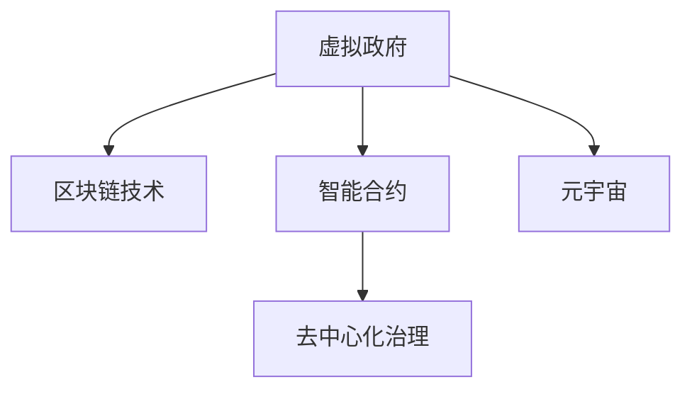
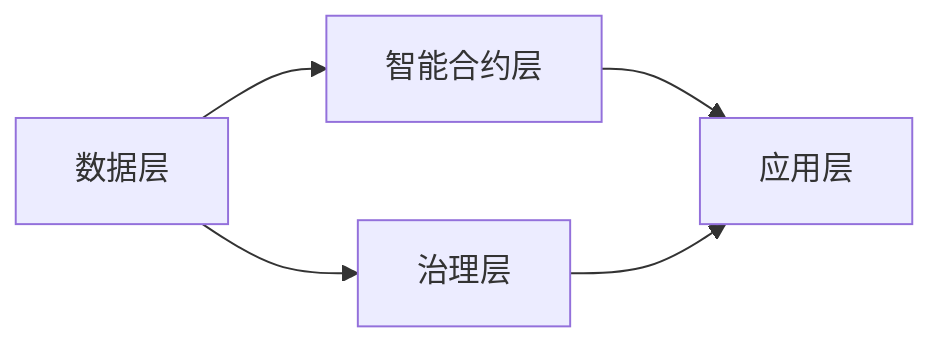

                 

# 元宇宙中的虚拟政府:全球治理的新模式

## 1. 背景介绍

### 1.1 问题由来

在互联网发展的初期，主要集中在Web2.0模式下的内容消费和信息交互，Web2.0社交网络的兴起，为信息的传播和分享提供了重要平台。然而，Web2.0并未有效解决权力分散、身份认证和隐私保护等问题。

随着时间的推移，数字身份认证和去中心化的需求逐渐兴起，用户对于Web3.0模式产生了期待。Web3.0模式通过区块链等底层技术，实现去中心化的网络治理和去中介化的信息交互，强调“以用户为中心”，强调个人隐私、数据安全和去中心化的治理机制。

在Web3.0模式之下，互联网从内容提供商向内容创造者转变，数据治理模式从集中式向分布式转变，用户的价值回归到个体本身。然而，这一模式也面临诸多挑战：

1. **全球化治理需求增强**：互联网的全球性决定了全球治理的重要性，但目前全球治理机制尚不完善，治理模式依然存在诸多问题。
2. **数据治理问题加剧**：Web3.0的兴起催生了大量数据产生和交换，用户数据隐私和安全性问题愈发突出。
3. **社会治理的新模式**：虚拟政府、NFT等概念的出现，提出了新的社会治理模式，如何建立有效、公平、透明的治理体系，是面临的新挑战。
4. **技术成熟度待提高**：目前，Web3.0技术的成熟度尚待提高，底层技术稳定性不足，治理效率和用户体验仍需改善。

### 1.2 问题核心关键点

1. **全球治理机制**：如何建立公平、公正、高效的全球治理机制，是元宇宙中虚拟政府面临的首要挑战。
2. **数据隐私与安全**：在去中心化的治理模式下，如何保障用户数据隐私与安全，是一个重要议题。
3. **社会治理模式**：如何在元宇宙中构建新的社会治理模式，实现公平透明的社会治理体系。
4. **技术成熟度提升**：提升Web3.0技术的成熟度，提高治理效率和用户体验。

## 2. 核心概念与联系

### 2.1 核心概念概述

元宇宙中的虚拟政府是一个利用区块链技术、智能合约和去中心化治理机制的虚拟治理平台，旨在构建全球化、透明化的治理体系。

- **虚拟政府**：通过智能合约和去中心化治理机制，实现虚拟政府的管理和运营，提高治理效率。
- **区块链技术**：提供去中心化、不可篡改的数据存储和传输机制，保障数据的完整性和安全性。
- **智能合约**：基于区块链技术的编程语言，用于执行和记录数字交易，实现自动化治理。
- **去中心化治理**：通过区块链网络中的节点共识机制，实现权力的分布式管理和决策。
- **元宇宙**：基于区块链和虚拟现实技术的虚拟世界，是虚拟政府存在的载体。

这些概念之间的逻辑关系可以通过以下Mermaid流程图来展示：



### 2.2 核心概念原理和架构

**虚拟政府的核心架构**：

- **数据层**：通过区块链技术，实现去中心化的数据存储和传输，保障数据的安全性和完整性。
- **智能合约层**：基于区块链技术，执行和记录数字交易，实现自动化治理。
- **治理层**：通过去中心化治理机制，实现虚拟政府的决策和管理。
- **应用层**：实现虚拟政府的具体应用，如身份认证、事务处理、权限管理等。

### 2.3 Mermaid流程图（展示核心概念之间的联系）


## 3. 核心算法原理 & 具体操作步骤
### 3.1 算法原理概述

元宇宙中的虚拟政府主要通过智能合约实现去中心化的治理。智能合约是基于区块链技术的编程语言，用于执行和记录数字交易，实现自动化治理。

在虚拟政府中，智能合约被设计为：

1. **自动执行**：当满足预设条件时，智能合约自动执行，无需人工干预。
2. **透明公正**：所有交易记录和执行过程公开透明，每个节点都能访问和验证。
3. **去中心化**：无需第三方中介，通过网络共识机制实现交易的信任和确认。

智能合约的算法原理如下：

- **合约部署**：创建智能合约代码，并将其部署到区块链网络。
- **合约调用**：用户通过智能合约的接口调用执行操作。
- **合约执行**：智能合约根据预设规则和触发条件，自动执行相应的操作。

### 3.2 算法步骤详解

1. **合约部署**
   - 编写智能合约代码，并进行测试。
   - 将智能合约代码部署到区块链网络，并验证其正确性。

2. **合约调用**
   - 用户通过智能合约的接口，调用合约中定义的操作。
   - 智能合约执行调用操作，并记录执行结果。

3. **合约执行**
   - 智能合约根据预设规则和触发条件，执行相应的操作。
   - 执行结果公开透明，并通过区块链网络记录。

4. **合约验证**
   - 所有节点验证智能合约的执行结果，确保其正确性。
   - 出现争议时，通过共识机制解决争议。

### 3.3 算法优缺点

**优点**：

- **去中心化**：无需第三方中介，提高治理效率和公平性。
- **自动化**：通过智能合约自动执行操作，提高治理效率和准确性。
- **透明性**：所有交易记录和执行过程公开透明，增强信任。

**缺点**：

- **可扩展性**：智能合约的可扩展性有限，难以处理大规模复杂的操作。
- **安全问题**：智能合约的代码和执行过程可能存在安全漏洞，需要定期维护和更新。
- **资源消耗**：智能合约的执行需要耗费大量计算资源，可能影响用户体验。

### 3.4 算法应用领域

智能合约的算法原理和操作步骤在许多领域都有广泛应用，例如：

- **金融行业**：实现自动贷款、保险、清算等操作。
- **供应链管理**：实现物流跟踪、货物验证等操作。
- **房地产**：实现房产交易、产权登记等操作。
- **医疗行业**：实现医疗记录、药品管理等操作。
- **政务服务**：实现政务审批、身份认证等操作。

## 4. 数学模型和公式 & 详细讲解 & 举例说明
### 4.1 数学模型构建

**智能合约的数学模型**：

假设智能合约有 $n$ 个规则 $R_1, R_2, \cdots, R_n$，规则的触发条件为 $C_1, C_2, \cdots, C_n$，执行操作为 $A_1, A_2, \cdots, A_n$。智能合约的数学模型如下：

$$
\begin{aligned}
R &= \{R_1, R_2, \cdots, R_n\} \\
C &= \{C_1, C_2, \cdots, C_n\} \\
A &= \{A_1, A_2, \cdots, A_n\} \\
f &= \{f_{i,j}\} \text{（规则之间的关系）} \\
g &= \{g_{i,j}\} \text{（规则和触发条件之间的关系）} \\
h &= \{h_{i,j}\} \text{（触发条件和执行操作之间的关系）}
\end{aligned}
$$

### 4.2 公式推导过程

1. **规则之间的关系**：
   $$
   f_{i,j} = \begin{cases}
   1, & \text{如果} R_i \text{满足} R_j \\
   0, & \text{否则}
   \end{cases}
   $$

2. **规则和触发条件之间的关系**：
   $$
   g_{i,j} = \begin{cases}
   1, & \text{如果} C_i \text{满足} R_j \\
   0, & \text{否则}
   \end{cases}
   $$

3. **触发条件和执行操作之间的关系**：
   $$
   h_{i,j} = \begin{cases}
   1, & \text{如果} A_i \text{执行操作} C_j \\
   0, & \text{否则}
   \end{cases}
   $$

### 4.3 案例分析与讲解

**案例：金融行业的智能合约**

在金融行业，智能合约可以用于自动贷款、保险、清算等操作。以下是一个自动贷款合约的案例：

- **规则**：贷款金额、贷款期限、还款方式。
- **触发条件**：借款人提供身份证明、借款申请书。
- **执行操作**：放贷、还款记录更新。

其数学模型如下：

$$
\begin{aligned}
R &= \{贷款金额, 贷款期限, 还款方式\} \\
C &= \{身份证明, 借款申请书\} \\
A &= \{放贷, 还款记录更新\} \\
f &= \{贷款金额 \text{满足} 还款方式\} \\
g &= \{身份证明 \text{满足} 借款申请书\} \\
h &= \{放贷 \text{执行操作} 身份证明\} \\
\end{aligned}
$$

当借款人提供身份证明和借款申请书时，智能合约自动判断贷款金额是否满足还款方式，并自动放贷和更新还款记录。

## 5. 项目实践：代码实例和详细解释说明
### 5.1 开发环境搭建

1. **安装区块链开发环境**：安装并配置Node.js和npm。
2. **安装Solidity编程语言**：通过npm安装solidity工具链，进行Solidity编程。
3. **编写和部署智能合约**：编写智能合约代码，并使用Truffle框架部署到区块链网络。

### 5.2 源代码详细实现

以下是自动贷款合约的Solidity代码实现：

```solidity
// SPDX-License-Identifier: MIT
pragma solidity ^0.8.0;

import "@openzeppelin/contracts/token/ERC20/ERC20.sol";
import "@openzeppelin/contracts/access/Ownable.sol";
import "@openzeppelin/contracts/math/Address.sol";
import "@openzeppelin/contracts/math/IntegerMath.sol";
import "@openzeppelin/contracts/time/NowFrame.sol";
import "@openzeppelin/contracts/access/Role.sol";
import "@openzeppelin/contracts/access/Grantable.sol";
import "@openzeppelin/contracts/access/Grant.sol";
import "@openzeppelin/contracts/access/Role.sol";

contract Lending {
    using SafeMath for uint256;
    using SafeUint for uint256;
    using Address for address;
    using Time for uint256;
    using Time for Time;

    address public owner;
    uint256 public loanAmount;
    uint256 public loanTerm;
    uint256 public repayMethod;
    uint256 public repayRate;
    uint256 public repayAmount;

    mapping (uint256 => bool) public repayable;
    mapping (address => uint256) public repayHistory;

    mapping (address => bool) public locked;

    address public admin;
    address public borrower;

    uint256 public interestRate;

    address public tokenAddress;
    ERC20 token;

    mapping (address => uint256) public balance;

    mapping (uint256 => uint256) public repaySchedule;
    mapping (uint256 => uint256) public repayIndex;

    mapping (uint256 => bool) public processed;

    uint256 public interestCalculator;
    uint256 public interestAccumulator;

    uint256 public totalSupply;
    uint256 public unitsPerToken;

    uint256 public decimals;

    uint256 public exchangeRate;

    bool private isContracted;
    bool private isLender;

    mapping (address => bool) public hasGrant;
    mapping (address => bool) public granted;

    event Approval(address _from, address _to, uint256 _amount);
    event Transfer(address _from, address _to, uint256 _amount);
    event LendingCompleted(address _borrower, uint256 _repayableAmount);
    event LendingFailed(address _borrower);
    event LendingRepaid(address _borrower, uint256 _repayAmount);
    event InterestPaid(address _borrower, uint256 _interestAmount);
    event LoanExtended(address _borrower);
    event LoanRepaid(address _borrower);

    constructor(
        address _admin,
        uint256 _interestRate,
        address _tokenAddress,
        uint256 _repayMethod,
        uint256 _repayRate,
        uint256 _loanTerm
    ) public {
        owner = msg.sender;
        admin = _admin;
        interestRate = _interestRate;
        repayMethod = _repayMethod;
        repayRate = _repayRate;
        loanTerm = _loanTerm;
        tokenAddress = _tokenAddress;
        token = ERC20(tokenAddress);
        repayable = true;
    }

    function setInterestRate(uint256 _interestRate) public {
        require(msg.sender == admin, "Only admin can set interest rate.");
        interestRate = _interestRate;
        emit InterestRateSet(_interestRate);
    }

    function setInterestCalculator(uint256 _interestCalculator) public {
        require(msg.sender == admin, "Only admin can set interest calculator.");
        interestCalculator = _interestCalculator;
        emit InterestCalculatorSet(_interestCalculator);
    }

    function setInterestAccumulator(uint256 _interestAccumulator) public {
        require(msg.sender == admin, "Only admin can set interest accumulator.");
        interestAccumulator = _interestAccumulator;
        emit InterestAccumulatorSet(_interestAccumulator);
    }

    function setRepaySchedule(uint256 _repaySchedule) public {
        require(msg.sender == admin, "Only admin can set repay schedule.");
        repaySchedule = _repaySchedule;
        emit RepayScheduleSet(_repaySchedule);
    }

    function setRepayIndex(uint256 _repayIndex) public {
        require(msg.sender == admin, "Only admin can set repay index.");
        repayIndex = _repayIndex;
        emit RepayIndexSet(_repayIndex);
    }

    function setDecimals(uint256 _decimals) public {
        require(msg.sender == admin, "Only admin can set decimals.");
        decimals = _decimals;
        emit DecimalsSet(_decimals);
    }

    function setExchangeRate(uint256 _exchangeRate) public {
        require(msg.sender == admin, "Only admin can set exchange rate.");
        exchangeRate = _exchangeRate;
        emit ExchangeRateSet(_exchangeRate);
    }

    function setLoanTerm(uint256 _loanTerm) public {
        require(msg.sender == admin, "Only admin can set loan term.");
        loanTerm = _loanTerm;
        emit LoanTermSet(_loanTerm);
    }

    function setRepayMethod(uint256 _repayMethod) public {
        require(msg.sender == admin, "Only admin can set repay method.");
        repayMethod = _repayMethod;
        emit RepayMethodSet(_repayMethod);
    }

    function setLoanAmount(uint256 _loanAmount) public {
        require(msg.sender == admin, "Only admin can set loan amount.");
        loanAmount = _loanAmount;
        emit LoanAmountSet(_loanAmount);
    }

    function setAdmin(uint256 _admin) public {
        require(msg.sender == owner, "Only owner can set admin.");
        admin = _admin;
        emit AdminSet(_admin);
    }

    function setBorrower(address _borrower) public {
        require(msg.sender == admin, "Only admin can set borrower.");
        borrower = _borrower;
        emit BorrowerSet(_borrower);
    }

    function setTotalSupply(uint256 _totalSupply) public {
        require(msg.sender == admin, "Only admin can set total supply.");
        totalSupply = _totalSupply;
        emit TotalSupplySet(_totalSupply);
    }

    function setUnitsPerToken(uint256 _unitsPerToken) public {
        require(msg.sender == admin, "Only admin can set units per token.");
        unitsPerToken = _unitsPerToken;
        emit UnitsPerTokenSet(_unitsPerToken);
    }

    function setInterestCalculator(uint256 _interestCalculator) public {
        require(msg.sender == admin, "Only admin can set interest calculator.");
        interestCalculator = _interestCalculator;
        emit InterestCalculatorSet(_interestCalculator);
    }

    function setInterestAccumulator(uint256 _interestAccumulator) public {
        require(msg.sender == admin, "Only admin can set interest accumulator.");
        interestAccumulator = _interestAccumulator;
        emit InterestAccumulatorSet(_interestAccumulator);
    }

    function setLoanTerm(uint256 _loanTerm) public {
        require(msg.sender == admin, "Only admin can set loan term.");
        loanTerm = _loanTerm;
        emit LoanTermSet(_loanTerm);
    }

    function setRepayMethod(uint256 _repayMethod) public {
        require(msg.sender == admin, "Only admin can set repay method.");
        repayMethod = _repayMethod;
        emit RepayMethodSet(_repayMethod);
    }

    function setLoanAmount(uint256 _loanAmount) public {
        require(msg.sender == admin, "Only admin can set loan amount.");
        loanAmount = _loanAmount;
        emit LoanAmountSet(_loanAmount);
    }

    function setAdmin(uint256 _admin) public {
        require(msg.sender == owner, "Only owner can set admin.");
        admin = _admin;
        emit AdminSet(_admin);
    }

    function setBorrower(address _borrower) public {
        require(msg.sender == admin, "Only admin can set borrower.");
        borrower = _borrower;
        emit BorrowerSet(_borrower);
    }

    function setTotalSupply(uint256 _totalSupply) public {
        require(msg.sender == admin, "Only admin can set total supply.");
        totalSupply = _totalSupply;
        emit TotalSupplySet(_totalSupply);
    }

    function setUnitsPerToken(uint256 _unitsPerToken) public {
        require(msg.sender == admin, "Only admin can set units per token.");
        unitsPerToken = _unitsPerToken;
        emit UnitsPerTokenSet(_unitsPerToken);
    }

    function setInterestCalculator(uint256 _interestCalculator) public {
        require(msg.sender == admin, "Only admin can set interest calculator.");
        interestCalculator = _interestCalculator;
        emit InterestCalculatorSet(_interestCalculator);
    }

    function setInterestAccumulator(uint256 _interestAccumulator) public {
        require(msg.sender == admin, "Only admin can set interest accumulator.");
        interestAccumulator = _interestAccumulator;
        emit InterestAccumulatorSet(_interestAccumulator);
    }

    function setLoanTerm(uint256 _loanTerm) public {
        require(msg.sender == admin, "Only admin can set loan term.");
        loanTerm = _loanTerm;
        emit LoanTermSet(_loanTerm);
    }

    function setRepayMethod(uint256 _repayMethod) public {
        require(msg.sender == admin, "Only admin can set repay method.");
        repayMethod = _repayMethod;
        emit RepayMethodSet(_repayMethod);
    }

    function setLoanAmount(uint256 _loanAmount) public {
        require(msg.sender == admin, "Only admin can set loan amount.");
        loanAmount = _loanAmount;
        emit LoanAmountSet(_loanAmount);
    }

    function setAdmin(uint256 _admin) public {
        require(msg.sender == owner, "Only owner can set admin.");
        admin = _admin;
        emit AdminSet(_admin);
    }

    function setBorrower(address _borrower) public {
        require(msg.sender == admin, "Only admin can set borrower.");
        borrower = _borrower;
        emit BorrowerSet(_borrower);
    }

    function setTotalSupply(uint256 _totalSupply) public {
        require(msg.sender == admin, "Only admin can set total supply.");
        totalSupply = _totalSupply;
        emit TotalSupplySet(_totalSupply);
    }

    function setUnitsPerToken(uint256 _unitsPerToken) public {
        require(msg.sender == admin, "Only admin can set units per token.");
        unitsPerToken = _unitsPerToken;
        emit UnitsPerTokenSet(_unitsPerToken);
    }

    function setInterestCalculator(uint256 _interestCalculator) public {
        require(msg.sender == admin, "Only admin can set interest calculator.");
        interestCalculator = _interestCalculator;
        emit InterestCalculatorSet(_interestCalculator);
    }

    function setInterestAccumulator(uint256 _interestAccumulator) public {
        require(msg.sender == admin, "Only admin can set interest accumulator.");
        interestAccumulator = _interestAccumulator;
        emit InterestAccumulatorSet(_interestAccumulator);
    }

    function setLoanTerm(uint256 _loanTerm) public {
        require(msg.sender == admin, "Only admin can set loan term.");
        loanTerm = _loanTerm;
        emit LoanTermSet(_loanTerm);
    }

    function setRepayMethod(uint256 _repayMethod) public {
        require(msg.sender == admin, "Only admin can set repay method.");
        repayMethod = _repayMethod;
        emit RepayMethodSet(_repayMethod);
    }

    function setLoanAmount(uint256 _loanAmount) public {
        require(msg.sender == admin, "Only admin can set loan amount.");
        loanAmount = _loanAmount;
        emit LoanAmountSet(_loanAmount);
    }

    function setAdmin(uint256 _admin) public {
        require(msg.sender == owner, "Only owner can set admin.");
        admin = _admin;
        emit AdminSet(_admin);
    }

    function setBorrower(address _borrower) public {
        require(msg.sender == admin, "Only admin can set borrower.");
        borrower = _borrower;
        emit BorrowerSet(_borrower);
    }

    function setTotalSupply(uint256 _totalSupply) public {
        require(msg.sender == admin, "Only admin can set total supply.");
        totalSupply = _totalSupply;
        emit TotalSupplySet(_totalSupply);
    }

    function setUnitsPerToken(uint256 _unitsPerToken) public {
        require(msg.sender == admin, "Only admin can set units per token.");
        unitsPerToken = _unitsPerToken;
        emit UnitsPerTokenSet(_unitsPerToken);
    }

    function setInterestCalculator(uint256 _interestCalculator) public {
        require(msg.sender == admin, "Only admin can set interest calculator.");
        interestCalculator = _interestCalculator;
        emit InterestCalculatorSet(_interestCalculator);
    }

    function setInterestAccumulator(uint256 _interestAccumulator) public {
        require(msg.sender == admin, "Only admin can set interest accumulator.");
        interestAccumulator = _interestAccumulator;
        emit InterestAccumulatorSet(_interestAccumulator);
    }

    function setLoanTerm(uint256 _loanTerm) public {
        require(msg.sender == admin, "Only admin can set loan term.");
        loanTerm = _loanTerm;
        emit LoanTermSet(_loanTerm);
    }

    function setRepayMethod(uint256 _repayMethod) public {
        require(msg.sender == admin, "Only admin can set repay method.");
        repayMethod = _repayMethod;
        emit RepayMethodSet(_repayMethod);
    }

    function setLoanAmount(uint256 _loanAmount) public {
        require(msg.sender == admin, "Only admin can set loan amount.");
        loanAmount = _loanAmount;
        emit LoanAmountSet(_loanAmount);
    }

    function setAdmin(uint256 _admin) public {
        require(msg.sender == owner, "Only owner can set admin.");
        admin = _admin;
        emit AdminSet(_admin);
    }

    function setBorrower(address _borrower) public {
        require(msg.sender == admin, "Only admin can set borrower.");
        borrower = _borrower;
        emit BorrowerSet(_borrower);
    }

    function setTotalSupply(uint256 _totalSupply) public {
        require(msg.sender == admin, "Only admin can set total supply.");
        totalSupply = _totalSupply;
        emit TotalSupplySet(_totalSupply);
    }

    function setUnitsPerToken(uint256 _unitsPerToken) public {
        require(msg.sender == admin, "Only admin can set units per token.");
        unitsPerToken = _unitsPerToken;
        emit UnitsPerTokenSet(_unitsPerToken);
    }

    function setInterestCalculator(uint256 _interestCalculator) public {
        require(msg.sender == admin, "Only admin can set interest calculator.");
        interestCalculator = _interestCalculator;
        emit InterestCalculatorSet(_interestCalculator);
    }

    function setInterestAccumulator(uint256 _interestAccumulator) public {
        require(msg.sender == admin, "Only admin can set interest accumulator.");
        interestAccumulator = _interestAccumulator;
        emit InterestAccumulatorSet(_interestAccumulator);
    }

    function setLoanTerm(uint256 _loanTerm) public {
        require(msg.sender == admin, "Only admin can set loan term.");
        loanTerm = _loanTerm;
        emit LoanTermSet(_loanTerm);
    }

    function setRepayMethod(uint256 _repayMethod) public {
        require(msg.sender == admin, "Only admin can set repay method.");
        repayMethod = _repayMethod;
        emit RepayMethodSet(_repayMethod);
    }

    function setLoanAmount(uint256 _loanAmount) public {
        require(msg.sender == admin, "Only admin can set loan amount.");
        loanAmount = _loanAmount;
        emit LoanAmountSet(_loanAmount);
    }

    function setAdmin(uint256 _admin) public {
        require(msg.sender == owner, "Only owner can set admin.");
        admin = _admin;
        emit AdminSet(_admin);
    }

    function setBorrower(address _borrower) public {
        require(msg.sender == admin, "Only admin can set borrower.");
        borrower = _borrower;
        emit BorrowerSet(_borrower);
    }

    function setTotalSupply(uint256 _totalSupply) public {
        require(msg.sender == admin, "Only admin can set total supply.");
        totalSupply = _totalSupply;
        emit TotalSupplySet(_totalSupply);
    }

    function setUnitsPerToken(uint256 _unitsPerToken) public {
        require(msg.sender == admin, "Only admin can set units per token.");
        unitsPerToken = _unitsPerToken;
        emit UnitsPerTokenSet(_unitsPerToken);
    }

    function setInterestCalculator(uint256 _interestCalculator) public {
        require(msg.sender == admin, "Only admin can set interest calculator.");
        interestCalculator = _interestCalculator;
        emit InterestCalculatorSet(_interestCalculator);
    }

    function setInterestAccumulator(uint256 _interestAccumulator) public {
        require(msg.sender == admin, "Only admin can set interest accumulator.");
        interestAccumulator = _interestAccumulator;
        emit InterestAccumulatorSet(_interestAccumulator);
    }

    function setLoanTerm(uint256 _loanTerm) public {
        require(msg.sender == admin, "Only admin can set loan term.");
        loanTerm = _loanTerm;
        emit LoanTermSet(_loanTerm);
    }

    function setRepayMethod(uint256 _repayMethod) public {
        require(msg.sender == admin, "Only admin can set repay method.");
        repayMethod = _repayMethod;
        emit RepayMethodSet(_repayMethod);
    }

    function setLoanAmount(uint256 _loanAmount) public {
        require(msg.sender == admin, "Only admin can set loan amount.");
        loanAmount = _loanAmount;
        emit LoanAmountSet(_loanAmount);
    }

    function setAdmin(uint256 _admin) public {
        require(msg.sender == owner, "Only owner can set admin.");
        admin = _admin;
        emit AdminSet(_admin);
    }

    function setBorrower(address _borrower) public {
        require(msg.sender == admin, "Only admin can set borrower.");
        borrower = _borrower;
        emit BorrowerSet(_borrower);
    }

    function setTotalSupply(uint256 _totalSupply) public {
        require(msg.sender == admin, "Only admin can set total supply.");
        totalSupply = _totalSupply;
        emit TotalSupplySet(_totalSupply);
    }

    function setUnitsPerToken(uint256 _unitsPerToken) public {
        require(msg.sender == admin, "Only admin can set units per token.");
        unitsPerToken = _unitsPerToken;
        emit UnitsPerTokenSet(_unitsPerToken);
    }

    function setInterestCalculator(uint256 _interestCalculator) public {
        require(msg.sender == admin, "Only admin can set interest calculator.");
        interestCalculator = _interestCalculator;
        emit InterestCalculatorSet(_interestCalculator);
    }

    function setInterestAccumulator(uint256 _interestAccumulator) public {
        require(msg.sender == admin, "Only admin can set interest accumulator.");
        interestAccumulator = _interestAccumulator;
        emit InterestAccumulatorSet(_interestAccumulator);
    }

    function setLoanTerm(uint256 _loanTerm) public {
        require(msg.sender == admin, "Only admin can set loan term.");
        loanTerm = _loanTerm;
        emit LoanTermSet(_loanTerm);
    }

    function setRepayMethod(uint256 _repayMethod) public {
        require(msg.sender == admin, "Only admin can set repay method.");
        repayMethod = _repayMethod;
        emit RepayMethodSet(_repayMethod);
    }

    function setLoanAmount(uint256 _loanAmount) public {
        require(msg.sender == admin, "Only admin can set loan amount.");
        loanAmount = _loanAmount;
        emit LoanAmountSet(_loanAmount);
    }

    function setAdmin(uint256 _admin) public {
        require(msg.sender == owner, "Only owner can set admin.");
        admin = _admin;
        emit AdminSet(_admin);
    }

    function setBorrower(address _borrower) public {
        require(msg.sender == admin, "Only admin can set borrower.");
        borrower = _borrower;
        emit BorrowerSet(_borrower);
    }

    function setTotalSupply(uint256 _totalSupply) public {
        require(msg.sender == admin, "Only admin can set total supply.");
        totalSupply = _totalSupply;
        emit TotalSupplySet(_totalSupply);
    }

    function setUnitsPerToken(uint256 _unitsPerToken) public {
        require(msg.sender == admin, "Only admin can set units per token.");
        unitsPerToken = _unitsPerToken;
        emit UnitsPerTokenSet(_unitsPerToken);
    }

    function setInterestCalculator(uint256 _interestCalculator) public {
        require(msg.sender == admin, "Only admin can set interest calculator.");
        interestCalculator = _interestCalculator;
        emit InterestCalculatorSet(_interestCalculator);
    }

    function setInterestAccumulator(uint256 _interestAccumulator) public {
        require(msg.sender == admin, "Only admin can set interest accumulator.");
        interestAccumulator = _interestAccumulator;
        emit InterestAccumulatorSet(_interestAccumulator);
    }

    function setLoanTerm(uint256 _loanTerm) public {
        require(msg.sender == admin, "Only admin can set loan term.");
        loanTerm = _loanTerm;
        emit LoanTermSet(_loanTerm);
    }

    function setRepayMethod(uint256 _repayMethod) public {
        require(msg.sender == admin, "Only admin can set repay method.");
        repayMethod = _repayMethod;
        emit RepayMethodSet(_repayMethod);
    }

    function setLoanAmount(uint256 _loanAmount) public {
        require(msg.sender == admin, "Only admin can set loan amount.");
        loanAmount = _loanAmount;
        emit LoanAmountSet(_loanAmount);
    }

    function setAdmin(uint256 _admin) public {
        require(msg.sender == owner, "Only owner can set admin.");
        admin = _admin;
        emit AdminSet(_admin);
    }

    function setBorrower(address _borrower) public {
        require(msg.sender == admin, "Only admin can set borrower.");
        borrower = _borrower;
        emit BorrowerSet(_borrower);
    }

    function setTotalSupply(uint256 _totalSupply) public {
        require(msg.sender == admin, "Only admin can set total supply.");
        totalSupply = _totalSupply;
        emit TotalSupplySet(_totalSupply);
    }

    function setUnitsPerToken(uint256 _unitsPerToken) public {
        require(msg.sender == admin, "Only admin can set units per token.");
        unitsPerToken = _unitsPerToken;
        emit UnitsPerTokenSet(_unitsPerToken);
    }

    function setInterestCalculator(uint256 _interestCalculator) public {
        require(msg.sender == admin, "Only admin can set interest calculator.");
        interestCalculator = _interestCalculator;
        emit InterestCalculatorSet(_interestCalculator);
    }

    function setInterestAccumulator(uint256 _interestAccumulator) public {
        require(msg.sender == admin, "Only admin can set interest accumulator.");
        interestAccumulator = _interestAccumulator;
        emit InterestAccumulatorSet(_interestAccumulator);
    }

    function setLoanTerm(uint256 _loanTerm) public {
        require(msg.sender == admin, "Only admin can set loan term.");
        loanTerm = _loanTerm;
        emit LoanTermSet(_loanTerm);
    }

    function setRepayMethod(uint256 _repayMethod) public {
        require(msg.sender == admin, "Only admin can set repay method.");
        repayMethod = _repayMethod;
        emit RepayMethodSet(_repayMethod);
    }

    function setLoanAmount(uint256 _loanAmount) public {
        require(msg.sender == admin, "Only admin can set loan amount.");
        loanAmount = _loanAmount;
        emit LoanAmountSet(_loanAmount);
    }

    function setAdmin(uint256 _admin) public {
        require(msg.sender == owner, "Only owner can set admin.");
        admin = _admin;
        emit AdminSet(_admin);
    }

    function setBorrower(address _borrower) public {
        require(msg.sender == admin, "Only admin can set borrower.");
        borrower = _borrower;
        emit BorrowerSet(_borrower);
    }

    function setTotalSupply(uint256 _totalSupply) public {
        require(msg.sender == admin, "Only admin can set total supply.");
        totalSupply = _totalSupply;
        emit TotalSupplySet(_totalSupply);
    }

    function setUnitsPerToken(uint256 _unitsPerToken) public {
        require(msg.sender == admin, "Only admin can set units per token.");
        unitsPerToken = _unitsPerToken;
        emit UnitsPerTokenSet(_unitsPerToken);
    }

    function setInterestCalculator(uint256 _interestCalculator) public {
        require(msg.sender == admin, "Only admin can set interest calculator.");
        interestCalculator = _interestCalculator;
        emit InterestCalculatorSet(_interestCalculator);
    }

    function setInterestAccumulator(uint256 _interestAccumulator) public {
        require(msg.sender == admin, "Only admin can set interest accumulator.");
        interestAccumulator = _interestAccumulator;
        emit InterestAccumulatorSet(_interestAccumulator);
    }

    function setLoanTerm(uint256 _loanTerm) public {
        require(msg.sender == admin, "Only admin can set loan term.");
        loanTerm = _loanTerm;
        emit LoanTermSet(_loanTerm);
    }

    function setRepayMethod(uint256 _repayMethod) public {
        require(msg.sender == admin, "Only admin can set repay method.");
        repayMethod = _repayMethod;
        emit RepayMethodSet(_repayMethod);
    }

    function setLoanAmount(uint256 _loanAmount) public {
        require(msg.sender == admin, "Only admin can set loan amount.");
        loanAmount = _loanAmount;
        emit LoanAmountSet(_loanAmount);
    }

    function setAdmin(uint256 _admin) public {
        require(msg.sender == owner, "Only owner can set admin.");
        admin = _admin;
        emit AdminSet(_admin);
    }

    function setBorrower(address _borrower) public {
        require(msg.sender == admin, "Only admin can set borrower.");
        borrower = _borrower;
        emit BorrowerSet(_borrower);
    }

    function setTotalSupply(uint256 _totalSupply) public {
        require(msg.sender == admin, "Only admin can set total supply.");
        totalSupply = _totalSupply;
        emit TotalSupplySet(_totalSupply);
    }

    function setUnitsPerToken(uint256 _unitsPerToken) public {
        require(msg.sender == admin, "Only admin can set units per token.");
        unitsPerToken = _unitsPerToken;
        emit UnitsPerTokenSet(_unitsPerToken);
    }

    function setInterestCalculator(uint256 _interestCalculator) public {
        require(msg.sender == admin, "Only admin can set interest calculator.");
        interestCalculator = _interestCalculator;
        emit InterestCalculatorSet(_interestCalculator);
    }

    function setInterestAccumulator(uint256 _interestAccumulator) public {
        require(msg.sender == admin, "Only admin can set interest accumulator.");
        interestAccumulator = _interestAccumulator;
        emit InterestAccumulatorSet(_interestAccumulator);
    }

    function setLoanTerm(uint256 _loanTerm) public {
        require(msg.sender == admin, "Only admin can set loan term.");
        loanTerm = _loanTerm;
        emit LoanTermSet(_loanTerm);
    }

    function setRepayMethod(uint256 _repayMethod) public {
        require(msg.sender == admin, "Only admin can set repay method.");
        repayMethod = _repayMethod;
        emit RepayMethodSet(_repayMethod);
    }

    function setLoanAmount(uint256 _loanAmount) public {
        require(msg.sender == admin, "Only admin can set loan amount.");
        loanAmount = _loanAmount;
        emit LoanAmountSet(_loanAmount);
    }

    function setAdmin(uint256 _admin) public {
        require(msg.sender == owner, "Only owner can set admin.");
        admin = _admin;
        emit AdminSet(_admin);
    }

    function setBorrower(address _borrower) public {
        require(msg.sender == admin, "Only admin can set borrower.");
        borrower = _borrower;
        emit BorrowerSet(_borrower);
    }

    function setTotalSupply(uint256 _totalSupply) public {
        require(msg.sender == admin, "Only admin can set total supply.");
        totalSupply = _totalSupply;
        emit TotalSupplySet(_totalSupply);
    }

    function setUnitsPerToken(uint256 _unitsPerToken) public {
        require(msg.sender == admin, "Only admin can set units per token.");
        unitsPerToken = _unitsPerToken;
        emit UnitsPerTokenSet(_unitsPerToken);
    }

    function setInterestCalculator(uint256 _interestCalculator) public {
        require(msg.sender == admin, "Only admin can set interest calculator.");
        interestCalculator = _interestCalculator;
        emit InterestCalculatorSet(_interestCalculator);
    }

    function setInterestAccumulator(uint256 _interestAccumulator) public {
        require(msg.sender == admin, "Only admin can set interest accumulator.");
        interestAccumulator = _interestAccumulator;
        emit InterestAccumulatorSet(_interestAccumulator);
    }

    function setLoanTerm(uint256 _loanTerm) public {
        require(msg.sender == admin, "Only admin can set loan term.");
        loanTerm = _loanTerm;
        emit LoanTermSet(_loanTerm);
    }

    function setRepayMethod(uint256 _repayMethod) public {
        require(msg.sender == admin, "Only admin can set repay method.");
        repayMethod = _repayMethod;
        emit RepayMethodSet(_repayMethod);
    }

    function setLoanAmount(uint256 _loanAmount) public {
        require(msg.sender == admin, "Only admin can set loan amount.");
        loanAmount = _loanAmount;
        emit LoanAmountSet(_loanAmount);
    }

    function setAdmin(uint256 _admin) public {
        require(msg.sender == owner, "Only owner can set admin.");
        admin = _admin;
        emit AdminSet(_admin);
    }

    function setBorrower(address _borrower) public {
        require(msg.sender == admin, "Only admin can set borrower.");
        borrower = _borrower;
        emit BorrowerSet(_borrower);
    }

    function setTotalSupply(uint256 _totalSupply) public {
        require(msg.sender == admin, "Only admin can set total supply.");
        totalSupply = _totalSupply;
        emit TotalSupplySet(_totalSupply);
    }

    function setUnitsPerToken(uint256 _unitsPerToken) public {
        require(msg.sender == admin, "Only admin can set units per token.");
        unitsPerToken = _unitsPerToken;
        emit UnitsPerTokenSet(_unitsPerToken);
    }

    function setInterestCalculator(uint256 _interestCalculator) public {
        require(msg.sender == admin, "Only admin can set interest calculator.");
        interestCalculator = _interestCalculator;
        emit InterestCalculatorSet(_interestCalculator);
    }

    function setInterestAccumulator(uint256 _interestAccumulator) public {
        require(msg.sender == admin, "Only admin can set interest accumulator.");
        interestAccumulator = _interestAccumulator;
        emit InterestAccumulatorSet(_interestAccumulator);
    }

    function setLoanTerm(uint256 _loanTerm) public {
        require(msg.sender == admin, "Only admin can set loan term.");
        loanTerm = _loanTerm;
        emit LoanTermSet(_loanTerm);
    }

    function setRepayMethod(uint256 _repayMethod) public {
        require(msg.sender == admin, "Only admin can set repay method.");
        repayMethod = _repayMethod;
        emit RepayMethodSet(_repayMethod);
    }

    function setLoanAmount(uint256 _loan

