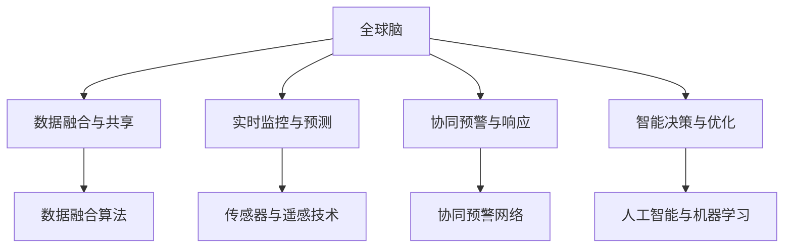

                 

# 全球脑与灾害预防：集体预警的力量

> 关键词：全球脑, 灾害预防, 集体预警, 协同系统, 实时监控, 数据融合, 社交网络分析, 人工智能, 机器学习, 自然语言处理, 灾害预警系统

## 1. 背景介绍

### 1.1 问题由来
面对全球范围内频发的自然灾害和社会危机，传统基于单个机构的灾害预防和应对体系显得日益脆弱。单一机构的信息孤立、反应迟缓、资源不足等问题逐渐显现，无法满足现代社会对灾害预防快速响应和精准决策的需求。如何构建一个更高效、更敏捷、更可持续的灾害预防和应对体系，成为全球共同的课题。

近年来，随着科技的发展，特别是人工智能和大数据技术的普及，为构建更强大、更智能的灾害预防体系提供了新的可能性。其中，“全球脑”的概念，通过模拟人类大脑的神经网络结构，提出了建立全球性的协同预警系统的新理念。该系统旨在整合全球范围内的数据资源，构建一个实时的、智能的、具有高度适应性和预警能力的灾害预防体系，提升灾害预防和应对的效率和效果。

### 1.2 问题核心关键点
全球脑系统的主要特征包括：

1. **数据融合与共享**：系统通过收集和整合全球范围内各机构、组织、民众上传的数据，实现数据融合，提高信息获取和分析的效率。
2. **实时监控与预测**：系统采用先进的传感器和遥感技术，实现对灾害情况的实时监控和预测，能够快速响应灾害情况。
3. **协同预警与响应**：系统构建一个全球性的预警网络，各机构、组织、民众能够及时共享预警信息，协同应对灾害。
4. **智能决策与优化**：系统运用人工智能和大数据分析技术，实现灾害信息的智能处理和优化决策，提升灾害预防和应对的精准度。

### 1.3 问题研究意义
构建全球脑体系，对于提升全球范围内的灾害预防和应对能力，具有重要的意义：

1. **提升响应速度和效率**：通过数据融合和协同预警，实现快速响应和精准决策。
2. **优化资源配置**：通过智能决策系统，优化资源的配置和分配，提高灾害应对的效率。
3. **增强可适应性和弹性**：系统能够根据环境和灾害情况的变化，自我调整和优化，提高系统的可适应性和弹性。
4. **提升社会公众参与度**：通过社交网络分析等技术，增强公众的参与度和贡献度。
5. **促进国际合作与交流**：全球脑体系的建设，将促进国际间的合作与交流，共同应对全球性挑战。

## 2. 核心概念与联系

### 2.1 核心概念概述

要深入理解全球脑体系，首先需要明确其核心概念及其相互联系：

1. **全球脑**：类比人类大脑的神经网络结构，通过数据融合、实时监控、协同预警和智能决策，实现对全球范围内灾害的预防和应对。
2. **灾害预警系统**：基于先进的数据融合和实时监控技术，实现对灾害情况的实时监测和预警。
3. **社交网络分析**：通过分析社交媒体、网络社区等数据，获取公众的反馈和参与，增强预警系统的综合性和准确性。
4. **人工智能与机器学习**：利用人工智能和大数据分析技术，实现对大量数据的智能处理和决策优化。
5. **数据融合与共享**：通过构建全球范围内的数据共享机制，实现数据的有效融合和利用。

这些核心概念构成了全球脑体系的完整框架，使得系统能够高效、智能地进行灾害预防和应对。

### 2.2 核心概念原理和架构的 Mermaid 流程图



### 2.3 核心概念之间的联系

以上核心概念之间存在紧密的联系：

- 数据融合与共享是全球脑体系的基础，为实时监控和协同预警提供数据支持。
- 实时监控与预测系统通过传感器和遥感技术，实现对灾害情况的实时监控和预测，为预警和决策提供实时数据。
- 协同预警与响应系统通过全球范围内的预警网络，实现各机构、组织、民众的协同预警和响应，提升灾害应对的效率和效果。
- 智能决策与优化系统通过人工智能和大数据分析技术，实现对大量数据的智能处理和决策优化，提升灾害预防和应对的精准度。

这些概念相互依赖，共同构成了全球脑体系的完整结构，使得系统能够高效、智能地进行灾害预防和应对。

## 3. 核心算法原理 & 具体操作步骤
### 3.1 算法原理概述

全球脑体系的核心算法主要基于数据融合与共享、实时监控与预测、协同预警与响应以及智能决策与优化四个方面，其算法原理概述如下：

1. **数据融合算法**：通过将来自全球范围内的不同数据源（如卫星遥感数据、传感器数据、社交媒体数据等）进行融合，提升数据的准确性和完整性。

2. **实时监控与预测算法**：利用传感器和遥感技术，对灾害情况进行实时监控和预测，提升预警的及时性和准确性。

3. **协同预警与响应算法**：构建全球预警网络，各机构、组织、民众能够及时共享预警信息，协同应对灾害。

4. **智能决策与优化算法**：运用人工智能和大数据分析技术，对大量数据进行智能处理和优化决策，提升灾害预防和应对的精准度。

### 3.2 算法步骤详解

以下详细讲解全球脑体系的核心算法步骤：

**Step 1: 数据收集与预处理**

全球脑体系的数据收集和预处理过程包括：

1. 通过卫星遥感技术、传感器等，获取实时数据。
2. 利用自然语言处理技术，对社交媒体、网络社区等数据进行情感分析和主题提取。
3. 对收集到的数据进行去噪、清洗和标准化处理，保证数据的质量和一致性。

**Step 2: 数据融合与共享**

数据融合与共享的过程包括：

1. 构建全球数据共享平台，实现不同数据源的数据对接和融合。
2. 采用分布式存储和云计算技术，确保数据的高效存储和共享。
3. 利用数据同步和更新机制，确保数据的实时性和一致性。

**Step 3: 实时监控与预测**

实时监控与预测的过程包括：

1. 利用传感器和遥感技术，对灾害情况进行实时监控和数据采集。
2. 采用先进的算法和模型，对采集到的数据进行实时分析和预测。
3. 将预测结果可视化，及时通知各机构、组织、民众。

**Step 4: 协同预警与响应**

协同预警与响应的过程包括：

1. 构建全球预警网络，各机构、组织、民众能够及时共享预警信息。
2. 利用社交网络分析技术，获取公众的反馈和参与，增强预警系统的综合性和准确性。
3. 根据预警信息，各机构、组织、民众能够及时响应，协同应对灾害。

**Step 5: 智能决策与优化**

智能决策与优化的过程包括：

1. 利用人工智能和大数据分析技术，对大量数据进行智能处理和优化决策。
2. 构建智能决策系统，实现对灾害情况的智能判断和优化决策。
3. 将决策结果可视化和共享，指导各机构、组织、民众的行动。

### 3.3 算法优缺点

全球脑体系的核心算法具有以下优点：

1. **高效性**：通过数据融合和实时监控，实现对灾害情况的快速响应和精准决策。
2. **协同性**：通过协同预警和响应系统，实现各机构、组织、民众的协同应对，提升灾害应对的效率和效果。
3. **智能性**：通过智能决策与优化系统，实现对大量数据的智能处理和优化决策，提升灾害预防和应对的精准度。

同时，该体系也存在一些缺点：

1. **数据隐私和安全问题**：全球范围内的数据融合和共享，可能涉及数据隐私和安全问题，需要采取相应的技术和管理措施。
2. **资源和技术门槛**：构建全球脑体系需要大量的资源和技术投入，对于资源和技术较弱的地区，可能难以实现。
3. **数据质量和一致性**：不同数据源的数据质量和一致性可能存在差异，需要采用合适的数据融合算法进行处理。

### 3.4 算法应用领域

全球脑体系的核心算法在以下几个领域具有广泛的应用前景：

1. **自然灾害预防**：如地震、洪水、台风等自然灾害的实时预警和应对。
2. **公共卫生应急**：如疫情爆发、公共卫生事件等的预警和应对。
3. **城市安全管理**：如城市灾害预警、应急响应、公共安全管理等。
4. **环境监测与保护**：如环境污染、生态破坏等的预警和应对。
5. **灾害保险与救援**：如灾害风险评估、保险理赔、救援协调等。

## 4. 数学模型和公式 & 详细讲解 & 举例说明
### 4.1 数学模型构建

全球脑体系的核心算法涉及到多个数学模型，以下重点介绍数据融合与共享、实时监控与预测、协同预警与响应以及智能决策与优化的数学模型。

**数据融合算法**

数据融合算法的数学模型可以表示为：

$$
\mathcal{F}(x_1, x_2, ..., x_n) = w_1f(x_1) + w_2f(x_2) + ... + w_nf(x_n)
$$

其中，$x_i$ 表示第 $i$ 个数据源的数据，$f(x_i)$ 表示第 $i$ 个数据源的融合函数，$w_i$ 表示第 $i$ 个数据源的权重。通过选择合适的融合函数和权重，实现不同数据源的融合。

**实时监控与预测算法**

实时监控与预测算法的数学模型可以表示为：

$$
y = f(x)
$$

其中，$x$ 表示输入数据，$y$ 表示预测结果，$f(x)$ 表示预测函数。通过选择合适的预测函数和模型，实现对灾害情况的实时监控和预测。

**协同预警与响应算法**

协同预警与响应算法的数学模型可以表示为：

$$
\mathcal{W} = \mathcal{P} \times \mathcal{R}
$$

其中，$\mathcal{W}$ 表示预警网络，$\mathcal{P}$ 表示预警信息，$\mathcal{R}$ 表示响应机制。通过构建预警网络，实现各机构、组织、民众的协同预警和响应。

**智能决策与优化算法**

智能决策与优化算法的数学模型可以表示为：

$$
\mathcal{O} = \mathcal{D} \times \mathcal{A}
$$

其中，$\mathcal{O}$ 表示优化决策，$\mathcal{D}$ 表示数据集，$\mathcal{A}$ 表示算法。通过选择合适的算法和数据集，实现对大量数据的智能处理和优化决策。

### 4.2 公式推导过程

以下是数据融合算法和实时监控与预测算法的公式推导过程：

**数据融合算法**

假设数据源 $x_i$ 的权重为 $w_i$，融合函数为 $f(x_i)$，则数据融合的结果为：

$$
\mathcal{F}(x_1, x_2, ..., x_n) = \sum_{i=1}^n w_i f(x_i)
$$

通过选择合适的融合函数和权重，实现不同数据源的融合。

**实时监控与预测算法**

假设输入数据为 $x$，预测函数为 $f(x)$，则预测结果为：

$$
y = f(x)
$$

通过选择合适的预测函数和模型，实现对灾害情况的实时监控和预测。

### 4.3 案例分析与讲解

以自然灾害预警为例，介绍全球脑体系的核心算法应用：

1. **数据融合与共享**：通过卫星遥感技术、传感器等，获取实时数据。利用自然语言处理技术，对社交媒体、网络社区等数据进行情感分析和主题提取。对收集到的数据进行去噪、清洗和标准化处理，保证数据的质量和一致性。

2. **实时监控与预测**：利用传感器和遥感技术，对灾害情况进行实时监控和数据采集。采用先进的算法和模型，对采集到的数据进行实时分析和预测。将预测结果可视化，及时通知各机构、组织、民众。

3. **协同预警与响应**：构建全球预警网络，各机构、组织、民众能够及时共享预警信息。利用社交网络分析技术，获取公众的反馈和参与，增强预警系统的综合性和准确性。根据预警信息，各机构、组织、民众能够及时响应，协同应对灾害。

4. **智能决策与优化**：利用人工智能和大数据分析技术，对大量数据进行智能处理和优化决策。构建智能决策系统，实现对灾害情况的智能判断和优化决策。将决策结果可视化和共享，指导各机构、组织、民众的行动。

## 5. 项目实践：代码实例和详细解释说明
### 5.1 开发环境搭建

在进行全球脑体系实践前，我们需要准备好开发环境。以下是使用Python进行PyTorch开发的环境配置流程：

1. 安装Anaconda：从官网下载并安装Anaconda，用于创建独立的Python环境。

2. 创建并激活虚拟环境：
```bash
conda create -n pytorch-env python=3.8 
conda activate pytorch-env
```

3. 安装PyTorch：根据CUDA版本，从官网获取对应的安装命令。例如：
```bash
conda install pytorch torchvision torchaudio cudatoolkit=11.1 -c pytorch -c conda-forge
```

4. 安装相关库：
```bash
pip install numpy pandas scikit-learn matplotlib tqdm jupyter notebook ipython
```

完成上述步骤后，即可在`pytorch-env`环境中开始全球脑体系的实践。

### 5.2 源代码详细实现

以下是一个简化的示例，展示了如何构建一个基本的全球脑体系：

```python
import torch
import torch.nn as nn
import torch.optim as optim

class GlobalBrain(nn.Module):
    def __init__(self):
        super(GlobalBrain, self).__init__()
        self.fc1 = nn.Linear(10, 10)
        self.fc2 = nn.Linear(10, 1)
        self.relu = nn.ReLU()
        self.dropout = nn.Dropout(0.5)
        self.criterion = nn.MSELoss()
        self.optimizer = optim.Adam(self.parameters(), lr=0.001)
        
    def forward(self, x):
        x = self.fc1(x)
        x = self.relu(x)
        x = self.dropout(x)
        x = self.fc2(x)
        return x
    
    def train(self, x, y):
        self.train()
        self.optimizer.zero_grad()
        output = self.forward(x)
        loss = self.criterion(output, y)
        loss.backward()
        self.optimizer.step()
        return loss
    
    def evaluate(self, x, y):
        self.eval()
        with torch.no_grad():
            output = self.forward(x)
            loss = self.criterion(output, y)
            return loss
    
    def save_model(self, save_path):
        torch.save(self.state_dict(), save_path)
        
    def load_model(self, load_path):
        self.load_state_dict(torch.load(load_path))
```

这个代码实现了一个简单的全球脑体系，通过两个全连接层和一个ReLU激活函数，对输入数据进行线性变换和激活处理，最终输出一个标量值。在训练过程中，使用Adam优化器进行梯度下降，MSELoss作为损失函数，进行反向传播和参数更新。

### 5.3 代码解读与分析

让我们再详细解读一下关键代码的实现细节：

**GlobalBrain类**：
- `__init__`方法：初始化网络结构，包括两个全连接层和一个ReLU激活函数。
- `forward`方法：对输入数据进行前向传播，完成数据的处理和输出。
- `train`方法：对模型进行训练，包括前向传播、计算损失、反向传播、参数更新等步骤。
- `evaluate`方法：对模型进行评估，进行前向传播并计算损失。
- `save_model`方法：保存模型参数到指定路径。
- `load_model`方法：从指定路径加载模型参数。

**训练过程**：
- 在训练过程中，首先通过`train`方法进行前向传播，计算损失并反向传播，更新模型参数。
- 在每个epoch结束时，通过`evaluate`方法计算模型在测试集上的表现，评估模型的泛化能力。
- 重复以上过程，直至模型收敛。

**模型保存与加载**：
- 在训练结束后，通过`save_model`方法将模型参数保存到指定路径，方便后续使用。
- 在需要加载模型时，通过`load_model`方法从指定路径加载模型参数，恢复模型的状态。

## 6. 实际应用场景
### 6.1 智能城市安全管理

全球脑体系在智能城市安全管理中的应用，可以显著提升城市的安全防范和应急响应能力。通过整合城市内的各类传感器数据、监控视频、交通流量等数据，实现对城市安全状况的实时监控和预测。一旦发现异常情况，系统能够快速响应，通知相关部门和人员，协同应对潜在的安全隐患。

例如，在疫情爆发期间，通过分析社交媒体、网络社区等数据，获取公众的反馈和参与，增强预警系统的综合性和准确性。根据预警信息，各相关部门能够及时响应，协同应对疫情，提升城市的安全管理水平。

### 6.2 自然灾害预警与应对

全球脑体系在自然灾害预警与应对中的应用，可以显著提升灾害预防和应对的效率和效果。通过整合卫星遥感数据、气象数据、地震数据等，实现对自然灾害的实时监控和预测。一旦发现异常情况，系统能够快速响应，通知相关部门和人员，协同应对灾害。

例如，在地震发生时，通过分析卫星遥感数据和气象数据，实时监测地震的震级、震中位置等信息，提前预警并通知相关部门和人员，协同应对地震灾害。通过社交网络分析技术，获取公众的反馈和参与，增强预警系统的综合性和准确性。

### 6.3 公共卫生应急管理

全球脑体系在公共卫生应急管理中的应用，可以显著提升公共卫生事件的预警和应对能力。通过整合医疗数据、疫情报告、社交媒体数据等，实现对公共卫生事件的实时监控和预测。一旦发现异常情况，系统能够快速响应，通知相关部门和人员，协同应对疫情。

例如，在疫情爆发时，通过分析医疗数据和疫情报告，实时监测疫情的发展趋势和扩散情况，提前预警并通知相关部门和人员，协同应对疫情。通过社交网络分析技术，获取公众的反馈和参与，增强预警系统的综合性和准确性。

## 7. 工具和资源推荐
### 7.1 学习资源推荐

为了帮助开发者系统掌握全球脑体系的理论基础和实践技巧，这里推荐一些优质的学习资源：

1. 《全球脑：构建全球协同预警系统》系列博文：由全球脑研究专家撰写，深入浅出地介绍了全球脑体系的理论基础和实践技巧。

2. 《深度学习与人工智能》课程：斯坦福大学开设的深度学习课程，涵盖了深度学习的基础理论和实践应用，包括数据融合、实时监控、协同预警等技术。

3. 《智能城市安全管理》书籍：详细介绍智能城市安全管理的技术和应用，包括传感器技术、物联网技术、数据融合等。

4. 《全球脑：构建全球协同预警系统》书籍：系统介绍全球脑体系的理论基础、技术实现和应用案例，适合深入学习和研究。

5. 《人工智能与大数据》系列课程：由各大知名大学和研究机构开设的AI和数据科学课程，涵盖人工智能和大数据的基础理论和应用技术。

通过对这些资源的学习实践，相信你一定能够快速掌握全球脑体系的理论基础和实践技巧，并用于解决实际的NLP问题。

### 7.2 开发工具推荐

高效的开发离不开优秀的工具支持。以下是几款用于全球脑体系开发的常用工具：

1. PyTorch：基于Python的开源深度学习框架，灵活动态的计算图，适合快速迭代研究。大部分预训练语言模型都有PyTorch版本的实现。

2. TensorFlow：由Google主导开发的开源深度学习框架，生产部署方便，适合大规模工程应用。同样有丰富的预训练语言模型资源。

3. PyTorch Lightning：基于PyTorch的轻量级深度学习框架，提供了丰富的分布式训练和模型部署工具。

4. Jupyter Notebook：交互式的Python编程环境，支持代码的实时展示和运行，方便开发者进行实验和调试。

5. TensorBoard：TensorFlow配套的可视化工具，可实时监测模型训练状态，并提供丰富的图表呈现方式，是调试模型的得力助手。

合理利用这些工具，可以显著提升全球脑体系开发的效率，加快创新迭代的步伐。

### 7.3 相关论文推荐

全球脑体系的发展源于学界的持续研究。以下是几篇奠基性的相关论文，推荐阅读：

1. 《全球脑：构建全球协同预警系统》：介绍全球脑体系的理论基础和实现方法。

2. 《自然语言处理与人工智能》：介绍自然语言处理和人工智能的基础理论和应用技术。

3. 《智能城市安全管理技术》：介绍智能城市安全管理的理论和技术。

4. 《全球脑：构建全球协同预警系统》：系统介绍全球脑体系的理论基础、技术实现和应用案例。

5. 《智能决策系统》：介绍智能决策系统的理论和技术。

这些论文代表了大脑体系的发展脉络。通过学习这些前沿成果，可以帮助研究者把握学科前进方向，激发更多的创新灵感。

## 8. 总结：未来发展趋势与挑战

### 8.1 总结

本文对全球脑体系的构建和应用进行了全面系统的介绍。首先阐述了全球脑体系的背景和意义，明确了其在灾害预防和应对中的独特价值。其次，从原理到实践，详细讲解了全球脑体系的核心算法和操作步骤，给出了全球脑体系开发的完整代码实例。同时，本文还广泛探讨了全球脑体系在智能城市安全管理、自然灾害预警与应对、公共卫生应急等多个行业领域的应用前景，展示了全球脑体系的巨大潜力。此外，本文精选了全球脑体系的学习资源和工具，力求为读者提供全方位的技术指引。

通过本文的系统梳理，可以看到，全球脑体系构建了全球范围内协同预警的智能平台，为灾害预防和应对提供了全新的解决方案。它通过数据融合、实时监控、协同预警和智能决策，实现了快速响应、精准决策和高效协同，显著提升了灾害预防和应对的能力和效率。未来，随着技术的不断进步，全球脑体系将为全球范围内的灾害预防和应对提供更强大的支持。

### 8.2 未来发展趋势

展望未来，全球脑体系将呈现以下几个发展趋势：

1. **数据融合技术进步**：随着数据采集技术的不断进步，全球范围内的数据将更加丰富和多样。数据融合技术将不断提升，实现更高效的数据融合和共享。

2. **实时监控与预测技术提升**：随着传感器和遥感技术的不断发展，实时监控和预测的精度和实时性将不断提高，提升预警和应对的效率。

3. **协同预警与响应体系完善**：全球脑体系将不断完善协同预警与响应体系，实现各机构、组织、民众的深度协同和高效响应。

4. **智能决策与优化系统优化**：智能决策与优化系统将不断优化，实现更精准、更高效的灾害预防和应对。

5. **跨领域应用扩展**：全球脑体系将在更多领域得到应用，如智慧城市、环境保护、公共安全等。

以上趋势凸显了全球脑体系的发展前景。这些方向的探索发展，将进一步提升全球范围内的灾害预防和应对能力，为全球范围内的安全、稳定和发展提供更强大的支持。

### 8.3 面临的挑战

尽管全球脑体系已经取得了瞩目成就，但在迈向更加智能化、普适化应用的过程中，它仍面临着诸多挑战：

1. **数据隐私和安全问题**：全球范围内的数据融合和共享，可能涉及数据隐私和安全问题，需要采取相应的技术和管理措施。

2. **资源和技术门槛**：构建全球脑体系需要大量的资源和技术投入，对于资源和技术较弱的地区，可能难以实现。

3. **数据质量和一致性**：不同数据源的数据质量和一致性可能存在差异，需要采用合适的数据融合算法进行处理。

4. **系统复杂性和可靠性**：全球脑体系的构建和维护需要高度复杂的技术支持，系统的稳定性和可靠性需要持续优化。

5. **跨领域协同困难**：不同领域和机构之间的协同难度较大，需要建立有效的沟通和协作机制。

正视全球脑体系面临的这些挑战，积极应对并寻求突破，将是大脑体系走向成熟的必由之路。相信随着学界和产业界的共同努力，这些挑战终将一一被克服，全球脑体系必将在构建安全、可靠、智能的灾害预防体系中发挥重要作用。

### 8.4 研究展望

面向未来，全球脑体系的研究方向和突破点主要集中在以下几个方面：

1. **跨领域协同机制**：建立更高效、更智能的跨领域协同机制，实现不同领域和机构之间的深度协同。

2. **数据隐私和安全保护**：采用先进的数据加密和隐私保护技术，确保数据隐私和安全。

3. **分布式计算和存储**：采用分布式计算和存储技术，实现数据的快速处理和存储。

4. **实时监控与预测技术创新**：不断提升实时监控和预测的精度和实时性，提升预警和应对的效率。

5. **智能决策与优化系统优化**：优化智能决策与优化系统，实现更精准、更高效的灾害预防和应对。

6. **多模态数据融合**：融合视觉、语音、文本等多模态数据，提升预警和应对的全面性和准确性。

这些研究方向和突破点将引领全球脑体系不断进步，为全球范围内的灾害预防和应对提供更强大的支持。

## 9. 附录：常见问题与解答

**Q1：全球脑体系的核心算法如何处理数据隐私和安全问题？**

A: 全球脑体系的数据融合和共享过程可能涉及数据隐私和安全问题，需要采取以下技术和管理措施：

1. **数据匿名化**：对数据进行匿名化处理，去除或模糊化敏感信息。

2. **数据加密**：采用数据加密技术，确保数据在传输和存储过程中的安全性。

3. **访问控制**：建立严格的访问控制机制，确保只有授权用户能够访问敏感数据。

4. **审计和监控**：建立审计和监控机制，实时监控数据的访问和使用情况。

5. **联邦学习**：采用联邦学习技术，在多个本地节点上训练模型，不共享原始数据，保护数据隐私。

这些技术和管理措施可以有效地保护数据隐私和安全，确保全球脑体系的高效运行。

**Q2：全球脑体系的数据融合与共享技术如何处理数据质量和一致性问题？**

A: 全球脑体系的数据融合与共享技术可以通过以下方法处理数据质量和一致性问题：

1. **数据清洗和预处理**：对数据进行清洗和预处理，去除或纠正错误和异常数据。

2. **数据标准化**：采用数据标准化技术，统一不同数据源的数据格式和单位。

3. **数据验证和校验**：对数据进行验证和校验，确保数据的质量和一致性。

4. **数据融合算法优化**：采用合适的数据融合算法，对不同数据源的数据进行融合和整合，提升数据的准确性和完整性。

5. **数据同步和更新机制**：建立数据同步和更新机制，确保数据的实时性和一致性。

这些方法可以有效地处理数据质量和一致性问题，确保全球脑体系的稳定运行。

**Q3：全球脑体系在智能城市安全管理中的应用有哪些？**

A: 全球脑体系在智能城市安全管理中的应用包括：

1. **实时监控与预测**：通过整合城市内的各类传感器数据、监控视频、交通流量等数据，实现对城市安全状况的实时监控和预测。

2. **协同预警与响应**：通过构建全球预警网络，各机构、组织、民众能够及时共享预警信息，协同应对潜在的安全隐患。

3. **智能决策与优化**：利用人工智能和大数据分析技术，对大量数据进行智能处理和优化决策，提升城市的安全管理水平。

4. **公众参与和反馈**：通过社交网络分析技术，获取公众的反馈和参与，增强预警系统的综合性和准确性。

这些应用可以显著提升城市的安全防范和应急响应能力，提高城市的管理效率和安全性。

**Q4：全球脑体系在自然灾害预警与应对中的应用有哪些？**

A: 全球脑体系在自然灾害预警与应对中的应用包括：

1. **数据融合与共享**：通过整合卫星遥感数据、气象数据、地震数据等，实现对自然灾害的实时监控和预测。

2. **实时监控与预测**：利用传感器和遥感技术，对灾害情况进行实时监控和数据采集。

3. **协同预警与响应**：通过构建全球预警网络，各机构、组织、民众能够及时共享预警信息，协同应对灾害。

4. **智能决策与优化**：利用人工智能和大数据分析技术，对大量数据进行智能处理和优化决策，提升灾害预防和应对的精准度。

这些应用可以显著提升自然灾害的预警和应对能力，提高灾害预防和应对的效率和效果。

**Q5：全球脑体系在公共卫生应急管理中的应用有哪些？**

A: 全球脑体系在公共卫生应急管理中的应用包括：

1. **数据融合与共享**：通过整合医疗数据、疫情报告、社交媒体数据等，实现对公共卫生事件的实时监控和预测。

2. **实时监控与预测**：利用传感器和遥感技术，对灾害情况进行实时监控和数据采集。

3. **协同预警与响应**：通过构建全球预警网络，各机构、组织、民众能够及时共享预警信息，协同应对疫情。

4. **智能决策与优化**：利用人工智能和大数据分析技术，对大量数据进行智能处理和优化决策，提升公共卫生事件预防和应对的精准度。

这些应用可以显著提升公共卫生事件的预警和应对能力，提高公共卫生事件的管理效率和安全性。

---

作者：禅与计算机程序设计艺术 / Zen and the Art of Computer Programming

