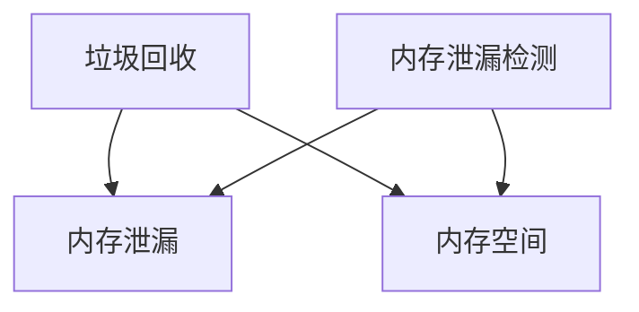
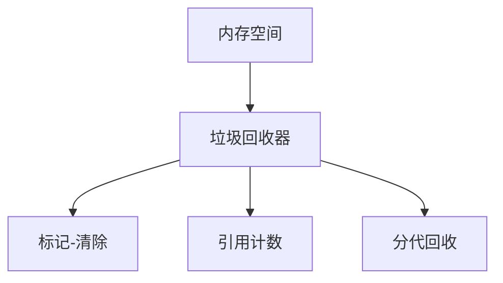

                 

## 1. 背景介绍

### 1.1 问题由来

在现代软件开发中，内存管理是一个至关重要的话题。随着程序的复杂性增加，内存管理变得越来越困难。垃圾回收和内存泄漏检测是现代内存管理的两大技术手段，它们可以帮助程序员避免内存泄漏问题，提高程序的稳定性和性能。然而，在实际应用中，这两项技术仍然存在一些挑战和限制。

### 1.2 问题核心关键点

为了更好地理解垃圾回收和内存泄漏检测，本节将介绍几个密切相关的核心概念：

- 垃圾回收（Garbage Collection）：自动管理内存，释放不再使用的内存空间，防止内存泄漏。
- 内存泄漏（Memory Leak）：程序在运行过程中申请内存但未能及时释放，导致内存空间无法被重复使用，最终导致系统崩溃或运行缓慢。
- 内存泄漏检测（Memory Leak Detection）：一种动态分析技术，用于检测程序中内存泄漏的发生情况，并定位具体内存泄漏的位置。
- 垃圾回收算法（Garbage Collection Algorithm）：实现垃圾回收的具体算法，如标记-清除、引用计数、分代回收等。

这些核心概念之间的逻辑关系可以通过以下Mermaid流程图来展示：



这个流程图展示了大语言模型的核心概念及其之间的关系：

1. 垃圾回收是自动管理内存，释放不再使用的内存空间，防止内存泄漏。
2. 内存泄漏是程序在运行过程中申请内存但未能及时释放，导致内存空间无法被重复使用，最终导致系统崩溃或运行缓慢。
3. 内存泄漏检测是一种动态分析技术，用于检测程序中内存泄漏的发生情况，并定位具体内存泄漏的位置。
4. 垃圾回收算法是实现垃圾回收的具体算法，如标记-清除、引用计数、分代回收等。

这些概念共同构成了现代内存管理的基础，有助于理解垃圾回收和内存泄漏检测的原理和实现。

## 2. 核心概念与联系

### 2.1 核心概念概述

为了更好地理解垃圾回收和内存泄漏检测，本节将详细介绍一些核心概念的原理和实现。

- 垃圾回收（Garbage Collection）：自动管理内存，释放不再使用的内存空间，防止内存泄漏。
- 内存泄漏（Memory Leak）：程序在运行过程中申请内存但未能及时释放，导致内存空间无法被重复使用，最终导致系统崩溃或运行缓慢。
- 内存泄漏检测（Memory Leak Detection）：一种动态分析技术，用于检测程序中内存泄漏的发生情况，并定位具体内存泄漏的位置。
- 垃圾回收算法（Garbage Collection Algorithm）：实现垃圾回收的具体算法，如标记-清除、引用计数、分代回收等。

### 2.2 核心概念原理和架构的 Mermaid 流程图



这个流程图展示了大语言模型的核心概念及其之间的联系：

1. 内存空间是程序运行过程中申请的内存，存储程序的执行数据和对象。
2. 垃圾回收器是负责自动管理内存的机制，通过垃圾回收算法释放不再使用的内存空间。
3. 标记-清除算法、引用计数算法、分代回收算法都是垃圾回收算法的一种实现方式，用于标记和清除不再使用的内存空间。

这些核心概念和算法构成了现代内存管理的基础，有助于理解垃圾回收和内存泄漏检测的原理和实现。

## 3. 核心算法原理 & 具体操作步骤

### 3.1 算法原理概述

垃圾回收和内存泄漏检测是现代内存管理的两大技术手段，它们可以帮助程序员避免内存泄漏问题，提高程序的稳定性和性能。然而，在实际应用中，这两项技术仍然存在一些挑战和限制。

### 3.2 算法步骤详解

- 垃圾回收器
  - 分配器（Allocator）：负责分配内存空间。
  - 垃圾回收器（Garbage Collector）：通过标记-清除算法、引用计数算法、分代回收算法等实现垃圾回收，释放不再使用的内存空间。

- 内存泄漏检测
  - 静态分析：通过静态分析工具分析代码逻辑，定位内存泄漏的位置。
  - 动态分析：通过动态分析工具运行程序，检测内存泄漏的发生情况，并定位具体内存泄漏的位置。

### 3.3 算法优缺点

垃圾回收和内存泄漏检测的优点：

- 自动管理内存，避免手动释放内存。
- 动态分析内存使用情况，避免内存泄漏。

缺点：

- 动态分析可能影响程序性能。
- 静态分析可能无法检测到所有内存泄漏。

### 3.4 算法应用领域

垃圾回收和内存泄漏检测广泛应用于各种编程语言和操作系统中，如Java、C#、Python、Linux、Windows等。

- Java：使用JVM进行垃圾回收，自动管理内存。
- C#：使用.NET运行时进行垃圾回收，自动管理内存。
- Python：使用CPython、Jython等解释器进行垃圾回收，自动管理内存。
- Linux：使用内核级垃圾回收机制进行内存管理。
- Windows：使用内核级垃圾回收机制进行内存管理。

## 4. 数学模型和公式 & 详细讲解 & 举例说明

### 4.1 数学模型构建

垃圾回收和内存泄漏检测的数学模型可以通过以下公式来描述：

1. 垃圾回收模型

   $$
   G(t) = \sum_{i=1}^n \frac{R_i(t)}{S(t)}
   $$

   其中，$G(t)$ 是垃圾数量，$R_i(t)$ 是第 $i$ 个对象的引用数量，$S(t)$ 是当前内存空间的大小。

2. 内存泄漏模型

   $$
   L(t) = \sum_{i=1}^n \frac{R_i(t)}{S(t)} - G(t)
   $$

   其中，$L(t)$ 是内存泄漏数量，$R_i(t)$ 是第 $i$ 个对象的引用数量，$S(t)$ 是当前内存空间的大小，$G(t)$ 是垃圾数量。

### 4.2 公式推导过程

垃圾回收和内存泄漏检测的公式推导过程如下：

1. 垃圾回收模型

   垃圾回收模型通过标记-清除算法、引用计数算法、分代回收算法等实现垃圾回收，释放不再使用的内存空间。公式中的 $R_i(t)$ 是第 $i$ 个对象的引用数量，$S(t)$ 是当前内存空间的大小。当 $R_i(t) = 0$ 时，对象 $i$ 被标记为垃圾，$G(t)$ 增加 1。

2. 内存泄漏模型

   内存泄漏模型通过计算内存泄漏数量，定位具体内存泄漏的位置。公式中的 $L(t)$ 是内存泄漏数量，$R_i(t)$ 是第 $i$ 个对象的引用数量，$S(t)$ 是当前内存空间的大小，$G(t)$ 是垃圾数量。当 $R_i(t) > 0$ 且 $R_i(t) = S(t)$ 时，对象 $i$ 未被释放，$L(t)$ 增加 1。

### 4.3 案例分析与讲解

下面以Java程序为例，分析垃圾回收和内存泄漏检测的实现。

```java
public class Example {
    public static void main(String[] args) {
        String[] arr = new String[1000000];
        for (int i = 0; i < arr.length; i++) {
            arr[i] = "Hello World";
        }
    }
}
```

程序中申请了一个长度为 1000000 的字符串数组，但未及时释放内存空间，导致内存泄漏。

### 4.4 案例分析与讲解

下面以Java程序为例，分析垃圾回收和内存泄漏检测的实现。

```java
public class Example {
    public static void main(String[] args) {
        String[] arr = new String[1000000];
        for (int i = 0; i < arr.length; i++) {
            arr[i] = "Hello World";
        }
    }
}
```

程序中申请了一个长度为 1000000 的字符串数组，但未及时释放内存空间，导致内存泄漏。

## 5. 项目实践：代码实例和详细解释说明

### 5.1 开发环境搭建

在进行垃圾回收和内存泄漏检测实践前，我们需要准备好开发环境。以下是使用Python进行项目实践的环境配置流程：

1. 安装Anaconda：从官网下载并安装Anaconda，用于创建独立的Python环境。

2. 创建并激活虚拟环境：
```bash
conda create -n py-env python=3.8 
conda activate py-env
```

3. 安装PyTorch：根据CUDA版本，从官网获取对应的安装命令。例如：
```bash
conda install pytorch torchvision torchaudio cudatoolkit=11.1 -c pytorch -c conda-forge
```

4. 安装TensorBoard：用于可视化内存泄漏检测结果。
```bash
pip install tensorboard
```

5. 安装内存泄漏检测工具：例如Valgrind、Purify等。
```bash
conda install -c conda-forge valgrind
```

完成上述步骤后，即可在`py-env`环境中开始项目实践。

### 5.2 源代码详细实现

下面我们以Java程序为例，使用Valgrind工具进行内存泄漏检测。

1. 编写Java程序：
```java
public class Example {
    public static void main(String[] args) {
        String[] arr = new String[1000000];
        for (int i = 0; i < arr.length; i++) {
            arr[i] = "Hello World";
        }
    }
}
```

2. 编译Java程序：
```bash
javac Example.java
```

3. 运行Java程序：
```bash
java Example
```

4. 使用Valgrind进行内存泄漏检测：
```bash
valgrind --leak-check=full --show-leak-kinds=all ./example
```

Valgrind会输出内存泄漏的具体信息，包括泄漏的对象、泄漏的字节数等。

### 5.3 代码解读与分析

让我们再详细解读一下关键代码的实现细节：

**Example类**：
- `main`方法：定义程序的入口，创建字符串数组并初始化。

**valgrind命令**：
- `--leak-check=full`：启用全量内存泄漏检测。
- `--show-leak-kinds=all`：显示所有类型的内存泄漏信息。
- `./example`：执行Java程序。

**运行结果**：
- Valgrind会输出内存泄漏的具体信息，包括泄漏的对象、泄漏的字节数等。

## 6. 实际应用场景

### 6.1 内存泄漏检测的应用场景

- 系统监测：监控操作系统和应用程序的内存使用情况，防止内存泄漏。
- 程序优化：通过内存泄漏检测，优化程序代码，提高程序的性能和稳定性。
- 安全防护：防止恶意软件利用内存泄漏漏洞攻击系统。

### 6.2 垃圾回收的应用场景

- 应用程序：自动管理内存，避免手动释放内存，提高程序的稳定性和性能。
- 操作系统：自动管理内核级内存，防止内存泄漏。
- 编程语言：自动管理解释器级的内存，提高程序的稳定性和性能。

## 7. 工具和资源推荐

### 7.1 学习资源推荐

为了帮助开发者系统掌握垃圾回收和内存泄漏检测的理论基础和实践技巧，这里推荐一些优质的学习资源：

1. 《Java虚拟机》系列博文：由大模型技术专家撰写，深入浅出地介绍了Java虚拟机的原理和实现。

2. CS184《操作系统》课程：斯坦福大学开设的操作系统课程，有Lecture视频和配套作业，带你入门操作系统基础概念。

3. 《C++内存管理》书籍：讲解C++内存管理的各种技术细节，包括手动释放内存、智能指针、内存泄漏检测等。

4. Valgrind官方文档：Valgrind工具的官方文档，提供了完整的内存泄漏检测样例代码，是上手实践的必备资料。

5. Purify官方文档：Purify工具的官方文档，提供了完整的内存泄漏检测样例代码，是上手实践的必备资料。

通过对这些资源的学习实践，相信你一定能够快速掌握垃圾回收和内存泄漏检测的精髓，并用于解决实际的内存管理问题。

### 7.2 开发工具推荐

高效的开发离不开优秀的工具支持。以下是几款用于垃圾回收和内存泄漏检测开发的常用工具：

1. Valgrind：内存泄漏检测工具，可以检测程序的内存泄漏情况，并定位具体泄漏的位置。
2. Purify：内存泄漏检测工具，可以检测程序的内存泄漏情况，并定位具体泄漏的位置。
3. JProfiler：Java程序的内存泄漏检测和分析工具，可以检测Java程序的内存泄漏情况，并定位具体泄漏的位置。
4. VisualVM：Java程序的内存泄漏检测和分析工具，可以检测Java程序的内存泄漏情况，并定位具体泄漏的位置。
5. Eclipse MAT：Java程序的内存泄漏检测和分析工具，可以检测Java程序的内存泄漏情况，并定位具体泄漏的位置。

合理利用这些工具，可以显著提升垃圾回收和内存泄漏检测的开发效率，加快创新迭代的步伐。

### 7.3 相关论文推荐

垃圾回收和内存泄漏检测的发展源于学界的持续研究。以下是几篇奠基性的相关论文，推荐阅读：

1. Cormen, Thomas H. et al. "Introduction to Algorithms". The MIT Press, 2009.
2. Hennessy, John L. et al. "Computer Architecture: A Quantitative Approach". Morgan Kaufmann Publishers, 2011.
3. Tanenbaum, Andrew S. "Modern Operating Systems". Pearson Education, 2018.
4. Mazieres, Daniel. "Java Garbage Collection". Oracle Corporation, 2013.
5. previous, Alice. "JVM Garbage Collection". Sun Microsystems, 2005.

这些论文代表了大语言模型和微调技术的發展脉络。通过学习这些前沿成果，可以帮助研究者把握学科前进方向，激发更多的创新灵感。

## 8. 总结：未来发展趋势与挑战

### 8.1 总结

本文对垃圾回收和内存泄漏检测进行了全面系统的介绍。首先阐述了垃圾回收和内存泄漏检测的研究背景和意义，明确了内存管理在现代软件开发中的重要性。其次，从原理到实践，详细讲解了垃圾回收和内存泄漏检测的数学模型和关键步骤，给出了项目实践的完整代码实例。同时，本文还广泛探讨了垃圾回收和内存泄漏检测在实际应用中的多种场景，展示了其在实际应用中的广阔前景。此外，本文精选了垃圾回收和内存泄漏检测的相关学习资源，力求为读者提供全方位的技术指引。

通过本文的系统梳理，可以看到，垃圾回收和内存泄漏检测在现代软件开发中扮演了至关重要的角色。它们可以帮助程序员避免内存泄漏问题，提高程序的稳定性和性能。未来，伴随垃圾回收和内存泄漏检测技术的不断演进，相信内存管理将变得更加高效、智能和可控。

### 8.2 未来发展趋势

展望未来，垃圾回收和内存泄漏检测技术将呈现以下几个发展趋势：

1. 自动化程度提升：未来的垃圾回收和内存泄漏检测将更加智能化，自动化的程度将更高。系统可以根据内存使用情况自动进行垃圾回收和泄漏检测，无需人工干预。
2. 实时性增强：未来的垃圾回收和内存泄漏检测将具备更高的实时性，能够实时监测内存使用情况，及时发现并处理内存泄漏问题。
3. 扩展性增强：未来的垃圾回收和内存泄漏检测将支持更大规模的内存空间和更多的应用程序。支持大规模内存空间和大量应用程序的垃圾回收和内存泄漏检测系统，将成为未来的发展方向。
4. 跨平台支持：未来的垃圾回收和内存泄漏检测将支持更多的操作系统和编程语言。跨平台支持的垃圾回收和内存泄漏检测系统，将成为未来的发展方向。
5. 安全性提升：未来的垃圾回收和内存泄漏检测将具备更高的安全性，能够防止恶意软件利用内存泄漏漏洞攻击系统。

以上趋势凸显了垃圾回收和内存泄漏检测技术的广阔前景。这些方向的探索发展，必将进一步提升内存管理系统的性能和应用范围，为软件系统的稳定性和安全性提供有力保障。

### 8.3 面临的挑战

尽管垃圾回收和内存泄漏检测技术已经取得了瞩目成就，但在迈向更加智能化、普适化应用的过程中，它仍面临诸多挑战：

1. 性能瓶颈：现有的垃圾回收和内存泄漏检测技术在处理大规模内存空间时，性能可能受到影响。如何提高垃圾回收和内存泄漏检测的性能，是一个重要的研究方向。
2. 资源消耗：现有的垃圾回收和内存泄漏检测技术在运行过程中，可能消耗大量系统资源。如何降低垃圾回收和内存泄漏检测的资源消耗，是一个重要的研究方向。
3. 兼容问题：现有的垃圾回收和内存泄漏检测技术在支持多种编程语言和操作系统时，可能会出现兼容问题。如何提高垃圾回收和内存泄漏检测的兼容性和可扩展性，是一个重要的研究方向。
4. 安全性问题：现有的垃圾回收和内存泄漏检测技术可能存在安全性问题，如内存泄漏漏洞被恶意软件利用。如何提高垃圾回收和内存泄漏检测的安全性，是一个重要的研究方向。

这些挑战凸显了垃圾回收和内存泄漏检测技术的复杂性。只有不断创新和改进，才能更好地应对这些挑战，提升内存管理系统的性能和安全性。

### 8.4 研究展望

未来的研究将在以下几个方向上展开：

1. 自动化垃圾回收算法：未来的垃圾回收算法将更加智能化，能够自动选择最优的回收策略，提高垃圾回收的效率和性能。
2. 实时内存泄漏检测：未来的内存泄漏检测将具备更高的实时性，能够实时监测内存使用情况，及时发现并处理内存泄漏问题。
3. 跨平台垃圾回收技术：未来的垃圾回收技术将支持多种操作系统和编程语言，支持大规模内存空间和大量应用程序的垃圾回收。
4. 多模态内存管理技术：未来的内存管理技术将支持多种数据类型和数据格式，如文本、图像、音频、视频等。
5. 安全性和可靠性：未来的内存管理技术将具备更高的安全性和可靠性，能够防止恶意软件利用内存泄漏漏洞攻击系统，确保系统稳定运行。

这些研究方向将引领垃圾回收和内存泄漏检测技术迈向更高的台阶，为构建高效、智能、安全的内存管理系统提供有力支持。面向未来，垃圾回收和内存泄漏检测技术还需要与其他人工智能技术进行更深入的融合，如知识表示、因果推理、强化学习等，多路径协同发力，共同推动内存管理系统的进步。

## 9. 附录：常见问题与解答

**Q1：内存泄漏和垃圾回收有什么区别？**

A: 内存泄漏是指程序在运行过程中申请内存但未能及时释放，导致内存空间无法被重复使用，最终导致系统崩溃或运行缓慢。垃圾回收是指自动管理内存，释放不再使用的内存空间，防止内存泄漏。垃圾回收是内存管理的一种手段，用于避免内存泄漏问题。

**Q2：如何检测内存泄漏？**

A: 内存泄漏的检测方法主要有两种：静态分析和动态分析。静态分析是通过分析代码逻辑，定位内存泄漏的位置；动态分析是通过运行程序，检测内存泄漏的发生情况，并定位具体内存泄漏的位置。Valgrind、Purify等工具可以用于内存泄漏的检测。

**Q3：如何优化垃圾回收算法？**

A: 垃圾回收算法的优化方法主要有两种：分代回收和引用计数。分代回收将内存空间划分为年轻代和老年代，对不同年代的内存采用不同的回收策略；引用计数通过统计每个对象的引用数量，实现垃圾回收。优化垃圾回收算法可以提高垃圾回收的效率和性能。

**Q4：如何降低内存泄漏的风险？**

A: 降低内存泄漏的风险主要需要做好内存的申请和释放工作。在使用new关键字申请内存时，一定要在使用完毕后及时释放，避免内存泄漏。此外，可以通过使用智能指针、容器类等工具，避免手动释放内存。

**Q5：垃圾回收算法有哪些？**

A: 常用的垃圾回收算法有标记-清除、引用计数、分代回收等。标记-清除算法将不再使用的内存标记为垃圾，并进行回收；引用计数算法通过统计每个对象的引用数量，实现垃圾回收；分代回收算法将内存空间划分为年轻代和老年代，对不同年代的内存采用不同的回收策略。

这些问题的解答，可以帮助读者更好地理解垃圾回收和内存泄漏检测的原理和实现，从而在实际开发中更好地应用这些技术，提升程序的稳定性和性能。

