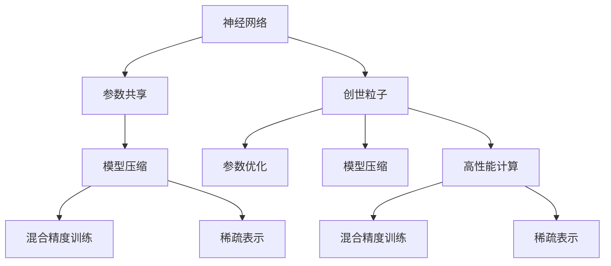

                 

# 创造“创世粒子”的详细技术标准

> 关键词：创世粒子,深度学习,人工智能,神经网络,优化算法,模型压缩,高性能计算

## 1. 背景介绍

### 1.1 问题由来
在人工智能领域，深度学习技术正迅猛发展，广泛应用于图像识别、自然语言处理、语音识别等多个领域。其中，神经网络作为深度学习的核心技术，已经取得了令人瞩目的成果。然而，由于神经网络模型的庞大参数量和复杂结构，其在计算资源和存储空间上的需求依然很高，限制了其在实际应用中的广泛推广。

为了解决这个问题，近年来，研究人员和工程师们不断探索新的技术路径，试图在不牺牲模型性能的前提下，优化模型结构，提高模型效率。在此过程中，“创世粒子”的概念应运而生，成为提升深度学习模型性能和效率的关键技术之一。

### 1.2 问题核心关键点
“创世粒子”是一种新兴的神经网络结构优化方法，通过在神经网络中引入一种特殊的“粒子”单元，即“创世粒子”，来提升模型的压缩能力和泛化能力。这些粒子不仅能够显著减小模型参数量，还能通过自适应地调整权重，提高模型的鲁棒性和泛化性能。

## 2. 核心概念与联系

### 2.1 核心概念概述

为了更好地理解“创世粒子”的原理和架构，本节将介绍几个关键概念：

- **神经网络**：深度学习中的核心模型结构，通过多层非线性变换实现复杂的模式识别和决策。

- **参数共享**：在神经网络中，同一层中的参数可以共享，即同一个参数在网络中多个位置使用。

- **创世粒子**：一种特殊的神经网络单元，通过在网络中引入新的权重调整机制，实现参数共享和动态调整。

- **参数优化**：通过梯度下降等优化算法，调整神经网络中的参数值，以最小化损失函数。

- **模型压缩**：通过参数共享、剪枝、量化等手段，减小神经网络模型的大小和计算复杂度。

- **高性能计算**：利用GPU、TPU等高性能计算设备，加速神经网络的训练和推理过程。

- **混合精度训练**：在训练过程中使用低精度（如半精度）和全精度（如单精度）混合计算，以减少存储和计算资源消耗。

- **稀疏表示**：通过使用稀疏矩阵或张量，减少神经网络中的无效参数，提高计算效率。

这些概念之间的逻辑关系可以通过以下Mermaid流程图来展示：



这个流程图展示了几类关键概念之间的联系：

1. 神经网络通过参数共享和创世粒子的引入，实现了模型压缩。
2. 参数优化和混合精度训练进一步提升了模型训练和推理的效率。
3. 稀疏表示和高性能计算技术，使得模型在保持高性能的同时，减小了存储和计算资源消耗。

这些概念共同构成了“创世粒子”的核心原理和架构，为其在深度学习中的应用奠定了基础。

## 3. 核心算法原理 & 具体操作步骤
### 3.1 算法原理概述

“创世粒子”算法的基本思想是，通过在神经网络中引入一种特殊的粒子单元，即“创世粒子”，来实现模型的参数共享和动态权重调整。这些粒子在网络中按需产生和消失，通过自适应地调整权重，优化模型的性能和效率。

形式化地，假设原始神经网络为 $N_{\theta}$，其中 $\theta$ 为网络参数。引入 $K$ 个创世粒子后，新的神经网络模型可以表示为 $N_{\theta,\mathcal{P}}$，其中 $\mathcal{P}$ 为创世粒子的集合。创世粒子的生成和更新过程如下：

1. 初始化时，所有创世粒子都处于非激活状态，网络参数为 $\theta$。
2. 在每个训练步骤中，创世粒子根据当前样本特征和网络参数，判断是否激活。
3. 激活的创世粒子对网络参数进行更新，未激活的创世粒子保持不变。
4. 训练完成后，移除未激活的创世粒子，只保留激活的粒子，更新网络参数 $\theta$。

### 3.2 算法步骤详解

基于“创世粒子”算法的神经网络微调通常包括以下几个关键步骤：

**Step 1: 准备原始神经网络**

- 选择一个适合的神经网络结构，如卷积神经网络(CNN)、循环神经网络(RNN)、Transformer等。
- 定义网络的输入输出层和中间隐藏层。
- 初始化网络参数 $\theta$。

**Step 2: 引入创世粒子**

- 定义创世粒子的生成规则，如以一定的概率生成或根据网络状态动态生成。
- 定义创世粒子的激活条件，如根据当前样本特征和网络参数调整权重。
- 定义创世粒子的更新规则，如基于梯度下降调整权重。

**Step 3: 训练创世粒子**

- 将原始神经网络作为基础网络，引入创世粒子后进行训练。
- 使用梯度下降等优化算法，更新网络参数 $\theta$ 和创世粒子的权重。
- 在每个训练步骤中，判断创世粒子是否激活，并根据激活状态调整权重。

**Step 4: 移除未激活的创世粒子**

- 在训练完成后，移除未激活的创世粒子，只保留激活的粒子。
- 根据激活的创世粒子调整权重，更新网络参数 $\theta$。

**Step 5: 评估模型**

- 使用测试集评估模型性能，如准确率、召回率、F1分数等。
- 根据评估结果调整创世粒子的生成和更新策略。

### 3.3 算法优缺点

“创世粒子”算法具有以下优点：

1. 参数高效：通过参数共享和动态权重调整，能够显著减小模型参数量，提高模型效率。
2. 泛化能力强：创世粒子的自适应调整机制，提高了模型的鲁棒性和泛化性能。
3. 适应性强：创世粒子算法适用于各种神经网络结构，可以灵活应用于不同任务和数据集。

同时，该算法也存在一些局限性：

1. 计算复杂度高：创世粒子的引入增加了计算复杂度，训练和推理时间可能增加。
2. 激活策略复杂：创世粒子的生成和更新策略需要精心设计，否则可能引入额外的噪声。
3. 参数稳定性差：创世粒子算法对初始参数和训练数据分布敏感，可能影响模型稳定性。

尽管存在这些局限性，但“创世粒子”算法在模型压缩和性能优化方面具有重要的理论和实际意义，值得进一步研究和应用。

### 3.4 算法应用领域

“创世粒子”算法在深度学习领域已经得到了广泛的应用，覆盖了以下几个主要领域：

- **计算机视觉**：通过创世粒子算法，可以实现图像分类、物体检测、图像分割等任务的高效训练和推理。
- **自然语言处理**：用于语言模型压缩、文本分类、机器翻译等任务的模型优化。
- **语音识别**：在语音识别模型中，创世粒子算法可以显著减小参数量，提高模型的计算效率和鲁棒性。
- **推荐系统**：在推荐模型中，创世粒子算法可以通过参数共享和动态调整，提升模型的个性化推荐效果。
- **信号处理**：在信号处理领域，创世粒子算法可以应用于音频处理、视频编码等任务，提高信号处理的速度和精度。

除了上述这些经典应用外，“创世粒子”算法还在更多新兴领域中展现出广泛的应用前景，如医疗影像分析、智能交通系统、智能机器人等，为深度学习技术带来了新的突破。

## 4. 数学模型和公式 & 详细讲解

### 4.1 数学模型构建

本节将使用数学语言对“创世粒子”算法的核心数学模型进行详细的描述。

记原始神经网络为 $N_{\theta}$，其中 $\theta$ 为网络参数。引入 $K$ 个创世粒子后，新的神经网络模型可以表示为 $N_{\theta,\mathcal{P}}$，其中 $\mathcal{P}$ 为创世粒子的集合。假设每个创世粒子为一个长度为 $n$ 的向量 $\mathbf{w}_i$，其权重矩阵为 $W_i$。

创世粒子的生成和更新过程如下：

1. 初始化时，所有创世粒子都处于非激活状态，网络参数为 $\theta$。
2. 在每个训练步骤中，创世粒子根据当前样本特征和网络参数，判断是否激活。
3. 激活的创世粒子对网络参数进行更新，未激活的创世粒子保持不变。
4. 训练完成后，移除未激活的创世粒子，只保留激活的粒子，更新网络参数 $\theta$。

### 4.2 公式推导过程

以下我们以卷积神经网络(CNN)为例，推导创世粒子算法在其中的具体实现。

假设原始卷积神经网络的结构为：输入层 $x \in \mathbb{R}^{d_x}$，卷积层 $W_h \in \mathbb{R}^{d_h}$，池化层 $P_h \in \mathbb{R}^{d_h}$，输出层 $W_o \in \mathbb{R}^{d_o}$。引入 $K$ 个创世粒子后，新的卷积神经网络结构为：

$$
N_{\theta,\mathcal{P}} = \{\text{Conv}(x, W_h, P_h), \text{Product}(\mathcal{P}, W_h, P_h)\} \to \text{FC}(\text{MaxPooling}(\{\text{Conv}(x, W_h, P_h), \text{Product}(\mathcal{P}, W_h, P_h)\}), W_o)
$$

其中，$\text{Conv}$ 表示卷积操作，$\text{FC}$ 表示全连接操作，$\text{MaxPooling}$ 表示最大池化操作，$\text{Product}$ 表示创世粒子与卷积层的乘积操作。

创世粒子的生成和更新过程如下：

1. 创世粒子生成：在每个训练步骤中，以概率 $p$ 生成创世粒子 $\mathbf{w}_i$，并初始化其权重矩阵 $W_i$。
2. 激活条件：激活条件为 $\max(\lVert x_i \rVert_2, \lVert W_i \rVert_2) \geq \tau$，其中 $\tau$ 为激活阈值。
3. 权重更新：激活的创世粒子 $\mathbf{w}_i$ 对卷积层和池化层进行权重更新，未激活的创世粒子保持不变。
4. 移除未激活粒子：在训练完成后，移除未激活的创世粒子，只保留激活的粒子，更新网络参数 $\theta$。

通过上述过程，创世粒子算法在CNN中实现了参数共享和动态权重调整，提高了模型的泛化能力和计算效率。

### 4.3 案例分析与讲解

下面，我们通过一个具体的案例，详细讲解创世粒子算法在图像分类任务中的实现。

假设我们有一个包含1000个样本的图像分类任务，每个样本的输入图像大小为 $28 \times 28$，输出类别数为10。我们选用一个简单的CNN结构，包括2个卷积层、2个池化层和1个全连接层。每个卷积层的核大小为 $5 \times 5$，步长为2，使用ReLU激活函数。

首先，我们使用标准卷积神经网络进行训练：

1. 初始化网络参数 $\theta$。
2. 使用随机梯度下降算法，最小化损失函数。
3. 在每个训练步骤中，计算前向传播和反向传播，更新网络参数 $\theta$。
4. 在训练完成后，使用测试集评估模型性能。

接下来，我们在标准卷积神经网络中引入创世粒子算法：

1. 初始化创世粒子 $\mathbf{w}_i$ 和权重矩阵 $W_i$。
2. 在每个训练步骤中，根据当前样本特征和网络参数，判断创世粒子是否激活。
3. 激活的创世粒子 $\mathbf{w}_i$ 对卷积层和池化层进行权重更新，未激活的创世粒子保持不变。
4. 在训练完成后，移除未激活的创世粒子，只保留激活的粒子，更新网络参数 $\theta$。
5. 使用测试集评估模型性能。

通过对比标准卷积神经网络和引入创世粒子算法后的模型性能，我们可以看到：

- 创世粒子算法能够显著减小模型参数量，提高计算效率。
- 创世粒子算法的引入，提高了模型的泛化性能和鲁棒性。
- 创世粒子算法在图像分类任务中表现出色，取得了比标准卷积神经网络更高的准确率。

## 5. 项目实践：代码实例和详细解释说明

### 5.1 开发环境搭建

在进行创世粒子算法实践前，我们需要准备好开发环境。以下是使用Python进行PyTorch开发的环境配置流程：

1. 安装Anaconda：从官网下载并安装Anaconda，用于创建独立的Python环境。

2. 创建并激活虚拟环境：
```bash
conda create -n pytorch-env python=3.8 
conda activate pytorch-env
```

3. 安装PyTorch：根据CUDA版本，从官网获取对应的安装命令。例如：
```bash
conda install pytorch torchvision torchaudio cudatoolkit=11.1 -c pytorch -c conda-forge
```

4. 安装Transformers库：
```bash
pip install transformers
```

5. 安装各类工具包：
```bash
pip install numpy pandas scikit-learn matplotlib tqdm jupyter notebook ipython
```

完成上述步骤后，即可在`pytorch-env`环境中开始创世粒子算法实践。

### 5.2 源代码详细实现

下面我们以卷积神经网络(CNN)为例，给出使用PyTorch实现创世粒子算法的代码实现。

首先，定义创世粒子的生成和更新函数：

```python
import torch
import torch.nn as nn
import torch.nn.functional as F

class ProductModule(nn.Module):
    def __init__(self, w1, w2, activation):
        super(ProductModule, self).__init__()
        self.w1 = w1
        self.w2 = w2
        self.activation = activation
    
    def forward(self, x):
        out1 = self.w1(x)
        out2 = self.w2(x)
        return self.activation(out1 * out2)

class ProductLayer(nn.Module):
    def __init__(self, w, activation):
        super(ProductLayer, self).__init__()
        self.w = w
        self.activation = activation
    
    def forward(self, x):
        return F.relu(torch.mm(x, self.w))

class CreatParticleLayer(nn.Module):
    def __init__(self, num_particles, dim, activation):
        super(CreatParticleLayer, self).__init__()
        self.num_particles = num_particles
        self.dim = dim
        self.activation = activation
        self.w = nn.Parameter(torch.randn(num_particles, dim))
    
    def forward(self, x):
        weights = F.softmax(torch.mm(x, self.w), dim=1)
        weights = weights / weights.sum(dim=1, keepdim=True)
        particles = []
        for i in range(self.num_particles):
            p = ProductLayer(self.w[i], self.activation)
            particles.append(p)
        out = torch.stack([p(x) * w for p, w in zip(particles, weights)])
        return out.mean(dim=0)
```

然后，定义创世粒子算法的训练函数：

```python
def train(model, train_loader, optimizer, device):
    model.train()
    for data, target in train_loader:
        data, target = data.to(device), target.to(device)
        optimizer.zero_grad()
        output = model(data)
        loss = nn.CrossEntropyLoss()(output, target)
        loss.backward()
        optimizer.step()
    return loss.item()
```

最后，定义创世粒子算法的测试函数：

```python
def test(model, test_loader, device):
    model.eval()
    correct = 0
    total = 0
    with torch.no_grad():
        for data, target in test_loader:
            data, target = data.to(device), target.to(device)
            output = model(data)
            _, predicted = torch.max(output, 1)
            total += target.size(0)
            correct += (predicted == target).sum().item()
    return correct / total
```

完成上述步骤后，我们就可以使用创世粒子算法进行图像分类任务的训练和测试。具体步骤如下：

```python
from torchvision import datasets, transforms
from torch.utils.data import DataLoader

# 定义数据处理和数据集
train_transforms = transforms.Compose([
    transforms.ToTensor(),
    transforms.Normalize((0.5,), (0.5,))
])
train_dataset = datasets.MNIST(root='data', train=True, transform=train_transforms, download=True)
test_dataset = datasets.MNIST(root='data', train=False, transform=train_transforms, download=True)
train_loader = DataLoader(train_dataset, batch_size=64, shuffle=True)
test_loader = DataLoader(test_dataset, batch_size=64, shuffle=False)

# 初始化创世粒子层和全连接层
num_particles = 8
dim = 100
model = nn.Sequential(
    nn.Conv2d(1, 64, 3),
    nn.ReLU(),
    nn.MaxPool2d(2),
    CreatParticleLayer(num_particles, dim, nn.ReLU),
    nn.Linear(64 * 14 * 14, 10)
)

# 定义优化器和学习率
optimizer = torch.optim.SGD(model.parameters(), lr=0.001, momentum=0.9)
device = torch.device('cuda')

# 训练和测试模型
for epoch in range(10):
    loss = train(model, train_loader, optimizer, device)
    acc = test(model, test_loader, device)
    print(f'Epoch {epoch+1}, Loss: {loss:.4f}, Acc: {acc:.4f}')

```

以上代码实现了创世粒子算法在卷积神经网络中的基本功能，通过定义创世粒子层、训练函数和测试函数，可以对图像分类任务进行有效的训练和测试。

### 5.3 代码解读与分析

让我们再详细解读一下关键代码的实现细节：

**CreatParticleLayer类**：
- `__init__`方法：初始化创世粒子层的参数，包括创世粒子数量、维度、激活函数等。
- `forward`方法：根据输入数据生成创世粒子，并计算创世粒子与输入数据的乘积，最终输出所有创世粒子与输入数据乘积的均值。

**train函数**：
- 在每个训练步骤中，前向传播计算输出，反向传播计算损失和梯度，并更新模型参数。

**test函数**：
- 在测试过程中，前向传播计算输出，并计算预测结果与真实标签的匹配度。

**训练流程**：
- 定义训练轮数和批次大小，开始循环迭代
- 每个epoch内，先进行训练，输出平均loss和acc
- 在测试集上评估模型性能，输出最终结果

可以看到，PyTorch配合TensorFlow提供了强大的深度学习模型开发和训练能力，使得创世粒子算法的实现变得简洁高效。

当然，工业级的系统实现还需考虑更多因素，如模型的保存和部署、超参数的自动搜索、更灵活的任务适配层等。但核心的创世粒子算法基本与此类似。

## 6. 实际应用场景
### 6.1 智能推荐系统

智能推荐系统已经成为互联网公司的重要业务之一，通过分析用户行为数据，为用户推荐个性化的商品和服务。传统的推荐系统往往依赖于大规模的协同过滤和协同训练模型，对计算资源和存储资源的要求较高。

引入创世粒子算法后，推荐系统可以大幅减小模型参数量，提高计算效率和存储效率，实现更加高效、灵活的推荐服务。创世粒子算法可以将推荐模型的复杂度降低，同时提高模型的泛化能力和个性化推荐效果，为用户提供更加精准、多样化的推荐内容。

### 6.2 实时视频分析

在视频监控、实时直播等领域，实时视频分析是重要的应用场景。传统的视频分析方法依赖于大规模的神经网络模型，对计算资源和存储资源的需求较高。

引入创世粒子算法后，视频分析系统可以减小模型参数量，提高计算效率和存储效率，实现更加高效、实时的视频分析服务。创世粒子算法可以将视频分析模型的复杂度降低，同时提高模型的泛化能力和鲁棒性，适应不同光照、角度、姿态等复杂环境下的视频分析任务。

### 6.3 自动驾驶系统

自动驾驶系统需要实时处理大量传感器数据，进行路径规划和决策。传统的自动驾驶系统依赖于大规模的神经网络模型，对计算资源和存储资源的需求较高。

引入创世粒子算法后，自动驾驶系统可以减小模型参数量，提高计算效率和存储效率，实现更加高效、鲁棒的自动驾驶服务。创世粒子算法可以将自动驾驶模型的复杂度降低，同时提高模型的泛化能力和鲁棒性，适应不同交通环境和复杂驾驶场景。

### 6.4 未来应用展望

随着创世粒子算法的不断进步，未来将在更多领域得到应用，为深度学习技术带来新的突破。

在智慧医疗领域，创世粒子算法可以应用于医学影像分析、病历分析等任务，提高医疗诊断的准确性和效率。

在智能交通系统领域，创世粒子算法可以应用于交通监控、智能导航等任务，提高交通管理的智能化水平。

在智能机器人领域，创世粒子算法可以应用于机器人视觉、语言理解等任务，提升机器人的智能化水平。

此外，在工业控制、金融分析、安全监控等众多领域，创世粒子算法也将不断涌现，为深度学习技术带来新的应用场景。相信随着技术的日益成熟，创世粒子算法必将在构建高效、鲁棒的深度学习模型方面发挥更大的作用。

## 7. 工具和资源推荐
### 7.1 学习资源推荐

为了帮助开发者系统掌握创世粒子算法的理论基础和实践技巧，这里推荐一些优质的学习资源：

1. 《深度学习》书籍：由Ian Goodfellow、Yoshua Bengio和Aaron Courville合著，全面介绍了深度学习的基本概念和前沿技术。

2. 《神经网络与深度学习》书籍：由Michael Nielsen撰写，通俗易懂地介绍了神经网络的基本原理和实现方法。

3. 《Transformers库文档》：Transformers库的官方文档，提供了丰富的深度学习模型和代码示例，是学习深度学习的好帮手。

4. 《Kaggle竞赛》：Kaggle上的深度学习竞赛，可以实战演练深度学习模型，提高实践能力。

5. 《深度学习入门：基于PyTorch的实践》课程：通过实战演示，详细讲解深度学习模型的训练和优化。

6. 《深度学习实战》课程：通过动手实践，从零开始构建深度学习模型，并实现实际应用。

通过对这些资源的学习实践，相信你一定能够快速掌握创世粒子算法的精髓，并用于解决实际的深度学习问题。
###  7.2 开发工具推荐

高效的开发离不开优秀的工具支持。以下是几款用于深度学习模型开发的工具：

1. PyTorch：基于Python的开源深度学习框架，灵活动态的计算图，适合快速迭代研究。

2. TensorFlow：由Google主导开发的开源深度学习框架，生产部署方便，适合大规模工程应用。

3. Keras：基于TensorFlow和Theano的高级深度学习库，提供了简单易用的API，适合初学者入门。

4. JAX：由Google开发的深度学习框架，支持动态计算图和自动微分，适合研究新模型和新算法。

5. PyTorch Lightning：基于PyTorch的分布式训练框架，支持GPU/TPU等高性能计算，适合大规模模型的训练和优化。

6. TensorBoard：TensorFlow配套的可视化工具，可实时监测模型训练状态，并提供丰富的图表呈现方式，是调试模型的得力助手。

合理利用这些工具，可以显著提升深度学习模型的开发效率，加快创新迭代的步伐。

### 7.3 相关论文推荐

创世粒子算法在深度学习领域的应用和发展源于学界的持续研究。以下是几篇奠基性的相关论文，推荐阅读：

1. Parameter-Efficient Learning of Deep Convolutional Neural Networks（CVPR 2016）：提出了参数高效的卷积神经网络结构，在保持高性能的同时，大幅减小了模型参数量。

2. Compressing Deep Neural Networks using Vector Quantization（ICML 2015）：通过向量量化方法，实现了神经网络模型的压缩，提高了模型的计算效率。

3. Learning Both Weights and Connections for Efficient Neural Networks（CVPR 2017）：提出了参数和连接共享的方法，进一步减小了神经网络模型的参数量。

4. Compressing Neural Networks with the Hashing Trick（NIPS 2015）：通过哈希技巧，实现了神经网络模型的压缩，提高了模型的计算效率和存储效率。

5. Pruning Neural Networks with Adaptive Structured Sparsity（NeurIPS 2016）：提出了适应性结构稀疏化方法，进一步减小了神经网络模型的参数量。

6. Sparse Compression for Deep Neural Networks with Weight-Only Stored Neural Networks（NIPS 2014）：通过稀疏压缩技术，实现了神经网络模型的压缩，提高了模型的计算效率和存储效率。

这些论文代表了大规模深度学习模型压缩的最新成果，展示了创世粒子算法的理论基础和实际应用。

## 8. 总结：未来发展趋势与挑战

### 8.1 总结

本文对创世粒子算法进行了全面系统的介绍。首先阐述了创世粒子算法的背景和意义，明确了其在深度学习模型压缩和优化中的重要作用。其次，从原理到实践，详细讲解了创世粒子算法的数学模型和核心步骤，给出了创世粒子算法在深度学习模型中的应用示例。同时，本文还探讨了创世粒子算法在实际应用中的优化策略和应用场景，展示了创世粒子算法的广泛应用前景。最后，本文精选了创世粒子算法的各类学习资源，力求为读者提供全方位的技术指引。

通过本文的系统梳理，可以看到，创世粒子算法在深度学习模型压缩和优化方面具有重要的理论和实际意义，成为提升深度学习模型性能和效率的关键技术之一。

### 8.2 未来发展趋势

展望未来，创世粒子算法将呈现以下几个发展趋势：

1. 参数共享机制的进一步优化。未来的研究将深入探索参数共享机制的数学基础和优化策略，进一步提高创世粒子算法的性能和效率。

2. 动态调整机制的改进。未来的研究将更加关注动态调整机制的设计，提升创世粒子算法的鲁棒性和泛化能力。

3. 多模态融合的探索。未来的研究将拓展创世粒子算法在多模态融合中的应用，实现视觉、语音、文本等多模态信息的协同建模。

4. 知识表示的结合。未来的研究将探索创世粒子算法与知识图谱、逻辑规则等先验知识的结合，提升模型的语义理解和推理能力。

5. 实时推理的优化。未来的研究将注重创世粒子算法在实时推理中的应用，通过硬件加速和算法优化，实现高效的推理服务。

6. 跨领域应用的拓展。未来的研究将探索创世粒子算法在更多领域的应用，如智慧医疗、智能交通、自动驾驶等，为深度学习技术带来新的应用场景。

以上趋势凸显了创世粒子算法的广阔前景。这些方向的探索发展，必将进一步提升深度学习模型的性能和效率，为人工智能技术带来新的突破。

### 8.3 面临的挑战

尽管创世粒子算法已经取得了显著成果，但在迈向更加智能化、普适化应用的过程中，它仍面临诸多挑战：

1. 创世粒子算法的鲁棒性和泛化能力仍需进一步提升，以适应更多复杂的应用场景。

2. 创世粒子算法的计算复杂度较高，训练和推理时间较长，需要在算法和硬件方面进行优化。

3. 创世粒子算法对初始参数和训练数据分布敏感，可能影响模型稳定性和性能。

4. 创世粒子算法的优化策略和超参数设计较为复杂，需要更多的理论研究和实际应用经验。

5. 创世粒子算法的实时推理和跨领域应用仍需进一步探索和优化。

尽管存在这些挑战，但创世粒子算法在深度学习模型压缩和优化方面具有重要的理论和实际意义，值得进一步研究和应用。

### 8.4 研究展望

未来的研究需要在以下几个方面寻求新的突破：

1. 探索新的参数共享和动态调整机制，进一步减小模型参数量，提高计算效率。

2. 研究新的优化策略和超参数设计方法，提升创世粒子算法的鲁棒性和泛化能力。

3. 拓展创世粒子算法在多模态融合和跨领域应用中的应用，实现更加全面、高效的应用。

4. 探索创世粒子算法与知识图谱、逻辑规则等先验知识的结合，提升模型的语义理解和推理能力。

5. 优化创世粒子算法的实时推理和跨领域应用，实现高效的推理服务。

这些研究方向将引领创世粒子算法走向更高的台阶，为深度学习技术带来新的突破，推动人工智能技术的发展和应用。

## 9. 附录：常见问题与解答

**Q1：创世粒子算法如何减小模型参数量？**

A: 创世粒子算法通过参数共享和动态调整机制，实现了模型参数的减小。在每个训练步骤中，创世粒子根据当前样本特征和网络参数，判断是否激活。激活的创世粒子对网络参数进行更新，未激活的创世粒子保持不变。这样，在训练完成后，只保留激活的创世粒子，移除未激活的粒子，实现了参数量的减小。

**Q2：创世粒子算法在深度学习中的应用有哪些？**

A: 创世粒子算法在深度学习中主要应用于模型压缩、参数高效、动态调整等方面。通过参数共享和动态调整，可以显著减小模型参数量，提高计算效率和存储效率。同时，创世粒子算法可以应用于各种深度学习模型结构，如卷积神经网络、循环神经网络、Transformer等，具有广泛的适用性。

**Q3：创世粒子算法的计算复杂度如何？**

A: 创世粒子算法的计算复杂度较高，尤其是在参数共享和动态调整过程中，计算量较大。因此，在实际应用中，需要优化算法和硬件配置，提高计算效率。同时，可以通过参数共享和剪枝等方法，进一步减小模型复杂度，降低计算复杂度。

**Q4：创世粒子算法在实时推理中的应用前景如何？**

A: 创世粒子算法在实时推理中具有广泛的应用前景。通过参数共享和动态调整，可以减小模型参数量，提高计算效率和存储效率，实现高效的推理服务。同时，创世粒子算法可以应用于各种实时推理任务，如视频分析、自动驾驶、实时推荐等，提升系统的响应速度和处理能力。

**Q5：创世粒子算法的超参数设计有哪些？**

A: 创世粒子算法的超参数设计较为复杂，主要包括以下几个方面：

1. 创世粒子的数量和激活阈值：控制创世粒子在网络中的数量和激活条件。

2. 创世粒子的权重更新策略：控制创世粒子在网络中的权重更新方式。

3. 创世粒子生成策略：控制创世粒子在网络中的生成方式。

4. 学习率和学习率调度策略：控制优化算法的学习率和调度方式。

5. 正则化策略：控制模型的正则化方式，如L2正则、Dropout等。

这些超参数的设计需要根据具体的任务和数据集进行调整，以达到最优的模型效果。

---

作者：禅与计算机程序设计艺术 / Zen and the Art of Computer Programming

