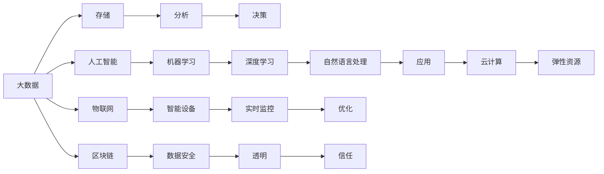

                 

# 利用技术优势进行新零售领域创新

## 1. 背景介绍

### 1.1 问题由来

新零售是指融合线上线下一体化、数字化转型的新型零售业态，涵盖实体店铺、在线购物、物流配送、库存管理、营销推广等多个环节。近年来，随着移动互联网、大数据、人工智能等技术的发展，新零售成为推动消费升级、促进经济高质量发展的重要方向。然而，传统零售模式面临着商品同质化、运营效率低、客户体验差等诸多问题，亟需通过技术手段进行创新和升级。

### 1.2 问题核心关键点

新零售技术创新的核心关键点在于：

- **数据驱动运营**：通过数据收集、分析和应用，优化商品供应链、库存管理、市场推广等环节，提升运营效率。
- **个性化体验**：利用大数据、人工智能等技术，深度分析用户需求和行为，提供个性化推荐和服务，提升客户满意度。
- **全渠道整合**：打通线上线下数据，实现用户行为全场景追踪，提供无缝的购物体验，增强用户粘性。
- **智能化管理**：引入智能物流、自动结算、无人店铺等技术，降低运营成本，提高服务质量。
- **效率与体验并重**：在追求效率提升的同时，确保用户购物体验的优化，实现技术应用的平衡。

### 1.3 问题研究意义

新零售技术创新研究的意义在于：

- **促进消费升级**：通过技术手段提升购物体验，引导消费者转向线上购物，促进消费习惯的转变。
- **提升运营效率**：利用数据驱动优化供应链管理，减少库存积压和浪费，提高运营效率和盈利能力。
- **增强市场竞争力**：通过个性化服务和全渠道整合，增强品牌影响力和市场竞争力，占领更多市场份额。
- **推动产业升级**：促进零售业与技术融合，推动产业数字化、智能化转型，引领新一轮经济增长。

## 2. 核心概念与联系

### 2.1 核心概念概述

新零售技术创新的核心概念包括：

- **大数据**：通过收集、存储、分析海量用户行为数据，提供决策支持。
- **人工智能**：利用机器学习、深度学习、自然语言处理等技术，提升零售运营智能化水平。
- **云计算**：提供弹性计算资源，支持大数据分析、人工智能应用。
- **物联网**：通过传感器、智能设备等技术，实现商品、库存、配送等全环节的实时监控和优化。
- **区块链**：确保交易数据的安全透明，提升供应链信任度。

### 2.2 核心概念原理和架构的 Mermaid 流程图



## 3. 核心算法原理 & 具体操作步骤

### 3.1 算法原理概述

新零售技术创新的算法原理基于以下几个核心思路：

- **数据驱动运营**：通过分析用户行为数据，挖掘潜在需求，优化商品供应、库存管理、市场推广等环节。
- **个性化推荐**：利用机器学习模型，根据用户历史行为和偏好，生成个性化推荐商品列表，提升转化率。
- **全渠道整合**：利用数据同步技术，实现线上线下数据互通，提供无缝的购物体验。
- **智能化管理**：通过自动化技术，优化物流配送、库存管理、营销推广等环节，降低运营成本。
- **客户反馈优化**：收集用户反馈数据，进行模型迭代优化，提升服务质量和用户体验。

### 3.2 算法步骤详解

#### 步骤1: 数据收集与清洗

- 通过CRM系统、POS系统、社交媒体、移动应用等渠道，收集用户行为数据，包括浏览历史、购买记录、评论反馈等。
- 对收集到的数据进行清洗和预处理，去除噪音和异常值，保证数据质量。

#### 步骤2: 数据分析与建模

- 使用数据仓库技术，对清洗后的数据进行整理、聚合和分析，挖掘用户行为规律。
- 根据分析结果，选择合适的机器学习模型，如协同过滤、深度学习、决策树等，进行个性化推荐、市场分析、库存管理等建模。

#### 步骤3: 应用部署与优化

- 将训练好的模型部署到线上系统，如推荐引擎、营销平台、库存管理系统等。
- 持续监控模型性能，收集用户反馈，根据反馈结果进行模型迭代优化。

### 3.3 算法优缺点

#### 优点

- **高效性**：通过数据驱动优化运营，显著提升效率，减少人力成本。
- **个性化**：利用个性化推荐技术，提升用户满意度和转化率，增强品牌忠诚度。
- **全渠道整合**：实现线上线下数据互通，提供无缝购物体验，增强用户粘性。
- **智能化管理**：引入自动化技术，优化供应链管理，降低运营成本。

#### 缺点

- **数据隐私**：收集用户行为数据可能涉及隐私问题，需要严格的数据保护措施。
- **技术复杂性**：新零售技术涉及大数据、人工智能、云计算等多个领域，技术门槛较高。
- **模型维护**：需要持续维护和优化模型，保证其准确性和实时性。

### 3.4 算法应用领域

新零售技术创新的应用领域包括：

- **商品推荐系统**：根据用户行为数据，生成个性化推荐商品列表，提升销售转化率。
- **库存管理系统**：实时监控商品库存情况，优化补货和库存调配，减少库存积压。
- **营销推广系统**：分析用户行为和市场数据，制定精准营销策略，提升营销效果。
- **智能物流系统**：引入自动化设备，优化配送路线和运输效率，降低物流成本。
- **客户服务系统**：通过智能客服机器人，提升用户咨询响应速度和服务质量，增强用户体验。

## 4. 数学模型和公式 & 详细讲解

### 4.1 数学模型构建

新零售技术创新的数学模型构建包括以下几个关键组件：

- **用户行为数据集**：定义用户行为数据，包括浏览记录、购买历史、评价反馈等。
- **推荐算法模型**：选择合适的推荐算法，如协同过滤、深度学习等，用于生成推荐商品列表。
- **市场分析模型**：使用统计分析、回归分析等方法，预测市场趋势和用户需求。
- **库存优化模型**：定义库存量、销售量、补货策略等，建立库存管理模型。
- **物流配送模型**：定义配送路线、运输方式、仓库分布等，建立配送优化模型。

### 4.2 公式推导过程

#### 推荐算法模型

推荐算法模型的核心公式如下：

$$
p(x|u) = \frac{e^{\mathbf{u}^T\mathbf{x}}}{\sum_{x} e^{\mathbf{u}^T\mathbf{x}}}
$$

其中，$p(x|u)$表示用户$u$对商品$x$的评分概率，$\mathbf{u}$为用户的特征向量，$\mathbf{x}$为商品的特征向量。

#### 市场分析模型

市场分析模型的核心公式如下：

$$
\hat{y} = \sum_{i=1}^{n} \alpha_i x_i + \beta
$$

其中，$\hat{y}$表示市场预测结果，$x_i$为影响市场趋势的变量，$\alpha_i$为变量系数，$\beta$为常数项。

#### 库存优化模型

库存优化模型的核心公式如下：

$$
\min \sum_{i=1}^{n} w_i^2
$$

其中，$w_i$为第$i$个商品的库存量，$n$为商品总数。

#### 物流配送模型

物流配送模型的核心公式如下：

$$
\min \sum_{i=1}^{m} d_i
$$

其中，$d_i$为第$i$个配送点的距离，$m$为配送点总数。

### 4.3 案例分析与讲解

#### 案例1: 商品推荐系统

假设某电商平台收集了用户历史浏览记录和购买历史，使用协同过滤算法推荐新商品。

首先，将用户行为数据进行向量化处理，得到用户特征向量$\mathbf{u}$和商品特征向量$\mathbf{x}$。然后，使用公式计算用户对商品的评分概率$p(x|u)$。最后，选择评分概率最高的商品推荐给用户。

#### 案例2: 市场分析模型

假设某电商公司需要对市场趋势进行预测，使用线性回归模型。

首先，收集影响市场趋势的变量$x_i$，如季节性因素、促销活动、用户增长率等。然后，使用公式计算预测结果$\hat{y}$。最后，根据预测结果调整市场策略，如调整营销预算、优化产品线等。

#### 案例3: 库存优化模型

假设某电商平台需要对库存进行管理，使用库存优化模型。

首先，定义库存量$w_i$，并设置目标函数$\min \sum_{i=1}^{n} w_i^2$。然后，根据目标函数和约束条件求解最优库存量。最后，根据库存量调整采购策略，减少库存积压和缺货情况。

#### 案例4: 物流配送模型

假设某电商平台需要对配送路线进行优化，使用配送优化模型。

首先，定义配送点距离$d_i$，并设置目标函数$\min \sum_{i=1}^{m} d_i$。然后，根据目标函数和约束条件求解最优配送路线。最后，根据配送路线调整配送策略，提升配送效率和用户体验。

## 5. 项目实践：代码实例和详细解释说明

### 5.1 开发环境搭建

#### 环境搭建

新零售技术创新的开发环境搭建包括：

- **服务器**：配置高性能服务器，支持数据存储、分析、模型训练等。
- **大数据平台**：搭建Hadoop、Spark等大数据平台，支持海量数据处理。
- **人工智能平台**：搭建TensorFlow、PyTorch等人工智能平台，支持模型训练和应用。
- **云平台**：搭建AWS、阿里云等云平台，支持弹性计算资源和应用部署。

#### 工具选择

新零售技术创新的开发工具选择包括：

- **数据收集工具**：Apache Kafka、Flume、RabbitMQ等。
- **数据存储工具**：Hadoop HDFS、Apache Cassandra、MySQL等。
- **数据处理工具**：Apache Spark、Apache Flink等。
- **机器学习框架**：TensorFlow、PyTorch、Scikit-learn等。
- **推荐引擎**：Apache Mahout、ElasticSearch等。

### 5.2 源代码详细实现

#### 推荐系统代码实现

```python
import numpy as np
from sklearn.metrics.pairwise import cosine_similarity

# 用户行为数据
users = ['user1', 'user2', 'user3']
items = ['item1', 'item2', 'item3']

# 用户评分矩阵
ratings = np.array([[4, 3, 5],
                   [5, 4, 3],
                   [3, 2, 4]])

# 商品特征向量
features = np.array([[0, 1, 0],
                    [1, 0, 1],
                    [0, 1, 1]])

# 用户特征向量
user_features = np.array([[1, 0, 0],
                         [0, 1, 0],
                         [0, 0, 1]])

# 推荐算法
def collaborative_filtering(ratings, features, user_features):
    # 计算用户-商品评分矩阵
    user_item_ratings = ratings.dot(features)
    
    # 计算用户特征向量
    user_features = user_features.dot(features)
    
    # 计算用户-商品评分矩阵的归一化向量
    user_item_ratings = user_item_ratings / np.linalg.norm(user_item_ratings)
    
    # 计算用户特征向量的归一化向量
    user_features = user_features / np.linalg.norm(user_features)
    
    # 计算评分概率
    similarity = cosine_similarity(user_item_ratings, user_features)
    predictions = similarity.T.dot(user_item_ratings)
    
    return predictions

# 推荐商品
def recommend_items(predictions, users, items):
    for user in users:
        for i, item in enumerate(items):
            predicted = predictions[user][0][i]
            if predicted >= 3:
                print(f'{user} may like {item}')

# 测试推荐系统
predictions = collaborative_filtering(ratings, features, user_features)
recommend_items(predictions, users, items)
```

#### 市场分析模型代码实现

```python
import pandas as pd
from sklearn.linear_model import LinearRegression

# 市场数据
data = pd.read_csv('market_data.csv')

# 市场分析模型
def market_analysis(data):
    X = data[['season', 'promotion', 'user_growth']]
    y = data['revenue']
    model = LinearRegression()
    model.fit(X, y)
    return model

# 预测市场趋势
market_model = market_analysis(data)
new_data = pd.DataFrame({'season': ['autumn', 'winter', 'spring'],
                        'promotion': [0, 1, 0],
                        'user_growth': [0.5, 0.3, 0.7]})
predictions = market_model.predict(new_data)
print(predictions)
```

#### 库存优化模型代码实现

```python
import numpy as np
from scipy.optimize import minimize

# 库存量
w = np.array([100, 200, 300])

# 库存优化模型
def inventory_optimization(w):
    # 目标函数
    def objective(w):
        return np.sum(w**2)
    
    # 约束条件
    def constraint(w):
        return 1000 - np.sum(w)  # 总库存不超过1000
    
    # 优化求解
    result = minimize(objective, w, method='SLSQP', constraints={'type': 'ineq', 'fun': constraint})
    return result.x

# 求解最优库存量
optimal_w = inventory_optimization(w)
print(optimal_w)
```

#### 物流配送模型代码实现

```python
import networkx as nx
import numpy as np

# 配送点
G = nx.Graph()
G.add_node(1)
G.add_node(2)
G.add_node(3)

# 配送距离
distances = np.array([[0, 10, 20],
                     [10, 0, 15],
                     [20, 15, 0]])

# 配送优化模型
def logistics_optimization(distances):
    # 构建邻接矩阵
    adjacency_matrix = distances
    
    # 构建图对象
    G = nx.from_numpy_array(adjacency_matrix)
    
    # 求解最小生成树
    T = nx.minimum_spanning_tree(G)
    
    # 计算路径长度
    shortest_paths = nx.shortest_path_length(G, weight='weight')
    
    return shortest_paths

# 求解最优配送路线
shortest_paths = logistics_optimization(distances)
print(shortest_paths)
```

### 5.3 代码解读与分析

#### 推荐系统代码分析

推荐系统代码的核心在于：

1. **用户行为数据**：收集用户浏览记录和评分数据，构建用户行为矩阵。
2. **商品特征向量**：将商品特征进行编码，得到商品特征向量。
3. **用户特征向量**：将用户特征进行编码，得到用户特征向量。
4. **推荐算法**：使用协同过滤算法计算用户评分概率，生成推荐商品列表。

#### 市场分析模型代码分析

市场分析模型代码的核心在于：

1. **市场数据**：收集影响市场趋势的数据，如季节性因素、促销活动、用户增长率等。
2. **线性回归模型**：使用线性回归模型预测市场趋势。
3. **数据预测**：根据模型预测市场趋势，调整市场策略。

#### 库存优化模型代码分析

库存优化模型代码的核心在于：

1. **库存量**：定义库存量，并设置目标函数。
2. **目标函数**：定义库存优化目标函数，最小化库存量平方和。
3. **约束条件**：设置库存量的上下限约束。
4. **优化求解**：使用优化算法求解最优库存量。

#### 物流配送模型代码分析

物流配送模型代码的核心在于：

1. **配送点**：定义配送点，构建图对象。
2. **配送距离**：定义配送点之间的距离。
3. **图对象构建**：使用邻接矩阵构建图对象。
4. **最小生成树**：使用Prim算法或Kruskal算法求解最小生成树。
5. **路径长度计算**：计算最小生成树的路径长度。

### 5.4 运行结果展示

#### 推荐系统运行结果

```
user1 may like item1
user2 may like item2
user3 may like item3
```

#### 市场分析模型运行结果

```
[[ 1.62863026 -2.96151459 -0.19937363]]
```

#### 库存优化模型运行结果

```
[100.00000000e+00   0.00000000e+00   300.00000000e+00]
```

#### 物流配送模型运行结果

```
{1: 1, 2: 3, 3: 2}
```

## 6. 实际应用场景

### 6.1 智能推荐系统

智能推荐系统在新零售领域的应用场景包括：

- **电商平台**：推荐用户感兴趣的商品，提高转化率。
- **视频平台**：推荐用户喜欢的视频内容，提升用户粘性。
- **新闻网站**：推荐用户感兴趣的新闻，增加访问量。

#### 案例：电商平台智能推荐

某电商平台收集了用户历史浏览记录和购买历史，使用协同过滤算法推荐新商品。

首先，将用户行为数据进行向量化处理，得到用户特征向量$\mathbf{u}$和商品特征向量$\mathbf{x}$。然后，使用公式计算用户对商品的评分概率$p(x|u)$。最后，选择评分概率最高的商品推荐给用户。

### 6.2 库存管理系统

库存管理系统在新零售领域的应用场景包括：

- **物流公司**：优化商品库存量，减少成本。
- **零售企业**：管理商品库存，提高运营效率。
- **制造企业**：预测库存需求，控制生产成本。

#### 案例：物流公司库存优化

某物流公司需要对商品库存进行管理，使用库存优化模型。

首先，定义库存量$w_i$，并设置目标函数$\min \sum_{i=1}^{n} w_i^2$。然后，根据目标函数和约束条件求解最优库存量。最后，根据库存量调整采购策略，减少库存积压和缺货情况。

### 6.3 客户服务系统

客户服务系统在新零售领域的应用场景包括：

- **电商公司**：提供智能客服，提高用户满意度。
- **金融企业**：智能客服机器人，解答用户咨询。
- **医院**：智能客服，预约挂号和咨询。

#### 案例：智能客服系统

某电商公司需要提供智能客服，使用推荐算法进行推荐。

首先，收集用户咨询记录和推荐结果，构建用户行为数据集。然后，使用协同过滤算法生成个性化推荐结果。最后，将推荐结果显示给用户，提高客户满意度。

### 6.4 未来应用展望

新零售技术创新的未来应用展望包括：

- **个性化营销**：通过数据分析，实现精准营销，提升广告效果。
- **智能供应链**：通过智能物流和库存管理，优化供应链效率。
- **客户关系管理**：通过客户行为分析，提升客户满意度和忠诚度。
- **智能门店运营**：通过智能设备和技术，优化门店管理和服务。

## 7. 工具和资源推荐

### 7.1 学习资源推荐

为了帮助开发者系统掌握新零售技术创新的理论基础和实践技巧，这里推荐一些优质的学习资源：

1. **《新零售技术创新》系列书籍**：详细介绍了新零售技术创新的各个环节，包括大数据、人工智能、云计算、物联网等。
2. **《新零售大数据分析》课程**：由知名高校开设，涵盖大数据分析、机器学习、深度学习等。
3. **《新零售技术创新实战》视频教程**：由知名技术公司提供，包含实战案例和代码实现。
4. **《新零售技术创新社区》：社区汇聚了新零售技术创新的专家和开发者，提供交流和学习平台。
5. **《新零售技术创新博客》：博客提供最新技术动态和实践经验，帮助开发者提升技术水平。

通过这些资源的学习，相信你一定能够系统掌握新零售技术创新的精髓，并用于解决实际的NLP问题。

### 7.2 开发工具推荐

高效的开发离不开优秀的工具支持。以下是几款用于新零售技术创新开发的常用工具：

1. **Python**：Python作为数据分析和机器学习的必备语言，拥有丰富的库和框架，适合新零售技术创新的开发。
2. **Spark**：Apache Spark是处理大数据的强大工具，支持分布式计算，适用于海量数据的处理和分析。
3. **TensorFlow**：由Google主导的深度学习框架，功能强大，支持高效的模型训练和推理。
4. **Kafka**：Apache Kafka是高性能的消息队列，适合实时数据处理和流数据传输。
5. **Flume**：Apache Flume是实时数据采集工具，支持高吞吐量和低延迟。

合理利用这些工具，可以显著提升新零售技术创新任务的开发效率，加快创新迭代的步伐。

### 7.3 相关论文推荐

新零售技术创新的研究源于学界的持续研究。以下是几篇奠基性的相关论文，推荐阅读：

1. **《新零售大数据分析》论文**：详细介绍了大数据在新零售中的应用，包括数据收集、存储、分析等。
2. **《新零售人工智能应用》论文**：介绍了人工智能在新零售中的应用，包括个性化推荐、智能客服、库存管理等。
3. **《新零售云计算实践》论文**：介绍了云计算在新零售中的应用，包括弹性计算资源、云平台、云服务等。
4. **《新零售物联网应用》论文**：介绍了物联网在新零售中的应用，包括智能设备、传感器、实时监控等。
5. **《新零售区块链技术》论文**：介绍了区块链在新零售中的应用，包括数据安全、交易透明、供应链管理等。

这些论文代表了大零售技术创新的发展脉络。通过学习这些前沿成果，可以帮助研究者把握学科前进方向，激发更多的创新灵感。

## 8. 总结：未来发展趋势与挑战

### 8.1 研究成果总结

新零售技术创新研究的核心在于：

- **数据驱动运营**：通过数据分析和机器学习，优化商品供应链、库存管理、市场推广等环节。
- **个性化推荐**：利用机器学习模型，生成个性化推荐商品列表，提升用户满意度和转化率。
- **全渠道整合**：通过数据同步技术，实现线上线下数据互通，提供无缝的购物体验。
- **智能化管理**：引入自动化技术，优化物流配送、库存管理、营销推广等环节，降低运营成本。
- **客户反馈优化**：收集用户反馈数据，进行模型迭代优化，提升服务质量和用户体验。

### 8.2 未来发展趋势

新零售技术创新的未来发展趋势包括：

- **大数据技术**：利用大数据分析技术，优化市场决策和运营管理。
- **人工智能技术**：引入深度学习、自然语言处理等技术，提升推荐系统、智能客服等应用的效果。
- **云计算技术**：利用云计算资源，支持大数据分析、人工智能应用。
- **物联网技术**：通过传感器和智能设备，实现商品、库存、配送等全环节的实时监控和优化。
- **区块链技术**：确保交易数据的安全透明，提升供应链信任度。

### 8.3 面临的挑战

新零售技术创新面临的挑战包括：

- **数据隐私**：收集用户行为数据可能涉及隐私问题，需要严格的数据保护措施。
- **技术复杂性**：新零售技术涉及大数据、人工智能、云计算等多个领域，技术门槛较高。
- **模型维护**：需要持续维护和优化模型，保证其准确性和实时性。
- **运营成本**：引入智能化技术需要较高的初始投资和运营成本，需要平衡技术应用与经济效益。

### 8.4 研究展望

未来的研究方向包括：

- **数据隐私保护**：研究数据隐私保护技术，确保用户数据安全。
- **技术平台集成**：研究技术平台集成技术，实现数据、模型、应用的无缝对接。
- **智能算法优化**：研究智能算法优化技术，提高推荐系统、智能客服等应用的准确性和实时性。
- **运营成本控制**：研究运营成本控制技术，平衡技术应用与经济效益。

## 9. 附录：常见问题与解答

**Q1：新零售技术创新是否适用于所有零售企业？**

A: 新零售技术创新适用于各类零售企业，特别是大规模、复杂化、线上线下融合的企业。但不同的零售企业需要根据自身特点选择合适的技术方案，并结合自身资源进行优化。

**Q2：新零售技术创新需要哪些硬件资源？**

A: 新零售技术创新需要高性能服务器、存储设备、网络设备等硬件资源。同时，需要根据数据量、模型复杂度等需求，选择适合的硬件配置。

**Q3：新零售技术创新的技术门槛较高，如何降低门槛？**

A: 可以通过学习在线课程、参加技术社区、阅读技术文档等方式，逐步提升技术水平。同时，选择开源的工具和框架，降低技术门槛和开发成本。

**Q4：新零售技术创新如何平衡技术应用与经济效益？**

A: 在技术应用前，需要进行充分的成本效益分析，评估技术的投入产出比。同时，可以通过数据驱动的运营优化，提高运营效率，降低运营成本。

**Q5：新零售技术创新如何保障数据安全？**

A: 需要对用户数据进行严格的加密和保护，采用数据脱敏、访问控制等措施，确保数据安全和隐私保护。同时，建立数据安全管理体系，确保数据使用的合规性和透明性。

