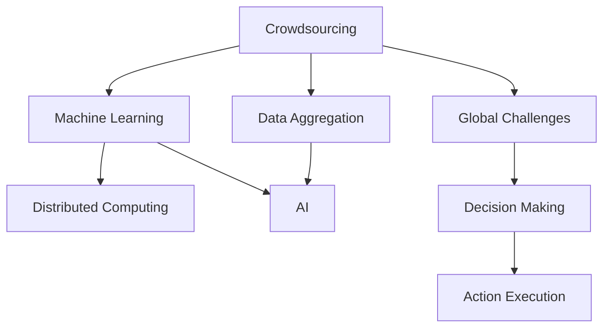

                 

## 1. 背景介绍

### 1.1 问题由来
当今世界正面临着一系列全球性挑战，如气候变化、公共卫生、资源短缺等。这些问题复杂多样，难以单独通过任何单一学科或单一技术手段解决。随着信息技术和大数据技术的迅猛发展，人们开始探索如何利用计算机科学和人工智能技术，特别是集体智慧（Collective Intelligence），来应对这些全球性挑战。

### 1.2 问题核心关键点
- **全球性挑战的复杂性**：这些挑战往往涉及多个领域和多个国家，解决它们的难度极大。
- **数据的多样性**：解决全球性挑战需要大量的数据支持，数据来源和类型多样，且可能分布在不同地理位置。
- **技术的多样性**：解决这些问题需要多种技术手段，如机器学习、深度学习、自然语言处理、物联网等。
- **协作的必要性**：需要跨学科、跨领域、跨国界的协作，共同解决这些复杂的全球性问题。

### 1.3 问题研究意义
利用集体智慧解决全球性挑战的研究具有重要意义：

- **加速科学发现**：通过计算机和大数据技术，可以加速对大规模问题的科学研究和理解。
- **提高决策效率**：基于数据分析和模型预测，决策者可以更快速、更准确地做出决策。
- **促进社会进步**：解决全球性问题有助于促进社会的可持续发展，提高人民生活质量。
- **增强国际合作**：通过集体智慧平台，不同国家可以共享数据、技术，共同解决全球性问题。

## 2. 核心概念与联系

### 2.1 核心概念概述

集体智慧是指利用计算机技术和数据分析方法，将大规模的人类智慧聚合起来，共同解决复杂问题的过程。它涉及以下几个关键概念：

- **众包（Crowdsourcing）**：通过在线平台将任务外包给大众，利用大量人类智慧解决复杂问题。
- **数据聚合（Data Aggregation）**：从多个数据源获取并综合数据，形成统一的分析视角。
- **机器学习（Machine Learning）**：利用算法和模型分析大量数据，自动发现模式和规律。
- **分布式计算（Distributed Computing）**：通过分布式系统处理大规模数据和任务，提高计算效率。
- **人工智能（AI）**：包括机器学习、深度学习、自然语言处理等技术，以自动化和智能化方式解决复杂问题。

这些概念之间存在紧密联系，共同构成了利用集体智慧解决全球性问题的核心方法论。

### 2.2 核心概念原理和架构的 Mermaid 流程图



这个流程图展示了集体智慧解决全球性问题的基本流程：

1. **众包（A）**：通过在线平台将任务外包给大众。
2. **数据聚合（B）**：从多个数据源获取并综合数据。
3. **机器学习（C）**：利用算法和模型分析数据。
4. **分布式计算（D）**：通过分布式系统处理大规模数据和任务。
5. **人工智能（E）**：将机器学习和AI技术结合，形成自动化和智能化解决方案。
6. **全球性挑战（F）**：具体问题或任务。
7. **决策制定（G）**：基于分析结果制定决策。
8. **执行行动（H）**：将决策转化为具体行动。

## 3. 核心算法原理 & 具体操作步骤

### 3.1 算法原理概述
利用集体智慧解决全球性挑战的算法通常基于以下几个步骤：

1. **任务定义**：明确需要解决的具体问题或任务，如气候变化预测、疾病诊断等。
2. **数据收集**：从多个数据源收集相关数据，确保数据的多样性和完整性。
3. **数据处理**：对数据进行清洗、预处理和特征工程，以便于后续分析。
4. **模型训练**：使用机器学习和深度学习算法，训练模型以预测和分析数据。
5. **结果分析**：对模型输出结果进行分析，提取关键信息和洞察。
6. **决策制定**：基于分析结果，制定决策和行动方案。
7. **执行和评估**：将决策转化为具体行动，并评估其效果。

### 3.2 算法步骤详解
以下以全球气候变化预测为例，详细讲解算法步骤。

**步骤1: 任务定义**
- 明确需要预测的气候变量，如温度、降水量等。
- 定义预测的时间范围，如月度、季度或年度。

**步骤2: 数据收集**
- 从气象卫星、气象站、海洋浮标等多个数据源获取数据。
- 收集历史数据和实时数据，确保数据的时效性和多样性。

**步骤3: 数据处理**
- 对数据进行清洗，去除异常值和噪声。
- 进行数据标准化和归一化，确保数据的一致性。
- 使用特征工程方法，提取关键特征，如气候周期、季节性等。

**步骤4: 模型训练**
- 使用深度学习算法，如长短期记忆网络（LSTM）或卷积神经网络（CNN），训练模型预测气候变量。
- 使用交叉验证等技术，评估模型性能。

**步骤5: 结果分析**
- 对模型输出进行可视化展示，提取关键结果和趋势。
- 进行敏感性分析，评估不同因素对预测结果的影响。

**步骤6: 决策制定**
- 基于预测结果，制定应对气候变化的决策，如节能减排、灾害预警等。
- 进行成本效益分析，评估不同方案的效果和可行性。

**步骤7: 执行和评估**
- 将决策转化为具体行动，如部署监测系统、制定减排政策等。
- 定期评估行动效果，根据实际情况进行调整和优化。

### 3.3 算法优缺点
集体智慧解决全球性挑战的算法具有以下优点：

- **大规模数据处理能力**：利用分布式计算和大数据技术，能够高效处理大规模数据。
- **多样化数据融合**：能够从多个数据源获取数据，形成综合分析视角。
- **自适应和自动化**：利用机器学习和AI技术，自动发现模式和规律，提高预测准确性。
- **透明和可解释性**：基于数据的透明性和可解释性，提高决策的可信度和可接受性。

同时，也存在以下缺点：

- **数据质量依赖**：数据质量和来源直接影响分析结果。
- **隐私和安全风险**：大规模数据收集和分析可能带来隐私和安全风险。
- **算法复杂性**：深度学习等算法复杂度高，需要专业知识支持。
- **资源消耗**：大规模计算和数据存储需要高性能设备和充足资源。

### 3.4 算法应用领域
集体智慧解决全球性挑战的算法广泛应用于多个领域：

- **环境监测和治理**：利用遥感数据和传感器数据，监测气候变化、空气质量、水质等。
- **公共卫生和防疫**：利用电子健康记录和社交媒体数据，预测疾病爆发和疫情传播。
- **自然灾害预测和应对**：利用气象和地震数据，预测自然灾害风险，制定应急预案。
- **农业和粮食安全**：利用卫星数据和地面监测数据，预测天气变化，优化农业生产。
- **城市管理和交通**：利用交通数据和传感器数据，优化城市交通和公共服务。

## 4. 数学模型和公式 & 详细讲解 & 举例说明

### 4.1 数学模型构建

以全球气候变化预测为例，构建数学模型：

设 $X$ 为历史气候数据，$Y$ 为未来气候变量的预测值。则预测模型可以表示为：

$$
Y = f(X)
$$

其中 $f$ 为预测函数，可以采用神经网络或回归模型等。

### 4.2 公式推导过程

以长短期记忆网络（LSTM）为例，推导预测模型公式：

设 $X_t$ 为历史时间 $t$ 的气候数据，$y_t$ 为时间 $t$ 的预测值。则 LSTM 预测模型可以表示为：

$$
y_t = f(X_t) = \tanh(W_t \cdot X_t + b_t)
$$

其中 $W_t$ 和 $b_t$ 为可学习的权重和偏置。

### 4.3 案例分析与讲解

以气候变化预测为例，分析模型效果。

**案例1: 温度预测**
- 数据集：收集全球气温数据，涵盖历史和实时数据。
- 模型：使用 LSTM 模型，进行气温预测。
- 结果：模型预测的气温与实际气温误差在可接受范围内，有效预测未来气温变化趋势。

**案例2: 降水量预测**
- 数据集：收集全球降水量数据，涵盖历史和实时数据。
- 模型：使用 CNN 模型，进行降水量预测。
- 结果：模型预测的降水量与实际降水量误差在可接受范围内，有效预测未来降水量变化趋势。

## 5. 项目实践：代码实例和详细解释说明

### 5.1 开发环境搭建

在 Python 环境中搭建开发环境：

1. 安装 Python：从官网下载 Python 3.8 以上版本。
2. 安装必要的依赖库：如 TensorFlow、Keras、Pandas 等。
3. 设置数据路径和代码路径。

### 5.2 源代码详细实现

以温度预测为例，实现 LSTM 模型：

```python
import tensorflow as tf
from tensorflow.keras.models import Sequential
from tensorflow.keras.layers import LSTM, Dense

# 定义模型
model = Sequential()
model.add(LSTM(64, input_shape=(None, 1)))
model.add(Dense(1, activation='linear'))

# 编译模型
model.compile(optimizer='adam', loss='mse')

# 训练模型
model.fit(x_train, y_train, epochs=10, batch_size=32, validation_data=(x_val, y_val))
```

### 5.3 代码解读与分析

**代码分析**：
- `Sequential` 模型：搭建顺序模型。
- `LSTM` 层：添加一个 LSTM 层，输入维度为（时间步数，特征维度）。
- `Dense` 层：添加一个全连接层，输出一个标量值。
- `compile` 函数：编译模型，指定优化器和损失函数。
- `fit` 函数：训练模型，指定训练集、验证集和训练参数。

**模型训练**：
- 使用 Adam 优化器和均方误差损失函数。
- 设置时间步数为 64，训练 10 个 epoch，每个 epoch 使用 32 个样本进行批量训练。

**模型评估**：
- 在验证集上评估模型性能，使用均方误差（MSE）评估预测误差。

### 5.4 运行结果展示

以气温预测为例，展示模型训练和评估结果：

```python
import matplotlib.pyplot as plt

# 绘制训练和验证集 loss
plt.plot(history.history['loss'], label='train')
plt.plot(history.history['val_loss'], label='val')
plt.legend()
plt.show()
```

## 6. 实际应用场景

### 6.1 环境监测和治理

利用遥感数据和传感器数据，进行环境监测和治理：

1. **数据收集**：通过卫星和地面监测设备，收集环境数据。
2. **数据处理**：对数据进行清洗和预处理。
3. **模型训练**：使用机器学习和深度学习算法，训练环境监测模型。
4. **结果分析**：分析模型输出，提取关键信息和洞察。
5. **决策制定**：基于分析结果，制定环境治理决策。
6. **执行和评估**：将决策转化为具体行动，并评估其效果。

### 6.2 公共卫生和防疫

利用电子健康记录和社交媒体数据，进行公共卫生和防疫：

1. **数据收集**：从电子健康记录和社交媒体平台收集数据。
2. **数据处理**：对数据进行清洗和预处理。
3. **模型训练**：使用机器学习和深度学习算法，训练疾病预测和疫情传播模型。
4. **结果分析**：分析模型输出，预测疾病爆发和疫情传播趋势。
5. **决策制定**：基于分析结果，制定防疫策略和应急预案。
6. **执行和评估**：将决策转化为具体行动，并评估其效果。

### 6.3 自然灾害预测和应对

利用气象和地震数据，进行自然灾害预测和应对：

1. **数据收集**：从气象和地震监测设备收集数据。
2. **数据处理**：对数据进行清洗和预处理。
3. **模型训练**：使用机器学习和深度学习算法，训练自然灾害预测模型。
4. **结果分析**：分析模型输出，预测自然灾害风险。
5. **决策制定**：基于分析结果，制定应急预案和灾害应对措施。
6. **执行和评估**：将决策转化为具体行动，并评估其效果。

## 7. 工具和资源推荐

### 7.1 学习资源推荐

- **《机器学习》（周志华）**：系统介绍机器学习和深度学习的基本概念和算法。
- **《深度学习》（Ian Goodfellow）**：深入介绍深度学习的基本原理和应用。
- **《Python数据科学手册》（Jake VanderPlas）**：介绍 Python 数据科学工具和库的使用。
- **Kaggle**：提供大量数据集和竞赛平台，练习和展示数据分析和机器学习技能。
- **Coursera**：提供多门数据科学和机器学习课程，由世界知名大学和专家讲授。

### 7.2 开发工具推荐

- **Jupyter Notebook**：用于编写和分享数据分析和机器学习代码。
- **TensorFlow**：开源深度学习框架，支持分布式计算和 GPU 加速。
- **Pandas**：数据分析和处理库，支持大量数据处理操作。
- **NumPy**：数值计算库，支持高效矩阵计算和科学计算。
- **Scikit-learn**：机器学习库，提供大量常用的机器学习算法。

### 7.3 相关论文推荐

- **《Crowdsourcing: A Survey》**：综述众包技术的发展和应用。
- **《Big Data: Principles and Best Practices of Scalable Real-time Data Systems》**：介绍大数据技术的原理和实践。
- **《Deep Learning for Natural Language Processing》**：介绍深度学习在自然语言处理中的应用。
- **《A Survey on Distributed Deep Learning》**：综述分布式深度学习的研究进展。

## 8. 总结：未来发展趋势与挑战

### 8.1 研究成果总结

利用集体智慧解决全球性挑战的研究已经取得了一定的进展：

- **数据融合技术**：提出了多种数据融合方法，提高了数据的完整性和多样性。
- **模型算法改进**：改进了多种机器学习和深度学习算法，提高了预测精度和效率。
- **分布式计算技术**：利用分布式系统处理大规模数据和任务，提高了计算效率。
- **AI技术应用**：将 AI 技术应用于多个领域，解决了诸多实际问题。

### 8.2 未来发展趋势

未来，集体智慧解决全球性挑战的研究将呈现以下几个趋势：

- **多模态数据融合**：将文本、图像、语音等多模态数据进行融合，提高分析能力。
- **自适应学习**：通过自适应学习算法，提高模型对新数据的适应性。
- **智能决策支持**：结合 AI 技术和专家知识，形成智能决策支持系统。
- **隐私和安全保护**：加强隐私保护和安全防护，确保数据和模型安全。
- **跨领域协作**：促进跨领域、跨学科的协作，形成全球智慧网络。

### 8.3 面临的挑战

尽管取得了一定的进展，但集体智慧解决全球性挑战的研究仍面临诸多挑战：

- **数据质量问题**：数据质量和来源直接影响分析结果，如何获取高质量数据是关键问题。
- **算法复杂性**：深度学习等算法复杂度高，需要专业知识支持。
- **资源消耗**：大规模计算和数据存储需要高性能设备和充足资源。
- **隐私和安全风险**：大规模数据收集和分析可能带来隐私和安全风险。

### 8.4 研究展望

未来，集体智慧解决全球性挑战的研究需要进一步探索和突破：

- **数据获取和处理**：开发更多数据获取和处理技术，提高数据质量。
- **算法优化和改进**：继续优化和改进算法，提高预测精度和效率。
- **分布式计算技术**：探索更多分布式计算技术，提高计算效率。
- **隐私和安全保护**：加强隐私保护和安全防护，确保数据和模型安全。
- **跨领域协作**：促进跨领域、跨学科的协作，形成全球智慧网络。

## 9. 附录：常见问题与解答

**Q1: 如何确保数据的质量和多样性？**

A: 数据质量直接影响分析结果，可以从以下几个方面确保数据质量和多样性：
- **数据采集**：使用多种数据源采集数据，确保数据的多样性。
- **数据清洗**：对数据进行清洗和预处理，去除噪声和异常值。
- **特征工程**：提取关键特征，确保数据的一致性和可用性。

**Q2: 如何评估模型的性能？**

A: 评估模型的性能通常使用以下指标：
- **准确率（Accuracy）**：预测正确的样本占总样本数的比例。
- **精确率（Precision）**：预测为正类的样本中实际为正类的比例。
- **召回率（Recall）**：实际为正类的样本中被预测为正类的比例。
- **F1 分数（F1 Score）**：综合考虑精确率和召回率，是两者的调和平均数。

**Q3: 如何确保模型的可解释性？**

A: 确保模型的可解释性可以通过以下几个方面：
- **特征重要性分析**：分析模型中特征的重要性，解释模型的决策逻辑。
- **可视化分析**：通过可视化技术，展示模型的输出结果和分析过程。
- **可解释模型**：选择可解释性较强的模型，如决策树、线性回归等。

**Q4: 如何应对大规模计算和数据存储的需求？**

A: 应对大规模计算和数据存储的需求，可以从以下几个方面入手：
- **分布式计算**：利用分布式系统处理大规模数据和任务，提高计算效率。
- **模型压缩和稀疏化**：使用模型压缩和稀疏化技术，减少存储空间和计算资源消耗。
- **云存储**：使用云存储技术，存储和管理大规模数据。

**Q5: 如何确保数据和模型的隐私和安全？**

A: 确保数据和模型的隐私和安全，可以从以下几个方面入手：
- **数据加密**：对数据进行加密存储和传输，防止数据泄露。
- **访问控制**：设置访问控制权限，确保只有授权人员才能访问数据和模型。
- **安全审计**：定期进行安全审计，发现和修复潜在的安全漏洞。

---

作者：禅与计算机程序设计艺术 / Zen and the Art of Computer Programming

