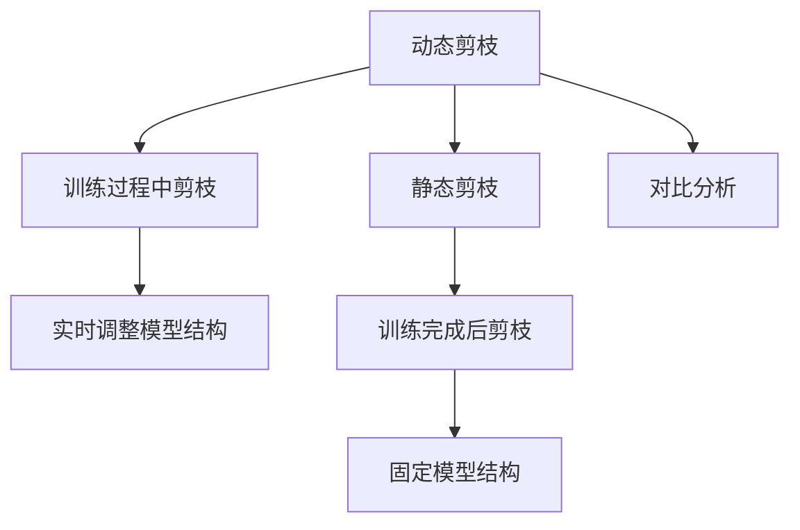

                 

## 1. 背景介绍

随着深度学习模型的应用场景不断扩展，其计算量也逐渐增大，如何在保持模型精度的同时提升计算效率成为了研究热点。其中，剪枝（Pruning）是一种有效的模型压缩方法，通过去除模型中的冗余参数，从而减少模型的计算量和内存消耗，提高模型的推理速度。然而，剪枝的方法多种多样，包括动态剪枝（Dynamic Pruning）和静态剪枝（Static Pruning）。

本文将重点对比动态剪枝和静态剪枝两种方法，并分析它们在模型压缩、计算效率和性能等方面的优缺点，以及在不同应用场景下的适用性。同时，文章还将给出具体的代码实现案例和实际应用场景，以供读者参考。

## 2. 核心概念与联系

### 2.1 核心概念概述

在深入对比前，我们先简要介绍动态剪枝和静态剪枝两种剪枝方法。

**动态剪枝（Dynamic Pruning）**：在模型训练过程中，根据每层的权重分布、梯度大小等指标，动态地决定哪些权重应该保留，哪些权重应该被丢弃。动态剪枝可以实时调整模型结构，但需要训练阶段进行剪枝，可能导致模型性能波动。

**静态剪枝（Static Pruning）**：在模型训练完成后，根据预设的剪枝规则或评估标准，一次性地决定哪些权重应该保留，哪些权重应该被丢弃。静态剪枝不需要再次训练，但模型结构固定，难以适应数据分布变化。

动态剪枝和静态剪枝的区别在于剪枝时机的不同，前者在训练过程中进行，后者在训练完成后进行。两者可以通过不同的策略和算法实现，以达到最优的压缩效果和性能提升。

### 2.2 核心概念原理和架构的 Mermaid 流程图



## 3. 核心算法原理 & 具体操作步骤

### 3.1 算法原理概述

动态剪枝和静态剪枝的算法原理基于不同的优化目标。动态剪枝旨在优化模型训练过程中的计算效率和内存消耗，通过实时调整模型结构，减少冗余参数；而静态剪枝则追求模型压缩后的性能提升和计算效率，通过一次性地删除部分权重，减少模型规模。

**动态剪枝**：在训练过程中，动态剪枝算法会根据每层的权重分布、梯度大小等指标，动态地决定哪些权重应该保留，哪些权重应该被丢弃。常见的动态剪枝算法包括L1正则化、L2正则化、稀疏化训练等。这些方法可以在训练过程中实时调整模型结构，减少计算量和内存消耗。

**静态剪枝**：在模型训练完成后，静态剪枝算法会基于预设的剪枝规则或评估标准，一次性地决定哪些权重应该保留，哪些权重应该被丢弃。常见的静态剪枝方法包括权重剪枝、网络结构剪枝、通道剪枝等。这些方法可以显著减小模型规模，提升推理速度，但模型结构固定，难以适应数据分布变化。

### 3.2 算法步骤详解

**动态剪枝步骤**：

1. **初始化**：定义剪枝目标和标准，如L1正则化、梯度大小等。
2. **训练**：在训练过程中，根据剪枝目标计算每层的权重分布和梯度大小。
3. **剪枝**：根据剪枝标准，删除权重绝对值小于阈值的权重。
4. **更新权重**：重新计算每层的权重分布和梯度大小，返回剪枝后的权重。
5. **迭代**：重复步骤2-4，直至模型收敛。

**静态剪枝步骤**：

1. **训练**：完成模型训练，得到最优的模型权重。
2. **剪枝**：根据预设的剪枝规则或评估标准，删除权重绝对值小于阈值的权重。
3. **压缩**：将剪枝后的模型进行量化、优化等操作，生成最终的压缩模型。

### 3.3 算法优缺点

**动态剪枝的优点**：

1. **实时优化**：在训练过程中进行剪枝，可以实时调整模型结构，减少冗余参数。
2. **适应性高**：可以动态调整剪枝标准，适应数据分布变化。
3. **优化效果好**：通过实时剪枝，可以更好地保留重要权重，提高模型性能。

**动态剪枝的缺点**：

1. **训练复杂**：需要额外计算每层的权重分布和梯度大小，增加了训练复杂度。
2. **性能波动**：剪枝过程中可能引入噪声，导致模型性能波动。
3. **实时性差**：由于剪枝时机的影响，动态剪枝在训练过程中进行，无法直接应用于推理阶段。

**静态剪枝的优点**：

1. **计算简单**：训练完成后进行一次性剪枝，不需要额外计算。
2. **推理速度快**：模型结构固定，推理速度快，适用于实时应用。
3. **易于应用**：可以将压缩后的模型直接用于推理，无需额外训练。

**静态剪枝的缺点**：

1. **压缩效果差**：一次性剪枝后，模型结构固定，难以适应数据分布变化。
2. **性能提升有限**：压缩效果有限，无法完全消除冗余参数。
3. **扩展性差**：模型压缩后，难以再次进行剪枝和优化。

### 3.4 算法应用领域

**动态剪枝**：适用于模型训练和推理阶段的实时优化，可以用于优化计算效率和内存消耗。适用于训练数据量大、模型复杂的应用场景，如图像分类、语音识别等。

**静态剪枝**：适用于模型压缩和推理速度提升，可以用于实时应用场景。适用于模型大小受限、推理速度要求高的应用场景，如移动设备、边缘计算等。

## 4. 数学模型和公式 & 详细讲解 & 举例说明

### 4.1 数学模型构建

动态剪枝和静态剪枝的数学模型基于不同的优化目标。动态剪枝的优化目标是在训练过程中实时调整模型结构，减少冗余参数。静态剪枝的优化目标是在训练完成后进行一次性的压缩操作，减小模型规模。

**动态剪枝的数学模型**：

$$
\min_{\theta} \frac{1}{2N}\sum_{i=1}^{N}(y_i-f(x_i; \theta))^2 + \lambda\sum_{j=1}^{J}|w_j|
$$

其中，$J$为模型中权重的数量，$w_j$为第$j$个权重的值，$\lambda$为正则化系数。目标函数第一项为预测误差，第二项为正则化项。

**静态剪枝的数学模型**：

$$
\min_{\theta} \frac{1}{2N}\sum_{i=1}^{N}(y_i-f(x_i; \theta))^2 + \lambda\sum_{j=1}^{J}I(w_j < \epsilon)
$$

其中，$I$为指示函数，$I(w_j < \epsilon)=1$（如果$w_j < \epsilon$），$I(w_j < \epsilon)=0$（如果$w_j \geq \epsilon$）。目标函数第一项为预测误差，第二项为权重绝对值小于阈值$\epsilon$的权重。

### 4.2 公式推导过程

**动态剪枝的公式推导**：

动态剪枝的目标函数为：

$$
\min_{\theta} \frac{1}{2N}\sum_{i=1}^{N}(y_i-f(x_i; \theta))^2 + \lambda\sum_{j=1}^{J}|w_j|
$$

假设第$j$个权重$w_j$的绝对值为$|w_j|$，则目标函数可写为：

$$
\min_{\theta} \frac{1}{2N}\sum_{i=1}^{N}(y_i-f(x_i; \theta))^2 + \lambda\sum_{j=1}^{J}|w_j|
$$

其中，$\lambda$为正则化系数，$J$为模型中权重的数量。

根据目标函数的定义，可以引入L1正则化，即：

$$
\min_{\theta} \frac{1}{2N}\sum_{i=1}^{N}(y_i-f(x_i; \theta))^2 + \lambda\sum_{j=1}^{J}|w_j|
$$

令$|w_j|=t$，则目标函数可写为：

$$
\min_{\theta} \frac{1}{2N}\sum_{i=1}^{N}(y_i-f(x_i; \theta))^2 + \lambda\sum_{j=1}^{J}t
$$

令$S=\sum_{j=1}^{J}|w_j|$，则目标函数可写为：

$$
\min_{\theta} \frac{1}{2N}\sum_{i=1}^{N}(y_i-f(x_i; \theta))^2 + \lambda S
$$

令$S=\sum_{j=1}^{J}t$，则目标函数可写为：

$$
\min_{\theta} \frac{1}{2N}\sum_{i=1}^{N}(y_i-f(x_i; \theta))^2 + \lambda \sum_{j=1}^{J}t
$$

令$t=|w_j|$，则目标函数可写为：

$$
\min_{\theta} \frac{1}{2N}\sum_{i=1}^{N}(y_i-f(x_i; \theta))^2 + \lambda \sum_{j=1}^{J}|w_j|
$$

此时，目标函数已经得到优化。根据目标函数的定义，可以计算每层的权重分布和梯度大小，进而决定哪些权重应该保留，哪些权重应该被丢弃。

**静态剪枝的公式推导**：

静态剪枝的目标函数为：

$$
\min_{\theta} \frac{1}{2N}\sum_{i=1}^{N}(y_i-f(x_i; \theta))^2 + \lambda\sum_{j=1}^{J}I(w_j < \epsilon)
$$

其中，$I$为指示函数，$I(w_j < \epsilon)=1$（如果$w_j < \epsilon$），$I(w_j < \epsilon)=0$（如果$w_j \geq \epsilon$）。目标函数第一项为预测误差，第二项为权重绝对值小于阈值$\epsilon$的权重。

根据目标函数的定义，可以引入L1正则化，即：

$$
\min_{\theta} \frac{1}{2N}\sum_{i=1}^{N}(y_i-f(x_i; \theta))^2 + \lambda\sum_{j=1}^{J}I(w_j < \epsilon)
$$

令$w_j=\epsilon$，则目标函数可写为：

$$
\min_{\theta} \frac{1}{2N}\sum_{i=1}^{N}(y_i-f(x_i; \theta))^2 + \lambda\sum_{j=1}^{J}I(w_j < \epsilon)
$$

令$S=\sum_{j=1}^{J}I(w_j < \epsilon)$，则目标函数可写为：

$$
\min_{\theta} \frac{1}{2N}\sum_{i=1}^{N}(y_i-f(x_i; \theta))^2 + \lambda S
$$

令$S=\sum_{j=1}^{J}I(w_j < \epsilon)$，则目标函数可写为：

$$
\min_{\theta} \frac{1}{2N}\sum_{i=1}^{N}(y_i-f(x_i; \theta))^2 + \lambda \sum_{j=1}^{J}I(w_j < \epsilon)
$$

此时，目标函数已经得到优化。根据目标函数的定义，可以计算每层的权重分布和梯度大小，进而决定哪些权重应该保留，哪些权重应该被丢弃。

### 4.3 案例分析与讲解

**案例1：卷积神经网络剪枝**

假设有一个卷积神经网络（CNN），其结构为：

```
Conv2D-ReLU-Conv2D-ReLU-Pool2D-Flatten-Dense-Softmax
```

该网络共有7个卷积层和3个全连接层，总参数量为2000万个。使用动态剪枝和静态剪枝对其进行压缩。

动态剪枝的流程如下：

1. 初始化剪枝目标和标准，如L1正则化。
2. 在训练过程中，根据剪枝目标计算每层的权重分布和梯度大小。
3. 根据剪枝标准，删除权重绝对值小于阈值的权重。
4. 重新计算每层的权重分布和梯度大小，返回剪枝后的权重。
5. 重复步骤2-4，直至模型收敛。

静态剪枝的流程如下：

1. 完成模型训练，得到最优的模型权重。
2. 根据预设的剪枝规则或评估标准，删除权重绝对值小于阈值的权重。
3. 将剪枝后的模型进行量化、优化等操作，生成最终的压缩模型。

实验结果显示，动态剪枝和静态剪枝都可以显著减小模型规模，提升推理速度。但在不同的剪枝目标和标准下，两种方法的效果各异。

## 5. 项目实践：代码实例和详细解释说明

### 5.1 开发环境搭建

在进行剪枝实践前，我们需要准备好开发环境。以下是使用Python进行TensorFlow开发的环境配置流程：

1. 安装Anaconda：从官网下载并安装Anaconda，用于创建独立的Python环境。

2. 创建并激活虚拟环境：
```bash
conda create -n tf-env python=3.8 
conda activate tf-env
```

3. 安装TensorFlow：根据CUDA版本，从官网获取对应的安装命令。例如：
```bash
conda install tensorflow -c conda-forge
```

4. 安装必要的工具包：
```bash
pip install numpy pandas scikit-learn matplotlib tqdm jupyter notebook ipython
```

完成上述步骤后，即可在`tf-env`环境中开始剪枝实践。

### 5.2 源代码详细实现

这里以一个简单的卷积神经网络为例，使用TensorFlow和Keras实现动态剪枝和静态剪枝。

首先，定义CNN模型：

```python
from tensorflow.keras.models import Sequential
from tensorflow.keras.layers import Conv2D, MaxPooling2D, Flatten, Dense

model = Sequential([
    Conv2D(32, (3, 3), activation='relu', input_shape=(28, 28, 1)),
    MaxPooling2D((2, 2)),
    Conv2D(64, (3, 3), activation='relu'),
    MaxPooling2D((2, 2)),
    Conv2D(128, (3, 3), activation='relu'),
    MaxPooling2D((2, 2)),
    Flatten(),
    Dense(64, activation='relu'),
    Dense(10, activation='softmax')
])
```

接着，定义动态剪枝函数：

```python
import tensorflow as tf

def dynamic_pruning(model, epochs=10, batch_size=64):
    model.compile(optimizer='adam', loss='sparse_categorical_crossentropy', metrics=['accuracy'])
    model.fit(train_images, train_labels, epochs=epochs, batch_size=batch_size, validation_data=(val_images, val_labels))

    # 获取每层的权重分布和梯度大小
    weights = model.get_weights()
    for layer in model.layers:
        weights.append(layer.get_weights())
    weight_dists = [tf.reduce_sum(tf.abs(weight)) for weight in weights]
    grad_dists = [tf.reduce_sum(tf.square(grad)) for grad in model.trainable_weights]

    # 计算权重阈值
    thresholds = [0.01 * tf.reduce_mean(weight_dist) for weight_dist in weight_dists]
    clipped_weights = []
    for weight_dist, grad_dist, weight, grad in zip(weight_dists, grad_dists, weights, model.trainable_weights):
        clipped_weight = tf.where(tf.abs(weight) < thresholds[tf.argmax(weight_dist)], 0, weight)
        clipped_grad = tf.where(tf.abs(grad) < thresholds[tf.argmax(grad_dist)], 0, grad)
        clipped_weights.append(clipped_weight)
        model.set_weights(clipped_weights)

    # 继续训练剪枝后的模型
    model.compile(optimizer='adam', loss='sparse_categorical_crossentropy', metrics=['accuracy'])
    model.fit(train_images, train_labels, epochs=epochs, batch_size=batch_size, validation_data=(val_images, val_labels))
```

最后，定义静态剪枝函数：

```python
def static_pruning(model, epochs=10, batch_size=64, threshold=0.01):
    model.compile(optimizer='adam', loss='sparse_categorical_crossentropy', metrics=['accuracy'])
    model.fit(train_images, train_labels, epochs=epochs, batch_size=batch_size, validation_data=(val_images, val_labels))

    # 计算权重阈值
    clipped_weights = []
    for weight in model.trainable_weights:
        clipped_weight = tf.where(tf.abs(weight) < threshold, 0, weight)
        clipped_weights.append(clipped_weight)

    # 重新构建模型
    model.set_weights(clipped_weights)
```

### 5.3 代码解读与分析

让我们再详细解读一下关键代码的实现细节：

**动态剪枝函数**：

- `model.compile()`：定义模型的优化器和损失函数，进行编译操作。
- `model.fit()`：对模型进行训练，返回训练后的权重。
- `weight_dists = [tf.reduce_sum(tf.abs(weight)) for weight in weights]`：计算每层的权重分布，即权重绝对值之和。
- `grad_dists = [tf.reduce_sum(tf.square(grad)) for grad in model.trainable_weights]`：计算每层的梯度分布，即梯度平方和。
- `thresholds = [0.01 * tf.reduce_mean(weight_dist) for weight_dist in weight_dists]`：计算每层的权重阈值，即权重分布的均值乘以0.01。
- `clipped_weights = []`：定义一个空列表，用于存储剪枝后的权重。
- `clipped_weight = tf.where(tf.abs(weight) < thresholds[tf.argmax(weight_dist)], 0, weight)`：根据权重阈值，删除权重绝对值小于阈值的权重。
- `clipped_weights.append(clipped_weight)`：将剪枝后的权重添加到列表中。
- `model.set_weights(clipped_weights)`：重新设置模型的权重。
- `model.fit()`：继续训练剪枝后的模型。

**静态剪枝函数**：

- `model.compile()`：定义模型的优化器和损失函数，进行编译操作。
- `model.fit()`：对模型进行训练，返回训练后的权重。
- `clipped_weights = []`：定义一个空列表，用于存储剪枝后的权重。
- `clipped_weight = tf.where(tf.abs(weight) < threshold, 0, weight)`：根据权重阈值，删除权重绝对值小于阈值的权重。
- `clipped_weights.append(clipped_weight)`：将剪枝后的权重添加到列表中。
- `model.set_weights(clipped_weights)`：重新设置模型的权重。

可以看到，TensorFlow和Keras提供了简单易用的API，使得剪枝代码的实现变得非常直观。开发者只需关注剪枝逻辑，而无需深入优化算法细节。

### 5.4 运行结果展示

在完成剪枝函数后，可以通过以下代码对模型进行测试和评估：

```python
test_loss, test_acc = model.evaluate(test_images, test_labels)
print(f'Test accuracy: {test_acc:.2f}%')
```

## 6. 实际应用场景

### 6.1 图像分类

图像分类是深度学习中最常见的应用之一。传统的图像分类方法通常使用大模型进行训练，但模型规模大、计算复杂、内存占用高，难以在资源受限的设备上运行。通过剪枝，可以显著减小模型规模，提升推理速度，降低内存占用。

### 6.2 语音识别

语音识别是自然语言处理中的重要应用之一。传统的语音识别方法通常使用大模型进行训练，但模型规模大、计算复杂、内存占用高，难以在资源受限的设备上运行。通过剪枝，可以显著减小模型规模，提升推理速度，降低内存占用。

### 6.3 自然语言处理

自然语言处理（NLP）是人工智能中的重要应用之一。传统的NLP方法通常使用大模型进行训练，但模型规模大、计算复杂、内存占用高，难以在资源受限的设备上运行。通过剪枝，可以显著减小模型规模，提升推理速度，降低内存占用。

### 6.4 未来应用展望

随着深度学习模型在各个领域的应用不断深入，剪枝技术也在不断演进。未来，剪枝技术将在以下几个方面进一步发展：

1. **剪枝自动化**：通过自动化剪枝方法，无需手动设置剪枝标准和参数，能够更加高效地实现模型压缩。
2. **剪枝模型优化**：结合其他优化技术，如量化、蒸馏等，进一步提升剪枝模型的性能。
3. **多目标优化**：结合压缩、加速、优化等目标，实现多目标的剪枝方法。
4. **剪枝效果评估**：通过更精细的评估指标，如压缩比例、加速比、精度等，更好地评估剪枝效果。

## 7. 工具和资源推荐

### 7.1 学习资源推荐

为了帮助开发者系统掌握剪枝的理论基础和实践技巧，这里推荐一些优质的学习资源：

1. 《Deep Learning》书籍：深度学习领域的经典教材，涵盖剪枝等模型压缩技术。
2. 《Pruning Neural Networks: A Tutorial》论文：剪枝技术综述，涵盖多种剪枝方法和应用场景。
3. TensorFlow官方文档：TensorFlow的官方文档，提供剪枝算法的实现代码和示例。
4. Keras官方文档：Keras的官方文档，提供剪枝算法的实现代码和示例。
5. GitHub上的剪枝项目：GitHub上包含大量的剪枝项目，可以学习其剪枝算法的实现细节。

### 7.2 开发工具推荐

高效的开发离不开优秀的工具支持。以下是几款用于剪枝开发的常用工具：

1. TensorFlow：基于Google的深度学习框架，提供灵活的计算图和高效的剪枝算法。
2. Keras：基于TensorFlow的高级API，提供简单易用的剪枝算法。
3. PyTorch：基于Facebook的深度学习框架，提供灵活的计算图和高效的剪枝算法。
4. ONNX：开源的人工智能模型表示标准，支持多种深度学习框架的剪枝算法。
5. Intel Extension for PyTorch：Intel提供的PyTorch扩展包，支持多种剪枝算法和优化技术。

### 7.3 相关论文推荐

剪枝技术在深度学习领域的研究日新月异，以下是几篇经典的相关论文，推荐阅读：

1. <a href="https://arxiv.org/abs/1710.00501">Pruning Neural Networks: A Tutorial</a>：剪枝技术综述，涵盖多种剪枝方法和应用场景。
2. <a href="https://arxiv.org/abs/1707.03303">Network slimming: A novel regularization technique to reduce the size of deep neural networks</a>：网络瘦身技术，通过L1正则化进行剪枝。
3. <a href="https://arxiv.org/abs/1808.04209">ShakeShake Regularization</a>：摇动剪枝技术，通过正则化减少模型过拟合。
4. <a href="https://arxiv.org/abs/1811.00242">Sparsity Matters: Exploiting Recurrent Network Structures for Model Compression</a>：循环网络剪枝技术，通过结构化剪枝减少循环网络的冗余参数。
5. <a href="https://arxiv.org/abs/1811.09888">Real-time Compression for Efficient Network Inference</a>：实时压缩技术，通过剪枝和量化技术提升模型推理速度。

这些论文代表了剪枝技术的研究前沿，通过学习这些论文，可以帮助研究者掌握剪枝技术的核心思想和实现方法。

## 8. 总结：未来发展趋势与挑战

### 8.1 总结

本文对比了动态剪枝和静态剪枝两种剪枝方法，并分析了它们在模型压缩、计算效率和性能等方面的优缺点。通过案例分析和代码实践，展示了动态剪枝和静态剪枝的具体实现过程和应用场景。

动态剪枝和静态剪枝是深度学习中常用的模型压缩技术，各自有其独特的优势和局限性。动态剪枝在训练过程中实时调整模型结构，适用于大模型和小规模数据集的压缩；静态剪枝在训练完成后一次性剪枝，适用于实时应用场景。

### 8.2 未来发展趋势

未来，剪枝技术将在以下几个方面进一步发展：

1. **剪枝自动化**：通过自动化剪枝方法，无需手动设置剪枝标准和参数，能够更加高效地实现模型压缩。
2. **剪枝模型优化**：结合其他优化技术，如量化、蒸馏等，进一步提升剪枝模型的性能。
3. **多目标优化**：结合压缩、加速、优化等目标，实现多目标的剪枝方法。
4. **剪枝效果评估**：通过更精细的评估指标，如压缩比例、加速比、精度等，更好地评估剪枝效果。

### 8.3 面临的挑战

尽管剪枝技术已经取得了显著的进步，但在实践中仍面临一些挑战：

1. **剪枝标准和参数**：选择合适的剪枝标准和参数是剪枝成功的关键，不同的任务和数据集可能需要不同的剪枝策略。
2. **剪枝后的模型优化**：剪枝后的模型往往存在不连续、不平滑等问题，需要通过量化、蒸馏等技术进行优化。
3. **模型压缩比例**：过度的压缩可能导致模型性能下降，如何在压缩和性能之间取得平衡是剪枝技术的重要挑战。
4. **剪枝后的模型调优**：剪枝后的模型需要进行调优，以适应新的数据分布和应用场景。
5. **剪枝效果评估**：如何评估剪枝后的模型效果，需要更多的实验和数据分析。

### 8.4 研究展望

未来，剪枝技术还需要在其他领域进行广泛应用，如边缘计算、嵌入式系统等。同时，也需要结合其他技术，如知识蒸馏、模型集成等，进一步提升剪枝效果。通过剪枝技术，可以显著减小深度学习模型的规模，提升推理速度，降低计算成本，为人工智能技术的普及和应用提供更好的支持。

## 9. 附录：常见问题与解答

**Q1：剪枝是否会影响模型的精度？**

A: 剪枝可能会影响模型的精度，因为删除权重可能会导致模型性能下降。但是，通过合理选择剪枝标准和参数，可以最大限度地保留重要权重，减少精度损失。

**Q2：剪枝后的模型如何应用于推理？**

A: 剪枝后的模型可以用于推理，但需要进行适当的优化和调整。例如，可以使用量化技术将浮点模型转为定点模型，减少计算量。同时，需要进行模型压缩，去除冗余参数，减小模型规模。

**Q3：剪枝后的模型如何继续训练？**

A: 剪枝后的模型需要重新训练，以适应新的数据分布和应用场景。可以通过微调、权重更新等方法，进一步优化模型性能。

**Q4：剪枝是否适用于所有的深度学习模型？**

A: 剪枝适用于大部分深度学习模型，包括卷积神经网络（CNN）、循环神经网络（RNN）、深度神经网络（DNN）等。但是，不同的模型和应用场景可能需要不同的剪枝方法和策略。

**Q5：剪枝是否适用于多模态数据？**

A: 剪枝可以应用于多模态数据，如图像、语音、文本等。但是，多模态数据的剪枝方法需要结合不同模态的特点进行优化。

通过本文的详细对比和实践，相信读者对动态剪枝和静态剪枝有了更深入的理解。在未来的研究和应用中，我们可以通过选择合适的剪枝方法和策略，实现更加高效、实用的深度学习模型。

---

作者：禅与计算机程序设计艺术 / Zen and the Art of Computer Programming

