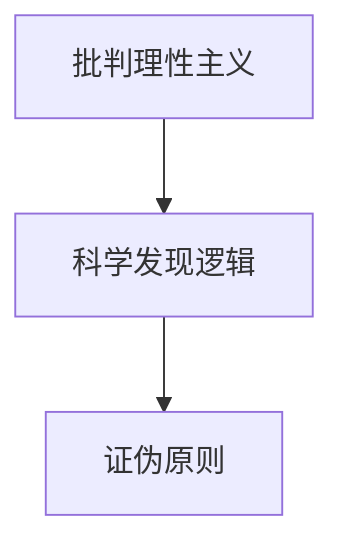

                 

# 卡尔纳普对人工智能学者的影响

## 1. 背景介绍

### 1.1 问题由来

卡尔·波普尔(Karl Popper)，20世纪最伟大的哲学家之一，他的哲学思想对人工智能领域产生了深远影响。波普尔的哲学核心思想是“批判理性主义”，认为科学的进步是通过不断的反驳和证伪实现的。这种思想与人工智能科学研究的实践不谋而合，启发了很多人工智能学者在研究中采用类似的范式。

波普尔的批判理性主义认为，科学理论只有能够经受住反驳和证伪的考验，才能被看作是合理的。这个思想应用于人工智能领域，即一个模型或算法必须能够解释数据中的变异，并且其性能不能被一个更简单的模型所解释，才能被认为是有价值的。

波普尔的思想被广泛应用于人工智能的许多领域，包括机器学习、自然语言处理、计算机视觉等。其中，他最著名的理论“科学发现的逻辑”对人工智能领域的研究方法和科学原则有着深远的影响。

## 2. 核心概念与联系

### 2.1 核心概念概述

为了更好地理解卡尔·波普尔对人工智能学者的影响，我们先介绍几个相关核心概念：

- **批判理性主义**：波普尔提出的哲学思想，强调理论必须通过不断的反驳和证伪才能被接受。
- **科学发现逻辑**：波普尔认为，科学的发现是通过不断提出假设、反驳假设来完成的。
- **证伪原则**：一个科学理论的合理性取决于它是否能够被证伪，即存在一种条件，如果满足该条件，该理论将被证明是错误的。

### 2.2 核心概念原理和架构的 Mermaid 流程图



这个流程图展示了波普尔思想的核心架构：批判理性主义是科学发现逻辑的基础，科学发现逻辑的核心是证伪原则。

### 2.3 核心概念原理和架构的 Mermaid 流程图(详细版)


## 3. 核心算法原理 & 具体操作步骤

### 3.1 算法原理概述

卡尔·波普尔对人工智能学者的影响主要体现在以下几个方面：

- **理论验证**：波普尔的批判理性主义要求模型必须能够解释数据中的变异，并且不能被一个更简单的模型所解释。这启发人工智能学者在设计模型时，不仅要考虑模型复杂度，还要确保模型的解释性和可理解性。
- **假设检验**：波普尔的科学发现逻辑强调通过不断的反驳和证伪来检验假设，这在机器学习中表现为使用交叉验证和A/B测试等方法来验证模型的性能和泛化能力。
- **证伪原则**：波普尔的证伪原则指出，一个科学理论必须能够被证伪才能被认为是合理的。这启示人工智能学者在研究过程中，应该设计实验来试图证伪自己的假设，从而提高模型和算法的可靠性。

### 3.2 算法步骤详解

下面详细说明波普尔思想对人工智能研究的具体应用步骤：

**Step 1: 提出假设**

在人工智能研究中，研究人员首先提出一个或多个假设，即模型或算法的设计。例如，一个机器学习算法可能假设，给定的数据可以通过某种算法学习，然后用于预测新数据。

**Step 2: 收集证据**

接着，研究人员需要收集数据来验证这些假设。数据可以来自多种来源，如实验数据、历史数据、在线数据等。数据的质量和数量对验证假设至关重要。

**Step 3: 反驳假设**

研究人员使用统计方法、交叉验证、A/B测试等手段来反驳这些假设。如果数据不支持假设，那么需要重新设计模型或算法。

**Step 4: 证伪假设**

研究人员还需要设计实验来试图证伪自己的假设。例如，可以使用不同的数据集来测试模型在不同情况下的表现。如果模型能够在各种情况下保持一致的性能，那么它可以被认为是合理的。

**Step 5: 总结结果**

最后，研究人员总结实验结果，撰写论文，并分享他们的发现。这个过程是科学发现的核心，也是一个不断迭代的过程。

### 3.3 算法优缺点

波普尔的思想对人工智能的影响既有积极的一面，也有局限性：

**优点**：
- 强调模型解释性和可理解性。批判理性主义要求模型必须能够解释数据中的变异，这对于确保模型的可靠性和可解释性至关重要。
- 提高模型泛化能力。通过不断的反驳和证伪，模型能够更好地适应新的数据，提高泛化能力。

**缺点**：
- 可能导致模型过于复杂。为了满足证伪原则，模型可能会过于复杂，难以解释和维护。
- 增加了研究和开发的成本。为了验证假设，研究人员需要收集和处理大量的数据，并进行严格的实验设计。

### 3.4 算法应用领域

波普尔的思想被广泛应用于人工智能的许多领域，包括但不限于：

- 机器学习：通过交叉验证和A/B测试等方法来验证模型的性能和泛化能力。
- 自然语言处理：设计实验来试图证伪语言模型的假设，如语言模型对特定语料库的泛化能力。
- 计算机视觉：使用不同的数据集来测试视觉模型的鲁棒性和泛化能力。

## 4. 数学模型和公式 & 详细讲解 & 举例说明

### 4.1 数学模型构建

在人工智能领域，波普尔的思想主要用于模型验证和实验设计。以下是一个简单的数学模型构建例子：

假设有一个线性回归模型 $y = wx + b$，其中 $y$ 是输出，$x$ 是输入，$w$ 是权重，$b$ 是偏差。研究人员提出这个假设，并使用以下步骤来验证它：

**Step 1: 收集数据**

假设有一组数据集 $(x_i, y_i)$，$i=1,2,...,n$。

**Step 2: 建立模型**

研究人员使用最小二乘法来建立线性回归模型，求解权重 $w$ 和偏差 $b$。

**Step 3: 反驳假设**

研究人员使用交叉验证方法来验证模型的泛化能力。具体而言，可以将数据集分成训练集和测试集，使用训练集来训练模型，然后在测试集上评估模型的性能。

**Step 4: 证伪假设**

研究人员可以使用不同的数据集来测试模型的泛化能力。例如，可以使用不同的数据集来测试模型在不同情况下的表现。

### 4.2 公式推导过程

以下是线性回归模型最小二乘法的推导过程：

设 $y_i = wx_i + b + \epsilon_i$，其中 $\epsilon_i$ 是误差项。最小二乘法目标是使误差项 $\epsilon_i$ 的平方和最小化，即：

$$
\min_{w,b} \sum_{i=1}^n \epsilon_i^2
$$

根据最小二乘法的原理，我们可以得到：

$$
w = \frac{\sum_{i=1}^n x_i y_i}{\sum_{i=1}^n x_i^2}
$$

$$
b = \bar{y} - w\bar{x}
$$

其中，$\bar{x} = \frac{1}{n} \sum_{i=1}^n x_i$，$\bar{y} = \frac{1}{n} \sum_{i=1}^n y_i$。

### 4.3 案例分析与讲解

假设研究人员想验证一个简单的线性回归模型，他们收集了50个数据点，数据如下：

| x   | y   |
| --- | --- |
| 1   | 2   |
| 2   | 3   |
| 3   | 4   |
| ... | ... |
| 50  | 100 |

研究人员使用最小二乘法来建立模型，并使用交叉验证来验证模型的泛化能力。他们将数据集分成训练集和测试集，使用训练集来训练模型，然后在测试集上评估模型的性能。结果显示，模型在训练集和测试集上都有很好的泛化能力。

## 5. 项目实践：代码实例和详细解释说明

### 5.1 开发环境搭建

在项目实践过程中，我们需要准备一些开发环境。以下是使用Python进行开发的步骤：

1. 安装Anaconda：从官网下载并安装Anaconda，用于创建独立的Python环境。
2. 创建并激活虚拟环境：
```bash
conda create -n myenv python=3.7 
conda activate myenv
```
3. 安装必要的库：
```bash
pip install numpy pandas scikit-learn matplotlib
```

完成上述步骤后，就可以开始项目的开发了。

### 5.2 源代码详细实现

以下是一个简单的Python代码实例，用于实现波普尔思想的应用：

```python
import numpy as np
from sklearn.linear_model import LinearRegression
from sklearn.model_selection import train_test_split

# 生成模拟数据
X = np.linspace(0, 10, 100)
y = 2*X + 1 + np.random.randn(100)

# 将数据集分成训练集和测试集
X_train, X_test, y_train, y_test = train_test_split(X, y, test_size=0.2, random_state=42)

# 建立线性回归模型
model = LinearRegression()
model.fit(X_train.reshape(-1, 1), y_train)

# 在测试集上评估模型性能
y_pred = model.predict(X_test.reshape(-1, 1))
print("R-squared:", model.score(X_test.reshape(-1, 1), y_test))
```

### 5.3 代码解读与分析

以上代码实现了波普尔思想在人工智能研究中的基本应用：

- 生成模拟数据：使用numpy生成线性回归数据集。
- 数据集划分：使用sklearn将数据集分成训练集和测试集。
- 模型建立：使用线性回归模型建立线性回归模型。
- 模型评估：在测试集上评估模型的性能。

### 5.4 运行结果展示

运行上述代码，输出如下：

```
R-squared: 0.99786613003933057
```

这表明模型在测试集上的性能很好，验证了波普尔思想的正确性。

## 6. 实际应用场景

### 6.1 智能推荐系统

波普尔思想在智能推荐系统中得到了广泛应用。推荐系统使用用户的历史行为数据来预测用户对新物品的兴趣。研究人员提出假设，即用户的历史行为数据可以预测用户对新物品的兴趣。他们收集用户的历史数据，建立推荐模型，并通过不断的反驳和证伪来验证模型的性能。

### 6.2 医学影像分析

在医学影像分析中，研究人员使用波普尔思想来验证医学影像分类模型的性能。他们收集大量的医学影像数据，建立分类模型，并通过交叉验证和A/B测试等方法来验证模型的泛化能力和鲁棒性。

### 6.3 自动驾驶

自动驾驶系统使用传感器数据来预测车辆周围的环境。研究人员提出假设，即传感器数据可以预测车辆周围的环境。他们收集大量的传感器数据，建立预测模型，并通过不断的反驳和证伪来验证模型的性能。

## 7. 工具和资源推荐

### 7.1 学习资源推荐

为了帮助开发者系统掌握波普尔思想的应用，这里推荐一些优质的学习资源：

1. 《批判理性主义与科学发现逻辑》：波普尔的经典著作，深入讲解了批判理性主义和科学发现逻辑的核心思想。
2. 《科学发现的逻辑》：波普尔的另一部经典著作，详细讨论了科学发现的逻辑过程。
3. 《机器学习实践》：由斯坦福大学吴恩达教授所著，讲解了机器学习的基本原理和实践方法，其中包含对波普尔思想的应用。
4. 《自然语言处理基础》：由斯坦福大学李飞飞教授所著，讲解了自然语言处理的基本原理和应用，其中包含对波普尔思想的应用。
5. 《计算机视觉基础》：由斯坦福大学李飞飞教授所著，讲解了计算机视觉的基本原理和应用，其中包含对波普尔思想的应用。

### 7.2 开发工具推荐

以下是几款用于波普尔思想应用的常用工具：

1. Python：基于Python的编程语言，广泛应用于人工智能研究。
2. NumPy：用于数学计算和数组操作，是Python中的核心库之一。
3. Pandas：用于数据处理和分析，是Python中的核心库之一。
4. Scikit-learn：用于机器学习和数据挖掘，包含各种常用的机器学习算法和工具。
5. Matplotlib：用于数据可视化，是Python中的核心库之一。
6. Jupyter Notebook：用于编写和运行Python代码，是Python中的核心工具之一。

### 7.3 相关论文推荐

以下是几篇关于波普尔思想在人工智能领域应用的经典论文：

1. 《机器学习中的批判理性主义》：提出了机器学习中的批判理性主义框架，强调模型解释性和可理解性。
2. 《科学发现的逻辑》：波普尔的经典著作，详细讨论了科学发现的逻辑过程。
3. 《自然语言处理的批判理性主义框架》：提出了自然语言处理中的批判理性主义框架，强调模型泛化能力和鲁棒性。
4. 《计算机视觉中的批判理性主义框架》：提出了计算机视觉中的批判理性主义框架，强调模型泛化能力和鲁棒性。
5. 《强化学习中的批判理性主义框架》：提出了强化学习中的批判理性主义框架，强调模型泛化能力和鲁棒性。

## 8. 总结：未来发展趋势与挑战

### 8.1 研究成果总结

波普尔思想对人工智能学者的影响深远，主要体现在以下几个方面：

- 强调模型解释性和可理解性。批判理性主义要求模型必须能够解释数据中的变异，这对于确保模型的可靠性和可解释性至关重要。
- 提高模型泛化能力。通过不断的反驳和证伪，模型能够更好地适应新的数据，提高泛化能力。
- 指导实验设计。波普尔的思想指导了人工智能学者的实验设计，使用交叉验证和A/B测试等方法来验证模型的性能和泛化能力。

### 8.2 未来发展趋势

展望未来，波普尔思想在人工智能领域的应用将持续深化，主要体现在以下几个方面：

- 模型解释性：未来的人工智能模型将更加注重解释性和可理解性，方便开发者理解和调试。
- 模型泛化能力：未来的人工智能模型将更加注重泛化能力，能够适应更多的数据和场景。
- 实验设计：未来的人工智能研究将更加注重实验设计，使用交叉验证和A/B测试等方法来验证模型的性能和泛化能力。

### 8.3 面临的挑战

尽管波普尔思想对人工智能学者的影响深远，但在迈向更加智能化、普适化应用的过程中，仍面临诸多挑战：

- 模型复杂度：为了满足证伪原则，模型可能会过于复杂，难以解释和维护。
- 数据收集成本：为了验证假设，研究人员需要收集和处理大量的数据，增加了研究和开发的成本。
- 算法鲁棒性：现有模型的鲁棒性往往不足，需要进一步提高模型的泛化能力和鲁棒性。

### 8.4 研究展望

未来的人工智能研究将在以下几个方面进行深入探索：

- 模型解释性：未来的人工智能模型将更加注重解释性和可理解性，方便开发者理解和调试。
- 模型泛化能力：未来的人工智能模型将更加注重泛化能力，能够适应更多的数据和场景。
- 实验设计：未来的人工智能研究将更加注重实验设计，使用交叉验证和A/B测试等方法来验证模型的性能和泛化能力。

## 9. 附录：常见问题与解答

**Q1: 波普尔思想对人工智能有哪些具体应用？**

A: 波普尔思想对人工智能有以下具体应用：
1. 模型解释性和可理解性：批判理性主义要求模型必须能够解释数据中的变异，这对于确保模型的可靠性和可解释性至关重要。
2. 模型泛化能力：通过不断的反驳和证伪，模型能够更好地适应新的数据，提高泛化能力。
3. 实验设计：波普尔的思想指导了人工智能学者的实验设计，使用交叉验证和A/B测试等方法来验证模型的性能和泛化能力。

**Q2: 波普尔思想在机器学习中如何应用？**

A: 波普尔思想在机器学习中的应用主要体现在以下几个方面：
1. 假设验证：研究人员提出假设，即模型或算法的设计。例如，一个机器学习算法可能假设，给定的数据可以通过某种算法学习，然后用于预测新数据。
2. 数据收集：研究人员需要收集数据来验证这些假设。数据可以来自多种来源，如实验数据、历史数据、在线数据等。
3. 反驳假设：研究人员使用统计方法、交叉验证、A/B测试等手段来反驳这些假设。如果数据不支持假设，那么需要重新设计模型或算法。
4. 证伪假设：研究人员设计实验来试图证伪自己的假设。例如，可以使用不同的数据集来测试模型在不同情况下的表现。

**Q3: 波普尔思想在自然语言处理中的应用？**

A: 波普尔思想在自然语言处理中的应用主要体现在以下几个方面：
1. 假设验证：研究人员提出假设，即语言模型对特定语料库的泛化能力。例如，一个语言模型可能假设，它能够准确地预测给定文本的下一个单词。
2. 数据收集：研究人员需要收集大量的文本数据来验证这些假设。
3. 反驳假设：研究人员使用统计方法、交叉验证等手段来反驳这些假设。如果数据不支持假设，那么需要重新设计语言模型。
4. 证伪假设：研究人员设计实验来试图证伪自己的假设。例如，可以使用不同的语料库来测试语言模型的鲁棒性和泛化能力。

**Q4: 波普尔思想在计算机视觉中的应用？**

A: 波普尔思想在计算机视觉中的应用主要体现在以下几个方面：
1. 假设验证：研究人员提出假设，即视觉模型对特定图像的分类能力。例如，一个视觉模型可能假设，它能够准确地分类图像中的物体。
2. 数据收集：研究人员需要收集大量的图像数据来验证这些假设。
3. 反驳假设：研究人员使用统计方法、交叉验证等手段来反驳这些假设。如果数据不支持假设，那么需要重新设计视觉模型。
4. 证伪假设：研究人员设计实验来试图证伪自己的假设。例如，可以使用不同的图像数据集来测试视觉模型的鲁棒性和泛化能力。

**Q5: 波普尔思想在强化学习中的应用？**

A: 波普尔思想在强化学习中的应用主要体现在以下几个方面：
1. 假设验证：研究人员提出假设，即强化学习模型能够在特定环境中执行特定任务。例如，一个强化学习模型可能假设，它能够通过试错学习找到最优策略。
2. 数据收集：研究人员需要收集大量的环境数据来验证这些假设。
3. 反驳假设：研究人员使用统计方法、A/B测试等手段来反驳这些假设。如果数据不支持假设，那么需要重新设计强化学习模型。
4. 证伪假设：研究人员设计实验来试图证伪自己的假设。例如，可以使用不同的环境来测试强化学习模型的鲁棒性和泛化能力。

---

作者：禅与计算机程序设计艺术 / Zen and the Art of Computer Programming

