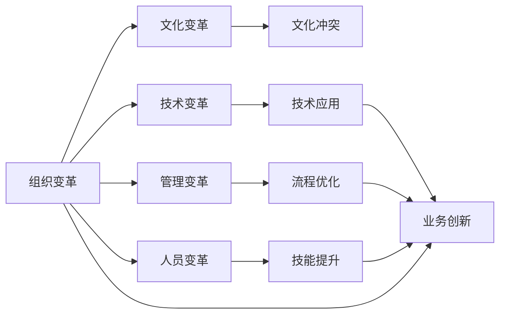

                 

# 变革管理：引导组织through转型期

## 1. 背景介绍

变革管理是组织适应内外环境变化，实现持续发展的核心战略。在快速发展的数字化时代，信息技术的飞速演进，市场环境的复杂多变，消费者需求的多元化，使得企业面临前所未有的挑战。如何通过有效的变革管理策略，快速响应市场变化，提升企业的竞争力，成为新时代企业的重大课题。

### 1.1 变革管理的重要性
变革管理不仅仅关乎企业短期业务需求的调整和优化，更是在组织文化、人才结构、技术栈等多个维度上实现深层次的转变和提升。成功的变革管理可以帮助企业建立适应性强、敏捷响应、创新驱动的核心竞争力，实现可持续、健康的发展。

#### 1.1.1 提高企业应变能力
在动态多变的市场环境中，企业需要迅速调整其战略方向和运营模式，以适应新的市场变化和客户需求。通过变革管理，企业可以建立灵活、弹性的组织结构，快速响应市场变化，保持行业领先地位。

#### 1.1.2 增强员工参与度
变革管理能够增强员工的参与感和归属感，提高员工的工作积极性和创新能力。通过明确的变革目标和透明的变革过程，员工可以更好地理解企业的战略方向，提升执行力和协作效率。

#### 1.1.3 促进技术创新
技术的快速发展为企业的转型提供了新的机遇。通过变革管理，企业可以快速整合和应用先进的技术，提升生产效率和产品竞争力，实现业务模式的创新。

### 1.2 变革管理的现状与挑战
尽管变革管理的重要性日益凸显，但实际操作中仍面临诸多挑战：

- **变革成本高**：变革管理涉及多方面的资源投入，包括资金、人力、时间等，这些投入往往需要企业在短期内承受较大压力。
- **员工抵触情绪**：变革带来的不确定性可能导致员工对未来的担忧，产生抵触情绪，影响变革推进的效率。
- **变革效果难以评估**：变革效果的评估需要较长的周期，且在转型初期，往往难以直接体现。
- **文化冲突**：企业文化与变革需求之间的冲突，可能影响变革的顺利实施。

## 2. 核心概念与联系

### 2.1 核心概念概述

变革管理涉及诸多关键概念，包括：

- **组织变革(Organizational Change)**：指企业为应对内外环境变化，对战略、结构、流程、文化等方面进行全面调整和优化的过程。
- **文化变革(Cultural Change)**：通过改变员工行为习惯和价值观，营造一种新的企业文化氛围，推动企业向变革方向发展。
- **技术变革(Technological Change)**：通过引入新技术、新工具、新方法，提升企业的技术能力和业务效率，实现转型升级。
- **管理变革(Management Change)**：通过改变企业的管理理念、组织结构、流程规范等，提升管理效率和执行能力。
- **人员变革(People Change)**：通过培训、激励、考核等手段，提升员工技能和能力，推动企业发展。

这些核心概念之间互相交织，共同构成企业变革管理的复杂生态系统。

### 2.2 核心概念原理和架构的 Mermaid 流程图



## 3. 核心算法原理 & 具体操作步骤

### 3.1 算法原理概述

变革管理可以视为一个复杂的多目标优化问题，需要平衡多个维度的因素，如组织结构、流程、技术、人员等，以实现整体最优的变革效果。其核心算法原理包括以下几个方面：

- **多目标优化**：变革管理的目标不仅包括提升企业的短期业务表现，还包括建立长期的竞争优势和可持续发展能力。
- **动态调整**：变革管理是一个动态调整的过程，需要根据环境变化和内部反馈，不断优化变革方案和实施路径。
- **利益相关者协调**：变革管理需要协调组织内部的多个利益相关者，包括管理层、员工、客户等，确保各方利益得到充分考虑和平衡。

### 3.2 算法步骤详解

变革管理的具体操作步骤可以分为以下几个阶段：

#### 3.2.1 变革准备阶段
1. **战略分析**：评估企业当前的发展状况和面临的挑战，明确变革的战略目标和方向。
2. **利益相关者分析**：识别和分析变革涉及的主要利益相关者，理解其需求和期望。
3. **资源评估**：评估变革所需的资源，包括资金、人力、时间等，制定初步的变革计划。

#### 3.2.2 变革实施阶段
1. **变革沟通**：制定有效的变革沟通策略，确保所有利益相关者理解和支持变革计划。
2. **流程改进**：根据变革目标，优化企业的业务流程和组织结构，提升效率和灵活性。
3. **技术应用**：引入新技术、新工具，提升企业的技术能力和竞争力。
4. **人员培训**：通过培训、激励等手段，提升员工的技能和适应能力，确保变革顺利推进。

#### 3.2.3 变革评估阶段
1. **绩效评估**：通过定量和定性的方法，评估变革的效果和影响，识别改进机会。
2. **反馈与调整**：根据评估结果，调整变革策略和实施路径，确保变革目标的实现。
3. **持续改进**：建立持续改进机制，保持变革的动态性和适应性。

### 3.3 算法优缺点

#### 3.3.1 优点
- **综合性强**：变革管理考虑多个维度，能够全面提升企业的综合竞争力。
- **灵活性高**：变革管理采用动态调整的方式，能够根据环境变化灵活调整策略。
- **参与度高**：变革管理强调员工的参与和贡献，能够提高员工的积极性和创新能力。

#### 3.3.2 缺点
- **复杂度高**：变革管理涉及多个维度的调整，需要综合考虑各种因素，实施难度较大。
- **成本高**：变革管理需要大量的资源投入，对企业的财务状况造成压力。
- **风险高**：变革过程中可能面临诸多不确定性，需要管理层具备较高的风险应对能力。

### 3.4 算法应用领域

变革管理在多个领域都有广泛应用，包括：

- **企业转型升级**：帮助企业从传统模式向数字化、智能化方向转型，提升业务效率和竞争力。
- **组织结构优化**：通过优化组织结构和流程，提升企业的运营效率和管理能力。
- **人力资源管理**：通过人才培训、激励和考核，提升员工技能和适应能力，优化人力资源结构。
- **市场策略调整**：根据市场变化，调整企业的市场策略和产品规划，提升市场竞争力。
- **技术创新**：引入新技术、新工具，提升企业的技术能力和创新能力。

## 4. 数学模型和公式 & 详细讲解 & 举例说明

### 4.1 数学模型构建

变革管理的数学模型可以表示为多目标优化问题：

$$
\min \left\{
\begin{aligned}
&f_1(\boldsymbol{x}) = C_{\text{revenue}} - C_{\text{cost}} \\
&f_2(\boldsymbol{x}) = K_{\text{innovation}} - K_{\text{risks}} 
\end{aligned}
\right.
$$

其中，$\boldsymbol{x}$ 为决策变量，包括组织结构、流程、技术、人员等。$f_1(\boldsymbol{x})$ 和 $f_2(\boldsymbol{x})$ 分别表示企业的短期业务表现和长期发展潜力。$C_{\text{revenue}}$ 和 $C_{\text{cost}}$ 分别表示企业的收入和成本，$K_{\text{innovation}}$ 和 $K_{\text{risks}}$ 分别表示企业的创新能力和风险水平。

### 4.2 公式推导过程

以组织结构优化为例，其数学模型可以表示为：

$$
\min \left\{
\begin{aligned}
&\sum_{i=1}^n c_i \cdot x_i \\
&\sum_{i=1}^n a_i \cdot x_i \leq b \\
&x_i \geq 0
\end{aligned}
\right.
$$

其中，$c_i$ 表示第 $i$ 个组织结构选项的成本，$a_i$ 表示其对企业目标的贡献，$b$ 表示资源约束，$x_i$ 表示选择第 $i$ 个组织结构选项的数量。

通过线性规划等方法求解上述优化问题，可以得到最优的组织结构方案。

### 4.3 案例分析与讲解

#### 4.3.1 案例背景
某企业计划从传统制造业向数字化转型，提升产品竞争力。企业现有的组织结构已无法满足转型需求，需要进行优化。

#### 4.3.2 模型构建
构建如下优化模型：

$$
\min \left\{
\begin{aligned}
&c_1 \cdot x_1 + c_2 \cdot x_2 + c_3 \cdot x_3 \\
&a_1 \cdot x_1 + a_2 \cdot x_2 + a_3 \cdot x_3 \leq b \\
&x_1 \geq 0, x_2 \geq 0, x_3 \geq 0
\end{aligned}
\right.
$$

其中，$c_i$ 表示第 $i$ 个组织结构选项的成本，$a_i$ 表示其对企业目标的贡献，$b$ 表示资源约束，$x_i$ 表示选择第 $i$ 个组织结构选项的数量。

#### 4.3.3 求解过程
通过使用LINDO等软件，求解上述优化模型，可以得到最优的组织结构方案。

#### 4.3.4 结果分析
通过优化组织结构，企业可以显著降低运营成本，提升创新能力，增强市场竞争力。

## 5. 项目实践：代码实例和详细解释说明

### 5.1 开发环境搭建

变革管理项目的开发环境搭建需要考虑以下几个方面：

1. **选择开发平台**：选择适合企业需求的开发平台，如Java、Python等。
2. **安装依赖库**：安装必要的开发依赖库和工具，如JDK、Anaconda等。
3. **配置开发环境**：配置开发环境，包括IDE、Git等工具，建立项目的开发架构。

### 5.2 源代码详细实现

#### 5.2.1 变革管理框架

以下是一个基于Python的变革管理框架的代码实现：

```python
import numpy as np
from scipy.optimize import linprog

class ChangeManagement:
    def __init__(self):
        self.c = np.array([c1, c2, c3])  # 成本向量
        self.a = np.array([a1, a2, a3])  # 贡献向量
        self.b = b  # 资源约束
        self.x = np.array([0, 0, 0])  # 初始决策变量

    def solve(self):
        result = linprog(self.c, self.a, self.b, x0=self.x)
        return result.x
```

#### 5.2.2 决策支持系统

为了支持企业决策，可以开发决策支持系统，帮助企业进行数据分析和优化。以下是一个简单的决策支持系统的代码实现：

```python
import pandas as pd
from sklearn.linear_model import LinearRegression

class DecisionSupportSystem:
    def __init__(self, data_path):
        self.data = pd.read_csv(data_path)
        self.model = LinearRegression()

    def train(self):
        X = self.data[['cost', 'contribution']]
        y = self.data['resource']
        self.model.fit(X, y)

    def predict(self, cost, contribution):
        X = np.array([[cost, contribution]])
        y = self.model.predict(X)
        return y
```

### 5.3 代码解读与分析

#### 5.3.1 变革管理框架

变革管理框架的核心代码如下：

```python
import numpy as np
from scipy.optimize import linprog

class ChangeManagement:
    def __init__(self):
        self.c = np.array([c1, c2, c3])  # 成本向量
        self.a = np.array([a1, a2, a3])  # 贡献向量
        self.b = b  # 资源约束
        self.x = np.array([0, 0, 0])  # 初始决策变量

    def solve(self):
        result = linprog(self.c, self.a, self.b, x0=self.x)
        return result.x
```

其中，`ChangeManagement`类表示变革管理框架，包括成本、贡献和资源约束等关键变量。`solve`方法使用`linprog`函数求解优化问题，得到最优的决策变量。

#### 5.3.2 决策支持系统

决策支持系统的核心代码如下：

```python
import pandas as pd
from sklearn.linear_model import LinearRegression

class DecisionSupportSystem:
    def __init__(self, data_path):
        self.data = pd.read_csv(data_path)
        self.model = LinearRegression()

    def train(self):
        X = self.data[['cost', 'contribution']]
        y = self.data['resource']
        self.model.fit(X, y)

    def predict(self, cost, contribution):
        X = np.array([[cost, contribution]])
        y = self.model.predict(X)
        return y
```

其中，`DecisionSupportSystem`类表示决策支持系统，包括数据读取、模型训练和预测等功能。`train`方法使用`LinearRegression`模型训练决策模型，`predict`方法使用训练好的模型进行预测。

## 6. 实际应用场景

### 6.1 企业转型升级

企业转型升级是变革管理的重要应用场景之一。通过变革管理，企业可以迅速调整战略方向和业务模式，实现数字化、智能化转型，提升市场竞争力。

#### 6.1.1 案例分析
某制造业企业通过变革管理，从传统生产模式向数字化生产模式转型，提升了生产效率和产品质量，实现了业务的快速增长。

#### 6.1.2 实施过程
1. **战略分析**：评估企业的当前状况和市场环境，明确转型的战略目标。
2. **利益相关者分析**：识别主要利益相关者，理解其需求和期望。
3. **变革沟通**：制定有效的变革沟通策略，确保所有利益相关者理解和支持变革计划。
4. **流程改进**：优化生产流程和组织结构，提升生产效率。
5. **技术应用**：引入数字化生产设备和智能系统，提升生产自动化水平。
6. **人员培训**：提升员工技能和适应能力，确保变革顺利推进。

### 6.2 组织结构优化

组织结构优化是变革管理的另一个重要应用场景。通过变革管理，企业可以优化组织结构，提升管理效率和运营能力。

#### 6.2.1 案例分析
某跨国企业通过变革管理，优化了其全球组织结构，提升了管理效率和响应速度，实现了业务的持续增长。

#### 6.2.2 实施过程
1. **战略分析**：评估企业的当前组织结构和管理模式，明确优化目标。
2. **利益相关者分析**：识别主要利益相关者，理解其需求和期望。
3. **变革沟通**：制定有效的变革沟通策略，确保所有利益相关者理解和支持变革计划。
4. **流程改进**：优化管理流程和组织结构，提升管理效率。
5. **技术应用**：引入先进的管理工具和系统，提升管理信息化水平。
6. **人员培训**：提升员工技能和适应能力，确保变革顺利推进。

### 6.3 人力资源管理

人力资源管理是变革管理的核心组成部分。通过变革管理，企业可以优化人力资源结构，提升员工能力和工作积极性。

#### 6.3.1 案例分析
某金融企业通过变革管理，优化了其人力资源结构，提升了员工技能和适应能力，实现了业务的快速增长。

#### 6.3.2 实施过程
1. **战略分析**：评估企业的人力资源状况和市场环境，明确优化目标。
2. **利益相关者分析**：识别主要利益相关者，理解其需求和期望。
3. **变革沟通**：制定有效的变革沟通策略，确保所有利益相关者理解和支持变革计划。
4. **流程改进**：优化人力资源流程和结构，提升人力资源效率。
5. **技术应用**：引入先进的人力资源管理系统，提升人力资源信息化水平。
6. **人员培训**：提升员工技能和适应能力，确保变革顺利推进。

## 7. 工具和资源推荐

### 7.1 学习资源推荐

变革管理的核心在于系统的理论知识和实践经验。以下是几本推荐的学习资源：

1. 《变革管理：现代企业的变革之道》：详细介绍了变革管理的理论基础和实践技巧，适合企业高管和变革管理者阅读。
2. 《组织变革与领导力》：探讨了组织变革对领导力的影响，提供了实用的变革管理案例和策略。
3. 《数字化转型：企业变革的实践指南》：介绍了数字化转型的理论基础和实践方法，适合企业领导者和管理人员阅读。
4. 《变革管理：理论与实践》：提供系统的变革管理理论和方法，适合商学院学生和企业员工阅读。
5. 《敏捷变革：现代企业的创新之道》：探讨了敏捷变革的实践方法和工具，适合企业敏捷管理者阅读。

### 7.2 开发工具推荐

变革管理的开发过程中需要大量的数据分析和决策支持，以下是几款推荐的开发工具：

1. **Python**：Python是数据科学和人工智能领域的标准语言，具备强大的数据分析和建模能力。
2. **R语言**：R语言是数据分析和统计建模的重要工具，适合科学研究和数据挖掘。
3. **JDK**：Java是一种高性能、高可扩展性的编程语言，适合开发企业级应用程序。
4. **Anaconda**：Anaconda是一款Python科学计算平台，支持多种Python库和工具。
5. **Tableau**：Tableau是一款强大的数据可视化工具，适合进行复杂的数据分析和报表制作。

### 7.3 相关论文推荐

变革管理是一个多学科交叉的研究领域，涉及管理学、心理学、信息技术等多个学科。以下是几篇推荐的相关论文：

1. "Managing Organizational Change: Theory and Practice"（《组织变革与管理实践》）：详细介绍了组织变革的理论基础和实践方法。
2. "Leading Change: Breaking Through the Cycle of Expert-Powered Change"（《变革领导力：打破专家驱动的变革周期》）：探讨了变革领导力的理论和方法。
3. "Digital Transformation: A Practical Guide for Enterprise Change Management"（《数字化转型：企业变革管理的实践指南》）：介绍了数字化转型的理论基础和实践方法。
4. "Agile Change Management: Mastering the Practice of Agile Change"（《敏捷变革管理：敏捷变革的实践方法》）：探讨了敏捷变革的实践方法和工具。
5. "The Five Dysfunctions of a Team: A Leadership Fable"（《团队的五大障碍：领导力的寓言》）：探讨了团队变革的理论和方法。

## 8. 总结：未来发展趋势与挑战

### 8.1 总结

变革管理是企业适应内外环境变化，实现持续发展的核心战略。本文对变革管理的核心概念、算法原理和操作步骤进行了详细讲解，并通过具体案例分析，展示了变革管理在企业转型升级、组织结构优化、人力资源管理等场景中的应用。同时，本文推荐了相关学习资源、开发工具和研究论文，帮助读者全面掌握变革管理的理论和实践。

通过本文的系统梳理，可以看到，变革管理不仅仅是一个技术问题，更是一个复杂的组织和管理问题。只有在理论和实践的结合下，才能实现企业的高效和可持续发展。

### 8.2 未来发展趋势

展望未来，变革管理将呈现以下几个发展趋势：

1. **数字化驱动**：数字化技术将成为变革管理的重要驱动力，帮助企业实现快速响应和敏捷调整。
2. **数据驱动**：大数据和人工智能技术将为变革管理提供更加科学的决策依据，提高变革的科学性和有效性。
3. **全球化视野**：全球化市场环境将要求企业具备更强的国际竞争力和全球视野，推动变革管理向全球化方向发展。
4. **人本化管理**：以人为中心的管理理念将成为变革管理的重要方向，提升员工的参与度和归属感。
5. **多学科融合**：变革管理将越来越多地与心理学、社会学、经济学等多个学科进行融合，形成跨学科的创新方法。

### 8.3 面临的挑战

尽管变革管理的重要性日益凸显，但在实际操作中仍面临诸多挑战：

1. **变革成本高**：变革管理涉及多方面的资源投入，对企业的财务状况造成压力。
2. **员工抵触情绪**：变革带来的不确定性可能导致员工对未来的担忧，产生抵触情绪。
3. **变革效果难以评估**：变革效果的评估需要较长的周期，且在转型初期，往往难以直接体现。
4. **文化冲突**：企业文化与变革需求之间的冲突，可能影响变革的顺利实施。

### 8.4 研究展望

未来的变革管理研究需要从多个方向进行突破：

1. **数字化变革路径**：探索数字化变革的最佳路径和实施方法，提高企业的数字化转型效率。
2. **员工参与机制**：建立员工参与和激励机制，提高员工的积极性和创新能力。
3. **变革风险管理**：构建变革风险管理框架，帮助企业应对变革过程中可能出现的各种风险。
4. **多学科融合**：推动变革管理与心理学、社会学、经济学等多个学科的深度融合，形成跨学科的创新方法。
5. **人工智能应用**：利用人工智能技术，提高变革管理的科学性和有效性，实现数据驱动的决策。

## 9. 附录：常见问题与解答

**Q1：变革管理与组织管理有什么区别？**

A: 变革管理侧重于企业内部的战略调整和业务优化，是组织管理的重要组成部分。组织管理则更广泛，包括组织架构、流程、文化等多个方面的管理，是企业运营的核心。

**Q2：变革管理需要多久才能见效？**

A: 变革管理的效果体现需要较长的周期，一般需要几个月甚至数年的时间才能显著见效。企业需要耐心等待变革过程，避免在短期内频繁调整策略。

**Q3：变革管理需要多少人力投入？**

A: 变革管理需要投入多方面的资源，包括人力、资金、时间等。具体投入需要根据企业的规模和复杂度进行评估。

**Q4：如何衡量变革管理的效果？**

A: 变革管理的效果可以通过多个指标进行评估，包括业务指标（如收入、利润等）、管理指标（如流程效率、管理成本等）、员工指标（如员工满意度、流失率等）。评估需要结合具体情境进行综合判断。

**Q5：变革管理中如何进行风险控制？**

A: 变革管理中的风险控制可以从多个方面进行：制定详细的风险管理计划，明确风险预警机制，建立多方参与的沟通机制，进行定期风险评估等。

本文从多个角度系统介绍了变革管理的核心概念、算法原理和操作步骤，并通过具体案例分析，展示了变革管理在企业转型升级、组织结构优化、人力资源管理等场景中的应用。未来，变革管理将继续在企业数字化转型和组织管理中发挥重要作用，成为企业实现持续发展的重要战略工具。

