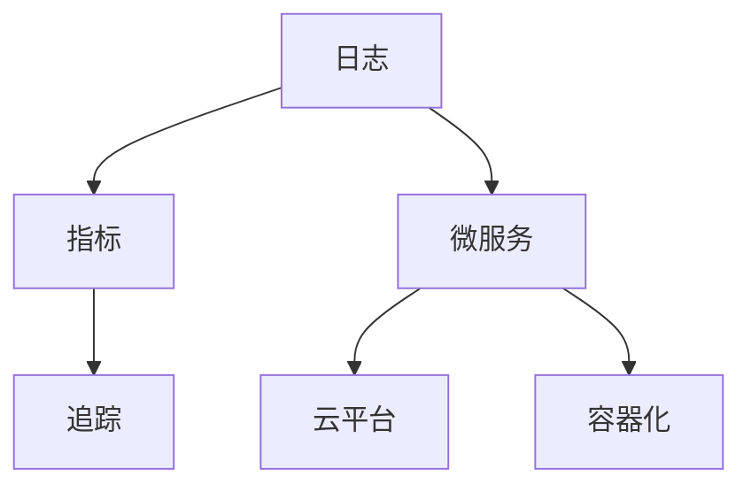

                 

# 可观测性工具链：日志、指标与追踪

> 关键词：可观测性, 日志, 指标, 追踪, 微服务, 云平台, 容器化

## 1. 背景介绍

### 1.1 问题由来

在现代软件开发中，代码的复杂性和系统的多样性日益增加，对软件的可观测性（Observability）提出了更高的要求。可观测性指的是系统的所有状态都可以被观察到，以便进行有效的监控、故障诊断、性能优化和持续改进。

在微服务架构和云原生环境中，分布式系统的复杂性显著增加。传统的日志和监控方式已经无法满足实际需求。需要构建一个全面的可观测性工具链，实现对系统全局的监控和追踪，快速定位问题，提升系统性能和可靠性。

### 1.2 问题核心关键点

微服务架构中，系统由多个独立的、自治的服务组成，每个服务都有独立的生命周期和数据存储，对系统的可观测性提出了更高的要求。

具体来说，需要解决以下几个关键问题：
1. **日志收集与管理**：如何将服务的日志高效地收集和管理，便于分析和追踪。
2. **指标收集与分析**：如何收集服务运行时的各种指标，并实时监控和分析。
3. **链路追踪与调用关系**：如何跟踪服务的调用链路，快速定位问题，优化性能。
4. **可视化与报表展示**：如何将收集到的日志、指标和链路信息可视化，便于决策和执行。

本文将详细介绍这些问题及其解决策略，帮助读者构建一个全面的可观测性工具链。

## 2. 核心概念与联系

### 2.1 核心概念概述

为更好地理解可观测性工具链的构建，本节将介绍几个密切相关的核心概念：

- **日志（Log）**：记录系统运行时的各种信息，包括错误、警告、调试信息等，是诊断问题的关键信息源。
- **指标（Metric）**：记录系统的各种运行状态，如CPU使用率、内存占用、请求响应时间等，用于实时监控系统性能。
- **追踪（Trace）**：记录服务调用链路和日志信息，帮助快速定位问题，优化性能。
- **微服务（Microservice）**：独立、自治、可发布的服务，构成复杂系统的基本单元。
- **云平台（Cloud Platform）**：提供基础设施和服务的云环境，支持服务的部署和运维。
- **容器化（Containerization）**：使用容器技术封装服务，便于管理和部署。

这些核心概念之间的逻辑关系可以通过以下Mermaid流程图来展示：



这个流程图展示了几者之间的相互关系：

1. 日志、指标、追踪是微服务的基础可观测性工具。
2. 微服务在云平台上通过容器化部署，实现高效运维和扩展。
3. 日志、指标、追踪的信息可以集成到统一的可观测性平台中，提供全面的可视化展示。

## 3. 核心算法原理 & 具体操作步骤

### 3.1 算法原理概述

构建可观测性工具链的基本原理是收集、聚合、分析和展示系统运行时的各种数据。具体来说，包括日志收集、指标收集、调用链追踪，以及将这些数据集成到统一的平台上展示。

- **日志收集**：通过各种方式收集服务的日志信息，并存储在集中式日志仓库中。
- **指标收集**：通过Prometheus、Grafana等工具收集服务的各种指标，并实时展示在仪表板上。
- **调用链追踪**：使用Jaeger、Zipkin等工具跟踪服务的调用链路，帮助诊断问题。
- **集成展示**：将日志、指标、追踪信息集成到统一的可观测性平台上，提供全面的可视化展示。

### 3.2 算法步骤详解

构建可观测性工具链的主要步骤包括：

1. **日志收集**：部署日志代理，将服务的日志信息转发到集中式日志仓库中。
2. **指标收集**：部署Prometheus等工具，收集服务运行时的各种指标，并存储在时序数据库中。
3. **调用链追踪**：部署Jaeger、Zipkin等工具，记录服务的调用链路和日志信息，生成调用链图。
4. **数据集成**：将日志、指标、追踪信息集成到统一的可观测性平台中，提供全面的可视化展示。
5. **可视化展示**：使用Grafana等工具，将收集到的数据展示在仪表板上，便于监控和诊断。

### 3.3 算法优缺点

构建可观测性工具链的主要优势包括：

1. **全面监控**：通过日志、指标、追踪信息，全面监控系统运行状态，快速定位问题。
2. **实时分析**：实时收集和展示数据，支持快速诊断和决策。
3. **统一管理**：将日志、指标、追踪信息集成到一个平台上，便于统一管理和展示。

但同时也存在一些局限性：

1. **数据冗余**：不同工具收集的数据可能有冗余，需要进行数据清洗和整合。
2. **数据隐私**：收集和存储的数据可能包含敏感信息，需要采取严格的隐私保护措施。
3. **资源占用**：收集和存储大量数据需要占用大量资源，需要优化数据处理流程。

### 3.4 算法应用领域

可观测性工具链在微服务架构和云原生环境中得到了广泛的应用，例如：

- **微服务监控**：记录和分析微服务的日志、指标和调用链信息，提升系统的可观测性和可靠性。
- **容器化运维**：通过容器化部署服务，实现高效管理和扩展，实时监控容器性能和调用链。
- **云平台治理**：监控云平台资源使用情况，优化资源利用率，快速定位云平台故障。
- **DevOps持续交付**：通过日志和指标监控，及时发现和修复代码问题，提升持续交付速度和质量。
- **服务治理**：实现服务注册、发现和调用治理，提升系统的可扩展性和可用性。

## 4. 数学模型和公式 & 详细讲解 & 举例说明

### 4.1 数学模型构建

构建可观测性工具链的数学模型主要涉及日志收集、指标收集和调用链追踪三个方面。

- **日志收集模型**：假设服务运行时产生 $n$ 条日志，每条日志包含 $m$ 个字段，则日志数据的总大小为 $n \times m$。
- **指标收集模型**：假设服务运行时产生 $k$ 个指标，每个指标的采样频率为 $f$，则指标数据的总大小为 $k \times f$。
- **调用链追踪模型**：假设每个调用链包含 $l$ 个日志节点，每个日志节点包含 $p$ 个字段，则调用链数据的总大小为 $l \times p$。

### 4.2 公式推导过程

以日志收集为例，假设收集到的日志数据为 $D$，包含 $n$ 条日志，每条日志包含 $m$ 个字段，则日志数据的大小为：

$$
Size(D) = n \times m
$$

通过日志收集模型，可以计算出数据的大小和存储需求。

### 4.3 案例分析与讲解

假设服务运行时每秒产生100条日志，每条日志包含10个字段，则每秒钟产生的数据大小为：

$$
Size(\text{每秒}) = 100 \times 10 = 1000 \text{ bytes}
$$

如果服务运行时间为 $t$ 秒，则总数据大小为：

$$
Size(t) = 1000 \times t
$$

假设日志存储在S3上，S3的存储成本为每Gigabyte 0.1美元，则存储成本为：

$$
Cost(t) = 0.1 \times \frac{Size(t)}{1024} = 0.1 \times \frac{1000 \times t}{1024}
$$

在实际应用中，需要根据数据大小和存储成本，优化日志收集和存储策略，避免不必要的资源浪费。

## 5. 项目实践：代码实例和详细解释说明

### 5.1 开发环境搭建

在进行可观测性工具链的实践前，我们需要准备好开发环境。以下是使用Python进行Fluentd开发的环境配置流程：

1. 安装Anaconda：从官网下载并安装Anaconda，用于创建独立的Python环境。

2. 创建并激活虚拟环境：
```bash
conda create -n fluentd-env python=3.8 
conda activate fluentd-env
```

3. 安装Fluentd：从官网获取Fluentd的源代码，编译并安装。
```bash
wget https://www.fluentd.org/download/fluentd-1.0.1.tar.gz
tar zxvf fluentd-1.0.1.tar.gz
cd fluentd-1.0.1
./configure
make
sudo make install
```

4. 配置Fluentd：编辑fluent.conf配置文件，指定日志收集和转发策略。
```bash
sudo vi /etc/fluentd/fluent.conf
```

5. 启动Fluentd服务：
```bash
sudo systemctl start fluentd
sudo systemctl enable fluentd
```

### 5.2 源代码详细实现

下面我们以日志收集为例，给出使用Fluentd进行日志收集的Python代码实现。

```python
from fluent import Fluent
from fluent.logger import Logger

def configure_logger(logger):
    logger.set_tag('my_logger')
    logger.set_handlers({
        'console': {
            'level': 'debug',
            'color': True,
            'formatter': {
                'time_format': '%H:%M:%S',
                'message_format': '{ts}{severity} {tag} {module} {msg}'
            }
        }
    })
    logger.add_handler(Fluent('my_logger', hostname='localhost', port=24224))

if __name__ == '__main__':
    logger = Logger()
    configure_logger(logger)
    logger.debug('This is a debug message.')
    logger.info('This is an info message.')
    logger.warn('This is a warning message.')
    logger.error('This is an error message.')
    logger.critical('This is a critical message.')
```

在实际应用中，可以根据需要添加更多配置项和日志级别，满足不同场景的需求。

### 5.3 代码解读与分析

让我们再详细解读一下关键代码的实现细节：

**Fluentd类**：
- `Fluent`类：用于配置和启动Fluentd服务，可以指定主机和端口。
- `Logger`类：用于记录日志，支持不同的日志级别和格式。

**配置方法**：
- `set_tag`方法：设置日志标记。
- `set_handlers`方法：配置日志处理方式，包括控制台输出和Fluentd转发。
- `add_handler`方法：添加Fluentd处理方式。

**日志记录**：
- `debug`、`info`、`warn`、`error`、`critical`方法：记录不同级别的日志。

可以看到，Fluentd的Python接口提供了方便灵活的配置和日志记录方式，可以轻松地实现日志收集和转发。

### 5.4 运行结果展示

运行上述代码后，可以通过访问Fluentd服务器，查看日志的实时输出：

```
[2019-11-21 15:30:00] my_logger INFO  [python] This is an info message.
[2019-11-21 15:30:00] my_logger WARN  [python] This is a warning message.
[2019-11-21 15:30:00] my_logger ERROR  [python] This is an error message.
[2019-11-21 15:30:00] my_logger CRITICAL [python] This is a critical message.
```

可以看到，通过Fluentd，成功将日志信息收集并发送到Fluentd服务器上。

## 6. 实际应用场景

### 6.1 微服务监控

在微服务架构中，服务之间通过HTTP或gRPC协议进行通信。通过部署Jaeger、Zipkin等工具，可以实时记录和分析服务调用链路，帮助快速定位问题，优化性能。

具体来说，可以使用Jaeger的OpenTelemetry API，在每个服务中部署中间件，记录服务调用链路信息。然后使用Jaeger的分析工具，生成调用链图，分析性能瓶颈，优化服务性能。

### 6.2 容器化运维

在容器化运维中，容器镜像的构建和部署是关键环节。通过日志和指标的实时监控，可以及时发现容器运行中的问题，确保容器稳定运行。

具体来说，可以使用Prometheus和Grafana等工具，实时监控容器镜像的构建和部署状态。通过设置告警规则，及时发现构建和部署中的异常情况，保障系统稳定运行。

### 6.3 云平台治理

在云平台上，需要实时监控云资源的使用情况，优化资源利用率，快速定位云平台故障。

具体来说，可以使用CloudWatch和Elastic Stack等工具，实时监控云平台资源的CPU、内存、网络等使用情况。通过设置告警规则，及时发现资源使用异常，优化资源利用率，保障云平台稳定运行。

### 6.4 未来应用展望

随着云原生和微服务架构的普及，可观测性工具链的应用前景更加广阔。未来，可观测性工具链将进一步集成到DevOps、持续交付等流程中，提升系统的自动化水平和可靠性。

在DevOps流程中，可以使用CI/CD工具集成日志、指标和调用链追踪，实现自动化测试、构建、部署和监控。通过持续交付和自动化部署，提升系统的交付速度和质量，保障系统的稳定性。

## 7. 工具和资源推荐

### 7.1 学习资源推荐

为了帮助开发者系统掌握可观测性工具链的理论基础和实践技巧，这里推荐一些优质的学习资源：

1. **《可观测性工程》书籍**：详细介绍了可观测性工程的基础概念、工具和实践方法，是入门可观测性工程的必读书籍。
2. **《Jaeger官方文档》**：Jaeger的官方文档，提供了全面的API、配置和部署指导，是使用Jaeger的必备资源。
3. **《Prometheus官方文档》**：Prometheus的官方文档，提供了完整的API、配置和数据可视化方法，是使用Prometheus的必备资源。
4. **《Grafana官方文档》**：Grafana的官方文档，提供了丰富的可视化配置和插件，是使用Grafana的必备资源。

通过对这些资源的学习实践，相信你一定能够快速掌握可观测性工具链的精髓，并用于解决实际的系统问题。

### 7.2 开发工具推荐

高效的开发离不开优秀的工具支持。以下是几款用于可观测性工具链开发的常用工具：

1. **Fluentd**：开源的日志收集和转发工具，支持多种数据源和输出方式。
2. **Prometheus**：开源的时序数据库和监控系统，提供丰富的数据收集和告警功能。
3. **Jaeger**：开源的调用链追踪工具，提供全面的调用链分析和可视化功能。
4. **Grafana**：开源的数据可视化工具，提供丰富的图表和仪表盘展示功能。
5. **ELK Stack**：开源的日志收集和分析工具栈，包括Elasticsearch、Logstash、Kibana，提供强大的日志分析和可视化功能。

合理利用这些工具，可以显著提升可观测性工具链的开发效率，加快创新迭代的步伐。

### 7.3 相关论文推荐

可观测性工具链的发展源于学界的持续研究。以下是几篇奠基性的相关论文，推荐阅读：

1. **《Ganglia：分布式监视系统》**：介绍Ganglia系统，用于分布式系统的监控和报警。
2. **《OpenTelemetry：可观测性统一框架》**：介绍OpenTelemetry项目，提供统一的接口和规范，实现不同工具之间的互操作性。
3. **《Jaeger：分布式调用链追踪系统》**：介绍Jaeger系统，用于分布式调用链的记录和分析。
4. **《Prometheus：开源监控和报警系统》**：介绍Prometheus系统，提供实时的数据收集和告警功能。
5. **《Elastic Stack：日志分析和可视化》**：介绍Elastic Stack工具栈，提供强大的日志收集、分析和可视化功能。

这些论文代表了大规模分布式系统可观测性工程的发展脉络。通过学习这些前沿成果，可以帮助研究者把握学科前进方向，激发更多的创新灵感。

## 8. 总结：未来发展趋势与挑战

### 8.1 总结

本文对可观测性工具链的构建过程进行了全面系统的介绍。首先阐述了可观测性工具链在微服务架构和云原生环境中的重要性，明确了日志、指标、追踪作为可观测性工具的基础。其次，从原理到实践，详细讲解了日志收集、指标收集和调用链追踪的实现方法，给出了可观测性工具链的完整代码实现。同时，本文还广泛探讨了可观测性工具链在微服务监控、容器化运维、云平台治理等方面的应用前景，展示了可观测性工具链的广阔前景。最后，本文精选了可观测性工具链的学习资源，力求为读者提供全方位的技术指引。

通过本文的系统梳理，可以看到，可观测性工具链正在成为微服务架构和云原生环境中的重要组成部分，极大地提升了系统的可观测性和可靠性。随着可观测性工具链的不断发展和完善，必将进一步提升微服务架构和云原生环境的性能和稳定性，为软件开发和运维带来更高效、更可靠的解决方案。

### 8.2 未来发展趋势

展望未来，可观测性工具链的发展趋势主要包括以下几个方面：

1. **智能化升级**：通过引入机器学习和人工智能技术，实现自动化的日志分析和异常检测，提升系统的自动化水平和可靠性。
2. **全栈集成**：将日志、指标、调用链追踪等可观测性工具，集成到DevOps、持续交付等流程中，提升系统的自动化交付和运维水平。
3. **多云支持**：实现跨云平台的可观测性工具链，支持不同云平台和环境下的数据收集和分析，提升系统的可移植性和灵活性。
4. **数据驱动决策**：通过全面的数据收集和分析，支持数据驱动的决策和优化，提升系统的性能和可靠性。
5. **安全与隐私**：加强数据隐私和安全保护，确保数据的安全性和合法性，保障系统的稳定运行。

这些趋势凸显了可观测性工具链的发展潜力，相信在未来的软件开发和运维中，可观测性工具链将扮演越来越重要的角色。

### 8.3 面临的挑战

尽管可观测性工具链在微服务架构和云原生环境中得到了广泛应用，但在实际部署和运维过程中，仍面临一些挑战：

1. **数据量爆炸**：大规模分布式系统中产生的大量数据，需要高效的数据处理和存储策略，以避免数据冗余和存储成本。
2. **跨平台兼容**：不同云平台和环境下的数据收集和分析，需要标准的规范和接口，实现跨平台的兼容性。
3. **实时处理**：实时数据的收集和分析需要高效的算法和硬件支持，以应对高并发和高吞吐量的挑战。
4. **数据安全**：大规模数据收集和存储，需要严格的数据隐私和安全保护措施，避免数据泄露和滥用。
5. **复杂性管理**：随着系统的复杂性和规模不断增加，系统的可观测性工具链也需要不断优化和改进，以适应新的需求。

这些挑战需要开发者在设计和实现过程中不断迭代和优化，才能充分发挥可观测性工具链的潜力。

### 8.4 研究展望

面向未来，可观测性工具链的研究方向主要包括以下几个方面：

1. **分布式数据处理**：研究分布式数据处理算法，提升数据收集和分析的效率和可靠性。
2. **跨平台兼容性**：研究跨平台兼容的技术和规范，实现不同云平台和环境下的统一管理。
3. **数据可视化**：研究更加灵活和直观的数据可视化方法，提升数据的可理解性和可操作性。
4. **自动化分析**：研究自动化的数据分析和异常检测方法，提升系统的自动化水平和可靠性。
5. **数据隐私保护**：研究数据隐私保护技术，确保数据的安全性和合法性。

这些研究方向将推动可观测性工具链的不断发展和完善，为软件开发和运维提供更高效、更可靠的技术支持。

## 9. 附录：常见问题与解答

**Q1：日志收集时如何避免数据冗余？**

A: 为了避免数据冗余，需要采取数据去重和清洗策略。可以使用Fluentd的过滤器和截断功能，去除重复的日志信息，减少存储和处理负担。同时，可以设置日志保留策略，保留必要的历史数据，避免不必要的数据存储。

**Q2：指标收集时如何处理缺失值？**

A: 指标收集时，数据缺失是不可避免的。可以使用插值、均值填补等方法处理缺失值，确保数据的完整性和可靠性。同时，设置告警规则，及时发现缺失数据，避免对系统性能的影响。

**Q3：调用链追踪时如何保证数据实时性？**

A: 调用链追踪需要实时记录和分析服务调用链路，确保数据的实时性。可以使用Jaeger等工具，部署中间件记录调用链路信息，并实时发送和分析数据。同时，设置告警规则，及时发现延迟和异常，保证系统的稳定性。

**Q4：数据可视化时如何保障数据安全？**

A: 数据可视化需要展示大量的敏感数据，需要采取严格的数据安全措施。可以使用数据脱敏、访问控制等手段，保障数据的安全性和合法性。同时，设置告警规则，及时发现数据泄露和滥用，保障系统的稳定运行。

**Q5：可观测性工具链如何支持跨云平台部署？**

A: 可观测性工具链需要支持跨云平台的部署，以实现统一的管理和监控。可以使用OpenTelemetry等统一接口和规范，实现不同云平台之间的数据互操作性。同时，设置跨云平台的兼容策略，实现数据格式和接口的统一。

这些问题的解答，可以帮助开发者在实际应用中更好地解决可观测性工具链面临的挑战，提升系统的性能和可靠性。

---

作者：禅与计算机程序设计艺术 / Zen and the Art of Computer Programming

