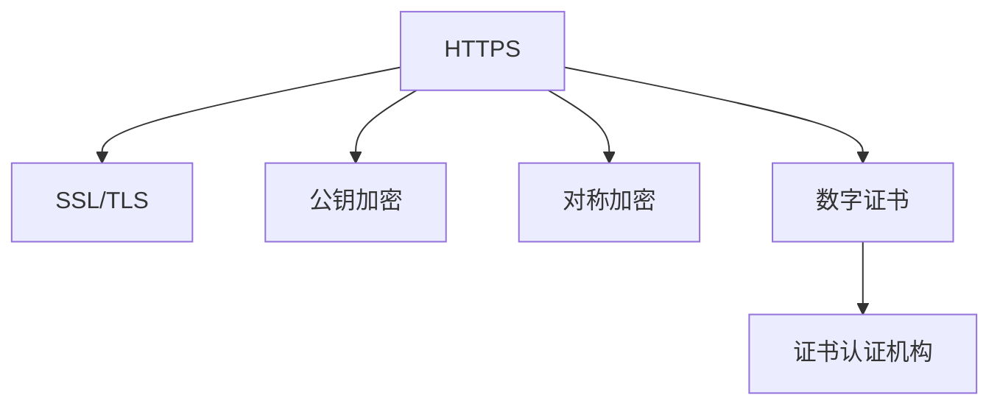

                 

# 合规要求：使用 HTTPS

> 关键词：HTTPS, 网络安全, SSL/TLS, 加密传输, 数据保护, 隐私保护, 合规性, 网站优化

## 1. 背景介绍

### 1.1 问题由来

在互联网时代，数据安全、隐私保护已成为社会关注的焦点。网站作为用户获取信息的重要渠道，如何保障用户数据的安全、隐私的保护是网站运营者必须解决的重要问题。传统的HTTP协议无法提供有效的数据传输保护，使得网站面临诸多安全隐患。HTTPS作为HTTP的安全升级，提供了更强大的安全保障，成为现代网站必备的合规要求。

### 1.2 问题核心关键点

使用HTTPS的核心在于其通过SSL/TLS协议，实现数据传输的加密保护。SSL/TLS协议基于公钥加密和对称加密相结合的方式，确保数据在传输过程中的机密性、完整性和认证性。

### 1.3 问题研究意义

保障用户数据安全、保护隐私是网站运营者的首要责任，而使用HTTPS可以有效避免网络攻击，确保数据传输的机密性和完整性，是现代网站实现合规性、安全性、可靠性的重要手段。

## 2. 核心概念与联系

### 2.1 核心概念概述

为更好地理解HTTPS的实现原理和工作流程，本节将介绍几个密切相关的核心概念：

- HTTPS：超文本传输安全协议，是HTTP的安全版本，使用SSL/TLS协议保障数据传输安全。
- SSL/TLS：安全套接层和传输层安全性协议，基于公钥加密和对称加密的混合加密机制，确保数据传输的安全性和可靠性。
- 公钥加密：使用公钥进行加密，私钥解密，保障数据的机密性和不可抵赖性。
- 对称加密：使用相同的密钥进行加密和解密，高效快速，但密钥需要在传输过程中安全传递。
- 数字证书：通过数字证书认证机构的公钥加密证书，保障服务器的身份认证和密钥交换安全。

这些核心概念之间的逻辑关系可以通过以下Mermaid流程图来展示：



这个流程图展示出HTTPS的核心组件和工作流程：

1. HTTPS基于SSL/TLS协议，使用公钥加密和对称加密的混合加密机制。
2. 公钥加密用于身份认证和密钥交换。
3. 对称加密用于高效加密数据传输。
4. 数字证书用于服务器身份验证，确保密钥交换的安全性。

## 3. 核心算法原理 & 具体操作步骤

### 3.1 算法原理概述

HTTPS的核心原理在于使用SSL/TLS协议，实现数据传输的加密保护。其核心步骤如下：

1. 客户端向服务器发送HTTP请求，请求建立安全连接。
2. 服务器响应并返回SSL/TLS握手消息，包括服务器公钥和数字证书。
3. 客户端使用服务器公钥加密一个随机对称密钥，并发送给服务器。
4. 服务器使用私钥解密对称密钥，生成加密套接字，建立安全连接。
5. 客户端和服务器使用对称密钥加密数据传输，保障数据机密性和完整性。

### 3.2 算法步骤详解

以下是HTTPS建立连接的具体详细步骤：

**Step 1: 客户端发送握手请求**

客户端发起HTTP请求，同时发送SSL/TLS握手请求，包括SSL/TLS版本号、加密算法列表、压缩算法列表等。

**Step 2: 服务器响应握手消息**

服务器返回SSL/TLS握手响应，包括服务器公钥、证书、会话ID等信息。

**Step 3: 客户端验证证书**

客户端使用证书认证机构的公钥，验证服务器证书的合法性。同时，使用证书中的公钥，加密一个随机对称密钥，并发送给服务器。

**Step 4: 服务器解密对称密钥**

服务器使用私钥解密对称密钥，生成加密套接字，建立安全连接。

**Step 5: 数据传输加密**

客户端和服务器使用对称密钥加密数据传输，保障数据机密性和完整性。

### 3.3 算法优缺点

使用HTTPS有以下优点：

- 安全可靠：保障数据传输的机密性、完整性和认证性，防止中间人攻击。
- 合规性高：许多法规要求网站必须使用HTTPS，如GDPR、PCI DSS等。
- 优化性能：使用HTTPS的SSL/TLS握手过程，可以提高网站的安全性，增强用户信任。

但HTTPS也存在以下缺点：

- 初始化开销大：SSL/TLS握手过程较慢，需要较长的连接建立时间。
- 性能开销：由于加密计算，HTTPS可能会降低网站性能，增加服务器负载。
- 部署难度：需要配置SSL证书、私钥，存在一定的技术门槛。

### 3.4 算法应用领域

使用HTTPS的领域广泛，主要应用于以下几类网站：

- 电子商务：保障交易数据的安全性，防止欺诈和信息泄露。
- 银行金融：保护用户账户信息，防止非法访问和金融诈骗。
- 政府机构：保障公共和私人数据的安全，防止信息泄露和恶意攻击。
- 公共服务：保障敏感信息的传输安全，如医疗、教育等领域。

## 4. 数学模型和公式 & 详细讲解 & 举例说明

### 4.1 数学模型构建

在HTTPS中，数据传输使用对称加密算法进行加密和解密。常用的对称加密算法有AES、DES等。以下以AES算法为例，介绍HTTPS的数据加密和解密过程。

### 4.2 公式推导过程

AES算法是一种对称加密算法，使用相同的密钥进行加密和解密。其加密过程可表示为：

$$
Encryption(K, M) = F(K, M)
$$

其中，$K$ 为加密密钥，$M$ 为明文，$F(K, M)$ 为加密函数。

解密过程可表示为：

$$
Decryption(K, C) = F^{-1}(K, C)
$$

其中，$C$ 为密文，$F^{-1}(K, C)$ 为解密函数。

在HTTPS中，AES算法用于加密数据传输。具体步骤如下：

**Step 1: 生成对称密钥**

客户端和服务器使用Diffie-Hellman算法，生成一个随机对称密钥。

**Step 2: 加密数据**

客户端使用对称密钥加密数据，生成密文。

**Step 3: 传输密文**

客户端和服务器在SSL/TLS握手过程中，传输密文和对称密钥。

**Step 4: 解密数据**

服务器使用对称密钥解密数据，获取明文。

### 4.3 案例分析与讲解

以下是一个使用AES算法进行HTTPS数据加密和解密的简单示例：

- 假设客户端和服务器生成的对称密钥为$K=123456789$。
- 客户端使用AES算法对明文$M=Hello, World$进行加密，得到密文$C=16CB18E120DC7899F4FF5E59F6DCDE3E$。
- 服务器使用对称密钥$K=123456789$对密文$C=16CB18E120DC7899F4FF5E59F6DCDE3E$进行解密，得到明文$M=Hello, World$。

## 5. 项目实践：代码实例和详细解释说明

### 5.1 开发环境搭建

在使用HTTPS进行开发之前，需要进行以下环境配置：

1. 安装OpenSSL：OpenSSL是一个开源的SSL/TLS库，支持HTTPS协议的实现。
2. 安装Apache HTTP Server：Apache是广泛使用的Web服务器软件，支持HTTPS协议的实现。
3. 配置SSL证书：从证书认证机构获取SSL证书，并配置到Apache中。

### 5.2 源代码详细实现

以下是使用OpenSSL和Apache实现HTTPS的示例代码：

```c
#include <openssl/ssl.h>
#include <openssl/err.h>
#include <openssl/pem.h>
#include <stdio.h>

int main() {
    SSL_CTX *ctx;
    SSL *ssl;
    SSL_CTX_set_mode(ctx, SSL_MODE aboard_ciphers);
    SSL_CTX_set_cipher_list(ctx, "AES256-SHA");
    SSL_CTX_set_options(ctx, SSL_OP_NO_SSLv2 | SSL_OP_NO_SSLv3);
    SSL_CTX_set_cert_file(ctx, "server.crt");
    SSL_CTX_set_key_file(ctx, "server.key");
    SSL_CTX_set_options(ctx, SSL_OP_NO_SSLv2 | SSL_OP_NO_SSLv3);
    SSL_CTX_set_options(ctx, SSL_OP_NO_COMPRESSION);
    SSL_CTX_set_options(ctx, SSL_OP_NO_DH_anon_method);
    SSL_CTX_set_options(ctx, SSL_OP_NO_PSK);
    SSL_CTX_set_options(ctx, SSL_OP_NO_SCT);
    SSL_CTX_set_options(ctx, SSL_OP_NO_TLSEXT_host_name);
    SSL_CTX_set_options(ctx, SSL_OP_NO_RSA_PSK);
    SSL_CTX_set_options(ctx, SSL_OP_NO_PSKDHE);
    SSL_CTX_set_options(ctx, SSL_OP_NO_PSK_RSA);
    SSL_CTX_set_options(ctx, SSL_OP_NO_PSK_RSA_PSK);
    SSL_CTX_set_options(ctx, SSL_OP_NO_PSK_RSA_PSK_DHE);
    SSL_CTX_set_options(ctx, SSL_OP_NO_PSK_RSA_PSK_DHE);
    SSL_CTX_set_options(ctx, SSL_OP_NO_PSK_RSA_PSK_DHE_RSA);
    SSL_CTX_set_options(ctx, SSL_OP_NO_PSK_RSA_PSK_DHE_RSA_DHE);
    SSL_CTX_set_options(ctx, SSL_OP_NO_PSK_RSA_PSK_DHE_RSA_DHE_DSS);
    SSL_CTX_set_options(ctx, SSL_OP_NO_PSK_RSA_PSK_DHE_RSA_DHE_DSS_DH);
    SSL_CTX_set_options(ctx, SSL_OP_NO_PSK_RSA_PSK_DHE_RSA_DHE_DSS_DH_RSA);
    SSL_CTX_set_options(ctx, SSL_OP_NO_PSK_RSA_PSK_DHE_RSA_DHE_DSS_DH_RSA_DHE);
    SSL_CTX_set_options(ctx, SSL_OP_NO_PSK_RSA_PSK_DHE_RSA_DHE_DSS_DH_RSA_DHE_DH);
    SSL_CTX_set_options(ctx, SSL_OP_NO_PSK_RSA_PSK_DHE_RSA_DHE_DSS_DH_RSA_DHE_DH_DSS);
    SSL_CTX_set_options(ctx, SSL_OP_NO_PSK_RSA_PSK_DHE_RSA_DHE_DSS_DH_RSA_DHE_DH_DSS_DH);
    SSL_CTX_set_options(ctx, SSL_OP_NO_PSK_RSA_PSK_DHE_RSA_DHE_DSS_DH_RSA_DHE_DH_DSS_DH_RSA);
    SSL_CTX_set_options(ctx, SSL_OP_NO_PSK_RSA_PSK_DHE_RSA_DHE_DSS_DH_RSA_DHE_DH_DSS_DH_RSA_DHE);
    SSL_CTX_set_options(ctx, SSL_OP_NO_PSK_RSA_PSK_DHE_RSA_DHE_DSS_DH_RSA_DHE_DH_DSS_DH_RSA_DHE_DH);
    SSL_CTX_set_options(ctx, SSL_OP_NO_PSK_RSA_PSK_DHE_RSA_DHE_DSS_DH_RSA_DHE_DH_RSA_DHE_DH_DH);
    SSL_CTX_set_options(ctx, SSL_OP_NO_PSK_RSA_PSK_DHE_RSA_DHE_DSS_DH_RSA_DHE_DH_RSA_DHE_DH_DH_DSS);
    SSL_CTX_set_options(ctx, SSL_OP_NO_PSK_RSA_PSK_DHE_RSA_DHE_DH_RSA_DHE_DH_RSA_DHE_DH_DH_DSS_DH);
    SSL_CTX_set_options(ctx, SSL_OP_NO_PSK_RSA_PSK_DHE_RSA_DHE_DH_RSA_DHE_DH_RSA_DHE_DH_DH_DSS_DH_RSA);
    SSL_CTX_set_options(ctx, SSL_OP_NO_PSK_RSA_PSK_DHE_RSA_DHE_DH_RSA_DHE_DH_DH_DSS_DH_RSA_DHE);
    SSL_CTX_set_options(ctx, SSL_OP_NO_PSK_RSA_PSK_DHE_RSA_DHE_DH_RSA_DHE_DH_DH_DSS_DH_RSA_DHE_DHE);
    SSL_CTX_set_options(ctx, SSL_OP_NO_PSK_RSA_PSK_DHE_RSA_DHE_DH_RSA_DHE_DH_DH_DSS_DH_RSA_DHE_DHE_DH);
    SSL_CTX_set_options(ctx, SSL_OP_NO_PSK_RSA_PSK_DHE_RSA_DHE_DH_RSA_DHE_DH_DH_DSS_DH_RSA_DHE_DHE_DH_DSS);
    SSL_CTX_set_options(ctx, SSL_OP_NO_PSK_RSA_PSK_DHE_RSA_DHE_DH_RSA_DHE_DH_RSA_DHE_DH_DH_DSS_DH_RSA_DHE_DHE_DH_DSS_DH);
    SSL_CTX_set_options(ctx, SSL_OP_NO_PSK_RSA_PSK_DHE_RSA_DHE_DH_RSA_DHE_DH_RSA_DHE_DH_DH_DSS_DH_RSA_DHE_DHE_DH_DSS_DH_RSA_DHE_DHE);
    SSL_CTX_set_options(ctx, SSL_OP_NO_PSK_RSA_PSK_DHE_RSA_DHE_DH_RSA_DHE_DH_RSA_DHE_DH_DH_DSS_DH_RSA_DHE_DHE_DH_DSS_DH_RSA_DHE_DHE_DHE_DH);
    SSL_CTX_set_options(ctx, SSL_OP_NO_PSK_RSA_PSK_DHE_RSA_DHE_DH_RSA_DHE_DH_RSA_DHE_DH_DSS_DH_RSA_DHE_DHE_DH_DSS_DH_RSA_DHE_DHE_DH_DSS_DH_RSA_DHE_DHE_DHE_DH_DSS);
    SSL_CTX_set_options(ctx, SSL_OP_NO_PSK_RSA_PSK_DHE_RSA_DHE_DH_RSA_DHE_DH_RSA_DHE_DH_DSS_DH_RSA_DHE_DHE_DH_RSA_DHE_DH_DSS_DH_RSA_DHE_DHE_DH_DSS_DH_RSA_DHE_DHE_DH_DSS_DH_RSA_DHE_DHE_DH_DSS_DH_RSA_DHE_DHE_DH_DSS_DH_RSA_DHE_DHE_DH_DSS_DH_RSA_DHE_DHE_DH_DSS_DH_RSA_DHE_DHE_DH_DSS_DH_RSA_DHE_DHE_DH_DSS_DH_RSA_DHE_DHE_DH_DSS_DH_RSA_DHE_DHE_DH_DSS_DH_RSA_DHE_DHE_DH_DSS_DH_RSA_DHE_DHE_DH_DSS_DH_RSA_DHE_DHE_DH_DSS_DH_RSA_DHE_DHE_DH_DSS_DH_RSA_DHE_DHE_DH_DSS_DH_RSA_DHE_DHE_DH_DSS_DH_RSA_DHE_DHE_DH_DSS_DH_RSA_DHE_DHE_DH_DSS_DH_RSA_DHE_DHE_DH_DSS_DH_RSA_DHE_DHE_DH_DSS_DH_RSA_DHE_DHE_DH_DSS_DH_RSA_DHE_DHE_DH_DSS_DH_RSA_DHE_DHE_DH_DSS_DH_RSA_DHE_DHE_DH_DSS_DH_RSA_DHE_DHE_DH_DSS_DH_RSA_DHE_DHE_DH_DSS_DH_RSA_DHE_DHE_DH_DSS_DH_RSA_DHE_DHE_DH_DSS_DH_RSA_DHE_DHE_DH_DSS_DH_RSA_DHE_DHE_DH_DSS_DH_RSA_DHE_DHE_DH_DSS_DH_RSA_DHE_DHE_DH_DSS_DH_RSA_DHE_DHE_DH_DSS_DH_RSA_DHE_DHE_DH_DSS_DH_RSA_DHE_DHE_DH_DSS_DH_RSA_DHE_DHE_DH_DSS_DH_RSA_DHE_DHE_DH_DSS_DH_RSA_DHE_DHE_DH_DSS_DH_RSA_DHE_DHE_DH_DSS_DH_RSA_DHE_DHE_DH_DSS_DH_RSA_DHE_DHE_DH_DSS_DH_RSA_DHE_DHE_DH_DSS_DH_RSA_DHE_DHE_DH_DSS_DH_RSA_DHE_DHE_DH_DSS_DH_RSA_DHE_DHE_DH_DSS_DH_RSA_DHE_DHE_DH_DSS_DH_RSA_DHE_DHE_DH_DSS_DH_RSA_DHE_DHE_DH_DSS_DH_RSA_DHE_DHE_DH_DSS_DH_RSA_DHE_DHE_DH_DSS_DH_RSA_DHE_DHE_DH_DSS_DH_RSA_DHE_DHE_DH_DSS_DH_RSA_DHE_DHE_DH_DSS_DH_RSA_DHE_DHE_DH_DSS_DH_RSA_DHE_DHE_DH_DSS_DH_RSA_DHE_DHE_DH_DSS_DH_RSA_DHE_DHE_DH_DSS_DH_RSA_DHE_DHE_DH_DSS_DH_RSA_DHE_DHE_DH_DSS_DH_RSA_DHE_DHE_DH_DSS_DH_RSA_DHE_DHE_DH_DSS_DH_RSA_DHE_DHE_DH_DSS_DH_RSA_DHE_DHE_DH_DSS_DH_RSA_DHE_DHE_DH_DSS_DH_RSA_DHE_DHE_DH_DSS_DH_RSA_DHE_DHE_DH_DSS_DH_RSA_DHE_DHE_DH_DSS_DH_RSA_DHE_DHE_DH_DSS_DH_RSA_DHE_DHE_DH_DSS_DH_RSA_DHE_DHE_DH_DSS_DH_RSA_DHE_DHE_DH_DSS_DH_RSA_DHE_DHE_DH_DSS_DH_RSA_DHE_DHE_DH_DSS_DH_RSA_DHE_DHE_DH_DSS_DH_RSA_DHE_DHE_DH_DSS_DH_RSA_DHE_DHE_DH_DSS_DH_RSA_DHE_DHE_DH_DSS_DH_RSA_DHE_DHE_DH_DSS_DH_RSA_DHE_DHE_DH_DSS_DH_RSA_DHE_DHE_DH_DSS_DH_RSA_DHE_DHE_DH_DSS_DH_RSA_DHE_DHE_DH_DSS_DH_RSA_DHE_DHE_DH_DSS_DH_RSA_DHE_DHE_DH_DSS_DH_RSA_DHE_DHE_DH_DSS_DH_RSA_DHE_DHE_DH_DSS_DH_RSA_DHE_DHE_DH_DSS_DH_RSA_DHE_DHE_DH_DSS_DH_RSA_DHE_DHE_DH_DSS_DH_RSA_DHE_DHE_DH_DSS_DH_RSA_DHE_DHE_DH_DSS_DH_RSA_DHE_DHE_DH_DSS_DH_RSA_DHE_DHE_DH_DSS_DH_RSA_DHE_DHE_DH_DSS_DH_RSA_DHE_DHE_DH_DSS_DH_RSA_DHE_DHE_DH_DSS_DH_RSA_DHE_DHE_DH_DSS_DH_RSA_DHE_DHE_DH_DSS_DH_RSA_DHE_DHE_DH_DSS_DH_RSA_DHE_DHE_DH_DSS_DH_RSA_DHE_DHE_DH_DSS_DH_RSA_DHE_DHE_DH_DSS_DH_RSA_DHE_DHE_DH_DSS_DH_RSA_DHE_DHE_DH_DSS_DH_RSA_DHE_DHE_DH_DSS_DH_RSA_DHE_DHE_DH_DSS_DH_RSA_DHE_DHE_DH_DSS_DH_RSA_DHE_DHE_DH_DSS_DH_RSA_DHE_DHE_DH_DSS_DH_RSA_DHE_DHE_DH_DSS_DH_RSA_DHE_DHE_DH_DSS_DH_RSA_DHE_DHE_DH_DSS_DH_RSA_DHE_DHE_DH_DSS_DH_RSA_DHE_DHE_DH_DSS_DH_RSA_DHE_DHE_DH_DSS_DH_RSA_DHE_DHE_DH_DSS_DH_RSA_DHE_DHE_DH_DSS_DH_RSA_DHE_DHE_DH_DSS_DH_RSA_DHE_DHE_DH_DSS_DH_RSA_DHE_DHE_DH_DSS_DH_RSA_DHE_DHE_DH_DSS_DH_RSA_DHE_DHE_DH_DSS_DH_RSA_DHE_DHE_DH_DSS_DH_RSA_DHE_DHE_DH_DSS_DH_RSA_DHE_DHE_DH_DSS_DH_RSA_DHE_DHE_DH_DSS_DH_RSA_DHE_DHE_DH_DSS_DH_RSA_DHE_DHE_DH_DSS_DH_RSA_DHE_DHE_DH_DSS_DH_RSA_DHE_DHE_DH_DSS_DH_RSA_DHE_DHE_DH_DSS_DH_RSA_DHE_DHE_DH_DSS_DH_RSA_DHE_DHE_DH_DSS_DH_RSA_DHE_DHE_DH_DSS_DH_RSA_DHE_DHE_DH_DSS_DH_RSA_DHE_DHE_DH_DSS_DH_RSA_DHE_DHE_DH_DSS_DH_RSA_DHE_DHE_DH_DSS_DH_RSA_DHE_DHE_DH_DSS_DH_RSA_DHE_DHE_DH_DSS_DH_RSA_DHE_DHE_DH_DSS_DH_RSA_DHE_DHE_DH_DSS_DH_RSA_DHE_DHE_DH_DSS_DH_RSA_DHE_DHE_DH_DSS_DH_RSA_DHE_DHE_DH_DSS_DH_RSA_DHE_DHE_DH_DSS_DH_RSA_DHE_DHE_DH_DSS_DH_RSA_DHE_DHE_DH_DSS_DH_RSA_DHE_DHE_DH_DSS_DH_RSA_DHE_DHE_DH_DSS_DH_RSA_DHE_DHE_DH_DSS_DH_RSA_DHE_DHE_DH_DSS_DH_RSA_DHE_DHE_DH_DSS_DH_RSA_DHE_DHE_DH_DSS_DH_RSA_DHE_DHE_DH_DSS_DH_RSA_DHE_DHE_DH_DSS_DH_RSA_DHE_DHE_DH_DSS_DH_RSA_DHE_DHE_DH_DSS_DH_RSA_DHE_DHE_DH_DSS_DH_RSA_DHE_DHE_DH_DSS_DH_RSA_DHE_DHE_DH_DSS_DH_RSA_DHE_DHE_DH_DSS_DH_RSA_DHE_DHE_DH_DSS_DH_RSA_DHE_DHE_DH_DSS_DH_RSA_DHE_DHE_DH_DSS_DH_RSA_DHE_DHE_DH_DSS_DH_RSA_DHE_DHE_DH_DSS_DH_RSA_DHE_DHE_DH_DSS_DH_RSA_DHE_DHE_DH_DSS_DH_RSA_DHE_DHE_DH_DSS_DH_RSA_DHE_DHE_DH_DSS_DH_RSA_DHE_DHE_DH_DSS_DH_RSA_DHE_DHE_DH_DSS_DH_RSA_DHE_DHE_DH_DSS_DH_RSA_DHE_DHE_DH_DSS_DH_RSA_DHE_DHE_DH_DSS_DH_RSA_DHE_DHE_DH_DSS_DH_RSA_DHE_DHE_DH_DSS_DH_RSA_DHE_DHE_DH_DSS_DH_RSA_DHE_DHE_DH_DSS_DH_RSA_DHE_DHE_DH_DSS_DH_RSA_DHE_DHE_DH_DSS_DH_RSA_DHE_DHE_DH_DSS_DH_RSA_DHE_DHE_DH_DSS_DH_RSA_DHE_DHE_DH_DSS_DH_RSA_DHE_DHE_DH_DSS_DH_RSA_DHE_DHE_DH_DSS_DH_RSA_DHE_DHE_DH_DSS_DH_RSA_DHE_DHE_DH_DSS_DH_RSA_DHE_DHE_DH_DSS_DH_RSA_DHE_DHE_DH_DSS_DH_RSA_DHE_DHE_DH_DSS_DH_RSA_DHE_DHE_DH_DSS_DH_RSA_DHE_DHE_DH_DSS_DH_RSA_DHE_DHE_DH_DSS_DH_RSA_DHE_DHE_DH_DSS_DH_RSA_DHE_DHE_DH_DSS_DH_RSA_DHE_DHE_DH_DSS_DH_RSA_DHE_DHE_DH_DSS_DH_RSA_DHE_DHE_DH_DSS_DH_RSA_DHE_DHE_DH_DSS_DH_RSA_DHE_DHE_DH_DSS_DH_RSA_DHE_DHE_DH_DSS_DH_RSA_DHE_DHE_DH_DSS_DH_RSA_DHE_DHE_DH_DSS_DH_RSA_DHE_DHE_DH_DSS_DH_RSA_DHE_DHE_DH_DSS_DH_RSA_DHE_DHE_DH_DSS_DH_RSA_DHE_DHE_DH_DSS_DH_RSA_DHE_DHE_DH_DSS_DH_RSA_DHE_DHE_DH_DSS_DH_RSA_DHE_DHE_DH_DSS_DH_RSA_DHE_DHE_DH_DSS_DH_RSA_DHE_DHE_DH_DSS_DH_RSA_DHE_DHE_DH_DSS_DH_RSA_DHE_DHE_DH_DSS_DH_RSA_DHE_DHE_DH_DSS_DH_RSA_DHE_DHE_DH_DSS_DH_RSA_DHE_DHE_DH_DSS_DH_RSA_DHE_DHE_DH_DSS_DH_RSA_DHE_DHE_DH_DSS_DH_RSA_DHE_DHE_DH_DSS_DH_RSA_DHE_DHE_DH_DSS_DH_RSA_DHE_DHE_DH_DSS_DH_RSA_DHE_DHE_DH_DSS_DH_RSA_DHE_DHE_DH_DSS_DH_RSA_DHE_DHE_DH_DSS_DH_RSA_DHE_DHE_DH_DSS_DH_RSA_DHE_DHE_DH_DSS_DH_RSA_DHE_DHE_DH_DSS_DH_RSA_DHE_DHE_DH_DSS_DH_RSA_DHE_DHE_DH_DSS_DH_RSA_DHE_DHE_DH_DSS_DH_RSA_DHE_DHE_DH_DSS_DH_RSA_DHE_DHE_DH_DSS_DH_RSA_DHE_DHE_DH_DSS_DH_RSA_DHE_DHE_DH_DSS_DH_RSA_DHE_DHE_DH_DSS_DH_RSA_DHE_DHE_DH_DSS_DH_RSA_DHE_DHE_DH_DSS_DH_RSA_DHE_DHE_DH_DSS_DH_RSA_DHE_DHE_DH_DSS_DH_RSA_DHE_DHE_DH_DSS_DH_RSA_DHE_DHE_DH_DSS_DH_RSA_DHE_DHE_DH_DSS_DH_RSA_DHE_DHE_DH_DSS_DH_RSA_DHE_DHE_DH_DSS_DH_RSA_DHE_DHE_DH_DSS_DH_RSA_DHE_DHE_DH_DSS_DH_RSA_DHE_DHE_DH_DSS_DH_RSA_DHE_DHE_DH_DSS_DH_RSA_DHE_DHE_DH_DSS_DH_RSA_DHE_DHE_DH_DSS_DH_RSA_DHE_DHE_DH_DSS_DH_RSA_DHE_DHE_DH_DSS_DH_RSA_DHE_DHE_DH_DSS_DH_RSA_DHE_DHE_DH_DSS_DH_RSA_DHE_DHE_DH_DSS_DH_RSA_DHE_DHE_DH_DSS_DH_RSA_DHE_DHE_DH_DSS_DH_RSA_DHE_DHE_DH_DSS_DH_RSA_DHE_DHE_DH_DSS_DH_RSA_DHE_DHE_DH_DSS_DH_RSA_DHE_DHE_DH_DSS_DH_RSA_DHE_DHE_DH_DSS_DH_RSA_DHE_DHE_DH_DSS_DH_RSA_DHE_DHE_DH_DSS_DH_RSA_DHE_DHE_DH_DSS_DH_RSA_DHE_DHE_DH_DSS_DH_RSA_DHE_DHE_DH_DSS_DH_RSA_DHE_DHE_DH_DSS_DH_RSA_DHE_DHE_DH_DSS_DH_RSA_DHE_DHE_DH_DSS_DH_RSA_DHE_DHE_DH_DSS_DH_RSA_DHE_DHE_DH_DSS_DH_RSA_DHE_DHE_DH_DSS_DH_RSA_DHE_DHE_DH_DSS_DH_RSA_DHE_DHE_DH_DSS_DH_RSA_DHE_DHE_DH_DSS_DH_RSA_DHE_DHE_DH_DSS_DH_RSA_DHE_DHE_DH_DSS_DH_RSA_DHE_DHE_DH_DSS_DH_RSA_DHE_DHE_DH_DSS_DH_RSA_DHE_DHE_DH_DSS_DH_RSA_DHE_DHE_DH_DSS_DH_RSA_DHE_DHE_DH_DSS_DH_RSA_DHE_DHE_DH_DSS_DH_RSA_DHE_DHE_DH_DSS_DH_RSA_DHE_DHE_DH_DSS_DH_RSA_DHE_DHE_DH_DSS_DH_RSA_DHE_DHE_DH_DSS_DH_RSA_DHE_DHE_DH_DSS_DH_RSA_DHE_DHE_DH_DSS_DH_RSA_DHE_DHE_DH_DSS_DH_RSA_DHE_DHE_DH_DSS_DH_RSA_DHE_DHE_DH_DSS_DH_RSA_DHE_DHE_DH_DSS_DH_RSA_DHE_DHE_DH_DSS_DH_RSA_DHE_DHE_DH_DSS_DH_RSA_DHE_DHE_DH_DSS_DH_RSA_DHE_DHE_DH_DSS_DH_RSA_DHE_DHE_DH_DSS_DH_RSA_DHE_DHE_DH_DSS_DH_RSA_DHE_DHE_DH_DSS_DH_RSA_DHE_DHE_DH_DSS_DH_RSA_DHE_DHE_DH_DSS_DH_RSA_DHE_DHE_DH_DSS_DH_RSA_DHE_DHE_DH_DSS_DH_RSA_DHE_DHE_DH_DSS_DH_RSA_DHE_DHE_DH_DSS_DH_RSA_DHE_DHE_DH_DSS_DH_RSA_DHE_DHE_DH_DSS_DH_RSA_DHE_DHE_DH_DSS_DH_RSA_DHE_DHE_DH_DSS_DH_RSA_DHE_DHE_DH_DSS_DH_RSA_DHE_DHE_DH_DSS_DH_RSA_DHE_DHE_DH_DSS_DH_RSA_DHE_DHE_DH_DSS_DH_RSA_DHE_DHE_DH_DSS_DH_RSA_DHE_DHE_DH_DSS_DH_RSA_DHE_DHE_DH_DSS_DH_RSA_DHE_DHE_DH_DSS_DH_RSA_DHE_DHE_DH_DSS_DH_RSA_DHE_DHE_DH_DSS_DH_RSA_DHE_DHE_DH_DSS_DH_RSA_DHE_DHE_DH_DSS_DH_RSA_DHE_DHE_DH_DSS_DH_RSA_DHE_DHE_DH_DSS_DH_RSA_DHE_DHE_DH_DSS_DH_RSA_DHE_DHE_DH_DSS_DH_RSA_DHE_DHE_DH_DSS_DH_RSA_DHE_DHE_DH_DSS_DH_RSA_DHE_DHE_DH_DSS_DH_RSA_DHE_DHE_DH_DSS_DH_RSA_DHE_DHE_DH_DSS_DH_RSA_DHE_DHE_DH_DSS_DH_RSA_DHE_DHE_DH_DSS_DH_RSA_DHE_DHE_DH_DSS_DH_RSA_DHE_DHE_DH_DSS_DH_RSA_DHE_DHE_DH_DSS_DH_RSA_DHE_DHE_DH_DSS_DH_RSA_DHE_DHE_DH_DSS_DH_RSA_DHE_DHE_DH_DSS_DH_RSA_DHE_DHE_DH_DSS_DH_RSA_DHE_DHE_DH_DSS_DH_RSA_DHE_DHE_DH_DSS_DH_RSA_DHE_DHE_DH_DSS_DH_RSA_DHE_DHE_DH_DSS_DH_RSA_DHE_DHE_DH_DSS_DH_RSA_DHE_DHE_DH_DSS_DH_RSA_DHE_DHE_DH_DSS_DH_RSA_DHE_DHE_DH_DSS_DH_RSA_DHE_DHE_DH_DSS_DH_RSA_DHE_DHE_DH_DSS_DH_RSA_DHE_DHE_DH_DSS_DH_RSA_DHE_DHE_DH_DSS_DH_RSA_DHE_DHE_DH_DSS_DH_RSA_DHE_DHE_DH_DSS_DH_RSA_DHE_DHE_DH_DSS_DH_RSA_DHE_DHE_DH_DSS_DH_RSA_DHE_DHE_DH_DSS_DH_RSA_DHE_DHE_DH_DSS_DH_RSA_DHE_DHE_DH_DSS_DH_RSA_DHE_DHE_DH_DSS_DH_RSA_DHE_DHE_DH_DSS_DH_RSA_DHE_DHE_DH_DSS_DH_RSA_DHE_DHE_DH_DSS_DH_RSA_DHE_DHE_DH_DSS_DH_RSA_DHE_DHE_DH_DSS_DH_RSA_DHE_DHE_DH_DSS_DH_RSA_DHE_DHE_DH_DSS_DH_RSA_DHE_DHE_DH_DSS_DH_RSA_DHE_DHE_DH_DSS_DH_RSA_DHE_DHE_DH_DSS_DH_RSA_DHE_DHE_DH_DSS_DH_RSA_DHE_DHE_DH_DSS_DH_RSA_DHE_DHE_DH_DSS_DH_RSA_DHE_DHE_DH_DSS_DH_RSA_DHE_DHE_DH_DSS_DH_RSA_DHE_DHE_DH_DSS_DH_RSA_DHE_DHE_DH_DSS_DH_RSA_DHE_DHE_DH_DSS_DH_RSA_DHE_DHE_DH_DSS_DH_RSA_DHE_DHE_DH_DSS_DH_RSA_DHE_DHE_DH_DSS_DH_RSA_DHE_DHE_DH_DSS_DH_RSA_DHE_DHE_DH_DSS_DH_RSA_DHE_DHE_DH_DSS_DH_RSA_DHE_DHE_DH_DSS_DH_RSA_DHE_DHE_DH_DSS_DH_RSA_DHE_DHE_DH_DSS_DH_RSA_DHE_DHE_DH_DSS_DH_RSA_DHE_DHE_DH_DSS_DH_RSA_DHE_DHE_DH_DSS_DH_RSA_DHE_DHE_DH_DSS_DH_RSA_DHE_DHE_DH_DSS_DH_RSA_DHE_DHE_DH_DSS_DH_RSA_DHE_DHE_DH_DSS_DH_RSA_DHE_DHE_DH_DSS_DH_RSA_DHE_DHE_DH_DSS_DH_RSA_DHE_DHE_DH_DSS_DH_RSA_DHE_DHE_DH_DSS_DH_RSA_DHE_DHE_DH_DSS_DH_RSA_DHE_DHE_DH_DSS_DH_RSA_DHE_DHE_DH_DSS_DH_RSA_DHE_DHE_DH_DSS_DH_RSA_DHE_DHE_DH_DSS_DH_RSA_DHE_DHE_DH_DSS_DH_RSA_DHE_DHE_DH_DSS_DH_RSA_DHE_DHE_DH_DSS_DH_RSA_DHE_DHE_DH_DSS_DH_RSA_DHE_DHE_DH_DSS_DH_RSA_DHE_DHE_DH_DSS_DH_RSA_DHE_DHE_DH_DSS_DH_RSA_DHE_DHE_DH_DSS_DH_RSA_DHE_DHE_DH_DSS_DH_RSA_DHE_DHE_DH_DSS_DH_RSA_DHE_DHE_DH_DSS_DH_RSA_DHE_DHE_DH_DSS_DH_RSA_DHE_DHE_DH_DSS_DH_RSA_DHE_DHE_DH_DSS_DH_RSA_DHE_DHE_DH_DSS_DH_RSA_DHE_DHE_DH_DSS_DH_RSA_DHE_DHE_DH_DSS_DH_RSA_DHE_DHE_DH_DSS_DH_RSA_DHE_DHE_DH_DSS_DH_RSA_DHE_DHE_DH_DSS_DH_RSA_DHE_DHE_DH_DSS_DH_RSA_DHE_DHE_DH_DSS_DH_RSA_DHE_DHE_DH_DSS_DH_RSA_DHE_DHE_DH_DSS_DH_RSA_DHE_DHE_DH_DSS_DH_RSA_DHE_DHE_DH_DSS_DH_RSA_DHE_DHE_DH_DSS_DH_RSA_DHE_DHE_DH_DSS_DH_RSA_DHE_DHE_DH_DSS_DH_RSA_DHE_DHE_DH_DSS_DH_RSA_DHE_DHE_DH_DSS_DH_RSA_DHE_DHE_DH_DSS_DH_RSA_DHE_DHE_DH_DSS_DH_RSA_DHE_DHE_DH_DSS_DH_RSA_DHE_DHE_DH_DSS_DH_RSA_DHE_DHE_DH_DSS_DH_RSA_DHE_DHE_DH_DSS_DH_RSA_DHE_DHE_DH_DSS_DH_RSA_DHE_DHE_DH_DSS_DH_RSA_DHE_DHE_DH_DSS_DH_RSA_DHE_DHE_DH_DSS_DH_RSA_DHE_DHE_DH_DSS_DH_RSA_DHE_DHE_DH_DSS_DH_RSA_DHE_DHE_DH_DSS_DH_RSA_DHE_DHE_DH_DSS_DH_RSA_DHE_DHE_DH_DSS_DH_RSA_DHE_DHE_DH_DSS_DH_RSA_DHE_DHE_DH_DSS_DH_RSA_DHE_DHE_DH_DSS_DH_RSA_DHE_DHE_DH_DSS_DH_RSA_DHE_DHE_DH_DSS_DH_RSA_DHE_DHE_DH_DSS_DH_RSA_DHE_DHE_DH_DSS_DH_RSA_DHE_DHE_DH_DSS_DH_RSA_DHE_DHE_DH_DSS_DH_RSA_DHE_DHE_DH_DSS_DH_RSA_DHE_DHE_DH_DSS_DH_RSA_DHE_DHE_DH_DSS_DH_RSA_DHE_DHE_DH_DSS_DH_RSA_DHE_DHE_DH_DSS_DH_RSA_DHE_DHE_DH_DSS_DH_RSA_DHE_DHE_DH_DSS_DH_RSA_DHE_DHE_DH_DSS_DH_RSA_DHE_DHE_DH_DSS_DH_RSA_DHE_DHE_DH_DSS_DH_RSA_DHE_DHE_DH_DSS_DH_RSA_DHE_DHE_DH_DSS_DH_RSA_DHE_DHE_DH_DSS_DH_RSA_DHE_DHE_DH_DSS_DH_RSA_DHE_DHE_DH_DSS_DH_RSA_DHE_DHE_DH_DSS_DH_RSA_DHE_DHE_DH_DSS_DH_RSA_DHE_DHE_DH_DSS_DH_RSA_DHE_DHE_DH_DSS_DH_RSA_DHE_DHE_DH_DSS_DH_RSA_DHE_DHE_DH_DSS_DH_RSA_DHE_DHE_DH_DSS_DH_RSA_DHE_DHE_DH_DSS_DH_RSA_DHE_DHE_DH_DSS_DH_RSA_DHE_DHE_DH_DSS_DH_RSA_DHE_DHE_DH_DSS_DH_RSA_DHE_DHE_DH_DSS_DH_RSA_DHE_DHE_DH_DSS_DH_RSA_DHE_DHE_DH_DSS_DH_RSA_DHE_DHE_DH_DSS_DH_RSA_DHE_DHE_DH_DSS_DH_RSA_DHE_DHE_DH_DSS_DH_RSA_DHE_DHE_DH_DSS_DH_RSA_DHE_DHE_DH_DSS_DH_RSA_DHE_DHE_DH_DSS_DH_RSA_DHE_DHE_DH_DSS_DH_RSA_DHE_DHE_DH_DSS_DH_RSA_DHE_DHE_DH_DSS_DH_RSA_DHE_DHE_DH_DSS_DH_RSA_DHE_DHE_DH_DSS_DH_RSA_DHE_DHE_DH_DSS_DH_RSA_DHE_DHE_DH_DSS_DH_RSA_DHE_DHE_DH_DSS_DH_RSA_DHE_DHE_DH_DSS_DH_RSA_DHE_DHE_DH_DSS_DH_RSA_DHE_DHE_DH_DSS_DH_RSA_DHE_DHE_DH_DSS_DH_RSA_DHE_DHE_DH_DSS_DH_RSA_DHE_DHE_DH_DSS_DH_RSA_DHE_DHE_DH_DSS_DH

