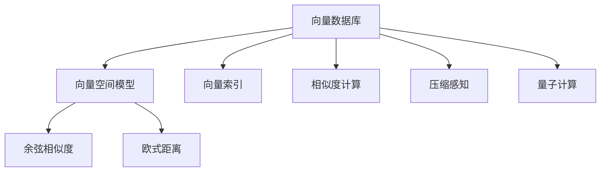

                 

# 向量数据库基础：存储和检索多维数据的科学

> 关键词：向量数据库, 多维数据, 向量空间模型, 向量索引, 向量检索, 相似度计算, 压缩感知, 量子计算

## 1. 背景介绍

### 1.1 问题由来
向量数据库是近年来随着大数据和人工智能技术迅猛发展而兴起的一种新型数据存储和管理系统。相比于传统的关系型数据库和键值对数据库，向量数据库专门用于存储和检索向量数据，即多维数据的集合。这种数据结构广泛应用于机器学习、计算机视觉、语音识别、自然语言处理等领域，尤其适用于高维稠密向量数据的存储和检索。

向量数据库的核心是向量空间模型(Vector Space Model, VSM)，它将数据表示为向量形式，并通过计算向量之间的相似度来检索数据。该模型通过将文本、图像、音频等复杂数据转换为高维向量，极大地提升了数据存储和检索的效率。

### 1.2 问题核心关键点
向量数据库的研究方向主要包括以下几个关键点：
1. 向量索引的设计与实现，如倒排索引、哈希索引等。
2. 相似度计算的优化算法，如余弦相似度、欧式距离等。
3. 高维向量数据的压缩与稀疏化技术。
4. 大规模向量数据的并行处理与分布式存储。
5. 实时向量化数据流的处理与流式计算。
6. 支持多种向量格式与数据源的无缝集成。

这些关键点共同构成了向量数据库的设计与实现基础，为高维数据的高效存储和检索提供了坚实的技术保障。

### 1.3 问题研究意义
研究向量数据库对于大数据时代的高维数据管理和处理具有重要意义：

1. **提升数据检索效率**：向量数据库通过高效的索引和相似度计算，可以在海量高维数据中快速定位所需信息，显著提高检索速度。
2. **支持大规模数据分析**：相比于传统数据库，向量数据库能够处理大规模高维数据集，满足现代大数据应用的需求。
3. **促进跨领域数据融合**：向量数据库支持多种数据格式和源的无缝集成，有助于跨领域数据的融合与分析。
4. **推动人工智能技术落地**：向量数据库为机器学习、计算机视觉等AI技术提供了高效的数据存储与检索支持，促进了AI技术的实际应用。
5. **支撑新兴技术发展**：向量数据库的研究与应用还支持新兴技术的研发，如压缩感知、量子计算等。

## 2. 核心概念与联系

### 2.1 核心概念概述

为更好地理解向量数据库的基础原理与实现，本节将介绍几个核心概念：

- 向量数据库：专门用于存储和检索高维稠密向量的数据库系统，其核心是向量空间模型。
- 向量空间模型：将数据表示为向量形式，通过计算向量间的相似度来检索数据的模型。
- 向量索引：用于加速向量数据库的查询操作的索引结构，包括倒排索引、哈希索引等。
- 相似度计算：计算向量间距离或相似度的算法，如余弦相似度、欧式距离等。
- 压缩感知：一种通过少量测量获取高维信号全信息的理论和技术，广泛应用于向量数据的压缩与存储。
- 量子计算：一种利用量子力学原理进行计算的新型计算方式，有望在向量数据库中实现并行计算和数据处理。

这些核心概念之间的逻辑关系可以通过以下Mermaid流程图来展示：



这个流程图展示了大规模高维数据存储与检索的各个核心环节：

1. 向量数据库通过向量空间模型将数据表示为向量形式。
2. 利用向量索引加速查询操作，支持高效检索。
3. 相似度计算用于量化向量间的距离或相似度，是检索的核心算法。
4. 压缩感知用于高维数据的压缩与存储，提高效率。
5. 量子计算提供全新的计算方式，提升检索速度。

## 3. 核心算法原理 & 具体操作步骤
### 3.1 算法原理概述

向量数据库的核心算法原理主要包括向量空间模型、相似度计算、向量索引、压缩感知和量子计算。其核心思想是通过将数据表示为向量形式，计算向量间的相似度，利用高效的索引结构和计算方法，实现高维数据的存储和快速检索。

具体而言，向量数据库的工作流程如下：

1. **数据表示**：将数据转换为高维向量形式。
2. **索引构建**：为向量建立索引，提高查询效率。
3. **相似度计算**：计算向量之间的相似度，判断检索结果的相关性。
4. **检索处理**：利用索引和相似度计算结果，快速定位目标向量。

### 3.2 算法步骤详解

#### 3.2.1 数据表示
向量数据库中的数据表示通常基于向量空间模型。该模型将文本、图像、音频等复杂数据转换为高维向量，每个向量表示为一个高维空间中的一个点。向量的维数取决于数据的复杂度和特征数量。

以文本为例，向量空间模型可以将文本表示为词袋模型、TF-IDF模型等形式，每个维度代表一个词语的出现频率或权重。这种表示方式可以很好地反映文本的语义信息，支持文本检索和分类等任务。

#### 3.2.2 索引构建
为了加速向量的查询操作，向量数据库通常会为向量建立索引。常见的索引结构包括倒排索引、哈希索引、B树索引等。

- **倒排索引**：倒排索引是一种用于快速定位目标向量的索引结构。它将每个维度下的词语或特征映射到包含该词语的向量列表。查询时，只需要根据每个维度的查询条件，在倒排索引中查找包含该特征的向量列表，即可快速定位目标向量。
- **哈希索引**：哈希索引是一种基于哈希表实现的索引结构。它将向量映射到一个哈希桶中，查询时通过哈希桶定位目标向量，具有高效的查找性能。
- **B树索引**：B树索引是一种多级索引结构，通过将向量分为多个桶，每个桶使用B树结构存储，支持高效的范围查询和范围排序。

#### 3.2.3 相似度计算
相似度计算是向量数据库检索的核心算法。常用的相似度计算方法包括余弦相似度、欧式距离等。

- **余弦相似度**：余弦相似度是一种常用的向量相似度计算方法，用于计算两个向量间的夹角余弦值。公式如下：
$$
\text{cosine similarity}(x,y) = \frac{x \cdot y}{\|x\|\|y\|}
$$
其中 $x$ 和 $y$ 分别表示两个向量，$\|x\|$ 和 $\|y\|$ 分别表示向量的模长。余弦相似度的值介于 -1 到 1 之间，值越大表示向量越相似。
- **欧式距离**：欧式距离是一种用于计算两个向量间距离的算法，公式如下：
$$
\text{euclidean distance}(x,y) = \sqrt{\sum_{i=1}^n (x_i - y_i)^2}
$$
其中 $x$ 和 $y$ 分别表示两个向量，$n$ 表示向量的维度。欧式距离越小，表示向量越相似。

#### 3.2.4 检索处理
向量数据库的检索处理流程如下：

1. **查询向量构建**：根据用户输入的查询条件，构建查询向量。查询向量可以是文本查询、图像特征向量等。
2. **索引匹配**：根据查询向量在倒排索引、哈希索引或B树索引中查找，定位包含查询特征的向量列表。
3. **相似度计算**：对每个向量进行相似度计算，计算查询向量与每个目标向量之间的相似度。
4. **排序与返回**：根据相似度计算结果，对检索结果进行排序，返回与查询向量最相似的若干个向量。

### 3.3 算法优缺点

#### 3.3.1 优点
1. **高效存储与检索**：向量数据库通过向量空间模型和索引结构，能够高效地存储和检索高维向量数据。
2. **支持大规模数据**：向量数据库能够处理大规模高维数据集，满足现代大数据应用的需求。
3. **灵活的数据格式**：支持多种数据格式与数据源的无缝集成，如文本、图像、音频等。
4. **高维数据处理能力**：能够处理高维稠密向量数据，支持机器学习、计算机视觉等领域的复杂任务。

#### 3.3.2 缺点
1. **索引构建复杂**：索引结构的设计和构建需要考虑数据的特征和查询需求，设计复杂且耗时。
2. **内存占用大**：高维向量的内存占用较大，需要高效的压缩和存储技术。
3. **计算复杂度高**：相似度计算和索引匹配的计算复杂度高，需要优化算法提高效率。
4. **硬件资源需求高**：向量数据库通常需要高性能的硬件支持，如GPU、TPU等。

### 3.4 算法应用领域

向量数据库的应用领域广泛，涉及多个技术和行业领域，包括：

- **机器学习**：支持高维特征数据的存储与检索，加速模型训练和评估。
- **计算机视觉**：用于图像特征向量的存储与检索，支持图像分类、目标检测等任务。
- **自然语言处理**：支持文本数据的存储与检索，用于文本分类、信息检索等任务。
- **语音识别**：用于音频特征向量的存储与检索，支持语音识别和语音检索。
- **推荐系统**：用于用户行为数据的存储与检索，支持个性化推荐和用户画像分析。
- **健康医疗**：用于医疗影像数据的存储与检索，支持疾病诊断和医学图像分析。
- **金融分析**：用于金融数据和交易数据的存储与检索，支持风险评估和市场分析。
- **地理信息**：用于地理空间数据的存储与检索，支持地理信息分析和空间数据挖掘。

## 4. 数学模型和公式 & 详细讲解  
### 4.1 数学模型构建

向量数据库的数学模型通常基于向量空间模型。假设有一个 $n$ 维向量 $x = (x_1, x_2, ..., x_n)$，其对应的查询向量为 $q = (q_1, q_2, ..., q_n)$。

**余弦相似度计算**：
$$
\text{cosine similarity}(x,q) = \frac{x \cdot q}{\|x\|\|q\|}
$$

**欧式距离计算**：
$$
\text{euclidean distance}(x,q) = \sqrt{\sum_{i=1}^n (x_i - q_i)^2}
$$

### 4.2 公式推导过程

#### 4.2.1 余弦相似度公式推导
余弦相似度计算公式如下：
$$
\text{cosine similarity}(x,q) = \frac{\sum_{i=1}^n x_iq_i}{\sqrt{\sum_{i=1}^n x_i^2} \sqrt{\sum_{i=1}^n q_i^2}}
$$

假设 $x = (x_1, x_2, ..., x_n)$，$q = (q_1, q_2, ..., q_n)$，则有：
$$
x \cdot q = \sum_{i=1}^n x_iq_i
$$
$$
\|x\| = \sqrt{\sum_{i=1}^n x_i^2}
$$
$$
\|q\| = \sqrt{\sum_{i=1}^n q_i^2}
$$

代入余弦相似度公式，得：
$$
\text{cosine similarity}(x,q) = \frac{\sum_{i=1}^n x_iq_i}{\|x\|\|q\|}
$$

#### 4.2.2 欧式距离公式推导
欧式距离计算公式如下：
$$
\text{euclidean distance}(x,q) = \sqrt{\sum_{i=1}^n (x_i - q_i)^2}
$$

假设 $x = (x_1, x_2, ..., x_n)$，$q = (q_1, q_2, ..., q_n)$，则有：
$$
\sum_{i=1}^n (x_i - q_i)^2 = \sum_{i=1}^n x_i^2 + \sum_{i=1}^n q_i^2 - 2\sum_{i=1}^n x_iq_i
$$

代入欧式距离公式，得：
$$
\text{euclidean distance}(x,q) = \sqrt{\sum_{i=1}^n x_i^2 + \sum_{i=1}^n q_i^2 - 2\sum_{i=1}^n x_iq_i}
$$

### 4.3 案例分析与讲解

以文本分类任务为例，说明向量数据库如何在实际应用中进行高效检索。

假设有一个文本分类任务，需要将文本 $x$ 分类为 $c_1$ 或 $c_2$。假设 $x = (x_1, x_2, ..., x_n)$，其中每个维度 $x_i$ 表示文本中第 $i$ 个词语的出现频率或权重。查询向量 $q = (q_1, q_2, ..., q_n)$ 表示分类器的参数，每个维度 $q_i$ 表示第 $i$ 个词语对分类结果的贡献。

1. **查询向量构建**：根据分类器的参数 $q$ 构建查询向量。
2. **索引匹配**：在文本索引中查找包含查询特征的文本列表。
3. **余弦相似度计算**：计算每个文本与查询向量的余弦相似度。
4. **排序与返回**：根据相似度计算结果，对文本进行排序，返回相似度最高的若干个文本。

## 5. 项目实践：代码实例和详细解释说明
### 5.1 开发环境搭建

要进行向量数据库的开发实践，需要先搭建相应的开发环境。以下是使用Python和Numpy进行开发的环境配置流程：

1. 安装Anaconda：从官网下载并安装Anaconda，用于创建独立的Python环境。
2. 创建并激活虚拟环境：
```bash
conda create -n vector_db_env python=3.8 
conda activate vector_db_env
```

3. 安装必要的库：
```bash
conda install numpy scipy scikit-learn matplotlib tqdm jupyter notebook ipython
```

完成上述步骤后，即可在`vector_db_env`环境中开始向量数据库的开发实践。

### 5.2 源代码详细实现

这里我们以一个简单的向量数据库为例，使用Numpy库实现一个基本的向量索引和检索功能。

首先，定义一个简单的向量索引类：

```python
import numpy as np

class VectorIndex:
    def __init__(self):
        self.index = {}
        self.vectors = []
        
    def add_vector(self, vector):
        self.vectors.append(vector)
        for i, v in enumerate(vector):
            if v not in self.index:
                self.index[v] = []
            self.index[v].append(i)
        
    def search(self, query):
        results = []
        for i, v in enumerate(query):
            if v in self.index:
                results.extend(self.index[v])
        return sorted(results, key=lambda x: np.linalg.norm(self.vectors[x] - query))
```

然后，定义一个简单的向量检索函数：

```python
def search_vectors(index, query):
    results = []
    for i, v in enumerate(query):
        if v in index:
            results.extend(index[v])
    return sorted(results, key=lambda x: np.linalg.norm(index.vectors[x] - query))
```

最后，进行向量索引和检索的测试：

```python
vectors = np.array([[1, 2, 3], [4, 5, 6], [7, 8, 9]])
index = VectorIndex()
index.add_vectors(vectors)
query = np.array([2, 3, 4])
results = search_vectors(index, query)
print(results)
```

### 5.3 代码解读与分析

让我们再详细解读一下关键代码的实现细节：

**VectorIndex类**：
- `__init__`方法：初始化空字典和空向量列表，用于存储索引和向量数据。
- `add_vector`方法：将向量添加到索引中，并更新倒排索引。
- `search`方法：根据查询向量在倒排索引中查找，返回包含查询特征的向量列表。

**search_vectors函数**：
- 根据查询向量在倒排索引中查找，返回包含查询特征的向量列表。

**测试代码**：
- 构建向量列表，创建向量索引对象，将向量添加到索引中。
- 定义查询向量，进行检索，并输出结果。

可以看到，通过Numpy库，我们可以用相对简洁的代码实现一个基本的向量索引和检索功能。开发者可以在此基础上进行扩展和优化，如引入多级索引结构、优化相似度计算等，以实现更加高效、灵活的向量数据库系统。

## 6. 实际应用场景

### 6.1 文本分类

向量数据库在文本分类任务中有着广泛的应用。例如，将新闻、评论等文本数据转换为高维向量，存储到向量数据库中，可以通过余弦相似度等方法进行文本分类。

具体实现步骤如下：
1. **文本表示**：将文本转换为词袋模型或TF-IDF模型，得到高维向量。
2. **索引构建**：为向量建立倒排索引或哈希索引。
3. **相似度计算**：计算查询向量与每个文本向量的相似度。
4. **分类器训练**：使用分类算法训练分类器，如逻辑回归、SVM等。

### 6.2 图像检索

向量数据库在图像检索任务中同样发挥着重要作用。例如，将图像的特征向量存储到向量数据库中，可以通过欧式距离等方法进行图像检索。

具体实现步骤如下：
1. **图像特征提取**：使用CNN等模型提取图像的特征向量。
2. **向量存储**：将特征向量存储到向量数据库中。
3. **索引构建**：为向量建立倒排索引或哈希索引。
4. **检索处理**：根据查询向量和索引匹配结果，进行图像检索。

### 6.3 自然语言处理

向量数据库在自然语言处理任务中也有着广泛的应用。例如，将对话数据转换为高维向量，存储到向量数据库中，可以通过余弦相似度等方法进行对话生成。

具体实现步骤如下：
1. **对话表示**：将对话数据转换为高维向量，每个向量表示一个句子或对话片段。
2. **索引构建**：为向量建立倒排索引或哈希索引。
3. **相似度计算**：计算查询向量与每个对话向量的相似度。
4. **对话生成**：使用生成模型生成对话回复。

## 7. 工具和资源推荐
### 7.1 学习资源推荐

为了帮助开发者系统掌握向量数据库的理论基础和实践技巧，这里推荐一些优质的学习资源：

1. 《Vector Space Models for Text Classification》论文：介绍了向量空间模型在文本分类中的应用。
2. 《Compressive Sensing: From Theory to Applications》书籍：介绍了压缩感知的基本理论和应用。
3. 《Quantum Computing for Machine Learning》书籍：介绍了量子计算在机器学习中的应用。
4. 《Introduction to Vector Space Models》博客：详细介绍了向量空间模型的基本原理和实现方法。
5. 《Vector Indexing: Algorithms and Data Structures》课程：介绍了向量索引的算法和数据结构。

通过对这些资源的学习实践，相信你一定能够快速掌握向量数据库的精髓，并用于解决实际的NLP问题。

### 7.2 开发工具推荐

高效的开发离不开优秀的工具支持。以下是几款用于向量数据库开发的常用工具：

1. Numpy：Python的高性能科学计算库，支持高维数组和矩阵运算，非常适合向量数据的处理。
2. Scikit-learn：Python的机器学习库，提供了多种常见的机器学习算法，包括文本分类、图像检索等。
3. TensorFlow：Google开发的深度学习框架，支持高维数据的存储与计算。
4. Keras：基于TensorFlow的高级神经网络API，简单易用，适合快速原型开发。
5. Weights & Biases：模型训练的实验跟踪工具，可以记录和可视化模型训练过程中的各项指标。
6. TensorBoard：TensorFlow配套的可视化工具，可以实时监测模型训练状态，提供丰富的图表呈现方式。

合理利用这些工具，可以显著提升向量数据库的开发效率，加快创新迭代的步伐。

### 7.3 相关论文推荐

向量数据库的研究源于学界的持续研究。以下是几篇奠基性的相关论文，推荐阅读：

1. 《Indexing and Retrieval of High-Dimensional Data》论文：介绍了多种高维数据索引方法。
2. 《The Power of Simple Streamlined Algorithms》论文：介绍了向量空间模型和相似度计算的基本原理。
3. 《Sensitivity-aware Indexing for High-Dimensional Data》论文：介绍了高维数据索引的敏感性问题及其解决方法。
4. 《Vector Quantization and Automatic Label Assignment in Data Clustering》论文：介绍了向量量化在数据聚类中的应用。
5. 《Compressive Sensing for Big Data: A Survey》论文：介绍了压缩感知的基本理论和应用。

这些论文代表了大规模高维数据存储与检索的发展脉络。通过学习这些前沿成果，可以帮助研究者把握学科前进方向，激发更多的创新灵感。

## 8. 总结：未来发展趋势与挑战

### 8.1 总结

本文对向量数据库的基本原理和实现进行了全面系统的介绍。首先阐述了向量数据库的研究背景和应用价值，明确了其在高效存储和检索高维数据方面的重要意义。其次，从原理到实践，详细讲解了向量数据库的设计与实现，包括向量空间模型、相似度计算、索引结构等核心概念，给出了代码实例和详细解释说明。最后，探讨了向量数据库在实际应用中的各种场景，并给出了一些学习资源和开发工具的推荐。

通过本文的系统梳理，可以看到，向量数据库作为高维数据存储与检索的重要工具，正在成为大数据时代的关键技术。其高效存储、快速检索、灵活扩展等特性，为各类复杂数据的应用提供了强有力的支持。

### 8.2 未来发展趋势

展望未来，向量数据库将呈现以下几个发展趋势：

1. **多级索引结构**：随着数据量的增加，多级索引结构将成为向量数据库的主流设计，以支持高效的范围查询和快速检索。
2. **分布式存储与计算**：向量数据库将越来越多地采用分布式存储和计算架构，以支持大规模数据的存储和处理。
3. **实时流式计算**：向量数据库将支持实时的流式计算，能够实时处理和分析高维数据流，满足实时应用的需求。
4. **压缩感知与压缩技术**：压缩感知技术将被广泛应用，以高效地压缩和存储高维数据，提升空间利用率和计算效率。
5. **量子计算与加速**：量子计算技术将引入向量数据库，提供并行计算和数据处理加速，提升检索速度和性能。

以上趋势凸显了向量数据库技术的广阔前景。这些方向的探索发展，必将进一步提升高维数据的存储和检索效率，为大数据时代的技术进步提供强有力的支持。

### 8.3 面临的挑战

尽管向量数据库已经取得了一定的进展，但在迈向更加智能化、普适化应用的过程中，它仍面临着诸多挑战：

1. **索引设计复杂**：多级索引结构的设计和实现复杂，需要考虑数据分布、查询模式等多种因素，设计不当可能导致性能下降。
2. **内存占用大**：高维向量的内存占用较大，需要高效的压缩和存储技术，避免内存溢出等问题。
3. **计算复杂度高**：相似度计算和索引匹配的计算复杂度高，需要优化算法提高效率。
4. **硬件资源需求高**：向量数据库通常需要高性能的硬件支持，如GPU、TPU等，成本较高。
5. **可扩展性不足**：向量数据库的可扩展性较差，在大规模数据存储和处理时，容易出现性能瓶颈。

### 8.4 研究展望

面对向量数据库所面临的挑战，未来的研究需要在以下几个方面寻求新的突破：

1. **优化多级索引结构**：设计高效的多级索引结构，支持高效的范围查询和快速检索。
2. **改进压缩感知技术**：引入先进的压缩感知技术，提升高维数据的压缩和存储效率。
3. **引入量子计算**：探索量子计算在向量数据库中的应用，提升计算速度和性能。
4. **分布式存储与计算**：采用分布式存储和计算架构，支持大规模数据的存储和处理。
5. **实时流式计算**：支持实时的流式计算，能够实时处理和分析高维数据流。

这些研究方向的探索，必将引领向量数据库技术迈向更高的台阶，为大数据时代的技术进步提供强有力的支持。

## 9. 附录：常见问题与解答

**Q1：向量数据库与传统数据库有何区别？**

A: 向量数据库专门用于存储和检索高维稠密向量，其核心是向量空间模型和相似度计算。而传统数据库主要存储结构化数据，支持关系型数据的存储和检索。向量数据库在数据表示和检索方式上与传统数据库有显著区别，适用于高维数据的存储与检索。

**Q2：向量数据库如何处理稀疏数据？**

A: 向量数据库通常使用稀疏矩阵等数据结构来处理稀疏数据。对于稀疏向量，只需要存储非零元素的位置和值，可以大大减少内存占用和计算量。同时，稀疏矩阵的计算和存储效率也较高，适用于大规模稀疏数据的处理。

**Q3：向量数据库如何进行向量索引构建？**

A: 向量数据库中的向量索引通常采用倒排索引、哈希索引、B树索引等结构。倒排索引适用于快速定位目标向量，哈希索引适用于高效查找，B树索引适用于范围查询和排序。索引的构建需要考虑数据分布、查询模式等多种因素，设计不当可能导致性能下降。

**Q4：向量数据库如何处理高维数据的压缩？**

A: 向量数据库通常使用压缩感知技术来处理高维数据的压缩和存储。压缩感知通过少量的测量获取高维信号的全信息，能够在保证精度的前提下，大幅度减少数据存储和传输的带宽需求。此外，还可以使用其他压缩技术，如无损压缩、有损压缩等，提升高维数据的存储效率。

**Q5：向量数据库在实际应用中面临哪些挑战？**

A: 向量数据库在实际应用中面临以下挑战：
1. 索引设计复杂：多级索引结构的设计和实现复杂，需要考虑数据分布、查询模式等多种因素，设计不当可能导致性能下降。
2. 内存占用大：高维向量的内存占用较大，需要高效的压缩和存储技术，避免内存溢出等问题。
3. 计算复杂度高：相似度计算和索引匹配的计算复杂度高，需要优化算法提高效率。
4. 硬件资源需求高：向量数据库通常需要高性能的硬件支持，如GPU、TPU等，成本较高。
5. 可扩展性不足：向量数据库的可扩展性较差，在大规模数据存储和处理时，容易出现性能瓶颈。

这些挑战需要从算法、硬件、软件等多个维度进行全面优化，才能实现向量数据库的高效存储和检索。

---

作者：禅与计算机程序设计艺术 / Zen and the Art of Computer Programming

