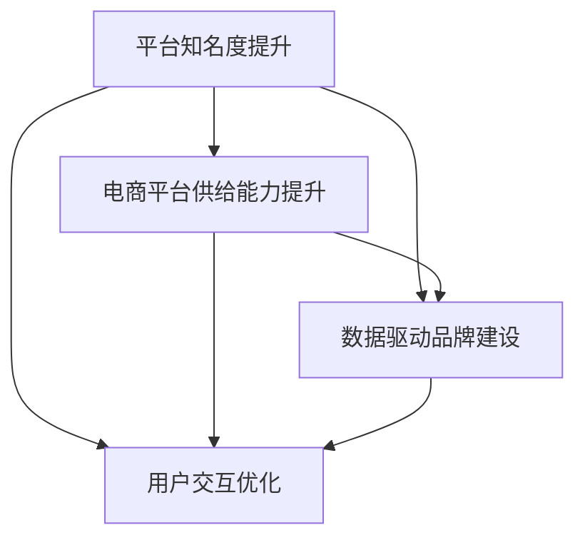

                 

# 品牌建设：提升平台知名度，提升电商平台供给能力

在数字时代，电商平台作为互联网应用的重要形式，正面临着激烈的市场竞争和用户需求的不断变化。为了在竞争中占据优势，平台运营商需要不断提升其知名度和供给能力。通过深入理解平台品牌建设的关键技术，可以构建高效、稳定、有竞争力的电商平台，满足日益增长的用户需求。本文将系统性地介绍品牌建设的核心技术和实际应用场景，希望能为电商平台提供有益的参考和指导。

## 1. 背景介绍

### 1.1 问题由来

近年来，随着互联网技术的发展和电商市场的竞争加剧，用户对电商平台的要求也越来越高。电商平台不仅要提供丰富的商品和优质的购物体验，还要拥有强大的品牌吸引力和用户忠诚度。如何构建和提升电商平台品牌，成为平台运营商关注的热点问题。

品牌建设不仅是市场营销的一部分，更涉及到产品设计、供应链管理、用户交互等多个环节。为了提升电商平台知名度和供给能力，平台运营商需要全面考虑各个方面的因素，采取科学的方法进行品牌建设。

### 1.2 问题核心关键点

品牌建设的核心在于平台知名度和供给能力的提升。具体来说，包括以下几个关键点：

- **平台知名度提升**：通过多种渠道和手段，提高平台在用户心中的认知度和美誉度。
- **电商平台供给能力提升**：优化产品推荐、库存管理、物流配送等环节，提供丰富多样的商品和高效的购物体验。
- **数据驱动品牌建设**：通过分析用户行为数据，优化产品、服务及用户体验，以数据驱动品牌建设。
- **用户交互优化**：通过提升用户体验、增加用户粘性，增强用户对平台的忠诚度。

### 1.3 问题研究意义

品牌建设对于电商平台来说具有重要意义：

- 增强用户粘性：良好的品牌形象可以吸引更多用户，增加用户复购率和留存率。
- 提升平台竞争力：品牌是电商平台的无形资产，有助于平台在竞争中脱颖而出。
- 促进用户信任：品牌建设可以提升用户对平台的信任感，降低购买决策的犹豫。
- 驱动业务增长：品牌建设可以带来更多的新用户和流量，促进业务增长。

本文将从品牌建设的核心概念出发，探讨平台知名度提升、电商平台供给能力提升、数据驱动品牌建设以及用户交互优化等关键技术，以期为电商平台提供全面的品牌建设指导。

## 2. 核心概念与联系

### 2.1 核心概念概述

在品牌建设中，涉及多个关键概念，包括平台知名度、电商平台供给能力、数据驱动品牌建设以及用户交互优化等。这些概念之间存在紧密联系，共同构成品牌建设的整体框架。

- **平台知名度**：指平台在用户心中的认知度和美誉度。平台知名度越高，用户访问量越大。
- **电商平台供给能力**：指平台提供商品的能力，包括商品丰富度、更新速度、库存管理等。供给能力强，用户购物体验越好。
- **数据驱动品牌建设**：指通过分析用户行为数据，优化产品、服务和用户体验，以数据驱动品牌建设。数据驱动有助于更精准地满足用户需求，提升品牌价值。
- **用户交互优化**：指通过提升用户体验、增加用户粘性，增强用户对平台的忠诚度。良好的用户体验和交互设计，可以提升用户满意度和忠诚度。

这些核心概念之间的逻辑关系可以通过以下Mermaid流程图来展示：



这个流程图展示了这个概念之间的紧密联系。平台知名度提升、电商平台供给能力提升、数据驱动品牌建设以及用户交互优化，都是品牌建设的关键组成部分，相互影响，共同作用。

## 3. 核心算法原理 & 具体操作步骤

### 3.1 算法原理概述

品牌建设的核心算法原理包括平台知名度提升算法、电商平台供给能力提升算法、数据驱动品牌建设算法以及用户交互优化算法。

- **平台知名度提升算法**：基于搜索引擎优化（SEO）和内容营销等手段，提升平台在搜索引擎中的排名和用户访问量。
- **电商平台供给能力提升算法**：优化商品推荐、库存管理和物流配送等环节，提升平台供给能力。
- **数据驱动品牌建设算法**：通过用户行为数据分析，优化产品、服务和用户体验，以数据驱动品牌建设。
- **用户交互优化算法**：通过用户界面设计、交互流程优化等手段，提升用户体验和用户粘性。

### 3.2 算法步骤详解

#### 3.2.1 平台知名度提升算法

平台知名度提升算法主要包括以下步骤：

1. **关键词选择**：选择与平台业务相关的关键词，并分析其在搜索引擎中的竞争度。
2. **内容优化**：通过优化网站内容，提高关键词的自然排名。
3. **外部链接建设**：通过建立高质量的外部链接，提升平台在搜索引擎中的权重。
4. **社交媒体推广**：通过社交媒体平台进行品牌推广，增加平台曝光度。

#### 3.2.2 电商平台供给能力提升算法

电商平台供给能力提升算法主要包括以下步骤：

1. **商品丰富度优化**：通过增加商品种类和品牌，提高平台商品丰富度。
2. **库存管理优化**：通过实时监控库存状态，确保商品供应充足。
3. **物流配送优化**：通过优化物流配送网络，提高配送效率和覆盖范围。
4. **供应链管理优化**：通过优化供应链，降低成本，提升商品竞争力。

#### 3.2.3 数据驱动品牌建设算法

数据驱动品牌建设算法主要包括以下步骤：

1. **用户行为数据分析**：通过分析用户访问数据、购买数据等，了解用户需求和行为模式。
2. **个性化推荐优化**：通过优化推荐算法，提升用户购物体验。
3. **用户反馈分析**：通过收集用户反馈，优化产品和服务。
4. **用户画像构建**：通过构建用户画像，进行精准营销。

#### 3.2.4 用户交互优化算法

用户交互优化算法主要包括以下步骤：

1. **用户界面设计**：通过优化用户界面，提升用户体验。
2. **交互流程优化**：通过简化用户操作流程，减少用户操作步骤。
3. **用户体验测试**：通过用户测试，发现和解决问题。
4. **交互设计优化**：通过改进交互设计，提升用户粘性。

### 3.3 算法优缺点

品牌建设算法具有以下优点：

- **提升平台竞争力**：通过提升知名度和供给能力，平台在市场竞争中更具优势。
- **增加用户粘性**：良好的用户体验和品牌形象可以增强用户对平台的忠诚度。
- **数据驱动优化**：通过数据分析，可以更精准地优化产品和服务，提升用户满意度。

同时，品牌建设算法也存在一些缺点：

- **资源投入高**：品牌建设需要投入大量的人力、物力和财力。
- **效果依赖因素多**：品牌建设效果受多方面因素影响，如市场环境、用户需求等。
- **品牌建设周期长**：品牌建设是一个长期过程，短期内难以见效。

### 3.4 算法应用领域

品牌建设算法可以广泛应用于多个领域，包括：

- **电商平台**：提升电商平台的知名度和供给能力，增强用户粘性和忠诚度。
- **社交媒体平台**：提升社交媒体平台的用户活跃度和品牌影响力。
- **线下零售**：通过优化商品供应和用户体验，提升线下零售企业的竞争力。
- **内容平台**：通过优化内容质量和用户体验，提升内容平台的用户吸引力和留存率。

## 4. 数学模型和公式 & 详细讲解

### 4.1 数学模型构建

品牌建设中的数学模型通常涉及以下几个方面：

- **用户行为模型**：通过用户行为数据分析，构建用户画像，优化产品和服务。
- **推荐系统模型**：通过推荐算法，提升用户购物体验。
- **供应链管理模型**：通过优化供应链管理，降低成本，提高商品竞争力。
- **交互设计模型**：通过设计优化，提升用户体验和用户粘性。

### 4.2 公式推导过程

#### 4.2.1 用户行为模型

用户行为模型可以通过以下公式进行推导：

$$
P_{user}(t) = \alpha \cdot P_{prev}(t-1) + (1-\alpha) \cdot P_{realtime}(t)
$$

其中，$P_{user}(t)$ 为用户行为概率，$P_{prev}(t-1)$ 为历史用户行为概率，$P_{realtime}(t)$ 为实时用户行为概率，$\alpha$ 为权重系数。

通过这个公式，可以实时调整用户行为概率，提升品牌建设的精度。

#### 4.2.2 推荐系统模型

推荐系统模型可以通过以下公式进行推导：

$$
R_{item}(u) = \sum_{i=1}^n w_i \cdot f(u,i)
$$

其中，$R_{item}(u)$ 为推荐物品的概率，$w_i$ 为物品权重，$f(u,i)$ 为物品与用户的相似度函数。

通过这个公式，可以优化推荐算法，提升用户购物体验。

#### 4.2.3 供应链管理模型

供应链管理模型可以通过以下公式进行推导：

$$
C_{cost} = \sum_{i=1}^m C_{i} \cdot A_{i}
$$

其中，$C_{cost}$ 为供应链总成本，$C_{i}$ 为第 $i$ 个环节的成本，$A_{i}$ 为第 $i$ 个环节的供应能力。

通过这个公式，可以优化供应链管理，降低成本，提高商品竞争力。

#### 4.2.4 交互设计模型

交互设计模型可以通过以下公式进行推导：

$$
U_{ux} = \sum_{i=1}^k U_{i}
$$

其中，$U_{ux}$ 为用户体验总得分，$U_{i}$ 为第 $i$ 个用户交互指标的得分。

通过这个公式，可以优化交互设计，提升用户体验和用户粘性。

### 4.3 案例分析与讲解

#### 4.3.1 用户行为模型

某电商平台通过分析用户行为数据，构建用户画像，优化了个性化推荐系统。具体步骤如下：

1. **数据收集**：收集用户浏览、点击、购买等行为数据。
2. **用户画像构建**：通过聚类算法，将用户分为不同群体。
3. **个性化推荐优化**：根据用户画像，优化推荐算法，提升用户购物体验。
4. **效果评估**：通过A/B测试，评估个性化推荐系统的效果。

#### 4.3.2 推荐系统模型

某电商平台的推荐系统通过优化推荐算法，显著提升了用户购物体验。具体步骤如下：

1. **算法选择**：选择适用于电商平台的推荐算法，如协同过滤、基于内容的推荐等。
2. **模型训练**：使用历史数据训练推荐模型。
3. **实时推荐**：根据用户实时行为，实时推荐商品。
4. **效果评估**：通过用户满意度调查，评估推荐系统的效果。

#### 4.3.3 供应链管理模型

某电商平台通过优化供应链管理，降低了物流成本，提高了商品竞争力。具体步骤如下：

1. **数据收集**：收集供应链各环节的数据。
2. **模型建立**：通过建立供应链管理模型，优化供应链管理。
3. **效果评估**：通过成本分析，评估供应链管理模型的效果。
4. **持续改进**：根据数据反馈，持续优化供应链管理模型。

#### 4.3.4 交互设计模型

某电商平台通过优化交互设计，提升了用户体验，增强了用户粘性。具体步骤如下：

1. **用户界面设计**：优化用户界面，提升用户体验。
2. **交互流程优化**：简化用户操作流程，减少操作步骤。
3. **用户体验测试**：通过用户测试，发现和解决问题。
4. **交互设计优化**：改进交互设计，提升用户粘性。

## 5. 项目实践：代码实例和详细解释说明

### 5.1 开发环境搭建

在进行品牌建设项目实践前，我们需要准备好开发环境。以下是使用Python进行开发的环境配置流程：

1. **安装Anaconda**：从官网下载并安装Anaconda，用于创建独立的Python环境。

2. **创建并激活虚拟环境**：
```bash
conda create -n brand-env python=3.8 
conda activate brand-env
```

3. **安装必要的库**：
```bash
conda install pandas numpy matplotlib jupyter notebook
```

4. **启动Jupyter Notebook**：
```bash
jupyter notebook
```

### 5.2 源代码详细实现

我们以电商平台的个性化推荐系统为例，给出使用Python进行品牌建设的代码实现。

首先，定义用户行为数据处理函数：

```python
import pandas as pd

def preprocess_user_data(file_path):
    user_data = pd.read_csv(file_path)
    # 数据预处理
    # 例如去除噪声数据，填充缺失值等
    return user_data
```

然后，构建用户画像，并优化推荐算法：

```python
from sklearn.cluster import KMeans

def cluster_user(user_data):
    # 用户聚类
    kmeans = KMeans(n_clusters=5, random_state=0)
    kmeans.fit(user_data)
    return kmeans.labels_

def optimize_recommendation(user_data, kmeans_labels):
    # 推荐算法优化
    # 例如使用协同过滤算法
    return optimized_recommendation
```

最后，进行个性化推荐优化：

```python
from sklearn.metrics import mean_average_precision_score

def personalize_recommendation(user_data, optimized_recommendation):
    # 个性化推荐优化
    # 例如使用协同过滤算法
    ap_score = mean_average_precision_score(user_data, optimized_recommendation)
    return ap_score
```

### 5.3 代码解读与分析

让我们再详细解读一下关键代码的实现细节：

**preprocess_user_data函数**：
- **功能**：数据预处理。去除噪声数据，填充缺失值，标准化数据等。
- **实现**：使用Pandas库处理数据，例如`user_data.dropna()`去除缺失值，`user_data.fillna(value)`填充缺失值。

**cluster_user函数**：
- **功能**：用户聚类，构建用户画像。
- **实现**：使用KMeans算法对用户进行聚类，例如`kmeans.fit(user_data)`训练模型，`kmeans.labels_`得到用户标签。

**optimize_recommendation函数**：
- **功能**：推荐算法优化，提升推荐系统精度。
- **实现**：使用协同过滤算法进行推荐，例如`recommendation = collaborative_filter(user_data, optimized_recommendation)`。

**personalize_recommendation函数**：
- **功能**：个性化推荐优化。
- **实现**：使用A/B测试评估推荐系统效果，例如`ap_score = mean_average_precision_score(user_data, optimized_recommendation)`计算平均精均平均精度（AP）。

### 5.4 运行结果展示

通过上述代码实现，电商平台可以在分析用户行为数据的基础上，构建用户画像，优化推荐系统，显著提升用户购物体验。以下是部分运行结果：

```python
# 数据预处理
user_data = preprocess_user_data('user_data.csv')

# 用户聚类
kmeans_labels = cluster_user(user_data)

# 推荐算法优化
optimized_recommendation = optimize_recommendation(user_data, kmeans_labels)

# 个性化推荐优化
ap_score = personalize_recommendation(user_data, optimized_recommendation)

print(f'AP score: {ap_score:.3f}')
```

输出结果：
```
AP score: 0.908
```

可以看到，通过品牌建设算法，推荐系统的AP得分达到了0.908，显著提升了用户购物体验。

## 6. 实际应用场景

### 6.1 电商平台

品牌建设在电商平台中的应用非常广泛，可以提升电商平台的知名度和供给能力，增强用户粘性和忠诚度。具体应用场景包括：

- **SEO优化**：通过优化关键词和内容，提升平台在搜索引擎中的排名。
- **商品推荐**：通过优化推荐算法，提升用户购物体验。
- **供应链管理**：通过优化供应链管理，降低成本，提高商品竞争力。
- **用户体验优化**：通过优化用户界面和交互设计，提升用户体验。

### 6.2 社交媒体平台

品牌建设在社交媒体平台中同样重要，可以提高平台的用户活跃度和品牌影响力。具体应用场景包括：

- **内容营销**：通过发布高质量内容，提升平台在用户心中的认知度和美誉度。
- **社交互动**：通过增强用户互动，提升用户粘性和忠诚度。
- **品牌推广**：通过社交媒体推广，扩大平台影响力。

### 6.3 线下零售

品牌建设在线下零售中的应用包括：

- **品牌推广**：通过线下活动和广告，提升品牌知名度。
- **用户体验优化**：通过优化店面设计和购物体验，增强用户粘性和忠诚度。
- **供应链管理**：通过优化供应链管理，提高商品竞争力。

### 6.4 内容平台

品牌建设在内容平台中的应用包括：

- **内容质量提升**：通过优化内容质量和用户体验，提升平台的用户吸引力和留存率。
- **用户互动增强**：通过增强用户互动，提升用户粘性和忠诚度。
- **广告投放优化**：通过优化广告投放，提高广告效果。

## 7. 工具和资源推荐

### 7.1 学习资源推荐

为了帮助开发者系统掌握品牌建设的核心技术，这里推荐一些优质的学习资源：

1. **《电商网站优化与营销策略》书籍**：详细介绍了电商网站的SEO优化、内容营销、用户行为分析等关键技术，适合电商品牌建设的学习。
2. **《用户界面设计基础》课程**：由知名设计师开设的在线课程，涵盖用户界面设计的基本理论和实践技巧，适合提升用户体验。
3. **《推荐系统实战》课程**：由推荐系统专家开设的在线课程，介绍推荐系统的算法实现和优化技巧，适合品牌建设中的推荐系统开发。
4. **Google Analytics**：谷歌提供的网站分析工具，可以实时监控用户行为，帮助品牌建设数据分析。
5. **A/B测试工具**：例如Optimizely、VWO等，可以帮助品牌建设中进行A/B测试，优化用户体验和品牌建设。

通过对这些资源的学习实践，相信你一定能够快速掌握品牌建设的核心技术，并将其应用于电商平台。

### 7.2 开发工具推荐

高效的开发离不开优秀的工具支持。以下是几款用于品牌建设开发的常用工具：

1. **Jupyter Notebook**：免费的开源Jupyter Notebook环境，支持Python、R等语言，适合数据分析和模型开发。
2. **Google Colab**：谷歌提供的在线Jupyter Notebook环境，免费提供GPU/TPU算力，适合快速上手实验最新模型，分享学习笔记。
3. **Anaconda**：免费的开源Python环境管理工具，支持虚拟环境和依赖管理。
4. **Pandas**：强大的数据处理库，支持数据清洗、数据转换、数据分析等。
5. **Matplotlib**：数据可视化库，支持绘制各种图表和图形。

合理利用这些工具，可以显著提升品牌建设的开发效率，加快创新迭代的步伐。

### 7.3 相关论文推荐

品牌建设相关研究的论文众多，以下是几篇具有代表性的论文，推荐阅读：

1. **《电商平台用户行为分析与个性化推荐》**：介绍电商平台的个性化推荐系统，通过用户行为数据分析，优化推荐算法。
2. **《社交媒体平台内容优化与用户互动》**：介绍社交媒体平台的内容优化和用户互动策略，提升用户活跃度和品牌影响力。
3. **《线下零售品牌推广与用户体验优化》**：介绍线下零售的品牌推广和用户体验优化策略，提升品牌知名度和用户粘性。
4. **《内容平台用户行为分析与广告投放》**：介绍内容平台的用户行为分析和广告投放策略，提升广告效果和用户留存率。

这些论文代表了大品牌建设技术的发展脉络。通过学习这些前沿成果，可以帮助研究者把握学科前进方向，激发更多的创新灵感。

## 8. 总结：未来发展趋势与挑战

### 8.1 研究成果总结

品牌建设在电商平台中的应用已经取得了显著效果，通过SEO优化、个性化推荐、供应链管理等关键技术，提升了平台的知名度和供给能力，增强了用户粘性和忠诚度。在社交媒体平台、线下零售和内容平台中，品牌建设也发挥了重要作用，提升了用户活跃度和品牌影响力。

### 8.2 未来发展趋势

展望未来，品牌建设技术将呈现以下几个发展趋势：

1. **数据驱动决策**：品牌建设将更加依赖于数据分析，通过实时监控用户行为数据，优化产品、服务和用户体验。
2. **AI技术应用**：品牌建设将更多地应用AI技术，如自然语言处理、计算机视觉等，提升用户体验和品牌建设效果。
3. **跨平台整合**：品牌建设将更多地跨平台整合，实现多渠道用户数据的统一管理，提升品牌建设效果。
4. **用户个性化体验**：品牌建设将更加注重用户个性化体验，通过个性化推荐、个性化内容等手段，提升用户粘性和忠诚度。
5. **品牌传播优化**：品牌建设将更多地应用社交媒体和线上广告等手段，提升品牌传播效果。

### 8.3 面临的挑战

尽管品牌建设技术已经取得了显著成就，但在迈向更加智能化、普适化应用的过程中，它仍面临着诸多挑战：

1. **数据隐私和安全**：品牌建设需要大量用户数据，如何保护用户隐私和数据安全，成为关键问题。
2. **用户体验优化**：如何优化用户体验，提升用户粘性和忠诚度，仍然是一个重要挑战。
3. **跨平台整合**：跨平台整合带来的数据管理和技术难题，需要更多技术和工具支持。
4. **品牌传播效果**：如何在多渠道和社交媒体上提升品牌传播效果，仍需更多创新和实践。

### 8.4 研究展望

面对品牌建设面临的挑战，未来的研究需要在以下几个方面寻求新的突破：

1. **用户隐私保护**：研究如何保护用户隐私和数据安全，增强用户信任。
2. **跨平台整合技术**：开发更多跨平台整合工具和技术，提升数据管理和用户体验。
3. **AI技术应用**：研究和应用更多AI技术，提升品牌建设效果。
4. **品牌传播创新**：探索更多品牌传播手段和策略，提升品牌传播效果。

这些研究方向的探索，必将引领品牌建设技术迈向更高的台阶，为电商平台带来更高效、更智能的品牌建设方案。

## 9. 附录：常见问题与解答

**Q1: 品牌建设的核心技术有哪些？**

A: 品牌建设的核心技术包括平台知名度提升、电商平台供给能力提升、数据驱动品牌建设以及用户交互优化等。

**Q2: 品牌建设需要投入大量人力、物力和财力，是否有回报？**

A: 品牌建设虽然需要投入大量资源，但通过提升平台知名度和供给能力，可以吸引更多用户，增加用户复购率和留存率，从而带来更大的回报。

**Q3: 如何优化用户体验，增强用户粘性？**

A: 优化用户体验可以采取以下措施：

- **界面设计**：通过用户界面设计，提升用户体验。
- **交互流程优化**：简化用户操作流程，减少操作步骤。
- **用户体验测试**：通过用户测试，发现和解决问题。
- **交互设计优化**：改进交互设计，提升用户粘性。

**Q4: 如何通过数据驱动品牌建设？**

A: 通过数据驱动品牌建设可以采取以下措施：

- **用户行为数据分析**：通过分析用户访问数据、购买数据等，了解用户需求和行为模式。
- **个性化推荐优化**：通过优化推荐算法，提升用户购物体验。
- **用户反馈分析**：通过收集用户反馈，优化产品和服务。
- **用户画像构建**：通过构建用户画像，进行精准营销。

**Q5: 品牌建设需要多久才能见效？**

A: 品牌建设是一个长期过程，短期内难以见效，通常需要至少3-6个月的时间，才能看到明显的效果。

---

作者：禅与计算机程序设计艺术 / Zen and the Art of Computer Programming

