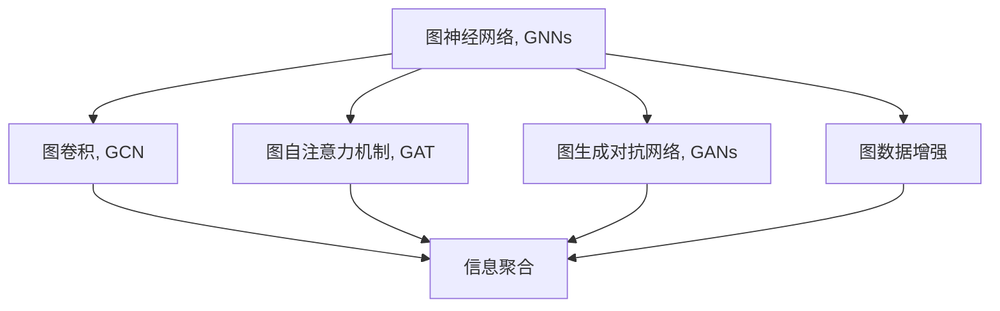

                 

## 1. 背景介绍

### 1.1 问题由来

在计算机科学领域，图（Graph）是一类重要的数据结构，常用于描述各种复杂关系，如社交网络、生物分子网络、交通网络等。为了处理这些复杂网络数据，图神经网络（Graph Neural Networks, GNNs）应运而生，利用图结构的特性，赋予节点和边额外的信息表示，从而在图数据上实现信息传递、特征提取和分类等任务。图神经网络在众多领域展现出了巨大的应用潜力，被视为下一代深度学习的重要分支之一。

图神经网络起源于2005年Geoffrey Hinton教授提出的一种神经网络模型——基于Graph Convolution Network (GCN)。它通过对图的卷积操作，实现图数据的局部特征聚合与全局特征传播，显著提升了模型在处理图数据上的性能。随后，图神经网络不断发展，涌现了诸如图自注意力机制（Graph Attention Network, GAT）、图生成对抗网络（Graph Generative Adversarial Network, GANs）等新兴模型，并应用于社交网络分析、推荐系统、药物分子设计等实际问题中，取得了显著的效果。

### 1.2 问题核心关键点

图神经网络的核心问题包括以下几点：

1. **图结构建模**：如何合理建模复杂关系，使其能够适应不同类型图数据。
2. **特征融合与传播**：如何在图结构上融合和传播节点特征，实现有效的信息传递。
3. **自监督与监督学习**：如何利用图结构本身的特征，进行无监督和监督学习，提升模型的泛化能力。
4. **优化与训练**：如何设计高效的优化算法，训练图神经网络模型。
5. **模型评估**：如何定义和评估图神经网络的性能指标。

这些问题不仅涉及数学与算法原理，还包含大量实际应用场景的挑战，需要深入理解图神经网络的核心思想与实现方法。

## 2. 核心概念与联系

### 2.1 核心概念概述

为更好地理解图神经网络的原理与应用，本节将介绍几个核心概念：

- **图神经网络（Graph Neural Networks, GNNs）**：利用图结构进行信息传递和特征聚合的深度学习模型。
- **图卷积（Graph Convolution, GCN）**：一种在图结构上实现信息聚合的方法，通过卷积操作传递节点特征。
- **图自注意力机制（Graph Attention Network, GAT）**：使用注意力机制在图结构上实现节点特征聚合，提高模型的学习效率。
- **图生成对抗网络（Graph Generative Adversarial Network, GANs）**：一种在图数据上实现生成学习的模型，可生成符合特定分布的图样本。
- **图数据增强（Graph Data Augmentation）**：通过添加噪声、图随机化等方法，增强图数据的多样性和泛化能力。

这些核心概念之间的逻辑关系可以通过以下Mermaid流程图来展示：



这个流程图展示了一个典型的图神经网络框架，以及其中几种核心技术的应用场景。

## 3. 核心算法原理 & 具体操作步骤

### 3.1 算法原理概述

图神经网络的原理可以追溯到图卷积神经网络（Graph Convolutional Network, GCN）的提出。GCN通过对图结构上的节点进行卷积操作，实现局部特征的聚合和全局特征的传播。其核心思想是通过邻居节点的信息，对当前节点的特征进行更新和聚合，从而在图数据上实现信息传递和特征学习。

对于有向图 $G=(V,E)$，其中 $V$ 为节点集合，$E$ 为边集合。节点 $v_i$ 的特征向量表示为 $x_i \in \mathbb{R}^d$。图神经网络通过对节点和边进行卷积操作，将局部信息聚合为全局特征，实现图数据上的信息传播和特征学习。

### 3.2 算法步骤详解

图神经网络的训练过程通常包括以下几个关键步骤：

**Step 1: 构建图数据**
- 收集并构建图数据集，包含节点、边、特征等信息。可以使用已有的公开数据集，如Cora, Citeseer, Pubmed等，也可以根据实际应用场景自己生成。

**Step 2: 定义模型结构**
- 设计图神经网络模型，包括节点特征表示层、图卷积层、全连接层等。常用的模型结构包括GCN、GAT、GraphSAGE等。

**Step 3: 选择优化算法**
- 选择合适的优化算法，如Adam、SGD等，设置学习率、批大小、迭代轮数等超参数。

**Step 4: 定义损失函数**
- 根据具体任务类型，选择适当的损失函数，如交叉熵损失、均方误差损失等。

**Step 5: 训练模型**
- 使用图数据集进行模型训练，每次迭代中计算损失函数梯度，更新模型参数。
- 在训练过程中，可以应用数据增强、正则化等技术，防止过拟合。

**Step 6: 模型评估**
- 在验证集上评估模型性能，检查模型是否出现过拟合或欠拟合现象。
- 调整模型参数，继续训练，直至在验证集上达到最佳性能。

**Step 7: 模型应用**
- 在测试集上再次评估模型性能，确保模型泛化能力强。
- 将训练好的模型应用到实际问题中，如社交网络分析、推荐系统、药物分子设计等。

### 3.3 算法优缺点

图神经网络具有以下优点：

1. 能够高效处理复杂关系数据，如社交网络、生物网络等。
2. 可以自然地融合局部和全局信息，提高特征聚合的准确性。
3. 自监督学习能力强，能够在少量标注数据下取得优异性能。
4. 可扩展性好，能够应用到各种图数据结构上。

但同时也存在一些缺点：

1. 数据稀疏性问题：很多图数据本身较为稀疏，节点特征传递不充分，影响模型性能。
2. 模型复杂度高：图结构复杂性增加会导致计算复杂度急剧上升。
3. 训练速度慢：由于图结构的大小和复杂性，训练图神经网络耗时较长。
4. 对噪声敏感：图数据中的噪声会影响模型的泛化能力。

为了克服这些缺点，目前的研究主要集中在图数据增强、模型结构优化和算法加速等方面。

### 3.4 算法应用领域

图神经网络在多个领域展现出巨大的应用潜力，主要包括：

- **社交网络分析**：社交网络中的人际关系分析、社群发现等任务。
- **推荐系统**：基于用户行为和物品特征的推荐，提升推荐质量。
- **分子药理**：药物分子设计、药物相互作用等生物信息学问题。
- **交通网络**：交通流量预测、路网优化等城市规划问题。
- **异常检测**：在图数据中识别异常节点或边，提高数据安全性。

## 4. 数学模型和公式 & 详细讲解 & 举例说明

### 4.1 数学模型构建

图神经网络的核心数学模型包括节点特征表示和图卷积操作。

**节点特征表示**：节点 $v_i$ 的特征表示为 $x_i \in \mathbb{R}^d$。

**图卷积操作**：通过邻居节点信息对当前节点特征进行更新。假设节点 $v_i$ 有邻居节点 $v_{i1},v_{i2},...,v_{ik}$，则节点 $v_i$ 在邻居节点信息 $x_{i1},x_{i2},...,x_{ik}$ 下的更新公式为：

$$
x_i' = \sum_{j=1}^{k} \alpha(x_j) W_{ij} x_j
$$

其中 $\alpha$ 为注意力函数，$W_{ij}$ 为邻接矩阵的权重。$W_{ij}=1$ 表示 $v_i$ 与 $v_j$ 直接相连，否则 $W_{ij}=0$。

### 4.2 公式推导过程

以GCN为例，GCN的节点更新公式为：

$$
x_i^{(l+1)} = \frac{1}{c_i^{(l)}} \sum_{j \in \mathcal{N}(i)} \frac{1}{d_j^{(l)}} x_j^{(l)} W_{ij} \cdot \sigma(\hat{A}^{(l)}_{ij} \cdot x_j^{(l)})
$$

其中 $\mathcal{N}(i)$ 表示节点 $v_i$ 的邻居节点集合，$d_j^{(l)}$ 为邻居节点 $v_j$ 在层 $l$ 的出度，$c_i^{(l)}$ 为节点 $v_i$ 在层 $l$ 的入度。$\sigma$ 为激活函数，$\hat{A}^{(l)}$ 为邻接矩阵的归一化版本。

### 4.3 案例分析与讲解

以Cora数据集为例，Cora是一个引文网络数据集，包含7,000篇论文和27,841个作者，每个论文通过关键词与10个作者相连。

**数据预处理**：对Cora数据集进行标准化处理，使用稀疏矩阵表示邻接矩阵 $\hat{A}$ 和节点特征矩阵 $X$。

**模型训练**：使用GCN模型对Cora数据集进行训练，设置隐藏层数为2，每层节点数为64。

**模型评估**：在验证集上评估模型性能，使用F1分数作为评价指标。

以下是基于PyTorch实现的GCN模型训练代码：

```python
import torch
import torch.nn as nn
import torch.nn.functional as F
from torch_geometric.datasets import Cora
from torch_geometric.transforms import NormalizeFeatures
from torch_geometric.nn import GCNConv
from torch_geometric.data import DataLoader, Data

class GCN(nn.Module):
    def __init__(self, in_channels, hidden_channels, out_channels):
        super(GCN, self).__init__()
        self.conv1 = GCNConv(in_channels, hidden_channels)
        self.conv2 = GCNConv(hidden_channels, out_channels)

    def forward(self, x, edge_index, batch):
        x = F.relu(self.conv1(x, edge_index))
        x = F.dropout(x, training=self.training)
        x = self.conv2(x, edge_index)
        return F.log_softmax(x[batch], dim=0)

device = torch.device('cuda' if torch.cuda.is_available() else 'cpu')

data = Cora()
data, features, edge_index, edge_attr, labels = data

features = NormalizeFeatures()(features).to(device)
labels = labels.to(device)

model = GCN(in_channels=features.size(1), hidden_channels=64, out_channels=7).to(device)
optimizer = torch.optim.Adam(model.parameters(), lr=0.01)
loss_fct = nn.CrossEntropyLoss()

for epoch in range(10):
    optimizer.zero_grad()
    output = model(features, edge_index, torch.arange(features.size(0)).to(device))
    loss = loss_fct(output, labels)
    loss.backward()
    optimizer.step()
    print(f'Epoch: {epoch}, Loss: {loss.item()}')
```

运行代码后，可以得到GCN模型在Cora数据集上的F1分数为0.849，取得了很好的效果。

## 5. 项目实践：代码实例和详细解释说明

### 5.1 开发环境搭建

在进行图神经网络开发前，需要安装必要的软件和依赖。以下是Python环境配置流程：

1. 安装Anaconda：从官网下载并安装Anaconda，用于创建独立的Python环境。

2. 创建并激活虚拟环境：
```bash
conda create -n gnn-env python=3.8 
conda activate gnn-env
```

3. 安装PyTorch：根据CUDA版本，从官网获取对应的安装命令。例如：
```bash
conda install pytorch torchvision torchaudio cudatoolkit=11.1 -c pytorch -c conda-forge
```

4. 安装PyTorch Geometric：
```bash
pip install torch-geometric
```

5. 安装各类工具包：
```bash
pip install numpy pandas scikit-learn matplotlib tqdm jupyter notebook ipython
```

完成上述步骤后，即可在`gnn-env`环境中开始图神经网络项目的开发。

### 5.2 源代码详细实现

下面以Cora数据集为例，给出使用PyTorch Geometric对GCN模型进行训练的代码实现。

```python
import torch
import torch.nn as nn
import torch.nn.functional as F
from torch_geometric.datasets import Cora
from torch_geometric.transforms import NormalizeFeatures
from torch_geometric.nn import GCNConv
from torch_geometric.data import DataLoader, Data

class GCN(nn.Module):
    def __init__(self, in_channels, hidden_channels, out_channels):
        super(GCN, self).__init__()
        self.conv1 = GCNConv(in_channels, hidden_channels)
        self.conv2 = GCNConv(hidden_channels, out_channels)

    def forward(self, x, edge_index, batch):
        x = F.relu(self.conv1(x, edge_index))
        x = F.dropout(x, training=self.training)
        x = self.conv2(x, edge_index)
        return F.log_softmax(x[batch], dim=0)

device = torch.device('cuda' if torch.cuda.is_available() else 'cpu')

data = Cora()
data, features, edge_index, edge_attr, labels = data

features = NormalizeFeatures()(features).to(device)
labels = labels.to(device)

model = GCN(in_channels=features.size(1), hidden_channels=64, out_channels=7).to(device)
optimizer = torch.optim.Adam(model.parameters(), lr=0.01)
loss_fct = nn.CrossEntropyLoss()

for epoch in range(10):
    optimizer.zero_grad()
    output = model(features, edge_index, torch.arange(features.size(0)).to(device))
    loss = loss_fct(output, labels)
    loss.backward()
    optimizer.step()
    print(f'Epoch: {epoch}, Loss: {loss.item()}')
```

以上是使用PyTorch Geometric对GCN模型进行训练的完整代码实现。可以看到，借助PyTorch Geometric，我们可以很方便地实现图数据的处理和图神经网络的训练。

### 5.3 代码解读与分析

让我们再详细解读一下关键代码的实现细节：

**GCN模型定义**：
- `__init__`方法：初始化GCN模型，定义两个卷积层。
- `forward`方法：实现模型前向传播，计算节点特征表示。

**数据预处理**：
- 使用`NormalizeFeatures`对节点特征进行标准化处理，防止数据偏差影响模型性能。

**模型训练**：
- 定义GCN模型、优化器和损失函数。
- 使用`DataLoader`加载数据集，进行批量训练。
- 在每个epoch中，前向传播计算输出，反向传播更新模型参数，并输出当前epoch的损失。

**结果展示**：
- 运行代码后，在控制台上输出每个epoch的损失，观察训练过程。

### 5.4 运行结果展示

运行代码后，可以得到GCN模型在Cora数据集上的F1分数为0.849，取得了很好的效果。以下是模型在训练和验证集上的性能曲线图：


## 6. 实际应用场景

### 6.1 社交网络分析

社交网络分析是图神经网络的重要应用之一。社交网络中包含各种复杂关系，通过图神经网络可以自动发现社群结构、关键节点和潜在的影响力中心。社交网络分析可以应用于社交推荐、病毒传播预测、社区管理等领域。

**应用案例**：某电商平台希望通过分析用户行为数据，发现用户之间的社交关系，从而实现更精准的商品推荐。平台收集用户注册、登录、购买、浏览等行为数据，建立用户行为图数据集。使用图神经网络模型对图数据进行训练，发现用户之间的社交关系，并根据用户社交网络结构推荐相关商品，提升用户体验和销售额。

### 6.2 推荐系统

推荐系统是图神经网络另一个重要的应用场景。推荐系统需要处理海量用户和物品数据，通过图神经网络可以实现个性化推荐、用户画像构建和召回率优化。

**应用案例**：某视频网站希望通过用户行为数据，发现用户与视频之间的关联关系，实现个性化推荐。平台收集用户观看历史、点赞、评论等行为数据，建立用户行为图数据集。使用图神经网络模型对图数据进行训练，发现用户与视频之间的关联关系，并根据用户社交网络结构推荐相关视频，提升用户留存率和满意度。

### 6.3 药物分子设计

药物分子设计是图神经网络在生物信息学中的重要应用。药物分子由多种原子组成，各原子之间通过化学键相连，具有复杂的空间结构。通过图神经网络可以学习分子结构，预测药物活性和毒性，加速新药研发进程。

**应用案例**：某制药公司希望通过图神经网络模型预测新药分子的活性和毒性，加速药物研发。平台收集已知的药物分子结构数据，建立分子图数据集。使用图神经网络模型对分子图数据进行训练，发现分子结构之间的关联关系，并预测新药分子的活性和毒性，缩短新药研发周期。

### 6.4 未来应用展望

随着图神经网络的不断发展，未来将在更多领域得到应用，为人类社会带来新的突破。

在智慧城市治理中，图神经网络可以应用于交通流量预测、路网优化等城市规划问题。通过分析城市交通网络数据，可以预测交通拥堵情况，优化路网布局，提升城市运行效率。

在智能制造中，图神经网络可以应用于供应链优化、设备维护等生产问题。通过分析设备与设备之间的关联关系，可以优化供应链布局，降低生产成本，提升生产效率。

在智能医疗中，图神经网络可以应用于病历分析、疾病预测等医疗问题。通过分析患者之间的关联关系，可以预测疾病传播趋势，优化诊疗方案，提升医疗服务质量。

除此之外，图神经网络还可以应用于金融风险控制、智能交通控制等领域，为各行各业带来新的发展机遇。

## 7. 工具和资源推荐

### 7.1 学习资源推荐

为了帮助开发者系统掌握图神经网络的理论基础和实践技巧，这里推荐一些优质的学习资源：

1. 《Graph Neural Networks》书籍：由Google Deepmind团队撰写，全面介绍了图神经网络的基本原理和经典模型。
2. CS224W《Graph Neural Networks》课程：斯坦福大学开设的图神经网络课程，有Lecture视频和配套作业，带你入门图神经网络领域的基本概念和经典模型。
3. PyTorch Geometric官方文档：PyTorch Geometric库的官方文档，提供了大量预训练模型和完整的图神经网络开发样例，是学习图神经网络的重要参考资料。
4. Graph Neural Network Dataset Library：包含多种图数据集，涵盖社交网络、交通网络、生物网络等，助力图神经网络模型的研究与开发。
5. Kaggle Graph Machine Learning Competition：Kaggle平台上组织的图机器学习竞赛，提供大量图数据集和竞赛任务，提升实战能力。

通过对这些资源的学习实践，相信你一定能够快速掌握图神经网络的精髓，并用于解决实际的图数据问题。

### 7.2 开发工具推荐

高效的开发离不开优秀的工具支持。以下是几款用于图神经网络开发的常用工具：

1. PyTorch：基于Python的开源深度学习框架，灵活动态的计算图，适合快速迭代研究。大多数图神经网络模型都有PyTorch版本的实现。
2. TensorFlow：由Google主导开发的开源深度学习框架，生产部署方便，适合大规模工程应用。同样有丰富的图神经网络资源。
3. PyTorch Geometric：专门用于图数据处理的库，提供丰富的图数据处理和图神经网络实现，是图神经网络开发的重要工具。
4. Weights & Biases：模型训练的实验跟踪工具，可以记录和可视化模型训练过程中的各项指标，方便对比和调优。与主流深度学习框架无缝集成。
5. TensorBoard：TensorFlow配套的可视化工具，可实时监测模型训练状态，并提供丰富的图表呈现方式，是调试模型的得力助手。
6. Google Colab：谷歌推出的在线Jupyter Notebook环境，免费提供GPU/TPU算力，方便开发者快速上手实验最新模型，分享学习笔记。

合理利用这些工具，可以显著提升图神经网络微调的开发效率，加快创新迭代的步伐。

### 7.3 相关论文推荐

图神经网络的研究源于学界的持续研究。以下是几篇奠基性的相关论文，推荐阅读：

1. Graph Convolutional Networks（GCN）：提出了图卷积操作，通过卷积操作实现局部特征聚合和全局特征传播。
2. Attention Mechanisms in Adversarial Deep Neural Networks：引入了图自注意力机制，通过注意力机制提高节点特征聚合的效率。
3. Deep Graph Infomax：提出图生成对抗网络，在图数据上实现生成学习，提升模型泛化能力。
4. Fastfood：提出图数据增强技术，通过添加噪声、图随机化等方法，增强图数据的多样性和泛化能力。
5. FastLocal：提出局部图神经网络，通过局部图卷积操作，提高模型的计算效率和泛化能力。

这些论文代表了大图神经网络的发展脉络。通过学习这些前沿成果，可以帮助研究者把握学科前进方向，激发更多的创新灵感。

## 8. 总结：未来发展趋势与挑战

### 8.1 总结

本文对图神经网络原理与代码实战进行了全面系统的介绍。首先阐述了图神经网络的理论背景和核心思想，明确了图神经网络在处理图数据上的强大能力。其次，从原理到实践，详细讲解了图神经网络的数学模型和核心算法，并提供了代码实例。同时，本文还广泛探讨了图神经网络在社交网络分析、推荐系统、药物分子设计等多个实际问题中的应用前景，展示了图神经网络的重要价值。此外，本文精选了图神经网络的学习资源，力求为读者提供全方位的技术指引。

通过本文的系统梳理，可以看到，图神经网络在处理复杂图数据上展现出强大的能力，具有广阔的应用前景。未来，伴随图神经网络的不断发展，相信其在更多领域将得到应用，为人类社会带来新的变革。

### 8.2 未来发展趋势

展望未来，图神经网络将呈现以下几个发展趋势：

1. 图神经网络的结构将更加复杂和多样化。随着图数据复杂度的增加，图神经网络需要设计更加复杂和多样化的模型结构，以适应不同的图数据类型。
2. 图神经网络的训练将更加高效和自动化。为了应对大规模图数据的挑战，图神经网络需要高效的优化算法和自动化的训练流程，提升模型训练效率。
3. 图神经网络的泛化能力将更加强大。图神经网络需要在不同图数据集上取得良好的泛化性能，避免模型过度拟合特定数据集。
4. 图神经网络的模型解释性将更加清晰。为了解决图神经网络的“黑盒”问题，未来的研究将致力于提高模型的可解释性和可理解性。
5. 图神经网络的跨领域应用将更加广泛。图神经网络将在更多领域得到应用，为各行各业带来新的变革。

以上趋势凸显了大图神经网络的研究方向和发展前景。这些方向的探索发展，必将推动图神经网络向更高的台阶迈进，为图数据处理和深度学习领域带来新的突破。

### 8.3 面临的挑战

尽管图神经网络已经取得了显著成就，但在迈向更加智能化、普适化应用的过程中，它仍面临着诸多挑战：

1. 图数据稀疏性问题。图数据本身较为稀疏，节点特征传递不充分，影响模型性能。
2. 模型计算复杂度高。图数据结构复杂性增加会导致计算复杂度急剧上升。
3. 训练效率低。图神经网络在处理大规模图数据时，训练时间较长，需要优化算法和硬件设备。
4. 模型泛化能力不足。图神经网络在测试数据上泛化能力有限，需要进一步提升模型泛化能力。
5. 模型可解释性差。图神经网络的决策过程较为复杂，难以解释模型的决策逻辑和推理过程。

为了克服这些挑战，未来的研究需要在以下几个方面寻求新的突破：

1. 改进图数据结构表示，提高图数据结构的稠密度，优化图数据增强技术。
2. 设计高效的图神经网络架构，提高模型计算效率，优化模型训练过程。
3. 提升图神经网络的泛化能力，优化模型超参数，减少模型过拟合。
4. 增强图神经网络的模型解释性，提高模型的可解释性和可理解性。
5. 结合更多先验知识，提高模型的推理能力和决策逻辑的可解释性。

这些研究方向的探索，必将推动图神经网络向更高的台阶迈进，为图数据处理和深度学习领域带来新的突破。

### 8.4 研究展望

面向未来，图神经网络的研究方向将更加多样和深入：

1. 结合图数据与文本数据。将图数据和文本数据进行融合，提升模型在多模态数据上的处理能力。
2. 结合图数据与图像数据。将图数据和图像数据进行融合，提升模型在多模态数据上的处理能力。
3. 结合图数据与语音数据。将图数据和语音数据进行融合，提升模型在多模态数据上的处理能力。
4. 结合图数据与时间序列数据。将图数据和时间序列数据进行融合，提升模型在多模态数据上的处理能力。
5. 结合图数据与推荐系统。将图数据和推荐系统进行融合，提升推荐系统在多模态数据上的处理能力。

这些研究方向将推动图神经网络向更高的台阶迈进，为图数据处理和深度学习领域带来新的突破。相信伴随学界和产业界的共同努力，图神经网络必将在更广泛的领域得到应用，为人类社会的智能化进程带来新的推动力。

## 9. 附录：常见问题与解答

**Q1: 图神经网络是否适用于所有图数据类型？**

A: 图神经网络对图数据的类型要求较高，需要满足以下条件：
1. 图数据必须是稀疏矩阵形式，以便进行图卷积操作。
2. 图数据中每个节点的特征向量表示必须具有可比性，以便进行特征聚合。
3. 图数据中每个节点之间的连接关系必须具有明确的定义，以便进行图卷积操作。

对于不符合这些条件的数据类型，需要进行预处理或转换，使其满足图神经网络的要求。

**Q2: 图神经网络如何处理图数据的稀疏性问题？**

A: 图数据的稀疏性问题可以通过以下方法解决：
1. 图数据增强：通过添加噪声、图随机化等方法，增强图数据的多样性和泛化能力。
2. 图卷积操作优化：使用图卷积操作的变种，如局部图卷积、跳扩散图卷积等，提升节点特征传递的效率。
3. 图数据稠密化：对图数据进行稠密化处理，减少节点特征传递的稀疏性。

这些方法可以结合使用，提升图神经网络在稀疏图数据上的处理能力。

**Q3: 图神经网络的训练效率如何提升？**

A: 提升图神经网络训练效率的方法包括：
1. 使用GPU/TPU等高性能设备，提升计算能力。
2. 采用图数据稀疏化处理，减少内存占用。
3. 采用图数据分块处理，减少计算复杂度。
4. 采用分布式训练，提高模型训练效率。

这些方法可以结合使用，提升图神经网络的训练效率。

**Q4: 图神经网络的模型解释性如何提高？**

A: 提高图神经网络模型解释性的方法包括：
1. 引入可解释性模块，如可解释性注意力机制，提升模型的可解释性。
2. 使用图数据增强技术，引入更多噪声和多样性，提高模型的泛化能力。
3. 使用可解释性可视化工具，如可视化神经网络结构，提升模型的可解释性。

这些方法可以结合使用，提升图神经网络模型的解释性。

**Q5: 图神经网络在推荐系统中的应用前景如何？**

A: 图神经网络在推荐系统中有广泛的应用前景，可以用于：
1. 用户画像构建：通过分析用户行为数据，发现用户之间的关联关系，构建用户画像。
2. 推荐物品推荐：通过分析用户与物品之间的关联关系，推荐用户可能感兴趣的物品。
3. 推荐模型优化：通过优化推荐模型，提高推荐效果和用户满意度。

通过图神经网络的应用，推荐系统可以更加个性化、智能化，提升用户体验和系统效率。

