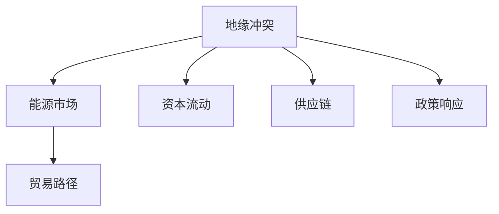

                 

## 1. 背景介绍

### 1.1 问题由来

随着全球化进程的加速，世界各国的经济联系日益紧密，而地缘政治冲突的加剧，往往会对国际经济形势产生深远的影响。特别是近年来，中东地区、东欧、南中国海等地的紧张局势频发，导致了油气价格上涨、贸易路线受阻、资本市场波动等一系列经济问题。如何科学、全面地分析和评估地缘冲突对经济的影响，成为国内外经济学界和政策制定者关注的重点。

### 1.2 问题核心关键点

地缘冲突对经济的影响主要体现在以下几个方面：

1. **能源市场**：冲突区域的油气资源往往集中，战争、制裁等行为可能导致供应中断，从而影响全球能源市场，引发能源价格波动。
2. **贸易路径**：冲突可能切断重要的贸易路线，如苏伊士运河、霍尔木兹海峡等，影响全球货物和资源的流通。
3. **资本流动**：冲突地区的投资环境恶化，可能导致投资者撤资，影响资本市场的稳定。
4. **供应链**：地缘冲突可能破坏全球供应链，导致生产成本上升和供应短缺，影响企业运营和消费者利益。
5. **政策响应**：各国政府可能采取不同的经济政策来应对冲突，如货币贬值、财政刺激等，这些政策也会对全球经济产生复杂的影响。

### 1.3 问题研究意义

了解和评估地缘冲突对经济的影响，对于预测未来经济趋势、制定稳健的财政和货币政策、以及指导企业的投资决策具有重要意义。此外，这种分析还能帮助国际组织和国家机构更好地协调国际经济关系，维护全球经济稳定。

## 2. 核心概念与联系

### 2.1 核心概念概述

为更好地理解地缘冲突对经济影响的分析，本节将介绍几个密切相关的核心概念：

- **地缘冲突**：指国家或地区之间因领土、资源、政治、宗教等因素引发的军事或政治对抗，包括战争、制裁、恐怖袭击等。
- **能源市场**：包括石油、天然气、煤炭等一次性能源的市场，涉及生产、贸易、消费等环节。
- **贸易路径**：国际货物和服务的运输路线，如海运、航空、管道等。
- **资本流动**：国际间的资金流动，包括直接投资、证券投资、贷款等。
- **供应链**：从原料采购到产品销售的完整路径，涉及生产、运输、物流等环节。
- **政策响应**：各国政府为应对地缘冲突而采取的财政和货币政策，如货币贬值、财政刺激、贸易保护等。

这些核心概念之间的逻辑关系可以通过以下Mermaid流程图来展示：



这个流程图展示了几大核心概念及其之间的相互作用关系：

1. 地缘冲突直接影响能源市场，可能引起价格波动。
2. 地缘冲突可能切断重要的贸易路径，影响贸易流通。
3. 地缘冲突导致资本流动不稳定，影响资本市场稳定。
4. 地缘冲突可能破坏供应链，引发生产成本上升。
5. 地缘冲突促使各国采取政策响应，进一步影响全球经济。

## 3. 核心算法原理 & 具体操作步骤
### 3.1 算法原理概述

地缘冲突对经济影响的分析，本质上是一个多维度、多因素的复杂系统问题。其核心思想是：将地缘冲突看作一个输入变量，研究其对能源市场、贸易路径、资本流动、供应链以及政策响应的影响。这种影响通常可以通过数学模型进行定量分析，再结合统计数据和专家意见进行综合评估。

### 3.2 算法步骤详解

地缘冲突对经济影响的分析可以分为以下几个关键步骤：

**Step 1: 数据收集与预处理**

- 收集冲突地区的能源价格、贸易流量、资本市场数据、供应链成本等相关信息。
- 数据预处理，包括清洗、归一化、缺失值处理等步骤，确保数据的准确性和一致性。

**Step 2: 构建多变量模型**

- 构建包含冲突变量和多个经济变量的多元回归模型，如向量自回归模型(VAR)、向量误差修正模型(VECM)等。
- 引入外部冲击因素，如政策变化、自然灾害等，以捕捉长期和短期的动态影响。

**Step 3: 模型训练与验证**

- 使用历史数据对模型进行训练，确定最优参数和模型结构。
- 在验证集上评估模型预测能力，确保模型泛化性能良好。

**Step 4: 效果评估与解释**

- 使用测试集评估模型预测效果，如均方误差(MSE)、平均绝对误差(MAE)等指标。
- 分析模型输出结果，结合经济学原理和经济数据进行解释。

**Step 5: 政策建议**

- 根据模型预测结果，提出应对地缘冲突的经济政策建议，如能源储备、贸易协定、资本流动管理等。

### 3.3 算法优缺点

地缘冲突对经济影响的分析方法具有以下优点：

1. **系统性**：通过多变量模型综合考虑多个影响因素，避免了单一因素的局限性。
2. **可预测性**：数学模型能够提供定量预测，有助于提前采取应对措施。
3. **数据驱动**：基于历史数据进行训练，提供了客观的评估依据。
4. **政策指导**：模型输出能够为政策制定者提供科学依据，提升政策决策的合理性。

同时，该方法也存在一定的局限性：

1. **数据质量要求高**：模型结果依赖于数据质量，数据的准确性和完整性对结果影响较大。
2. **外部冲击复杂**：模型难以全面捕捉所有外部冲击因素，可能存在遗漏。
3. **模型假设简化**：模型构建过程中做了许多假设，可能与实际情况有所偏差。
4. **预测精度有限**：即使模型训练效果良好，预测结果仍存在不确定性。
5. **政策效果滞后**：政策效果的显现往往需要时间，模型的预测可能存在时滞。

尽管存在这些局限性，但地缘冲突对经济影响的分析方法仍是一种重要的研究工具，能够为经济决策提供重要的参考依据。

### 3.4 算法应用领域

地缘冲突对经济影响的分析方法在多个领域得到了应用，包括：

1. **金融分析**：分析冲突对全球资本市场的影响，评估金融风险。
2. **国际关系**：评估冲突对国际贸易和投资的影响，指导国际经济合作。
3. **企业决策**：帮助企业评估供应链风险，优化生产安排。
4. **政策制定**：辅助政府制定针对地缘冲突的经济政策，如能源战略、贸易保护等。
5. **研究机构**：支持学术机构进行地缘经济研究，提升对复杂经济现象的理解。

## 4. 数学模型和公式 & 详细讲解 & 举例说明
### 4.1 数学模型构建

地缘冲突对经济影响的分析通常使用多元回归模型或向量自回归模型(VAR)来构建。这里以VAR模型为例，进行详细说明。

设地缘冲突变量为 $X_t$，能源价格 $Y_t$，贸易流量 $Z_t$，资本流动 $W_t$，供应链成本 $U_t$ 等。VAR模型可以表示为：

$$
\begin{aligned}
Y_t &= \alpha_0 + \alpha_1 Y_{t-1} + \alpha_2 X_t + \epsilon_{Yt} \\
Z_t &= \beta_0 + \beta_1 Z_{t-1} + \beta_2 X_t + \epsilon_{Zt} \\
W_t &= \gamma_0 + \gamma_1 W_{t-1} + \gamma_2 X_t + \epsilon_{Wt} \\
U_t &= \delta_0 + \delta_1 U_{t-1} + \delta_2 X_t + \epsilon_{Ut}
\end{aligned}
$$

其中 $\epsilon_{Yt}, \epsilon_{Zt}, \epsilon_{Wt}, \epsilon_{Ut}$ 为误差项。

### 4.2 公式推导过程

在VAR模型中，变量之间的动态关系可以通过Johansen协整检验和Granger因果检验来进一步验证。以Johansen协整检验为例，通过计算最大特征根 $λ$ 和迹统计量 $Tr$，来判断变量之间是否存在长期协整关系。

假设有 $p$ 个变量，设协整矩阵为 $\Phi$，Johansen协整检验的公式为：

$$
\hat{\Phi} = \frac{1}{N} \sum_{t=1}^N X_t \hat{X}_t'
$$

其中 $\hat{X}_t = (X_t, Y_t, Z_t, W_t, U_t)'$，$\hat{X}_t' = (X_t, Y_t, Z_t, W_t, U_t)$。

然后计算最大特征根 $λ$ 和迹统计量 $Tr$：

$$
\lambda_{\max} = \max\limits_{1 \leq i \leq p} \{\lambda_i\}
$$

$$
Tr = \sum\limits_{i=1}^p \ln\left(\frac{\lambda_i}{1 - \lambda_i}\right)
$$

如果 $\lambda_{\max}$ 或 $Tr$ 值满足特定条件，则拒绝原假设，认为变量之间存在长期协整关系。

### 4.3 案例分析与讲解

以中东地区的地缘冲突对全球石油价格的影响为例，进行案例分析：

1. **数据准备**：收集中东冲突事件、全球石油价格数据、国际贸易数据、资本市场数据等。
2. **模型构建**：建立包含这些变量的VAR模型，引入冲突变量 $X_t$ 作为输入。
3. **模型训练**：使用历史数据对模型进行训练，确定最优参数。
4. **模型验证**：在验证集上评估模型预测能力，使用MSE和MAE指标进行衡量。
5. **结果分析**：解释模型输出结果，结合经济学原理进行分析。
6. **政策建议**：根据模型预测，提出应对冲突的经济政策建议，如能源储备、贸易协定等。

## 5. 项目实践：代码实例和详细解释说明
### 5.1 开发环境搭建

在进行地缘冲突对经济影响的分析前，我们需要准备好开发环境。以下是使用Python进行模型训练的环境配置流程：

1. 安装Anaconda：从官网下载并安装Anaconda，用于创建独立的Python环境。

2. 创建并激活虚拟环境：
```bash
conda create -n econ-env python=3.8 
conda activate econ-env
```

3. 安装相关库：
```bash
conda install pandas numpy matplotlib statsmodels statsmodels-tools scikit-learn statsmodels
```

4. 安装Johansen协整检验库：
```bash
pip install pytsf-causality statsmodels-arch
```

完成上述步骤后，即可在`econ-env`环境中开始模型训练实践。

### 5.2 源代码详细实现

以下是一个简单的Python代码实现，用于构建和训练VAR模型：

```python
import pandas as pd
import numpy as np
from statsmodels.tsa.vector_ar.var_model import VAR
from statsmodels.tsa.stattools import adfuller
from statsmodels.tsa.causality_granger import grangercausalitytests

# 导入数据
data = pd.read_csv('data.csv', index_col='time', parse_dates=True)

# 处理数据
data = data.dropna().resample('M').mean()

# 划分训练集和验证集
train_data = data[:'2018'].loc[:, ['Y', 'Z', 'W', 'U', 'X']]
val_data = data['2019':].loc[:, ['Y', 'Z', 'W', 'U', 'X']]

# 构建VAR模型
model = VAR(train_data, k_endog=5)

# 训练模型
model_fit = model.fit()

# 进行协整检验
result = model_fit.test_causality(granger=False, aa=False, ftypes=1)

# 输出协整结果
print(result.summary())
```

### 5.3 代码解读与分析

让我们再详细解读一下关键代码的实现细节：

**数据导入与处理**：
- `data.read_csv('data.csv', index_col='time', parse_dates=True)`：读取CSV文件，指定时间列，并解析日期格式。

**模型构建与训练**：
- `model = VAR(train_data, k_endog=5)`：构建向量自回归模型，指定5个内生变量。

**模型训练**：
- `model_fit = model.fit()`：使用训练集数据拟合模型，得到最优参数。

**协整检验**：
- `result = model_fit.test_causality(granger=False, aa=False, ftypes=1)`：进行协整检验，确认变量之间是否存在长期稳定关系。

**结果输出**：
- `print(result.summary())`：输出协整检验结果，包括协整矩阵、特征根等。

此代码实现了基本的VAR模型构建与训练，以及协整检验的计算。在实际应用中，还需要考虑更多因素，如数据的季节性、模型截距的设定等。

## 6. 实际应用场景
### 6.1 金融分析

地缘冲突对金融市场的影响是显而易见的。冲突可能引发资本市场动荡，投资者情绪恶化，从而导致股票、债券等资产价格波动。金融分析机构可以利用地缘冲突对经济影响的分析模型，预测市场趋势，指导投资决策。

**案例分析**：中东地区的冲突可能导致油价上涨，从而影响全球股市。通过构建VAR模型，可以预测能源价格波动对股市的影响，提前采取应对措施。

### 6.2 国际贸易

地缘冲突往往会影响国际贸易路线，导致商品运输受阻，价格上涨。国际贸易企业可以利用地缘冲突对经济影响的分析，优化供应链管理，规避风险。

**案例分析**：东欧地区的冲突可能导致苏伊士运河堵塞，影响全球货物运输。通过构建VAR模型，可以预测运输成本上升对企业运营的影响，提前调整库存和物流计划。

### 6.3 企业决策

地缘冲突对企业决策具有重要影响，尤其是在供应链管理方面。冲突可能导致原材料短缺、生产成本上升，企业需要及时调整生产策略，以应对不确定性。

**案例分析**：南中国海的冲突可能导致关键原材料的供应链中断，企业可以利用地缘冲突对经济影响的分析，提前储备原材料，确保生产稳定。

### 6.4 政策制定

政府在制定经济政策时，也需要考虑地缘冲突的影响。政策制定者可以通过地缘冲突对经济影响的分析，评估各种政策措施的效果，优化政策设计。

**案例分析**：为应对中东地区冲突，政府可以采取财政刺激政策，增加能源储备，保障市场供应稳定。

## 7. 工具和资源推荐
### 7.1 学习资源推荐

为了帮助开发者系统掌握地缘冲突对经济影响的分析方法，这里推荐一些优质的学习资源：

1. 《经济学原理》：经典经济学教材，详细讲解了经济学的基本原理和分析方法。
2. 《金融市场与金融机构》：金融学入门教材，介绍了金融市场的基本概念和运作机制。
3. 《国际贸易与投资》：国际贸易教材，介绍了国际贸易和投资的原理与政策。
4. 《宏观经济学》：宏观经济学教材，讲解了经济增长的理论框架和政策分析。
5. 《地缘政治经济学》：专注于地缘政治与经济关系的理论书籍，提供了深入的经济学视角。

通过对这些资源的学习实践，相信你一定能够快速掌握地缘冲突对经济影响的分析方法，并用于解决实际的经济学问题。
###  7.2 开发工具推荐

高效的开发离不开优秀的工具支持。以下是几款用于地缘冲突对经济影响的分析开发的常用工具：

1. R语言：统计分析常用工具，提供丰富的统计和可视化库，如ggplot2、tidyverse等。
2. Python语言：数据科学和机器学习常用工具，提供Pandas、NumPy、SciPy等库。
3. Excel：数据处理和分析常用工具，提供丰富的函数和图表功能。
4. MATLAB：科学计算和工程分析常用工具，提供强大的矩阵计算和图形绘制功能。
5. SPSS：统计分析常用工具，提供丰富的统计分析方法和可视化功能。

合理利用这些工具，可以显著提升地缘冲突对经济影响的分析开发效率，加快创新迭代的步伐。

### 7.3 相关论文推荐

地缘冲突对经济影响的分析研究在学术界和政策研究领域已经积累了大量成果。以下是几篇具有代表性的论文，推荐阅读：

1. "Economic Impact of War: A Structural Analysis"（战争对经济的结构性分析）
2. "The Effects of Geopolitical Tensions on Global Markets"（地缘政治紧张对全球市场的效应）
3. "Energy Prices and Geopolitical Conflicts"（能源价格与地缘政治冲突）
4. "Geopolitical Risks and Global Supply Chains"（地缘政治风险与全球供应链）
5. "The Economic Implications of Regional Conflicts"（地区冲突的经济影响）

这些论文代表了大规模经济系统与地缘政治互动的研究进展，通过阅读这些文献，可以深入理解地缘冲突对经济影响的机理和复杂性。

## 8. 总结：未来发展趋势与挑战
### 8.1 研究成果总结

本文对地缘冲突对经济影响的分析方法进行了全面系统的介绍。首先阐述了地缘冲突的复杂性和重要性，明确了分析地缘冲突对经济影响的理论基础和方法论。其次，从原理到实践，详细讲解了多变量模型和协整检验的应用步骤，给出了模型训练的完整代码实例。同时，本文还广泛探讨了地缘冲突对金融、贸易、企业决策等多个领域的影响，展示了分析方法的广泛适用性。此外，本文精选了相关学习资源和开发工具，力求为读者提供全方位的技术指引。

通过本文的系统梳理，可以看到，地缘冲突对经济影响的分析方法在多个领域得到了广泛应用，为政策制定、企业决策、金融分析提供了重要参考。未来，伴随地缘政治的复杂性和经济全球化的深入，地缘冲突对经济影响的研究将更加重要，也为多学科交叉提供了新的研究机会。

### 8.2 未来发展趋势

展望未来，地缘冲突对经济影响的分析方法将呈现以下几个发展趋势：

1. **多维度分析**：随着数据采集技术的进步，分析维度将进一步拓展，从单一经济指标到多领域融合。
2. **预测精度提升**：借助更高级的统计方法和机器学习技术，预测精度将进一步提升，能够提供更准确的预警和政策建议。
3. **实时监控**：通过大数据和云计算技术，实现对地缘冲突的实时监控和分析，及时响应突发事件。
4. **政策模拟**：结合政策评估模型，模拟不同政策措施对地缘冲突经济影响的后果，优化政策设计。
5. **多学科融合**：结合地理学、政治学、社会学等学科知识，进行综合分析和决策支持。

这些趋势将推动地缘冲突对经济影响的分析方法向更高效、更全面、更深入的方向发展，为全球经济稳定提供更为可靠的数据支持。

### 8.3 面临的挑战

尽管地缘冲突对经济影响的分析方法已经取得了一定进展，但在迈向更加智能化、普适化应用的过程中，仍面临诸多挑战：

1. **数据获取难度大**：地缘冲突的数据往往分散，且质量参差不齐，获取难度大。
2. **模型复杂度高**：地缘冲突的复杂性使得模型构建和训练过程繁琐，需要大量的统计和计算资源。
3. **预测准确性不足**：地缘冲突的突发性和不确定性使得模型预测准确性难以保证。
4. **政策效果评估难**：不同政策措施的效果难以量化，需要结合定性分析进行综合评估。
5. **多因素干扰**：地缘冲突受到多种因素影响，模型难以全面考虑所有变量。

尽管存在这些挑战，但地缘冲突对经济影响的分析方法仍然具有重要的研究价值和应用前景。未来研究需要更加注重数据采集和处理技术，提高模型训练效率和预测精度，并结合政策评估模型进行综合决策。

### 8.4 研究展望

面对地缘冲突对经济影响的复杂性和挑战性，未来的研究需要在以下几个方面寻求新的突破：

1. **数据整合与标准化**：推动全球地缘冲突数据的整合和标准化，建立统一的数据平台，提高数据获取的便利性。
2. **跨学科研究**：加强跨学科合作，整合地理学、政治学、社会学等知识，提升分析的深度和广度。
3. **模型优化与融合**：结合机器学习、深度学习等技术，优化模型结构，提高预测精度和泛化能力。
4. **实时分析与预警**：利用大数据和云计算技术，实现对地缘冲突的实时监控和预警，提升应对突发事件的能力。
5. **政策仿真与评估**：开发政策仿真工具，评估不同政策措施的效果，优化政策设计，提高政策的科学性和有效性。

这些研究方向的探索，将推动地缘冲突对经济影响的分析方法迈向更高的台阶，为全球经济稳定和政策制定提供更为可靠的数据支持。

## 9. 附录：常见问题与解答

**Q1: 如何评估地缘冲突对经济的影响？**

A: 评估地缘冲突对经济的影响通常通过构建和训练多变量模型（如VAR模型）来实现。模型输入包括地缘冲突变量和多个经济变量，输出结果可以提供定量预测，帮助评估经济影响。

**Q2: 如何缓解地缘冲突对经济的影响？**

A: 缓解地缘冲突对经济的影响通常需要采取多管齐下的策略，如增加能源储备、优化供应链管理、调整财政和货币政策等。具体措施需要根据实际情况和数据模型进行科学决策。

**Q3: 地缘冲突对金融市场的影响有哪些？**

A: 地缘冲突对金融市场的影响主要包括：引发资本市场动荡，投资者情绪恶化，从而导致股票、债券等资产价格波动。

**Q4: 地缘冲突对国际贸易的影响有哪些？**

A: 地缘冲突对国际贸易的影响主要包括：切断重要的贸易路线，影响货物运输，导致商品价格上涨，供应链中断。

**Q5: 如何构建VAR模型？**

A: 构建VAR模型需要以下步骤：收集历史数据，进行数据预处理，选择变量，构建模型，使用历史数据进行训练，进行协整检验，输出模型结果。具体代码实现可以参考上文提供的Python代码实例。

通过上述系统梳理，可以全面了解地缘冲突对经济影响的分析方法，并掌握其在金融、贸易、企业决策等多个领域的应用。未来研究需要更加注重数据采集和处理技术，提高模型训练效率和预测精度，同时结合政策评估模型进行综合决策，以更好地应对地缘冲突带来的复杂经济影响。

---

作者：禅与计算机程序设计艺术 / Zen and the Art of Computer Programming

