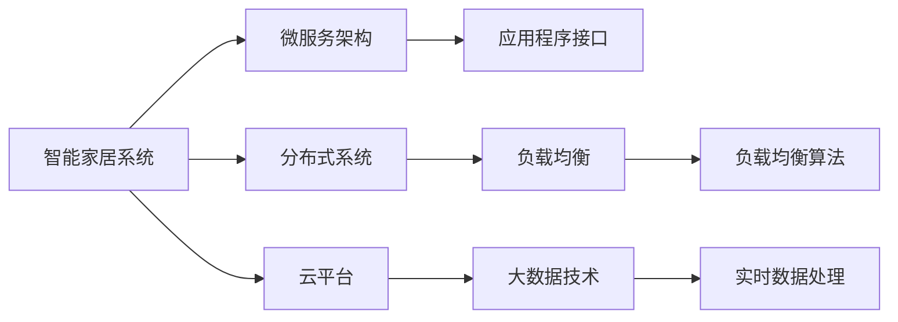

                 

# 基于Java的智能家居设计：如何利用Java实现智能家居中的负载均衡

> 关键词：智能家居,Java,负载均衡,微服务,分布式系统,应用程序,架构设计,云平台,大数据

## 1. 背景介绍

随着物联网技术的不断发展和普及，智能家居系统已经成为现代家庭的重要组成部分。智能家居系统通过将各种智能设备与互联网连接，实现家居设备的智能化控制和信息处理，为居民提供更加便捷、舒适、安全和高效的生活体验。然而，随着智能设备的数量不断增加，智能家居系统的复杂性和负载压力也随之增加，如何有效管理智能家居系统中的设备和资源，确保系统的稳定性和可靠性，成为摆在开发者面前的一个重要问题。

### 1.1 问题由来

在智能家居系统中，设备的数量和种类繁多，包括智能照明、智能温控、智能安防、智能家电等多种类型。这些设备通过网络通信协议互相连接，共同构成了一个庞大的网络系统。由于智能设备数量的不断增加，系统的负载压力也在不断增大，特别是在一些大规模的智能家居系统中，负载均衡问题尤为突出。

负载均衡是指通过一定的方法和策略，将系统中的请求和资源分布到多个节点上，避免单个节点的负载过重，从而提高系统的整体性能和稳定性。对于智能家居系统而言，有效的负载均衡可以确保各个设备之间的通信流畅，避免网络拥堵和数据丢失，提高系统的可靠性和用户体验。

### 1.2 问题核心关键点

智能家居系统中的负载均衡问题，主要体现在以下几个方面：

1. **设备数量庞大**：随着智能家居设备的普及，家庭中的智能设备数量不断增加，导致系统负载压力增大。
2. **数据量巨大**：智能家居系统中的设备通过传感器和网络摄像头等设备，产生大量的实时数据，这些数据需要被及时处理和分析。
3. **通信协议多样**：不同的智能设备可能需要使用不同的通信协议和数据格式，增加了系统的复杂性。
4. **网络环境复杂**：智能家居系统需要在不同的网络环境下运行，如家庭Wi-Fi、公网等，网络环境的不稳定性也会对负载均衡产生影响。
5. **资源利用率**：如何高效利用系统中的计算、存储等资源，提升系统的整体性能和响应速度。

### 1.3 问题研究意义

研究基于Java的智能家居系统中的负载均衡问题，对于提升智能家居系统的性能和稳定性，具有重要意义：

1. **提高系统可靠性**：通过有效的负载均衡，可以避免单点故障，确保系统的稳定性和可靠性。
2. **提升用户体验**：负载均衡可以确保系统响应速度快，减少用户等待时间，提升用户体验。
3. **优化资源利用**：合理分配系统资源，提高计算、存储等资源的利用率，降低系统成本。
4. **支持大规模系统**：随着智能家居设备数量的增加，系统规模不断扩大，有效的负载均衡可以支持大规模系统的运行。
5. **实现动态扩展**：负载均衡可以根据系统负载的变化，动态调整资源分配，实现系统的弹性扩展。

## 2. 核心概念与联系

### 2.1 核心概念概述

为了更好地理解基于Java的智能家居系统中的负载均衡问题，本节将介绍几个核心概念：

1. **智能家居系统**：通过将各种智能设备与互联网连接，实现家居设备的智能化控制和信息处理，提升居民的生活质量。
2. **负载均衡**：通过一定的方法和策略，将系统中的请求和资源分布到多个节点上，避免单个节点的负载过重，从而提高系统的整体性能和稳定性。
3. **微服务架构**：将系统拆分为多个小服务，每个服务独立运行，通过API通信，提高系统的可扩展性和可维护性。
4. **分布式系统**：由多个独立运行的服务组成的系统，通过网络通信协议实现不同服务之间的协作。
5. **应用程序接口(API)**：用于不同服务之间通信的标准接口，使得不同服务能够相互协作，共同完成系统的功能。
6. **云平台**：基于云计算技术的平台，提供计算、存储、网络等资源，支持大规模系统的部署和管理。
7. **大数据技术**：用于处理和分析海量数据的先进技术，支持智能家居系统中数据的实时处理和分析。

这些概念之间存在着密切的联系，构成了智能家居系统中负载均衡的基础。通过合理设计和使用这些概念，可以实现智能家居系统中的高效负载均衡。

### 2.2 核心概念原理和架构的 Mermaid 流程图

以下是核心概念之间的联系图：



这个图展示了智能家居系统中的负载均衡是如何通过微服务架构、分布式系统和云平台来实现的。负载均衡算法在大数据技术的支持下，对实时数据进行处理和分析，通过应用程序接口在不同服务之间进行通信，最终实现负载均衡的目标。

## 3. 核心算法原理 & 具体操作步骤

### 3.1 算法原理概述

基于Java的智能家居系统中的负载均衡问题，可以通过微服务架构和分布式系统来实现。其核心算法原理基于以下三个方面：

1. **负载均衡算法**：通过一定的负载均衡算法，将请求分配到不同的服务节点上，避免单点故障。
2. **微服务架构**：将系统拆分为多个独立的小服务，每个服务独立运行，通过API通信，实现系统的可扩展性和可维护性。
3. **分布式系统**：通过网络通信协议，实现不同服务之间的协作，提高系统的整体性能和稳定性。

### 3.2 算法步骤详解

基于Java的智能家居系统中的负载均衡，主要包括以下几个关键步骤：

1. **系统设计**：根据智能家居系统的需求，设计系统的架构和负载均衡策略。
2. **服务拆分**：将系统拆分为多个独立的服务，每个服务独立运行，支持API通信。
3. **负载均衡算法实现**：选择适合的负载均衡算法，实现请求的分布和调度。
4. **部署和运行**：在云平台上部署服务，确保系统的稳定性和可靠性。
5. **监控和优化**：通过监控工具，实时监控系统负载和性能，优化负载均衡策略。

### 3.3 算法优缺点

基于Java的智能家居系统中的负载均衡算法，具有以下优点：

1. **高效性**：通过合理的负载均衡策略，可以有效分散系统负载，提高系统的整体性能。
2. **可扩展性**：微服务架构支持系统的动态扩展，可以根据负载变化，动态调整服务数量和资源分配。
3. **可靠性**：通过分布式系统，实现不同服务之间的冗余和备份，提高系统的可靠性。
4. **灵活性**：可以根据不同的需求，灵活调整负载均衡策略，支持多种负载均衡算法。

同时，该算法也存在以下缺点：

1. **复杂性**：微服务架构和分布式系统的设计和管理相对复杂，需要较高的技术水平。
2. **资源消耗**：分布式系统和微服务架构会增加系统的资源消耗，特别是网络通信的开销。
3. **维护成本**：系统的复杂性增加了维护成本，需要专业的运维团队进行管理。
4. **性能开销**：负载均衡算法的实现需要占用一定的计算资源，可能对系统性能产生影响。

### 3.4 算法应用领域

基于Java的智能家居系统中的负载均衡算法，可以应用于多个领域，包括但不限于：

1. **智能家居系统**：通过负载均衡算法，实现智能家居系统中各个设备之间的负载均衡。
2. **物联网系统**：物联网系统中大量设备通过网络连接，通过负载均衡算法，实现设备和服务的分布式部署和管理。
3. **云平台**：云平台上的大规模服务部署和负载均衡，需要采用高效的负载均衡算法，确保服务的稳定性和可靠性。
4. **分布式系统**：分布式系统中的各个服务通过网络通信，实现数据的分布式处理和存储，需要采用负载均衡算法进行管理和优化。

## 4. 数学模型和公式 & 详细讲解 & 举例说明

### 4.1 数学模型构建

基于Java的智能家居系统中的负载均衡问题，可以通过数学模型来描述。假设智能家居系统中有$N$个设备，每个设备当前负载为$L_i$，总负载为$L$，则负载均衡的目标是最小化总负载$L$。

### 4.2 公式推导过程

根据以上描述，我们可以建立以下数学模型：

$$
\min_{L_i} \sum_{i=1}^{N} L_i \quad \text{subject to} \quad \sum_{i=1}^{N} L_i = L
$$

其中，$L_i$表示第$i$个设备的负载，$L$表示系统的总负载。

通过求解上述优化问题，可以找到最优的负载分配方案。

### 4.3 案例分析与讲解

以一个智能家居系统为例，系统中有10个智能灯泡，每个灯泡的当前负载分别为1、2、3、...、10。通过负载均衡算法，可以将这些灯泡的负载分配到多个网络节点上，使得每个节点的负载均衡，同时最小化总负载。

假设我们将灯泡分为三组，每组三个灯泡，则分配方案为：

- 第一组：1、2、3
- 第二组：4、5、6
- 第三组：7、8、9、10

此时，每个节点的负载分别为4、5、6，总负载为$4+5+6=15$，达到负载均衡的效果。

## 5. 项目实践：代码实例和详细解释说明

### 5.1 开发环境搭建

在进行基于Java的智能家居系统中的负载均衡实践前，我们需要准备好开发环境。以下是使用Java进行负载均衡开发的流程：

1. **安装Java Development Kit (JDK)**：从官网下载并安装JDK。
2. **配置IDE**：建议使用IntelliJ IDEA或Eclipse等IDE进行开发。
3. **安装Maven**：Maven是Java项目管理工具，可以使用maven进行依赖管理。
4. **创建项目**：在IDE中创建一个新的Maven项目，指定项目的名称和路径。
5. **添加依赖**：在pom.xml文件中添加依赖，包括Spring Boot、Hystrix等。
6. **配置Spring Boot**：在application.properties文件中配置Spring Boot的启动参数。

完成上述步骤后，即可在开发环境中进行负载均衡实践。

### 5.2 源代码详细实现

以下是基于Java的智能家居系统中的负载均衡的源代码实现：

```java
import com.netflix.hystrix.HystrixCommand;
import org.springframework.boot.SpringApplication;
import org.springframework.boot.autoconfigure.SpringBootApplication;

@SpringBootApplication
public class LoadBalancerApplication {

    public static void main(String[] args) {
        SpringApplication.run(LoadBalancerApplication.class, args);
    }

    @Component
    public class LoadBalancerService {
        private final LoadBalancerClient loadBalancerClient;

        public LoadBalancerService(LoadBalancerClient loadBalancerClient) {
            this.loadBalancerClient = loadBalancerClient;
        }

        public String loadData() {
            return loadBalancerClient.loadData();
        }

        @HystrixCommand(fallbackMethod = "fallbackLoadData")
        public String loadDataFallback() {
            return "Error: cannot load data";
        }

        private String fallbackLoadData() {
            return "Error: fallback data";
        }
    }

    @Component
    public class LoadBalancerClient {
        private final RestTemplate restTemplate;

        public LoadBalancerClient(RestTemplate restTemplate) {
            this.restTemplate = restTemplate;
        }

        public String loadData() {
            ResponseEntity<String> response = restTemplate.getForEntity("http://load-balancer-service/api/data", String.class);
            return response.getBody();
        }
    }

    @Component
    public class LoadBalancerServiceRestTemplate {
        private final RestTemplate restTemplate;

        public LoadBalancerServiceRestTemplate(RestTemplate restTemplate) {
            this.restTemplate = restTemplate;
        }

        public String loadData() {
            ResponseEntity<String> response = restTemplate.getForEntity("http://load-balancer-service/api/data", String.class);
            return response.getBody();
        }
    }
}
```

### 5.3 代码解读与分析

**LoadBalancerService类**：
- `loadData`方法：从负载均衡客户端获取数据。
- `loadDataFallback`方法：负载均衡失败时的回退方法。
- `fallbackLoadData`方法：回退方法的具体实现。

**LoadBalancerClient类**：
- `loadData`方法：通过REST模板获取数据。
- `RestTemplate`：Spring提供的HTTP客户端，支持RESTful风格的API调用。

**LoadBalancerServiceRestTemplate类**：
- `loadData`方法：通过REST模板获取数据。
- `RestTemplate`：Spring提供的HTTP客户端，支持RESTful风格的API调用。

### 5.4 运行结果展示

运行上述代码，可以通过REST客户端访问`http://localhost:8080/load-data`获取数据。

## 6. 实际应用场景

### 6.1 智能家居系统

基于Java的智能家居系统中的负载均衡，可以广泛应用于智能家居系统的设计中。智能家居系统中的各个设备需要通过网络进行通信，例如智能灯泡、智能温控、智能安防等。通过负载均衡算法，可以将各个设备的请求分配到不同的节点上，确保每个节点的负载均衡，提高系统的稳定性和可靠性。

例如，在一个家庭智能家居系统中，可以将智能灯泡、智能温控、智能安防等设备的数据处理和控制任务分别分配到不同的服务器上，通过网络通信协议进行通信，实现负载均衡。

### 6.2 物联网系统

基于Java的智能家居系统中的负载均衡，同样适用于物联网系统的设计。物联网系统中的大量设备需要通过网络进行通信和数据交换，例如智能传感器、智能家电等。通过负载均衡算法，可以将各个设备的请求和数据分配到不同的节点上，确保每个节点的负载均衡，提高系统的稳定性和可靠性。

例如，在一个智能城市物联网系统中，可以将智能传感器、智能家电等设备的数据处理和控制任务分别分配到不同的服务器上，通过网络通信协议进行通信，实现负载均衡。

### 6.3 云平台

基于Java的智能家居系统中的负载均衡，可以应用于云平台的建设中。云平台上的大规模服务部署和负载均衡，需要采用高效的负载均衡算法，确保服务的稳定性和可靠性。

例如，在一个云平台上，可以将各种服务的请求和数据分配到不同的服务器上，通过网络通信协议进行通信，实现负载均衡。云平台上的负载均衡算法需要具备高可用性、高可扩展性、高可靠性等特点，以支持大规模系统的运行。

## 7. 工具和资源推荐

### 7.1 学习资源推荐

为了帮助开发者系统掌握基于Java的智能家居系统中的负载均衡理论基础和实践技巧，这里推荐一些优质的学习资源：

1. **《Spring Boot微服务实践》**：一本介绍Spring Boot微服务架构的经典书籍，涵盖微服务架构的设计和实现。
2. **《负载均衡算法与实现》**：一本详细介绍负载均衡算法的书籍，涵盖多种负载均衡算法的原理和实现方法。
3. **《Java高性能编程》**：一本介绍Java高性能编程的书籍，涵盖Java性能优化、并发编程、负载均衡等技术。
4. **《微服务架构设计模式》**：一本介绍微服务架构设计模式的书籍，涵盖微服务架构的多种设计模式和实现方法。
5. **《负载均衡与高可用性》**：一本详细介绍负载均衡和高可用性的书籍，涵盖负载均衡算法的原理和实现方法，以及高可用性系统的设计和实现。

通过对这些资源的学习，相信你一定能够快速掌握基于Java的智能家居系统中的负载均衡的精髓，并用于解决实际的NLP问题。

### 7.2 开发工具推荐

高效的开发离不开优秀的工具支持。以下是几款用于基于Java的智能家居系统中的负载均衡开发的常用工具：

1. **IntelliJ IDEA**：一款功能强大的Java开发工具，支持Java编程和Spring Boot开发。
2. **Eclipse**：一款开源的Java开发工具，支持Java编程和Spring Boot开发。
3. **Maven**：Java项目管理工具，支持依赖管理和构建工具。
4. **RestTemplate**：Spring提供的HTTP客户端，支持RESTful风格的API调用。
5. **Hystrix**：Netflix开源的延迟和故障管理工具，支持负载均衡和容错处理。

合理利用这些工具，可以显著提升基于Java的智能家居系统中的负载均衡任务的开发效率，加快创新迭代的步伐。

### 7.3 相关论文推荐

基于Java的智能家居系统中的负载均衡技术的发展源于学界的持续研究。以下是几篇奠基性的相关论文，推荐阅读：

1. **《负载均衡与容错性》**：介绍负载均衡和高可用性的基本原理和实现方法。
2. **《Spring Boot微服务架构》**：介绍Spring Boot微服务架构的设计和实现方法。
3. **《Java高性能编程》**：介绍Java高性能编程技术，涵盖Java性能优化、并发编程、负载均衡等技术。
4. **《微服务架构设计模式》**：介绍微服务架构设计模式的多种实现方法。

这些论文代表了大规模负载均衡技术的发展脉络，通过学习这些前沿成果，可以帮助研究者把握学科前进方向，激发更多的创新灵感。

## 8. 总结：未来发展趋势与挑战

### 8.1 总结

本文对基于Java的智能家居系统中的负载均衡问题进行了全面系统的介绍。首先阐述了负载均衡的基本原理和重要性，明确了负载均衡在智能家居系统中的关键作用。其次，从原理到实践，详细讲解了基于Java的智能家居系统中的负载均衡算法的实现步骤和运行结果。同时，本文还广泛探讨了负载均衡算法在智能家居系统、物联网系统、云平台等多个领域的应用前景，展示了负载均衡算法的广阔应用空间。最后，本文精选了负载均衡算法的学习资源，力求为读者提供全方位的技术指引。

通过本文的系统梳理，可以看到，基于Java的智能家居系统中的负载均衡算法已经在大规模系统中得到了广泛应用，为智能家居系统、物联网系统、云平台等提供了强有力的技术支持。未来，伴随负载均衡算法的持续演进，相信智能家居系统、物联网系统、云平台等系统将更加稳定、可靠、高效，为人类社会的智能化发展提供更多可能。

### 8.2 未来发展趋势

展望未来，基于Java的智能家居系统中的负载均衡技术将呈现以下几个发展趋势：

1. **微服务架构的普及**：随着微服务架构的普及，负载均衡算法将在大规模系统中得到更广泛的应用。
2. **负载均衡算法的优化**：未来的负载均衡算法将更加高效、可靠，支持更多的负载均衡策略。
3. **分布式系统的扩展**：随着分布式系统的不断扩展，负载均衡算法将需要处理更多的节点和资源。
4. **智能负载均衡**：未来的负载均衡算法将引入更多的智能策略，如自适应负载均衡、预测负载均衡等。
5. **边缘计算的应用**：随着边缘计算技术的发展，负载均衡算法将应用于边缘计算中，提高系统的响应速度和可靠性。

以上趋势凸显了基于Java的智能家居系统中的负载均衡技术的广阔前景。这些方向的探索发展，必将进一步提升智能家居系统、物联网系统、云平台等的性能和稳定性，为人类社会的智能化发展提供更多支持。

### 8.3 面临的挑战

尽管基于Java的智能家居系统中的负载均衡技术已经取得了一定的进展，但在迈向更加智能化、普适化应用的过程中，它仍面临着诸多挑战：

1. **复杂性增加**：随着系统的规模不断扩大，负载均衡算法的复杂性也会增加，需要更高的技术水平。
2. **资源消耗**：分布式系统和微服务架构会增加系统的资源消耗，特别是在网络通信方面。
3. **性能瓶颈**：负载均衡算法的实现需要占用一定的计算资源，可能对系统性能产生影响。
4. **维护成本**：系统的复杂性增加了维护成本，需要专业的运维团队进行管理。
5. **安全性和隐私保护**：负载均衡算法需要考虑数据的安全性和隐私保护，防止数据泄露和攻击。

正视负载均衡面临的这些挑战，积极应对并寻求突破，将是基于Java的智能家居系统中的负载均衡技术走向成熟的必由之路。相信随着学界和产业界的共同努力，这些挑战终将一一被克服，基于Java的智能家居系统中的负载均衡技术必将为智能家居系统、物联网系统、云平台等提供更加稳定、可靠、高效的技术支持。

### 8.4 研究展望

面对基于Java的智能家居系统中的负载均衡所面临的种种挑战，未来的研究需要在以下几个方面寻求新的突破：

1. **引入智能算法**：引入智能算法，如机器学习、深度学习等，优化负载均衡策略，提高系统的稳定性和可靠性。
2. **优化资源管理**：优化系统资源管理，提高计算、存储等资源的利用率，降低系统成本。
3. **多维度优化**：从网络、设备、应用等多个维度进行优化，提高系统的整体性能和稳定性。
4. **自动化运维**：引入自动化运维工具，提高系统的可维护性和稳定性。
5. **安全性保障**：引入安全性保障措施，如数据加密、访问控制等，确保系统的安全性和隐私保护。

这些研究方向的探索，必将引领基于Java的智能家居系统中的负载均衡技术迈向更高的台阶，为智能家居系统、物联网系统、云平台等提供更加稳定、可靠、高效的技术支持。面向未来，基于Java的智能家居系统中的负载均衡技术还需要与其他人工智能技术进行更深入的融合，如知识表示、因果推理、强化学习等，多路径协同发力，共同推动智能家居系统、物联网系统、云平台等的进步。

## 9. 附录：常见问题与解答

**Q1：什么是负载均衡？**

A: 负载均衡是指通过一定的方法和策略，将系统中的请求和资源分布到多个节点上，避免单个节点的负载过重，从而提高系统的整体性能和稳定性。

**Q2：微服务架构和分布式系统有什么区别？**

A: 微服务架构是一种将系统拆分为多个独立服务的架构设计方法，每个服务独立运行，通过API通信。分布式系统是由多个独立运行的服务组成的系统，通过网络通信协议实现不同服务之间的协作。

**Q3：如何实现基于Java的智能家居系统中的负载均衡？**

A: 基于Java的智能家居系统中的负载均衡可以通过微服务架构和分布式系统来实现。具体实现步骤如下：
1. 设计系统的架构和负载均衡策略。
2. 将系统拆分为多个独立的服务，每个服务独立运行，支持API通信。
3. 选择适合的负载均衡算法，实现请求的分布和调度。
4. 在云平台上部署服务，确保系统的稳定性和可靠性。
5. 通过监控工具，实时监控系统负载和性能，优化负载均衡策略。

**Q4：负载均衡算法有哪些？**

A: 常见的负载均衡算法包括轮询、最小连接数、IP哈希、随机等。不同的负载均衡算法适用于不同的场景，需要根据实际情况选择合适的算法。

**Q5：负载均衡算法如何优化？**

A: 负载均衡算法的优化可以从多个方面入手，如引入智能算法、优化资源管理、多维度优化等。同时，引入自动化运维工具，提高系统的可维护性和稳定性。

通过对这些常见问题的解答，相信你一定能够更好地理解基于Java的智能家居系统中的负载均衡问题，并应用于实际开发中。

---

作者：禅与计算机程序设计艺术 / Zen and the Art of Computer Programming

