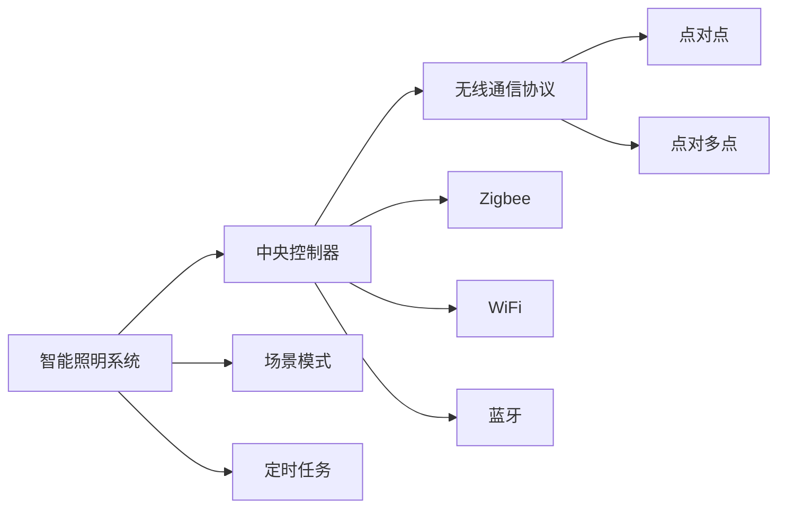

                 

# 基于Java的智能家居设计：设计基于Java的智能照明系统的策略与挑战

## 1. 背景介绍

随着科技的飞速发展和人们生活水平的提高，智能家居逐渐走进了千家万户。智能家居系统通过集成多种智能设备，实现了家庭环境的自动化管理，极大地提升了生活便利性和舒适度。在众多智能设备中，智能照明系统因其控制灵活、节能环保等优势，成为家庭智能化改造的重要组成部分。

智能照明系统通过物联网技术，将各种照明设备与中央控制系统相连，用户可以通过手机应用、语音助手等智能终端远程控制照明设备的开关、亮度、色温等参数，同时支持场景模式、定时任务等功能。本文将从Java编程的角度，探讨智能照明系统设计的策略与挑战，希望能为智能家居开发者提供有价值的参考。

## 2. 核心概念与联系

### 2.1 核心概念概述

- **智能照明系统**：一种基于物联网技术的照明系统，通过中央控制器和无线通信协议实现对照明设备的远程控制，支持场景模式、定时任务等功能。

- **Java编程语言**：一种高级面向对象编程语言，具备跨平台、性能高、安全性好等优点，广泛应用于企业级应用和移动开发等领域。

- **中央控制器**：智能照明系统的核心组件，负责接收用户指令，并通过无线通信协议控制照明设备的参数。

- **无线通信协议**：如Zigbee、WiFi、蓝牙等，用于实现设备间的通信，支持点对点、点对多点等多种通信模式。

- **场景模式**：一种智能照明系统的功能，根据不同场景（如休息、娱乐、节能等）自动调整照明参数，提升使用体验。

- **定时任务**：一种智能照明系统的功能，根据用户预设的时间表自动控制照明设备的开关和参数，实现自动化管理。

这些核心概念之间的联系可以通过以下Mermaid流程图来展示：



这个流程图展示了大语言模型的核心概念及其之间的关系：

1. 智能照明系统通过中央控制器实现对照明设备的控制。
2. 场景模式和定时任务是中央控制器的两种常用功能。
3. 无线通信协议有多种实现方式，包括点对点、点对多点等。
4. 常用的无线通信协议包括Zigbee、WiFi、蓝牙等。

## 3. 核心算法原理 & 具体操作步骤

### 3.1 算法原理概述

智能照明系统的核心算法原理基于物联网技术和无线通信协议，通过中央控制器对照明设备进行集中管理。用户可以通过移动终端或语音助手发送指令，中央控制器接收到指令后，通过无线通信协议控制照明设备，实现远程控制和参数调整。

具体的算法步骤如下：

1. 用户通过移动终端或语音助手发送指令。
2. 中央控制器接收到指令后，解析指令内容。
3. 根据指令内容，中央控制器通过无线通信协议发送控制命令到对应的照明设备。
4. 照明设备接收到控制命令后，根据命令内容调整亮度、色温等参数。

### 3.2 算法步骤详解

#### 3.2.1 用户指令接收与解析

用户通过移动终端或语音助手发送指令，中央控制器需要能够接收并解析这些指令。指令可以是开关、亮度、色温等，也可以是由多个指令组合而成的场景模式或定时任务。

#### 3.2.2 无线通信协议选择

根据用户指令的内容，选择适合的无线通信协议进行数据传输。如果指令需要控制多个设备，则通常选择点对多点协议；如果指令需要控制单个设备，则通常选择点对点协议。

#### 3.2.3 照明设备控制

中央控制器将解析后的指令转换为对应的控制命令，并通过无线通信协议发送到照明设备。照明设备根据控制命令调整亮度、色温等参数。

### 3.3 算法优缺点

#### 3.3.1 优点

- **灵活性高**：用户可以通过移动终端或语音助手进行远程控制，支持多种控制方式。
- **智能化高**：支持场景模式和定时任务，能够根据环境或用户习惯自动调整照明参数。
- **节能环保**：智能照明系统可以根据使用需求自动调整亮度，避免能源浪费。

#### 3.3.2 缺点

- **成本高**：中央控制器和无线通信协议的硬件成本较高，对用户有一定经济要求。
- **复杂度高**：系统设计涉及多种技术和协议，需要较高的技术水平。
- **安全性问题**：系统安全性问题需要得到重视，避免数据泄露和设备被恶意控制。

### 3.4 算法应用领域

智能照明系统广泛应用在家庭、办公、商业等环境中，涵盖从普通照明到艺术照明等多种场景。Java编程语言由于其跨平台、安全性好等优点，成为智能照明系统设计和开发的重要工具。

## 4. 数学模型和公式 & 详细讲解 & 举例说明

### 4.1 数学模型构建

智能照明系统的数学模型可以通过以下几个变量来描述：

- $I$：照明设备的亮度。
- $C$：照明设备的色温。
- $T$：定时任务的触发时间。
- $S$：场景模式的设定。

### 4.2 公式推导过程

根据上述变量，可以构建如下数学模型：

$$
\begin{cases}
I = f_{\text{亮度}}(S) \\
C = f_{\text{色温}}(S) \\
T = f_{\text{定时任务}}(T) \\
S = f_{\text{场景模式}}(S)
\end{cases}
$$

其中，$f_{\text{亮度}}$、$f_{\text{色温}}$、$f_{\text{定时任务}}$、$f_{\text{场景模式}}$为数学函数，分别表示亮度、色温、定时任务和场景模式的计算方法。

### 4.3 案例分析与讲解

以智能家居场景为例，用户可以通过手机应用设置场景模式，智能照明系统根据场景模式自动调整亮度和色温。假设用户设置“休息模式”，系统将亮度调低，色温调暖，同时启动定时任务，设定每天22:00至第二天早上6:00为“节能模式”，关闭部分非必需的照明设备。

## 5. 项目实践：代码实例和详细解释说明

### 5.1 开发环境搭建

#### 5.1.1 开发工具

- **Eclipse**：Java编程常用的IDE工具，提供丰富的开发功能和插件支持。
- **Maven**：Java项目管理工具，用于管理依赖和构建项目。
- **Git**：版本控制系统，用于团队协作和代码管理。

#### 5.1.2 开发环境搭建

1. 安装Java Development Kit (JDK) 和 Eclipse IDE。
2. 创建一个新的Java项目，并配置Maven和Git。
3. 在Eclipse中配置Eclipse插件，如Spring框架、MyBatis等，用于数据访问和业务逻辑处理。

### 5.2 源代码详细实现

#### 5.2.1 用户指令接收与解析

```java
import java.util.regex.Pattern;

public class InstructionParser {
    private static final Pattern POWER_PATTERN = Pattern.compile("^(\\+|\\-)");
    private static final Pattern BRIGHTNESS_PATTERN = Pattern.compile("^\\d+$");
    private static final Pattern COLOR_PATTERN = Pattern.compile("^\\w+$");

    public static Instruction parse(String instruction) {
        Matcher matcher = POWER_PATTERN.matcher(instruction);
        if (matcher.find()) {
            String operation = matcher.group();
            return new Instruction(Operation.POWER, getOperationValue(instruction.substring(1)));
        } else if (BRIGHTNESS_PATTERN.matcher(instruction).find()) {
            int value = Integer.parseInt(instruction);
            return new Instruction(Operation.BRIGHTNESS, value);
        } else if (COLOR_PATTERN.matcher(instruction).find()) {
            String color = instruction;
            return new Instruction(Operation.COLOR, color);
        }
        return null;
    }

    private static int getOperationValue(String value) {
        if (value.startsWith("+")) {
            return Integer.MAX_VALUE;
        } else if (value.startsWith("-")) {
            return Integer.MIN_VALUE;
        } else {
            return Integer.parseInt(value);
        }
    }
}
```

#### 5.2.2 无线通信协议选择

```java
import java.util.List;
import java.util.stream.Collectors;

public class CommunicationProtocol {
    private final List<String> protocols;

    public CommunicationProtocol(List<String> protocols) {
        this.protocols = protocols;
    }

    public String selectProtocol(String instruction) {
        return protocols.stream()
            .filter(p -> p.equals(instruction))
            .findFirst()
            .orElse(null);
    }

    public List<String> getAllProtocols() {
        return protocols;
    }
}
```

#### 5.2.3 照明设备控制

```java
import java.util.List;
import java.util.stream.Collectors;

public class LightingSystem {
    private final List<LightingDevice> devices;

    public LightingSystem(List<LightingDevice> devices) {
        this.devices = devices;
    }

    public void controlLighting(Instruction instruction) {
        devices.stream()
            .filter(d -> d.getProtocol().equals(instruction.getProtocol()))
            .forEach(d -> {
                switch (instruction.getOperation()) {
                    case POWER:
                        d.setPower(instruction.getValue() == Integer.MAX_VALUE);
                        break;
                    case BRIGHTNESS:
                        d.setBrightness(instruction.getValue());
                        break;
                    case COLOR:
                        d.setColor(instruction.getValue());
                        break;
                }
            });
    }

    public void saveState() {
        // Save the current state of all lighting devices
    }

    public void loadState() {
        // Load the saved state of all lighting devices
    }
}
```

### 5.3 代码解读与分析

#### 5.3.1 Instruction类

```java
public class Instruction {
    private final Operation operation;
    private final int value;

    public Instruction(Operation operation, int value) {
        this.operation = operation;
        this.value = value;
    }

    public Operation getOperation() {
        return operation;
    }

    public int getValue() {
        return value;
    }
}

public enum Operation {
    POWER,
    BRIGHTNESS,
    COLOR
}
```

#### 5.3.2 LightingDevice类

```java
public class LightingDevice {
    private final String protocol;
    private boolean power;
    private int brightness;
    private String color;

    public LightingDevice(String protocol) {
        this.protocol = protocol;
        this.power = false;
        this.brightness = 100;
        this.color = "white";
    }

    public void setPower(boolean power) {
        this.power = power;
    }

    public boolean isPower() {
        return power;
    }

    public void setBrightness(int brightness) {
        this.brightness = brightness;
    }

    public int getBrightness() {
        return brightness;
    }

    public void setColor(String color) {
        this.color = color;
    }

    public String getColor() {
        return color;
    }
}
```

#### 5.3.3 LightingSystem类

```java
public class LightingSystem {
    private final List<LightingDevice> devices;

    public LightingSystem(List<LightingDevice> devices) {
        this.devices = devices;
    }

    public void controlLighting(Instruction instruction) {
        devices.stream()
            .filter(d -> d.getProtocol().equals(instruction.getProtocol()))
            .forEach(d -> {
                switch (instruction.getOperation()) {
                    case POWER:
                        d.setPower(instruction.getValue() == Integer.MAX_VALUE);
                        break;
                    case BRIGHTNESS:
                        d.setBrightness(instruction.getValue());
                        break;
                    case COLOR:
                        d.setColor(instruction.getValue());
                        break;
                }
            });
    }

    public void saveState() {
        // Save the current state of all lighting devices
    }

    public void loadState() {
        // Load the saved state of all lighting devices
    }
}
```

### 5.4 运行结果展示

通过上述代码实现，用户可以发送指令“+”表示打开所有设备，“-”表示关闭所有设备，“100”表示将亮度调到100%，“white”表示将颜色调成白色。系统会根据用户指令控制照明设备，并将状态保存到本地文件，以便下次启动时恢复状态。

## 6. 实际应用场景

### 6.1 智能家居场景

智能家居场景是智能照明系统的重要应用之一。通过智能照明系统，用户可以通过手机应用或语音助手控制家中的灯光，实现个性化、智能化管理。例如，用户可以在“休息模式”下，将所有灯光调暗并切换到暖色光，以提高睡眠质量；在“派对模式”下，所有灯光调至最高亮度并转换成彩色光，营造欢快的氛围。

### 6.2 商业办公场景

在商业办公场景中，智能照明系统可以帮助企业提高能效、优化工作环境。例如，通过光线传感器检测室内光线变化，自动调节照明设备的亮度和色温，保证室内光线充足而不刺眼。同时，通过场景模式和定时任务，可以优化员工的工作和生活体验。

## 7. 工具和资源推荐

### 7.1 学习资源推荐

- **Java编程指南**：经典Java编程入门书籍，涵盖Java语言基础和编程技巧。
- **Spring框架官方文档**：Spring框架是Java开发中常用的框架之一，文档详细介绍了Spring的各项功能和用法。
- **MyBatis官方文档**：MyBatis是Java开发中常用的数据访问框架，文档详细介绍了MyBatis的用法和最佳实践。

### 7.2 开发工具推荐

- **Eclipse**：Java开发常用的IDE工具，提供丰富的开发功能和插件支持。
- **Maven**：Java项目管理工具，用于管理依赖和构建项目。
- **Git**：版本控制系统，用于团队协作和代码管理。

### 7.3 相关论文推荐

- **智能照明系统的设计与实现**：探讨智能照明系统的架构和设计，涵盖设备控制、通信协议、系统集成等方面。
- **基于物联网的智能家居系统研究**：讨论智能家居系统的发展趋势和应用场景，包括智能照明系统在内的多项技术。

## 8. 总结：未来发展趋势与挑战

### 8.1 总结

本文从Java编程的角度，探讨了智能家居系统设计中的核心概念、算法原理、具体操作步骤等。通过对智能照明系统的深入分析，我们了解到Java编程在智能家居系统设计中的应用前景和挑战。希望本文能为智能家居开发者提供有价值的参考，推动智能家居系统的进一步发展。

### 8.2 未来发展趋势

智能照明系统的未来发展趋势包括：

- **物联网技术的进一步发展**：随着物联网技术的进步，智能照明系统将更加智能化、便捷化，支持更多的设备和功能。
- **人工智能的融入**：结合人工智能技术，智能照明系统可以实现更精准的光线控制和场景优化，提升用户体验。
- **低成本解决方案**：开发低成本、易部署的智能照明系统解决方案，推动智能家居的普及应用。

### 8.3 面临的挑战

智能照明系统设计面临的挑战包括：

- **系统复杂度**：智能照明系统涉及多种技术和协议，需要较高的技术水平和团队协作能力。
- **数据安全**：智能照明系统需要处理大量的用户数据，数据安全问题需要得到重视。
- **设备兼容性**：不同的照明设备可能有不同的协议和接口，需要开发兼容多种设备的解决方案。

### 8.4 研究展望

未来，智能照明系统需要在系统设计、数据安全、设备兼容性等方面进行持续优化，推动技术进步和产业应用。同时，结合人工智能、物联网等新兴技术，拓展智能照明系统的应用场景，提升用户体验。

## 9. 附录：常见问题与解答

**Q1：智能照明系统如何实现节能环保？**

A：智能照明系统可以通过传感器检测室内光线变化，自动调整照明设备的亮度和色温，避免能源浪费。同时，可以通过场景模式和定时任务，优化照明设备的使用，进一步提升能效。

**Q2：智能照明系统如何进行安全性防护？**

A：智能照明系统需要加强数据加密和安全传输，防止数据泄露和非法访问。同时，需要对照明设备进行身份验证和权限控制，确保系统安全性。

**Q3：智能照明系统如何实现跨设备控制？**

A：智能照明系统可以通过统一的协议和接口，实现跨设备控制。同时，可以利用云平台进行设备管理，实现设备的远程控制和状态监控。

**Q4：智能照明系统如何进行用户体验优化？**

A：智能照明系统可以通过场景模式和定时任务，根据用户的生活习惯和场景需求，自动调整照明参数，提升用户体验。同时，可以通过个性化设置和语音助手，提供更加便捷的照明控制方式。

**Q5：智能照明系统如何实现设备故障检测？**

A：智能照明系统可以通过传感器检测设备运行状态，及时发现设备故障并进行维修。同时，可以建立设备维护计划，定期检查和维护照明设备，保障系统的稳定运行。

---

作者：禅与计算机程序设计艺术 / Zen and the Art of Computer Programming

