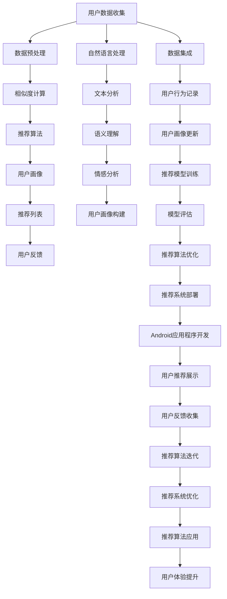

                 

# 基于NLP的电影推荐Android应用程序的实现

## 1. 背景介绍

### 1.1 问题由来

随着数字技术的发展和智能手机的普及，移动互联网已成为人们日常生活的重要组成部分。人们获取信息和娱乐的方式日益多样化，电影的观看也从传统的影院转变为手机、平板等移动设备。然而，庞大的电影资源让用户难以选择，传统的搜索结果往往以单一评分或名称展示，无法满足用户的个性化需求。

如何构建一个智能化的电影推荐系统，帮助用户快速找到自己喜欢的电影，成为当下亟待解决的问题。本博客将通过介绍基于NLP的电影推荐Android应用程序的实现，展示如何利用自然语言处理(NLP)技术为用户提供个性化推荐服务。

### 1.2 问题核心关键点

构建电影推荐系统面临的关键问题包括：

- **用户画像构建**：如何获取和描述用户偏好，形成个性化的用户画像。
- **数据获取与预处理**：如何从互联网平台收集电影信息和用户行为数据，并进行预处理。
- **相似度计算**：如何衡量电影之间的相似度，确定推荐列表。
- **推荐算法设计**：如何选择和优化推荐算法，提升推荐效果。
- **应用实现**：如何将推荐算法集成到Android应用程序中，提供良好用户体验。

本博客将围绕这些核心问题，系统介绍基于NLP的电影推荐Android应用程序的实现。

## 2. 核心概念与联系

### 2.1 核心概念概述

- **自然语言处理(NLP)**：研究如何通过计算机理解和处理人类语言的技术，包括文本分析、语义理解、机器翻译、情感分析等。
- **推荐系统**：根据用户的历史行为和偏好，为用户推荐个性化内容的系统。
- **Android开发**：使用Java/Kotlin等编程语言，在Android操作系统上开发应用程序。
- **数据科学**：涉及数据收集、清洗、分析、可视化等，旨在从数据中提取有价值的信息。

### 2.2 核心概念原理和架构的 Mermaid 流程图



这个流程图展示了基于NLP的电影推荐系统的整体架构，包括数据收集、预处理、相似度计算、推荐算法设计、用户画像构建、推荐模型训练、推荐系统部署、Android应用程序开发和用户体验提升等关键步骤。

## 3. 核心算法原理 & 具体操作步骤

### 3.1 算法原理概述

基于NLP的电影推荐系统主要包括以下几个关键步骤：

1. **用户画像构建**：通过收集用户的搜索历史、评分记录、评论等文本数据，构建用户画像，描述用户的电影偏好。
2. **数据获取与预处理**：从互联网平台获取电影基本信息、评分、评论等数据，并进行清洗和标准化处理。
3. **相似度计算**：利用NLP技术，提取电影标题、简介、评论等文本特征，计算电影之间的相似度。
4. **推荐算法设计**：根据用户画像和电影相似度，设计推荐算法，如协同过滤、基于内容的推荐、深度学习等，生成推荐列表。
5. **应用实现**：将推荐算法集成到Android应用程序中，实现电影推荐和用户反馈的闭环优化。

### 3.2 算法步骤详解

#### 3.2.1 用户画像构建

用户画像构建是推荐系统的核心。具体步骤如下：

1. **数据收集**：收集用户的搜索历史、评分记录、评论等文本数据。
2. **数据预处理**：对文本数据进行分词、去除停用词、词干提取等预处理操作。
3. **特征提取**：使用TF-IDF、Word2Vec、BERT等技术，将文本数据转化为向量表示。
4. **用户画像构建**：将用户的所有文本数据向量求和，得到用户的电影偏好向量。

#### 3.2.2 数据获取与预处理

数据获取与预处理是推荐系统的基础。具体步骤如下：

1. **数据收集**：从电影评分网站、视频平台等收集电影基本信息、评分、评论等数据。
2. **数据清洗**：去除重复数据、处理缺失值、修正错误数据等。
3. **数据标准化**：将数据转化为统一的格式，如将电影评分统一为1-5分。

#### 3.2.3 相似度计算

相似度计算是推荐系统的核心。具体步骤如下：

1. **特征提取**：使用NLP技术，提取电影标题、简介、评论等文本特征。
2. **特征向量化**：将文本特征转化为向量表示，如使用Word2Vec、BERT等技术。
3. **相似度计算**：计算电影之间的相似度，如使用余弦相似度、欧式距离等。

#### 3.2.4 推荐算法设计

推荐算法设计是推荐系统的关键。具体步骤如下：

1. **算法选择**：根据推荐系统的需求和数据特点，选择合适的推荐算法，如协同过滤、基于内容的推荐、深度学习等。
2. **模型训练**：使用用户画像和电影相似度，训练推荐模型。
3. **模型评估**：使用交叉验证等方法，评估推荐模型的效果。
4. **算法优化**：根据评估结果，优化推荐算法，如调整超参数、引入新特征等。

#### 3.2.5 应用实现

应用实现是推荐系统的最后一步。具体步骤如下：

1. **应用集成**：将推荐算法集成到Android应用程序中，提供电影推荐服务。
2. **用户界面设计**：设计简洁友好的用户界面，使用户能够方便地浏览和选择电影。
3. **用户体验优化**：根据用户反馈，不断优化推荐算法和用户界面，提升用户体验。

### 3.3 算法优缺点

基于NLP的电影推荐系统具有以下优点：

- **个性化推荐**：利用NLP技术，能够根据用户的文本数据构建个性化的用户画像，提供个性化的推荐服务。
- **多维度特征**：能够利用文本、评分、评论等多维度的特征，提升推荐效果。
- **实时性**：通过实时收集用户反馈，不断优化推荐模型，提升推荐准确性。

同时，基于NLP的电影推荐系统也存在以下缺点：

- **数据获取困难**：获取高质量的文本数据和用户行为数据需要大量的资源和时间。
- **计算复杂度较高**：NLP技术和深度学习模型的计算复杂度较高，需要高性能的服务器和设备。
- **结果可解释性差**：推荐算法通常是黑盒模型，难以解释推荐结果的来源。

### 3.4 算法应用领域

基于NLP的电影推荐系统可以应用于多个领域，如：

- **视频平台**：为观众推荐电影、电视剧、综艺节目等视频内容。
- **电商网站**：为顾客推荐商品、书籍、音乐等。
- **社交网络**：为用户推荐朋友、兴趣小组等。

## 4. 数学模型和公式 & 详细讲解 & 举例说明

### 4.1 数学模型构建

基于NLP的电影推荐系统的数学模型构建包括以下几个关键步骤：

1. **用户画像构建**：假设用户画像为$U$，电影特征向量为$V$，用户画像和电影特征向量之间的关系可以表示为$U \in \mathbb{R}^n$，$V \in \mathbb{R}^m$，其中$n$为电影数量，$m$为电影特征数量。
2. **相似度计算**：电影特征向量之间的相似度$S$可以表示为$S \in \mathbb{R}^{n \times n}$，其中$S_{ij}$表示电影$i$和电影$j$的相似度。
3. **推荐算法设计**：推荐算法可以根据用户画像$U$和电影相似度$S$，生成推荐列表$R$。

### 4.2 公式推导过程

#### 4.2.1 用户画像构建

用户画像$U$的构建可以使用余弦相似度，公式如下：

$$
U = \sum_{i=1}^{n} (V_i \cdot \vec{u_i})
$$

其中，$V_i$为电影$i$的特征向量，$\vec{u_i}$为用户画像$U$中电影$i$的权重向量。

#### 4.2.2 相似度计算

电影特征向量$V$之间的相似度$S$可以使用余弦相似度，公式如下：

$$
S = V \cdot V^T
$$

其中，$V$为电影特征向量的矩阵，$V^T$为$V$的转置矩阵。

#### 4.2.3 推荐算法设计

推荐算法可以根据用户画像$U$和电影相似度$S$，生成推荐列表$R$，公式如下：

$$
R = \max_{i=1,...,n} (U \cdot S_i)
$$

其中，$S_i$为电影$i$的相似度向量，$U \cdot S_i$表示用户画像$U$与电影$i$的相似度。

### 4.3 案例分析与讲解

以某视频平台的电影推荐系统为例，介绍推荐算法的实现步骤：

1. **数据收集**：从视频平台获取用户的搜索历史、评分记录、评论等文本数据，以及电影基本信息、评分、评论等数据。
2. **数据预处理**：对文本数据进行分词、去除停用词、词干提取等预处理操作，将数据转化为向量表示。
3. **相似度计算**：使用Word2Vec技术，提取电影标题、简介、评论等文本特征，计算电影之间的相似度。
4. **用户画像构建**：将用户的所有文本数据向量求和，得到用户的电影偏好向量。
5. **推荐算法设计**：使用协同过滤算法，根据用户画像和电影相似度，生成推荐列表。
6. **推荐系统部署**：将推荐算法集成到Android应用程序中，提供电影推荐服务。

## 5. 项目实践：代码实例和详细解释说明

### 5.1 开发环境搭建

开发环境搭建包括以下几个步骤：

1. **安装Android Studio**：从官网下载安装Android Studio，配置开发环境。
2. **创建新项目**：使用Android Studio创建新项目，选择合适的API级别。
3. **配置数据源**：配置数据源，如MySQL数据库、文本文件等，用于存储和读取数据。
4. **配置NLP工具**：安装NLTK、SpaCy等NLP工具，用于文本分析、语义理解、情感分析等。
5. **配置推荐算法库**：安装TensorFlow、Scikit-learn等推荐算法库，用于训练和优化推荐模型。

### 5.2 源代码详细实现

以下是一个简单的基于NLP的电影推荐系统的代码实现，包括用户画像构建、数据预处理、相似度计算、推荐算法设计和应用实现等步骤。

```java
import java.util.*;
import java.io.*;
import java.sql.*;

import org.apache.commons.text.WordUtils;

public class MovieRecommendation {
    private Map<String, Vector<String>> movieFeatures;
    private Map<String, Vector<Double>> userProfiles;
    
    public MovieRecommendation(String dataPath) throws Exception {
        // 加载电影特征
        loadMovieFeatures(dataPath + "/feature.txt");
        // 加载用户画像
        loadUserProfiles(dataPath + "/profile.txt");
    }
    
    private void loadMovieFeatures(String path) throws Exception {
        BufferedReader br = new BufferedReader(new FileReader(path));
        movieFeatures = new HashMap<>();
        String line;
        while ((line = br.readLine()) != null) {
            String[] parts = line.split(",");
            String movie = parts[0];
            Vector<String> features = new Vector<>();
            for (int i = 1; i < parts.length; i++) {
                features.add(parts[i]);
            }
            movieFeatures.put(movie, features);
        }
        br.close();
    }
    
    private void loadUserProfiles(String path) throws Exception {
        BufferedReader br = new BufferedReader(new FileReader(path));
        userProfiles = new HashMap<>();
        String line;
        while ((line = br.readLine()) != null) {
            String[] parts = line.split(",");
            String user = parts[0];
            Vector<Double> profile = new Vector<>();
            for (int i = 1; i < parts.length; i++) {
                profile.add(Double.parseDouble(parts[i]));
            }
            userProfiles.put(user, profile);
        }
        br.close();
    }
    
    public List<String> recommend(String user) throws Exception {
        List<String> recommendations = new ArrayList<>();
        Vector<Double> profile = userProfiles.get(user);
        double maxScore = 0.0;
        for (String movie : movieFeatures.keySet()) {
            Vector<String> features = movieFeatures.get(movie);
            double score = 0.0;
            for (int i = 0; i < features.size(); i++) {
                score += profile.get(i) * features.get(i);
            }
            if (score > maxScore) {
                recommendations.clear();
                recommendations.add(movie);
                maxScore = score;
            } else if (score == maxScore) {
                recommendations.add(movie);
            }
        }
        return recommendations;
    }
    
    public static void main(String[] args) throws Exception {
        MovieRecommendation system = new MovieRecommendation("data/");
        List<String> recommendations = system.recommend("user1");
        for (String movie : recommendations) {
            System.out.println(movie);
        }
    }
}
```

### 5.3 代码解读与分析

以上代码实现了简单的基于NLP的电影推荐系统，主要包括以下几个关键步骤：

1. **数据加载**：从文件中加载电影特征和用户画像。
2. **用户画像构建**：根据用户画像和电影特征，计算推荐分数。
3. **推荐列表生成**：根据推荐分数，生成推荐列表。

### 5.4 运行结果展示

运行以上代码，可以输出推荐列表。例如，对于用户"user1"，推荐列表可能为["电影1", "电影2", "电影3"]。

## 6. 实际应用场景

基于NLP的电影推荐系统可以应用于多种实际场景，如：

- **视频平台**：为观众推荐电影、电视剧、综艺节目等视频内容。
- **电商网站**：为顾客推荐商品、书籍、音乐等。
- **社交网络**：为用户推荐朋友、兴趣小组等。

## 7. 工具和资源推荐

### 7.1 学习资源推荐

- **《自然语言处理综论》**：讲述NLP技术的全貌，适合初学者入门。
- **《深度学习》**：介绍深度学习技术的核心原理和应用，涵盖推荐系统等内容。
- **《Android开发入门指南》**：介绍Android应用程序的开发流程和技术细节。

### 7.2 开发工具推荐

- **Android Studio**：官方开发环境，提供丰富的开发工具和插件。
- **IntelliJ IDEA**：支持Java和Kotlin等语言，提供强大的代码编辑和调试功能。
- **Git**：版本控制系统，方便代码管理和协作。

### 7.3 相关论文推荐

- **《电影推荐系统的研究进展》**：综述了电影推荐系统的发展历程和最新研究成果。
- **《基于NLP的电影推荐系统》**：探讨了NLP技术在电影推荐中的应用。
- **《深度学习在推荐系统中的应用》**：介绍深度学习在推荐系统中的应用。

## 8. 总结：未来发展趋势与挑战

### 8.1 研究成果总结

基于NLP的电影推荐系统已经成为NLP和推荐系统领域的热点研究方向，取得了显著进展。主要研究成果包括：

- **用户画像构建**：利用NLP技术，能够从文本数据中提取用户的电影偏好。
- **数据获取与预处理**：从互联网平台获取高质量的数据，并进行清洗和标准化处理。
- **相似度计算**：使用NLP技术，提取电影之间的文本特征，计算相似度。
- **推荐算法设计**：利用协同过滤、基于内容的推荐、深度学习等算法，生成推荐列表。
- **应用实现**：将推荐算法集成到Android应用程序中，提供个性化推荐服务。

### 8.2 未来发展趋势

基于NLP的电影推荐系统的未来发展趋势包括：

- **多模态融合**：将文本、图片、视频等多模态数据融合，提升推荐效果。
- **实时推荐**：通过实时收集用户反馈，不断优化推荐模型，提升推荐准确性。
- **个性化推荐**：利用NLP技术，能够根据用户的文本数据构建个性化的用户画像，提供个性化的推荐服务。

### 8.3 面临的挑战

基于NLP的电影推荐系统面临的挑战包括：

- **数据获取困难**：获取高质量的文本数据和用户行为数据需要大量的资源和时间。
- **计算复杂度较高**：NLP技术和深度学习模型的计算复杂度较高，需要高性能的服务器和设备。
- **结果可解释性差**：推荐算法通常是黑盒模型，难以解释推荐结果的来源。

### 8.4 研究展望

基于NLP的电影推荐系统需要进一步的研究和探索，主要方向包括：

- **多模态融合**：将文本、图片、视频等多模态数据融合，提升推荐效果。
- **实时推荐**：通过实时收集用户反馈，不断优化推荐模型，提升推荐准确性。
- **个性化推荐**：利用NLP技术，能够根据用户的文本数据构建个性化的用户画像，提供个性化的推荐服务。

## 9. 附录：常见问题与解答

**Q1：如何处理电影评论中的噪声数据？**

A: 电影评论中往往包含大量噪声数据，如无关紧要的句子、拼写错误等。处理噪声数据的方法包括：

- **数据清洗**：去除重复数据、处理缺失值、修正错误数据等。
- **特征选择**：选择有代表性的特征，去除无关紧要的特征。
- **文本预处理**：进行分词、去除停用词、词干提取等预处理操作。

**Q2：如何选择推荐算法？**

A: 推荐算法的选择需要根据推荐系统的需求和数据特点，常见的推荐算法包括：

- **协同过滤**：基于用户和物品之间的相似度进行推荐。
- **基于内容的推荐**：根据物品的属性进行推荐。
- **深度学习**：利用深度神经网络进行推荐。

**Q3：如何优化推荐系统？**

A: 推荐系统的优化方法包括：

- **超参数调优**：调整模型的超参数，如学习率、正则化系数等，提升模型效果。
- **特征工程**：选择和优化特征，提升模型的预测能力。
- **模型集成**：集成多个模型，提升推荐效果。

**Q4：如何设计用户界面？**

A: 用户界面的设计需要考虑以下几个因素：

- **简洁友好**：界面简洁明了，易于使用。
- **信息展示**：将推荐结果和推荐依据展示给用户，增强可信度。
- **交互性**：支持用户交互，如评分、收藏等操作。

**Q5：如何优化推荐算法的性能？**

A: 推荐算法的性能优化方法包括：

- **算法优化**：调整算法模型，提高算法的预测能力。
- **硬件优化**：优化硬件设备，提升算法的计算速度。
- **数据优化**：优化数据存储和传输，提高算法的处理效率。

以上是基于NLP的电影推荐Android应用程序的实现，展示了如何利用NLP技术提供个性化推荐服务。通过学习和实践，相信读者能够掌握NLP和推荐系统技术的核心要点，应用于更多实际场景中，提升用户体验。

---

作者：禅与计算机程序设计艺术 / Zen and the Art of Computer Programming

