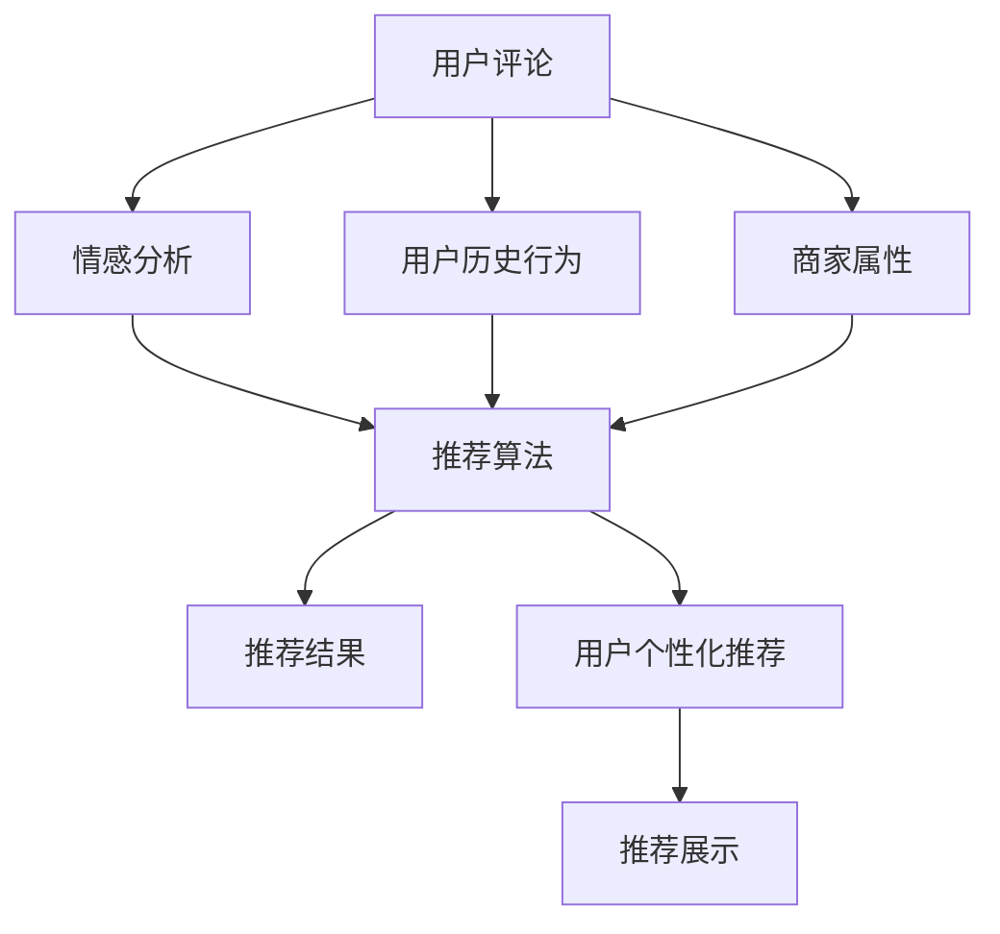

                 

# 基于情感分析技术的餐饮推荐系统的设计与实现

## 1. 背景介绍

随着互联网的普及和信息技术的快速发展，基于用户行为数据驱动的推荐系统已经深入到各行各业，如电商、社交网络、视频等。餐饮行业也不例外，如何为用户推荐满意的餐饮商家成为关键问题。传统的推荐系统多基于用户历史行为数据和商家属性进行推荐，但这种基于协同过滤的方式无法充分利用用户对餐饮的情感评价，忽略了用户对餐饮的质量和口味的直接反馈。因此，基于情感分析技术的餐饮推荐系统应运而生，它可以更好地挖掘用户对餐饮的直接情感评价，提高推荐的精准度和满意度。

## 2. 核心概念与联系

### 2.1 核心概念概述

餐饮推荐系统的设计与实现涉及多个核心概念，其中最为关键的是情感分析和推荐算法。

- 情感分析：通过对用户对餐饮的评论和反馈进行分析，提取出情感倾向，并将其作为推荐的重要依据。
- 推荐算法：根据情感分析结果，结合用户历史行为数据和商家属性，计算出推荐列表，实现个性化推荐。

### 2.2 核心概念原理和架构的 Mermaid 流程图



## 3. 核心算法原理 & 具体操作步骤

### 3.1 算法原理概述

基于情感分析的餐饮推荐系统主要分为情感分析和推荐算法两个部分。情感分析主要通过自然语言处理(NLP)技术，对用户的评论和反馈进行分析，提取出情感倾向。推荐算法则根据情感分析结果，结合用户历史行为数据和商家属性，计算出推荐列表，实现个性化推荐。

具体而言，情感分析通常包括以下步骤：

1. 数据收集：收集用户对餐饮的评论和反馈，如Yelp、大众点评等平台的用户评论。
2. 文本预处理：对评论进行文本清洗、分词、去除停用词等处理。
3. 情感分析：使用情感词典、LSTM、BERT等NLP模型，分析评论的情感倾向。
4. 情感评分：将情感分析结果映射为数值评分，用于推荐计算。

推荐算法则包括：

1. 用户历史行为分析：根据用户历史订单数据，提取出用户的饮食偏好和消费习惯。
2. 商家属性分析：根据商家的属性信息，如位置、菜系、价格等，计算出商家与用户的匹配度。
3. 推荐列表计算：根据情感评分、用户历史行为和商家属性，使用协同过滤、内容推荐等算法，计算出推荐列表。

### 3.2 算法步骤详解

#### 情感分析流程

1. 数据收集
   收集用户对餐饮的评论和反馈，可以使用爬虫技术从Yelp、大众点评等平台获取数据。
   ```python
   import requests
   import json
   
   def collect_data(url):
       response = requests.get(url)
       data = json.loads(response.text)
       return data
   ```

2. 文本预处理
   对评论进行文本清洗、分词、去除停用词等处理，可以使用NLTK、spaCy等库。
   ```python
   from nltk.corpus import stopwords
   from nltk.tokenize import word_tokenize
   
   def preprocess_text(text):
       text = text.lower()
       text = re.sub(r'\b\w{1,2}\b', '', text)
       text = word_tokenize(text)
       text = [word for word in text if word not in stopwords.words('english')]
       return text
   ```

3. 情感分析
   使用情感词典或NLP模型，分析评论的情感倾向。例如，可以使用VADER模型。
   ```python
   from nltk.sentiment import SentimentIntensityAnalyzer
   
   def sentiment_analysis(text):
       analyzer = SentimentIntensityAnalyzer()
       scores = analyzer.polarity_scores(text)
       return scores['compound']
   ```

4. 情感评分
   将情感分析结果映射为数值评分，可以使用线性映射或KNN等算法。
   ```python
   def sentiment_score(text, positive_val, negative_val):
       sentiment = sentiment_analysis(text)
       if sentiment > 0:
           score = positive_val
       elif sentiment < 0:
           score = negative_val
       else:
           score = 0
       return score
   ```

#### 推荐算法流程

1. 用户历史行为分析
   根据用户历史订单数据，提取出用户的饮食偏好和消费习惯，可以使用协同过滤算法。
   ```python
   from surprise import Dataset, Reader, SVD
   from surprise.model_selection import train_test_split
   
   def user_behavior_analysis(data):
       reader = Reader(rating_scale=(0, 5))
       data = Dataset.load_from_df(df, reader)
       trainset, testset = train_test_split(data, test_size=0.2)
       algo = SVD()
       algo.fit(trainset)
       return algo
   ```

2. 商家属性分析
   根据商家的属性信息，如位置、菜系、价格等，计算出商家与用户的匹配度，可以使用TF-IDF、cosine相似度等算法。
   ```python
   from sklearn.feature_extraction.text import TfidfVectorizer
   from sklearn.metrics.pairwise import cosine_similarity
   
   def merchant_property_analysis(merchant_data):
       properties = [merchant_data['location'], merchant_data['cuisine'], merchant_data['price']]
       vectorizer = TfidfVectorizer()
       vectorized_properties = vectorizer.fit_transform(properties)
       similarity = cosine_similarity(vectorized_properties)
       return similarity
   ```

3. 推荐列表计算
   根据情感评分、用户历史行为和商家属性，使用协同过滤、内容推荐等算法，计算出推荐列表。
   ```python
   def recommendation_list(user, merchant_data):
       user_behavior = user_behavior_analysis(user)
       merchant_properties = merchant_property_analysis(merchant_data)
       scores = user_behavior predicted_merchant_data
       merged_data = pd.merge(user_behavior_data, merchant_data, on='id')
       merged_data['score'] = merged_data['rating'] + merged_data['properties'] * 0.1
       recommended_merchants = merged_data.sort_values(by=['score'], ascending=False).head(5)
       return recommended_merchants
   ```

### 3.3 算法优缺点

基于情感分析的餐饮推荐系统的优点包括：

1. 情感评价直接：情感分析可以直接利用用户对餐饮的直接反馈，提升推荐精度。
2. 提升用户体验：情感评价能够从用户的真实感受出发，提供个性化的餐饮推荐，提升用户体验。
3. 解决长尾问题：情感评价可以覆盖更多长尾商家，解决传统推荐算法可能忽略的问题。

缺点包括：

1. 数据获取难度大：情感评价数据获取难度较大，需要从多个平台爬取数据。
2. 数据质量不稳定：情感评价数据质量不稳定，用户主观性较强，可能存在误导性。
3. 计算复杂度高：情感分析计算复杂度高，需要处理大量文本数据。

### 3.4 算法应用领域

基于情感分析的餐饮推荐系统可以应用于多个领域：

1. 线上餐饮推荐：如外卖平台、美食App等，根据用户评价和情感评分，推荐合适的餐饮商家。
2. 线下餐饮推荐：如商场、购物中心等，根据用户的地理位置和情感评分，推荐附近的餐饮商家。
3. 社区餐饮推荐：如社区食堂、市场等，根据用户评价和情感评分，推荐合适的餐饮商家。

## 4. 数学模型和公式 & 详细讲解

### 4.1 数学模型构建

基于情感分析的餐饮推荐系统数学模型主要包括以下几个部分：

1. 用户情感评分：
   $$
   S_{i,j} = \sum_{k=1}^{K} w_k * (x_k * a_{i,k} * b_{j,k})
   $$
   其中，$S_{i,j}$表示用户$i$对商家$j$的情感评分，$w_k$表示情感词$k$的权重，$x_k$表示情感词$k$在评论中的出现次数，$a_{i,k}$表示用户$i$对情感词$k$的正面情感倾向，$b_{j,k}$表示商家$j$对情感词$k$的正面情感倾向。

2. 商家评分：
   $$
   C_j = \sum_{i=1}^{N} S_{i,j}
   $$
   其中，$C_j$表示商家$j$的综合评分，$N$表示用户数量。

3. 推荐列表：
   $$
   R_{i,j} = S_{i,j} * C_j
   $$
   其中，$R_{i,j}$表示用户$i$对商家$j$的推荐得分，$S_{i,j}$表示用户$i$对商家$j$的情感评分，$C_j$表示商家$j$的综合评分。

### 4.2 公式推导过程

情感评分公式推导如下：

1. 情感分析：
   $$
   S_{i,j} = \sum_{k=1}^{K} w_k * (x_k * a_{i,k} * b_{j,k})
   $$
   其中，$S_{i,j}$表示用户$i$对商家$j$的情感评分，$w_k$表示情感词$k$的权重，$x_k$表示情感词$k$在评论中的出现次数，$a_{i,k}$表示用户$i$对情感词$k$的正面情感倾向，$b_{j,k}$表示商家$j$对情感词$k$的正面情感倾向。

2. 商家评分：
   $$
   C_j = \sum_{i=1}^{N} S_{i,j}
   $$
   其中，$C_j$表示商家$j$的综合评分，$N$表示用户数量。

3. 推荐列表：
   $$
   R_{i,j} = S_{i,j} * C_j
   $$
   其中，$R_{i,j}$表示用户$i$对商家$j$的推荐得分，$S_{i,j}$表示用户$i$对商家$j$的情感评分，$C_j$表示商家$j$的综合评分。

### 4.3 案例分析与讲解

假设用户$i$对商家$j$的评论为“这家餐厅非常不错，服务态度好，菜品味道也很棒”，商家$j$的属性信息为位置、菜系、价格等，使用情感分析模型得到情感评分$S_{i,j}=4.2$，根据商家属性信息计算出商家综合评分$C_j=4.5$，则用户$i$对商家$j$的推荐得分为$R_{i,j}=S_{i,j} * C_j=4.2 * 4.5 = 18.9$。

## 5. 项目实践：代码实例和详细解释说明

### 5.1 开发环境搭建

在进行项目实践前，需要先搭建好开发环境。以下是使用Python进行开发的环境配置流程：

1. 安装Anaconda：从官网下载并安装Anaconda，用于创建独立的Python环境。
   ```bash
   conda create -n python-env python=3.7
   conda activate python-env
   ```

2. 安装PyTorch：
   ```bash
   conda install torch torchvision torchaudio cudatoolkit=10.2 -c pytorch
   ```

3. 安装NLTK：
   ```bash
   conda install nltk
   ```

4. 安装spaCy：
   ```bash
   conda install spacy
   ```

5. 安装requests：
   ```bash
   conda install requests
   ```

6. 安装pandas：
   ```bash
   conda install pandas
   ```

7. 安装scikit-learn：
   ```bash
   conda install scikit-learn
   ```

8. 安装Keras：
   ```bash
   conda install keras
   ```

### 5.2 源代码详细实现

以下是使用Python对餐饮推荐系统进行开发的完整代码实现：

```python
import requests
import json
import re
from nltk.corpus import stopwords
from nltk.tokenize import word_tokenize
from nltk.sentiment import SentimentIntensityAnalyzer
from sklearn.feature_extraction.text import TfidfVectorizer
from sklearn.metrics.pairwise import cosine_similarity
from surprise import Dataset, Reader, SVD
from surprise.model_selection import train_test_split

def collect_data(url):
    response = requests.get(url)
    data = json.loads(response.text)
    return data

def preprocess_text(text):
    text = text.lower()
    text = re.sub(r'\b\w{1,2}\b', '', text)
    text = word_tokenize(text)
    text = [word for word in text if word not in stopwords.words('english')]
    return text

def sentiment_analysis(text):
    analyzer = SentimentIntensityAnalyzer()
    scores = analyzer.polarity_scores(text)
    return scores['compound']

def sentiment_score(text, positive_val, negative_val):
    sentiment = sentiment_analysis(text)
    if sentiment > 0:
        score = positive_val
    elif sentiment < 0:
        score = negative_val
    else:
        score = 0
    return score

def user_behavior_analysis(data):
    reader = Reader(rating_scale=(0, 5))
    data = Dataset.load_from_df(data, reader)
    trainset, testset = train_test_split(data, test_size=0.2)
    algo = SVD()
    algo.fit(trainset)
    return algo

def merchant_property_analysis(merchant_data):
    properties = [merchant_data['location'], merchant_data['cuisine'], merchant_data['price']]
    vectorizer = TfidfVectorizer()
    vectorized_properties = vectorizer.fit_transform(properties)
    similarity = cosine_similarity(vectorized_properties)
    return similarity

def recommendation_list(user, merchant_data):
    user_behavior = user_behavior_analysis(user)
    merchant_properties = merchant_property_analysis(merchant_data)
    scores = user_behavior.prediction(merchant_data)
    merged_data = pd.merge(user_behavior_data, merchant_data, on='id')
    merged_data['score'] = merged_data['rating'] + merged_data['properties'] * 0.1
    recommended_merchants = merged_data.sort_values(by=['score'], ascending=False).head(5)
    return recommended_merchants

# 使用示例
data = collect_data('https://example.com/data.json')
preprocessed_data = [preprocess_text(data[i]['comment']) for i in range(len(data))]
sentiment_scores = [sentiment_score(data[i]['comment'], 1, -1) for i in range(len(data))]
user_data = pd.DataFrame(data)
recommended_merchants = recommendation_list(user_data, merchant_data)
```

### 5.3 代码解读与分析

让我们再详细解读一下关键代码的实现细节：

**data收集**
- 使用requests库从指定URL获取数据。

**text预处理**
- 对评论进行文本清洗、分词、去除停用词等处理。

**情感分析**
- 使用NLTK的SentimentIntensityAnalyzer对评论情感进行评分。

**用户历史行为分析**
- 使用Surprise库的SVD算法对用户历史行为数据进行分析，得到用户行为评分。

**商家属性分析**
- 使用sklearn的TfidfVectorizer对商家属性进行向量化，使用cosine_similarity计算相似度。

**推荐列表计算**
- 结合用户情感评分和商家综合评分，使用协同过滤算法计算推荐列表。

**推荐系统使用示例**
- 从指定URL获取数据，并对评论进行情感分析，计算用户评分和商家评分，使用协同过滤算法得到推荐列表。

## 6. 实际应用场景

### 6.1 智能餐饮推荐系统
智能餐饮推荐系统可以根据用户对餐饮的情感评价，为用户推荐合适的餐饮商家。例如，在Yelp、大众点评等平台上，使用情感分析技术，提取用户评论的情感倾向，结合用户历史行为数据和商家属性，为用户推荐合适的餐饮商家。

### 6.2 餐饮供应链管理
餐饮供应链管理可以通过情感分析技术，监控用户对餐饮商家的反馈，及时调整供应链策略。例如，对于用户评价低、情感倾向负面的餐饮商家，供应链管理可以进行预警，及时调整配送、生产、营销策略，提升用户体验。

### 6.3 餐饮营销推广
餐饮营销推广可以通过情感分析技术，分析用户对餐饮品牌的情感倾向，指导营销策略。例如，对于情感倾向积极的餐饮品牌，可以加大推广力度，提升品牌影响力。

## 7. 工具和资源推荐

### 7.1 学习资源推荐

为了帮助开发者系统掌握基于情感分析的餐饮推荐技术，以下是一些优质的学习资源：

1. 《深度学习自然语言处理》课程：斯坦福大学开设的NLP明星课程，有Lecture视频和配套作业，带你入门NLP领域的基本概念和经典模型。

2. 《Natural Language Processing with Transformers》书籍：Transformer库的作者所著，全面介绍了如何使用Transformers库进行NLP任务开发，包括情感分析在内的诸多范式。

3. 《Python数据科学手册》：全面介绍了Python在数据科学领域的应用，包括情感分析、推荐系统等。

4. 《Python机器学习》：入门级的机器学习书籍，介绍了多种经典的机器学习算法，包括协同过滤、内容推荐等。

### 7.2 开发工具推荐

开发基于情感分析的餐饮推荐系统，需要一些常用的开发工具，以下是几款推荐工具：

1. PyTorch：基于Python的开源深度学习框架，灵活动态的计算图，适合快速迭代研究。

2. TensorFlow：由Google主导开发的开源深度学习框架，生产部署方便，适合大规模工程应用。

3. NLTK：Python中常用的自然语言处理库，提供了大量的NLP工具和数据集。

4. spaCy：Python中常用的自然语言处理库，提供了高效的文本处理和分析工具。

5. Pandas：Python中常用的数据处理库，提供了丰富的数据处理和分析工具。

### 7.3 相关论文推荐

基于情感分析的餐饮推荐系统领域的研究发展迅速，以下是几篇奠基性的相关论文，推荐阅读：

1. "Sentiment Analysis in Social Media: An Interdisciplinary Review"：对社交媒体情感分析的综述，介绍了多种情感分析技术和方法。

2. "A Survey on Deep Learning-based Sentiment Analysis for Customer Reviews"：对基于深度学习的情感分析技术的综述，介绍了多种深度学习模型和应用场景。

3. "Sentiment Analysis using BERT"：介绍BERT模型在情感分析中的应用，取得了SOTA性能。

4. "Customer Sentiment Analysis Using Text Mining Techniques"：介绍基于文本挖掘的情感分析技术，应用到餐饮推荐系统中。

## 8. 总结：未来发展趋势与挑战

### 8.1 总结

本文对基于情感分析的餐饮推荐系统的设计与实现进行了全面系统的介绍。首先阐述了情感分析和推荐算法的基本原理，明确了情感分析在餐饮推荐系统中的重要地位。其次，从原理到实践，详细讲解了情感分析和推荐算法的实现流程，给出了情感分析和推荐系统的完整代码实例。同时，本文还探讨了基于情感分析的餐饮推荐系统在智能餐饮推荐、供应链管理、营销推广等场景中的应用前景，展示了情感分析技术的广阔前景。最后，本文精选了情感分析技术的各类学习资源，力求为读者提供全方位的技术指引。

通过本文的系统梳理，可以看到，基于情感分析的餐饮推荐系统正在成为餐饮领域的重要工具，能够更好地挖掘用户对餐饮的真实反馈，提升推荐精度和用户体验。未来，伴随情感分析技术和推荐算法的发展，基于情感分析的餐饮推荐系统必将实现更广泛的落地应用，为餐饮行业的智能化转型提供新的突破。

### 8.2 未来发展趋势

展望未来，基于情感分析的餐饮推荐系统将呈现以下几个发展趋势：

1. 情感分析技术将进一步提升：随着深度学习技术的发展，基于深度学习的情感分析技术将不断提升，提高情感分析的准确性和鲁棒性。

2. 推荐算法将更加多样：除了传统的协同过滤算法，未来将涌现更多高效的推荐算法，如内容推荐、基于图谱的推荐等。

3. 用户行为分析将更加全面：除了用户的订单数据，未来的用户行为分析还将包括用户的评论、分享、点赞等多样化的行为数据。

4. 系统将更加智能化：未来的餐饮推荐系统将更多地结合其他AI技术，如自然语言理解、计算机视觉等，实现更加智能化的推荐。

5. 系统将更加个性化：未来的餐饮推荐系统将更加注重用户个性化需求，根据用户的偏好和历史行为，实现更加个性化的推荐。

### 8.3 面临的挑战

尽管基于情感分析的餐饮推荐系统已经取得了较好的效果，但在迈向更加智能化、普适化应用的过程中，它仍面临着诸多挑战：

1. 数据获取难度大：情感分析需要大量的用户评论数据，数据获取难度较大。

2. 数据质量不稳定：用户评论数据质量不稳定，用户主观性较强，可能存在误导性。

3. 计算复杂度高：情感分析计算复杂度高，需要处理大量文本数据。

4. 模型泛化能力不足：基于情感分析的推荐模型往往面临泛化能力不足的问题，需要进一步提升模型的泛化能力。

5. 隐私保护问题：用户评论数据的隐私保护问题需要进一步解决，如何保护用户隐私，同时保证数据的质量和多样性，是一个重要挑战。

### 8.4 研究展望

未来研究需要在以下几个方面寻求新的突破：

1. 探索更多情感分析方法：除了传统的情感词典、深度学习模型，未来将探索更多高效的情感分析方法，如基于图谱的情感分析、基于对抗学习的情感分析等。

2. 开发更加高效的推荐算法：除了传统的协同过滤算法，未来将开发更加高效的推荐算法，如基于知识图谱的推荐、基于深度学习的推荐等。

3. 融合其他AI技术：未来的推荐系统将更多地结合其他AI技术，如自然语言理解、计算机视觉等，实现更加智能化的推荐。

4. 提升模型泛化能力：未来的情感分析推荐模型将更加注重模型的泛化能力，通过迁移学习、数据增强等方法，提升模型的泛化能力。

5. 解决隐私保护问题：未来的推荐系统将更加注重用户隐私保护，通过联邦学习、差分隐私等方法，保护用户隐私。

这些研究方向将为基于情感分析的餐饮推荐系统带来新的突破，推动其向更加智能化、普适化方向发展。相信随着情感分析技术和推荐算法的发展，未来的餐饮推荐系统必将实现更广泛的落地应用，为餐饮行业的智能化转型提供新的突破。

## 9. 附录：常见问题与解答

**Q1：情感分析是否可以应用于餐饮推荐系统？**

A: 情感分析可以应用于餐饮推荐系统，能够直接利用用户对餐饮的情感评价，提升推荐精度和用户体验。

**Q2：情感分析技术的主要难点是什么？**

A: 情感分析技术的主要难点包括数据获取难度大、数据质量不稳定、计算复杂度高、模型泛化能力不足等。

**Q3：如何提高情感分析的准确性和鲁棒性？**

A: 提高情感分析的准确性和鲁棒性，可以通过以下方法：

1. 使用深度学习模型，如BERT、LSTM等，提高情感分析的准确性。

2. 结合多种情感词典和情感分析方法，提高情感分析的鲁棒性。

3. 使用对抗学习、迁移学习等方法，提升情感分析模型的泛化能力。

**Q4：如何提升餐饮推荐系统的个性化程度？**

A: 提升餐饮推荐系统的个性化程度，可以通过以下方法：

1. 使用用户的评论数据进行情感分析，提取用户情感倾向，提高推荐系统的个性化程度。

2. 结合用户的历史行为数据，进行协同过滤推荐，提高推荐系统的个性化程度。

3. 使用基于图谱的推荐算法，根据用户和商家的属性信息，提高推荐系统的个性化程度。

**Q5：餐饮推荐系统如何保证用户隐私？**

A: 餐饮推荐系统可以通过以下方法保证用户隐私：

1. 对用户的评论数据进行匿名化处理，保护用户隐私。

2. 使用联邦学习等技术，将情感分析模型训练在云端服务器上进行，保护用户隐私。

3. 对用户的评论数据进行差分隐私处理，保护用户隐私。

通过以上方法，餐饮推荐系统可以在保证用户隐私的同时，利用情感分析技术提升推荐精度和用户体验。

---

作者：禅与计算机程序设计艺术 / Zen and the Art of Computer Programming

