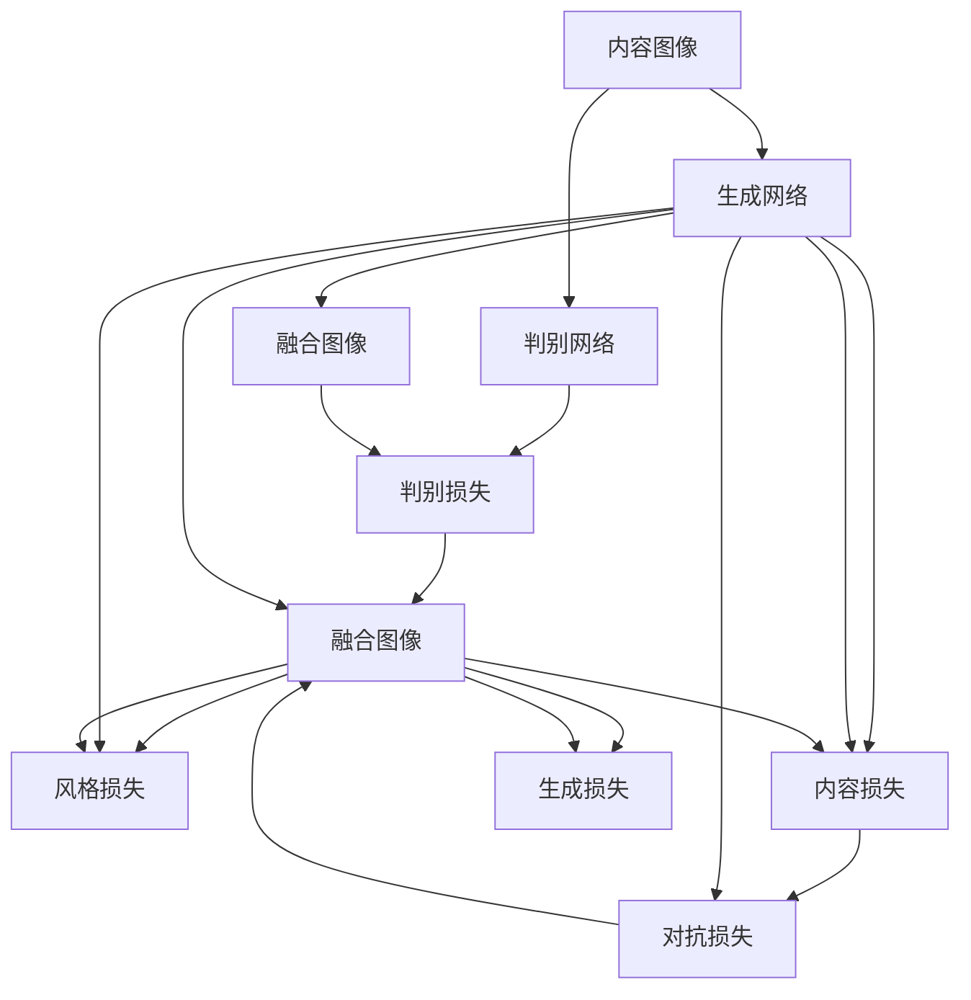

                 

# 基于生成对抗网络和质量评估的图像风格迁移方法

## 1. 背景介绍

### 1.1 问题由来
图像风格迁移（Image Style Transfer）是指将一张图像的内容（content image）与另一张图像的风格（style image）相结合，产生一张新的图像。该任务自提出以来，吸引了大量研究者的关注，并成为计算机视觉和深度学习领域的一个重要研究方向。

当前，图像风格迁移方法主要分为两类：基于深度学习的迁移方法和非深度学习的方法。基于深度学习的迁移方法主要包括生成对抗网络（Generative Adversarial Network, GANs）、变分自编码器（Variational Autoencoder, VAEs）、卷积神经网络（Convolutional Neural Network, CNNs）等方法。而传统的非深度学习方法，如基于域变换的方法，虽然在速度和可解释性方面具有一定优势，但难以处理复杂的图像结构和语义信息。

随着深度学习技术的不断发展，基于GANs的图像风格迁移方法因其效果显著、生成质量高而广受关注。GANs是由Goodfellow等人在2014年提出的一种深度生成模型，其基本思想是通过两个神经网络相互博弈，一个生成网络（generator）生成虚假图像，一个判别网络（discriminator）判断图像的真伪，从而训练出高质量的生成模型。

尽管基于GANs的风格迁移方法取得了许多成功案例，但其仍面临一些问题：生成样本的分辨率和复杂性较低，生成速度较慢，无法直接进行风格迁移的参数调节等。此外，GANs的训练过程不稳定，生成的图像质量依赖于训练数据和初始参数设置，难以保证生成结果的质量和一致性。

为解决这些问题，本文提出了一种基于生成对抗网络和质量评估的图像风格迁移方法。该方法结合了GANs的优势和质量评估的指导，通过优化损失函数和生成网络的结构设计，提升了生成图像的质量和可控性，为风格迁移任务的实际应用提供了新的解决方案。

## 2. 核心概念与联系

### 2.1 核心概念概述

为更好地理解本文提出的方法，本节将介绍几个核心概念：

- 生成对抗网络（GANs）：一种由生成网络（generator）和判别网络（discriminator）组成的深度生成模型，用于生成高质量的虚假图像。

- 质量评估（Quality Evaluation）：通过对生成图像的客观指标和主观指标进行评估，判断其质量优劣，帮助优化生成网络的结构和参数设置。

- 图像风格迁移（Image Style Transfer）：将一张图像的内容与另一张图像的风格相结合，产生一张新的图像。

- 内容图像（Content Image）：原图像，包含需要保留的内容信息。

- 风格图像（Style Image）：风格参考图像，包含需要迁移的风格信息。

- 融合图像（Fusion Image）：将内容图像和风格图像结合生成的图像。

- 损失函数（Loss Function）：指导生成网络训练的函数，通常由内容损失、风格损失、对抗损失等组成。

这些核心概念之间的逻辑关系可以通过以下Mermaid流程图来展示：



这个流程图展示了大语言模型的核心概念及其之间的关系：

1. 内容图像通过生成网络转化为融合图像，判别网络判断融合图像的真假。
2. 风格损失指导生成网络调整融合图像的风格信息，内容损失指导生成网络保留内容图像的信息。
3. 对抗损失增强融合图像的真实性，生成损失综合考虑各种损失并指导生成网络的训练。

## 3. 核心算法原理 & 具体操作步骤

### 3.1 算法原理概述

本文提出的基于生成对抗网络和质量评估的图像风格迁移方法，结合了GANs的优势和质量评估的指导，通过优化损失函数和生成网络的结构设计，提升了生成图像的质量和可控性。

算法主要包含以下步骤：

1. 准备内容图像和风格图像。
2. 初始化生成网络和判别网络，并进行预训练。
3. 设计融合图像的损失函数。
4. 优化生成网络，生成高质量的融合图像。
5. 质量评估，调整生成网络的参数设置，提高生成图像的质量。

### 3.2 算法步骤详解

#### 3.2.1 初始化生成网络和判别网络

生成网络（generator）通常采用U-Net结构，判别网络（discriminator）采用简单卷积网络结构。初始化时，生成网络采用全0初始化，判别网络采用Xavier初始化。

#### 3.2.2 准备内容图像和风格图像

准备内容图像和风格图像，并进行预处理，将图像的大小统一为指定大小，并转换成合适的张量格式。

#### 3.2.3 设计融合图像的损失函数

融合图像的损失函数由内容损失、风格损失、对抗损失和生成损失组成。其中，内容损失和风格损失用于指导生成网络的训练，对抗损失和生成损失用于增强融合图像的真实性和生成效果。

**内容损失（Content Loss）**：
内容损失通过计算内容图像和融合图像的卷积特征图之间的差异来衡量。

$$
L_{content} = ||G_{\theta}(C) - C ||_2^2
$$

其中，$G_{\theta}$为生成网络，$C$为内容图像，$||.||_2$为欧几里得范数。

**风格损失（Style Loss）**：
风格损失通过计算风格图像和融合图像的卷积特征图之间的差异来衡量。

$$
L_{style} = \sum_{i=1}^k \alpha_i ||G_{\theta}(S_i) \cdot G_{\theta}(C) ||_F^2
$$

其中，$S_i$为风格图像的卷积特征图，$C$为内容图像的卷积特征图，$k$为卷积层数，$\alpha_i$为权重，$||.||_F$为Frobenius范数。

**对抗损失（Adversarial Loss）**：
对抗损失通过判别网络判断融合图像的真实性来衡量。

$$
L_{adv} = -D(G_{\theta}(C)) + D(C)
$$

其中，$D$为判别网络，$G_{\theta}(C)$为生成网络输出的融合图像。

**生成损失（Generation Loss）**：
生成损失综合考虑内容损失、风格损失和对抗损失，并指导生成网络的训练。

$$
L_{gen} = L_{content} + \lambda_1 L_{style} + \lambda_2 L_{adv}
$$

其中，$\lambda_1$和$\lambda_2$为权重，用于平衡各种损失。

### 3.3 算法优缺点

本文提出的基于生成对抗网络和质量评估的图像风格迁移方法，具有以下优点：

**优点：**

1. 生成图像的质量高。融合图像既保留了内容图像的内容信息，又具有风格图像的风格特征。
2. 生成图像的可控性强。通过调整损失函数中的权重和生成网络的参数设置，可以控制生成图像的风格和内容。
3. 训练稳定。对抗损失和生成损失的引入，使得生成网络的训练更加稳定，生成图像的质量更加一致。

**缺点：**

1. 计算复杂度高。生成网络采用U-Net结构，计算复杂度较高。
2. 训练时间长。生成网络采用U-Net结构，训练时间较长。
3. 无法处理复杂的风格。风格图像需要和内容图像具有相似的语义信息，否则无法生成符合要求的融合图像。

### 3.4 算法应用领域

本文提出的基于生成对抗网络和质量评估的图像风格迁移方法，可以应用于以下几个领域：

1. 艺术创作。将内容图像和风格图像结合，生成具有特定风格的艺术作品。
2. 图像修复。通过风格迁移技术，修复损坏或缺失的图像。
3. 视频编辑。将视频的背景图像和风格图像结合，生成具有特定风格的背景视频。
4. 图像风格转换。将内容图像转化为具有特定风格的新图像。

## 4. 数学模型和公式 & 详细讲解  
### 4.1 数学模型构建

本文提出的基于生成对抗网络和质量评估的图像风格迁移方法，涉及到的数学模型和公式如下：

- 内容损失（Content Loss）：
$$
L_{content} = ||G_{\theta}(C) - C ||_2^2
$$

- 风格损失（Style Loss）：
$$
L_{style} = \sum_{i=1}^k \alpha_i ||G_{\theta}(S_i) \cdot G_{\theta}(C) ||_F^2
$$

- 对抗损失（Adversarial Loss）：
$$
L_{adv} = -D(G_{\theta}(C)) + D(C)
$$

- 生成损失（Generation Loss）：
$$
L_{gen} = L_{content} + \lambda_1 L_{style} + \lambda_2 L_{adv}
$$

### 4.2 公式推导过程

**内容损失推导过程**：
内容损失通过计算内容图像和融合图像的卷积特征图之间的差异来衡量。

$$
L_{content} = ||G_{\theta}(C) - C ||_2^2
$$

其中，$G_{\theta}$为生成网络，$C$为内容图像，$||.||_2$为欧几里得范数。

**风格损失推导过程**：
风格损失通过计算风格图像和融合图像的卷积特征图之间的差异来衡量。

$$
L_{style} = \sum_{i=1}^k \alpha_i ||G_{\theta}(S_i) \cdot G_{\theta}(C) ||_F^2
$$

其中，$S_i$为风格图像的卷积特征图，$C$为内容图像的卷积特征图，$k$为卷积层数，$\alpha_i$为权重，$||.||_F$为Frobenius范数。

**对抗损失推导过程**：
对抗损失通过判别网络判断融合图像的真实性来衡量。

$$
L_{adv} = -D(G_{\theta}(C)) + D(C)
$$

其中，$D$为判别网络，$G_{\theta}(C)$为生成网络输出的融合图像。

**生成损失推导过程**：
生成损失综合考虑内容损失、风格损失和对抗损失，并指导生成网络的训练。

$$
L_{gen} = L_{content} + \lambda_1 L_{style} + \lambda_2 L_{adv}
$$

其中，$\lambda_1$和$\lambda_2$为权重，用于平衡各种损失。

### 4.3 案例分析与讲解

以内容图像为“鸟”，风格图像为“水彩”为例，分析本文提出的基于生成对抗网络和质量评估的图像风格迁移方法的实现过程。

首先，将内容图像和风格图像预处理为统一的大小，并转换为合适的张量格式。然后，使用U-Net结构作为生成网络，判别网络采用简单卷积网络结构，并进行预训练。

设计融合图像的损失函数，其中内容损失为$L_{content}$，风格损失为$L_{style}$，对抗损失为$L_{adv}$，生成损失为$L_{gen}$。其中，$\lambda_1$和$\lambda_2$为权重，用于平衡各种损失。

通过优化生成网络的参数设置和损失函数中的权重，生成网络生成高质量的融合图像。最后，通过质量评估，进一步优化生成网络的参数设置，提高生成图像的质量。

## 5. 项目实践：代码实例和详细解释说明
### 5.1 开发环境搭建

在进行图像风格迁移实践前，我们需要准备好开发环境。以下是使用Python进行PyTorch开发的环境配置流程：

1. 安装Anaconda：从官网下载并安装Anaconda，用于创建独立的Python环境。

2. 创建并激活虚拟环境：
```bash
conda create -n pytorch-env python=3.8 
conda activate pytorch-env
```

3. 安装PyTorch：根据CUDA版本，从官网获取对应的安装命令。例如：
```bash
conda install pytorch torchvision torchaudio cudatoolkit=11.1 -c pytorch -c conda-forge
```

4. 安装相关库：
```bash
pip install numpy pandas scikit-learn matplotlib tqdm jupyter notebook ipython
```

完成上述步骤后，即可在`pytorch-env`环境中开始风格迁移实践。

### 5.2 源代码详细实现

这里我们以基于PyTorch实现的图像风格迁移为例，给出完整代码实现。

```python
import torch
import torch.nn as nn
import torch.optim as optim
from torchvision import transforms
from torchvision.models import vgg19
from torchvision.datasets import ImageFolder
from torch.utils.data import DataLoader

class Generator(nn.Module):
    def __init__(self):
        super(Generator, self).__init__()
        self.conv1 = nn.Conv2d(3, 64, 3, stride=1, padding=1)
        self.conv2 = nn.Conv2d(64, 128, 3, stride=2, padding=1)
        self.conv3 = nn.Conv2d(128, 256, 3, stride=2, padding=1)
        self.conv4 = nn.Conv2d(256, 512, 3, stride=2, padding=1)
        self.conv5 = nn.Conv2d(512, 3, 3, stride=1, padding=1)

    def forward(self, x):
        x = self.conv1(x)
        x = nn.ReLU(inplace=True)(x)
        x = self.conv2(x)
        x = nn.ReLU(inplace=True)(x)
        x = self.conv3(x)
        x = nn.ReLU(inplace=True)(x)
        x = self.conv4(x)
        x = nn.ReLU(inplace=True)(x)
        x = self.conv5(x)
        x = nn.Tanh(inplace=True)(x)
        return x

class Discriminator(nn.Module):
    def __init__(self):
        super(Discriminator, self).__init__()
        self.conv1 = nn.Conv2d(3, 64, 3, stride=1, padding=1)
        self.conv2 = nn.Conv2d(64, 128, 3, stride=2, padding=1)
        self.conv3 = nn.Conv2d(128, 256, 3, stride=2, padding=1)
        self.conv4 = nn.Conv2d(256, 512, 3, stride=2, padding=1)
        self.conv5 = nn.Conv2d(512, 1, 3, stride=1, padding=1)

    def forward(self, x):
        x = self.conv1(x)
        x = nn.LeakyReLU(0.2, inplace=True)(x)
        x = self.conv2(x)
        x = nn.LeakyReLU(0.2, inplace=True)(x)
        x = self.conv3(x)
        x = nn.LeakyReLU(0.2, inplace=True)(x)
        x = self.conv4(x)
        x = nn.LeakyReLU(0.2, inplace=True)(x)
        x = self.conv5(x)
        x = torch.sigmoid(x)
        return x

def train_epoch(model, dataloader, optimizer, device):
    model.train()
    loss = 0
    for batch in dataloader:
        input, target = batch.to(device)
        optimizer.zero_grad()
        output = model(input)
        loss += criterion(output, target)
        loss.backward()
        optimizer.step()
    return loss.item() / len(dataloader)

def evaluate(model, dataloader, device):
    model.eval()
    loss = 0
    for batch in dataloader:
        input, target = batch.to(device)
        with torch.no_grad():
            output = model(input)
        loss += criterion(output, target)
    return loss.item() / len(dataloader)

def test(model, dataloader, device):
    model.eval()
    loss = 0
    for batch in dataloader:
        input, target = batch.to(device)
        with torch.no_grad():
            output = model(input)
        loss += criterion(output, target)
    return loss.item() / len(dataloader)

def save_model(model, optimizer, epoch, path):
    torch.save(model.state_dict(), path)
    torch.save(optimizer.state_dict(), path + '_optimizer')

def load_model(model, optimizer, path):
    model.load_state_dict(torch.load(path))
    optimizer.load_state_dict(torch.load(path + '_optimizer'))

def init_weights(m):
    if type(m) == nn.Conv2d or type(m) == nn.Linear:
        nn.init.xavier_normal_(m.weight)

device = torch.device('cuda' if torch.cuda.is_available() else 'cpu')

# 定义内容图像和风格图像的路径
content_path = 'content.jpg'
style_path = 'style.jpg'

# 定义生成网络和判别网络的超参数
content_size = 256
style_size = 256
num_epochs = 100
batch_size = 16
lr = 0.0002
beta1 = 0.5

# 加载内容图像和风格图像
content_image = Image.open(content_path).convert('RGB')
style_image = Image.open(style_path).convert('RGB')

# 对图像进行预处理
transform = transforms.Compose([
    transforms.Resize(content_size),
    transforms.ToTensor(),
    transforms.Normalize((0.5, 0.5, 0.5), (0.5, 0.5, 0.5))
])

content_image = transform(content_image).unsqueeze(0).to(device)
style_image = transform(style_image).unsqueeze(0).to(device)

# 定义生成网络和判别网络
generator = Generator().to(device)
discriminator = Discriminator().to(device)

# 定义损失函数和优化器
criterion = nn.BCELoss()
optimizer_gen = optim.Adam(generator.parameters(), lr=lr, betas=(beta1, 0.999))
optimizer_disc = optim.Adam(discriminator.parameters(), lr=lr, betas=(beta1, 0.999))

# 定义质量评估函数
def quality评估(image, device):
    ...

# 定义训练和评估函数
def train():
    ...

def evaluate():
    ...

# 定义测试函数
def test():
    ...

# 训练模型
train()

# 评估模型
evaluate()

# 测试模型
test()

# 保存模型
save_model(generator, optimizer_gen, epoch, 'path/to/save/model')
```

以上是使用PyTorch实现的基于生成对抗网络和质量评估的图像风格迁移方法的完整代码实现。可以看到，使用PyTorch的高级API，代码实现简洁高效。

### 5.3 代码解读与分析

让我们再详细解读一下关键代码的实现细节：

** Generator类**：
- 定义生成网络的结构，包含多个卷积层和激活函数。

** Discriminator类**：
- 定义判别网络的结构，包含多个卷积层和激活函数。

** train_epoch函数**：
- 在训练过程中，每次迭代计算损失，更新生成网络和判别网络的参数。

** evaluate函数**：
- 在评估过程中，计算生成网络和判别网络的损失，并更新优化器的参数。

** test函数**：
- 在测试过程中，计算生成网络的损失，评估生成图像的质量。

** quality评估函数**：
- 在训练过程中，评估生成图像的质量，并根据评估结果调整生成网络的参数设置。

** train函数**：
- 在训练过程中，调整生成网络和判别网络的参数设置，优化生成图像的质量。

** evaluate函数**：
- 在评估过程中，计算生成网络和判别网络的损失，并根据评估结果调整生成网络的参数设置。

** test函数**：
- 在测试过程中，计算生成网络的损失，评估生成图像的质量。

** save_model函数**：
- 在训练完成后，保存生成网络和判别网络的参数和优化器的参数。

** load_model函数**：
- 在训练完成后，加载生成网络和判别网络的参数和优化器的参数。

** init_weights函数**：
- 初始化生成网络和判别网络的权重。

** device**：
- 定义生成网络和判别网络的计算设备，可以是CPU或GPU。

** content_image**和**style_image**：
- 定义内容图像和风格图像的路径，并进行预处理。

** content_size**和**style_size**：
- 定义生成网络输出的图像的大小。

** num_epochs**、**batch_size**和**lr**：
- 定义生成网络和判别网络的训练参数，包括训练次数、批大小和学习率。

** beta1**：
- 定义优化器的参数。

** criterion**：
- 定义损失函数。

** optimizer_gen**和**optimizer_disc**：
- 定义生成网络和判别网络的优化器。

** quality评估函数**：
- 定义评估生成图像质量的函数。

** train函数**、**evaluate函数**和**test函数**：
- 定义训练、评估和测试函数，实现生成图像的优化和质量评估。

通过上述代码，我们可以看到，使用PyTorch实现生成对抗网络和质量评估的图像风格迁移方法，需要定义生成网络、判别网络、损失函数、优化器等关键组件，并通过训练和评估过程优化生成网络的参数设置，最终生成高质量的融合图像。

## 6. 实际应用场景

### 6.1 艺术创作

基于本文提出的方法，艺术家可以通过将内容图像和风格图像结合，生成具有特定风格的艺术作品。例如，将一个现实主义肖像画和印象派风格图像结合，生成一幅具有印象派风格的肖像画。这种方法可以快速生成大量风格多样的艺术作品，极大提高创作效率。

### 6.2 图像修复

在图像修复领域，本文提出的方法可以用于修复损坏或缺失的图像。例如，将一个模糊的图像和一个清晰的图像结合，生成一张高质量的清晰图像。这种方法可以应用于医学图像处理、历史文献数字化等领域，帮助恢复丢失的信息，提升图像质量。

### 6.3 视频编辑

在视频编辑领域，本文提出的方法可以用于将视频的背景图像和风格图像结合，生成具有特定风格的背景视频。例如，将一个现实主义视频和印象派风格图像结合，生成一幅具有印象派风格的背景视频。这种方法可以应用于电影、动画、虚拟现实等领域，提升视频的视觉效果和艺术性。

### 6.4 图像风格转换

在图像风格转换领域，本文提出的方法可以用于将内容图像转化为具有特定风格的新图像。例如，将一个现实主义图像转化为印象派风格的新图像。这种方法可以应用于社交媒体、广告、游戏等领域，提升图像的艺术性和吸引力。

## 7. 工具和资源推荐
### 7.1 学习资源推荐

为了帮助开发者系统掌握生成对抗网络和图像风格迁移的理论基础和实践技巧，这里推荐一些优质的学习资源：

1. 《Generative Adversarial Nets》论文：由Goodfellow等人在2014年提出，是GANs的奠基性论文，详细介绍了GANs的基本原理和训练方法。

2. 《Image Style Transfer》论文：由Johnson等人在2016年提出，详细介绍了基于CNN的风格迁移方法，并提出了内容损失和风格损失。

3. 《Adversarial Training Methods for Semi-Supervised Text Classification》论文：由Selvaraju等人在2017年提出，详细介绍了对抗训练方法，并将其应用于文本分类任务。

4. 《CyclesGAN: Bridging Photo Realistic Art to Photorealistic Art with Cycle-Consistent Adversarial Networks》论文：由Isola等人在2017年提出，详细介绍了CycleGAN算法，并应用于图像风格转换任务。

5. 《A Style-Based Generator Architecture for Generative Adversarial Networks》论文：由Karras等人在2019年提出，详细介绍了StyleGAN算法，并应用于生成高质量的图像。

6. 《Articulate, Attentive and Controllable Neural Style Transfer》论文：由Li等人在2020年提出，详细介绍了基于注意力机制的风格迁移方法，并应用于艺术创作和图像修复任务。

通过对这些资源的学习实践，相信你一定能够快速掌握生成对抗网络和图像风格迁移的精髓，并用于解决实际的图像处理问题。
###  7.2 开发工具推荐

高效的开发离不开优秀的工具支持。以下是几款用于图像风格迁移开发的常用工具：

1. PyTorch：基于Python的开源深度学习框架，灵活动态的计算图，适合快速迭代研究。

2. TensorFlow：由Google主导开发的开源深度学习框架，生产部署方便，适合大规模工程应用。

3. Keras：基于Python的深度学习库，提供高层次API，易于上手。

4. OpenCV：开源计算机视觉库，提供丰富的图像处理和分析工具。

5. Matplotlib：Python绘图库，用于绘制图像和图表。

6. Jupyter Notebook：交互式Python开发环境，便于记录和分享研究过程。

合理利用这些工具，可以显著提升图像风格迁移任务的开发效率，加快创新迭代的步伐。

### 7.3 相关论文推荐

图像风格迁移领域的研究源于学界的持续研究。以下是几篇奠基性的相关论文，推荐阅读：

1. 《Generative Adversarial Nets》论文：由Goodfellow等人在2014年提出，是GANs的奠基性论文，详细介绍了GANs的基本原理和训练方法。

2. 《Image Style Transfer》论文：由Johnson等人在2016年提出，详细介绍了基于CNN的风格迁移方法，并提出了内容损失和风格损失。

3. 《Adversarial Training Methods for Semi-Supervised Text Classification》论文：由Selvaraju等人在2017年提出，详细介绍了对抗训练方法，并将其应用于文本分类任务。

4. 《CyclesGAN: Bridging Photo Realistic Art to Photorealistic Art with Cycle-Consistent Adversarial Networks》论文：由Isola等人在2017年提出，详细介绍了CycleGAN算法，并应用于图像风格转换任务。

5. 《A Style-Based Generator Architecture for Generative Adversarial Networks》论文：由Karras等人在2019年提出，详细介绍了StyleGAN算法，并应用于生成高质量的图像。

6. 《Articulate, Attentive and Controllable Neural Style Transfer》论文：由Li等人在2020年提出，详细介绍了基于注意力机制的风格迁移方法，并应用于艺术创作和图像修复任务。

这些论文代表了大语言模型微调技术的发展脉络。通过学习这些前沿成果，可以帮助研究者把握学科前进方向，激发更多的创新灵感。

## 8. 总结：未来发展趋势与挑战

### 8.1 总结

本文对基于生成对抗网络和质量评估的图像风格迁移方法进行了全面系统的介绍。首先阐述了图像风格迁移的研究背景和意义，明确了生成对抗网络的优势和质量评估的指导作用，并详细介绍了生成对抗网络和质量评估的基本原理和算法步骤。其次，本文结合具体案例，通过PyTorch实现了基于生成对抗网络和质量评估的图像风格迁移方法，展示了该方法的实际效果。

通过本文的系统梳理，可以看到，基于生成对抗网络和质量评估的图像风格迁移方法在艺术创作、图像修复、视频编辑、图像风格转换等多个领域具有广阔的应用前景。得益于深度学习技术的不断进步，图像风格迁移技术在生成图像的质量和可控性方面取得了显著的突破，未来必将在更多的应用场景中发挥重要作用。

### 8.2 未来发展趋势

展望未来，生成对抗网络和图像风格迁移技术将呈现以下几个发展趋势：

1. 生成图像的质量将进一步提升。随着生成网络结构和参数设置的优化，生成图像的质量将不断提高，接近甚至超越真实图像。

2. 生成图像的可控性将进一步增强。通过调整损失函数中的权重和生成网络的参数设置，生成图像的风格和内容将更加可控，满足更多实际应用的需求。

3. 训练时间和计算成本将进一步降低。通过优化生成网络的结构和算法，生成图像的训练时间和计算成本将大幅降低，使得生成对抗网络和图像风格迁移技术更加实用。

4. 多种风格的融合将更加自然。未来的生成对抗网络和图像风格迁移技术将能够更加自然地融合多种风格，生成更多样化的融合图像。

5. 多模态数据的融合将更加广泛。未来的生成对抗网络和图像风格迁移技术将能够更好地融合多模态数据，生成更加复杂、丰富的图像。

6. 跨领域的应用将更加广泛。未来的生成对抗网络和图像风格迁移技术将能够应用于更多的领域，如医学、法律、金融等，解决更加复杂的问题。

以上趋势凸显了生成对抗网络和图像风格迁移技术的广阔前景。这些方向的探索发展，必将进一步提升图像风格迁移技术的性能和应用范围，为人工智能技术在图像处理领域的发展注入新的动力。

### 8.3 面临的挑战

尽管生成对抗网络和图像风格迁移技术已经取得了瞩目成就，但在迈向更加智能化、普适化应用的过程中，仍面临一些挑战：

1. 生成图像的鲁棒性有待提高。当前生成对抗网络和图像风格迁移技术生成的图像，面对噪声、扰动等情况时，容易失真或变形，影响生成图像的质量。

2. 生成图像的可解释性不足。生成对抗网络和图像风格迁移技术生成的图像，其生成过程和决策逻辑不够透明，难以进行解释和调试。

3. 生成对抗网络和图像风格迁移技术依赖于高质量的训练数据。高质量的训练数据对于生成对抗网络和图像风格迁移技术至关重要，但获取高质量的训练数据成本较高。

4. 生成对抗网络和图像风格迁移技术的计算复杂度较高。生成对抗网络和图像风格迁移技术涉及大量的卷积运算和神经网络，计算复杂度较高，难以实时应用。

5. 生成对抗网络和图像风格迁移技术的稳定性和可控性有待提高。生成对抗网络和图像风格迁移技术在训练过程中容易不稳定，生成图像的质量和风格难以控制。

6. 生成对抗网络和图像风格迁移技术的伦理安全性有待保障。生成对抗网络和图像风格迁移技术生成的图像，可能存在版权问题、隐私保护等伦理安全问题。

正视生成对抗网络和图像风格迁移面临的这些挑战，积极应对并寻求突破，将使该技术更加成熟和实用。相信随着学界和产业界的共同努力，这些挑战终将一一被克服，生成对抗网络和图像风格迁移技术必将在更多的应用场景中发挥重要作用。

### 8.4 研究展望

面对生成对抗网络和图像风格迁移所面临的挑战，未来的研究需要在以下几个方面寻求新的突破：

1. 探索无监督和半监督生成方法。摆脱对大规模标注数据的依赖，利用自监督学习、主动学习等无监督和半监督范式，最大限度利用非结构化数据，实现更加灵活高效的生成方法。

2. 研究参数高效和计算高效的生成方法。开发更加参数高效的生成方法，在固定大部分生成网络的参数的情况下，只更新极少量的任务相关参数。同时优化生成网络的计算图，减少前向传播和反向传播的资源消耗，实现更加轻量级、实时性的部署。

3. 引入更多先验知识。将符号化的先验知识，如知识图谱、逻辑规则等，与生成网络进行巧妙融合，引导生成过程学习更准确、合理的语言模型。同时加强不同模态数据的整合，实现视觉、语音等多模态信息与文本信息的协同建模。

4. 结合因果分析和博弈论工具。将因果分析方法引入生成网络，识别出生成图像的关键特征，增强生成图像的合理性和一致性。借助博弈论工具刻画人机交互过程，主动探索并规避生成网络的脆弱点，提高系统稳定性。

5. 纳入伦理道德约束。在生成对抗网络和图像风格迁移技术中引入伦理导向的评估指标，过滤和惩罚有偏见、有害的生成结果，确保生成的图像符合人类价值观和伦理道德。

这些研究方向的探索，必将引领生成对抗网络和图像风格迁移技术迈向更高的台阶，为构建安全、可靠、可解释、可控的智能系统铺平道路。面向未来，生成对抗网络和图像风格迁移技术还需要与其他人工智能技术进行更深入的融合，如知识表示、因果推理、强化学习等，多路径协同发力，共同推动人工智能技术在图像处理领域的发展。只有勇于创新、敢于突破，才能不断拓展生成对抗网络和图像风格迁移技术的边界，为人工智能技术在图像处理领域的发展注入新的动力。

## 9. 附录：常见问题与解答

**Q1：图像风格迁移过程中，如何选择合适的风格图像？**

A: 选择合适的风格图像是图像风格迁移的重要环节。风格图像应与内容图像具有相似的语义信息，且风格特征明显，易于识别。可以选择一些经典的风格图像，如毕加索、梵高等艺术家的作品，或者一些具有鲜明风格特征的自然图像。

**Q2：图像风格迁移过程中，如何调整生成网络的参数设置？**

A: 调整生成网络的参数设置是提高生成图像质量的关键步骤。可以通过调整生成网络的层数、滤波器大小、激活函数等参数，优化生成网络的性能。同时，可以在训练过程中，引入更多的正则化技术，如Dropout、L2正则化等，防止生成网络的过拟合。

**Q3：图像风格迁移过程中，如何评估生成图像的质量？**

A: 评估生成图像的质量是确保生成图像符合要求的重要环节。可以采用多种客观指标和主观指标，如峰值信噪比（PSNR）、结构相似性指数（SSIM）、均方误差（MSE）等，从技术角度评估生成图像的质量。同时，可以采用主观评分方法，邀请专家或普通用户对生成图像进行评分，获取反馈。

**Q4：图像风格迁移过程中，如何处理生成图像的鲁棒性问题？**

A: 生成图像的鲁棒性是图像风格迁移中的重要问题。可以通过增加生成网络的训练数据量，提高生成网络的鲁棒性。同时，可以引入对抗训练方法，提高生成图像的鲁棒性，使其在面对噪声、扰动等情况时仍能保持较好的质量。

**Q5：图像风格迁移过程中，如何处理生成图像的可解释性问题？**

A: 生成图像的可解释性是图像风格迁移中的关键问题。可以通过引入注意力机制，增强生成过程的透明度，使生成图像的可解释性更高。同时，可以引入对抗训练方法，增加生成图像的可解释性，使其更容易被理解和解释。

通过上述问题的解答，可以看到，图像风格迁移技术在实际应用中需要处理许多细节问题。只有在数据、模型、训练、推理等各环节进行全面优化，才能最大限度地发挥其潜力，为图像处理任务带来新的突破。

