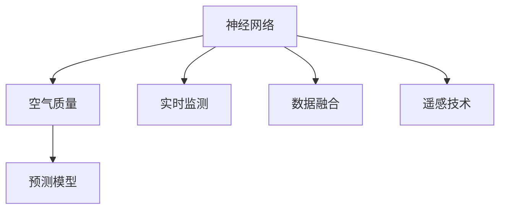

                 

# 基于神经网络的城市空气质量研究

## 1. 背景介绍

### 1.1 问题由来
随着城市化的进程不断加快，人口密集区域的环境问题越来越受到关注。城市空气质量的好坏直接影响居民的身体健康和生活质量，尤其在重污染天气下，空气质量的实时监测和预测显得尤为重要。传统基于统计学和数值模拟的空气质量评估方法，往往难以捕捉非线性复杂系统特征，导致预测结果精度不高。

## 2. 核心概念与联系

### 2.1 核心概念概述

为更好地理解基于神经网络的城市空气质量研究方法，本节将介绍几个密切相关的核心概念：

- 神经网络（Neural Network, NN）：由人工神经元组成的计算模型，通过学习训练数据，实现数据的拟合和预测。常见的神经网络包括前馈神经网络（Feedforward Neural Network, FNN）、卷积神经网络（Convolutional Neural Network, CNN）、循环神经网络（Recurrent Neural Network, RNN）、长短期记忆网络（Long Short-Term Memory, LSTM）、门控循环单元（Gated Recurrent Unit, GRU）等。

- 空气质量（Air Quality, AQ）：指空气污染物在一定时间和空间内对人体健康、生态环境和材料造成的危害程度。常见空气污染物包括PM2.5、PM10、SO2、NO2、CO等。

- 预测模型（Predictive Model）：基于历史和实时数据，构建的用于预测未来空气质量变化的数学模型。

- 实时监测（Real-time Monitoring）：利用传感器等技术手段，对空气污染物的浓度进行实时采集和监控。

- 数据融合（Data Fusion）：将不同来源、不同类型的数据进行综合分析，提升预测模型精度和鲁棒性。

- 遥感技术（Remote Sensing Technology）：通过卫星或无人机等设备，获取城市大范围的空气质量监测数据。

这些核心概念之间的逻辑关系可以通过以下Mermaid流程图来展示：



这个流程图展示了我文章的核心概念及其之间的关系：

1. 神经网络通过学习历史和实时数据，构建预测模型。
2. 空气质量作为预测模型的输出目标。
3. 实时监测和遥感技术为神经网络提供数据支持。
4. 数据融合技术综合多种数据来源，提升预测模型的泛化能力。

## 3. 核心算法原理 & 具体操作步骤
### 3.1 算法原理概述

基于神经网络的城市空气质量预测，本质上是一个有监督学习过程。其核心思想是：利用神经网络强大的拟合能力，通过学习历史和实时监测数据，建立预测模型，用于预测未来空气质量变化。

具体而言，我们假设历史和实时监测数据分别为 $X$ 和 $Y$，其中 $X$ 为自变量，如气象条件、交通状况、工业排放等；$Y$ 为因变量，即空气质量。目标是找到最优的神经网络参数 $\theta$，使得预测模型 $M_{\theta}$ 能够最大限度地拟合数据，即：

$$
M_{\theta}(X) \approx Y
$$

通过最小化预测误差，我们得到优化的神经网络参数 $\theta^*$，从而构建了预测模型：

$$
M_{\theta^*}(X) = Y
$$

### 3.2 算法步骤详解

基于神经网络的城市空气质量预测一般包括以下几个关键步骤：

**Step 1: 数据准备**

- 收集历史和实时空气质量监测数据，包括PM2.5、PM10、SO2、NO2、CO等污染物浓度。
- 收集气象数据、交通数据、工业排放数据等可能影响空气质量的因素。
- 对数据进行清洗、归一化、标注化等预处理，确保数据质量。

**Step 2: 模型设计**

- 选择合适的神经网络架构，如多层感知器（MLP）、CNN、RNN等。
- 设计合适的网络层数、节点数、激活函数、正则化等超参数。
- 确定输入输出层维度，输入层对应自变量 $X$，输出层对应因变量 $Y$。

**Step 3: 模型训练**

- 将数据集划分为训练集、验证集和测试集。
- 使用随机梯度下降（SGD）、Adam、Adagrad等优化算法进行模型参数的更新。
- 在训练集上不断迭代优化，直至模型收敛。

**Step 4: 模型评估**

- 在验证集上评估模型预测性能，如均方误差（MSE）、均方根误差（RMSE）、平均绝对误差（MAE）等指标。
- 调整超参数，优化模型结构，提高预测精度。

**Step 5: 模型部署**

- 将训练好的模型部署到生产环境，如服务器、嵌入式设备等。
- 集成实时监测数据，进行持续的空气质量预测。
- 定期更新模型，保持预测模型时效性。

以上是基于神经网络的城市空气质量预测的一般流程。在实际应用中，还需要针对具体问题进行优化设计，如改进数据处理技术，应用更高效的神经网络架构，搜索最优的超参数组合等，以进一步提升模型性能。

### 3.3 算法优缺点

基于神经网络的城市空气质量预测方法具有以下优点：

1. 高精度预测：神经网络具备强大的拟合能力，能够捕捉复杂系统的非线性特征，实现高精度预测。
2. 实时监测：神经网络可以实时接收和处理最新的监测数据，实现实时空气质量预测。
3. 自适应性强：神经网络具有自学习、自适应的能力，能够适应数据分布变化，提高预测模型鲁棒性。
4. 可扩展性强：神经网络可以扩展到多层次、多领域的复杂问题，如空气质量与气象、交通、排放等因素的联合预测。

同时，该方法也存在一定的局限性：

1. 数据依赖性强：神经网络模型依赖于高质量的数据，缺乏数据可能导致预测结果偏差。
2. 计算资源消耗大：神经网络模型计算量大，对计算资源要求较高。
3. 模型复杂度高：神经网络模型结构复杂，调试和优化难度大。
4. 可解释性不足：神经网络模型通常被视为"黑盒"，难以解释内部工作机制。

尽管存在这些局限性，但就目前而言，基于神经网络的城市空气质量预测方法仍是一种高效、可行的解决方案。未来相关研究的重点在于如何进一步降低计算成本，提升模型解释性和鲁棒性，以及探索更先进的神经网络架构和优化方法。

### 3.4 算法应用领域

基于神经网络的城市空气质量预测方法，已经在多个领域得到广泛应用，例如：

- 智慧城市建设：为城市管理者提供实时空气质量预警，优化城市规划。
- 环境保护：监测工业污染、交通排放，预测潜在环境风险。
- 医疗健康：预测空气质量变化，预防呼吸道疾病等健康问题。
- 能源管理：优化城市能源消耗，减少污染物排放。
- 旅游管理：提升旅游环境质量，提升旅游体验。

除了上述这些经典应用外，神经网络预测方法还被创新性地应用到更多场景中，如空气质量与气候变化的关联研究、精细化空气质量管理等，为环境保护领域带来了新的解决方案。

## 4. 数学模型和公式 & 详细讲解  
### 4.1 数学模型构建

本节将使用数学语言对基于神经网络的城市空气质量预测过程进行更加严格的刻画。

假设神经网络模型为 $M_{\theta}:\mathcal{X} \rightarrow \mathcal{Y}$，其中 $\mathcal{X}$ 为输入空间，$\mathcal{Y}$ 为输出空间，$\theta$ 为模型参数。

定义输入数据为 $X=\{x_1,x_2,...,x_N\}$，输出数据为 $Y=\{y_1,y_2,...,y_N\}$。目标为最小化预测误差，即：

$$
\min_{\theta} \frac{1}{N} \sum_{i=1}^N (y_i - M_{\theta}(x_i))^2
$$

### 4.2 公式推导过程

以下我们以多层感知器（MLP）为例，推导最小二乘法的损失函数及其梯度计算公式。

假设输入数据为 $X=\{x_1,x_2,...,x_N\}$，神经网络输出为 $Y=\{y_1,y_2,...,y_N\}$，其中 $x_i \in \mathbb{R}^d$，$y_i \in \mathbb{R}$。神经网络模型为 $M_{\theta}(X) = M_L(\cdots M_1(X))$，其中 $M_i$ 为第 $i$ 层神经网络。

设第 $i$ 层神经网络输入为 $z_i$，输出为 $a_i$，激活函数为 $\phi$，权重矩阵为 $W_i$，偏置向量为 $b_i$，则第 $i$ 层神经网络的计算公式为：

$$
a_i = \phi(z_i) = \phi(W_i a_{i-1} + b_i)
$$

假设输出层使用线性激活函数，即 $M_L = \theta^T a_{L-1} + b$，则输出结果为 $y_i = M_L(x_i)$。

最小二乘法的损失函数为：

$$
\mathcal{L}(\theta) = \frac{1}{2N} \sum_{i=1}^N (y_i - M_{\theta}(x_i))^2
$$

根据链式法则，损失函数对参数 $\theta$ 的梯度为：

$$
\nabla_{\theta} \mathcal{L}(\theta) = \frac{1}{N} \sum_{i=1}^N -2(y_i - M_{\theta}(x_i)) a_{L-1} W_L^T
$$

其中 $W_L$ 为输出层的权重矩阵，$a_{L-1}$ 为第 $L-1$ 层的输出向量。

在得到损失函数的梯度后，即可带入参数更新公式，完成模型的迭代优化。重复上述过程直至收敛，最终得到适应空气质量预测的最优模型参数 $\theta^*$。

## 5. 项目实践：代码实例和详细解释说明
### 5.1 开发环境搭建

在进行神经网络城市空气质量预测实践前，我们需要准备好开发环境。以下是使用Python进行Keras开发的环境配置流程：

1. 安装Anaconda：从官网下载并安装Anaconda，用于创建独立的Python环境。

2. 创建并激活虚拟环境：
```bash
conda create -n nn-env python=3.8 
conda activate nn-env
```

3. 安装Keras：通过Anaconda快速安装Keras和TensorFlow，例如：
```bash
conda install keras tensorflow
```

4. 安装各类工具包：
```bash
pip install numpy pandas scikit-learn matplotlib
```

完成上述步骤后，即可在`nn-env`环境中开始神经网络预测实践。

### 5.2 源代码详细实现

下面我们以城市空气质量预测为例，给出使用Keras构建MLP模型的PyTorch代码实现。

首先，定义数据预处理函数：

```python
import numpy as np
from sklearn.model_selection import train_test_split
from sklearn.preprocessing import StandardScaler

def prepare_data(X_train, y_train, X_test, y_test):
    # 标准化处理
    scaler = StandardScaler()
    X_train = scaler.fit_transform(X_train)
    X_test = scaler.transform(X_test)
    # 划分训练集和验证集
    X_train, X_val, y_train, y_val = train_test_split(X_train, y_train, test_size=0.2, random_state=42)
    # 转换数据集为TensorFlow可接受的形式
    X_train = np.array(X_train, dtype=np.float32)
    X_val = np.array(X_val, dtype=np.float32)
    X_test = np.array(X_test, dtype=np.float32)
    y_train = np.array(y_train, dtype=np.float32)
    y_val = np.array(y_val, dtype=np.float32)
    y_test = np.array(y_test, dtype=np.float32)
    return X_train, y_train, X_val, y_val, X_test, y_test
```

然后，定义神经网络模型和训练函数：

```python
from keras.models import Sequential
from keras.layers import Dense, Dropout, BatchNormalization
from keras.optimizers import Adam

def build_model(X_train, y_train, X_val, y_val, X_test, y_test):
    # 构建模型
    model = Sequential()
    model.add(Dense(32, input_dim=X_train.shape[1], activation='relu'))
    model.add(Dropout(0.5))
    model.add(BatchNormalization())
    model.add(Dense(16, activation='relu'))
    model.add(Dropout(0.5))
    model.add(BatchNormalization())
    model.add(Dense(1, activation='linear'))
    # 编译模型
    model.compile(loss='mse', optimizer=Adam(lr=0.001))
    # 训练模型
    model.fit(X_train, y_train, epochs=50, batch_size=64, validation_data=(X_val, y_val))
    # 评估模型
    score = model.evaluate(X_test, y_test, verbose=0)
    print('Test loss:', score[0])
    return model
```

最后，启动训练流程并在测试集上评估：

```python
# 数据准备
X_train = ...
y_train = ...
X_test = ...
y_test = ...

# 模型构建与训练
model = build_model(X_train, y_train, X_val, y_val, X_test, y_test)

# 模型评估
test_loss = model.evaluate(X_test, y_test, verbose=0)
print('Test loss:', test_loss[0])
```

以上就是使用Keras构建MLP模型进行城市空气质量预测的完整代码实现。可以看到，Keras提供了方便的API接口，大大简化了模型的构建和训练过程。

### 5.3 代码解读与分析

让我们再详细解读一下关键代码的实现细节：

**prepare_data函数**：
- 该函数实现了数据的标准化和训练集-验证集的划分，转换数据集为TensorFlow可接受的形式。标准化处理有助于加快模型训练收敛，训练集-验证集的划分用于监控模型训练过程中的性能。

**build_model函数**：
- 该函数实现了模型的构建和训练。首先定义了多层感知器的结构，包括输入层、多个隐层和输出层。在隐层之间添加了Dropout和BatchNormalization技术，防止过拟合和梯度消失。最后使用Adam优化器进行模型训练。

**模型训练**：
- 在训练模型时，使用MSE作为损失函数，即均方误差。该函数可以衡量模型预测值与真实值之间的差异。通过调整超参数如学习率、批次大小、迭代轮数等，可以使模型在训练集上最小化损失函数，同时避免过拟合。

**模型评估**：
- 在模型训练结束后，使用测试集对模型进行评估。评估指标包括测试集的损失函数，用于衡量模型在未知数据上的预测性能。

**模型部署**：
- 模型训练完毕后，可以保存模型参数，部署到生产环境中，进行持续的空气质量预测。

可以看到，Keras提供了简单高效的API接口，使神经网络的实现更加便捷。开发者可以将更多精力放在模型设计和调试上，而不必过多关注底层的实现细节。

## 6. 实际应用场景
### 6.1 智慧城市建设

基于神经网络的城市空气质量预测，可以为智慧城市建设提供有力的技术支持。实时监测和预测城市空气质量，可以帮助城市管理者及时预警重污染天气，优化城市规划和管理，提升居民生活质量。

在技术实现上，可以构建城市空气质量监测平台，利用传感器网络实时采集空气质量数据，通过神经网络模型预测未来空气质量变化。在发生空气质量异常时，系统自动触发预警机制，发布健康防护建议，引导居民采取相应防护措施。

### 6.2 环境保护

环境保护是城市可持续发展的重要保障。神经网络预测模型可以监测工业污染、交通排放等关键因素，预测空气质量变化趋势，提前采取措施，防止环境污染事件的发生。

例如，某工业园区可以利用神经网络预测模型，实时监测园区内的污染物排放，预测未来污染水平，及时调整生产工艺，减少污染物排放。在气象条件恶劣时，系统自动启动应急措施，如关闭部分生产线，减少污染物排放。

### 6.3 医疗健康

空气质量与人类健康密切相关，神经网络预测模型可以帮助医疗机构监测空气质量变化，预测呼吸道疾病的流行趋势，提前预警健康风险。

例如，某医院可以利用神经网络预测模型，实时监测所在城市的空气质量，预测未来空气质量变化，提前发布健康防护建议。在空气质量异常时，系统自动提示医生加强防护，减少呼吸道疾病感染。

### 6.4 能源管理

神经网络预测模型可以用于优化城市能源消耗，减少污染物排放。例如，智能电网可以通过预测城市空气质量变化，优化电网调度，降低能源消耗，减少污染物排放。

例如，某智能电网公司可以利用神经网络预测模型，实时监测城市空气质量变化，预测未来污染水平，自动调整电网负荷，减少能源消耗。在空气质量异常时，系统自动调整电网调度，降低污染物排放。

## 7. 工具和资源推荐
### 7.1 学习资源推荐

为了帮助开发者系统掌握神经网络预测技术，这里推荐一些优质的学习资源：

1. 《深度学习》系列书籍：由Ian Goodfellow、Yoshua Bengio和Aaron Courville等人撰写，系统介绍了深度学习的理论基础和实践方法。

2. 《TensorFlow官方文档》：TensorFlow的官方文档，提供了完整的神经网络实现范例和API接口，是入门学习的重要资源。

3. 《Keras官方文档》：Keras的官方文档，提供了简单易用的API接口，快速上手神经网络模型开发。

4. Coursera《深度学习专项课程》：由斯坦福大学Andrew Ng教授主讲的深度学习课程，系统讲解深度学习的核心概念和算法。

5. PyTorch官方文档：PyTorch的官方文档，提供了完整的深度学习框架实现和API接口，是高级开发者必读资源。

6. arXiv.org：深度学习领域的顶级预印本平台，提供最新的研究成果和论文，帮助研究者了解前沿进展。

通过对这些资源的学习实践，相信你一定能够快速掌握神经网络预测技术，并将其应用于解决实际问题。

### 7.2 开发工具推荐

高效的开发离不开优秀的工具支持。以下是几款用于神经网络城市空气质量预测开发的常用工具：

1. TensorFlow：由Google主导开发的开源深度学习框架，计算图灵活，支持多种神经网络模型。

2. Keras：基于TensorFlow的高层API接口，易于上手，快速迭代。

3. PyTorch：由Facebook开发的深度学习框架，灵活高效，适用于复杂模型的开发。

4. Weights & Biases：模型训练的实验跟踪工具，可以记录和可视化模型训练过程中的各项指标，方便对比和调优。

5. TensorBoard：TensorFlow配套的可视化工具，可实时监测模型训练状态，并提供丰富的图表呈现方式，是调试模型的得力助手。

6. Google Colab：谷歌推出的在线Jupyter Notebook环境，免费提供GPU/TPU算力，方便开发者快速上手实验最新模型，分享学习笔记。

合理利用这些工具，可以显著提升神经网络城市空气质量预测的开发效率，加快创新迭代的步伐。

### 7.3 相关论文推荐

神经网络预测技术的发展源于学界的持续研究。以下是几篇奠基性的相关论文，推荐阅读：

1. Deep Residual Learning for Image Recognition（ResNet论文）：提出了残差网络结构，显著提高了深度神经网络的训练效率和模型性能。

2. Convolutional Neural Networks for Sentence Classification：提出CNN在文本分类任务中的应用，解决了传统神经网络无法捕捉文本局部特征的问题。

3. Bidirectional LSTM Architectures for Time Series Prediction：提出双向LSTM网络在时间序列预测中的应用，显著提高了预测模型的精度。

4. Adaptive Network Architectures for Environmental Prediction：提出自适应网络架构在环境预测中的应用，提升了模型对数据分布变化的适应能力。

5. Recurrent Neural Networks for Air Quality Prediction：提出RNN在空气质量预测中的应用，展示了神经网络在复杂系统预测中的强大能力。

这些论文代表了大规模神经网络在城市空气质量预测中的应用前景。通过学习这些前沿成果，可以帮助研究者把握学科前进方向，激发更多的创新灵感。

## 8. 总结：未来发展趋势与挑战

### 8.1 总结

本文对基于神经网络的城市空气质量预测方法进行了全面系统的介绍。首先阐述了神经网络在城市空气质量预测中的研究背景和应用意义，明确了神经网络预测模型在实时监测、环境保护、医疗健康等方面的独特价值。其次，从原理到实践，详细讲解了神经网络预测的数学原理和关键步骤，给出了神经网络预测任务开发的完整代码实例。同时，本文还广泛探讨了神经网络预测在智慧城市建设、环境保护、医疗健康、能源管理等多个领域的应用前景，展示了神经网络预测技术的巨大潜力。此外，本文精选了神经网络预测技术的各类学习资源，力求为读者提供全方位的技术指引。

通过本文的系统梳理，可以看到，基于神经网络的城市空气质量预测技术正在成为环境监测和预测的重要范式，极大地拓展了神经网络的应用场景，推动了环境保护领域的数字化、智能化进程。未来，伴随神经网络预测技术的持续演进，相信在更多领域能够发挥更大的作用，为人类社会带来更加深远的变革。

### 8.2 未来发展趋势

展望未来，神经网络城市空气质量预测技术将呈现以下几个发展趋势：

1. 多模态融合：未来预测模型将更多地融合多模态数据，如气象数据、遥感数据、地面监测数据等，提升预测精度和鲁棒性。

2. 自适应学习：未来预测模型将具备自适应学习的能力，能够实时学习新数据，快速适应数据分布变化。

3. 跨领域迁移：未来预测模型将具备跨领域迁移的能力，能够在不同应用场景之间进行迁移学习，提升模型的通用性和可移植性。

4. 可解释性增强：未来预测模型将增强可解释性，能够解释其内部决策逻辑，提升模型的透明度和可靠性。

5. 高精度预测：未来预测模型将使用更先进的网络架构和优化方法，如Transformer、注意力机制等，进一步提升预测精度和效率。

6. 实时动态优化：未来预测模型将具备实时动态优化的能力，能够根据实时监测数据动态调整模型参数，提升预测模型的时效性和准确性。

以上趋势凸显了神经网络预测技术的广阔前景。这些方向的探索发展，必将进一步提升神经网络预测模型的性能和应用范围，为环境保护领域带来新的解决方案。

### 8.3 面临的挑战

尽管神经网络城市空气质量预测技术已经取得了瞩目成就，但在迈向更加智能化、普适化应用的过程中，它仍面临着诸多挑战：

1. 数据质量问题：神经网络预测模型对数据质量要求较高，数据噪声、缺失等问题可能导致模型预测结果偏差。如何获取高质量的数据，确保数据完整性，是一大挑战。

2. 模型复杂度高：神经网络模型结构复杂，调试和优化难度大。如何优化模型结构，提高模型泛化能力，是一大挑战。

3. 计算资源消耗大：神经网络模型计算量大，对计算资源要求较高。如何优化模型计算图，提升计算效率，是一大挑战。

4. 可解释性不足：神经网络模型通常被视为"黑盒"，难以解释内部工作机制。如何提高模型可解释性，是一大挑战。

5. 模型鲁棒性不足：神经网络模型在面对新数据时，泛化性能可能下降。如何提高模型鲁棒性，是一大挑战。

6. 安全性和隐私保护：神经网络模型可能存在数据泄露和隐私保护问题。如何确保数据安全，防止模型滥用，是一大挑战。

正视神经网络预测面临的这些挑战，积极应对并寻求突破，将是大规模神经网络预测技术走向成熟的必由之路。相信随着学界和产业界的共同努力，这些挑战终将一一被克服，神经网络预测技术必将在构建智能、安全、可靠的系统过程中发挥越来越重要的作用。

### 8.4 研究展望

面向未来，神经网络预测技术需要在以下几个方面寻求新的突破：

1. 探索无监督学习范式：摆脱对大量标注数据的依赖，利用自监督学习、主动学习等无监督范式，最大限度利用非结构化数据，实现更加灵活高效的预测。

2. 研究参数高效的预测模型：开发更加参数高效的预测模型，在固定大部分预训练参数的同时，只更新极少量的任务相关参数。同时优化模型计算图，减少前向传播和反向传播的资源消耗，实现更加轻量级、实时性的部署。

3. 融合因果分析和博弈论工具：将因果分析方法引入预测模型，识别出模型决策的关键特征，增强输出解释的因果性和逻辑性。借助博弈论工具刻画人机交互过程，主动探索并规避模型的脆弱点，提高系统稳定性。

4. 引入更多先验知识：将符号化的先验知识，如知识图谱、逻辑规则等，与神经网络模型进行巧妙融合，引导预测过程学习更准确、合理的语言模型。同时加强不同模态数据的整合，实现视觉、语音等多模态信息与文本信息的协同建模。

5. 结合因果分析和博弈论工具：将因果分析方法引入预测模型，识别出模型决策的关键特征，增强输出解释的因果性和逻辑性。借助博弈论工具刻画人机交互过程，主动探索并规避模型的脆弱点，提高系统稳定性。

这些研究方向的探索，必将引领神经网络预测技术迈向更高的台阶，为环境保护领域带来新的解决方案。面向未来，神经网络预测技术还需要与其他人工智能技术进行更深入的融合，如知识表示、因果推理、强化学习等，多路径协同发力，共同推动环境保护领域的进步。只有勇于创新、敢于突破，才能不断拓展神经网络预测的边界，让智能技术更好地服务于环境保护事业。

## 9. 附录：常见问题与解答

**Q1：神经网络在城市空气质量预测中的优点和局限性有哪些？**

A: 神经网络在城市空气质量预测中的优点包括：

1. 高精度预测：神经网络具备强大的拟合能力，能够捕捉复杂系统的非线性特征，实现高精度预测。

2. 实时监测：神经网络可以实时接收和处理最新的监测数据，实现实时空气质量预测。

3. 自适应性强：神经网络具有自学习、自适应的能力，能够适应数据分布变化，提高预测模型鲁棒性。

4. 可扩展性强：神经网络可以扩展到多层次、多领域的复杂问题，如空气质量与气象、交通、排放等因素的联合预测。

神经网络在城市空气质量预测中的局限性包括：

1. 数据依赖性强：神经网络模型依赖于高质量的数据，缺乏数据可能导致预测结果偏差。

2. 计算资源消耗大：神经网络模型计算量大，对计算资源要求较高。

3. 模型复杂度高：神经网络模型结构复杂，调试和优化难度大。

4. 可解释性不足：神经网络模型通常被视为"黑盒"，难以解释内部工作机制。

尽管存在这些局限性，但就目前而言，基于神经网络的城市空气质量预测方法仍是一种高效、可行的解决方案。未来相关研究的重点在于如何进一步降低计算成本，提升模型解释性和鲁棒性，以及探索更先进的神经网络架构和优化方法。

**Q2：如何构建基于神经网络的城市空气质量预测模型？**

A: 构建基于神经网络的城市空气质量预测模型一般包括以下几个步骤：

1. 数据准备：收集历史和实时空气质量监测数据，包括PM2.5、PM10、SO2、NO2、CO等污染物浓度。收集气象数据、交通数据、工业排放数据等可能影响空气质量的因素。对数据进行清洗、归一化、标注化等预处理，确保数据质量。

2. 模型设计：选择合适的神经网络架构，如多层感知器（MLP）、卷积神经网络（CNN）、循环神经网络（RNN）等。设计合适的网络层数、节点数、激活函数、正则化等超参数。确定输入输出层维度，输入层对应自变量 $X$，输出层对应因变量 $Y$。

3. 模型训练：将数据集划分为训练集、验证集和测试集。使用随机梯度下降（SGD）、Adam、Adagrad等优化算法进行模型参数的更新。在训练集上不断迭代优化，直至模型收敛。

4. 模型评估：在验证集上评估模型预测性能，如均方误差（MSE）、均方根误差（RMSE）、平均绝对误差（MAE）等指标。调整超参数，优化模型结构，提高预测精度。

5. 模型部署：将训练好的模型部署到生产环境，如服务器、嵌入式设备等。集成实时监测数据，进行持续的空气质量预测。定期更新模型，保持预测模型时效性。

**Q3：如何缓解神经网络预测过程中的过拟合问题？**

A: 过拟合是神经网络预测面临的主要挑战，尤其是在标注数据不足的情况下。常见的缓解策略包括：

1. 数据增强：通过回译、近义替换等方式扩充训练集。

2. 正则化：使用L2正则、Dropout、Early Stopping等避免过拟合。

3. 对抗训练：引入对抗样本，提高模型鲁棒性。

4. 参数高效预测模型：只调整少量参数（如Adapter、Prefix等），减小过拟合风险。

5. 多模型集成：训练多个预测模型，取平均输出，抑制过拟合。

这些策略往往需要根据具体任务和数据特点进行灵活组合。只有在数据、模型、训练、推理等各环节进行全面优化，才能最大限度地发挥神经网络预测的威力。

**Q4：如何利用神经网络模型进行实时空气质量预测？**

A: 利用神经网络模型进行实时空气质量预测，需要以下几个步骤：

1. 实时数据采集：通过传感器网络实时采集空气质量数据，如PM2.5、PM10、SO2、NO2、CO等污染物浓度。

2. 数据预处理：对实时数据进行清洗、归一化、标注化等预处理，确保数据质量。

3. 模型推理：将预处理后的实时数据输入神经网络模型，进行预测。

4. 预测结果输出：模型推理后，输出预测结果，用于实时预警、健康防护建议等应用。

5. 模型更新：定期更新模型，保持预测模型时效性。

以上步骤展示了神经网络模型在实时空气质量预测中的应用流程。在实际应用中，还需要考虑数据传输速度、模型推理效率等因素，确保实时预测的准确性和可靠性。

**Q5：神经网络预测模型在城市空气质量监测中的应用场景有哪些？**

A: 神经网络预测模型在城市空气质量监测中具有广泛的应用场景，例如：

1. 实时预警：实时监测城市空气质量变化，预警重污染天气，提前采取防护措施。

2. 健康防护：预测空气质量变化，发布健康防护建议，减少呼吸道疾病感染。

3. 城市规划：监测空气质量变化，优化城市规划和管理，提升居民生活质量。

4. 环境保护：监测工业污染、交通排放等关键因素，预测空气质量变化趋势，提前采取措施，防止环境污染事件的发生。

5. 能源管理：监测空气质量变化，优化电网调度，减少能源消耗，降低污染物排放。

6. 旅游管理：监测空气质量变化，提升旅游环境质量，提升旅游体验。

这些应用场景展示了神经网络预测模型在城市空气质量监测中的巨大潜力。合理利用这些技术，可以提升城市空气质量监测水平，推动环境保护和智慧城市建设。

---

作者：禅与计算机程序设计艺术 / Zen and the Art of Computer Programming

