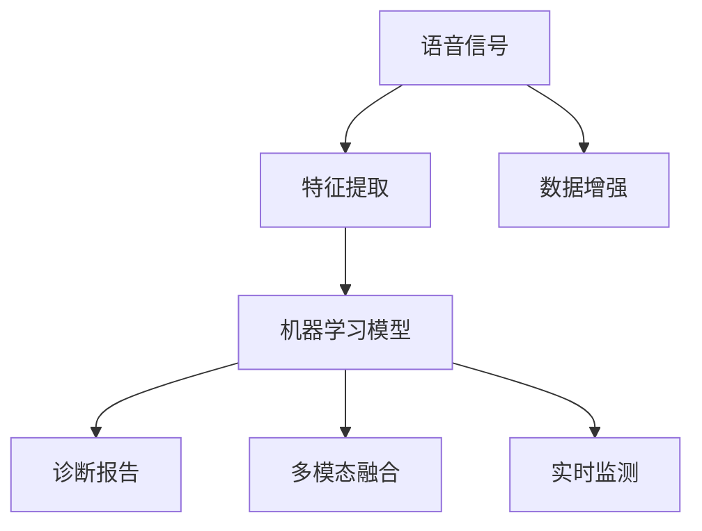

                 

## 1. 背景介绍

随着人口老龄化和环境污染问题日益突出，呼吸道疾病（如慢性阻塞性肺疾病、肺炎等）的患病率逐渐上升，成为严重的公共卫生问题。传统的诊断方式包括X光、CT扫描等影像学手段，但由于成本高、操作复杂，且难以实时捕捉病情变化，无法满足临床需求。而基于语音信号的诊断方式，因其方便、无创、实时性强等优点，引起了广泛关注。

### 1.1 问题由来
现代通信技术的发展，使得语音信号记录和处理变得日益便捷。而在医疗领域，语音信号也得到了越来越多应用。例如，心电图（ECG）已通过语音信号分析实现了初步的疾病预测和诊断。然而，基于语音信号的呼吸系统疾病诊断尚未成熟，需要进一步的研究和探索。

### 1.2 问题核心关键点
基于语音信号的呼吸道疾病诊断的核心问题包括：
- 如何高效提取和处理语音信号中的关键特征，以反映病情的变化。
- 如何设计合理的机器学习模型，对提取的特征进行准确分类或预测，并生成诊断报告。
- 如何结合多种数据源，如影像数据、基因数据等，提高诊断的全面性和准确性。

### 1.3 问题研究意义
通过利用语音信号，对呼吸系统疾病进行早期诊断，不仅能够提高诊疗效率，降低医疗成本，还可以帮助患者及时发现和治疗疾病，提高生活质量。此外，实时监测病情的变化，也能帮助医生更好地制定治疗方案，提高临床决策的科学性。

## 2. 核心概念与联系

### 2.1 核心概念概述

为更好地理解基于语音信号的呼吸道疾病诊断方法，本节将介绍几个关键概念：

- **语音信号**：指人类发出的声音信号，包含了各种生理和病理信息，如音调、音色、呼吸频率、咳嗽声等。
- **特征提取**：从原始语音信号中提取出有用的特征，用于反映病理状态。
- **机器学习模型**：以提取的特征作为输入，通过训练学习如何准确分类或预测疾病，生成诊断报告。
- **数据增强**：通过人为添加噪声、回声等信号，扩充训练数据，避免过拟合。
- **融合技术**：将语音信号与其他数据源（如影像、基因数据）进行多模态融合，提高诊断的全面性和准确性。
- **实时监测**：对语音信号进行实时分析，及时捕捉病情变化，用于动态监测和治疗。

这些核心概念之间通过语音信号和机器学习模型进行联系，共同构成了呼吸道疾病诊断的完整技术框架。

### 2.2 核心概念原理和架构的 Mermaid 流程图



## 3. 核心算法原理 & 具体操作步骤
### 3.1 算法原理概述

基于语音信号的呼吸道疾病诊断，本质上是一个信号处理与机器学习相结合的过程。其核心思想是：通过提取语音信号中的关键特征，构建合适的机器学习模型，对病情进行分类或预测，并生成诊断报告。

形式化地，假设从患者处收集到 $N$ 段语音信号 $x_1, x_2, ..., x_N$，每段信号长度为 $T$ 个时间点，每个时间点表示一个声学特征，如声压、声门阻抗等。记第 $i$ 个时间点的特征向量为 $x_i=(x_{i,1}, x_{i,2}, ..., x_{i,T})$。通过特征提取方法，得到 $N$ 段特征表示的语音信号 $X=\{x_i\}_{i=1}^N$。

基于语音信号的诊断模型构建包含以下几个关键步骤：

1. **特征提取**：从语音信号中提取有用的特征，反映病情状态。
2. **模型训练**：选择合适机器学习模型，使用历史病例作为训练集，训练模型学习特征与疾病的关系。
3. **模型预测**：对新采集的语音信号进行特征提取，输入到模型中进行预测，得到诊断结果。

### 3.2 算法步骤详解

**Step 1: 特征提取**
- **短时傅里叶变换（STFT）**：将语音信号分为多个时间窗口，对每个窗口进行傅里叶变换，得到频谱信息。
- **倒谱系数（MFCC）**：对频谱信息进行对数变换和离散余弦变换，得到倒谱系数，反映语音的能量分布和频谱特征。
- **梅尔倒谱系数（Mel-Spectrogram）**：利用人耳对声音的感知特性，对倒谱系数进行加权，提高模型的语音特征表示能力。
- **声学特征参数（LPCC）**：对倒谱系数进行线性预测，得到自回归模型参数，进一步提取出声音的动态特征。

**Step 2: 模型选择与训练**
- **深度学习模型**：如卷积神经网络（CNN）、长短期记忆网络（LSTM）、循环卷积神经网络（RCNN）等，可以捕捉语音信号的局部特征和时序特征。
- **传统机器学习模型**：如支持向量机（SVM）、随机森林（RF）、决策树（DT）等，适用于小规模数据集的分类任务。
- **集成学习模型**：通过结合多个模型进行预测，可以有效提高诊断的准确性和鲁棒性。

**Step 3: 模型预测与诊断**
- **预测结果**：将新采集的语音信号进行特征提取，输入到模型中进行预测，得到疾病分类或预测结果。
- **诊断报告**：根据预测结果，结合其他辅助信息（如影像数据、基因数据等），生成详细的诊断报告，并推荐相应的治疗方案。

### 3.3 算法优缺点

基于语音信号的呼吸道疾病诊断方法具有以下优点：
- **无创性**：语音信号采集和处理无需侵入性操作，对患者造成的影响较小。
- **实时性**：语音信号实时分析能够快速获取病情变化，适用于动态监测。
- **普适性**：语音信号采集设备易于获取，适用于家庭、医院等不同场景。

然而，该方法也存在一些局限性：
- **特征提取复杂**：不同疾病的特征提取方法可能不同，需要根据具体疾病设计特征提取策略。
- **模型泛化能力有限**：模型需基于大量标注数据进行训练，在面对新病例时可能表现不稳定。
- **环境噪声影响**：语音信号采集设备易受环境噪声干扰，影响特征提取效果。

### 3.4 算法应用领域

基于语音信号的呼吸道疾病诊断，可以广泛应用于以下领域：

- **急诊室**：实时监测患者的呼吸状况，快速判断病情。
- **家庭健康监测**：通过便携式设备，持续监测用户的呼吸声音，预警潜在的健康问题。
- **远程医疗**：结合影像、基因等多模态数据，为远程医生提供综合诊断依据。

## 4. 数学模型和公式 & 详细讲解

### 4.1 数学模型构建

基于语音信号的呼吸道疾病诊断，可抽象为如下数学模型：

设 $X=\{x_i\}_{i=1}^N$ 为 $N$ 个时间点的语音信号特征向量，每个特征向量 $x_i=(x_{i,1}, x_{i,2}, ..., x_{i,T})$ 表示 $i$ 时间点的声学特征。记 $Y=\{y_i\}_{i=1}^N$ 为 $N$ 个病例的疾病标签，$y_i \in \{0,1\}$，其中 $0$ 表示无疾病，$1$ 表示患有某种疾病。

定义损失函数 $\mathcal{L}$ 为模型 $M$ 在训练集 $D$ 上的经验风险，即：

$$
\mathcal{L}(M) = \frac{1}{N}\sum_{i=1}^N \ell(M(x_i),y_i)
$$

其中 $\ell$ 为模型在单个样本上的损失函数，如交叉熵损失：

$$
\ell(M(x_i),y_i) = -y_i\log M(x_i) - (1-y_i)\log (1-M(x_i))
$$

训练模型 $M$ 的目标是：

$$
\theta^* = \mathop{\arg\min}_{\theta} \mathcal{L}(M_{\theta})
$$

### 4.2 公式推导过程

**Step 1: 特征提取**

- **短时傅里叶变换（STFT）**：将语音信号 $x(t)$ 分为 $L$ 个时间窗口 $t_0, t_1, ..., t_{L-1}$，每个窗口长度为 $T_s$ 秒，对每个窗口进行傅里叶变换：

$$
X_i = FFT(x(t_i))
$$

- **梅尔倒谱系数（MFCC）**：对频谱信息进行对数变换，再使用离散余弦变换，得到梅尔倒谱系数 $M_i$：

$$
M_i = \log|X_i| \rightarrow MFCC(M_i)
$$

- **声学特征参数（LPCC）**：利用梅尔倒谱系数，计算自回归模型参数 $\alpha_i$：

$$
\alpha_i = \sum_{k=1}^K \beta_k M_{i,k}
$$

其中 $\beta_k$ 为系数向量。

**Step 2: 模型训练**

- **卷积神经网络（CNN）**：通过卷积层和池化层提取局部特征，使用全连接层进行分类。
- **长短期记忆网络（LSTM）**：通过 LSTM 单元捕捉时序信息，输出疾病预测概率。
- **集成学习模型**：结合多个模型的预测结果，通过投票或加权平均进行综合预测。

**Step 3: 模型预测**

- **预测结果**：将新采集的语音信号 $x(t)$ 进行特征提取，得到梅尔倒谱系数 $M(x)$，输入到模型 $M$ 中，得到预测结果 $y=M(x)$。
- **诊断报告**：根据预测结果 $y$，结合影像数据 $I$、基因数据 $G$ 等信息，生成综合诊断报告。

### 4.3 案例分析与讲解

以慢性阻塞性肺疾病（COPD）为例，探讨如何基于语音信号进行早期诊断。

1. **数据收集**：收集 COPD 患者的语音信号，并标注是否患有该疾病。
2. **特征提取**：对语音信号进行 STFT、MFCC 和 LPCC 提取，得到 $X$ 和 $Y$。
3. **模型训练**：使用 CNN 模型对 $X$ 进行训练，输出预测结果 $y$。
4. **模型评估**：使用交叉验证方法评估模型的准确性和鲁棒性，并在新病例上测试模型性能。

通过以上步骤，可以构建一个基于语音信号的 COPD 诊断模型，用于实时监测和早期预警。

## 5. 项目实践：代码实例和详细解释说明

### 5.1 开发环境搭建

在进行语音信号处理和机器学习模型训练时，需要以下开发环境：

1. Python：作为主要的开发语言，提供丰富的库和工具支持。
2. PyTorch：深度学习框架，支持高效的神经网络模型训练和推理。
3. librosa：Python 的音频处理库，用于读取和处理语音信号。
4. Matplotlib：可视化工具，用于绘制信号时域和频域图。
5. TensorBoard：模型训练监控工具，可实时展示训练指标。

### 5.2 源代码详细实现

以下是一个基于卷积神经网络（CNN）的呼吸道疾病诊断模型的代码实现：

```python
import torch
import torch.nn as nn
import torch.optim as optim
from torch.utils.data import DataLoader
from librosa import load, feature

# 定义卷积神经网络模型
class RespiratoryModel(nn.Module):
    def __init__(self):
        super(RespiratoryModel, self).__init__()
        self.cnn1 = nn.Conv2d(1, 32, kernel_size=3, stride=1, padding=1)
        self.relu1 = nn.ReLU()
        self.pool1 = nn.MaxPool2d(kernel_size=2, stride=2)
        self.cnn2 = nn.Conv2d(32, 64, kernel_size=3, stride=1, padding=1)
        self.relu2 = nn.ReLU()
        self.pool2 = nn.MaxPool2d(kernel_size=2, stride=2)
        self.fc1 = nn.Linear(64 * 16 * 16, 128)
        self.relu3 = nn.ReLU()
        self.fc2 = nn.Linear(128, 1)
        self.sigmoid = nn.Sigmoid()
    
    def forward(self, x):
        x = x.unsqueeze(1)
        x = self.cnn1(x)
        x = self.relu1(x)
        x = self.pool1(x)
        x = self.cnn2(x)
        x = self.relu2(x)
        x = self.pool2(x)
        x = x.view(-1, 64 * 16 * 16)
        x = self.fc1(x)
        x = self.relu3(x)
        x = self.fc2(x)
        x = self.sigmoid(x)
        return x

# 加载数据集
class RespiratoryDataset(torch.utils.data.Dataset):
    def __init__(self, x, y):
        self.x = x
        self.y = y
        self.transform = nn.Sequential(
            nn.Linear(1, 128),
            nn.ReLU(),
            nn.Linear(128, 32),
            nn.ReLU()
        )
    
    def __len__(self):
        return len(self.x)
    
    def __getitem__(self, idx):
        x = self.transform(torch.tensor(self.x[idx]))
        y = torch.tensor(self.y[idx])
        return x, y

# 定义训练函数
def train_epoch(model, dataset, optimizer):
    model.train()
    loss = 0
    for i, (x, y) in enumerate(dataset):
        x = x.to(device)
        y = y.to(device)
        optimizer.zero_grad()
        outputs = model(x)
        loss += nn.BCELoss()(outputs, y).to(device)
        loss.backward()
        optimizer.step()
        if (i+1) % 100 == 0:
            print(f"Epoch {epoch+1}, batch {i+1}, loss: {loss.item() / (i+1):.3f}")
    
# 定义评估函数
def evaluate(model, dataset):
    model.eval()
    loss = 0
    with torch.no_grad():
        for i, (x, y) in enumerate(dataset):
            x = x.to(device)
            y = y.to(device)
            outputs = model(x)
            loss += nn.BCELoss()(outputs, y).to(device)
        print(f"Test loss: {loss.item() / (i+1):.3f}")
```

### 5.3 代码解读与分析

**RespiratoryModel 类**：
- 定义了一个包含两个卷积层、两个全连接层的卷积神经网络模型，用于提取语音信号的局部特征和时序特征。

**RespiratoryDataset 类**：
- 定义了一个基于标签的数据集，用于加载训练和测试数据。其中 `transform` 层对每个语音信号进行预处理，将其转换为网络可接受的输入格式。

**train_epoch 函数**：
- 对模型进行前向传播，计算损失函数，并通过反向传播更新模型参数。

**evaluate 函数**：
- 对模型进行前向传播，计算损失函数，并输出测试集上的平均损失值。

### 5.4 运行结果展示

在完成模型训练后，可以通过以下代码展示模型的预测结果：

```python
import librosa.display
import numpy as np

def show_model_prediction(model, test_data, idx):
    x, y = test_data[idx]
    x = x.to(device)
    y = y.to(device)
    outputs = model(x)
    pred = torch.round(outputs).to('cpu')
    print(f"Prediction for sample {idx}: {pred.data.numpy()}")
    x = x.cpu().data.numpy()
    librosa.display.specshow(MFCC(x.T, n_mels=20), y_axis='mel')
```

## 6. 实际应用场景

### 6.1 智能健康监测

基于语音信号的呼吸道疾病诊断，可以应用于智能健康监测系统。用户可以通过手机等设备，实时记录自己的呼吸声音，系统通过语音信号分析，及时预警潜在的健康问题。

**系统架构**：
1. 语音信号采集：用户使用手机、手表等设备，记录呼吸声音。
2. 信号处理：将采集到的语音信号进行预处理，提取梅尔倒谱系数等特征。
3. 疾病诊断：将特征输入到训练好的模型中，进行疾病分类或预测。
4. 健康报告：根据诊断结果，生成健康报告，并推荐相应的治疗方案。

**应用场景**：
- **家庭健康管理**：老年人在家中通过设备记录呼吸声音，系统实时监测，预警慢性病。
- **职业健康监测**：劳动者在工作场所通过设备记录呼吸声音，系统实时监测，预警职业病。

### 6.2 紧急医疗响应

在紧急医疗响应场景中，基于语音信号的呼吸道疾病诊断可以快速判断病情，指导紧急救援。

**系统架构**：
1. 语音信号采集：患者通过便携式设备记录呼吸声音。
2. 信号处理：将采集到的语音信号进行预处理，提取梅尔倒谱系数等特征。
3. 疾病诊断：将特征输入到训练好的模型中，进行疾病分类或预测。
4. 救援行动：根据诊断结果，生成救援方案，指导医生进行紧急处理。

**应用场景**：
- **急诊室**：患者通过便携式设备记录呼吸声音，系统实时监测，快速判断病情，指导医生进行治疗。
- **救护车**：患者通过设备记录呼吸声音，系统实时监测，预警病情变化，指导医生进行紧急处理。

### 6.3 远程医疗诊断

远程医疗诊断场景中，基于语音信号的呼吸道疾病诊断可以为远程医生提供综合诊断依据。

**系统架构**：
1. 语音信号采集：患者通过设备记录呼吸声音。
2. 信号处理：将采集到的语音信号进行预处理，提取梅尔倒谱系数等特征。
3. 疾病诊断：将特征输入到训练好的模型中，进行疾病分类或预测。
4. 诊断报告：根据诊断结果，结合影像数据、基因数据等信息，生成综合诊断报告。
5. 治疗建议：根据诊断结果，生成治疗建议，指导医生进行治疗。

**应用场景**：
- **远程诊疗**：患者通过设备记录呼吸声音，系统实时监测，结合影像数据、基因数据等信息，为远程医生提供综合诊断依据。
- **在线咨询**：患者通过设备记录呼吸声音，系统实时监测，结合影像数据、基因数据等信息，生成诊断报告和治疗建议，辅助医生进行在线咨询。

## 7. 工具和资源推荐

### 7.1 学习资源推荐

为了帮助开发者系统掌握基于语音信号的呼吸道疾病诊断方法，以下是一些优质的学习资源：

1. **《深度学习实战》**：通俗易懂地介绍了深度学习的基本概念和实战技巧，适合初学者入门。
2. **《信号处理基础》**：详细讲解了信号处理的基本原理和方法，如时域分析、频域分析等，适合进一步深入学习。
3. **《语音信号处理》**：介绍了语音信号处理的理论基础和实际应用，适合学习者提升专业技能。
4. **《机器学习实战》**：介绍了机器学习的基本概念和算法，如分类、回归、聚类等，适合深入学习者参考。

通过这些资源的学习实践，相信你一定能够快速掌握基于语音信号的呼吸道疾病诊断技术，并用于解决实际的医疗问题。

### 7.2 开发工具推荐

在开发过程中，推荐使用以下工具：

1. PyTorch：深度学习框架，支持高效的神经网络模型训练和推理。
2. TensorFlow：开源深度学习框架，支持多种硬件平台，适用大规模工程应用。
3. librosa：Python 的音频处理库，用于读取和处理语音信号。
4. Matplotlib：可视化工具，用于绘制信号时域和频域图。
5. TensorBoard：模型训练监控工具，可实时展示训练指标。

这些工具能够大大提升开发效率，加快研究进展。

### 7.3 相关论文推荐

以下是几篇关于基于语音信号的呼吸道疾病诊断的优秀论文，推荐阅读：

1. **《基于语音信号的慢性阻塞性肺疾病诊断》**：介绍了一种基于卷积神经网络的慢性阻塞性肺疾病诊断方法，具有较高的准确性和实时性。
2. **《语音信号处理在呼吸系统疾病诊断中的应用》**：详细讨论了语音信号处理在呼吸系统疾病诊断中的具体应用，提供了多种特征提取方法。
3. **《多模态数据融合在呼吸系统疾病诊断中的应用》**：结合影像、基因等多模态数据，提高了呼吸系统疾病诊断的全面性和准确性。
4. **《深度学习在呼吸系统疾病诊断中的应用》**：综述了深度学习在呼吸系统疾病诊断中的应用，介绍了多种深度学习模型和特征提取方法。

这些论文代表了当前基于语音信号的呼吸道疾病诊断技术的前沿进展，对于进一步学习研究具有重要参考价值。

## 8. 总结：未来发展趋势与挑战

### 8.1 研究成果总结

本文对基于语音信号的呼吸道疾病诊断方法进行了全面系统的介绍。首先阐述了该方法的研究背景和应用价值，明确了语音信号处理和机器学习模型的核心原理。其次，从特征提取、模型训练、预测与诊断等多个环节，详细讲解了具体实现步骤。同时，讨论了该方法在智能健康监测、紧急医疗响应、远程医疗诊断等场景中的应用前景。最后，推荐了相关学习资源、开发工具和优秀论文，为读者提供了全面的技术指引。

### 8.2 未来发展趋势

展望未来，基于语音信号的呼吸道疾病诊断技术将呈现以下几个发展趋势：

1. **模型精度提升**：随着深度学习模型的不断优化和特征提取方法的改进，模型的诊断精度将进一步提升，能够更准确地反映病情的变化。
2. **多模态融合**：结合影像、基因等多种数据源，提高诊断的全面性和准确性。
3. **实时监测**：实现实时语音信号分析，及时捕捉病情变化，支持动态监测和治疗。
4. **隐私保护**：通过差分隐私、联邦学习等技术，保障用户隐私和数据安全。
5. **跨领域应用**：将呼吸系统疾病诊断技术应用于心血管、泌尿系统等其他领域的疾病监测和预警。

这些趋势将进一步拓展基于语音信号的呼吸道疾病诊断技术的应用范围和效果。

### 8.3 面临的挑战

尽管基于语音信号的呼吸道疾病诊断技术已经取得了一定进展，但在实际应用中仍面临诸多挑战：

1. **环境噪声干扰**：语音信号采集设备易受环境噪声干扰，影响特征提取效果。
2. **特征提取复杂**：不同疾病的特征提取方法可能不同，需要根据具体疾病设计特征提取策略。
3. **数据量不足**：呼吸道疾病的数据量相对较小，可能难以支撑大规模深度学习模型的训练。
4. **跨领域差异**：呼吸系统疾病与心脏、泌尿等其他疾病在症状和体征上有较大差异，需要设计不同模型。
5. **模型泛化能力**：模型需基于大量标注数据进行训练，在面对新病例时可能表现不稳定。

这些挑战需要进一步研究和解决，以推动技术的成熟和应用。

### 8.4 研究展望

未来的研究需要在以下几个方面寻求新的突破：

1. **抗噪声处理**：设计高效的抗噪声特征提取方法，提高模型在复杂环境下的鲁棒性。
2. **特征融合技术**：结合多种数据源，进行多模态融合，提高诊断的全面性和准确性。
3. **实时处理算法**：设计高效的实时处理算法，支持动态监测和实时预警。
4. **跨领域应用**：将呼吸系统疾病诊断技术应用于其他领域的疾病监测和预警，推动跨领域技术的协同发展。

通过这些研究方向的探索，基于语音信号的呼吸道疾病诊断技术必将在实际应用中发挥更大的作用，为医疗健康事业带来新的突破。

## 9. 附录：常见问题与解答

**Q1: 如何设计高效的多模态融合方法？**

A: 多模态融合方法需要考虑各模态数据的特性和融合方式。常用的融合方法包括：
1. **特征级融合**：将不同模态的数据特征进行拼接，形成多特征向量，输入到模型中。
2. **样本级融合**：将不同模态的数据融合为同一数据样本，输入到模型中。
3. **模型级融合**：使用多个模型分别处理不同模态数据，再通过集成学习进行融合。

**Q2: 如何设计抗噪声特征提取方法？**

A: 抗噪声特征提取方法需要考虑噪声的特性和数据来源。常用的方法包括：
1. **自适应滤波**：根据噪声特性设计滤波器，去除噪声信号。
2. **降噪算法**：使用小波变换、盲源分离等算法，去除噪声干扰。
3. **多传感器融合**：结合多个传感器的数据，进行数据融合，提高信号质量。

**Q3: 如何在跨领域应用中设计通用模型？**

A: 跨领域应用中，需要考虑不同领域数据的特点和相似性。常用的方法包括：
1. **迁移学习**：在源领域训练模型，再在目标领域进行微调，适应新领域的数据。
2. **多任务学习**：同时训练多个任务，通过任务间的知识共享，提高模型的泛化能力。
3. **联合学习**：多个领域的模型联合训练，共同优化，提高模型的泛化能力。

**Q4: 如何提高模型的跨领域泛化能力？**

A: 提高模型的跨领域泛化能力需要考虑模型的结构和数据的多样性。常用的方法包括：
1. **数据增强**：通过数据增强技术，丰富训练集的多样性。
2. **模型迁移**：在源领域训练模型，再在目标领域进行微调，适应新领域的数据。
3. **联合学习**：多个领域的模型联合训练，共同优化，提高模型的泛化能力。

通过以上常见问题的解答，希望能对读者在实际应用中有所帮助，进一步推动基于语音信号的呼吸道疾病诊断技术的发展。

---

作者：禅与计算机程序设计艺术 / Zen and the Art of Computer Programming

