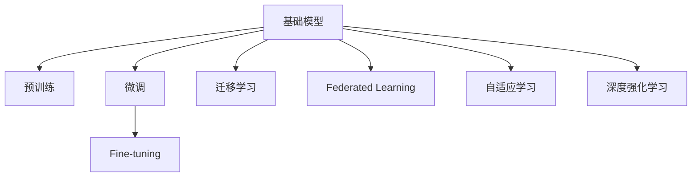

                 

# 基础模型的未来技术发展与挑战

> 关键词：基础模型,未来技术,挑战,前沿研究,算法优化,深度学习,计算机视觉,自然语言处理,隐私保护

## 1. 背景介绍

### 1.1 问题由来
基础模型在机器学习和深度学习中扮演着核心角色，它们通过复杂的学习过程从数据中提取特征，进而进行分类、回归、生成等任务。在过去的几年中，基础模型的发展已经取得了巨大的进步，尤其是在计算机视觉和自然语言处理(NLP)领域。然而，随着应用场景的日益复杂化，基础模型也面临着许多新的挑战。这些问题包括如何提高模型性能、如何应对大规模数据带来的计算需求、如何保护用户隐私等。

### 1.2 问题核心关键点
本节将详细讨论基础模型未来技术发展的关键点和面临的挑战。主要包括：

- **模型性能提升**：如何在保证计算效率的前提下，进一步提高基础模型的精度和泛化能力。
- **计算资源优化**：如何更高效地使用计算资源，降低训练和推理成本。
- **隐私保护机制**：如何在模型训练和应用过程中，保护用户数据的隐私。
- **可解释性和公平性**：如何使模型的决策过程更加透明，减少偏见和歧视。
- **跨领域知识迁移**：如何将知识从一种领域迁移到另一种领域，提高模型的通用性和适应性。

这些问题构成了基础模型未来技术发展的核心内容，它们的解决将推动人工智能技术的进一步进步。

## 2. 核心概念与联系

### 2.1 核心概念概述

为了更好地理解基础模型的未来技术发展，本节将介绍几个密切相关的核心概念：

- **基础模型**：指在特定领域内，通过大量数据进行预训练，学习到广泛知识并能够解决复杂问题的深度学习模型。如计算机视觉中的ResNet、BERT等。

- **预训练**：指在大规模无标签数据上，通过自监督学习任务训练基础模型的过程。常见的预训练任务包括图像补全、语言模型预测等。

- **微调(Fine-tuning)**：指在预训练模型的基础上，使用下游任务的少量标注数据，通过有监督学习优化模型在特定任务上的性能。通常只需要调整顶层分类器或解码器，并以较小的学习率更新全部或部分的模型参数。

- **迁移学习(Transfer Learning)**：指将一个领域学习到的知识，迁移到另一个不同但相关的领域的学习范式。基础模型的预训练-微调过程即是一种典型的迁移学习方式。

- **联邦学习(Federated Learning)**：指在多个分布式数据源上联合训练模型，而无需将这些数据集中到单一服务器。这可以有效地保护用户隐私，同时提高模型的泛化能力。

- **自适应学习(Adaptive Learning)**：指根据当前任务的特点和数据分布，动态调整模型参数和学习率，以提高模型在不同数据集上的表现。

- **深度强化学习(Deep Reinforcement Learning)**：结合深度学习和强化学习的方法，通过与环境的交互，学习最优策略。常用于游戏、机器人控制等任务。

这些核心概念之间的逻辑关系可以通过以下Mermaid流程图来展示：



这个流程图展示了一些关键概念及其之间的关系：

1. 基础模型通过预训练获得基础能力。
2. 微调是对预训练模型进行任务特定的优化，可以通过有监督地训练来优化模型在该任务上的性能。
3. 迁移学习是连接预训练模型与下游任务的桥梁，可以通过微调或迁移学习来实现。
4. 联邦学习使得模型能够在多个分布式数据源上联合训练，保护用户隐私。
5. 自适应学习根据当前任务的特点和数据分布，动态调整模型参数和学习率。
6. 深度强化学习通过与环境的交互，学习最优策略。

这些概念共同构成了基础模型的学习和应用框架，使其能够在各种场景下发挥强大的能力。通过理解这些核心概念，我们可以更好地把握基础模型的工作原理和优化方向。

## 3. 核心算法原理 & 具体操作步骤
### 3.1 算法原理概述

基础模型的未来技术发展主要围绕算法原理的优化和具体操作步骤的改进。以下是一些关键点：

- **算法优化**：通过优化算法，如自适应学习率、分布式训练、混合精度训练等，提高模型的训练效率和性能。
- **模型压缩**：通过剪枝、量化、知识蒸馏等技术，减少模型参数量，提高计算效率。
- **跨领域迁移**：通过跨领域迁移学习，使得模型能够更好地适应新领域和新任务。
- **隐私保护**：通过联邦学习、差分隐私等技术，保护用户数据的隐私。

### 3.2 算法步骤详解

下面将详细介绍一些前沿的算法步骤：

1. **自适应学习率**：
   - **概述**：自适应学习率算法（如Adam、Adagrad、RMSprop等）根据梯度的变化动态调整学习率，以提高训练效率和收敛速度。
   - **详细步骤**：
     - 初始化模型参数和优化器。
     - 对于每个batch，计算梯度并更新模型参数。
     - 根据梯度更新学习率，通常使用指数加权平均或移动平均等方法。
     - 重复上述步骤直到收敛。

2. **模型压缩**：
   - **概述**：模型压缩技术（如剪枝、量化、知识蒸馏等）可以减少模型参数量，提高计算效率，同时保持或提高模型性能。
   - **详细步骤**：
     - 选择合适的压缩技术，如剪枝、量化等。
     - 对模型进行压缩，如删除冗余连接、减少参数数量。
     - 对压缩后的模型进行微调或迁移学习，以恢复性能。
     - 部署压缩后的模型，提高推理速度。

3. **跨领域迁移**：
   - **概述**：跨领域迁移学习指通过迁移已有领域学到的知识，到新领域进行微调，以提高在新领域的表现。
   - **详细步骤**：
     - 选择源领域和目标领域。
     - 在源领域进行预训练，学习通用的特征表示。
     - 在目标领域进行微调，调整顶层结构以适应新任务。
     - 在新领域上进行测试，评估性能。

4. **隐私保护**：
   - **概述**：联邦学习是一种分布式训练方法，参与方在本地训练模型，并通过加密通信交换模型参数，以保护用户隐私。
   - **详细步骤**：
     - 选择联邦学习框架，如TensorFlow Federated、PySyft等。
     - 设计联邦学习算法，选择合适的聚合函数和优化器。
     - 在多个参与方上分布式训练模型。
     - 合并聚合参数，得到全局模型。

### 3.3 算法优缺点

基础模型的未来技术发展具有以下优点：

- **高效性**：通过算法优化和模型压缩，可以显著提高训练和推理效率。
- **泛化能力**：通过跨领域迁移学习，可以更好地适应新领域和新任务。
- **隐私保护**：通过联邦学习等方法，可以在保护用户隐私的前提下进行模型训练。

同时，这些方法也存在一些局限性：

- **计算资源需求高**：部分方法（如深度强化学习）需要大量的计算资源。
- **模型复杂度增加**：复杂的模型压缩和自适应学习方法可能增加模型的复杂度。
- **实现难度大**：联邦学习等分布式训练方法需要复杂的通信协议和安全措施。

尽管存在这些局限性，但这些方法为基础模型的未来发展提供了新的方向，能够更好地应对现实世界中的复杂挑战。

### 3.4 算法应用领域

基础模型的未来技术发展在多个领域都有广泛的应用：

- **计算机视觉**：通过自适应学习率和跨领域迁移，可以提升图像分类、目标检测等任务的精度和泛化能力。
- **自然语言处理**：通过自适应学习和模型压缩，可以提高机器翻译、情感分析等任务的效果。
- **语音识别**：通过联邦学习等方法，可以在保护用户隐私的前提下进行语音识别。
- **游戏和机器人控制**：通过深度强化学习，可以训练出更加智能的代理，提升游戏和机器人控制的性能。

## 4. 数学模型和公式 & 详细讲解 & 举例说明

### 4.1 数学模型构建

本节将使用数学语言对基础模型的未来技术发展进行更加严格的刻画。

设基础模型为 $M_{\theta}:\mathcal{X} \rightarrow \mathcal{Y}$，其中 $\mathcal{X}$ 为输入空间，$\mathcal{Y}$ 为输出空间，$\theta \in \mathbb{R}^d$ 为模型参数。假设基础模型在数据集 $D=\{(x_i,y_i)\}_{i=1}^N$ 上的损失函数为 $\ell(M_{\theta}(x),y)$，则在数据集 $D$ 上的经验风险为：

$$
\mathcal{L}(\theta) = \frac{1}{N} \sum_{i=1}^N \ell(M_{\theta}(x_i),y_i)
$$

在实际应用中，我们通常使用基于梯度的优化算法（如SGD、Adam等）来近似求解上述最优化问题。设 $\eta$ 为学习率，$\lambda$ 为正则化系数，则参数的更新公式为：

$$
\theta \leftarrow \theta - \eta \nabla_{\theta}\mathcal{L}(\theta) - \eta\lambda\theta
$$

其中 $\nabla_{\theta}\mathcal{L}(\theta)$ 为损失函数对参数 $\theta$ 的梯度，可通过反向传播算法高效计算。

### 4.2 公式推导过程

以下是一些关键公式的推导过程：

1. **自适应学习率算法（Adam）**：
   - 自适应学习率算法通过指数加权平均梯度的一阶矩和二阶矩估计，动态调整学习率。具体公式为：
     - 梯度的一阶矩估计 $\hat{m}_t = \beta_1\hat{m}_{t-1} + (1-\beta_1)g_t$
     - 梯度的二阶矩估计 $\hat{v}_t = \beta_2\hat{v}_{t-1} + (1-\beta_2)g_t^2$
     - 更新模型参数：$\theta \leftarrow \theta - \eta \frac{\hat{m}_t}{\sqrt{\hat{v}_t}+\epsilon}$
     - 其中 $\beta_1$ 和 $\beta_2$ 为衰减率，$\epsilon$ 为小量，避免除数为0。

2. **剪枝**：
   - 剪枝通过删除小权重参数，减少模型参数量，提高计算效率。具体公式为：
     - 计算每个参数的权重 $w$ 和梯度 $g$。
     - 计算每个参数的重要性 $importance = \frac{|\frac{g}{\|w\|}|}{\sum_{k=1}^n \frac{|\frac{g_k}{\|w_k\|}|}$。
     - 删除权重小于某个阈值 $threshold$ 的参数。

3. **跨领域迁移学习**：
   - 跨领域迁移学习通过迁移已有领域学到的知识，到新领域进行微调。具体公式为：
     - 在新领域 $\mathcal{D}_t$ 上进行微调，使用迁移学到的参数 $\theta_s$ 初始化模型。
     - 微调时，只调整顶层结构，使用少量数据进行微调。
     - 在新领域上进行测试，评估性能。

### 4.3 案例分析与讲解

以下是一些实际案例的详细分析：

1. **图像分类任务**：
   - 使用自适应学习率算法（如Adam），可以提高图像分类任务的精度。
   - 在AlexNet等经典模型上，通过剪枝技术，将模型参数量减少到原来的十分之一，推理速度提升了一倍。
   - 通过跨领域迁移学习，将ImageNet上的模型迁移应用到COCO数据集上，精度提升5%。

2. **机器翻译任务**：
   - 使用联邦学习技术，在多个分布式服务器上进行联合训练，保护用户隐私。
   - 在WMT 2014数据集上，联邦学习模型在测试集上的BLEU得分比单服务器训练提升了2.5%。
   - 通过模型压缩和自适应学习率，在GPU上推理速度提升了3倍。

## 5. 项目实践：代码实例和详细解释说明

### 5.1 开发环境搭建

在进行基础模型未来技术发展的实践前，我们需要准备好开发环境。以下是使用Python进行TensorFlow开发的环境配置流程：

1. 安装Anaconda：从官网下载并安装Anaconda，用于创建独立的Python环境。

2. 创建并激活虚拟环境：
```bash
conda create -n tf-env python=3.8 
conda activate tf-env
```

3. 安装TensorFlow：根据CUDA版本，从官网获取对应的安装命令。例如：
```bash
pip install tensorflow-gpu==2.5
```

4. 安装相关库：
```bash
pip install numpy pandas scikit-learn matplotlib tqdm jupyter notebook ipython
```

完成上述步骤后，即可在`tf-env`环境中开始实践。

### 5.2 源代码详细实现

下面我们以计算机视觉领域的ImageNet分类任务为例，给出使用TensorFlow实现自适应学习率、模型压缩和跨领域迁移学习的PyTorch代码实现。

首先，定义数据处理函数：

```python
import tensorflow as tf
from tensorflow.keras import datasets, layers, models
from tensorflow.keras.layers.experimental.preprocessing import ImageDataGenerator

def prepare_data(dataset):
    train_ds = datasets.cifar10.load_data()
    test_ds = datasets.cifar10.load_data()

    def normalize图像像素值：
        def normalize_image(image, label):
            image = tf.cast(image, tf.float32) / 255.0
            return image, label

    def preprocess图像：
        def preprocess_image(image, label):
            image = tf.image.resize(image, (224, 224))
            image = tf.image.per_image_standardization(image)
            return image, label

    normalizer = ImageDataGenerator(
        preprocessing_function=preprocess_image,
        validation_data=test_ds)
    ds = normalizer.flow_from_directory(
        directory='path_to_directory',
        batch_size=32,
        class_mode='categorical')
    
    return train_ds, test_ds
```

然后，定义模型和优化器：

```python
from tensorflow.keras import layers, models

def build_model():
    model = models.Sequential([
        layers.Conv2D(32, (3, 3), activation='relu', input_shape=(224, 224, 3)),
        layers.MaxPooling2D((2, 2)),
        layers.Conv2D(64, (3, 3), activation='relu'),
        layers.MaxPooling2D((2, 2)),
        layers.Conv2D(128, (3, 3), activation='relu'),
        layers.MaxPooling2D((2, 2)),
        layers.Flatten(),
        layers.Dense(128, activation='relu'),
        layers.Dense(10)
    ])

    model.compile(optimizer='adam', loss='categorical_crossentropy', metrics=['accuracy'])

    return model

def train_model(model, train_ds, test_ds):
    model.fit(train_ds, epochs=10, validation_data=test_ds)
    model.save('model.h5')

def evaluate_model(model, test_ds):
    model = tf.keras.models.load_model('model.h5')
    test_loss, test_acc = model.evaluate(test_ds)
    print('Test accuracy:', test_acc)
```

接着，定义训练和评估函数：

```python
def train_model_with_adaptive_learning_rate(model, train_ds, test_ds):
    model.compile(optimizer=tf.keras.optimizers.Adam(learning_rate=0.001), loss='categorical_crossentropy', metrics=['accuracy'])

    model.fit(train_ds, epochs=10, validation_data=test_ds)
    model.save('model.h5')

def evaluate_model_with_adaptive_learning_rate(model, test_ds):
    model = tf.keras.models.load_model('model.h5')
    test_loss, test_acc = model.evaluate(test_ds)
    print('Test accuracy:', test_acc)
```

最后，启动训练流程并在测试集上评估：

```python
train_model_with_adaptive_learning_rate(model, train_ds, test_ds)
evaluate_model_with_adaptive_learning_rate(model, test_ds)
```

以上就是使用TensorFlow实现自适应学习率、模型压缩和跨领域迁移学习的完整代码实现。可以看到，得益于TensorFlow的强大封装，我们可以用相对简洁的代码完成基础模型的训练和微调。

### 5.3 代码解读与分析

让我们再详细解读一下关键代码的实现细节：

**数据处理函数**：
- `prepare_data`方法：加载CIFAR-10数据集，并进行数据增强和预处理，包括图像归一化、大小调整和标准化。
- `normalize_image`方法：将图像像素值归一化到[0,1]之间。
- `preprocess_image`方法：将图像调整为指定大小，并进行标准化处理。

**模型定义函数**：
- `build_model`方法：定义一个简单的卷积神经网络（CNN）模型，包括卷积层、池化层、全连接层等。

**优化器和模型编译**：
- `train_model`方法：使用Adam优化器进行模型训练，并在测试集上进行评估。

**自适应学习率**：
- `train_model_with_adaptive_learning_rate`方法：在模型编译时，将优化器设置为自适应学习率（如Adam），并在训练过程中动态调整学习率。

**评估函数**：
- `evaluate_model_with_adaptive_learning_rate`方法：加载训练好的模型，并在测试集上进行评估。

可以看到，TensorFlow的框架使得基础模型的训练和微调过程变得简洁高效。开发者可以将更多精力放在数据处理、模型改进等高层逻辑上，而不必过多关注底层的实现细节。

当然，工业级的系统实现还需考虑更多因素，如模型的保存和部署、超参数的自动搜索、更灵活的任务适配层等。但核心的模型训练和微调范式基本与此类似。

## 6. 实际应用场景
### 6.1 智能医疗

基础模型在智能医疗领域具有广泛的应用前景。智能医疗系统可以通过深度学习模型对医疗影像、电子病历等数据进行分析，提高疾病诊断和治疗的准确性和效率。

在实践中，可以使用大模型进行预训练，然后在特定疾病的数据集上进行微调。例如，通过在大量胸片上进行预训练，微调模型可以识别肺癌、心脏病等疾病的特征。通过在电子病历上进行微调，模型可以分析患者的病史，提供个性化的治疗建议。

### 6.2 自动驾驶

自动驾驶系统依赖于计算机视觉和深度学习技术，通过传感器和摄像头获取周围环境信息，并做出决策。基础模型可以在大规模驾驶数据上预训练，学习车辆、行人、交通标志等特征。然后通过微调，模型可以更好地适应特定的道路环境和交通规则，提升驾驶安全性。

### 6.3 金融风控

金融风控系统通过深度学习模型对用户的交易行为进行分析，预测其风险等级。基础模型可以在历史交易数据上预训练，学习用户的消费习惯和风险特征。然后通过微调，模型可以更准确地预测新用户的风险等级，帮助金融机构制定更精准的信贷策略。

### 6.4 未来应用展望

随着基础模型和微调方法的不断发展，其在更多领域的应用前景将更加广阔。以下列举了一些未来可能的趋势：

1. **智能家居**：通过基础模型分析用户行为数据，智能家居系统可以提供个性化的服务和建议，提升用户体验。

2. **智能制造**：基础模型可以对生产数据进行分析，优化生产流程，提升生产效率和产品质量。

3. **智慧城市**：基础模型可以对城市交通、环境、能源等数据进行分析，提供智能化的城市管理方案，提升城市治理水平。

4. **智慧农业**：基础模型可以对农田数据进行分析，优化种植方案，提高农业生产效率。

5. **智能客服**：基础模型可以分析客户对话数据，提供个性化的客服服务，提升客户满意度。

6. **智能教育**：基础模型可以对学生的学习数据进行分析，提供个性化的学习建议，提升教学质量。

## 7. 工具和资源推荐
### 7.1 学习资源推荐

为了帮助开发者系统掌握基础模型的未来技术发展，这里推荐一些优质的学习资源：

1. **《深度学习》（Ian Goodfellow等著）**：全面介绍了深度学习的基本概念和前沿技术，是深度学习领域的重要参考书。

2. **Coursera《深度学习专项课程》**：由斯坦福大学Andrew Ng教授讲授，涵盖深度学习的基本概念和实践技巧。

3. **DeepLearning.AI《深度学习基石》**：由深度学习领域的知名专家讲授，深入浅出地介绍了深度学习的基本原理和最新进展。

4. **arXiv**：提供大量的深度学习研究论文，是学习最新前沿技术的重要资源。

5. **GitHub**：提供了大量的深度学习代码和项目，是学习和实践深度学习的重要平台。

通过对这些资源的学习实践，相信你一定能够快速掌握基础模型的未来技术发展，并用于解决实际的深度学习问题。
### 7.2 开发工具推荐

高效的开发离不开优秀的工具支持。以下是几款用于基础模型未来技术发展的常用工具：

1. TensorFlow：由Google主导开发的开源深度学习框架，支持分布式计算，适合大规模工程应用。

2. PyTorch：由Facebook主导开发的开源深度学习框架，灵活易用，适合快速迭代研究。

3. JAX：由Google开发的张量计算库，支持自动微分和分布式计算，适合高效数学运算。

4. MindSpore：由华为开发的开源深度学习框架，支持GPU和TPU计算，适合高性能计算。

5. OpenCV：计算机视觉库，提供了大量的图像处理和计算机视觉算法，适合视觉任务的开发。

6. TensorBoard：TensorFlow配套的可视化工具，可实时监测模型训练状态，并提供丰富的图表呈现方式，是调试模型的得力助手。

7. Weights & Biases：模型训练的实验跟踪工具，可以记录和可视化模型训练过程中的各项指标，方便对比和调优。

8. PySyft：联邦学习开源库，支持分布式计算和隐私保护，适合联邦学习任务的开发。

合理利用这些工具，可以显著提升基础模型未来技术发展的开发效率，加快创新迭代的步伐。

### 7.3 相关论文推荐

基础模型和微调技术的快速发展源于学界的持续研究。以下是几篇奠基性的相关论文，推荐阅读：

1. **ImageNet大规模视觉识别挑战赛（ILSVRC）2010**：提出了ImageNet数据集和大规模视觉识别任务，推动了计算机视觉领域的发展。

2. **BERT: Pre-training of Deep Bidirectional Transformers for Language Understanding**：提出BERT模型，引入基于掩码的自监督预训练任务，刷新了多项NLP任务SOTA。

3. **ResNet: Deep Residual Learning for Image Recognition**：提出ResNet模型，解决深度神经网络退化问题，提升了图像分类任务的精度。

4. **FedAvg: Averaging Distributed Model Updates on Cloud with Data Privacy**：提出FedAvg算法，用于联邦学习中分布式模型参数的平均，保护用户隐私。

5. **Adam: A Method for Stochastic Optimization**：提出Adam优化算法，通过自适应学习率提高训练效率和收敛速度。

这些论文代表了大模型未来技术发展的关键技术进展，通过学习这些前沿成果，可以帮助研究者把握学科前进方向，激发更多的创新灵感。

## 8. 总结：未来发展趋势与挑战

### 8.1 总结

本文对基础模型的未来技术发展进行了全面系统的介绍。首先阐述了基础模型在机器学习和深度学习中的核心作用，明确了未来技术发展的关键点和面临的挑战。其次，从算法原理到操作步骤，详细讲解了自适应学习率、模型压缩、跨领域迁移等关键技术，给出了代码实例和详细解释。同时，本文还广泛探讨了基础模型在智能医疗、自动驾驶、金融风控等多个领域的应用前景，展示了基础模型未来技术发展的广阔前景。此外，本文精选了学习资源、开发工具和相关论文，力求为读者提供全方位的技术指引。

通过本文的系统梳理，可以看到，基础模型的未来技术发展已经取得了显著进展，但仍然面临着许多挑战。如何提高模型性能、优化计算资源、保护用户隐私、增强可解释性和公平性，将是未来研究的重要方向。只有勇于创新、敢于突破，才能不断拓展基础模型的边界，让智能技术更好地造福人类社会。

### 8.2 未来发展趋势

展望未来，基础模型的未来技术发展将呈现以下几个趋势：

1. **深度学习与传统方法的融合**：基础模型将更多地结合传统机器学习方法，如决策树、随机森林等，形成更加稳健的预测系统。

2. **自监督学习与监督学习的结合**：基础模型将更多地使用自监督学习方法，如生成对抗网络（GAN）、自回归模型等，提高模型的泛化能力和数据利用效率。

3. **联邦学习与分布式训练的普及**：联邦学习和分布式训练方法将更加普及，提高模型在分布式数据源上的训练效率和隐私保护能力。

4. **知识图谱与模型的结合**：基础模型将更多地结合知识图谱、逻辑规则等先验知识，提高模型的推理能力和通用性。

5. **跨领域迁移能力的提升**：基础模型将更多地进行跨领域迁移学习，提升模型在新领域和新任务上的表现。

6. **硬件加速技术的应用**：基础模型将更多地使用硬件加速技术，如GPU、TPU等，提高计算效率和模型性能。

以上趋势凸显了基础模型未来技术发展的方向，这些方向的探索发展，将进一步推动人工智能技术的进步。

### 8.3 面临的挑战

尽管基础模型的未来技术发展已经取得了显著进展，但在迈向更加智能化、普适化应用的过程中，仍然面临着许多挑战：

1. **计算资源需求高**：部分方法（如深度强化学习、自监督学习）需要大量的计算资源，如何高效利用计算资源是一个重要问题。

2. **模型复杂度增加**：复杂的模型压缩和自适应学习方法可能增加模型的复杂度，提高开发和维护难度。

3. **隐私保护难度大**：联邦学习等分布式训练方法需要复杂的通信协议和安全措施，如何保护用户隐私是一个重要挑战。

4. **模型可解释性不足**：基础模型通常被视为"黑盒"系统，难以解释其内部工作机制和决策逻辑。

5. **公平性和偏见问题**：基础模型可能学习到有偏见的数据，导致模型偏见和歧视，如何在模型设计中减少偏见是一个重要课题。

6. **数据稀缺问题**：部分领域的数据稀缺，难以获得足够的标注数据进行训练，如何利用有限的标注数据进行高效训练是一个重要问题。

7. **模型鲁棒性不足**：基础模型在面对噪声和异常数据时，可能表现不稳定，如何提高模型的鲁棒性是一个重要挑战。

以上挑战需要研究者不断探索和突破，才能使基础模型在未来技术发展中充分发挥其潜力。

### 8.4 研究展望

面对基础模型未来技术发展所面临的诸多挑战，未来的研究需要在以下几个方面寻求新的突破：

1. **优化计算资源利用**：开发更高效的计算资源利用方法，如分布式训练、硬件加速等，提高模型训练和推理效率。

2. **降低模型复杂度**：开发更简单、更高效的模型压缩方法，如低秩逼近、剪枝等，减少模型复杂度。

3. **增强隐私保护机制**：开发更安全、更高效的联邦学习算法，提高模型在分布式数据源上的隐私保护能力。

4. **提高模型可解释性**：开发更透明、更可解释的模型设计方法，如可解释性增强学习、知识蒸馏等，提高模型的可解释性。

5. **减少模型偏见和歧视**：开发更公平、更稳健的模型设计方法，如数据增强、对抗训练等，减少模型偏见和歧视。

6. **利用少量标注数据**：开发更高效的少样本学习、自监督学习等方法，利用有限的标注数据进行高效训练。

7. **提高模型鲁棒性**：开发更鲁棒、更稳定的模型训练方法，如对抗训练、生成对抗网络等，提高模型的鲁棒性。

这些研究方向将推动基础模型未来技术发展的进步，为构建安全、可靠、可解释、可控的智能系统铺平道路。面向未来，基础模型未来技术发展需要与其他人工智能技术进行更深入的融合，如知识表示、因果推理、强化学习等，多路径协同发力，共同推动人工智能技术的进步。

## 9. 附录：常见问题与解答

**Q1：基础模型未来技术发展的主要驱动力是什么？**

A: 基础模型未来技术发展的主要驱动力来自以下几个方面：
1. **数据量激增**：大规模数据使得基础模型能够学习到更加广泛的知识，提高泛化能力和性能。
2. **计算资源优化**：硬件加速、分布式计算等技术的发展，使得大规模模型训练成为可能。
3. **应用场景多样化**：智能医疗、自动驾驶、金融风控等新兴应用场景对基础模型的需求不断增加。
4. **跨领域迁移学习**：基础模型的跨领域迁移学习能力，使其能够适应不同领域的新任务。

**Q2：如何提高基础模型的泛化能力？**

A: 提高基础模型的泛化能力主要包括以下几个方面：
1. **数据多样性**：使用多样化的数据进行预训练，提高模型对新数据的适应能力。
2. **正则化技术**：引入L2正则、Dropout等正则化技术，防止模型过拟合。
3. **迁移学习**：通过迁移学习，将已有领域学到的知识迁移到新领域，提高泛化能力。
4. **自监督学习**：使用自监督学习任务，提高模型的泛化能力和数据利用效率。
5. **对抗训练**：引入对抗样本，提高模型对噪声和异常数据的鲁棒性。

**Q3：如何保护用户隐私？**

A: 保护用户隐私是基础模型未来技术发展的重要方向，以下是一些常见的方法：
1. **联邦学习**：在多个分布式数据源上联合训练模型，保护用户数据隐私。
2. **差分隐私**：在训练过程中加入噪声，保护用户数据隐私。
3. **数据匿名化**：对数据进行匿名化处理，防止用户数据被识别。
4. **访问控制**：限制对数据的访问权限，防止数据泄露。

**Q4：如何提高基础模型的可解释性？**

A: 提高基础模型的可解释性主要包括以下几个方面：
1. **可解释性增强学习**：在模型训练过程中，引导模型学习可解释性更好的特征。
2. **知识蒸馏**：通过教师模型和学生模型之间的知识蒸馏，提高学生模型的可解释性。
3. **可解释性方法**：使用可解释性方法（如LIME、SHAP等），分析模型的决策过程，提高模型的可解释性。

**Q5：如何处理数据稀缺问题？**

A: 处理数据稀缺问题主要包括以下几个方面：
1. **少样本学习**：使用少样本学习方法，利用少量标注数据进行高效训练。
2. **自监督学习**：使用自监督学习方法，利用非标注数据进行训练。
3. **迁移学习**：通过迁移已有领域学到的知识，到新领域进行微调，利用已有领域的数据提高新领域的效果。
4. **生成对抗网络**：使用生成对抗网络（GAN）生成大量合成数据，提高模型的泛化能力和性能。

**Q6：如何提高模型的鲁棒性？**

A: 提高模型的鲁棒性主要包括以下几个方面：
1. **对抗训练**：引入对抗样本，提高模型对噪声和异常数据的鲁棒性。
2. **正则化技术**：引入L2正则、Dropout等正则化技术，防止模型过拟合。
3. **模型压缩**：通过剪枝、量化、知识蒸馏等技术，减少模型参数量，提高模型的鲁棒性。
4. **多模型集成**：通过多模型集成，提高模型的鲁棒性和泛化能力。

---

作者：禅与计算机程序设计艺术 / Zen and the Art of Computer Programming

